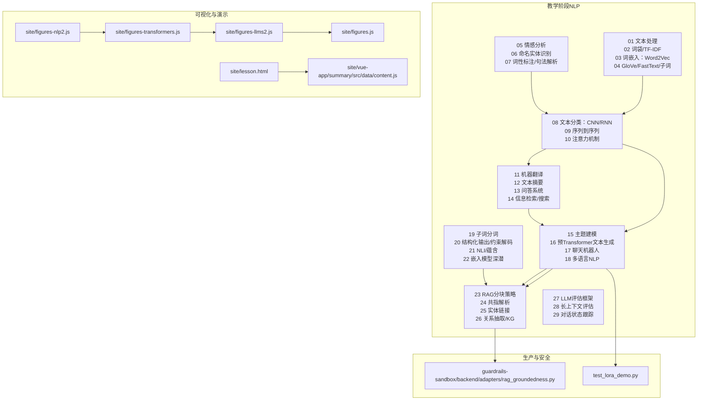
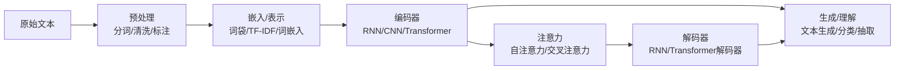
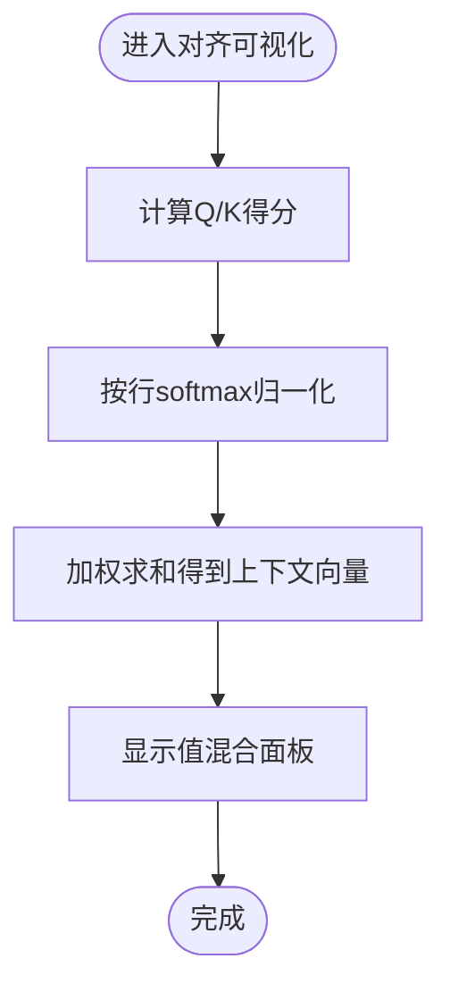
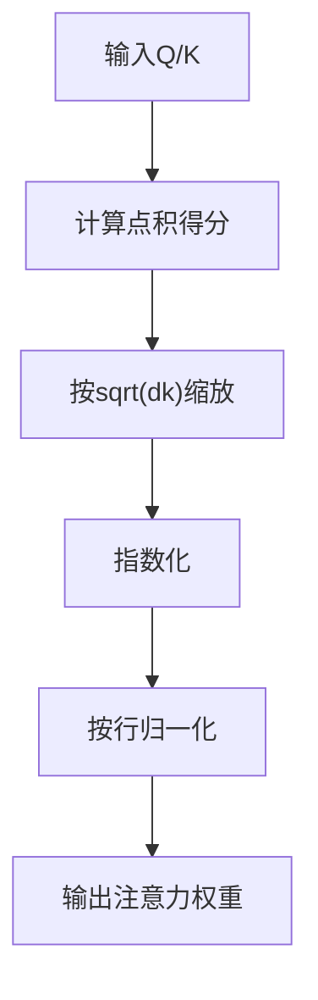
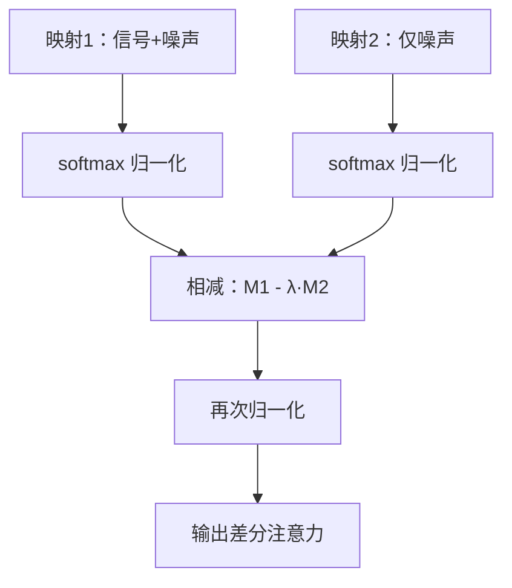
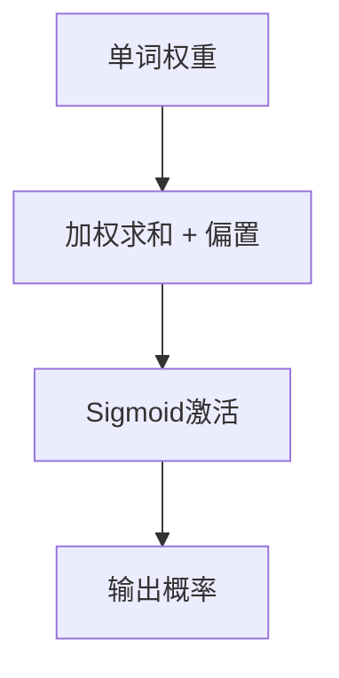
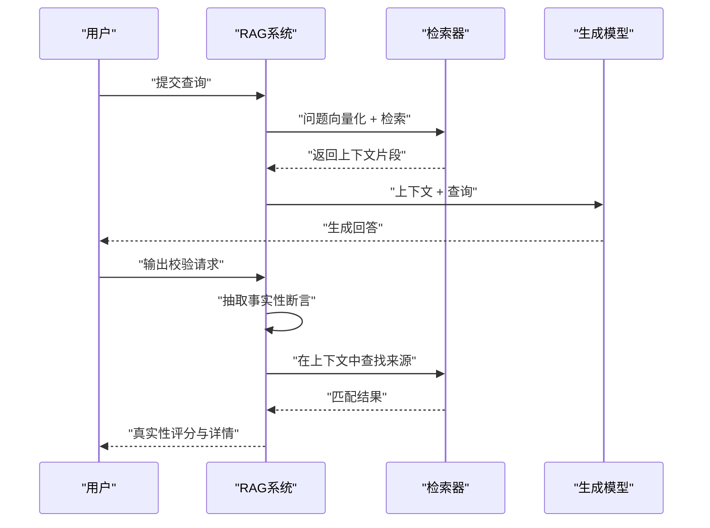
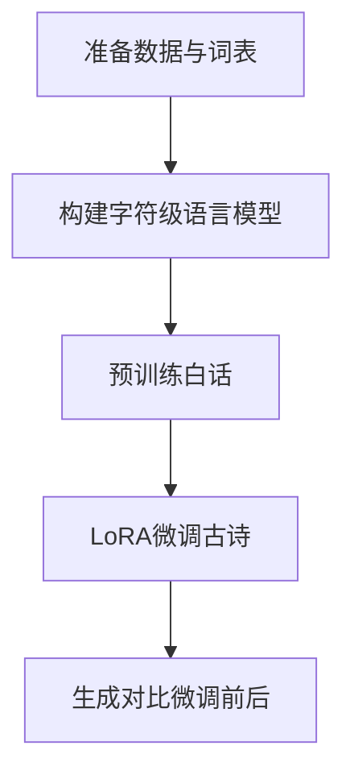
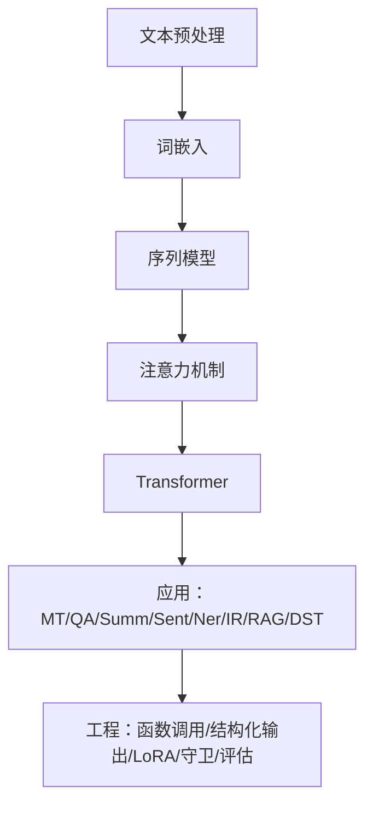
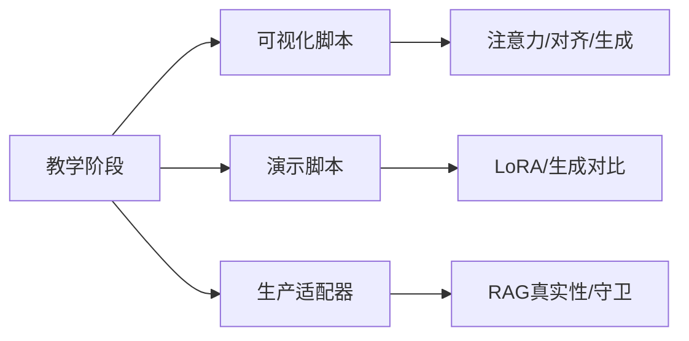

# 自然语言处理

<cite>
**本文引用的文件**
- [README.md](file://README.md)
- [site/figures-nlp2.js](file://site/figures-nlp2.js)
- [site/figures-transformers.js](file://site/figures-transformers.js)
- [site/figures-llms2.js](file://site/figures-llms2.js)
- [site/figures.js](file://site/figures.js)
- [site/lesson.html](file://site/lesson.html)
- [site/vue-app/summary/src/data/content.js](file://site/vue-app/summary/src/data/content.js)
- [guardrails-sandbox/backend/adapters/rag_groundedness.py](file://guardrails-sandbox/backend/adapters/rag_groundedness.py)
- [test_lora_demo.py](file://test_lora_demo.py)
- [glossary/myths.md](file://glossary/myths.md)
</cite>

## 目录
1. [引言](#引言)
2. [项目结构](#项目结构)
3. [核心组件](#核心组件)
4. [架构总览](#架构总览)
5. [详细组件分析](#详细组件分析)
6. [依赖关系分析](#依赖关系分析)
7. [性能考量](#性能考量)
8. [故障排查指南](#故障排查指南)
9. [结论](#结论)
10. [附录](#附录)

## 引言
本文件面向自然语言处理（NLP）课程，系统梳理从传统方法到现代Transformer架构的发展脉络，覆盖文本预处理、词嵌入、序列模型、注意力机制、序列到序列与机器翻译、问答系统、检索增强生成（RAG）、对话状态跟踪、以及文本生成、情感分析、命名实体识别等典型应用。文档以仓库中的教学阶段、可视化脚本、评估与安全适配器、以及演示脚本为依据，提供循序渐进的知识图谱与实践路径。

## 项目结构
该仓库以“阶段式学习路径”组织NLP教学内容，每个阶段包含文档、代码、笔记本、测验与输出材料；同时提供丰富的可视化脚本用于直观理解注意力、对齐、嵌入与生成过程；另有生产侧的Guardrails沙箱适配器用于RAG真实性检测与输出守卫。

图表来源
- [README.md:387-417](file://README.md#L387-L417)
- [site/figures-nlp2.js:169-369](file://site/figures-nlp2.js#L169-L369)
- [site/figures-transformers.js:19-164](file://site/figures-transformers.js#L19-L164)
- [site/figures-llms2.js:378-427](file://site/figures-llms2.js#L378-L427)
- [site/figures.js:393-407](file://site/figures.js#L393-L407)
- [site/lesson.html:3226-3232](file://site/lesson.html#L3226-L3232)
- [site/vue-app/summary/src/data/content.js:96-129](file://site/vue-app/summary/src/data/content.js#L96-L129)
- [guardrails-sandbox/backend/adapters/rag_groundedness.py:1-43](file://guardrails-sandbox/backend/adapters/rag_groundedness.py#L1-L43)
- [test_lora_demo.py:1-67](file://test_lora_demo.py#L1-L67)

章节来源
- [README.md:387-417](file://README.md#L387-L417)

## 核心组件
- 文本预处理与表示
  - 文本清洗、分词、词干化/词形还原、词性标注、命名实体识别（NER）等基础流程贯穿多个阶段。
  - 词袋模型与TF-IDF提供早期文本表示方法，随后过渡到分布式表示（Word2Vec、GloVe、FastText、子词）。
- 词嵌入与语义空间
  - Word2Vec、GloVe、FastText与子词（BPE、WordPiece、SentencePiece）等模型构建稠密语义向量，支持近邻检索与相似度计算。
- 序列模型与注意力
  - RNN/LSTM/GRU与CNN在文本分类与序列标注中的应用；序列到序列（Seq2Seq）与注意力对齐；Transformer自注意力与多头注意力。
- 生成与理解
  - 预Transformer文本生成、机器翻译、问答系统、文本摘要、情感分析、命名实体识别等任务。
- 现代架构与工程
  - Transformer、BERT/GPT、Encoder-Decoder、RAG、对话状态跟踪、函数调用与结构化输出、LoRA微调演示等。

章节来源
- [README.md:387-417](file://README.md#L387-L417)
- [site/figures-nlp2.js:169-369](file://site/figures-nlp2.js#L169-L369)
- [site/figures-transformers.js:19-164](file://site/figures-transformers.js#L19-L164)
- [site/figures-llms2.js:378-427](file://site/figures-llms2.js#L378-L427)
- [site/vue-app/summary/src/data/content.js:96-129](file://site/vue-app/summary/src/data/content.js#L96-L129)
- [test_lora_demo.py:1-67](file://test_lora_demo.py#L1-L67)

## 架构总览
下图展示从文本输入到生成/理解输出的关键路径：预处理→嵌入→编码/解码→注意力→生成或分类/抽取。

图表来源
- [site/figures-nlp2.js:169-369](file://site/figures-nlp2.js#L169-L369)
- [site/figures-transformers.js:19-164](file://site/figures-transformers.js#L19-L164)
- [site/figures-llms2.js:378-427](file://site/figures-llms2.js#L378-L427)

## 详细组件分析

### 组件A：注意力与对齐（序列到序列）
- 功能要点
  - 展示注意力热力图、softmax缩放因子的作用、源端到目标端的软对齐与重排序。
  - 通过交互控件调整锐利度，观察权重分布如何影响上下文聚合。
- 关键流程
  - 计算Q/K点积得分，按目标token行进行softmax归一化，得到注意力权重。
  - 使用权重对值向量进行加权求和，形成上下文向量。
- 实践价值
  - 帮助理解翻译任务中源词与目标词之间的对齐关系，以及注意力如何捕获长程依赖。

图表来源
- [site/figures-nlp2.js:169-185](file://site/figures-nlp2.js#L169-L185)

章节来源
- [site/figures-nlp2.js:169-185](file://site/figures-nlp2.js#L169-L185)

### 组件B：自注意力与缩放
- 功能要点
  - 解释为何除以sqrt(dk)，避免点积幅值随维度增长导致softmax饱和。
  - 展示不同维度下的logits分布与熵变化。
- 关键流程
  - 输入向量经线性变换得到Q/K；计算得分并缩放；指数化后归一化；输出概率分布。
- 实践价值
  - 理解注意力数值稳定性与维度敏感性，指导模型设计与超参设置。

图表来源
- [site/figures-transformers.js:141-164](file://site/figures-transformers.js#L141-L164)

章节来源
- [site/figures-transformers.js:141-164](file://site/figures-transformers.js#L141-L164)

### 组件C：差分注意力（Differential Attention）
- 功能要点
  - 通过两个softmax映射相减，抑制共模噪声，突出真实信号峰值。
  - 可调节λ以控制抑制强度，提升注意力聚焦能力。
- 关键流程
  - 分别对两组分布做softmax；按λ缩放第二张图；逐元素相减并再次归一化。
- 实践价值
  - 理解噪声抑制与信号增强的思路，有助于设计鲁棒的注意力模块。

图表来源
- [site/figures-llms2.js:378-427](file://site/figures-llms2.js#L378-L427)

章节来源
- [site/figures-llms2.js:378-427](file://site/figures-llms2.js#L378-L427)

### 组件D：情感分析（线性分类器）
- 功能要点
  - 将每个词的权重累加并加偏置，经sigmoid得到正类概率；通过拖拽权重观察决策边界。
- 关键流程
  - 单词级权重→求和→sigmoid→概率。
- 实践价值
  - 直观理解线性分类器如何组合局部特征形成全局判断。

图表来源
- [site/figures-nlp2.js:317-357](file://site/figures-nlp2.js#L317-L357)

章节来源
- [site/figures-nlp2.js:317-357](file://site/figures-nlp2.js#L317-L357)

### 组件E：RAG与真实性检测
- 功能要点
  - RAG四步：文档向量化→问题向量化→相似度检索→上下文+问题联合生成。
  - 真实性检测：将回答拆分为“事实性断言”，在上下文中寻找来源，未找到则判定为幻觉风险。
- 关键流程
  - 无上下文时跳过检测；否则统计未命中断言比例，给出置信度与延迟。
- 实践价值
  - 降低大模型幻觉，保障生成内容可追溯与可信。

图表来源
- [site/vue-app/summary/src/data/content.js:96-129](file://site/vue-app/summary/src/data/content.js#L96-L129)
- [guardrails-sandbox/backend/adapters/rag_groundedness.py:16-43](file://guardrails-sandbox/backend/adapters/rag_groundedness.py#L16-L43)

章节来源
- [site/vue-app/summary/src/data/content.js:96-129](file://site/vue-app/summary/src/data/content.js#L96-L129)
- [guardrails-sandbox/backend/adapters/rag_groundedness.py:16-43](file://guardrails-sandbox/backend/adapters/rag_groundedness.py#L16-L43)

### 组件F：LoRA微调演示（字符级语言模型）
- 功能要点
  - 使用字符级语言模型，先在白话文本上预训练，再以LoRA微调迁移到古诗风格，前后生成对比验证风格迁移效果。
- 关键流程
  - 构建字符词表→滑窗构造样本→定义两层MLP模拟Transformer前馈→LoRA注入→训练与生成。
- 实践价值
  - 展示低秩适应（LoRA）在风格迁移与高效微调中的应用。

图表来源
- [test_lora_demo.py:1-67](file://test_lora_demo.py#L1-L67)

章节来源
- [test_lora_demo.py:1-67](file://test_lora_demo.py#L1-L67)

### 组件G：概念性概览（从传统到现代）
- 文本预处理：清洗、分词、词干化/词形还原、词性标注、NER。
- 词嵌入：从词袋/TF-IDF到Word2Vec/GloVe/FastText/子词，再到上下文感知嵌入。
- 序列模型：RNN/CNN→注意力→Transformer。
- 应用：机器翻译、问答、摘要、情感分析、NER、信息检索、RAG、对话状态跟踪。
- 工程：函数调用、结构化输出、约束解码、LoRA微调、守卫与评估。

（本图为概念性流程，无需图表来源）

## 依赖关系分析
- 教学阶段之间存在递进依赖：基础（文本处理、词表示）→序列模型（RNN/CNN/注意力）→现代架构（Transformer）→应用（RAG、对话状态跟踪等）。
- 可视化脚本服务于理论与实践结合：通过交互式动画加深对注意力、对齐、生成过程的理解。
- 生产适配器与演示脚本支撑工程落地：RAG真实性检测保障输出质量；LoRA演示体现高效微调策略。

图表来源
- [README.md:387-417](file://README.md#L387-L417)
- [site/figures-nlp2.js:169-369](file://site/figures-nlp2.js#L169-L369)
- [site/figures-transformers.js:19-164](file://site/figures-transformers.js#L19-L164)
- [site/figures-llms2.js:378-427](file://site/figures-llms2.js#L378-L427)
- [guardrails-sandbox/backend/adapters/rag_groundedness.py:16-43](file://guardrails-sandbox/backend/adapters/rag_groundedness.py#L16-L43)
- [test_lora_demo.py:1-67](file://test_lora_demo.py#L1-L67)

章节来源
- [README.md:387-417](file://README.md#L387-L417)

## 性能考量
- 注意力缩放：除以sqrt(dk)可缓解高维点积导致的梯度消失/爆炸，提升数值稳定性。
- 差分注意力：通过两路softmax相减抑制共模噪声，提高信号聚焦能力，适合长序列与复杂上下文。
- RAG检索：相似度计算采用余弦相似度，关注方向一致性；可结合关键词提权、兜底搜索与误判过滤优化召回与精度。
- LoRA微调：低秩矩阵注入显著减少训练参数，加速收敛并保持风格迁移效果。

（本节为通用指导，无需章节来源）

## 故障排查指南
- RAG输出不可信
  - 症状：回答包含无法在上下文中溯源的事实性断言。
  - 排查：确认上下文是否为空；检查断言抽取与匹配逻辑；适当降低阈值或增加兜底检索。
- 注意力权重过于分散
  - 症状：注意力对所有位置均有较大权重，缺乏焦点。
  - 排查：检查dk缩放是否正确；尝试增大λ（差分注意力）；检查Q/K初始化与正交性。
- 生成质量不稳定
  - 症状：风格漂移或模式不一致。
  - 排查：检查LoRA秩大小与注入层；核对预训练与微调数据分布；使用温度采样与top-p采样稳定输出。

章节来源
- [guardrails-sandbox/backend/adapters/rag_groundedness.py:16-43](file://guardrails-sandbox/backend/adapters/rag_groundedness.py#L16-L43)
- [site/figures-llms2.js:378-427](file://site/figures-llms2.js#L378-L427)
- [test_lora_demo.py:1-67](file://test_lora_demo.py#L1-L67)

## 结论
本课程以阶段化路径串联NLP从基础到前沿的知识体系，配合可视化脚本与工程适配器，帮助学习者建立扎实的理论基础与工程能力。建议按顺序完成各阶段，重点掌握注意力机制、Transformer架构、RAG与对话状态跟踪等现代技术，并通过演示脚本与评估工具巩固实践技能。

## 附录
- 术语与误区
  - “Transformer理解顺序靠位置编码”并非事实：位置编码是注入顺序信息的手段，非天然顺序理解。
  - “预训练只是读互联网”并非全部真相：预训练通过大规模next-token预测学习语法、事实与推理模式，但数据质量至关重要。
  - “RLHF使AI对齐人类价值观”并非终极方案：RLHF反映特定评价者的偏好，需与其他工具共同推进对齐工作。

章节来源
- [glossary/myths.md:85-108](file://glossary/myths.md#L85-L108)