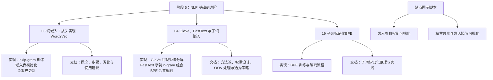
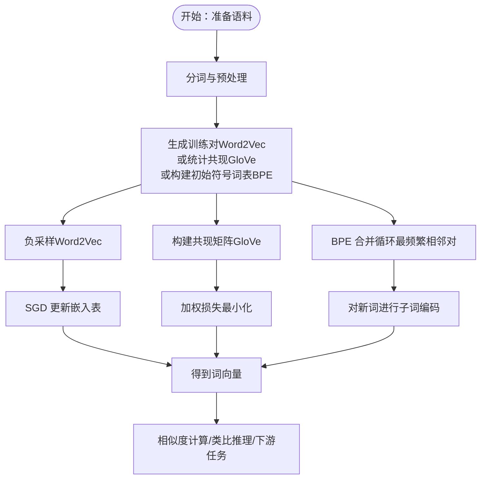
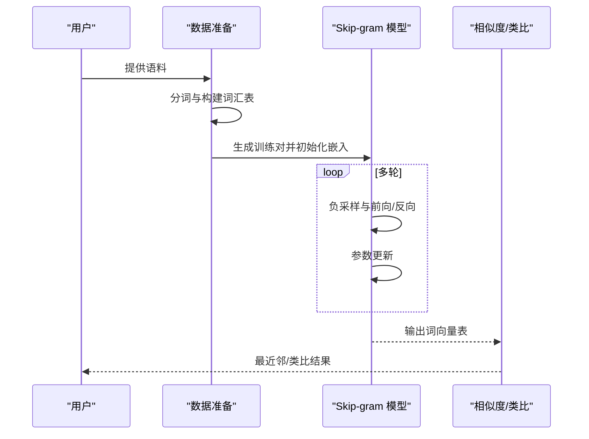
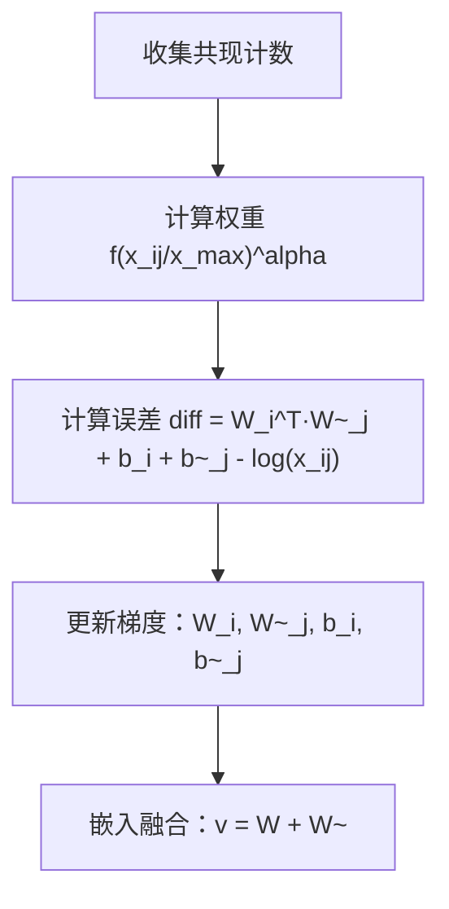
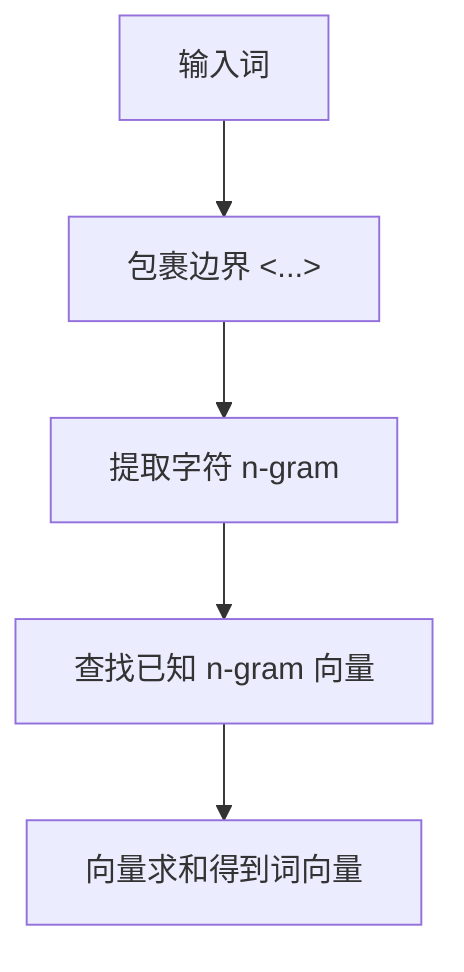
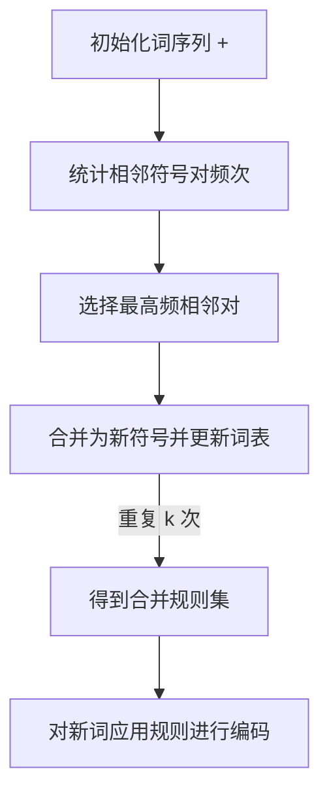
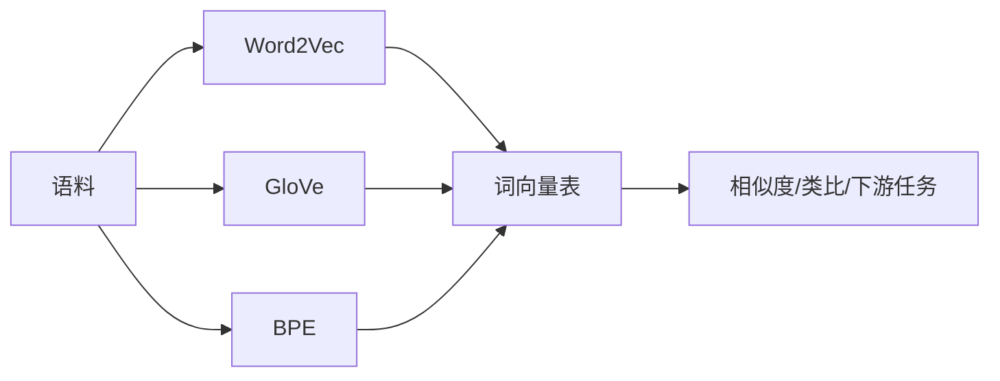

# 词嵌入与表示学习

<cite>
**本文档引用的文件**
- [phases/05-nlp-foundations-to-advanced/03-word-embeddings-word2vec/code/main.py](file://phases/05-nlp-foundations-to-advanced/03-word-embeddings-word2vec/code/main.py)
- [phases/05-nlp-foundations-to-advanced/03-word-embeddings-word2vec/docs/zh.md](file://phases/05-nlp-foundations-to-advanced/03-word-embeddings-word2vec/docs/zh.md)
- [phases/05-nlp-foundations-to-advanced/04-glove-fasttext-subword/code/main.py](file://phases/05-nlp-foundations-to-advanced/04-glove-fasttext-subword/code/main.py)
- [phases/05-nlp-foundations-to-advanced/04-glove-fasttext-subword/docs/zh.md](file://phases/05-nlp-foundations-to-advanced/04-glove-fasttext-subword/docs/zh.md)
- [phases/05-nlp-foundations-to-advanced/19-subword-tokenization/code/main.py](file://phases/05-nlp-foundations-to-advanced/19-subword-tokenization/code/main.py)
- [phases/05-nlp-foundations-to-advanced/19-subword-tokenization/docs/en.md](file://phases/05-nlp-foundations-to-advanced/19-subword-tokenization/docs/en.md)
- [site/lesson-figures.js](file://site/lesson-figures.js)
- [site/figures-llms2.js](file://site/figures-llms2.js)
- [test_embedding.py](file://test_embedding.py)
</cite>

## 目录
1. [引言](#引言)
2. [项目结构](#项目结构)
3. [核心组件](#核心组件)
4. [架构总览](#架构总览)
5. [详细组件分析](#详细组件分析)
6. [依赖关系分析](#依赖关系分析)
7. [性能考量](#性能考量)
8. [故障排查指南](#故障排查指南)
9. [结论](#结论)
10. [附录](#附录)

## 引言
本课程围绕“词嵌入与表示学习”展开，系统梳理从传统 one-hot 到分布式表示的发展脉络，深入讲解 Word2Vec 的两种架构（Skip-gram 与 CBOW）、GloVe 的共现矩阵分解思想、FastText 的子词嵌入与 OOV 处理能力，并介绍 BPE 子词标记化及其在现代大模型中的应用。课程提供完整代码实现与使用示例，涵盖词相似度计算、类比推理等典型任务，帮助读者建立从理论到实践的完整知识体系。

## 项目结构
本课程相关内容主要分布在 NLP 进阶阶段的三个模块中：
- Word2Vec 实现与教学文档
- GloVe、FastText 与子词嵌入
- 子词标记化（BPE）

图表来源
- [site/lesson-figures.js:626-648](file://site/lesson-figures.js#L626-L648)
- [site/figures-llms2.js:429-450](file://site/figures-llms2.js#L429-L450)

章节来源
- [phases/05-nlp-foundations-to-advanced/03-word-embeddings-word2vec/code/main.py:1-122](file://phases/05-nlp-foundations-to-advanced/03-word-embeddings-word2vec/code/main.py#L1-L122)
- [phases/05-nlp-foundations-to-advanced/04-glove-fasttext-subword/code/main.py:1-89](file://phases/05-nlp-foundations-to-advanced/04-glove-fasttext-subword/code/main.py#L1-L89)
- [phases/05-nlp-foundations-to-advanced/19-subword-tokenization/code/main.py:1-112](file://phases/05-nlp-foundations-to-advanced/19-subword-tokenization/code/main.py#L1-L112)

## 核心组件
- Word2Vec（Skip-gram + 负采样）：从语料中抽取中心词-上下文对，使用两个嵌入表并通过负采样将大规模 softmax 降低为二分类训练，最终得到稠密词向量。
- GloVe：基于共现矩阵分解，通过加权最小二乘拟合 log 共现频次，结合中心词与上下文偏置，训练稳定且成本较低。
- FastText：将词表示为其字符 n-gram 的向量和，从而对 OOV 与形态变化具备鲁棒性。
- BPE：通过迭代合并高频相邻符号，学习子词单元，使任何词均可分解为已知片段，避免 OOV。

章节来源
- [phases/05-nlp-foundations-to-advanced/03-word-embeddings-word2vec/docs/zh.md:10-38](file://phases/05-nlp-foundations-to-advanced/03-word-embeddings-word2vec/docs/zh.md#L10-L38)
- [phases/05-nlp-foundations-to-advanced/04-glove-fasttext-subword/docs/zh.md:22-30](file://phases/05-nlp-foundations-to-advanced/04-glove-fasttext-subword/docs/zh.md#L22-L30)

## 架构总览
下图展示了三类方法的核心训练流程与数据流：

图表来源
- [phases/05-nlp-foundations-to-advanced/03-word-embeddings-word2vec/code/main.py:22-73](file://phases/05-nlp-foundations-to-advanced/03-word-embeddings-word2vec/code/main.py#L22-L73)
- [phases/05-nlp-foundations-to-advanced/04-glove-fasttext-subword/code/main.py:13-43](file://phases/05-nlp-foundations-to-advanced/04-glove-fasttext-subword/code/main.py#L13-L43)
- [phases/05-nlp-foundations-to-advanced/19-subword-tokenization/code/main.py:40-56](file://phases/05-nlp-foundations-to-advanced/19-subword-tokenization/code/main.py#L40-L56)

## 详细组件分析

### Word2Vec：Skip-gram 与负采样
- 数据准备：从文档集合提取 token，构建词汇表；按滑动窗口生成（中心词，上下文）正样本对。
- 嵌入表：初始化两个嵌入矩阵 W（中心词）与 W'（上下文词），训练后保留 W。
- 负采样：对每个正样本，从词表中采样若干负样本，将 softmax 转换为二分类目标，显著降低计算复杂度。
- 训练过程：遍历训练对，计算正负样本得分与梯度，更新 W 与 W'。
- 任务应用：最近邻检索与类比推理（king - man + woman ≈ queen）。

图表来源
- [phases/05-nlp-foundations-to-advanced/03-word-embeddings-word2vec/code/main.py:58-73](file://phases/05-nlp-foundations-to-advanced/03-word-embeddings-word2vec/code/main.py#L58-L73)
- [phases/05-nlp-foundations-to-advanced/03-word-embeddings-word2vec/docs/zh.md:139-173](file://phases/05-nlp-foundations-to-advanced/03-word-embeddings-word2vec/docs/zh.md#L139-L173)

章节来源
- [phases/05-nlp-foundations-to-advanced/03-word-embeddings-word2vec/code/main.py:9-122](file://phases/05-nlp-foundations-to-advanced/03-word-embeddings-word2vec/code/main.py#L9-L122)
- [phases/05-nlp-foundations-to-advanced/03-word-embeddings-word2vec/docs/zh.md:43-173](file://phases/05-nlp-foundations-to-advanced/03-word-embeddings-word2vec/docs/zh.md#L43-L173)

### GloVe：共现矩阵分解
- 共现统计：在固定窗口内统计词对共现次数，并按距离加权。
- 损失函数：通过加权最小二乘拟合 log 共现频次，引入中心词与上下文偏置，避免高频词主导。
- 参数更新：对每个共现对计算权重与误差，更新嵌入与偏置。
- 嵌入融合：将中心词与上下文嵌入相加，经验上提升效果。

图表来源
- [phases/05-nlp-foundations-to-advanced/04-glove-fasttext-subword/code/main.py:39-77](file://phases/05-nlp-foundations-to-advanced/04-glove-fasttext-subword/code/main.py#L39-L77)
- [phases/05-nlp-foundations-to-advanced/04-glove-fasttext-subword/docs/zh.md:32-81](file://phases/05-nlp-foundations-to-advanced/04-glove-fasttext-subword/docs/zh.md#L32-L81)

章节来源
- [phases/05-nlp-foundations-to-advanced/04-glove-fasttext-subword/code/main.py:39-77](file://phases/05-nlp-foundations-to-advanced/04-glove-fasttext-subword/code/main.py#L39-L77)
- [phases/05-nlp-foundations-to-advanced/04-glove-fasttext-subword/docs/zh.md:22-81](file://phases/05-nlp-foundations-to-advanced/04-glove-fasttext-subword/docs/zh.md#L22-L81)

### FastText：子词嵌入与 OOV 处理
- 字符 n-gram：对词进行边界包裹并提取 n-gram（通常 3–6），形成词的组成集合。
- 向量合成：词向量为所有已知 n-gram 向量之和；若无任何已知 n-gram，则无法生成向量。
- OOV 容忍：即使遇到未登录词，只要其部分 n-gram 已知，即可获得合理向量，提升形态变化与拼写错误的鲁棒性。

图表来源
- [phases/05-nlp-foundations-to-advanced/04-glove-fasttext-subword/code/main.py:4-11](file://phases/05-nlp-foundations-to-advanced/04-glove-fasttext-subword/code/main.py#L4-L11)
- [phases/05-nlp-foundations-to-advanced/04-glove-fasttext-subword/docs/zh.md:82-111](file://phases/05-nlp-foundations-to-advanced/04-glove-fasttext-subword/docs/zh.md#L82-L111)

章节来源
- [phases/05-nlp-foundations-to-advanced/04-glove-fasttext-subword/code/main.py:4-11](file://phases/05-nlp-foundations-to-advanced/04-glove-fasttext-subword/code/main.py#L4-L11)
- [phases/05-nlp-foundations-to-advanced/04-glove-fasttext-subword/docs/zh.md:26-111](file://phases/05-nlp-foundations-to-advanced/04-glove-fasttext-subword/docs/zh.md#L26-L111)

### BPE：子词标记化与编码
- 初始化：将每个词表示为字符序列并附加结尾标记。
- 合并循环：统计相邻符号对频次，选取最高频者合并，重复 k 次得到合并规则。
- 编码应用：对新词按合并规则进行贪心替换，得到子词序列；任何词均可被分解，避免 OOV。

图表来源
- [phases/05-nlp-foundations-to-advanced/19-subword-tokenization/code/main.py:13-56](file://phases/05-nlp-foundations-to-advanced/19-subword-tokenization/code/main.py#L13-L56)
- [phases/05-nlp-foundations-to-advanced/19-subword-tokenization/docs/en.md](file://phases/05-nlp-foundations-to-advanced/19-subword-tokenization/docs/en.md)

章节来源
- [phases/05-nlp-foundations-to-advanced/19-subword-tokenization/code/main.py:40-112](file://phases/05-nlp-foundations-to-advanced/19-subword-tokenization/code/main.py#L40-L112)
- [phases/05-nlp-foundations-to-advanced/19-subword-tokenization/docs/en.md](file://phases/05-nlp-foundations-to-advanced/19-subword-tokenization/docs/en.md)

## 依赖关系分析
- 模块内聚：各模块分别聚焦单一方法（Word2Vec、GloVe、FastText、BPE），职责清晰。
- 外部依赖：Word2Vec 文档中提及 gensim；GloVe/FastText/BPE 文档中给出预训练模型与 Hugging Face tokenizer 的使用示例。
- 数据流耦合：Word2Vec 与 GloVe 均依赖语料统计（滑窗/共现），BPE 依赖字符级符号统计；三者最终均输出词向量表，用于下游相似度与推理任务。

图表来源
- [phases/05-nlp-foundations-to-advanced/03-word-embeddings-word2vec/docs/zh.md:174-206](file://phases/05-nlp-foundations-to-advanced/03-word-embeddings-word2vec/docs/zh.md#L174-L206)
- [phases/05-nlp-foundations-to-advanced/04-glove-fasttext-subword/docs/zh.md:175-201](file://phases/05-nlp-foundations-to-advanced/04-glove-fasttext-subword/docs/zh.md#L175-L201)

章节来源
- [phases/05-nlp-foundations-to-advanced/03-word-embeddings-word2vec/docs/zh.md:174-206](file://phases/05-nlp-foundations-to-advanced/03-word-embeddings-word2vec/docs/zh.md#L174-L206)
- [phases/05-nlp-foundations-to-advanced/04-glove-fasttext-subword/docs/zh.md:175-201](file://phases/05-nlp-foundations-to-advanced/04-glove-fasttext-subword/docs/zh.md#L175-L201)

## 性能考量
- 计算复杂度
  - Word2Vec：负采样将 softmax 从全词表降至常数级，显著降低计算开销。
  - GloVe：对共现矩阵进行加权最小二乘，整体复杂度与共现对数量相关，但训练稳定。
  - FastText：n-gram 合成带来额外向量求和开销，但收益明显（OOV 与形态鲁棒性）。
  - BPE：训练阶段需多次扫描语料，但推理阶段编码高效，且可避免 OOV。
- 内存占用
  - 嵌入表大小与词汇表规模、维度成正比；站点图示脚本展示了词表规模与维度对参数量的影响。
- 实践建议
  - 生产环境优先使用预训练模型与官方 tokenizer，减少训练成本与风险。
  - 对多语言/字节级需求场景，采用字节级 BPE 或带字节回退的 SentencePiece。

章节来源
- [site/lesson-figures.js:626-648](file://site/lesson-figures.js#L626-L648)
- [site/figures-llms2.js:429-450](file://site/figures-llms2.js#L429-L450)
- [phases/05-nlp-foundations-to-advanced/04-glove-fasttext-subword/docs/zh.md:202-211](file://phases/05-nlp-foundations-to-advanced/04-glove-fasttext-subword/docs/zh.md#L202-L211)

## 故障排查指南
- 词相似度异常
  - 检查嵌入归一化与余弦相似度实现，确保向量范数稳定。
  - 排查词汇表映射与索引一致性。
- 类比推理不收敛
  - 调整学习率、负采样数量与训练轮次；确认嵌入维度适中。
- OOV 问题
  - Word2Vec：无法处理未登录词，需改用 FastText 或 BPE。
  - FastText：若 n-gram 覆盖不足，扩大训练语料或调整 n 范围。
  - BPE：检查合并规则是否充分覆盖目标语言形态与常见词缀。
- 模型选择与部署
  - 避免 tokenizer 与模型不匹配导致的静默错误；优先使用模型自带 tokenizer。

章节来源
- [phases/05-nlp-foundations-to-advanced/03-word-embeddings-word2vec/docs/zh.md:214-221](file://phases/05-nlp-foundations-to-advanced/03-word-embeddings-word2vec/docs/zh.md#L214-L221)
- [phases/05-nlp-foundations-to-advanced/04-glove-fasttext-subword/docs/zh.md:202-211](file://phases/05-nlp-foundations-to-advanced/04-glove-fasttext-subword/docs/zh.md#L202-L211)

## 结论
本课程从基础概念出发，系统呈现了词嵌入的发展路径与关键技术：Word2Vec 的负采样训练、GloVe 的共现矩阵分解、FastText 的子词组合与 BPE 的子词标记化。通过代码实现与实践示例，读者可掌握从数据准备、模型训练到任务应用的完整流程，并在实际工程中做出合理的模型与分词选择。

## 附录
- 使用示例参考
  - 词相似度计算与中文句向量：参见测试脚本与文档示例。
  - 预训练模型加载与推理：参见 Word2Vec、FastText 与 Hugging Face tokenizer 的使用说明。

章节来源
- [test_embedding.py:1-22](file://test_embedding.py#L1-L22)
- [phases/05-nlp-foundations-to-advanced/03-word-embeddings-word2vec/docs/zh.md:174-206](file://phases/05-nlp-foundations-to-advanced/03-word-embeddings-word2vec/docs/zh.md#L174-L206)
- [phases/05-nlp-foundations-to-advanced/04-glove-fasttext-subword/docs/zh.md:175-201](file://phases/05-nlp-foundations-to-advanced/04-glove-fasttext-subword/docs/zh.md#L175-L201)