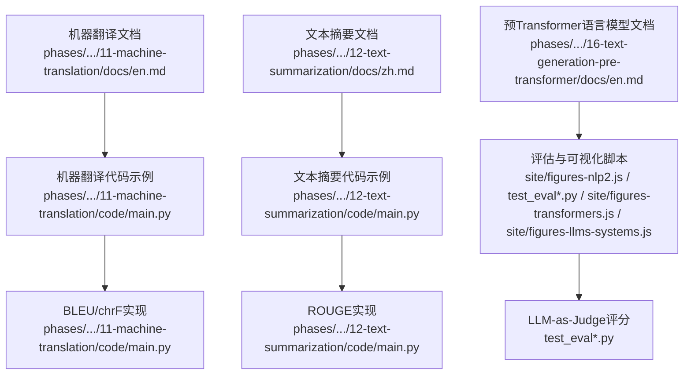
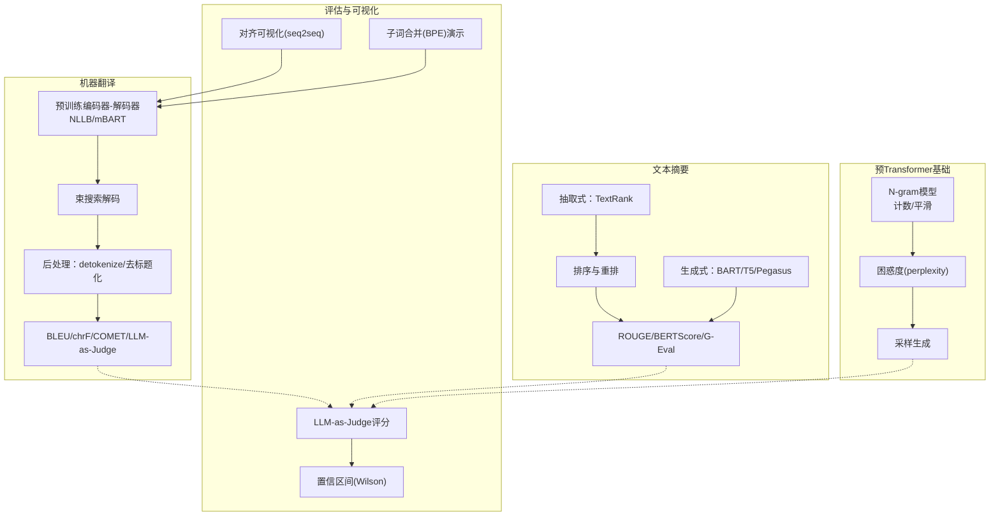
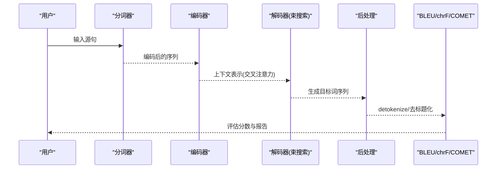
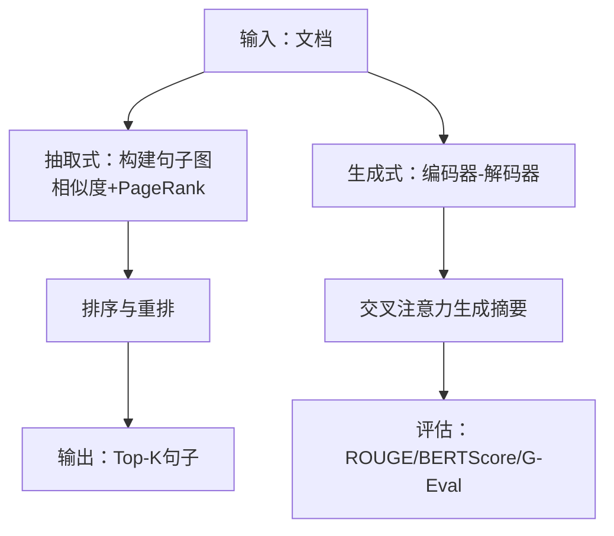
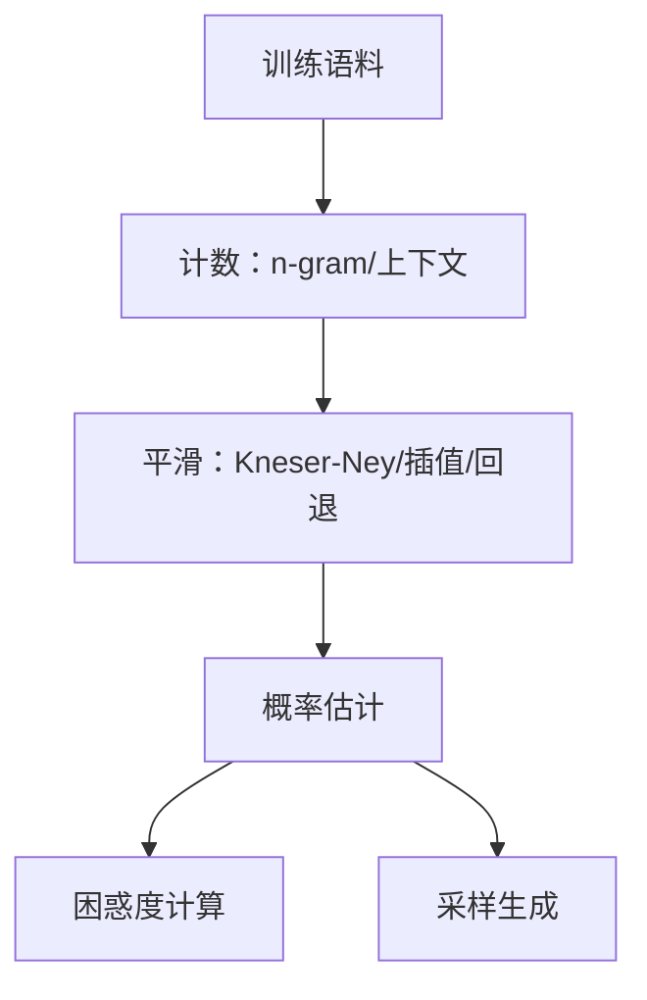
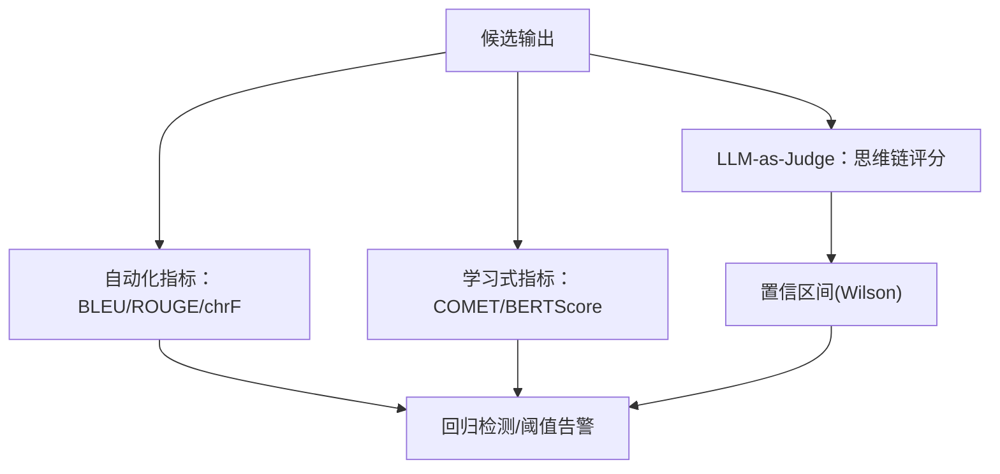
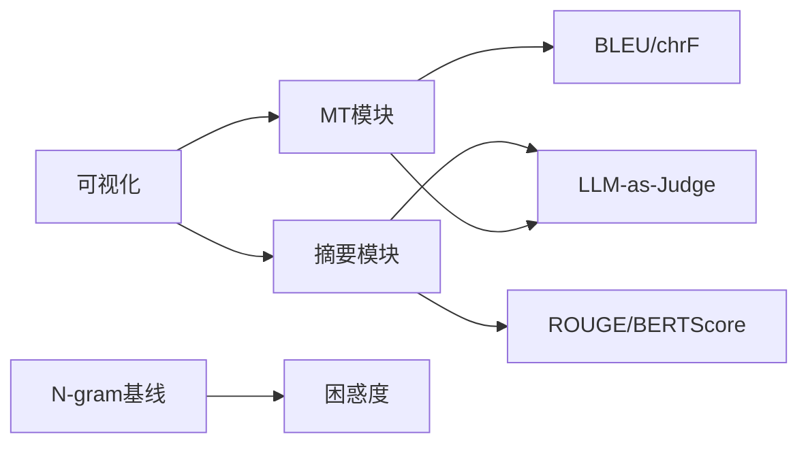

# 语言生成任务

<cite>
**本文引用的文件**
- [phases/05-nlp-foundations-to-advanced/11-machine-translation/docs/en.md](file://phases/05-nlp-foundations-to-advanced/11-machine-translation/docs/en.md)
- [phases/05-nlp-foundations-to-advanced/11-machine-translation/code/main.py](file://phases/05-nlp-foundations-to-advanced/11-machine-translation/code/main.py)
- [phases/05-nlp-foundations-to-advanced/12-text-summarization/docs/zh.md](file://phases/05-nlp-foundations-to-advanced/12-text-summarization/docs/zh.md)
- [phases/05-nlp-foundations-to-advanced/12-text-summarization/code/main.py](file://phases/05-nlp-foundations-to-advanced/12-text-summarization/code/main.py)
- [phases/05-nlp-foundations-to-advanced/16-text-generation-pre-transformer/docs/en.md](file://phases/05-nlp-foundations-to-advanced/16-text-generation-pre-transformer/docs/en.md)
- [site/figures-nlp2.js](file://site/figures-nlp2.js)
- [test_eval.py](file://test_eval.py)
- [test_eval_real.py](file://test_eval_real.py)
- [site/figures-transformers.js](file://site/figures-transformers.js)
- [site/figures-llms-systems.js](file://site/figures-llms-systems.js)
</cite>

## 目录
1. [引言](#引言)
2. [项目结构](#项目结构)
3. [核心组件](#核心组件)
4. [架构总览](#架构总览)
5. [详细组件分析](#详细组件分析)
6. [依赖分析](#依赖分析)
7. [性能考虑](#性能考虑)
8. [故障排查指南](#故障排查指南)
9. [结论](#结论)
10. [附录](#附录)

## 引言
本文件围绕“语言生成任务”主题，系统梳理并整合仓库中与机器翻译、文本摘要、预Transformer时代文本生成方法以及评估指标相关的资料与实现，帮助读者建立从数据与模型到评估与落地的完整认知闭环。内容覆盖：
- 机器翻译：双语语料、对齐方法、神经机翻、BLEU/chrF/COMET/LLM-as-Judge等评估体系
- 文本摘要：抽取式（TextRank）与生成式（BART/T5/Pegasus）及ROUGE、BERTScore、G-Eval等评估
- 预Transformer时代：N-gram语言模型、平滑策略、困惑度(perplexity)与采样生成
- 评估与质量控制：自动化指标、LLM-as-Judge、置信区间与回归检测

## 项目结构
本主题涉及的资料主要分布在以下位置：
- phases/05-nlp-foundations-to-advanced/11-machine-translation：机器翻译课程文档与示例代码
- phases/05-nlp-foundations-to-advanced/12-text-summarization：文本摘要课程文档与示例代码
- phases/05-nlp-foundations-to-advanced/16-text-generation-pre-transformer：预Transformer文本生成课程文档
- site/figures-nlp2.js：可视化教学资源（如seq2seq对齐、RNN展开、LSTM门控等）
- test_eval*.py：评估框架与LLM-as-Judge评分逻辑
- site/figures-transformers.js、site/figures-llms-systems.js：子词合并、困惑度与系统图示

**图表来源**
- [phases/05-nlp-foundations-to-advanced/11-machine-translation/docs/en.md](file://phases/05-nlp-foundations-to-advanced/11-machine-translation/docs/en.md)
- [phases/05-nlp-foundations-to-advanced/11-machine-translation/code/main.py](file://phases/05-nlp-foundations-to-advanced/11-machine-translation/code/main.py)
- [phases/05-nlp-foundations-to-advanced/12-text-summarization/docs/zh.md](file://phases/05-nlp-foundations-to-advanced/12-text-summarization/docs/zh.md)
- [phases/05-nlp-foundations-to-advanced/12-text-summarization/code/main.py](file://phases/05-nlp-foundations-to-advanced/12-text-summarization/code/main.py)
- [phases/05-nlp-foundations-to-advanced/16-text-generation-pre-transformer/docs/en.md](file://phases/05-nlp-foundations-to-advanced/16-text-generation-pre-transformer/docs/en.md)
- [site/figures-nlp2.js](file://site/figures-nlp2.js)
- [test_eval.py](file://test_eval.py)
- [test_eval_real.py](file://test_eval_real.py)
- [site/figures-transformers.js](file://site/figures-transformers.js)
- [site/figures-llms-systems.js](file://site/figures-llms-systems.js)

**章节来源**
- [phases/05-nlp-foundations-to-advanced/11-machine-translation/docs/en.md](file://phases/05-nlp-foundations-to-advanced/11-machine-translation/docs/en.md)
- [phases/05-nlp-foundations-to-advanced/12-text-summarization/docs/zh.md](file://phases/05-nlp-foundations-to-advanced/12-text-summarization/docs/zh.md)
- [phases/05-nlp-foundations-to-advanced/16-text-generation-pre-transformer/docs/en.md](file://phases/05-nlp-foundations-to-advanced/16-text-generation-pre-transformer/docs/en.md)
- [site/figures-nlp2.js](file://site/figures-nlp2.js)

## 核心组件
- 机器翻译流水线与评估
  - 预训练多语言编码器-解码器（NLLB/mBART）、子词分词、束搜索、BLEU/chrF/COMET/LLM-as-Judge三级评估
  - 生产级失败模式与缓解策略（幻觉、离靶、术语漂移、正式度不匹配、短输入长输出）
- 文本摘要
  - 抽取式：基于图的TextRank；生成式：BART/T5/Pegasus；评估：ROUGE/BERTScore/MoverScore/G-Eval
  - 幻觉与事实性问题及应对
- 预Transformer文本生成
  - N-gram语言模型、平滑（Laplace/Good-Turing/插值/Katz/Kneser-Ney）、困惑度、采样生成
- 评估与质量控制
  - 自动化指标（BLEU/ROUGE/chrF）与LLM-as-Judge结合，置信区间与回归检测

**章节来源**
- [phases/05-nlp-foundations-to-advanced/11-machine-translation/docs/en.md](file://phases/05-nlp-foundations-to-advanced/11-machine-translation/docs/en.md)
- [phases/05-nlp-foundations-to-advanced/12-text-summarization/docs/zh.md](file://phases/05-nlp-foundations-to-advanced/12-text-summarization/docs/zh.md)
- [phases/05-nlp-foundations-to-advanced/16-text-generation-pre-transformer/docs/en.md](file://phases/05-nlp-foundations-to-advanced/16-text-generation-pre-transformer/docs/en.md)
- [test_eval.py](file://test_eval.py)
- [test_eval_real.py](file://test_eval_real.py)

## 架构总览
下图展示了现代语言生成任务的关键模块与交互关系，涵盖MT与Summarization两条主线及其评估与可视化支撑。

**图表来源**
- [phases/05-nlp-foundations-to-advanced/11-machine-translation/docs/en.md](file://phases/05-nlp-foundations-to-advanced/11-machine-translation/docs/en.md)
- [phases/05-nlp-foundations-to-advanced/12-text-summarization/docs/zh.md](file://phases/05-nlp-foundations-to-advanced/12-text-summarization/docs/zh.md)
- [phases/05-nlp-foundations-to-advanced/16-text-generation-pre-transformer/docs/en.md](file://phases/05-nlp-foundations-to-advanced/16-text-generation-pre-transformer/docs/en.md)
- [site/figures-nlp2.js](file://site/figures-nlp2.js)
- [site/figures-transformers.js](file://site/figures-transformers.js)
- [test_eval.py](file://test_eval.py)
- [test_eval_real.py](file://test_eval_real.py)

## 详细组件分析

### 机器翻译：挑战、方法与评估
- 双语语料与对齐
  - 传统统计MT依赖双语平行语料与对齐（Word Alignment），现代MT采用跨注意力软对齐，目标词从整个源序列的加权状态中读取
  - 可视化展示了对齐权重的softmax分布与重排序现象
- 神经机翻流水线
  - 预训练多语言编码器-解码器（NLLB-200/mBART），共享子词词表，零样本跨语言能力
  - 解码采用束搜索，长度惩罚，必要时引入术语约束
- 评估指标
  - BLEU：n-gram重叠几何均值+简短惩罚；chrF：字符级F-score，对形态丰富的语言更敏感
  - 2026三阶评估体系：启发式（BLEU/chrF）、学习式（COMET/BLEURT/BERTScore）、LLM-as-Judge（无参考）
- 生产失败模式与缓解
  - 幻觉、离靶、术语漂移、正式度不匹配、短输入长输出；建议：术语约束、语言ID校验、形式性提示、上限长度控制

**图表来源**
- [phases/05-nlp-foundations-to-advanced/11-machine-translation/docs/en.md](file://phases/05-nlp-foundations-to-advanced/11-machine-translation/docs/en.md)
- [phases/05-nlp-foundations-to-advanced/11-machine-translation/code/main.py](file://phases/05-nlp-foundations-to-advanced/11-machine-translation/code/main.py)
- [site/figures-nlp2.js](file://site/figures-nlp2.js)

**章节来源**
- [phases/05-nlp-foundations-to-advanced/11-machine-translation/docs/en.md](file://phases/05-nlp-foundations-to-advanced/11-machine-translation/docs/en.md)
- [phases/05-nlp-foundations-to-advanced/11-machine-translation/code/main.py](file://phases/05-nlp-foundations-to-advanced/11-machine-translation/code/main.py)
- [site/figures-nlp2.js](file://site/figures-nlp2.js)

### 文本摘要：抽取式与生成式
- 抽取式（TextRank）
  - 将文档建模为句子图，节点为句子，边为相似度，PageRank评分，选取Top-K
  - 相似度使用对数归一化的词重叠，阻尼因子0.85与迭代次数为默认
- 生成式（BART/T5/Pegasus）
  - 在文档-摘要对上微调编码器-解码器；Pegasus采用“间隙句子”预训练目标，无需大量微调即可表现优异
- 评估
  - ROUGE-1/2/L（召回视角）；BERTScore/MoverScore在2026年成为主流；G-Eval以思维链对连贯性、一致性、流畅性、相关性评分
- 幻觉与事实性
  - 实体替换、数字漂移、极性翻转、事实编造；建议抽取式优先用于合规内容，生成式需加入事实性检查

**图表来源**
- [phases/05-nlp-foundations-to-advanced/12-text-summarization/docs/zh.md](file://phases/05-nlp-foundations-to-advanced/12-text-summarization/docs/zh.md)
- [phases/05-nlp-foundations-to-advanced/12-text-summarization/code/main.py](file://phases/05-nlp-foundations-to-advanced/12-text-summarization/code/main.py)

**章节来源**
- [phases/05-nlp-foundations-to-advanced/12-text-summarization/docs/zh.md](file://phases/05-nlp-foundations-to-advanced/12-text-summarization/docs/zh.md)
- [phases/05-nlp-foundations-to-advanced/12-text-summarization/code/main.py](file://phases/05-nlp-foundations-to-advanced/12-text-summarization/code/main.py)

### 预Transformer文本生成：N-gram语言模型与困惑度
- N-gram概率与零计数问题
  - 原始计数法对未见n-gram赋零概率，导致灾难性结果；需平滑
- 平滑方法演进
  - 加一平滑、Good-Turing、插值、回退(Katz)、绝对折扣、Kneser-Ney（以“延续概率”为核心创新）
- 评估：困惑度
  - 单词级平均负对数似然指数，越低越好；与深度语言模型相比仍有数量级差距
- 生成：按概率采样
  - 从候选词按概率累积采样，随机种子不同则输出不同；贪心或温度扰动可模拟束搜索效果

**图表来源**
- [phases/05-nlp-foundations-to-advanced/16-text-generation-pre-transformer/docs/en.md](file://phases/05-nlp-foundations-to-advanced/16-text-generation-pre-transformer/docs/en.md)

**章节来源**
- [phases/05-nlp-foundations-to-advanced/16-text-generation-pre-transformer/docs/en.md](file://phases/05-nlp-foundations-to-advanced/16-text-generation-pre-transformer/docs/en.md)

### 评估指标与质量控制
- BLEU与chrF
  - BLEU：n-gram精度几何均值×简短惩罚；chrF：字符级F-score，对形态丰富语言更敏感
  - 教学实现强调无平滑版本的局限，生产使用sacrebleu
- ROUGE
  - ROUGE-1/2/L；词干化至关重要；抽取式与生成式均可使用
- 2026评估体系
  - 启发式（BLEU/chrF）、学习式（COMET/BLEURT/BERTScore）、LLM-as-Judge（无参考）
- LLM-as-Judge与置信区间
  - 评分维度：相关性、正确性、有用性、安全性；Wilson置信区间用于稳定性判断
- 困惑度与系统可视化
  - 困惑度=exp(损失)，随机模型困惑度≈logV；子词合并演示BPE过程

**图表来源**
- [phases/05-nlp-foundations-to-advanced/11-machine-translation/code/main.py](file://phases/05-nlp-foundations-to-advanced/11-machine-translation/code/main.py)
- [phases/05-nlp-foundations-to-advanced/12-text-summarization/code/main.py](file://phases/05-nlp-foundations-to-advanced/12-text-summarization/code/main.py)
- [test_eval.py](file://test_eval.py)
- [test_eval_real.py](file://test_eval_real.py)
- [site/figures-llms-systems.js](file://site/figures-llms-systems.js)
- [site/figures-transformers.js](file://site/figures-transformers.js)

**章节来源**
- [phases/05-nlp-foundations-to-advanced/11-machine-translation/code/main.py](file://phases/05-nlp-foundations-to-advanced/11-machine-translation/code/main.py)
- [phases/05-nlp-foundations-to-advanced/12-text-summarization/code/main.py](file://phases/05-nlp-foundations-to-advanced/12-text-summarization/code/main.py)
- [test_eval.py](file://test_eval.py)
- [test_eval_real.py](file://test_eval_real.py)
- [site/figures-llms-systems.js](file://site/figures-llms-systems.js)
- [site/figures-transformers.js](file://site/figures-transformers.js)

## 依赖分析
- 组件耦合
  - 机器翻译与文本摘要共享“评估”与“可视化”支撑层（BLEU/ROUGE/chrF、LLM-as-Judge、对齐/子词可视化）
  - 预Transformer基础为现代模型提供“基线与理解”，困惑度与平滑方法影响现代LM的可解释性
- 外部依赖
  - 机器翻译：transformers、sacrebleu、COMET
  - 文本摘要：rouge-score、BERTScore/MoverScore工具链
  - 评估：LLM-as-Judge（外部模型）、置信区间统计

**图表来源**
- [phases/05-nlp-foundations-to-advanced/11-machine-translation/docs/en.md](file://phases/05-nlp-foundations-to-advanced/11-machine-translation/docs/en.md)
- [phases/05-nlp-foundations-to-advanced/12-text-summarization/docs/zh.md](file://phases/05-nlp-foundations-to-advanced/12-text-summarization/docs/zh.md)
- [phases/05-nlp-foundations-to-advanced/16-text-generation-pre-transformer/docs/en.md](file://phases/05-nlp-foundations-to-advanced/16-text-generation-pre-transformer/docs/en.md)
- [site/figures-nlp2.js](file://site/figures-nlp2.js)

**章节来源**
- [phases/05-nlp-foundations-to-advanced/11-machine-translation/docs/en.md](file://phases/05-nlp-foundations-to-advanced/11-machine-translation/docs/en.md)
- [phases/05-nlp-foundations-to-advanced/12-text-summarization/docs/zh.md](file://phases/05-nlp-foundations-to-advanced/12-text-summarization/docs/zh.md)
- [phases/05-nlp-foundations-to-advanced/16-text-generation-pre-transformer/docs/en.md](file://phases/05-nlp-foundations-to-advanced/16-text-generation-pre-transformer/docs/en.md)
- [site/figures-nlp2.js](file://site/figures-nlp2.js)

## 性能考虑
- 机器翻译
  - 词表共享与子词分词降低未知词率；束搜索宽度与长度惩罚平衡质量与效率
  - 长上下文与多语言场景下，优先考虑上下文窗口与推理延迟
- 文本摘要
  - 抽取式对长文本与多文档更稳健；生成式在连贯性与风格上更优，但需更强的事实性检查
- 预Transformer基线
  - 困惑度作为快速基线，指导现代模型改进方向；平滑策略直接影响OOV与稀有事件建模

[本节为通用性能讨论，不直接分析具体文件]

## 故障排查指南
- 机器翻译
  - 幻觉：术语约束、人类复核、监控超长输出
  - 离靶：校验强制BOS语言ID、输出语言ID检查
  - 术语漂移：术语表约束或后编辑字典
  - 正式度不匹配：提示前缀注入正式性令牌或专用微调
  - 短输入长爆炸：按源长度设置硬上限
- 文本摘要
  - 幻觉与事实性：实体级别F1、QA一致性、FactCC
  - 评估偏差：词干化、词表标准化、LLM评分鲁棒性
- 评估与回归
  - LLM-as-Judge评分不稳定：增加置信区间与阈值告警
  - 指标漂移：定期校准与回归检测

**章节来源**
- [phases/05-nlp-foundations-to-advanced/11-machine-translation/docs/en.md](file://phases/05-nlp-foundations-to-advanced/11-machine-translation/docs/en.md)
- [phases/05-nlp-foundations-to-advanced/12-text-summarization/docs/zh.md](file://phases/05-nlp-foundations-to-advanced/12-text-summarization/docs/zh.md)
- [test_eval.py](file://test_eval.py)
- [test_eval_real.py](file://test_eval_real.py)

## 结论
本主题以“数据—模型—评估—落地”为主线，串联起从N-gram到Transformer再到LLM时代的语言生成技术脉络。机器翻译与文本摘要分别代表两类典型任务：前者强调跨语言与可解释对齐，后者强调内容压缩与事实性保障。在实际工程中，应以自动化指标与LLM-as-Judge相结合的方式进行质量控制，并通过术语约束、语言ID校验、事实性检查等手段降低生产风险。

[本节为总结性内容，不直接分析具体文件]

## 附录
- 术语速查
  - BLEU：n-gram精度+简短惩罚；chrF：字符级F-score；NMT：神经MT；NLLB：多语言模型家族；Constrained Decoding：约束解码；Hallucination：幻觉
  - ROUGE：召回视角摘要评估；TextRank：基于图的抽取式；BERTScore/MoverScore/G-Eval：语义与事实性评估
  - N-gram：词序列；Smoothing：避免零概率；Perplexity：LM质量指标；Backoff/Kneser-Ney：平滑策略

**章节来源**
- [phases/05-nlp-foundations-to-advanced/11-machine-translation/docs/en.md](file://phases/05-nlp-foundations-to-advanced/11-machine-translation/docs/en.md)
- [phases/05-nlp-foundations-to-advanced/12-text-summarization/docs/zh.md](file://phases/05-nlp-foundations-to-advanced/12-text-summarization/docs/zh.md)
- [phases/05-nlp-foundations-to-advanced/16-text-generation-pre-transformer/docs/en.md](file://phases/05-nlp-foundations-to-advanced/16-text-generation-pre-transformer/docs/en.md)