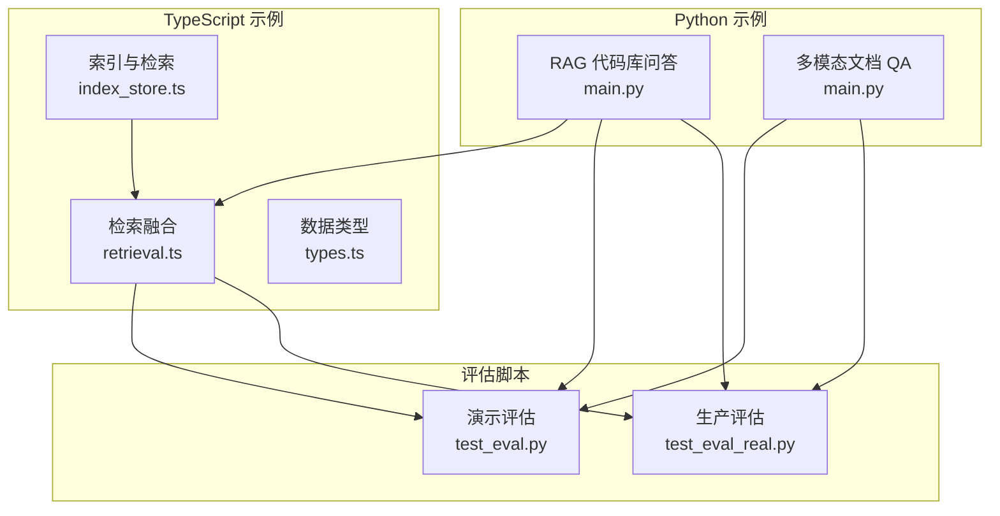
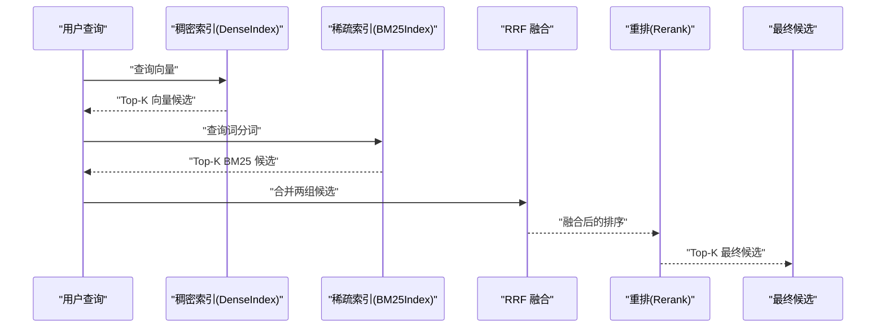
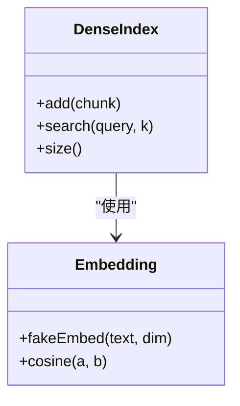
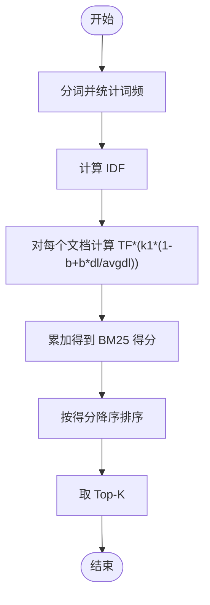
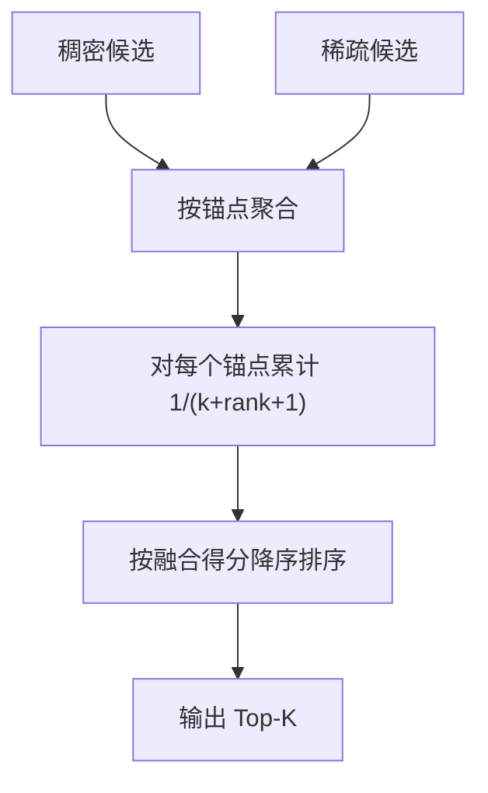
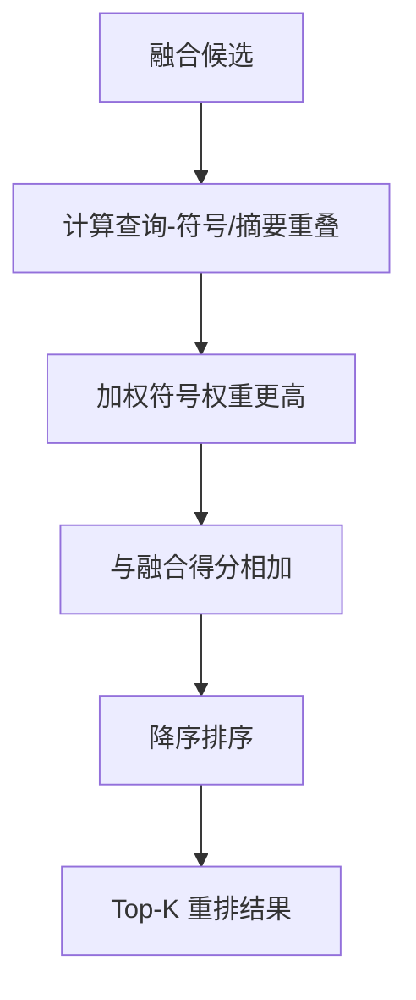
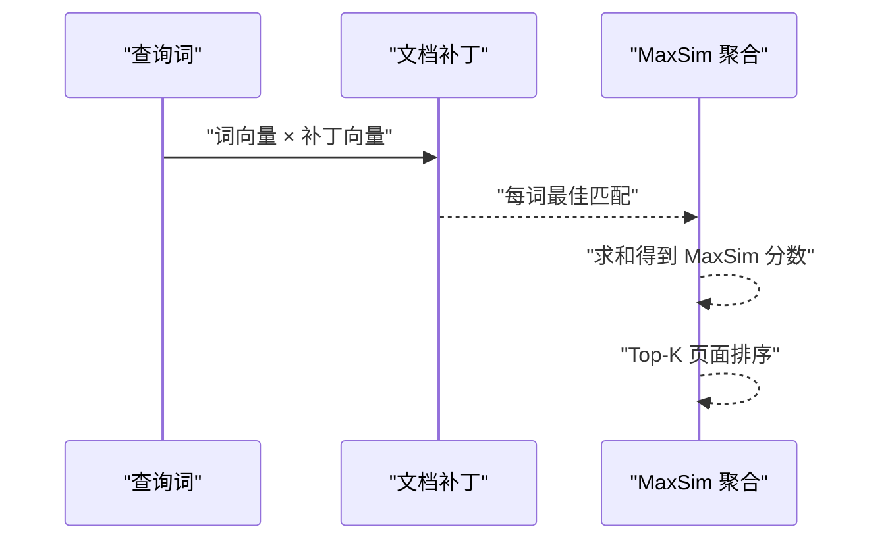
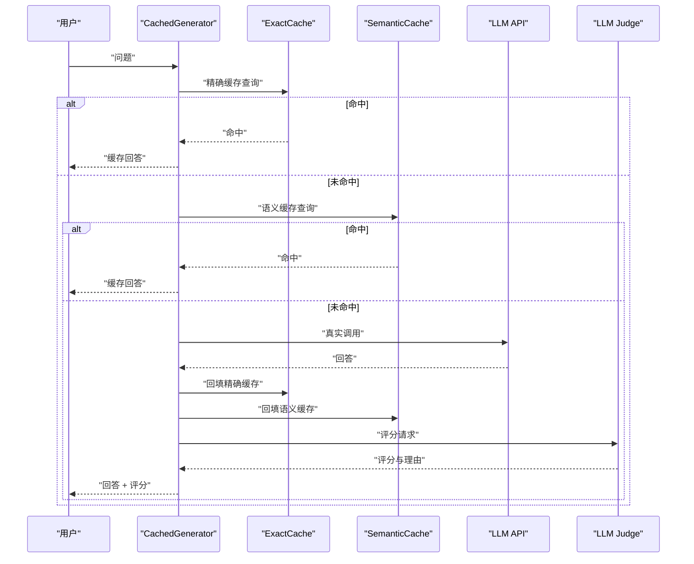
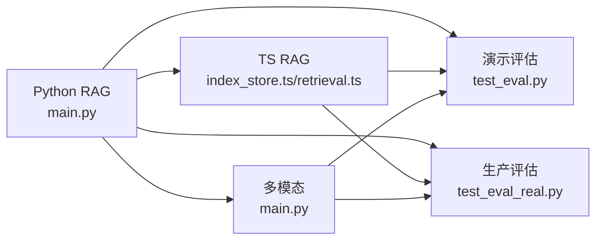

# 问答系统与信息检索

<cite>
**本文档引用的文件**
- [main.py](file://phases/19-capstone-projects/02-rag-over-codebase/code/main.py)
- [index_store.ts](file://phases/19-capstone-projects/02-rag-over-codebase/code/ts/src/index_store.ts)
- [retrieval.ts](file://phases/19-capstone-projects/02-rag-over-codebase/code/ts/src/retrieval.ts)
- [types.ts](file://phases/19-capstone-projects/02-rag-over-codebase/code/ts/src/types.ts)
- [main.py](file://phases/19-capstone-projects/04-multimodal-document-qa/code/main.py)
- [test_eval.py](file://test_eval.py)
- [test_eval_real.py](file://test_eval_real.py)
- [lesson.html](file://site/lesson.html)
</cite>

## 目录
1. [引言](#引言)
2. [项目结构](#项目结构)
3. [核心组件](#核心组件)
4. [架构概览](#架构概览)
5. [详细组件分析](#详细组件分析)
6. [依赖分析](#依赖分析)
7. [性能考虑](#性能考虑)
8. [故障排除指南](#故障排除指南)
9. [结论](#结论)
10. [附录](#附录)

## 引言
本文件面向"问答系统与信息检索"课程，系统化梳理仓库中的问答与检索实现，涵盖以下要点：
- 问答系统类型与评估：抽取式与生成式问答的差异、评估指标与方法
- 信息检索基础：倒排索引、BM25评分、向量检索、相关性排序
- 主题建模：LDA等方法与应用场景（概念性介绍）
- 语义搜索与多模态检索：Late Interaction、ColPali/ColQwen范式
- 实现示例：混合检索（稠密+稀疏）、重排、评估流水线

## 项目结构
本仓库围绕问答与检索提供了多套可运行示例与评估脚本：
- Python 示例
  - RAG 代码库问答：混合检索（稠密向量 + BM25）+ 重排
  - 多模态文档问答：Late Interaction（MaxSim）+ DocPruner
- TypeScript 示例
  - 同构的混合检索与融合流程，便于跨语言对照
- 评估脚本
  - 演示型评估：自定义评分规则与对比
  - 生产级评估：缓存层 + LLM 裁判 + 置信区间

**图表来源**
- [main.py:1-219](file://phases/19-capstone-projects/02-rag-over-codebase/code/main.py#L1-L219)
- [index_store.ts:1-132](file://phases/19-capstone-projects/02-rag-over-codebase/code/ts/src/index_store.ts#L1-L132)
- [retrieval.ts:1-55](file://phases/19-capstone-projects/02-rag-over-codebase/code/ts/src/retrieval.ts#L1-L55)
- [types.ts:1-24](file://phases/19-capstone-projects/02-rag-over-codebase/code/ts/src/types.ts#L1-L24)
- [main.py:1-165](file://phases/19-capstone-projects/04-multimodal-document-qa/code/main.py#L1-L165)
- [test_eval.py:1-249](file://test_eval.py#L1-L249)
- [test_eval_real.py:1-447](file://test_eval_real.py#L1-L447)

**章节来源**
- [main.py:1-219](file://phases/19-capstone-projects/02-rag-over-codebase/code/main.py#L1-L219)
- [index_store.ts:1-132](file://phases/19-capstone-projects/02-rag-over-codebase/code/ts/src/index_store.ts#L1-L132)
- [retrieval.ts:1-55](file://phases/19-capstone-projects/02-rag-over-codebase/code/ts/src/retrieval.ts#L1-L55)
- [types.ts:1-24](file://phases/19-capstone-projects/02-rag-over-codebase/code/ts/src/types.ts#L1-L24)
- [main.py:1-165](file://phases/19-capstone-projects/04-multimodal-document-qa/code/main.py#L1-L165)
- [test_eval.py:1-249](file://test_eval.py#L1-L249)
- [test_eval_real.py:1-447](file://test_eval_real.py#L1-L447)

## 核心组件
- 稠密索引（向量检索）
  - Python：基于确定性哈希嵌入与余弦相似度
  - TypeScript：基于 FNV-1a 哈希嵌入与余弦相似度
- 稀疏索引（BM25）
  - Python/TS：字段加权分词、IDF/TF 计算、归一化长度
- 检索融合（RRF）
  - Reciprocal Rank Fusion，合并稠密与稀疏结果
- 重排（Stub Reranker）
  - 基于查询-符号/摘要重叠权重的简单重排
- 多模态 Late Interaction
  - MaxSim：查询词对文档补丁的最大相似度之和
- 评估流水线
  - 演示型：规则评分 + 模型对比
  - 生产级：精确/语义缓存 + LLM 裁判 + 置信区间

**章节来源**
- [main.py:65-177](file://phases/19-capstone-projects/02-rag-over-codebase/code/main.py#L65-L177)
- [index_store.ts:19-48](file://phases/19-capstone-projects/02-rag-over-codebase/code/ts/src/index_store.ts#L19-L48)
- [retrieval.ts:6-25](file://phases/19-capstone-projects/02-rag-over-codebase/code/ts/src/retrieval.ts#L6-L25)
- [main.py:71-84](file://phases/19-capstone-projects/04-multimodal-document-qa/code/main.py#L71-L84)
- [test_eval.py:52-142](file://test_eval.py#L52-L142)
- [test_eval_real.py:162-256](file://test_eval_real.py#L162-L256)

## 架构概览
下图展示了混合检索到最终候选输出的端到端流程。

**图表来源**
- [main.py:183-195](file://phases/19-capstone-projects/02-rag-over-codebase/code/main.py#L183-L195)
- [index_store.ts:58-66](file://phases/19-capstone-projects/02-rag-over-codebase/code/ts/src/index_store.ts#L58-L66)
- [retrieval.ts:27-44](file://phases/19-capstone-projects/02-rag-over-codebase/code/ts/src/retrieval.ts#L27-L44)

**章节来源**
- [main.py:183-195](file://phases/19-capstone-projects/02-rag-over-codebase/code/main.py#L183-L195)
- [index_store.ts:58-66](file://phases/19-capstone-projects/02-rag-over-codebase/code/ts/src/index_store.ts#L58-L66)
- [retrieval.ts:27-44](file://phases/19-capstone-projects/02-rag-over-codebase/code/ts/src/retrieval.ts#L27-L44)

## 详细组件分析

### 组件A：稠密索引与向量检索
- Python
  - 确定性嵌入：基于词项哈希，归一化向量
  - 相似度：余弦相似度
  - 搜索：对查询向量与所有文档向量计算相似度并排序
- TypeScript
  - 嵌入：FNV-1a 哈希 + 归一化
  - 相似度：标准化余弦相似度
  - 搜索：映射得分后降序排序

**图表来源**
- [main.py:65-92](file://phases/19-capstone-projects/02-rag-over-codebase/code/main.py#L65-L92)
- [index_store.ts:19-48](file://phases/19-capstone-projects/02-rag-over-codebase/code/ts/src/index_store.ts#L19-L48)

**章节来源**
- [main.py:65-92](file://phases/19-capstone-projects/02-rag-over-codebase/code/main.py#L65-L92)
- [index_store.ts:19-48](file://phases/19-capstone-projects/02-rag-over-codebase/code/ts/src/index_store.ts#L19-L48)

### 组件B：稀疏索引与 BM25
- 字段加权：符号 x4、摘要 x2、正文 x1
- 统计：词频、文档频率、平均文档长度
- 评分：IDF × TF 调整（长度归一化），累加求和
- 排序：按得分降序取 Top-K

**图表来源**
- [main.py:103-142](file://phases/19-capstone-projects/02-rag-over-codebase/code/main.py#L103-L142)
- [index_store.ts:73-131](file://phases/19-capstone-projects/02-rag-over-codebase/code/ts/src/index_store.ts#L73-L131)

**章节来源**
- [main.py:103-142](file://phases/19-capstone-projects/02-rag-over-codebase/code/main.py#L103-L142)
- [index_store.ts:73-131](file://phases/19-capstone-projects/02-rag-over-codebase/code/ts/src/index_store.ts#L73-L131)

### 组件C：检索融合（RRF）
- 输入：稠密 Top-N、稀疏 Top-N
- 融合策略：对同一锚点（chunk）累积倒数排名分数
- 输出：按融合得分降序的候选列表

**图表来源**
- [retrieval.ts:6-25](file://phases/19-capstone-projects/02-rag-over-codebase/code/ts/src/retrieval.ts#L6-L25)
- [main.py:149-161](file://phases/19-capstone-projects/02-rag-over-codebase/code/main.py#L149-L161)

**章节来源**
- [retrieval.ts:6-25](file://phases/19-capstone-projects/02-rag-over-codebase/code/ts/src/retrieval.ts#L6-L25)
- [main.py:149-161](file://phases/19-capstone-projects/02-rag-over-codebase/code/main.py#L149-L161)

### 组件D：重排（Stub Reranker）
- 基于查询与符号/摘要的重叠权重进行加权
- 保持融合顺序优势，微调最终排序

**图表来源**
- [main.py:167-176](file://phases/19-capstone-projects/02-rag-over-codebase/code/main.py#L167-L176)

**章节来源**
- [main.py:167-176](file://phases/19-capstone-projects/02-rag-over-codebase/code/main.py#L167-L176)

### 组件E：多模态 Late Interaction（MaxSim）
- 查询词嵌入与文档补丁逐一计算点积，取每查询词的最佳匹配
- 对所有查询词的最佳匹配求和作为最终得分
- 可选补丁裁剪（DocPruner）以降低计算成本

**图表来源**
- [main.py:71-101](file://phases/19-capstone-projects/04-multimodal-document-qa/code/main.py#L71-L101)

**章节来源**
- [main.py:71-101](file://phases/19-capstone-projects/04-multimodal-document-qa/code/main.py#L71-L101)

### 组件F：评估流水线
- 演示型评估
  - 定义评分维度与规则，对模型输出打分并对比
- 生产级评估
  - 精确缓存（相同输入命中）、语义缓存（相似问题命中）
  - LLM 裁判统一评分，Wilson 置信区间估计
  - 按类别汇总与回归检测

**图表来源**
- [test_eval_real.py:162-256](file://test_eval_real.py#L162-L256)

**章节来源**
- [test_eval.py:52-142](file://test_eval.py#L52-L142)
- [test_eval_real.py:162-256](file://test_eval_real.py#L162-L256)

## 依赖分析
- Python RAG 示例
  - 依赖：正则表达式、集合/计数器、数学函数
  - 内聚：Chunk 数据结构、Dense/BM25 索引、RRF、重排、主流程
- TypeScript RAG 示例
  - 依赖：Map/Set、数组映射/排序
  - 内聚：类型定义、嵌入/相似度、索引、融合与查询
- 多模态示例
  - 依赖：随机种子、数学库、数据类
  - 内聚：补丁嵌入、DocPruner、MaxSim、索引与检索
- 评估脚本
  - 依赖：JSON、统计、时间、外部 LLM API、向量库

**图表来源**
- [main.py:1-219](file://phases/19-capstone-projects/02-rag-over-codebase/code/main.py#L1-L219)
- [index_store.ts:1-132](file://phases/19-capstone-projects/02-rag-over-codebase/code/ts/src/index_store.ts#L1-L132)
- [retrieval.ts:1-55](file://phases/19-capstone-projects/02-rag-over-codebase/code/ts/src/retrieval.ts#L1-L55)
- [main.py:1-165](file://phases/19-capstone-projects/04-multimodal-document-qa/code/main.py#L1-L165)
- [test_eval.py:1-249](file://test_eval.py#L1-L249)
- [test_eval_real.py:1-447](file://test_eval_real.py#L1-L447)

**章节来源**
- [main.py:1-219](file://phases/19-capstone-projects/02-rag-over-codebase/code/main.py#L1-L219)
- [index_store.ts:1-132](file://phases/19-capstone-projects/02-rag-over-codebase/code/ts/src/index_store.ts#L1-L132)
- [retrieval.ts:1-55](file://phases/19-capstone-projects/02-rag-over-codebase/code/ts/src/retrieval.ts#L1-L55)
- [main.py:1-165](file://phases/19-capstone-projects/04-multimodal-document-qa/code/main.py#L1-L165)
- [test_eval.py:1-249](file://test_eval.py#L1-L249)
- [test_eval_real.py:1-447](file://test_eval_real.py#L1-L447)

## 性能考虑
- 向量检索
  - 嵌入维度与归一化开销；可采用近似最近邻（ANN）加速
  - 查询时避免重复嵌入计算
- BM25
  - 文档数量增长导致 TF/DF 维护成本上升；可采用分片/增量更新
  - 长度归一化参数（k1、b）影响稳定性与速度
- 融合与重排
  - RRF 的 k 参数控制融合强度；过大可能引入噪声
  - 重排权重需平衡速度与效果
- 多模态
  - MaxSim 计算复杂度与补丁数量成正比；DocPruner 可显著降本
- 评估
  - 缓存命中率直接影响延迟与成本；语义阈值需结合业务调优

## 故障排除指南
- 相关性低
  - 检查字段权重设置（符号/摘要/正文）
  - 增加重排权重或引入关键词提权
- 融合结果抖动
  - 调整 RRF 的 k 参数，或增加锚点去重策略
- 多模态检索慢
  - 开启 DocPruner 或减少补丁保留比例
- 评估不稳定
  - 使用 Wilson 置信区间观察统计显著性
  - 对异常用例进行回归分析与修正

**章节来源**
- [main.py:167-176](file://phases/19-capstone-projects/02-rag-over-codebase/code/main.py#L167-L176)
- [main.py:54-61](file://phases/19-capstone-projects/04-multimodal-document-qa/code/main.py#L54-L61)
- [test_eval_real.py:364-377](file://test_eval_real.py#L364-L377)

## 结论
本仓库提供了从基础检索（BM25）到现代检索（稠密向量 + Late Interaction）的完整实践路径，并配套可扩展的评估体系。通过混合检索与重排，可在准确性与效率之间取得良好平衡；通过缓存与置信区间，可进一步提升生产可用性与质量保障能力。

## 附录
- 问答系统类型与评估
  - 抽取式：从现有文档中抽取片段作为答案
  - 生成式：基于检索上下文生成新文本
  - 评估维度：相关性、正确性、有用性、安全性
- 主题建模（概念性）
  - LDA：潜在主题分布 + 文档-主题分布
  - 应用：文档聚类、推荐、趋势分析
- 语义搜索与多模态
  - 语义搜索：语义向量 + 相似度
  - 多模态：图像/表格/文本联合建模，Late Interaction 代表范式之一

**章节来源**
- [lesson.html:3226-3232](file://site/lesson.html#L3226-L3232)
- [test_eval.py:52-81](file://test_eval.py#L52-L81)
- [test_eval_real.py:282-361](file://test_eval_real.py#L282-L361)