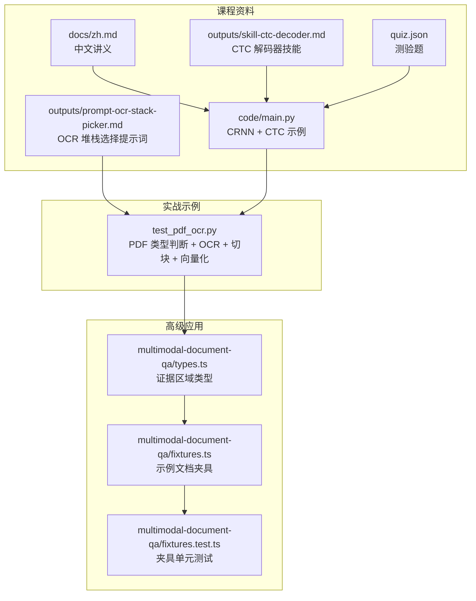
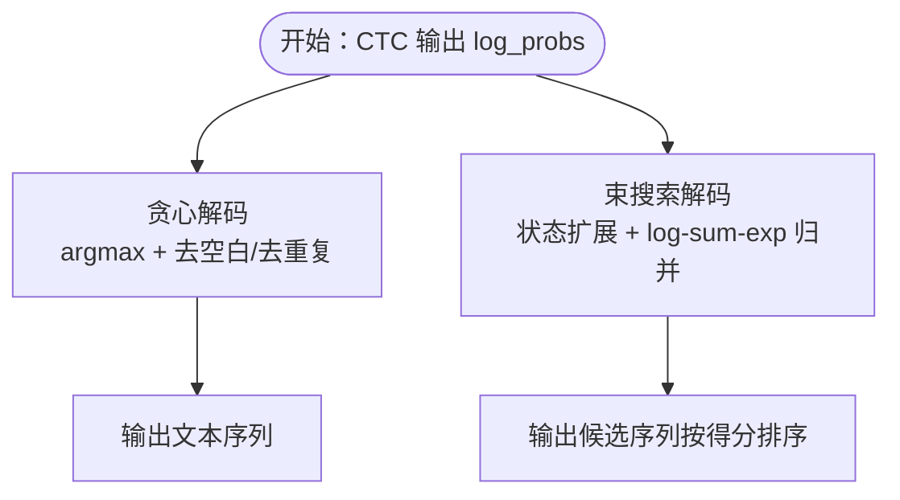
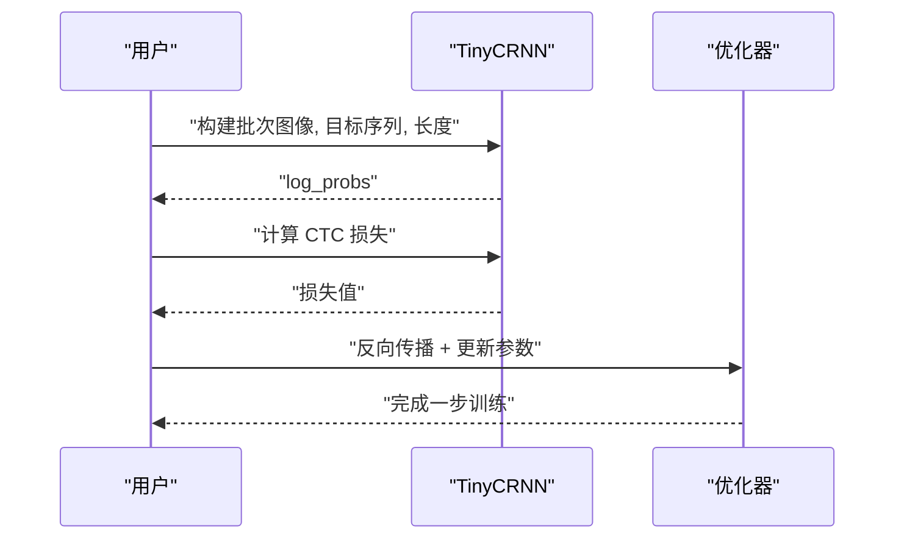
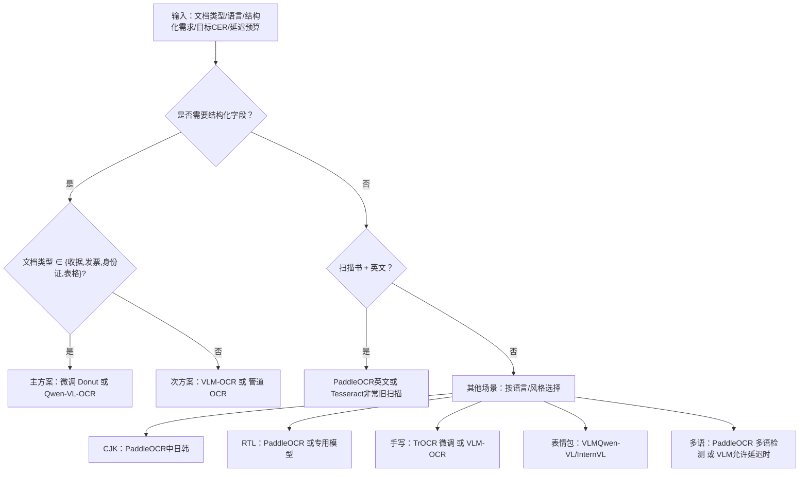
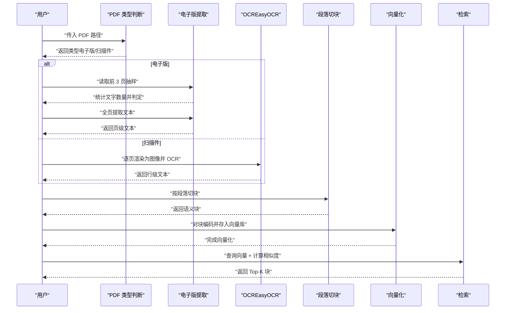
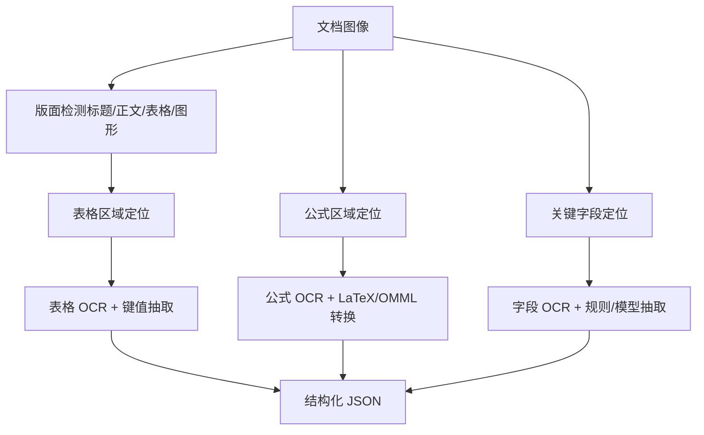
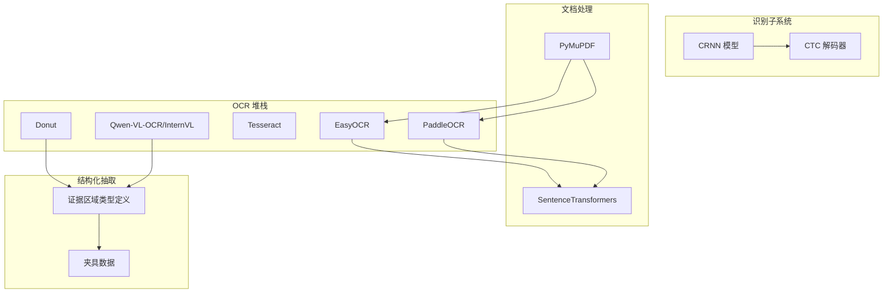

# OCR与文档理解

<cite>
**本文引用的文件**
- [OCR与文档理解（中文）](file://phases/04-computer-vision/19-ocr-document-understanding/docs/zh.md)
- [CTC 解码器技能（中文）](file://phases/04-computer-vision/19-ocr-document-understanding/outputs/skill-ctc-decoder.md)
- [OCR 堆栈选择提示词（中文）](file://phases/04-computer-vision/19-ocr-document-understanding/outputs/prompt-ocr-stack-picker.md)
- [OCR 与文档理解主程序（Python）](file://phases/04-computer-vision/19-ocr-document-understanding/code/main.py)
- [OCR 与文档理解测验（JSON）](file://phases/04-computer-vision/19-ocr-document-understanding/quiz.json)
- [PDF 处理与 OCR 示例（Python）](file://test_pdf_ocr.py)
- [文档问答修复夹具类型定义（TypeScript）](file://phases/19-capstone-projects/04-multimodal-document-qa/code/ts/src/types.ts)
- [文档问答修复夹具数据（TypeScript）](file://phases/19-capstone-projects/04-multimodal-document-qa/code/ts/src/fixtures.ts)
- [文档问答修复夹具单元测试（TypeScript）](file://phases/19-capstone-projects/04-multimodal-document-qa/code/ts/tests/fixtures.test.ts)
- [站点数据：OCR 堆栈选择提示词条目](file://site/data.js)
- [站点摘要：PDF 处理流程说明](file://site/vue-app/summary/src/data/content.js)
</cite>

## 目录
1. [引言](#引言)
2. [项目结构](#项目结构)
3. [核心组件](#核心组件)
4. [架构概览](#架构概览)
5. [详细组件分析](#详细组件分析)
6. [依赖分析](#依赖分析)
7. [性能考虑](#性能考虑)
8. [故障排查指南](#故障排查指南)
9. [结论](#结论)
10. [附录](#附录)

## 引言
本课程围绕光学字符识别（OCR）与文档理解展开，系统梳理从“像素到文本”到“结构化信息抽取”的完整技术路径。课程覆盖：
- 经典 OCR 管线：文本检测（DB/EAST/CTPN）、识别（CRNN+CTC）、版面分析（LayoutLMv3/DocLayNet）与阅读顺序重建。
- 现代端到端方法：Donut、TrOCR、Qwen-VL-OCR、PaddleOCR 等。
- 实战能力：CTC 损失与解码器实现、CRNN 小模型训练、PDF 扫描件/电子件自动分流与 OCR、段落切块与向量化检索。
- 高级应用：表格识别、公式识别、关键信息抽取（KIE）、发票/合同/自动化办公场景落地。

## 项目结构
本课程相关资源集中在计算机视觉阶段的“OCR 与文档理解”单元，配套有中文讲义、技能输出、提示词模板、最小可运行示例与测验。

**图表来源**
- [OCR与文档理解（中文）](file://phases/04-computer-vision/19-ocr-document-understanding/docs/zh.md)
- [CTC 解码器技能（中文）](file://phases/04-computer-vision/19-ocr-document-understanding/outputs/skill-ctc-decoder.md)
- [OCR 堆栈选择提示词（中文）](file://phases/04-computer-vision/19-ocr-document-understanding/outputs/prompt-ocr-stack-picker.md)
- [OCR 与文档理解主程序（Python）](file://phases/04-computer-vision/19-ocr-document-understanding/code/main.py)
- [OCR 与文档理解测验（JSON）](file://phases/04-computer-vision/19-ocr-document-understanding/quiz.json)
- [PDF 处理与 OCR 示例（Python）](file://test_pdf_ocr.py)
- [文档问答修复夹具类型定义（TypeScript）](file://phases/19-capstone-projects/04-multimodal-document-qa/code/ts/src/types.ts)
- [文档问答修复夹具数据（TypeScript）](file://phases/19-capstone-projects/04-multimodal-document-qa/code/ts/src/fixtures.ts)
- [文档问答修复夹具单元测试（TypeScript）](file://phases/19-capstone-projects/04-multimodal-document-qa/code/ts/tests/fixtures.test.ts)

**章节来源**
- [OCR与文档理解（中文）](file://phases/04-computer-vision/19-ocr-document-understanding/docs/zh.md)
- [OCR 堆栈选择提示词（中文）](file://phases/04-computer-vision/19-ocr-document-understanding/outputs/prompt-ocr-stack-picker.md)
- [CTC 解码器技能（中文）](file://phases/04-computer-vision/19-ocr-document-understanding/outputs/skill-ctc-decoder.md)
- [OCR 与文档理解主程序（Python）](file://phases/04-computer-vision/19-ocr-document-understanding/code/main.py)
- [OCR 与文档理解测验（JSON）](file://phases/04-computer-vision/19-ocr-document-understanding/quiz.json)
- [PDF 处理与 OCR 示例（Python）](file://test_pdf_ocr.py)
- [文档问答修复夹具类型定义（TypeScript）](file://phases/19-capstone-projects/04-multimodal-document-qa/code/ts/src/types.ts)
- [文档问答修复夹具数据（TypeScript）](file://phases/19-capstone-projects/04-multimodal-document-qa/code/ts/src/fixtures.ts)
- [文档问答修复夹具单元测试（TypeScript）](file://phases/19-capstone-projects/04-multimodal-document-qa/code/ts/tests/fixtures.test.ts)

## 核心组件
- 经典 OCR 管线与现代端到端模型
  - 经典：文本检测（DB/EAST/CTPN）→ 识别（CRNN+CTC）→ 版面（LayoutLMv3/DocLayNet）→ 阅读顺序重建。
  - 现代：Donut（ViT+解码器，端到端 JSON 输出）、TrOCR（ViT+Transformer 解码器，行级 OCR）、Qwen-VL-OCR/InternVL（视觉语言模型微调，复杂文档 SOTA）。
- CTC 损失与解码器
  - CTC 允许在无逐时间步对齐的情况下训练变长序列；提供贪心与束搜索解码实现。
- 生产级 OCR 工具链
  - PaddleOCR（成熟、多语言、快速）、EasyOCR（Python 原生、多语言）、Tesseract（经典，旧扫描仍有用）。
- PDF 文档处理流水线
  - 自动判断电子版/扫描件 → 电子版直接提取、扫描件 OCR → 段落切块 → 向量化检索。

**章节来源**
- [OCR与文档理解（中文）](file://phases/04-computer-vision/19-ocr-document-understanding/docs/zh.md)
- [CTC 解码器技能（中文）](file://phases/04-computer-vision/19-ocr-document-understanding/outputs/skill-ctc-decoder.md)
- [OCR 堆栈选择提示词（中文）](file://phases/04-computer-vision/19-ocr-document-understanding/outputs/prompt-ocr-stack-picker.md)
- [PDF 处理与 OCR 示例（Python）](file://test_pdf_ocr.py)

## 架构概览
下图展示从图像到结构化信息的端到端流程，涵盖检测、识别、版面与抽取四个阶段。

**图表来源**
- [OCR与文档理解（中文）](file://phases/04-computer-vision/19-ocr-document-understanding/docs/zh.md)

## 详细组件分析

### 组件 A：CTC 损失与解码器
- 功能要点
  - CTC 损失：在无字符级对齐情况下训练变长序列模型，通过边缘化所有将重复合并与空白移除后还原为目标的对齐。
  - 贪心解码：速度快，适合干净输入；束搜索解码：在噪声输入上提升精度，但带来延迟。
- 实现参考
  - CTC 损失函数与贪心解码器实现见课程示例代码与技能输出。
  - 束搜索解码器包含状态转移与 log-sum-exp 归并，确保在空白与重复约束下的最优路径近似。
- 性能与权衡
  - 清晰打印文本：贪心通常足够；手写/低质量：束搜索收益明显。
  - 词汇量大（如 CJK）：建议使用 C++ 实现的 ctcdecode 以降低延迟瓶颈。

**图表来源**
- [CTC 解码器技能（中文）](file://phases/04-computer-vision/19-ocr-document-understanding/outputs/skill-ctc-decoder.md)
- [OCR 与文档理解主程序（Python）](file://phases/04-computer-vision/19-ocr-document-understanding/code/main.py)

**章节来源**
- [CTC 解码器技能（中文）](file://phases/04-computer-vision/19-ocr-document-understanding/outputs/skill-ctc-decoder.md)
- [OCR 与文档理解主程序（Python）](file://phases/04-computer-vision/19-ocr-document-understanding/code/main.py)

### 组件 B：CRNN 识别器与合成数据训练
- 功能要点
  - CRNN：CNN 提取特征 + BiLSTM 序列建模 + CTC 输出层；固定高度输入，宽度作为时间维。
  - 合成数据：生成白底黑字数字字符串，模拟 OCR 数据分布；可扩展加入字体、噪声、旋转、模糊等。
- 训练流程
  - 构建批次（图像、目标序列、目标长度）→ 前向得到 log_probs → 计算 CTC 损失 → 反向传播优化。
- 效果评估
  - 使用字符错误率（CER）衡量；在合成数据上应能在数百步内收敛。

**图表来源**
- [OCR 与文档理解主程序（Python）](file://phases/04-computer-vision/19-ocr-document-understanding/code/main.py)

**章节来源**
- [OCR 与文档理解主程序（Python）](file://phases/04-computer-vision/19-ocr-document-understanding/code/main.py)

### 组件 C：OCR 堆栈选择与提示词
- 功能要点
  - 根据文档类型（扫描书、表格、收据、发票、身份证、表情包、手写）、语言（英文、多语、RTL、CJK）、是否需要结构化字段、目标 CER、页面延迟预算，给出主备 OCR 方案。
- 决策规则
  - 需结构化字段且文档类型为收据/发票/身份证/表格：优先微调 Donut 或 Qwen-VL-OCR。
  - 仅需 OCR 且扫描书 + 英文：PaddleOCR（英文）或 Tesseract（非常旧扫描）。
  - CJK 语言：PaddleOCR（中日韩）历史上最强。
  - RTL（阿拉伯、希伯来）：PaddleOCR 或对应脚本的 OCR 模型。
  - 手写：TrOCR 微调或 VLM-OCR；避免 Tesseract。
  - 表情包：VLM（Qwen-VL/InternVL），版式变化导致管道 OCR 不稳定。
  - 多语混合：PaddleOCR 多语检测，或在允许延迟时选用原生多语 VLM。
  - 英文表格/收据且不需要结构化字段：PaddleOCR 快速基线。
- 风险与延迟
  - 高精度（CER<1%）印刷文档默认 PaddleOCR；VLM-OCR 更强但更慢。
  - 结构化字段场景需包含将 OCR 输出转换为字段模式的解析器，不仅是原始文本。
  - 低于 100ms/页的延迟预算下，排除 VLM-OCR。

**图表来源**
- [OCR 堆栈选择提示词（中文）](file://phases/04-computer-vision/19-ocr-document-understanding/outputs/prompt-ocr-stack-picker.md)

**章节来源**
- [OCR 堆栈选择提示词（中文）](file://phases/04-computer-vision/19-ocr-document-understanding/outputs/prompt-ocr-stack-picker.md)

### 组件 D：PDF 文档处理与 OCR 流水线
- 功能要点
  - 自动判断 PDF 类型：取前 3 页抽样，若平均每页文字数小于阈值（例如 50），判定为扫描件；否则为电子版。
  - 电子版：直接使用 PDF 库提取文本。
  - 扫描件：将每页渲染为高 DPI 图像，调用 OCR（如 EasyOCR）提取文本。
  - 段落切块：按空行分段，合并到接近上限，保留语义完整性。
  - 向量化与检索：对切块进行编码，建立向量库，支持基于相似度的检索。
- 关键流程

**图表来源**
- [PDF 处理与 OCR 示例（Python）](file://test_pdf_ocr.py)
- [站点摘要：PDF 处理流程说明](file://site/vue-app/summary/src/data/content.js)

**章节来源**
- [PDF 处理与 OCR 示例（Python）](file://test_pdf_ocr.py)
- [站点摘要：PDF 处理流程说明](file://site/vue-app/summary/src/data/content.js)

### 组件 E：高级应用与结构化抽取
- 表格识别与公式识别
  - 表格：键值抽取模型（针对视觉丰富文档的 Donut，针对普通扫描件的 LayoutLMv3）接受图像+检测文本+位置，预测结构化键值对。
  - 公式识别：结合 OCR 与公式渲染（LaTeX/OMML）模型，将公式区域识别为可编辑表达式。
- 关键信息抽取（KIE）
  - 在发票/合同等结构化文档中，抽取字段如发票总金额、日期、供应商名称、税额等；端到端模型（Donut/VLM）通常优于传统“检测→识别→规则”管线。
- 场景应用
  - 发票处理：自动提取金额、税额、供应商、时间，接入财务系统。
  - 合同分析：抽取关键条款、签署方、生效日期、终止条件，辅助合规审查。
  - 自动化办公：收文流转、审批流触发、知识库构建。

**图表来源**
- [OCR与文档理解（中文）](file://phases/04-computer-vision/19-ocr-document-understanding/docs/zh.md)

**章节来源**
- [OCR与文档理解（中文）](file://phases/04-computer-vision/19-ocr-document-understanding/docs/zh.md)

## 依赖分析
- 组件耦合与协作
  - CTC 解码器与 CRNN：解码器消费 CRNN 的 log_probs 输出；二者共同构成识别子系统。
  - OCR 堆栈选择提示词：为 PDF 处理流水线提供决策依据，决定采用 PaddleOCR/EasyOCR/Tesseract/Donut/VLM-OCR。
  - 多模态 QA 夹具：证据区域（BoundingBox、文本、置信度）为结构化抽取与检索提供统一数据结构。
- 外部依赖
  - PDF 处理：PyMuPDF（fitz）用于打开/抽样/渲染页面。
  - OCR：EasyOCR（可选 GPU 加速）、PaddleOCR（成熟生态）、Tesseract（经典引擎）。
  - 向量化：SentenceTransformers（中文场景常用）。
  - 多模态抽取：Transformers（Donut/Qwen-VL-OCR）。

**图表来源**
- [OCR 与文档理解主程序（Python）](file://phases/04-computer-vision/19-ocr-document-understanding/code/main.py)
- [PDF 处理与 OCR 示例（Python）](file://test_pdf_ocr.py)
- [文档问答修复夹具类型定义（TypeScript）](file://phases/19-capstone-projects/04-multimodal-document-qa/code/ts/src/types.ts)
- [文档问答修复夹具数据（TypeScript）](file://phases/19-capstone-projects/04-multimodal-document-qa/code/ts/src/fixtures.ts)

**章节来源**
- [OCR 与文档理解主程序（Python）](file://phases/04-computer-vision/19-ocr-document-understanding/code/main.py)
- [PDF 处理与 OCR 示例（Python）](file://test_pdf_ocr.py)
- [文档问答修复夹具类型定义（TypeScript）](file://phases/19-capstone-projects/04-multimodal-document-qa/code/ts/src/types.ts)
- [文档问答修复夹具数据（TypeScript）](file://phases/19-capstone-projects/04-multimodal-document-qa/code/ts/src/fixtures.ts)

## 性能考虑
- 训练与推理
  - CTC：贪心解码延迟低，束搜索在噪声输入上提升有限，但在严格 CER 目标下可适度放宽至 5-10 的束宽。
  - CRNN：固定高度输入 + 平均池化将高度压缩为 1，宽度为时间步；合理设置字符宽度与批次大小可平衡吞吐与内存。
- OCR 选择
  - 印刷文档高精度（CER<1%）：PaddleOCR 为首选；VLM-OCR 更强但延迟更高。
  - 手写/低质量：TrOCR 微调或 VLM-OCR。
  - CJK/RTL：PaddleOCR 或专用模型。
  - 多语混合：PaddleOCR 多语检测或允许延迟时的 VLM。
- PDF 处理
  - DPI 与置信度阈值：DPI 越大越慢；置信度阈值越高越保守，误删越少但漏检增多。
  - 段落切块：控制每块最大字数，避免跨句切割；保留上下文以提升检索质量。

[本节为通用指导，无需特定文件引用]

## 故障排查指南
- OCR 结果质量差
  - 检查 PDF 类型判断阈值是否合理；扫描件应走 OCR，电子版不应误用 OCR。
  - 调整 DPI 与置信度阈值；对模糊/低对比度图像增加预处理（去噪、二值化、倾斜校正）。
- 检索效果不佳
  - 检查切块策略是否破坏语义；确保每块不超过设定上限且不切句子。
  - 向量化模型是否适配中文场景；必要时更换或微调。
- 多模态抽取异常
  - 确认证据区域 BBox 的面积与分数范围合法（w>0,h>0,score∈[0,1]）。
  - 检查夹具数据是否完整，缺失字段会导致抽取失败。

**章节来源**
- [PDF 处理与 OCR 示例（Python）](file://test_pdf_ocr.py)
- [文档问答修复夹具单元测试（TypeScript）](file://phases/19-capstone-projects/04-multimodal-document-qa/code/ts/tests/fixtures.test.ts)

## 结论
本课程从理论到实践构建了完整的 OCR 与文档理解能力体系：掌握 CTC 损失与解码器、实现轻量 CRNN 训练、理解经典与端到端 OCR 方法、形成面向生产的堆栈选择策略，并通过 PDF 处理流水线与多模态抽取示例，将技术落地到发票、合同与自动化办公场景。建议在真实项目中结合业务目标选择合适的技术路径，并持续迭代预处理、模型与后处理流程以提升稳定性与准确性。

[本节为总结性内容，无需特定文件引用]

## 附录
- 评估指标
  - 字符错误率（CER）：Levenshtein 距离 / 参考长度；生产目标：清洁扫描件 < 2%。
  - 词错误率（WER）：词级别相同指标。
  - 结构化字段 F1：键值抽取任务的度量。
  - JSON 编辑距离：端到端文档解析的度量（归一化树编辑距离）。
- 相关资源
  - CRNN（Shi et al., 2015）、CTC（Graves et al., 2006）、Donut（Kim et al., 2022）、PaddleOCR（开源生产 OCR 框架）。

**章节来源**
- [OCR与文档理解（中文）](file://phases/04-computer-vision/19-ocr-document-understanding/docs/zh.md)