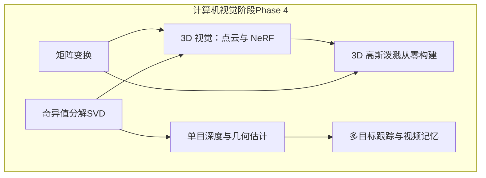
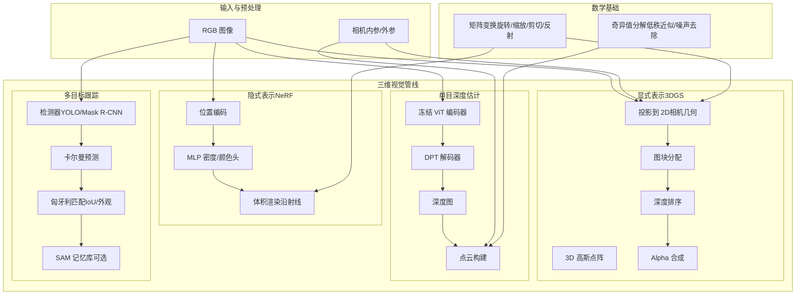
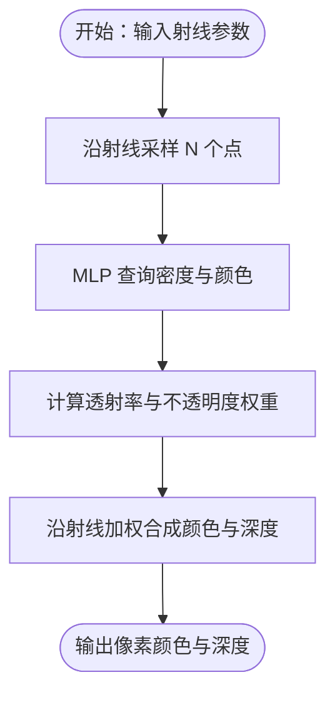
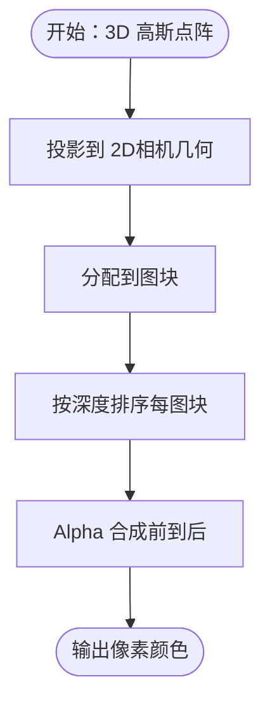
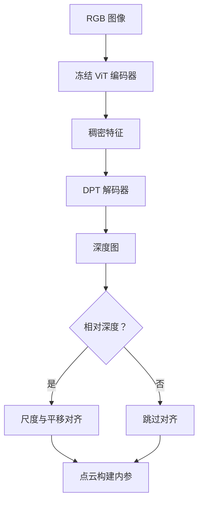
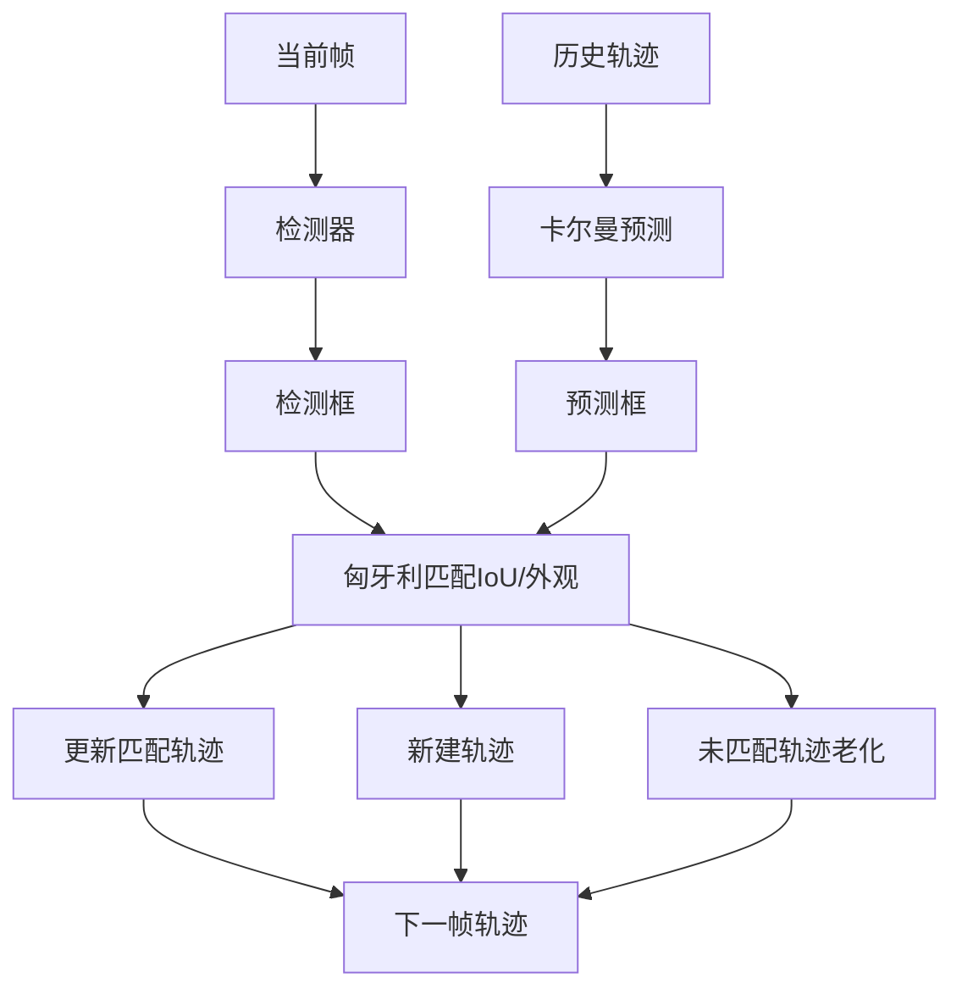
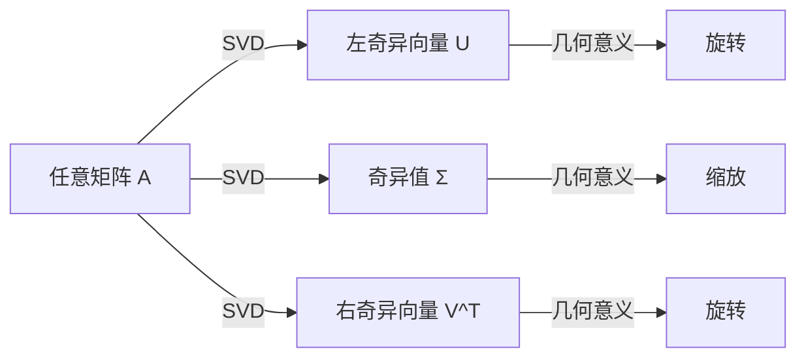
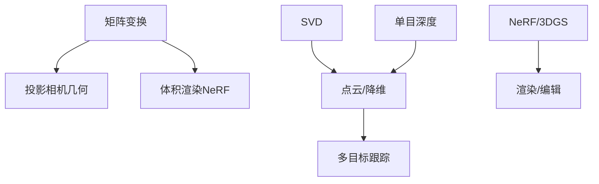

# 三维视觉

<cite>
**本文引用的文件**
- [README.md](file://README.md)
- [site/data.js](file://site/data.js)
- [phases/04-computer-vision/13-3d-vision-nerf/docs/en.md](file://phases/04-computer-vision/13-3d-vision-nerf/docs/en.md)
- [phases/04-computer-vision/22-3d-gaussian-splatting/docs/en.md](file://phases/04-computer-vision/22-3d-gaussian-splatting/docs/en.md)
- [phases/04-computer-vision/26-monocular-depth/docs/en.md](file://phases/04-computer-vision/26-monocular-depth/docs/en.md)
- [phases/04-computer-vision/27-multi-object-tracking/docs/en.md](file://phases/04-computer-vision/27-multi-object-tracking/docs/en.md)
- [phases/04-computer-vision/13-3d-vision-nerf/docs/zh.md](file://phases/04-computer-vision/13-3d-vision-nerf/docs/zh.md)
- [phases/04-computer-vision/22-3d-gaussian-splatting/docs/zh.md](file://phases/04-computer-vision/22-3d-gaussian-splatting/docs/zh.md)
- [phases/04-computer-vision/26-monocular-depth/docs/zh.md](file://phases/04-computer-vision/26-monocular-depth/docs/zh.md)
- [phases/04-computer-vision/27-multi-object-tracking/docs/zh.md](file://phases/04-computer-vision/27-multi-object-tracking/docs/zh.md)
- [phases/01-math-foundations/03-matrix-transformations/docs/en.md](file://phases/01-math-foundations/03-matrix-transformations/docs/en.md)
- [phases/01-math-foundations/11-singular-value-decomposition/docs/en.md](file://phases/01-math-foundations/11-singular-value-decomposition/docs/en.md)
</cite>

## 目录
1. [引言](#引言)
2. [项目结构](#项目结构)
3. [核心组件](#核心组件)
4. [架构总览](#架构总览)
5. [详细组件分析](#详细组件分析)
6. [依赖分析](#依赖分析)
7. [性能考虑](#性能考虑)
8. [故障排查指南](#故障排查指南)
9. [结论](#结论)
10. [附录](#附录)

## 引言
本课程围绕“三维视觉”这一主题，系统讲解从传统方法到前沿技术的完整知识体系，涵盖三维重建、场景表示、视图合成、单目深度估计、立体匹配、多目标跟踪与视频记忆、以及相机标定与点云处理等。课程特别强调两大代表性技术路线：
- 隐式场景表示：以 NeRF 为代表，将场景建模为连续的体积场，通过神经网络学习从位置与视角到密度与颜色的映射，并通过沿射线的体积渲染合成新视角。
- 显式场景表示：以 3D 高斯泼溅（3D Gaussian Splatting, 3DGS）为代表，将场景表示为大量可微的 3D 高斯点阵，通过光栅化与 alpha 合成实现高效渲染与编辑。

此外，课程还覆盖传统三维视觉技术（单目深度估计、多目标跟踪）与数学基础（矩阵变换、SVD），并给出在 AR/VR、机器人、自动驾驶等领域的应用脉络与实践建议。

## 项目结构
本课程位于“计算机视觉”阶段（Phase 4），共包含 28 课，其中与三维视觉直接相关的内容如下：
- 13 课：3D 视觉：点云与 NeRF
- 22 课：3D 高斯泼溅（从零构建）
- 26 课：单目深度与几何估计
- 27 课：多目标跟踪与视频记忆
- 数学基础：矩阵变换、奇异值分解（SVD）

**图表来源**
- [README.md:346-379](file://README.md#L346-L379)
- [site/data.js:741-7700](file://site/data.js#L741-L7700)

**章节来源**
- [README.md:346-379](file://README.md#L346-L379)
- [site/data.js:741-7700](file://site/data.js#L741-L7700)

## 核心组件
- 隐式场景表示（NeRF）：将场景映射为连续体积场，通过位置与视角编码、MLP 密度与颜色头、沿射线的体积渲染合成新视角。
- 显式场景表示（3DGS）：将场景表示为大量 3D 高斯点阵，通过投影、图块分配、深度排序与 alpha 合成进行光栅化渲染，并支持可微优化与动态扩展。
- 单目深度估计：利用冻结 ViT 编码器与 DPT 解码器，或扩散模型（如 Marigold）进行深度估计；支持相对/度量深度与点云提升。
- 多目标跟踪：基于检测的跟踪（SORT/DeepSORT/ByteTrack/BoT-SORT）与基于记忆的跟踪（SAM 2/SAM 3.1 Object Multiplex）。
- 数学基础：矩阵变换（旋转/缩放/剪切/反射）、SVD（低秩近似、推荐系统、语义分析、噪声去除）。

**章节来源**
- [phases/04-computer-vision/13-3d-vision-nerf/docs/en.md:71-117](file://phases/04-computer-vision/13-3d-vision-nerf/docs/en.md#L71-L117)
- [phases/04-computer-vision/22-3d-gaussian-splatting/docs/en.md:27-122](file://phases/04-computer-vision/22-3d-gaussian-splatting/docs/en.md#L27-L122)
- [phases/04-computer-vision/26-monocular-depth/docs/en.md:27-103](file://phases/04-computer-vision/26-monocular-depth/docs/en.md#L27-L103)
- [phases/04-computer-vision/27-multi-object-tracking/docs/en.md:27-98](file://phases/04-computer-vision/27-multi-object-tracking/docs/en.md#L27-L98)
- [phases/01-math-foundations/03-matrix-transformations/docs/en.md:25-238](file://phases/01-math-foundations/03-matrix-transformations/docs/en.md#L25-L238)
- [phases/01-math-foundations/11-singular-value-decomposition/docs/en.md:25-196](file://phases/01-math-foundations/11-singular-value-decomposition/docs/en.md#L25-L196)

## 架构总览
下图展示了从输入图像到三维场景表示与渲染的关键流程，以及与数学基础的关系：

**图表来源**
- [phases/04-computer-vision/13-3d-vision-nerf/docs/en.md:71-117](file://phases/04-computer-vision/13-3d-vision-nerf/docs/en.md#L71-L117)
- [phases/04-computer-vision/22-3d-gaussian-splatting/docs/en.md:43-122](file://phases/04-computer-vision/22-3d-gaussian-splatting/docs/en.md#L43-L122)
- [phases/04-computer-vision/26-monocular-depth/docs/en.md:34-103](file://phases/04-computer-vision/26-monocular-depth/docs/en.md#L34-L103)
- [phases/04-computer-vision/27-multi-object-tracking/docs/en.md:27-98](file://phases/04-computer-vision/27-multi-object-tracking/docs/en.md#L27-L98)
- [phases/01-math-foundations/03-matrix-transformations/docs/en.md:25-238](file://phases/01-math-foundations/03-matrix-transformations/docs/en.md#L25-L238)
- [phases/01-math-foundations/11-singular-value-decomposition/docs/en.md:25-196](file://phases/01-math-foundations/11-singular-value-decomposition/docs/en.md#L25-L196)

## 详细组件分析

### 组件 A：NeRF 隐式场景表示与渲染
- 核心思想：将场景建模为连续的体积场，MLP 将位置与视角映射到密度与颜色；通过沿射线的体积积分合成新视角。
- 关键步骤：位置编码（傅里叶特征）、MLP 密度/颜色头、沿射线采样、透射率与不透明度计算、权重求和得到像素颜色与深度。
- 优缺点：表达能力强、可无缝合成新视角；训练/渲染耗时长，几何编辑需重新训练。

**图表来源**
- [phases/04-computer-vision/13-3d-vision-nerf/docs/en.md:78-107](file://phases/04-computer-vision/13-3d-vision-nerf/docs/en.md#L78-L107)

**章节来源**
- [phases/04-computer-vision/13-3d-vision-nerf/docs/en.md:71-117](file://phases/04-computer-vision/13-3d-vision-nerf/docs/en.md#L71-L117)
- [phases/04-computer-vision/13-3d-vision-nerf/docs/zh.md:71-117](file://phases/04-computer-vision/13-3d-vision-nerf/docs/zh.md#L71-L117)

### 组件 B：3D 高斯泼溅（显式场景表示）
- 核心思想：场景由大量 3D 高斯点阵组成，每个高斯携带位置、旋转、尺度、不透明度与球面调和（Spherical Harmonics, SH）颜色；通过光栅化与 alpha 合成渲染。
- 关键步骤：3D 高斯投影到 2D、图块分配、深度排序、alpha 合成；支持致密化（克隆/分裂）与剪枝；SH 用于视角依赖的颜色。
- 优缺点：渲染实时、可微、易于编辑；需大量高斯体存储与优化。

**图表来源**
- [phases/04-computer-vision/22-3d-gaussian-splatting/docs/en.md:43-86](file://phases/04-computer-vision/22-3d-gaussian-splatting/docs/en.md#L43-L86)

**章节来源**
- [phases/04-computer-vision/22-3d-gaussian-splatting/docs/en.md:27-122](file://phases/04-computer-vision/22-3d-gaussian-splatting/docs/en.md#L27-L122)
- [phases/04-computer-vision/22-3d-gaussian-splatting/docs/zh.md:27-122](file://phases/04-computer-vision/22-3d-gaussian-splatting/docs/zh.md#L27-L122)

### 组件 C：单目深度估计与点云构建
- 核心思想：利用冻结 ViT 编码器与 DPT 解码器预测深度图；支持相对/度量深度；结合相机内参将深度图提升为点云。
- 关键步骤：编码器特征提取、解码器上采样、深度图生成、尺度与平移对齐（相对深度）、点云构建与导出。
- 评估指标：相对深度使用 AbsRel 与 delta 准确率；度量深度使用绝对误差与阈值准确率。

**图表来源**
- [phases/04-computer-vision/26-monocular-depth/docs/en.md:34-103](file://phases/04-computer-vision/26-monocular-depth/docs/en.md#L34-L103)

**章节来源**
- [phases/04-computer-vision/26-monocular-depth/docs/en.md:27-103](file://phases/04-computer-vision/26-monocular-depth/docs/en.md#L27-L103)
- [phases/04-computer-vision/26-monocular-depth/docs/zh.md:27-103](file://phases/04-computer-vision/26-monocular-depth/docs/zh.md#L27-L103)

### 组件 D：多目标跟踪（基于检测与记忆）
- 基于检测的跟踪：检测器输出框，卡尔曼预测，匈牙利算法匹配 IoU/外观特征，维持轨迹生命周期。
- 基于记忆的跟踪：SAM 2 的记忆库跨帧存储实例特征，通过注意力隐式关联；SAM 3.1 Object Multiplex 将多实例共享记忆，降低复杂度。
- 评估指标：MOTA（综合错误）、IDF1（ID 保持）、HOTA（检测与关联分解）。

**图表来源**
- [phases/04-computer-vision/27-multi-object-tracking/docs/en.md:27-46](file://phases/04-computer-vision/27-multi-object-tracking/docs/en.md#L27-L46)

**章节来源**
- [phases/04-computer-vision/27-multi-object-tracking/docs/en.md:27-98](file://phases/04-computer-vision/27-multi-object-tracking/docs/en.md#L27-L98)
- [phases/04-computer-vision/27-multi-object-tracking/docs/zh.md:27-98](file://phases/04-computer-vision/27-multi-object-tracking/docs/zh.md#L27-L98)

### 组件 E：数学基础（矩阵变换与 SVD）
- 矩阵变换：旋转、缩放、剪切、反射的几何意义与组合；特征值与主成分分析（PCA）；行列式与体积缩放。
- SVD：任意矩阵的 UΣV^T 分解；低秩近似、噪声去除、推荐系统与潜在因子分解、语义分析（LSA）。

**图表来源**
- [phases/01-math-foundations/11-singular-value-decomposition/docs/en.md:25-97](file://phases/01-math-foundations/11-singular-value-decomposition/docs/en.md#L25-L97)

**章节来源**
- [phases/01-math-foundations/03-matrix-transformations/docs/en.md:25-238](file://phases/01-math-foundations/03-matrix-transformations/docs/en.md#L25-L238)
- [phases/01-math-foundations/11-singular-value-decomposition/docs/en.md:25-196](file://phases/01-math-foundations/11-singular-value-decomposition/docs/en.md#L25-L196)

## 依赖分析
- 数学基础对三维视觉的重要性：
  - 矩阵变换支撑相机几何（旋转/平移/投影）与 3DGS 的协方差投影。
  - SVD 支撑点云降维、噪声去除、深度估计的低秩结构与推荐系统的潜在因子分解。
- 技术路线依赖关系：
  - NeRF 依赖位置编码与体积渲染；3DGS 依赖投影、图块与 alpha 合成；二者共同构成“隐式/显式”两大场景表示范式。
  - 单目深度估计为多目标跟踪提供几何先验（深度图）；跟踪为下游任务（AR/导航/机器人）提供时序一致性。

**图表来源**
- [phases/01-math-foundations/03-matrix-transformations/docs/en.md:25-238](file://phases/01-math-foundations/03-matrix-transformations/docs/en.md#L25-L238)
- [phases/01-math-foundations/11-singular-value-decomposition/docs/en.md:25-196](file://phases/01-math-foundations/11-singular-value-decomposition/docs/en.md#L25-L196)
- [phases/04-computer-vision/13-3d-vision-nerf/docs/en.md:71-117](file://phases/04-computer-vision/13-3d-vision-nerf/docs/en.md#L71-L117)
- [phases/04-computer-vision/22-3d-gaussian-splatting/docs/en.md:43-86](file://phases/04-computer-vision/22-3d-gaussian-splatting/docs/en.md#L43-L86)
- [phases/04-computer-vision/26-monocular-depth/docs/en.md:34-103](file://phases/04-computer-vision/26-monocular-depth/docs/en.md#L34-L103)
- [phases/04-computer-vision/27-multi-object-tracking/docs/en.md:27-98](file://phases/04-computer-vision/27-multi-object-tracking/docs/en.md#L27-L98)

**章节来源**
- [phases/01-math-foundations/03-matrix-transformations/docs/en.md:25-238](file://phases/01-math-foundations/03-matrix-transformations/docs/en.md#L25-L238)
- [phases/01-math-foundations/11-singular-value-decomposition/docs/en.md:25-196](file://phases/01-math-foundations/11-singular-value-decomposition/docs/en.md#L25-L196)
- [phases/04-computer-vision/13-3d-vision-nerf/docs/en.md:71-117](file://phases/04-computer-vision/13-3d-vision-nerf/docs/en.md#L71-L117)
- [phases/04-computer-vision/22-3d-gaussian-splatting/docs/en.md:43-86](file://phases/04-computer-vision/22-3d-gaussian-splatting/docs/en.md#L43-L86)
- [phases/04-computer-vision/26-monocular-depth/docs/en.md:34-103](file://phases/04-computer-vision/26-monocular-depth/docs/en.md#L34-L103)
- [phases/04-computer-vision/27-multi-object-tracking/docs/en.md:27-98](file://phases/04-computer-vision/27-multi-object-tracking/docs/en.md#L27-L98)

## 性能考虑
- NeRF：训练/渲染耗时长，适合离线高质量重建；可通过哈希网格编码（Instant-NGP）与体积渲染优化加速。
- 3DGS：GPU 光栅化渲染，实时/准实时；通过致密化与剪枝控制高斯体数量；导出格式（.ply/.splat/glTF/USD）影响加载与跨平台兼容性。
- 单目深度：Depth Anything V3 为 2026 默认，推理速度快；Marigold 画质更佳但速度较慢；度量深度需内参或内参估计。
- 多目标跟踪：ByteTrack/BoT-SORT 实时性好；SAM 2/3.1 在遮挡与开放词汇场景表现更优但速度较慢；指标选择应与任务目标匹配（MOTA/IDF1/HOTA）。

[本节为通用指导，不直接分析具体文件]

## 故障排查指南
- NeRF/3DGS 渲染质量不佳
  - 检查位置编码频率层数是否足够；确认体积渲染/alpha 合成参数设置。
  - 3DGS：检查致密化/剪枝策略与 SH 度数设置。
- 单目深度误差较大
  - 相对深度需进行尺度与平移对齐；度量深度需确保内参准确；纹理缺失/镜面反射区域易错。
- 多目标跟踪 ID 切换频繁
  - 调整 IoU 阈值与匈牙利匹配策略；引入外观特征（ReID）或使用基于记忆的跟踪（SAM 2/3.1）。
- 点云质量差
  - 检查内参与深度图掩码；SVD 降噪与低秩近似是否合理。

**章节来源**
- [phases/04-computer-vision/13-3d-vision-nerf/docs/en.md:109-117](file://phases/04-computer-vision/13-3d-vision-nerf/docs/en.md#L109-L117)
- [phases/04-computer-vision/22-3d-gaussian-splatting/docs/en.md:92-101](file://phases/04-computer-vision/22-3d-gaussian-splatting/docs/en.md#L92-L101)
- [phases/04-computer-vision/26-monocular-depth/docs/en.md:95-103](file://phases/04-computer-vision/26-monocular-depth/docs/en.md#L95-L103)
- [phases/04-computer-vision/27-multi-object-tracking/docs/en.md:91-98](file://phases/04-computer-vision/27-multi-object-tracking/docs/en.md#L91-L98)

## 结论
本课程系统梳理了从隐式（NeRF）到显式（3DGS）的三维场景表示方法，结合单目深度估计与多目标跟踪，形成从感知到理解的完整链路。数学基础（矩阵变换与 SVD）贯穿其中，既提供几何直觉，也为降维、去噪与潜在结构发现奠定理论基础。在 AR/VR、机器人与自动驾驶等领域，这些技术正逐步从离线高质量重建走向实时/准实时与可编辑的生产化应用。

[本节为总结性内容，不直接分析具体文件]

## 附录
- 术语速查
  - NeRF：神经辐射场，隐式体积场表示与渲染。
  - 3DGS：3D 高斯泼溅，显式高斯点阵表示与光栅化渲染。
  - 相对深度/度量深度：深度图是否具备真实尺度单位。
  - MOTA/IDF1/HOTA：多目标跟踪的三大指标。
  - SVD：奇异值分解，任意矩阵的 UΣV^T 分解。

[本节为概念性内容，不直接分析具体文件]