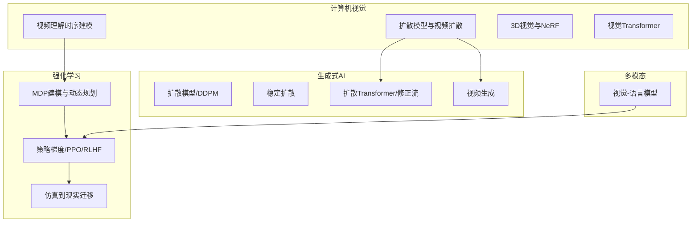
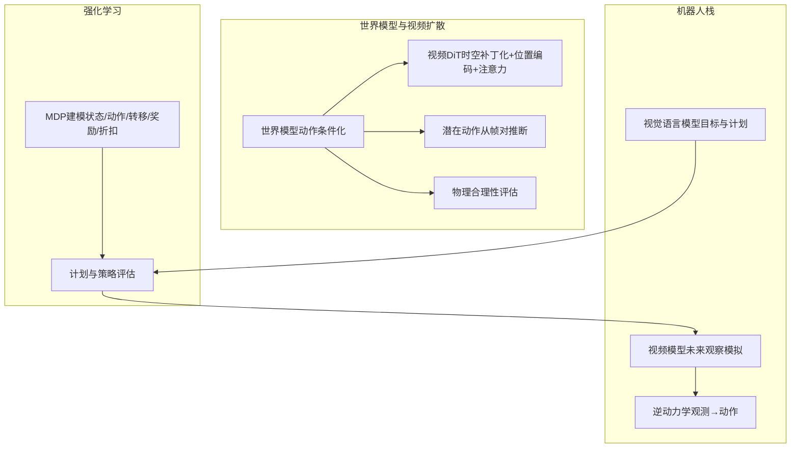
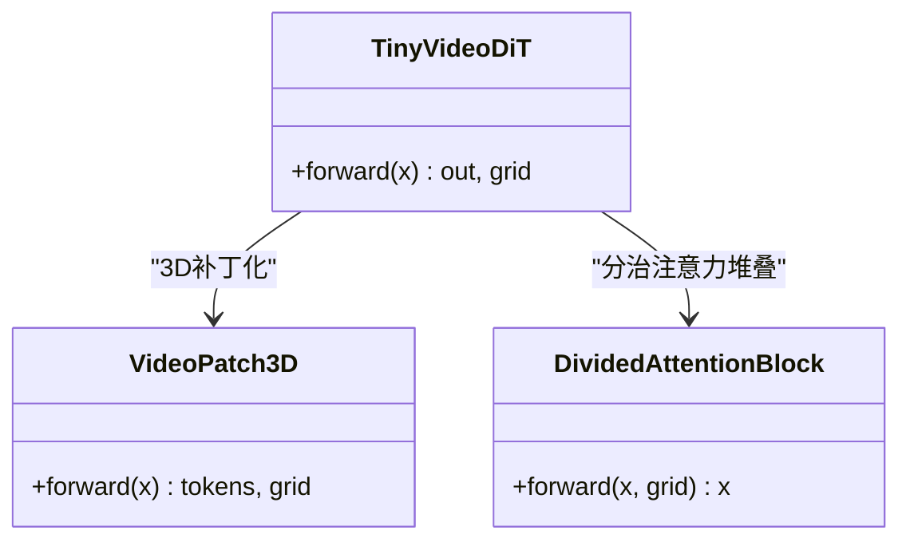
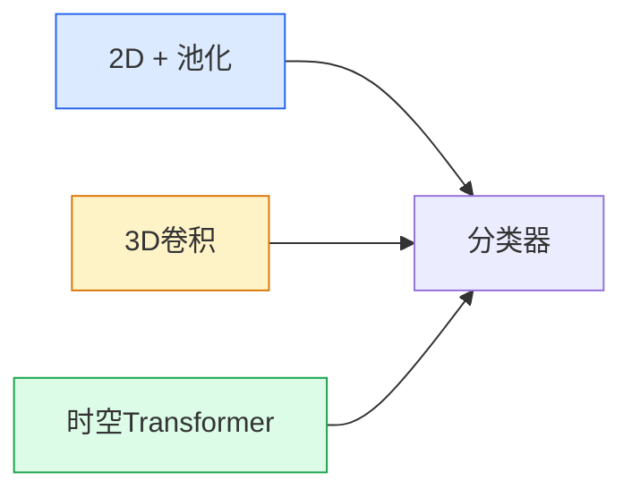
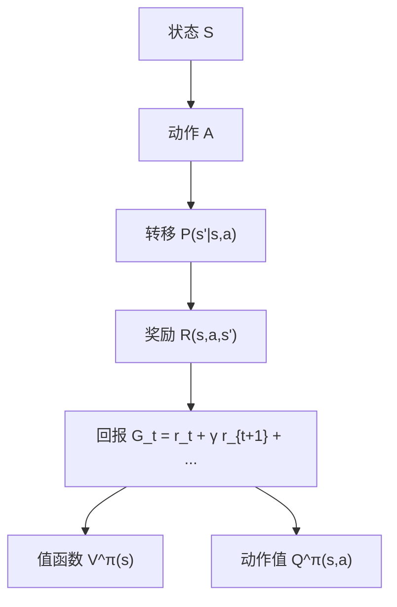
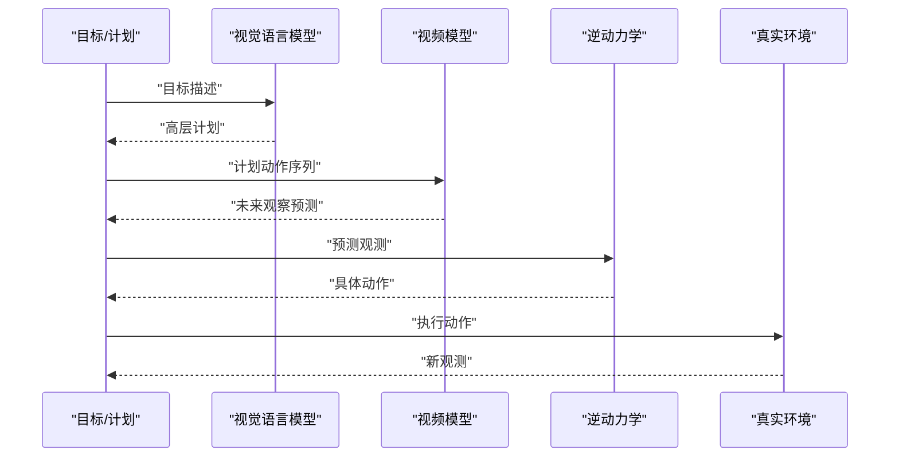
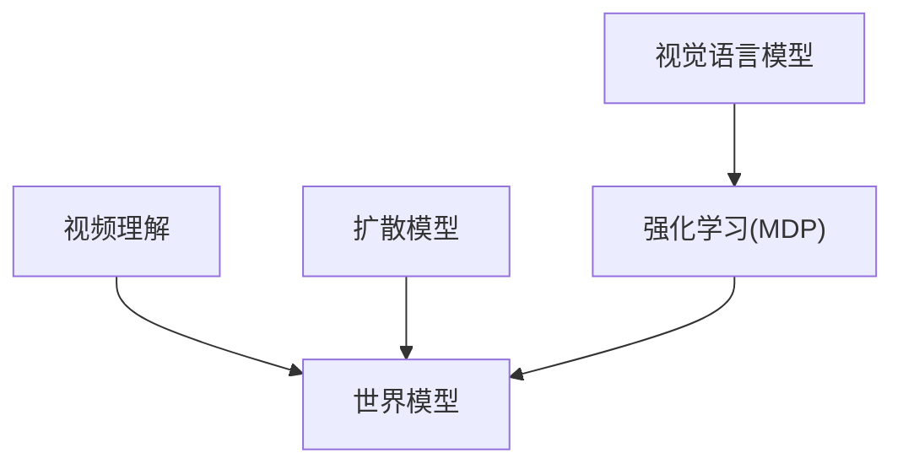

# 世界模型与视频扩散

<cite>
**本文引用的文件**
- [phases/04-computer-vision/28-world-models-video-diffusion/docs/en.md](file://phases/04-computer-vision/28-world-models-video-diffusion/docs/en.md)
- [phases/04-computer-vision/28-world-models-video-diffusion/code/main.py](file://phases/04-computer-vision/28-world-models-video-diffusion/code/main.py)
- [phases/04-computer-vision/12-video-understanding/docs/en.md](file://phases/04-computer-vision/12-video-understanding/docs/en.md)
- [phases/09-reinforcement-learning/01-mdps-states-actions-rewards/docs/en.md](file://phases/09-reinforcement-learning/01-mdps-states-actions-rewards/docs/en.md)
- [site/figures-frontier.js](file://site/figures-frontier.js)
- [README.md](file://README.md)
</cite>

## 目录
1. [引言](#引言)
2. [项目结构](#项目结构)
3. [核心组件](#核心组件)
4. [架构总览](#架构总览)
5. [详细组件分析](#详细组件分析)
6. [依赖分析](#依赖分析)
7. [性能考量](#性能考量)
8. [故障排查指南](#故障排查指南)
9. [结论](#结论)
10. [附录](#附录)

## 引言
本课程围绕“世界模型（World Models）”与“视频扩散（Video Diffusion）”两大主题展开，目标是帮助读者理解：
- 世界模型的概念、构建方法及其在强化学习中的应用；
- 视频扩散模型的原理与实现，包括时空一致性建模、长期依赖建模等关键技术；
- Dreamer、PETS 等经典世界模型的架构设计与训练策略；
- 基于世界模型的视频生成、视频编辑、视频预测等应用任务；
- 环境模拟、计划制定、决策执行的强化学习流程；
- 在游戏AI、机器人控制、内容创作等领域的应用前景。

本课程以计算机视觉与强化学习为主线，结合视频理解、扩散模型与时间建模等知识，形成从数据到推理再到行动的完整闭环。

## 项目结构
本仓库为系统化的AI工程学习项目，涵盖数学基础、机器学习、深度学习、计算机视觉、生成式AI、强化学习、多模态、工具与协议、智能体工程、自主系统、基础设施与生产、伦理安全与对齐、以及综合项目实践等阶段与课程。与本课程直接相关的关键模块如下：
- 计算机视觉：视频理解（时序建模）、扩散模型、视频扩散、3D视觉与NeRF、视觉Transformer等；
- 强化学习：MDP建模、动态规划、蒙特卡洛、Q学习/SARSA、DQN、策略梯度、PPO、奖励建模与RLHF、多智能体RL、仿真到现实迁移、游戏RL等；
- 生成式AI：扩散模型、稳定扩散、扩散Transformer与修正流、视频生成等；
- 多模态：视觉-语言模型、跨模态融合等；
- 工具与协议：MCP、LangGraph、Agent框架、可观测性等；
- 智能体工程：代理循环、计划与执行、反思、树状思维、工具使用、记忆与虚拟上下文、混合记忆、技能库、规划（HTN/进化）、工作流模式等；
- 自主系统：长视域代理、星系家族推理、自动化科学、递归自我改进、有界自我改进等；
- 基础设施与生产：推理平台经济学、分布式推理、KV缓存、批量API、模型路由、生产量化、冷启动缓解、边缘推理、可观测性、安全与合规等；
- 伦理安全与对齐：指令遵循对齐信号、直接偏好优化家族、宪法AI与RLAIF、可塑性优化与欺骗对齐、红队与自动攻击、可扩展监督、弱转强、水印与合成标识、监管框架与数据溯源等。

章节来源
- [README.md: 350-520:350-520](file://README.md#L350-L520)

## 核心组件
本课程的核心由以下三部分组成：
- 世界模型与视频扩散：定义世界模型范式、视频DiT架构、动作条件化、物理合理性评估、自动驾驶与机器人栈等；
- 视频理解与时序建模：对比2D+池化、3D卷积、时空Transformer三种主流架构，给出采样策略与基准实现；
- 强化学习基础：MDP形式化、策略评估、回报与折扣、常见陷阱与最佳实践。

章节来源
- [phases/04-computer-vision/28-world-models-video-diffusion/docs/en.md: 10-300:10-300](file://phases/04-computer-vision/28-world-models-video-diffusion/docs/en.md#L10-L300)
- [phases/04-computer-vision/12-video-understanding/docs/en.md: 10-273:10-273](file://phases/04-computer-vision/12-video-understanding/docs/en.md#L10-L273)
- [phases/09-reinforcement-learning/01-mdps-states-actions-rewards/docs/en.md: 10-193:10-193](file://phases/09-reinforcement-learning/01-mdps-states-actions-rewards/docs/en.md#L10-L193)

## 架构总览
世界模型将“感知—推理—行动”整合为一个统一的学习框架。其典型流程包括：
- 世界模型（视频扩散）：以过去帧与动作作为条件，预测未来帧，形成可交互的“可学习模拟器”；
- 机器人栈：视觉语言模型（VLM）给出高层目标与计划，视频模型进行未来观察的模拟，逆动力学模型将模拟的观测映射为具体动作；
- 强化学习：在MDP框架下，通过策略评估与改进，实现样本高效的学习与决策。

图表来源
- [phases/04-computer-vision/28-world-models-video-diffusion/docs/en.md: 27-100:27-100](file://phases/04-computer-vision/28-world-models-video-diffusion/docs/en.md#L27-L100)
- [phases/09-reinforcement-learning/01-mdps-states-actions-rewards/docs/en.md: 18-44:18-44](file://phases/09-reinforcement-learning/01-mdps-states-actions-rewards/docs/en.md#L18-L44)

## 详细组件分析

### 组件A：视频DiT与时空建模
视频DiT通过3D补丁化、3D旋转位置编码与分治注意力，实现时空一致的视频生成与预测。其要点包括：
- 3D补丁化：将视频张量（C, T, H, W）按（P_t, P_h, P_w）分块，得到时空token网格；
- 3D旋转位置编码：分别对时间、空间维度施加旋转位置编码，使注意力具备时空语义；
- 分治注意力：先在同一空间位置上做时间注意力，再在同一时刻内做空间注意力，显著降低计算复杂度；
- 与扩散/修正流结合：AdaLN条件与Rectified Flow提升训练稳定性与质量。

图表来源
- [phases/04-computer-vision/28-world-models-video-diffusion/code/main.py: 6-61:6-61](file://phases/04-computer-vision/28-world-models-video-diffusion/code/main.py#L6-L61)

章节来源
- [phases/04-computer-vision/28-world-models-video-diffusion/docs/en.md: 52-100:52-100](file://phases/04-computer-vision/28-world-models-video-diffusion/docs/en.md#L52-L100)
- [phases/04-computer-vision/28-world-models-video-diffusion/code/main.py: 64-96:64-96](file://phases/04-computer-vision/28-world-models-video-diffusion/code/main.py#L64-L96)

### 组件B：视频理解与时序建模
视频理解的三大架构家族：
- 2D+池化：逐帧运行2D CNN，然后对时间维做平均/最大池化或注意力池化；优点是可直接利用ImageNet预训练，计算开销低；缺点是对运动不敏感；
- 3D卷积：在（T, H, W）上直接卷积，早期代表如I3D；通过“膨胀”将2D核复制到时间轴，获得更强的预训练权重；
- 时空Transformer：将视频切分为时空patch并进行注意力聚合；支持联合、分治、因子化等注意力变体，准确率高但计算昂贵。

图表来源
- [phases/04-computer-vision/12-video-understanding/docs/en.md: 29-42:29-42](file://phases/04-computer-vision/12-video-understanding/docs/en.md#L29-L42)

章节来源
- [phases/04-computer-vision/12-video-understanding/docs/en.md: 44-94:44-94](file://phases/04-computer-vision/12-video-understanding/docs/en.md#L44-L94)

### 组件C：MDP建模与强化学习基础
MDP是强化学习的数学基础，包含状态、动作、转移概率、奖励与折扣五要素。掌握MDP有助于：
- 正确建模任务，避免非马尔可夫状态、稀疏奖励、奖励黑客等陷阱；
- 明确折扣率与有效视野的关系，指导算法选择与超参数设置；
- 将控制、游戏、库存定价、RLHF等不同场景抽象为同一框架。

图表来源
- [phases/09-reinforcement-learning/01-mdps-states-actions-rewards/docs/en.md: 20-44:20-44](file://phases/09-reinforcement-learning/01-mdps-states-actions-rewards/docs/en.md#L20-L44)

章节来源
- [phases/09-reinforcement-learning/01-mdps-states-actions-rewards/docs/en.md: 10-193:10-193](file://phases/09-reinforcement-learning/01-mdps-states-actions-rewards/docs/en.md#L10-L193)

### 组件D：世界模型在强化学习中的应用
世界模型通过“计划—模拟—执行”的闭环，减少真实环境交互次数，提高样本效率。典型流程：
- 计划：VLM给出高层目标与动作序列；
- 模拟：视频模型预测执行每个动作后的未来观察；
- 执行：逆动力学模型将模拟观测转化为具体动作；
- 反馈：真实执行后，新的观测回传至计划阶段。

图表来源
- [phases/04-computer-vision/28-world-models-video-diffusion/docs/en.md: 92-100:92-100](file://phases/04-computer-vision/28-world-models-video-diffusion/docs/en.md#L92-L100)

章节来源
- [phases/04-computer-vision/28-world-models-video-diffusion/docs/en.md: 92-100:92-100](file://phases/04-computer-vision/28-world-models-video-diffusion/docs/en.md#L92-L100)

### 组件E：模型与评估指标
- 模型类别：纯视频生成（如Sora 2）、动作条件化世界模型（如Genie 3/GWM-1 Worlds）、潜空间世界模型（如DreamerV3）；
- 评估指标：视觉质量（FVD）、提示对齐（CLIPScore/VQA）、物理合理性（手评基准VBench）、可控性（动作→观测一致性）。

章节来源
- [phases/04-computer-vision/28-world-models-video-diffusion/docs/en.md: 102-121:102-121](file://phases/04-computer-vision/28-world-models-video-diffusion/docs/en.md#L102-L121)

## 依赖分析
- 视频理解与世界模型：视频理解为世界模型提供时序建模与数据准备的基础；视频DiT是世界模型的核心骨干；
- 生成式AI与扩散：扩散模型与修正流为视频DiT提供稳定的训练范式与高质量生成能力；
- 强化学习：MDP建模为世界模型在机器人与控制任务中的应用提供统一框架；
- 多模态：视觉语言模型负责高层目标与计划，是机器人栈的前端入口。

图表来源
- [phases/04-computer-vision/12-video-understanding/docs/en.md: 29-42:29-42](file://phases/04-computer-vision/12-video-understanding/docs/en.md#L29-L42)
- [phases/04-computer-vision/28-world-models-video-diffusion/docs/en.md: 27-46:27-46](file://phases/04-computer-vision/28-world-models-video-diffusion/docs/en.md#L27-L46)
- [phases/09-reinforcement-learning/01-mdps-states-actions-rewards/docs/en.md: 18-44:18-44](file://phases/09-reinforcement-learning/01-mdps-states-actions-rewards/docs/en.md#L18-L44)

## 性能考量
- 注意力复杂度：全联注意需O(N^2)，在长视频中不可行；分治注意力将复杂度分解为时间与空间两部分，线性级缩放更实用；
- 参数与显存：视频DiT的参数规模与输入时长、分辨率、补丁尺寸密切相关；合理选择补丁大小与深度可在质量和效率间取得平衡；
- 训练稳定性：结合AdaLN条件与修正流，有助于稳定扩散训练与视频生成质量；
- 推理效率：在机器人栈中，应优先采用轻量的逆动力学模型与高效的视频模拟器，确保实时性。

## 故障排查指南
- 非马尔可夫状态：若需要历史信息才能决策，应在状态中显式加入帧堆叠或使用RNN/GRU；
- 稀疏奖励：在复杂环境中引入中间奖励信号或模仿学习，加速收敛；
- 奖励黑客：确保奖励函数直接源于目标结果而非代理可操控的代理指标；
- 折扣误设：无限时域任务不应使用γ≥1；根据任务有效视野选择合适的γ；
- 奖励尺度：避免过大范围的奖励导致梯度爆炸，建议归一化到[-1,1]量级。

章节来源
- [phases/09-reinforcement-learning/01-mdps-states-actions-rewards/docs/en.md: 120-127:120-127](file://phases/09-reinforcement-learning/01-mdps-states-actions-rewards/docs/en.md#L120-L127)

## 结论
世界模型与视频扩散为“感知—推理—行动”的智能系统提供了强大的建模与生成能力。通过视频DiT的时空建模、动作条件化与物理合理性评估，结合MDP建模与机器人栈，可以在游戏AI、机器人控制、内容创作等领域实现高效、可控且可解释的智能行为。本课程提供的理论与实践框架，既适合入门学习，也可作为进一步研究与工程落地的起点。

## 附录
- 世界模型滚动图（概念图）：展示模型基于世界模型进行计划与模拟的思路，强调滚动深度与分支数对计算成本的影响。

章节来源
- [site/figures-frontier.js: 184-203:184-203](file://site/figures-frontier.js#L184-L203)