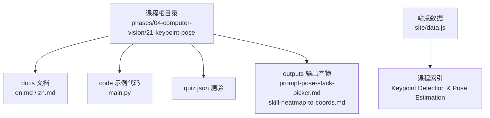
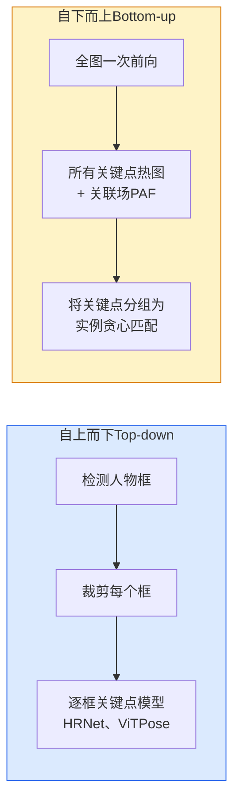
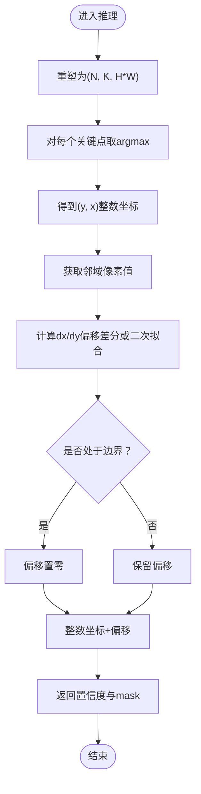
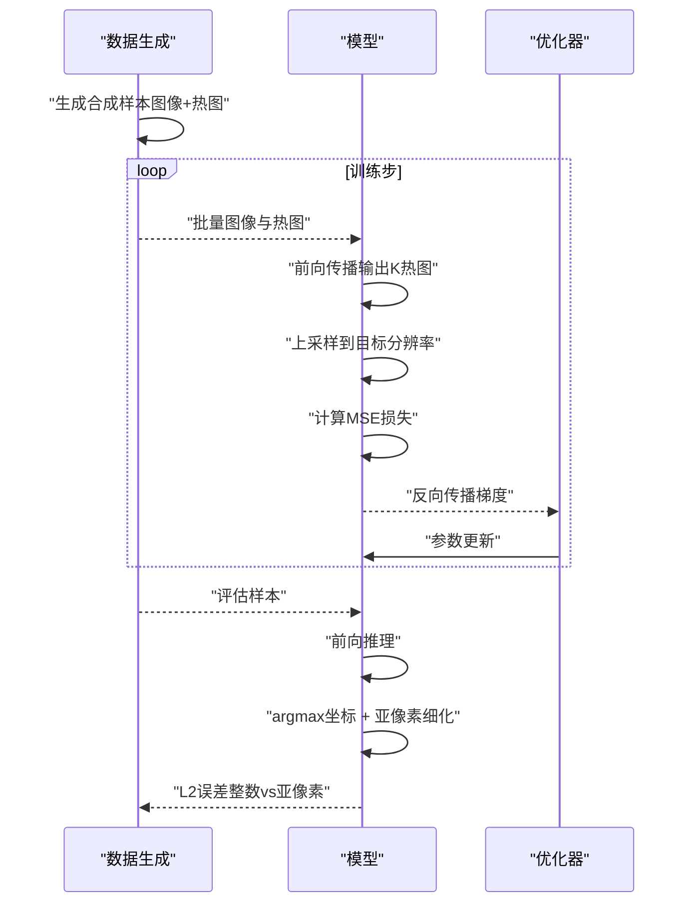
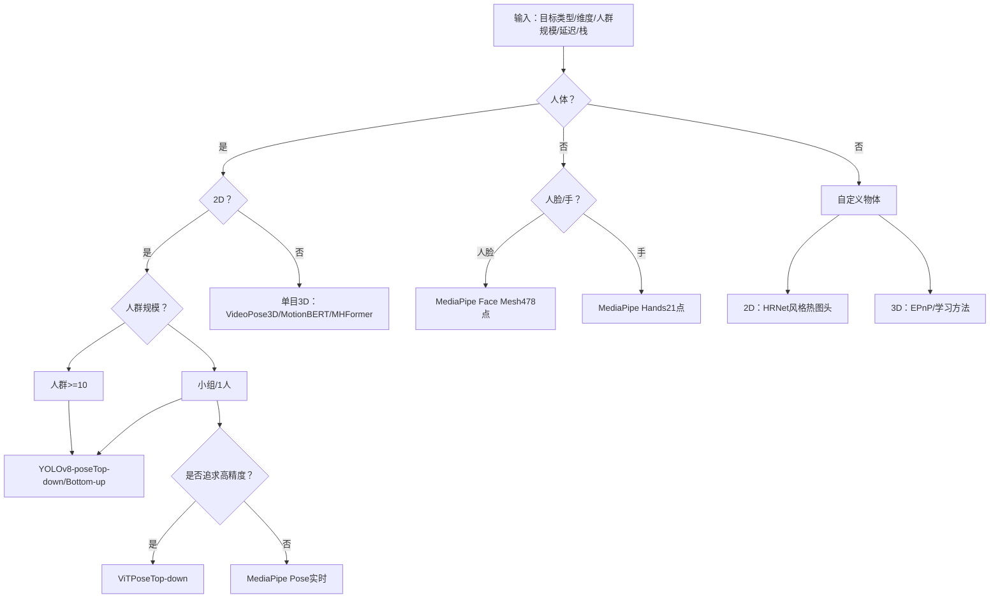
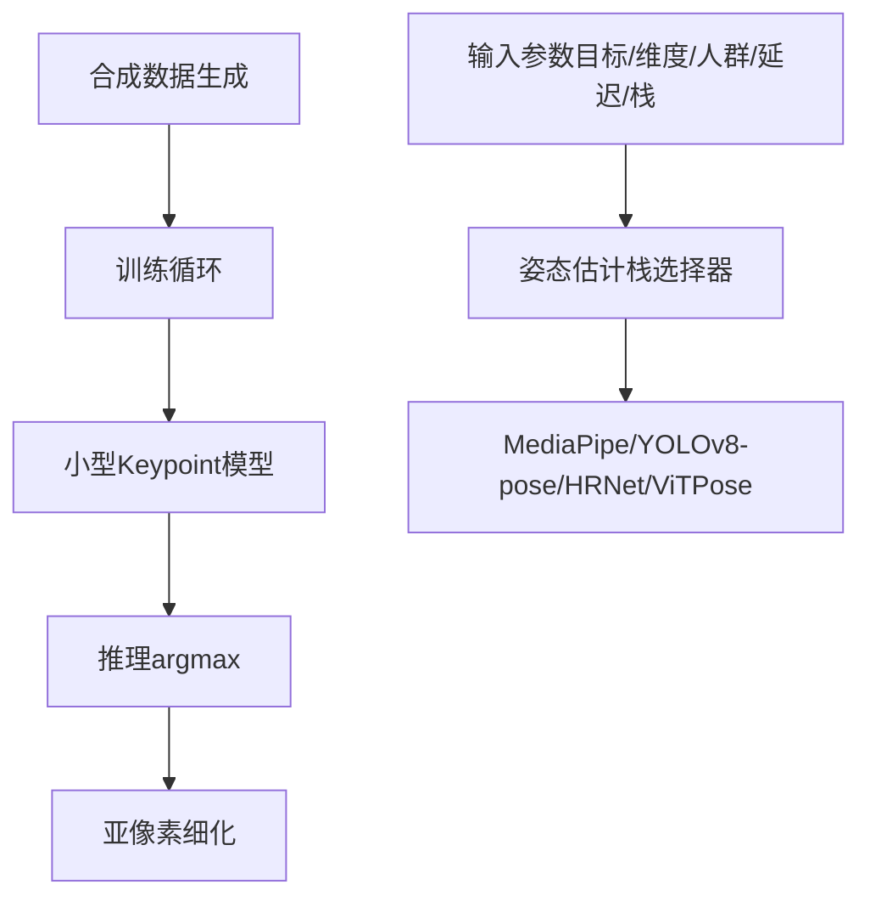

# 关键点与姿态估计

<cite>
**本文引用的文件**
- [phases/04-computer-vision/21-keypoint-pose/docs/en.md](file://phases/04-computer-vision/21-keypoint-pose/docs/en.md)
- [phases/04-computer-vision/21-keypoint-pose/docs/zh.md](file://phases/04-computer-vision/21-keypoint-pose/docs/zh.md)
- [phases/04-computer-vision/21-keypoint-pose/code/main.py](file://phases/04-computer-vision/21-keypoint-pose/code/main.py)
- [phases/04-computer-vision/21-keypoint-pose/quiz.json](file://phases/04-computer-vision/21-keypoint-pose/quiz.json)
- [phases/04-computer-vision/21-keypoint-pose/outputs/prompt-pose-stack-picker.md](file://phases/04-computer-vision/21-keypoint-pose/outputs/prompt-pose-stack-picker.md)
- [phases/04-computer-vision/21-keypoint-pose/outputs/skill-heatmap-to-coords.md](file://phases/04-computer-vision/21-keypoint-pose/outputs/skill-heatmap-to-coords.md)
- [site/data.js](file://site/data.js)
</cite>

## 目录
1. [引言](#引言)
2. [项目结构](#项目结构)
3. [核心组件](#核心组件)
4. [架构总览](#架构总览)
5. [详细组件分析](#详细组件分析)
6. [依赖关系分析](#依赖关系分析)
7. [性能考量](#性能考量)
8. [故障排查指南](#故障排查指南)
9. [结论](#结论)
10. [附录](#附录)

## 引言
本课程围绕“关键点检测与姿态估计”展开，系统讲解2D与3D姿态估计的任务定义、技术路线、经典网络架构、评估指标与工程实践。课程以动手实现为主线，结合理论与实操，帮助学习者掌握从热图回归、亚像素定位到多人姿态与3D重建的完整流程，并能在实际业务中选择合适的姿态估计栈（MediaPipe、YOLOv8-pose、HRNet、ViTPose等）。

## 项目结构
- 课程文档与代码位于计算机视觉阶段的第21课“关键点检测与姿态估计”，包含英文与中文文档、示例代码、练习与测验。
- 输出产物包括“姿态估计栈选择提示词”和“亚像素热图到坐标技能”，便于在工程实践中快速落地。
- 站点数据文件中收录了该课程与其他相关主题（如多目标跟踪、单目深度估计）的索引信息，便于扩展学习。

**图表来源**
- [site/data.js:799-816](file://site/data.js#L799-L816)
- [phases/04-computer-vision/21-keypoint-pose/docs/en.md:1-229](file://phases/04-computer-vision/21-keypoint-pose/docs/en.md#L1-L229)
- [phases/04-computer-vision/21-keypoint-pose/code/main.py:1-99](file://phases/04-computer-vision/21-keypoint-pose/code/main.py#L1-L99)
- [phases/04-computer-vision/21-keypoint-pose/outputs/prompt-pose-stack-picker.md:1-71](file://phases/04-computer-vision/21-keypoint-pose/outputs/prompt-pose-stack-picker.md#L1-L71)
- [phases/04-computer-vision/21-keypoint-pose/outputs/skill-heatmap-to-coords.md:1-107](file://phases/04-computer-vision/21-keypoint-pose/outputs/skill-heatmap-to-coords.md#L1-L107)

**章节来源**
- [site/data.js:799-816](file://site/data.js#L799-L816)
- [phases/04-computer-vision/21-keypoint-pose/docs/en.md:1-229](file://phases/04-computer-vision/21-keypoint-pose/docs/en.md#L1-L229)
- [phases/04-computer-vision/21-keypoint-pose/code/main.py:1-99](file://phases/04-computer-vision/21-keypoint-pose/code/main.py#L1-L99)

## 核心组件
- 任务定义与应用场景
  - 关键点：对象上的特定有序点（关节、角点、特征点）。
  - 姿态：属于单个实例的一组有序关键点。
  - 应用：动作捕捉、健身/运动分析、手势控制、动画、AR试穿、机器人抓取等。
- 技术路线
  - 2D姿态：热图回归（高斯目标）+ 亚像素定位；自上而下（Top-down）与自下而上（Bottom-up）两种范式。
  - 3D姿态：单目2D到3D提升（如VideoPose3D/MotionBERT/MHFormer）、多视角三角测量（CMU Panoptic）与SMPL/SMPL-X模型拟合。
- 经典网络架构
  - HRNet：高分辨率保留策略，主导Top-down。
  - ViTPose：纯视觉Transformer骨干，SOTA基准表现。
  - OpenPose/HigherHRNet：Bottom-up范式，使用PAF（部分亲和场）进行实例分组。
- 评估指标
  - COCO关键点：PCK（正确关键点百分比）、OKS（对象关键点相似度，类似IoU）。
- 工程实践
  - MediaPipe Pose、MMPose、YOLOv8-pose、HumanDPT/PoseAnything等生产级方案与输出格式。

**章节来源**
- [phases/04-computer-vision/21-keypoint-pose/docs/en.md:17-89](file://phases/04-computer-vision/21-keypoint-pose/docs/en.md#L17-L89)
- [phases/04-computer-vision/21-keypoint-pose/docs/zh.md:17-89](file://phases/04-computer-vision/21-keypoint-pose/docs/zh.md#L17-L89)

## 架构总览
下图展示Top-down与Bottom-up两大范式的流程差异与适用场景。

**图表来源**
- [phases/04-computer-vision/21-keypoint-pose/docs/en.md:27-47](file://phases/04-computer-vision/21-keypoint-pose/docs/en.md#L27-L47)
- [phases/04-computer-vision/21-keypoint-pose/docs/zh.md:27-47](file://phases/04-computer-vision/21-keypoint-pose/docs/zh.md#L27-L47)

## 详细组件分析

### 组件A：热图回归与亚像素定位
- 热图回归
  - 为每个关键点预测H×W热图，目标为高斯分布；推理时取每个热图的argmax得到整数坐标。
  - 优势：CNN特征图的空间结构与输出对齐，高斯目标提供平滑损失与正则效果。
- 亚像素定位
  - 方法一：基于邻域差分的偏移（dx, dy）= 0.25 × (heatmap[y,x+1] − heatmap[y,x−1], ...)。
  - 方法二：局部二次拟合（DARK/Quadratic）获得更精确的偏移。
  - 边界处理：峰值落在边缘时，邻域被截断，偏移置零，避免越界。
- 推理流程
  - 输入：(N, K, H, W)热图张量。
  - 输出：(N, K, 2)坐标与置信度mask，支持阈值过滤。

**图表来源**
- [phases/04-computer-vision/21-keypoint-pose/code/main.py:29-51](file://phases/04-computer-vision/21-keypoint-pose/code/main.py#L29-L51)
- [phases/04-computer-vision/21-keypoint-pose/outputs/skill-heatmap-to-coords.md:30-46](file://phases/04-computer-vision/21-keypoint-pose/outputs/skill-heatmap-to-coords.md#L30-L46)

**章节来源**
- [phases/04-computer-vision/21-keypoint-pose/code/main.py:29-51](file://phases/04-computer-vision/21-keypoint-pose/code/main.py#L29-L51)
- [phases/04-computer-vision/21-keypoint-pose/outputs/skill-heatmap-to-coords.md:10-46](file://phases/04-computer-vision/21-keypoint-pose/outputs/skill-heatmap-to-coords.md#L10-L46)

### 组件B：合成关键点数据集与训练流程
- 合成数据
  - 在白底画布上随机放置K个关键点，绘制高斯热图目标，形成(N, 3, H, W)图像与(N, K, H, W)热图。
- 训练
  - 小型U-Net风格模型输出K个热图通道；上采样到目标分辨率后计算逐像素MSE损失；Adam优化器更新参数。
- 推理与评估
  - 推理时先取argmax坐标，再进行亚像素细化；计算与真实坐标的L2误差，比较整数与亚像素结果。

**图表来源**
- [phases/04-computer-vision/21-keypoint-pose/code/main.py:54-95](file://phases/04-computer-vision/21-keypoint-pose/code/main.py#L54-L95)
- [phases/04-computer-vision/21-keypoint-pose/docs/en.md:92-188](file://phases/04-computer-vision/21-keypoint-pose/docs/en.md#L92-L188)

**章节来源**
- [phases/04-computer-vision/21-keypoint-pose/code/main.py:54-95](file://phases/04-computer-vision/21-keypoint-pose/code/main.py#L54-L95)
- [phases/04-computer-vision/21-keypoint-pose/docs/en.md:92-188](file://phases/04-computer-vision/21-keypoint-pose/docs/en.md#L92-L188)

### 组件C：姿态估计栈选择与工程落地
- 选择依据
  - 目标类型（人体/人脸/手/自定义物体）、维度（2D/3D）、人群规模（1人/小组/人群）、延迟目标与部署栈（移动端/浏览器/GPU服务器/嵌入式）。
- 推荐方案
  - 2D人体：实时优先选MediaPipe Pose；准确性优先选ViTPose；多人场景选YOLOv8-pose或HigherHRNet。
  - 3D人体：单目可用VideoPose3D/MotionBERT/MHFormer；多视角用SMPL/SMPL-X拟合。
  - 人脸/手：MediaPipe Face Mesh/Hands；研究级可用3DDFA_V2/DECA或MANO系3D手模型。
  - 自定义物体：训练HRNet风格热图头（≥500标注图像）；3D用EPnP+几何模型或学习方法（PoseCNN/DeepIM）。
- 输出模板
  - 返回模型名、运行时、输入尺寸、关键点名称、预期延迟与注意事项（精度门槛、人群行为、3D扩展路径）。

**图表来源**
- [phases/04-computer-vision/21-keypoint-pose/outputs/prompt-pose-stack-picker.md:18-46](file://phases/04-computer-vision/21-keypoint-pose/outputs/prompt-pose-stack-picker.md#L18-L46)

**章节来源**
- [phases/04-computer-vision/21-keypoint-pose/outputs/prompt-pose-stack-picker.md:1-71](file://phases/04-computer-vision/21-keypoint-pose/outputs/prompt-pose-stack-picker.md#L1-L71)

### 组件D：评估指标与扩展应用
- COCO关键点指标
  - PCK：正确关键点百分比；OKS：对象关键点相似度（类似IoU），COCO mAP@OKS 0.5:0.95为2026社区基准。
- 扩展应用
  - 多人姿态估计：Bottom-up（OpenPose/HigherHRNet）或Top-down（YOLOv8-pose + HRNet头）。
  - 动作识别：基于关键点序列的时间建模（如Temporal CNN/LSTM/Transformer）。
  - 姿态跟踪：与多目标跟踪（MOT）结合，使用MOTA/IDF1/HOTA等指标评估轨迹稳定性与一致性。
- 应用领域
  - 运动分析：动作量化、生物力学参数提取。
  - 康复训练：动作矫正、进度追踪与反馈。
  - 人机交互：手势/姿态驱动的UI与虚拟角色。

**章节来源**
- [phases/04-computer-vision/21-keypoint-pose/docs/en.md:78-89](file://phases/04-computer-vision/21-keypoint-pose/docs/en.md#L78-L89)
- [site/data.js:861-870](file://site/data.js#L861-L870)

## 依赖关系分析
- 模块耦合
  - 数据生成与训练：合成数据生成器与模型训练循环紧密耦合，需保证热图目标与上采样一致。
  - 推理模块：热图到坐标的转换与亚像素细化相互依赖，边界处理逻辑贯穿始终。
  - 工程选择：姿态估计栈选择器依赖输入参数（目标类型、维度、人群规模、延迟、栈）进行决策。
- 外部依赖
  - 生产级推理：MediaPipe、MMPose、YOLOv8-pose、HumanDPT/PoseAnything等。
  - 评估：COCO关键点指标（PCK/OKS）与MOT指标（MOTA/IDF1/HOTA）。

**图表来源**
- [phases/04-computer-vision/21-keypoint-pose/code/main.py:54-95](file://phases/04-computer-vision/21-keypoint-pose/code/main.py#L54-L95)
- [phases/04-computer-vision/21-keypoint-pose/outputs/prompt-pose-stack-picker.md:10-46](file://phases/04-computer-vision/21-keypoint-pose/outputs/prompt-pose-stack-picker.md#L10-L46)

**章节来源**
- [phases/04-computer-vision/21-keypoint-pose/code/main.py:54-95](file://phases/04-computer-vision/21-keypoint-pose/code/main.py#L54-L95)
- [phases/04-computer-vision/21-keypoint-pose/outputs/prompt-pose-stack-picker.md:1-71](file://phases/04-computer-vision/21-keypoint-pose/outputs/prompt-pose-stack-picker.md#L1-L71)

## 性能考量
- 热图回归优于直接坐标回归：CNN的空间结构与热图输出对齐，高斯目标提供平滑损失与正则，避免坐标回归的脆弱性。
- Top-down与Bottom-up的扩展性权衡：Top-down准确但线性扩展；Bottom-up常数时间，适合拥挤场景。
- 亚像素定位收益显著：在体育分析、医学解剖等对精度敏感的应用中，亚像素细化可显著降低L2误差。
- 部署栈选择：移动端/嵌入式需考虑量化与轻量化模型；浏览器/GPU服务器可选用更高精度方案。

**章节来源**
- [phases/04-computer-vision/21-keypoint-pose/docs/en.md:49-64](file://phases/04-computer-vision/21-keypoint-pose/docs/en.md#L49-L64)
- [phases/04-computer-vision/21-keypoint-pose/quiz.json:4-8](file://phases/04-computer-vision/21-keypoint-pose/quiz.json#L4-L8)
- [phases/04-computer-vision/21-keypoint-pose/quiz.json:12-15](file://phases/04-computer-vision/21-keypoint-pose/quiz.json#L12-L15)

## 故障排查指南
- 训练不收敛或精度低
  - 检查热图目标是否为高斯分布、sigma是否合适；确认上采样与目标分辨率一致。
  - 检查损失函数是否为逐像素MSE，学习率是否合理。
- 推理坐标漂移或边界异常
  - 检查亚像素偏移计算与边界处理逻辑；确保邻域索引截断与零偏移策略生效。
- 指标评估不稳定
  - COCO指标对亚像素精度敏感，务必启用亚像素细化；OKS需考虑关键点注释方差权重。
- 多人场景吞吐不足
  - 避免Top-down在人群规模下线性扩展；优先Bottom-up或GPU并行化方案。

**章节来源**
- [phases/04-computer-vision/21-keypoint-pose/code/main.py:38-51](file://phases/04-computer-vision/21-keypoint-pose/code/main.py#L38-L51)
- [phases/04-computer-vision/21-keypoint-pose/quiz.json:18-29](file://phases/04-computer-vision/21-keypoint-pose/quiz.json#L18-L29)
- [phases/04-computer-vision/21-keypoint-pose/docs/en.md:78-89](file://phases/04-computer-vision/21-keypoint-pose/docs/en.md#L78-L89)

## 结论
本课程以“热图回归 + 亚像素定位”为核心，贯通Top-down与Bottom-up两大范式，覆盖2D与3D姿态估计的关键技术要点与工程实践。通过合成数据集训练与评估、姿态估计栈选择器与亚像素推理技能，学习者可快速搭建从实验到生产的完整姿态分析流水线，并在运动分析、康复训练、人机交互等领域落地应用。

## 附录
- 练习建议
  - 在合成4点数据集上训练小型Keypoint模型，记录200步后的平均L2误差。
  - 实现亚像素细化，比较整数argmax与亚像素坐标的误差增益。
  - 构建含两人的合成数据集，训练带PAF的Bottom-up管线，评估OKS。
- 相关主题索引
  - 多目标跟踪（MOT）与视频记忆：MOTA/IDF1/HOTA等指标与ByteTrack/SAM系列跟踪器。
  - 单目深度估计：相对/度量深度、尺度与位姿对齐、点云生成与评估。

**章节来源**
- [phases/04-computer-vision/21-keypoint-pose/docs/en.md:204-209](file://phases/04-computer-vision/21-keypoint-pose/docs/en.md#L204-L209)
- [site/data.js:861-870](file://site/data.js#L861-L870)