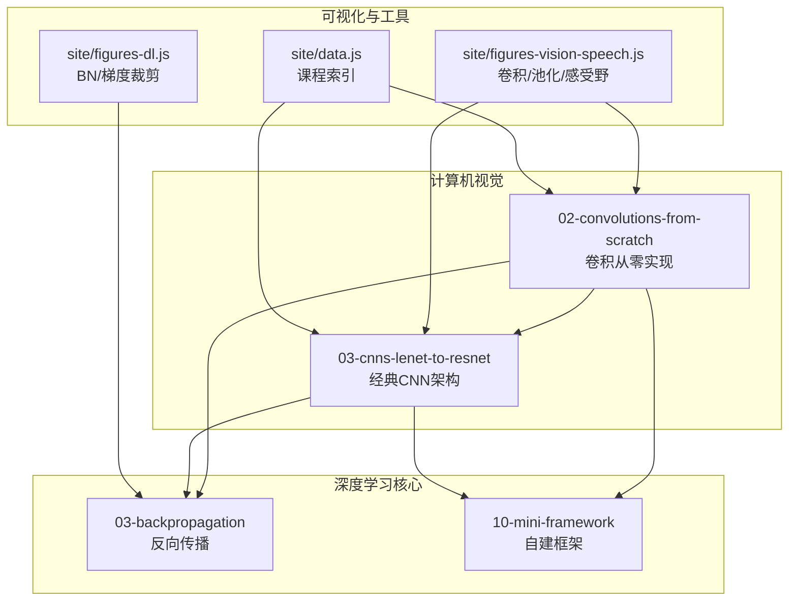
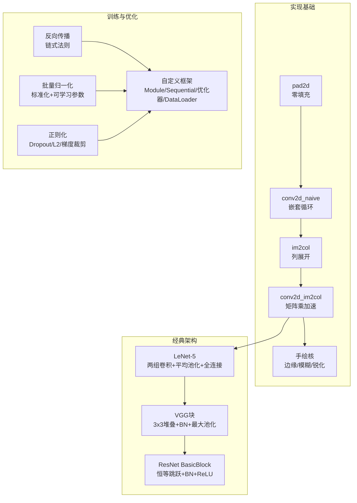
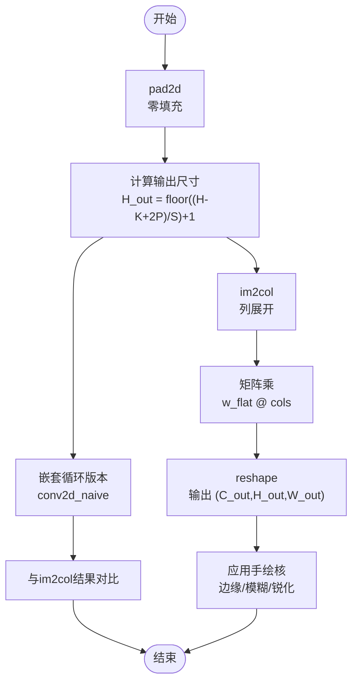
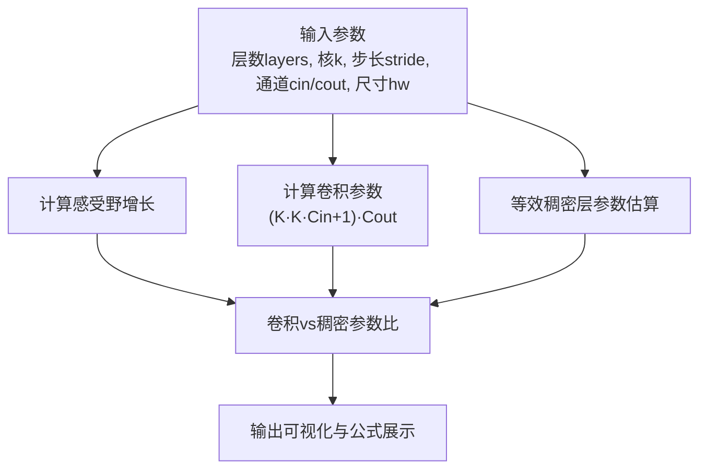
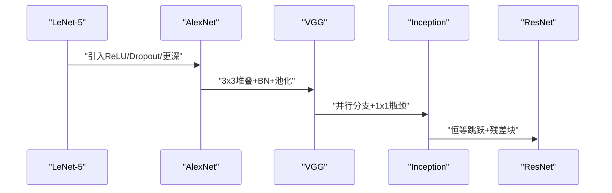
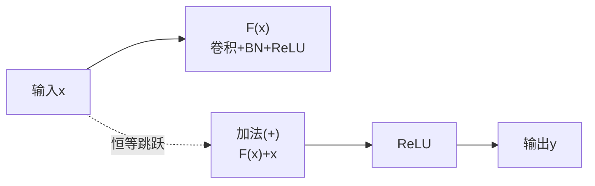
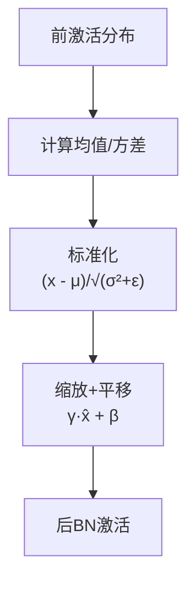
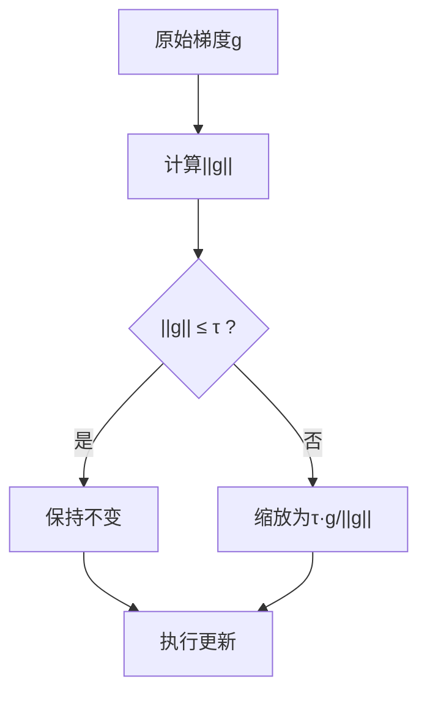
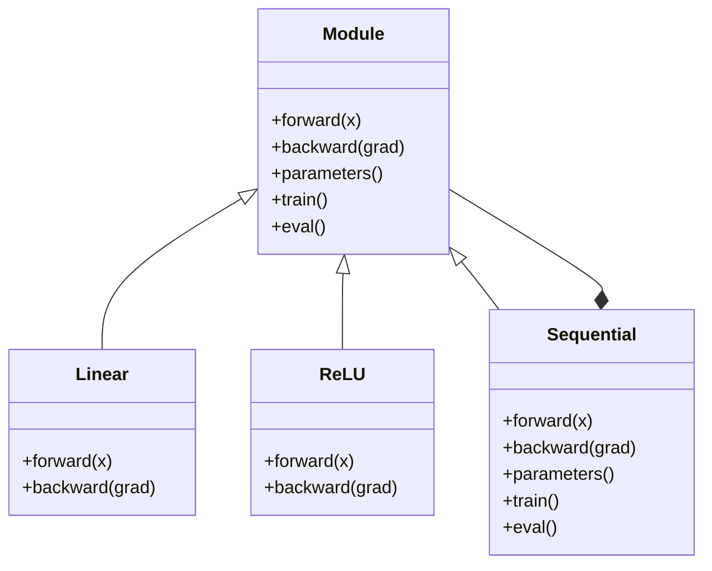
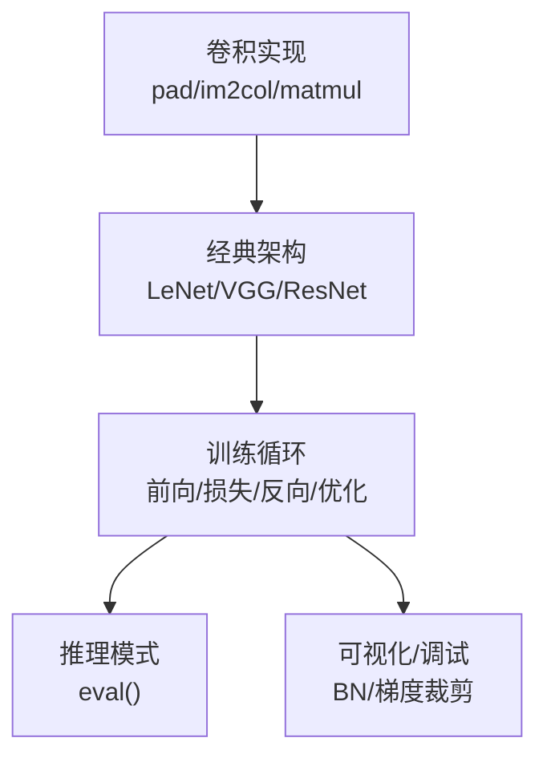

# 卷积神经网络

<cite>
**本文引用的文件**
- [phases/04-computer-vision/02-convolutions-from-scratch/docs/en.md](file://phases/04-computer-vision/02-convolutions-from-scratch/docs/en.md)
- [phases/04-computer-vision/03-cnns-lenet-to-resnet/docs/en.md](file://phases/04-computer-vision/03-cnns-lenet-to-resnet/docs/en.md)
- [phases/03-deep-learning-core/03-backpropagation/docs/en.md](file://phases/03-deep-learning-core/03-backpropagation/docs/en.md)
- [phases/03-deep-learning-core/10-mini-framework/docs/en.md](file://phases/03-deep-learning-core/10-mini-framework/docs/en.md)
- [site/figures-vision-speech.js](file://site/figures-vision-speech.js)
- [site/figures-dl.js](file://site/figures-dl.js)
- [site/data.js](file://site/data.js)
</cite>

## 目录
1. [引言](#引言)
2. [项目结构](#项目结构)
3. [核心组件](#核心组件)
4. [架构总览](#架构总览)
5. [详细组件分析](#详细组件分析)
6. [依赖关系分析](#依赖关系分析)
7. [性能考量](#性能考量)
8. [故障排查指南](#故障排查指南)
9. [结论](#结论)
10. [附录](#附录)

## 引言
本课程围绕卷积神经网络（CNN）展开，系统讲解卷积的数学原理与实现细节，覆盖卷积核、步长、填充、感受野等关键概念；深入剖析经典架构 LeNet、AlexNet、VGG、GoogLeNet（Inception）、ResNet 的设计思想与网络结构；提供从零实现卷积层、池化层、全连接层的思路与步骤；解释残差连接、批量归一化、正则化等关键技术；并结合可视化与梯度传播分析，为图像分类与特征提取提供坚实的理论与实践基础。

## 项目结构
本仓库中与“卷积神经网络”直接相关的内容主要分布在以下模块：
- 计算机视觉（Computer Vision）
  - 02-convolutions-from-scratch：从零实现二维卷积，理解输出尺寸公式、im2col 矩阵乘加速、感受野等
  - 03-cnns-lenet-to-resnet：从 LeNet 到 ResNet 的架构演进与实现
- 深度学习核心（Deep Learning Core）
  - 03-backpropagation：反向传播算法与链式法则
  - 10-mini-framework：构建自己的小框架，理解 Module/Sequential/优化器/数据加载器等组织方式
- 可视化与辅助工具
  - site/figures-vision-speech.js：卷积、池化、感受野等交互式可视化
  - site/figures-dl.js：批归一化效果、梯度裁剪等可视化
  - site/data.js：课程索引与关键词，便于定位相关主题

图示来源
- [phases/04-computer-vision/02-convolutions-from-scratch/docs/en.md:1-395](file://phases/04-computer-vision/02-convolutions-from-scratch/docs/en.md#L1-L395)
- [phases/04-computer-vision/03-cnns-lenet-to-resnet/docs/en.md:1-394](file://phases/04-computer-vision/03-cnns-lenet-to-resnet/docs/en.md#L1-L394)
- [phases/03-deep-learning-core/03-backpropagation/docs/en.md:1-471](file://phases/03-deep-learning-core/03-backpropagation/docs/en.md#L1-L471)
- [phases/03-deep-learning-core/10-mini-framework/docs/en.md:1-712](file://phases/03-deep-learning-core/10-mini-framework/docs/en.md#L1-L712)
- [site/figures-vision-speech.js:138-254](file://site/figures-vision-speech.js#L138-L254)
- [site/figures-dl.js:340-474](file://site/figures-dl.js#L340-L474)
- [site/data.js:643-6689](file://site/data.js#L643-L6689)

章节来源
- [site/data.js:643-6689](file://site/data.js#L643-L6689)

## 核心组件
- 卷积层（Conv2d）
  - 数学本质：共享权重的滑动点积，具备平移等变性与参数共享特性
  - 关键参数：核大小 K、步长 S、填充 P、输入通道 C_in、输出通道 C_out
  - 输出尺寸公式：H_out = floor((H - K + 2P) / S) + 1
  - 实现要点：零填充、嵌套循环版本、im2col + 矩阵乘加速、多输入通道处理
- 池化层（Max/Average Pooling）
  - 作用：降低空间分辨率、增强平移容忍度、减少计算量
  - 常见模式：2x2 窗口、步幅 2，输出尺寸减半
- 全连接层（Linear/FC）
  - 在卷积网络末尾用于分类或回归，参数量通常占模型较大比例
- 批量归一化（BatchNorm）
  - 对每批次激活进行标准化，加速训练、稳定梯度、具有轻微正则效果
- 残差连接（Residual Connection）
  - 解决深度网络梯度消失问题，允许恒等映射，使 100+ 层网络可训练
- 正则化与正则化技术
  - Dropout：训练时随机置零，推理时缩放，缓解过拟合
  - 权重衰减（L2）：在优化器中对权重施加惩罚
  - 梯度裁剪：限制梯度范数，防止爆炸
- 反向传播（Backpropagation）
  - 链式法则在计算图上的系统应用，逐层回传梯度
- 自定义框架（Module/Sequential/优化器/DataLoader）
  - 统一抽象接口，串联模块，组织训练循环，便于理解 PyTorch 内部机制

章节来源
- [phases/04-computer-vision/02-convolutions-from-scratch/docs/en.md:17-181](file://phases/04-computer-vision/02-convolutions-from-scratch/docs/en.md#L17-L181)
- [phases/04-computer-vision/03-cnns-lenet-to-resnet/docs/en.md:102-148](file://phases/04-computer-vision/03-cnns-lenet-to-resnet/docs/en.md#L102-L148)
- [phases/03-deep-learning-core/03-backpropagation/docs/en.md:27-137](file://phases/03-deep-learning-core/03-backpropagation/docs/en.md#L27-L137)
- [phases/03-deep-learning-core/10-mini-framework/docs/en.md:29-148](file://phases/03-deep-learning-core/10-mini-framework/docs/en.md#L29-L148)
- [site/figures-dl.js:340-474](file://site/figures-dl.js#L340-L474)

## 架构总览
下图展示了从零实现的卷积层到经典 CNN 架构的关键路径，以及与反向传播、框架组织的关系：

图示来源
- [phases/04-computer-vision/02-convolutions-from-scratch/docs/en.md:189-340](file://phases/04-computer-vision/02-convolutions-from-scratch/docs/en.md#L189-L340)
- [phases/04-computer-vision/03-cnns-lenet-to-resnet/docs/en.md:160-312](file://phases/04-computer-vision/03-cnns-lenet-to-resnet/docs/en.md#L160-L312)
- [phases/03-deep-learning-core/03-backpropagation/docs/en.md:139-242](file://phases/03-deep-learning-core/03-backpropagation/docs/en.md#L139-L242)
- [phases/03-deep-learning-core/10-mini-framework/docs/en.md:154-415](file://phases/03-deep-learning-core/10-mini-framework/docs/en.md#L154-L415)
- [site/figures-dl.js:340-474](file://site/figures-dl.js#L340-L474)

## 详细组件分析

### 卷积层：从零实现
- pad2d：支持任意形状张量的零填充，保证核能在边界像素中心滑动
- conv2d_naive：四重循环（输出通道、行、列、通道×核高×核宽），作为正确性基准
- im2col：将每个感受野窗口展成列，形成 (C_in·K·K, H_out·W_out) 的列矩阵
- conv2d_im2col：将卷积转换为一次矩阵乘法，随后 reshape 得到输出
- 手绘核：实现单位核、均值模糊、锐化、Sobel 等，直观验证卷积核的作用

图示来源
- [phases/04-computer-vision/02-convolutions-from-scratch/docs/en.md:189-340](file://phases/04-computer-vision/02-convolutions-from-scratch/docs/en.md#L189-L340)

章节来源
- [phases/04-computer-vision/02-convolutions-from-scratch/docs/en.md:189-340](file://phases/04-computer-vision/02-convolutions-from-scratch/docs/en.md#L189-L340)

### 感受野与输出尺寸计算器
- 通过交互式可视化，用户可调节层数、核大小、步长、特征图边长，实时查看卷积参数数量与感受野增长
- 有助于直观理解“3x3 堆叠等价于更大核但参数更少”的设计动机

图示来源
- [site/figures-vision-speech.js:147-254](file://site/figures-vision-speech.js#L147-L254)

章节来源
- [site/figures-vision-speech.js:147-254](file://site/figures-vision-speech.js#L147-L254)

### 经典 CNN 架构：LeNet → AlexNet → VGG → Inception → ResNet
- LeNet-5：两组卷积+平均池化+全连接，奠定 CNN 模板
- AlexNet：ReLU、Dropout、更深更宽，首次大规模超越传统方法
- VGG：纯 3x3 堆叠，强调深度与简洁，成为后续参考
- Inception：并行不同尺度的卷积分支，通道混洗与瓶颈设计控制参数
- ResNet：恒等跳跃连接解决退化问题，使深层网络可训练且性能优异

图示来源
- [phases/04-computer-vision/03-cnns-lenet-to-resnet/docs/en.md:25-148](file://phases/04-computer-vision/03-cnns-lenet-to-resnet/docs/en.md#L25-L148)

章节来源
- [phases/04-computer-vision/03-cnns-lenet-to-resnet/docs/en.md:160-312](file://phases/04-computer-vision/03-cnns-lenet-to-resnet/docs/en.md#L160-L312)

### 残差连接与梯度传播
- 恒等跳跃让深层网络可学习恒等映射，避免梯度在多层传递中的指数级衰减
- 反向传播中，梯度可通过恒等路径直接回传，缓解“消失梯度”问题

图示来源
- [phases/04-computer-vision/03-cnns-lenet-to-resnet/docs/en.md:119-141](file://phases/04-computer-vision/03-cnns-lenet-to-resnet/docs/en.md#L119-L141)
- [phases/03-deep-learning-core/03-backpropagation/docs/en.md:87-101](file://phases/03-deep-learning-core/03-backpropagation/docs/en.md#L87-L101)

章节来源
- [phases/04-computer-vision/03-cnns-lenet-to-resnet/docs/en.md:119-148](file://phases/04-computer-vision/03-cnns-lenet-to-resnet/docs/en.md#L119-L148)
- [phases/03-deep-learning-core/03-backpropagation/docs/en.md:87-101](file://phases/03-deep-learning-core/03-backpropagation/docs/en.md#L87-L101)

### 批量归一化与梯度裁剪
- 批量归一化：对每批次的预激活进行零均值、单位方差标准化，并引入可学习参数 γ 和 β
- 梯度裁剪：当梯度范数超过阈值时按比例缩放，抑制爆炸梯度

图示来源
- [site/figures-dl.js:340-376](file://site/figures-dl.js#L340-L376)

图示来源
- [site/figures-dl.js:453-461](file://site/figures-dl.js#L453-L461)

章节来源
- [site/figures-dl.js:340-376](file://site/figures-dl.js#L340-L376)
- [site/figures-dl.js:453-461](file://site/figures-dl.js#L453-L461)

### 自定义框架：Module/Sequential/优化器/DataLoader
- Module 抽象：统一的 forward/backward/parameters 接口
- Sequential 容器：顺序组合模块，正向逐层、反向逆序
- 优化器：SGD/Adam，维护参数与梯度
- DataLoader：分批与打乱
- 训练循环：前向→损失→反向→优化→清零梯度

图示来源
- [phases/03-deep-learning-core/10-mini-framework/docs/en.md:115-148](file://phases/03-deep-learning-core/10-mini-framework/docs/en.md#L115-L148)

章节来源
- [phases/03-deep-learning-core/10-mini-framework/docs/en.md:154-415](file://phases/03-deep-learning-core/10-mini-framework/docs/en.md#L154-L415)

## 依赖关系分析
- 卷积层实现依赖于张量形状推导与 im2col 技巧，是后续网络堆叠的基础
- 经典架构以卷积层为核心，逐步引入 BN、池化、全连接与残差连接
- 反向传播贯穿所有模块，确保参数可训练
- 自定义框架提供统一的模块化组织方式，便于扩展与调试

图示来源
- [phases/04-computer-vision/02-convolutions-from-scratch/docs/en.md:189-340](file://phases/04-computer-vision/02-convolutions-from-scratch/docs/en.md#L189-L340)
- [phases/04-computer-vision/03-cnns-lenet-to-resnet/docs/en.md:160-312](file://phases/04-computer-vision/03-cnns-lenet-to-resnet/docs/en.md#L160-L312)
- [phases/03-deep-learning-core/03-backpropagation/docs/en.md:92-111](file://phases/03-deep-learning-core/03-backpropagation/docs/en.md#L92-L111)
- [site/figures-dl.js:340-474](file://site/figures-dl.js#L340-L474)

章节来源
- [phases/04-computer-vision/02-convolutions-from-scratch/docs/en.md:189-340](file://phases/04-computer-vision/02-convolutions-from-scratch/docs/en.md#L189-L340)
- [phases/04-computer-vision/03-cnns-lenet-to-resnet/docs/en.md:160-312](file://phases/04-computer-vision/03-cnns-lenet-to-resnet/docs/en.md#L160-L312)
- [phases/03-deep-learning-core/03-backpropagation/docs/en.md:92-111](file://phases/03-deep-learning-core/03-backpropagation/docs/en.md#L92-L111)
- [site/figures-dl.js:340-474](file://site/figures-dl.js#L340-L474)

## 性能考量
- 参数效率：ResNet 通过残差连接显著提升参数到特征的利用效率；VGG 虽参数多但结构清晰
- 计算效率：im2col 将卷积转为 GEMM，利于现代硬件加速；合理选择 K/S/P 可平衡精度与速度
- 训练稳定性：BN、ReLU、残差连接、梯度裁剪等共同提升深层网络的收敛与泛化能力
- 推理成本：池化与步长大卷积可降低特征图尺寸，减少后续层计算负担

## 故障排查指南
- 梯度消失/爆炸
  - 现象：深层网络难以收敛或损失震荡
  - 处理：使用 ResNet 恒等跳跃、BN、ReLU、梯度裁剪；检查学习率与初始化
- 形状不匹配
  - 现象：跳跃连接或池化后维度不一致
  - 处理：确保步长/填充设置正确；必要时用 1x1 卷积调整通道与尺寸
- 过拟合
  - 现象：训练集误差低而验证集误差高
  - 处理：增加 Dropout、权重衰减、数据增强、早停
- 训练不稳定
  - 现象：损失 NaN 或剧烈波动
  - 处理：检查学习率、梯度裁剪、数值范围；确认标签与损失函数匹配

章节来源
- [phases/03-deep-learning-core/03-backpropagation/docs/en.md:87-101](file://phases/03-deep-learning-core/03-backpropagation/docs/en.md#L87-L101)
- [site/figures-dl.js:453-461](file://site/figures-dl.js#L453-L461)

## 结论
本课程从卷积的数学本质出发，结合从零实现的卷积层与经典 CNN 架构，系统阐述了参数共享、局部性、平移等变性、深度与宽度权衡、残差连接与批量归一化等关键思想。通过自定义框架与可视化工具，读者能够深入理解前向与反向传播、参数管理与训练循环，从而具备设计与优化卷积神经网络的能力，并将其应用于图像分类与特征提取任务。

## 附录
- 关键术语速查
  - 卷积：共享权重的滑动点积
  - 感受野：神经元可见的输入区域
  - im2col：将感受野窗口展列为列，卷积转为矩阵乘
  - 恒等跳跃：残差连接中的直连路径
  - 批量归一化：对每批次激活标准化
  - 梯度裁剪：限制梯度范数防止爆炸
- 进一步阅读
  - 《A guide to convolution arithmetic for deep learning》
  - 《CS231n: Convolutional Neural Networks for Visual Recognition》
  - 《Deep Residual Learning for Image Recognition》
  - 《Very Deep Convolutional Networks》
  - 《ImageNet Classification with Deep CNNs》
  - 《Going Deeper with Convolutions》