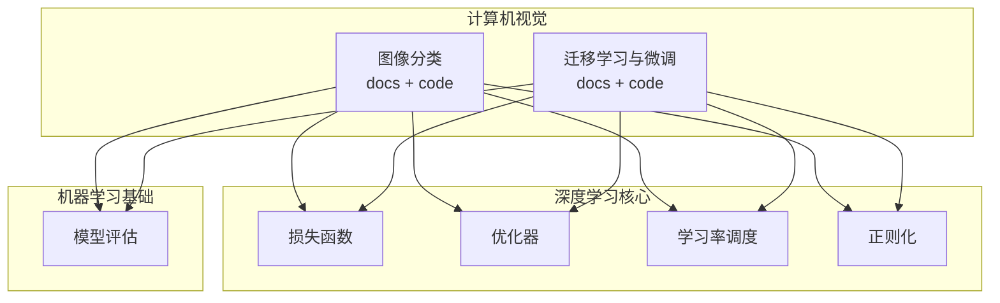
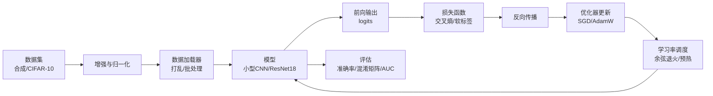
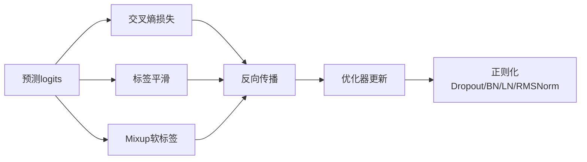
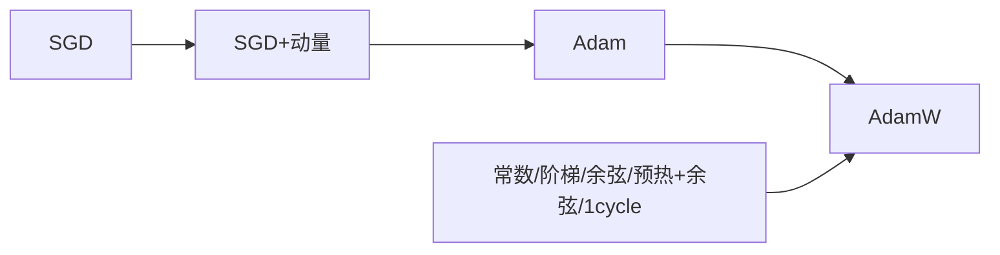
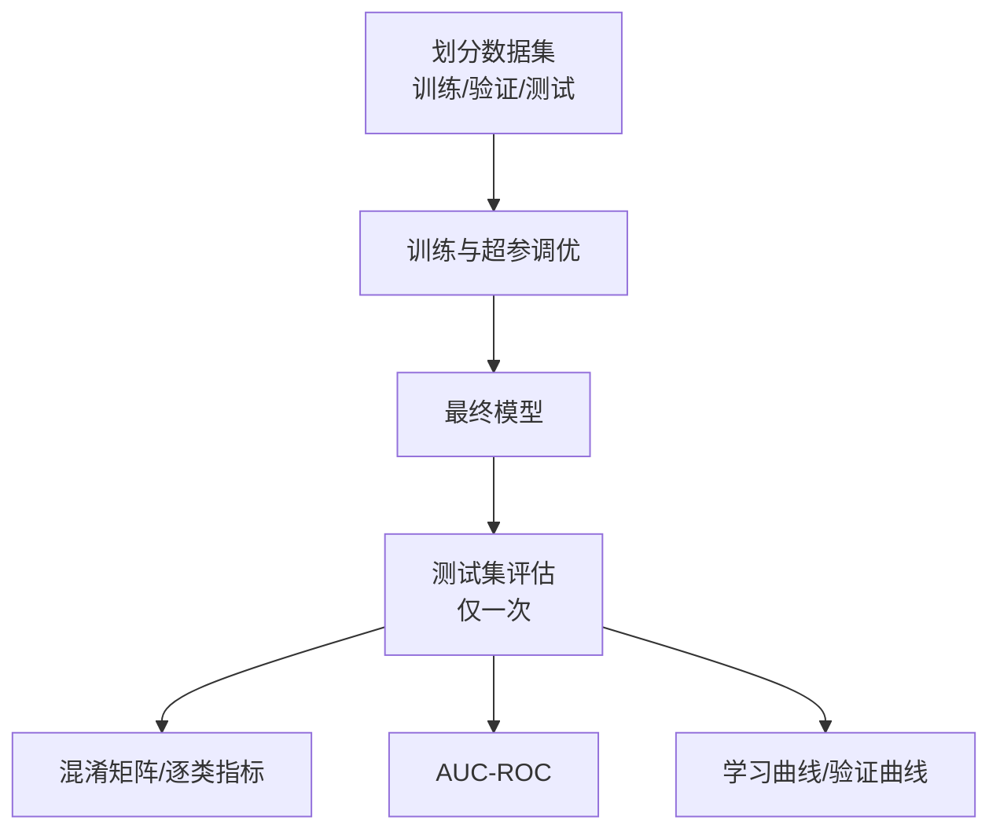
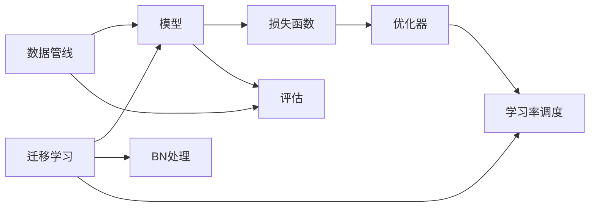

# 图像分类

<cite>
**本文引用的文件**
- [phases/04-computer-vision/04-image-classification/docs/en.md](file://phases/04-computer-vision/04-image-classification/docs/en.md)
- [phases/04-computer-vision/04-image-classification/code/main.py](file://phases/04-computer-vision/04-image-classification/code/main.py)
- [phases/04-computer-vision/05-transfer-learning/docs/en.md](file://phases/04-computer-vision/05-transfer-learning/docs/en.md)
- [phases/04-computer-vision/05-transfer-learning/code/main.py](file://phases/04-computer-vision/05-transfer-learning/code/main.py)
- [phases/03-deep-learning-core/05-loss-functions/docs/en.md](file://phases/03-deep-learning-core/05-loss-functions/docs/en.md)
- [phases/03-deep-learning-core/06-optimizers/docs/en.md](file://phases/03-deep-learning-core/06-optimizers/docs/en.md)
- [phases/03-deep-learning-core/09-learning-rate-schedules/docs/en.md](file://phases/03-deep-learning-core/09-learning-rate-schedules/docs/en.md)
- [phases/03-deep-learning-core/07-regularization/docs/en.md](file://phases/03-deep-learning-core/07-regularization/docs/en.md)
- [phases/02-ml-fundamentals/09-model-evaluation/docs/en.md](file://phases/02-ml-fundamentals/09-model-evaluation/docs/en.md)
</cite>

## 目录
1. [引言](#引言)
2. [项目结构](#项目结构)
3. [核心组件](#核心组件)
4. [架构总览](#架构总览)
5. [详细组件分析](#详细组件分析)
6. [依赖关系分析](#依赖关系分析)
7. [性能考量](#性能考量)
8. [故障排查指南](#故障排查指南)
9. [结论](#结论)
10. [附录](#附录)

## 引言
本课程围绕“图像分类”构建完整工程化流水线，涵盖数据准备、模型设计、训练与评估、迁移学习与微调策略，并结合 CIFAR-10 等标准数据集进行实操。课程强调“管道即代码”的理念：从数据加载、增强、归一化，到前向传播、损失计算、反向传播、优化器更新与学习率调度，每个环节都可检查、可诊断、可迭代。同时，课程系统讲解分类损失函数、优化器选择、学习率调度、正则化与过拟合防护、以及模型评估指标（准确率、混淆矩阵、AUC-ROC 等），并给出端到端的分类 pipeline 实现示例。

## 项目结构
本课程相关资料集中在“计算机视觉”与“深度学习核心”两大模块下，其中图像分类与迁移学习分别对应独立的“Lesson”，配套文档与可运行代码，便于边学边练。



图示来源
- [phases/04-computer-vision/04-image-classification/docs/en.md](file://phases/04-computer-vision/04-image-classification/docs/en.md)
- [phases/04-computer-vision/05-transfer-learning/docs/en.md](file://phases/04-computer-vision/05-transfer-learning/docs/en.md)
- [phases/03-deep-learning-core/05-loss-functions/docs/en.md](file://phases/03-deep-learning-core/05-loss-functions/docs/en.md)
- [phases/03-deep-learning-core/06-optimizers/docs/en.md](file://phases/03-deep-learning-core/06-optimizers/docs/en.md)
- [phases/03-deep-learning-core/09-learning-rate-schedules/docs/en.md](file://phases/03-deep-learning-core/09-learning-rate-schedules/docs/en.md)
- [phases/03-deep-learning-core/07-regularization/docs/en.md](file://phases/03-deep-learning-core/07-regularization/docs/en.md)
- [phases/02-ml-fundamentals/09-model-evaluation/docs/en.md](file://phases/02-ml-fundamentals/09-model-evaluation/docs/en.md)

章节来源
- [phases/04-computer-vision/04-image-classification/docs/en.md](file://phases/04-computer-vision/04-image-classification/docs/en.md)
- [phases/04-computer-vision/05-transfer-learning/docs/en.md](file://phases/04-computer-vision/05-transfer-learning/docs/en.md)

## 核心组件
- 数据与预处理
  - 合成数据集与真实数据集（CIFAR-10）加载
  - 归一化与随机增强（翻转、裁剪）
  - 数据加载器（打乱、批处理、多进程）
- 模型与头网络
  - 小型 CNN 分类器（特征提取 + 全连接头）
  - 预训练骨干（ResNet18）+ 新分类头
- 训练循环
  - 前向、损失（交叉熵/软标签）、反向、优化器步进、学习率调度
  - 可选混合增强（Mixup）与标签平滑
- 评估与诊断
  - 准确率、混淆矩阵、逐类精度/召回/F1、AUC-ROC
  - 学习曲线、验证曲线、早停

章节来源
- [phases/04-computer-vision/04-image-classification/code/main.py](file://phases/04-computer-vision/04-image-classification/code/main.py)
- [phases/04-computer-vision/05-transfer-learning/code/main.py](file://phases/04-computer-vision/05-transfer-learning/code/main.py)
- [phases/02-ml-fundamentals/09-model-evaluation/docs/en.md](file://phases/02-ml-fundamentals/09-model-evaluation/docs/en.md)

## 架构总览
图像分类的端到端训练与评估流水线如下：



图示来源
- [phases/04-computer-vision/04-image-classification/docs/en.md](file://phases/04-computer-vision/04-image-classification/docs/en.md)
- [phases/03-deep-learning-core/06-optimizers/docs/en.md](file://phases/03-deep-learning-core/06-optimizers/docs/en.md)
- [phases/03-deep-learning-core/09-learning-rate-schedules/docs/en.md](file://phases/03-deep-learning-core/09-learning-rate-schedules/docs/en.md)
- [phases/02-ml-fundamentals/09-model-evaluation/docs/en.md](file://phases/02-ml-fundamentals/09-model-evaluation/docs/en.md)

## 详细组件分析

### 组件A：图像分类流水线（从零实现）
- 数据准备
  - 合成 CIFAR-10 风格数据，保证类别可分性；支持真实 CIFAR-10 数据集
  - 增强策略：随机水平翻转、反射填充后的随机裁剪、均值/方差归一化
- 模型
  - 小型 CNN 特征提取分支 + 自适应全局池化 + 分类头
- 训练循环
  - 支持 Mixup（软标签）与标签平滑
  - 每轮遍历数据一次，按批执行梯度更新，按 epoch 步进学习率
- 评估
  - 混淆矩阵统计，逐类精度/召回/F1 计算
  - 在合成数据上快速验证流水线正确性，再迁移到真实数据

```mermaid
sequenceDiagram
participant U as "用户"
participant DS as "数据集"
participant AUG as "增强/归一化"
participant DL as "数据加载器"
participant M as "模型"
participant OPT as "优化器"
participant SCH as "学习率调度"
U->>DS : 加载训练/验证数据
DS->>AUG : 应用增强与归一化
AUG->>DL : 构建批数据
loop 每个epoch
DL->>M : 前向logits
M-->>OPT : 损失交叉熵/Mixup软标签
OPT->>M : 反向传播
M-->>OPT : 更新参数
OPT-->>SCH : 步进学习率
end
DL->>M : 评估混淆矩阵/逐类指标
```

图示来源
- [phases/04-computer-vision/04-image-classification/docs/en.md](file://phases/04-computer-vision/04-image-classification/docs/en.md)
- [phases/04-computer-vision/04-image-classification/code/main.py](file://phases/04-computer-vision/04-image-classification/code/main.py)

章节来源
- [phases/04-computer-vision/04-image-classification/docs/en.md](file://phases/04-computer-vision/04-image-classification/docs/en.md)
- [phases/04-computer-vision/04-image-classification/code/main.py](file://phases/04-computer-vision/04-image-classification/code/main.py)

### 组件B：迁移学习与微调（特征提取 vs 微调）
- 特征提取（冻结骨干，仅训练新头）
  - 快速基线，适合小数据集与域相近场景
- 微调（解冻骨干，分层学习率）
  - 逐步解冻、不同阶段不同学习率，避免灾难性遗忘
- BatchNorm 处理
  - 小数据集建议冻结 BN 运行统计；中等数据集可随训练更新
- 评估双指标
  - 冻结骨干的“仅头部”准确率作为下界
  - 完全微调的准确率作为上限


图示来源
- [phases/04-computer-vision/05-transfer-learning/docs/en.md](file://phases/04-computer-vision/05-transfer-learning/docs/en.md)
- [phases/04-computer-vision/05-transfer-learning/code/main.py](file://phases/04-computer-vision/05-transfer-learning/code/main.py)

章节来源
- [phases/04-computer-vision/05-transfer-learning/docs/en.md](file://phases/04-computer-vision/05-transfer-learning/docs/en.md)
- [phases/04-computer-vision/05-transfer-learning/code/main.py](file://phases/04-computer-vision/05-transfer-learning/code/main.py)

### 组件C：损失函数与正则化
- 损失函数
  - 交叉熵（logits 输入，数值稳定实现）
  - 标签平滑（缓解过拟合与过度自信）
  - Mixup（软标签交叉熵）
- 正则化
  - Dropout（倒置缩放）、L2 权重衰减
  - BatchNorm/LayerNorm/RMSNorm 的适用场景与差异



图示来源
- [phases/03-deep-learning-core/05-loss-functions/docs/en.md](file://phases/03-deep-learning-core/05-loss-functions/docs/en.md)
- [phases/03-deep-learning-core/07-regularization/docs/en.md](file://phases/03-deep-learning-core/07-regularization/docs/en.md)

章节来源
- [phases/03-deep-learning-core/05-loss-functions/docs/en.md](file://phases/03-deep-learning-core/05-loss-functions/docs/en.md)
- [phases/03-deep-learning-core/07-regularization/docs/en.md](file://phases/03-deep-learning-core/07-regularization/docs/en.md)

### 组件D：优化器与学习率调度
- 优化器
  - SGD、SGD+动量、Adam、AdamW 的原理与适用场景
  - AdamW 在大模型与现代训练中的优势
- 学习率调度
  - 预热 + 余弦退火、阶梯衰减、1cycle 策略
  - 不同预算下的调度选择



图示来源
- [phases/03-deep-learning-core/06-optimizers/docs/en.md](file://phases/03-deep-learning-core/06-optimizers/docs/en.md)
- [phases/03-deep-learning-core/09-learning-rate-schedules/docs/en.md](file://phases/03-deep-learning-core/09-learning-rate-schedules/docs/en.md)

章节来源
- [phases/03-deep-learning-core/06-optimizers/docs/en.md](file://phases/03-deep-learning-core/06-optimizers/docs/en.md)
- [phases/03-deep-learning-core/09-learning-rate-schedules/docs/en.md](file://phases/03-deep-learning-core/09-learning-rate-schedules/docs/en.md)

### 组件E：模型评估与指标
- 分类指标
  - 准确率、混淆矩阵、逐类精度/召回/F1、AUC-ROC
- 交叉验证与曲线
  - K 折与分层 K 折、学习曲线、验证曲线
- 常见误区
  - 数据泄露、错误指标选择、测试集污染、类别不平衡陷阱



图示来源
- [phases/02-ml-fundamentals/09-model-evaluation/docs/en.md](file://phases/02-ml-fundamentals/09-model-evaluation/docs/en.md)

章节来源
- [phases/02-ml-fundamentals/09-model-evaluation/docs/en.md](file://phases/02-ml-fundamentals/09-model-evaluation/docs/en.md)

## 依赖关系分析
- 模块耦合
  - 图像分类与迁移学习共享损失函数、优化器、学习率调度与评估框架
  - 数据加载与增强在两类任务中复用
- 关键依赖链
  - 数据管线 → 模型 → 损失函数 → 优化器 → 学习率调度 → 评估
- 迁移学习特有依赖
  - 预训练骨干权重加载、头网络替换、BN 统计处理、分层学习率



图示来源
- [phases/04-computer-vision/04-image-classification/docs/en.md](file://phases/04-computer-vision/04-image-classification/docs/en.md)
- [phases/04-computer-vision/05-transfer-learning/docs/en.md](file://phases/04-computer-vision/05-transfer-learning/docs/en.md)
- [phases/03-deep-learning-core/05-loss-functions/docs/en.md](file://phases/03-deep-learning-core/05-loss-functions/docs/en.md)
- [phases/03-deep-learning-core/06-optimizers/docs/en.md](file://phases/03-deep-learning-core/06-optimizers/docs/en.md)
- [phases/03-deep-learning-core/09-learning-rate-schedules/docs/en.md](file://phases/03-deep-learning-core/09-learning-rate-schedules/docs/en.md)
- [phases/02-ml-fundamentals/09-model-evaluation/docs/en.md](file://phases/02-ml-fundamentals/09-model-evaluation/docs/en.md)

章节来源
- [phases/04-computer-vision/04-image-classification/docs/en.md](file://phases/04-computer-vision/04-image-classification/docs/en.md)
- [phases/04-computer-vision/05-transfer-learning/docs/en.md](file://phases/04-computer-vision/05-transfer-learning/docs/en.md)

## 性能考量
- 训练稳定性
  - 使用 AdamW 与预热 + 余弦退火；合理设置权重衰减与梯度裁剪
- 数据效率
  - 增强策略需保留标签不变；Mixup/Cutout 提升鲁棒性但需谨慎
- 推理与评估
  - 评估阶段关闭 Dropout 与 BN 训练模式；使用混淆矩阵与逐类指标定位问题
- 规模化
  - 大模型优先 AdamW；小模型可考虑 SGD+动量；注意 BN 统计与小批量适配

## 故障排查指南
- 训练发散/NaN
  - 检查学习率是否过高；开启梯度裁剪；确认损失函数输入为 logits
- 验证曲线震荡
  - 降低学习率或增加预热；采用余弦退火；检查数据增强是否破坏标签
- 过拟合
  - 增加 Dropout、标签平滑、数据增强；必要时早停；对小数据集冻结 BN
- 迁移学习效果差
  - 检查骨干是否被正确冻结/解冻；确认 BN 统计处理；尝试分层学习率

章节来源
- [phases/03-deep-learning-core/06-optimizers/docs/en.md](file://phases/03-deep-learning-core/06-optimizers/docs/en.md)
- [phases/03-deep-learning-core/07-regularization/docs/en.md](file://phases/03-deep-learning-core/07-regularization/docs/en.md)
- [phases/04-computer-vision/05-transfer-learning/docs/en.md](file://phases/04-computer-vision/05-transfer-learning/docs/en.md)

## 结论
本课程通过“从零实现图像分类流水线 + 迁移学习微调”的方式，系统覆盖了数据、模型、训练、评估与工程实践的关键要点。遵循“先通后深”的路径：先用合成数据验证流水线，再迁移到真实数据；先做特征提取建立基线，再做微调提升上限。配合严格的评估指标与常见问题排查，能够帮助学员构建可维护、可扩展、可迭代的图像分类工程能力。

## 附录
- 标准数据集使用
  - CIFAR-10：支持自定义合成数据与官方 torchvision 数据集加载
- 指标与可视化
  - 混淆矩阵、逐类精度/召回/F1、AUC-ROC；学习曲线与验证曲线
- 工程最佳实践
  - 训练循环五项不变式、评估阶段上下文切换、日志与计时工具

章节来源
- [phases/04-computer-vision/04-image-classification/docs/en.md](file://phases/04-computer-vision/04-image-classification/docs/en.md)
- [phases/02-ml-fundamentals/09-model-evaluation/docs/en.md](file://phases/02-ml-fundamentals/09-model-evaluation/docs/en.md)