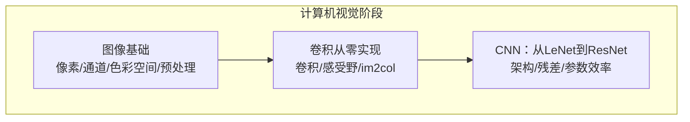
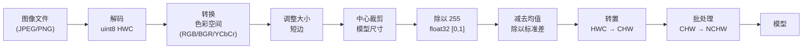
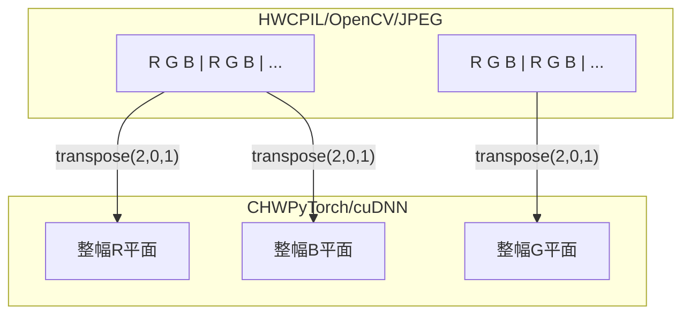
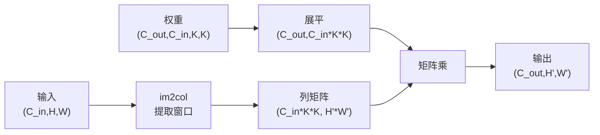
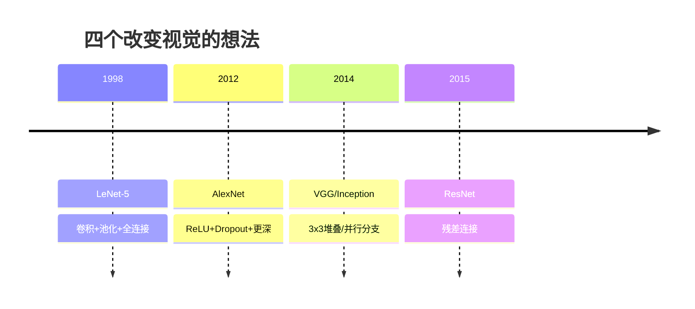
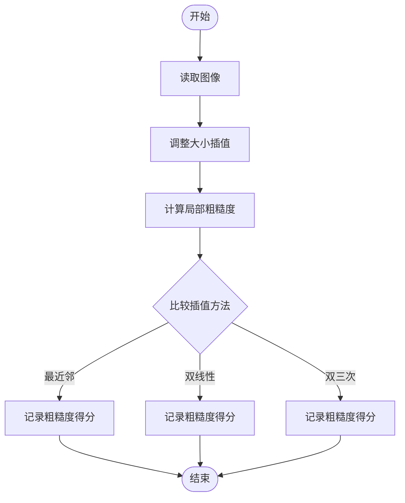
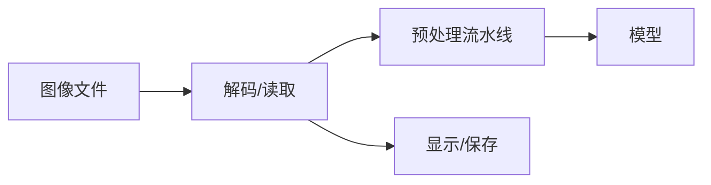

# 图像处理基础

<cite>
**本文引用的文件**
- [图像基础（中文）](file://phases/04-computer-vision/01-image-fundamentals/docs/zh.md)
- [图像基础（代码）](file://phases/04-computer-vision/01-image-fundamentals/code/main.py)
- [卷积从零实现（英文）](file://phases/04-computer-vision/02-convolutions-from-scratch/docs/en.md)
- [卷积从零实现（代码）](file://phases/04-computer-vision/02-convolutions-from-scratch/code/main.py)
- [CNN：从LeNet到ResNet（中文）](file://phases/04-computer-vision/03-cnns-lenet-to-resnet/docs/zh.md)
- [图像张量检查器技能](file://phases/04-computer-vision/01-image-fundamentals/outputs/skill-image-tensor-inspector.md)
- [视觉预处理审计提示词](file://phases/04-computer-vision/01-image-fundamentals/outputs/prompt-vision-preprocessing-audit.md)
- [卷积形状计算器技能](file://phases/04-computer-vision/02-convolutions-from-scratch/outputs/skill-conv-shape-calculator.md)
</cite>

## 目录
1. [引言](#引言)
2. [项目结构](#项目结构)
3. [核心组件](#核心组件)
4. [架构概览](#架构概览)
5. [详细组件分析](#详细组件分析)
6. [依赖分析](#依赖分析)
7. [性能考虑](#性能考虑)
8. [故障排查指南](#故障排查指南)
9. [结论](#结论)
10. [附录](#附录)

## 引言
本课程面向图像处理与计算机视觉入门，围绕“从像素到理解”的主线，系统讲解数字图像的基础概念、像素与张量表示、色彩空间转换、几何变换与预处理流水线，并结合生产级实践给出从原始像素到可处理张量的完整转换流程。课程同时提供图像读取、显示、保存的示例思路与最佳实践，帮助学员建立严谨的视觉系统工程思维。

## 项目结构
本课程位于“计算机视觉”阶段，包含三门核心课程：
- 图像基础：像素、通道、色彩空间、布局约定、预处理流水线
- 卷积从零实现：卷积原理、im2col、感受野与输出尺寸推导
- CNN：从LeNet到ResNet的架构演进与实现

章节来源
- [计算机视觉阶段总览:1-6](file://phases/04-computer-vision/README.md#L1-L6)

## 核心组件
- 像素与张量：理解像素是光强度样本，掌握HWC与CHW两种布局及相互转换
- 色彩空间：RGB、灰度、HSV、YCbCr的物理意义与用途
- 预处理流水线：解码、色彩转换、调整大小、中心裁剪、归一化、标准化、布局转换、批处理
- 几何变换：缩放、插值方法与影响
- 卷积实现：嵌套循环与im2col矩阵乘实现，输出尺寸公式与感受野
- CNN基础：LeNet、VGG风格块、ResNet残差块与参数效率对比

章节来源
- [图像基础（中文）:10-412](file://phases/04-computer-vision/01-image-fundamentals/docs/zh.md#L10-L412)
- [卷积从零实现（英文）:10-395](file://phases/04-computer-vision/02-convolutions-from-scratch/docs/en.md#L10-L395)
- [CNN：从LeNet到ResNet（中文）:10-394](file://phases/04-computer-vision/03-cnns-lenet-to-resnet/docs/zh.md#L10-L394)

## 架构概览
图像处理与预处理的端到端流水线如下：

图示来源
- [图像基础（中文）:27-47](file://phases/04-computer-vision/01-image-fundamentals/docs/zh.md#L27-L47)

## 详细组件分析

### 组件A：图像基础与预处理流水线
- 像素与张量
  - 像素是单一光强度样本，通道是并行的空间网格；HWC与CHW是两种轴顺序，各有内存与计算优势
  - 通道数取决于传感器设计：RGB、灰度、深度相机的Z通道、多光谱等
- 字节范围与数据类型
  - 原始：uint8 [0, 255]（磁盘与常见库输出）
  - 归一化：float32 [0.0, 1.0]（除以255）
  - 标准化：float32，约[-2, +2]（减均值再除以标准差）
- 色彩空间
  - RGB：传感器采集格式；灰度：加权和（匹配人眼亮度感知）；HSV：分离色相/饱和度/明度；YCbCr：亮度与色度分离，适合视频压缩
- 几何变换与插值
  - 调整大小策略：短边缩放+中心裁剪、等比缩放+填充、直接拉伸
  - 插值方法：最近邻（掩码）、双线性（默认）、双三次（锐利）、Lanczos（高质量显示）
- 预处理流水线
  - 严格顺序：Resize -> CenterCrop -> ToTensor -> Normalize -> Transpose(HWC/CHW) -> unsqueeze(NCHW)
  - 错误风险：缺失标准化、通道顺序错误、布局不匹配

图示来源
- [图像基础（中文）:119-135](file://phases/04-computer-vision/01-image-fundamentals/docs/zh.md#L119-L135)

章节来源
- [图像基础（中文）:10-412](file://phases/04-computer-vision/01-image-fundamentals/docs/zh.md#L10-L412)
- [图像基础（代码）:1-146](file://phases/04-computer-vision/01-image-fundamentals/code/main.py#L1-L146)

### 组件B：卷积实现与感受野
- 卷积本质：共享权重的小型全连接层，沿空间滑动
- 输出尺寸公式：H_out = floor((H - K + 2P) / S) + 1
- im2col技巧：将所有感受野窗口展开为列，卷积转为一次大规模矩阵乘
- 感受野：堆叠3x3卷积可等效更大的感受野，且参数更少、多一层非线性
- 多输入通道：每个通道一个KxK切片，逐通道乘加后再加偏置

图示来源
- [卷积从零实现（英文）:151-167](file://phases/04-computer-vision/02-convolutions-from-scratch/docs/en.md#L151-L167)

章节来源
- [卷积从零实现（英文）:10-395](file://phases/04-computer-vision/02-convolutions-from-scratch/docs/en.md#L10-L395)
- [卷积从零实现（代码）:1-135](file://phases/04-computer-vision/02-convolutions-from-scratch/code/main.py#L1-L135)

### 组件C：CNN架构演进与残差连接
- LeNet-5：卷积-池化-全连接，奠定CNN模板
- AlexNet：ReLU、Dropout、更深更宽
- VGG：3x3堆叠，参数多但结构简单
- Inception：并行滤波器尺寸，1x1瓶颈
- 退化问题：深度增长导致梯度消失，训练/测试损失上升
- ResNet：恒等跳跃连接，将深度网络从“祈祷梯度存活”变为可靠工程工具

图示来源
- [CNN：从LeNet到ResNet（中文）:25-34](file://phases/04-computer-vision/03-cnns-lenet-to-resnet/docs/zh.md#L25-L34)

章节来源
- [CNN：从LeNet到ResNet（中文）:10-394](file://phases/04-computer-vision/03-cnns-lenet-to-resnet/docs/zh.md#L10-L394)

### 组件D：图像读取、显示与保存（实践要点）
- 读取：Pillow支持JPEG/PNG，OpenCV读取BGR，需注意通道顺序
- 显示：将CHW转回HWC，确保uint8范围与类型正确
- 保存：先转回uint8，再写入磁盘
- 注意：不要在显示前做标准化，应在预处理阶段完成

章节来源
- [图像基础（中文）:201-379](file://phases/04-computer-vision/01-image-fundamentals/docs/zh.md#L201-L379)
- [图像基础（代码）:22-30](file://phases/04-computer-vision/01-image-fundamentals/code/main.py#L22-L30)

### 组件E：图像质量评估与噪声处理（实践要点）
- 质量评估：局部粗糙度（绝对梯度均值）可用于比较不同插值方法的效果
- 噪声处理：在预处理阶段进行归一化与标准化，避免引入额外噪声；对标签图使用最近邻插值

图示来源
- [图像基础（代码）:94-111](file://phases/04-computer-vision/01-image-fundamentals/code/main.py#L94-L111)

章节来源
- [图像基础（代码）:94-111](file://phases/04-computer-vision/01-image-fundamentals/code/main.py#L94-L111)

## 依赖分析
- 数据依赖：图像文件（JPEG/PNG）→ 解码（uint8 HWC）→ 预处理（float32）→ 模型输入（CHW/NCHW）
- 库与框架依赖：Pillow/OpenCV（读取/显示）、NumPy（张量运算）、torchvision（transforms）、PyTorch（模型）
- 顺序依赖：预处理流水线的严格顺序决定了模型输入分布与性能

图示来源
- [图像基础（中文）:27-47](file://phases/04-computer-vision/01-image-fundamentals/docs/zh.md#L27-L47)

## 性能考虑
- 插值方法选择：训练用双线性，显示用双三次/Lanczos，标签用最近邻
- im2col与矩阵乘：理解im2col可优化卷积实现，减少Python循环开销
- 参数效率：残差连接显著降低参数量，提升深度网络可训练性

## 故障排查指南
- 常见静默故障
  - 缺失标准化：输入分布与训练不一致，精度下降
  - 通道顺序错误：RGB/BGR混淆导致精度骤降
  - 布局不匹配：HWC与CHW混用引发维度错误
- 工具与技能
  - 图像张量检查器：自动判断dtype、布局、范围，并给出建议
  - 视觉预处理审计：从模型卡/数据集卡提取预处理不变式清单
  - 卷积形状计算器：逐层追踪输出尺寸、感受野与参数量

章节来源
- [图像张量检查器技能:1-72](file://phases/04-computer-vision/01-image-fundamentals/outputs/skill-image-tensor-inspector.md#L1-L72)
- [视觉预处理审计提示词:1-41](file://phases/04-computer-vision/01-image-fundamentals/outputs/prompt-vision-preprocessing-audit.md#L1-L41)
- [卷积形状计算器技能:1-72](file://phases/04-computer-vision/02-convolutions-from-scratch/outputs/skill-conv-shape-calculator.md#L1-L72)

## 结论
本课程从像素与张量出发，系统梳理了图像基础、预处理流水线、卷积原理与CNN架构演进，强调工程中的布局、通道顺序与标准化的重要性。通过工具化技能与严格的审计清单，学员可在生产环境中构建稳健的视觉系统，为后续计算机视觉任务打下坚实基础。

## 附录
- 术语表（摘自课程文档）
  - 像素：一个网格位置上的光强度样本，彩色三个数字，灰度一个数字
  - 通道：堆叠到图像张量中的并行空间网格之一
  - HWC/CHW：轴顺序约定，磁盘与PIL使用HWC，PyTorch与cuDNN使用CHW
  - 归一化：除以255使像素在[0,1]范围
  - 标准化：每个通道减去均值并除以标准差，匹配模型训练分布
  - 灰度转换：加权和（0.299R + 0.587G + 0.114B）
  - 插值：调整大小时如何选取像素，标签用最近邻，训练用双线性，显示用双三次
  - 宽高比：宽度除以高度，区分“调整大小并填充”与“调整大小并拉伸”

章节来源
- [图像基础（中文）:393-405](file://phases/04-computer-vision/01-image-fundamentals/docs/zh.md#L393-L405)