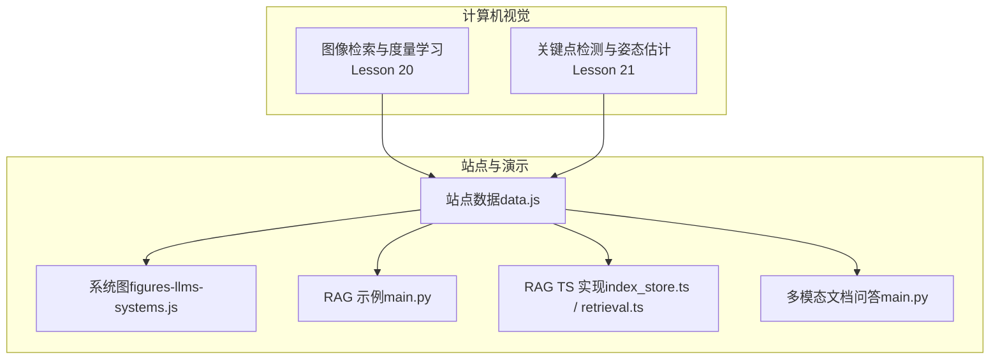
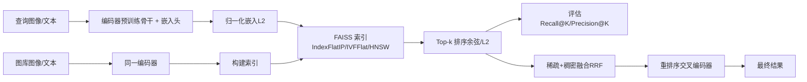
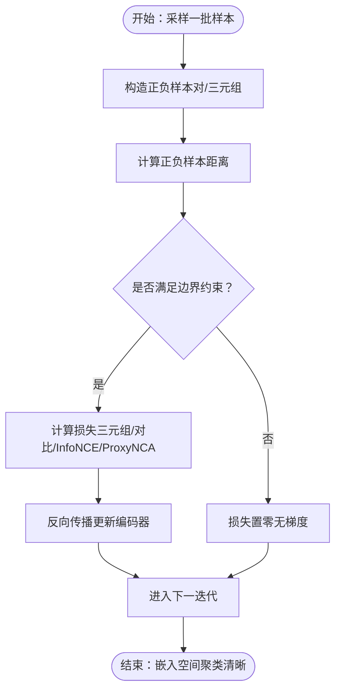
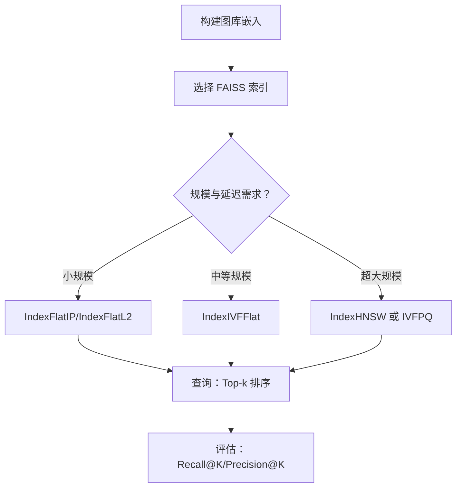
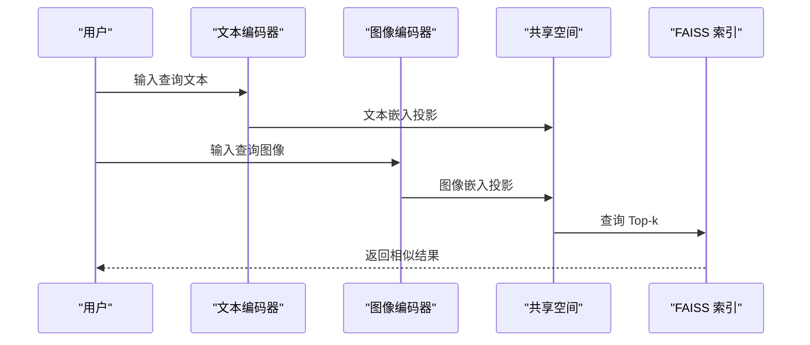
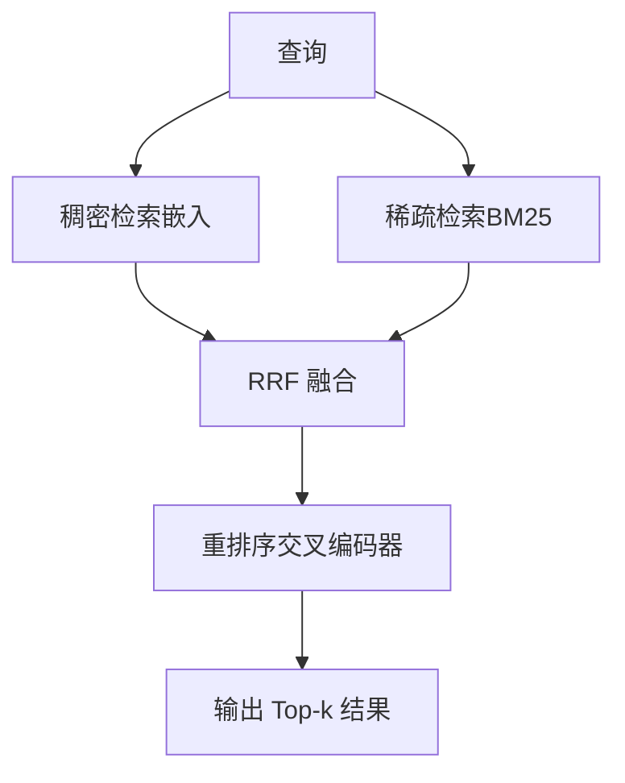
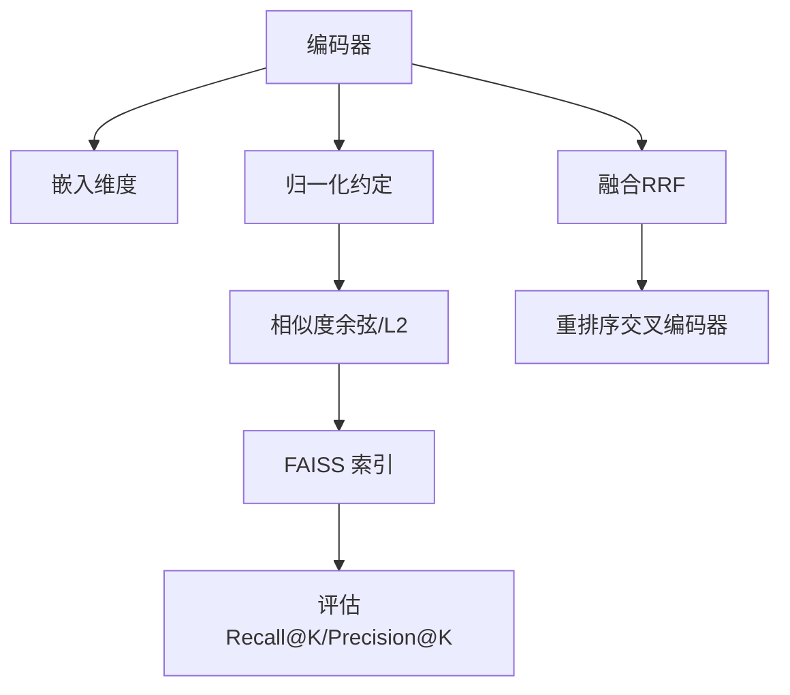

# 图像检索

<cite>
**本文引用的文件**
- [图像检索与度量学习（英文）](file://phases/04-computer-vision/20-image-retrieval-metric/docs/en.md)
- [图像检索与度量学习（中文）](file://phases/04-computer-vision/20-image-retrieval-metric/docs/zh.md)
- [关键点检测与姿态估计（英文）](file://phases/04-computer-vision/21-keypoint-pose/docs/en.md)
- [关键点检测与姿态估计（中文）](file://phases/04-computer-vision/21-keypoint-pose/docs/zh.md)
- [站点数据（data.js）](file://site/data.js)
- [LLM 系统图（figures-llms-systems.js）](file://site/figures-llms-systems.js)
- [RAG 代码（main.py）](file://phases/19-capstone-projects/02-rag-over-codebase/code/main.py)
- [RAG TypeScript 实现（index_store.ts）](file://phases/19-capstone-projects/02-rag-over-codebase/code/ts/src/index_store.ts)
- [RAG TypeScript 检索（retrieval.ts）](file://phases/19-capstone-projects/02-rag-over-codebase/code/ts/src/retrieval.ts)
- [RAG 测试（index_store.test.ts）](file://phases/19-capstone-projects/02-rag-over-codebase/code/ts/tests/index_store.test.ts)
- [RAG 测试（retrieval.test.ts）](file://phases/19-capstone-projects/02-rag-over-codebase/code/ts/tests/retrieval.test.ts)
- [多模态文档问答（main.py）](file://phases/19-capstone-projects/04-multimodal-document-qa/code/main.py)
</cite>

## 目录
1. [简介](#简介)
2. [项目结构](#项目结构)
3. [核心组件](#核心组件)
4. [架构总览](#架构总览)
5. [详细组件分析](#详细组件分析)
6. [依赖分析](#依赖分析)
7. [性能考虑](#性能考虑)
8. [故障排查指南](#故障排查指南)
9. [结论](#结论)
10. [附录](#附录)

## 简介
本课程围绕基于内容的图像检索（Content-Based Image Retrieval, CBIR）展开，系统讲解图像特征提取、相似度度量、索引构建与大规模检索优化策略。重点覆盖：
- 局部特征描述符（如 SIFT、ORB）与全局特征（如 CNN 特征）在检索中的应用
- 度量学习在图像检索中的落地，包括对比损失、三元组损失、InfoNCE/ProxyNCA 等
- 大规模检索优化：近似最近邻搜索（ANN）、倒排索引、融合检索与重排序
- 跨模态检索（文本到图像、图像到文本）的实现思路与工程实践
- 完整的图像检索系统实现示例与评估流程

## 项目结构
本仓库中与图像检索直接相关的模块主要集中在“计算机视觉”阶段的第 20 课（图像检索与度量学习）与第 21 课（关键点检测与姿态估计），同时在站点数据与演示代码中提供了检索系统的整体视图与工程化示例。

图表来源
- [图像检索与度量学习（中文）:1-248](file://phases/04-computer-vision/20-image-retrieval-metric/docs/zh.md#L1-L248)
- [关键点检测与姿态估计（中文）:1-229](file://phases/04-computer-vision/21-keypoint-pose/docs/zh.md#L1-L229)
- [站点数据（data.js）:799-807](file://site/data.js#L799-L807)
- [LLM 系统图（figures-llms-systems.js）:417-486](file://site/figures-llms-systems.js#L417-L486)
- [RAG 代码（main.py）:61-218](file://phases/19-capstone-projects/02-rag-over-codebase/code/main.py#L61-L218)
- [RAG TypeScript 实现（index_store.ts）:1-51](file://phases/19-capstone-projects/02-rag-over-codebase/code/ts/src/index_store.ts#L1-L51)
- [RAG TypeScript 检索（retrieval.ts）:1-54](file://phases/19-capstone-projects/02-rag-over-codebase/code/ts/src/retrieval.ts#L1-L54)
- [多模态文档问答（main.py）:138-164](file://phases/19-capstone-projects/04-multimodal-document-qa/code/main.py#L138-L164)

章节来源
- [图像检索与度量学习（中文）:1-248](file://phases/04-computer-vision/20-image-retrieval-metric/docs/zh.md#L1-L248)
- [关键点检测与姿态估计（中文）:1-229](file://phases/04-computer-vision/21-keypoint-pose/docs/zh.md#L1-L229)
- [站点数据（data.js）:799-807](file://site/data.js#L799-L807)

## 核心组件
- 特征提取与编码
  - 使用预训练骨干（如 DINOv2、CLIP、SigLIP）提取图像/文本嵌入，确保 L2 归一化以适配余弦相似度
  - 局部特征（SIFT/ORB）与全局特征（CNN 特征）互补：前者强调细节与纹理，后者强调整体语义
- 度量学习与损失函数
  - 对比损失、三元组损失、InfoNCE/ProxyNCA 等，依据数据规模与标注成本选择合适方案
  - 半困难负样本挖掘（semi-hard mining）提升训练效率
- 相似度度量与索引
  - 余弦相似度 vs L2 距离：统一规范，避免混合导致“最近”的语义变化
  - FAISS 索引族：IndexFlatIP/IndexFlatL2（精确）、IndexIVFFlat（IVF）、IndexHNSW（图索引），按规模与延迟需求选择
- 评估指标
  - Recall@K：标准检索指标，关注 top-K 命中率；结合 Precision@K（重复检测）与 MRR/NDCG（排序质量）
- 融合与重排序
  - 稀疏（BM25）与稠密（嵌入）检索融合（如 Reciprocal Rank Fusion），随后使用交叉编码器重排序
- 跨模态检索
  - 文本到图像：CLIP 风格投影到共享空间，计算相似度
  - 图像到文本：同理，或使用检索到的图像作为上下文增强文本理解

章节来源
- [图像检索与度量学习（中文）:44-103](file://phases/04-computer-vision/20-image-retrieval-metric/docs/zh.md#L44-L103)
- [LLM 系统图（figures-llms-systems.js）:417-486](file://site/figures-llms-systems.js#L417-L486)

## 架构总览
图像检索系统的核心流程由“编码器 + 索引 + 排序/评估”构成。站点图展示了跨模态融合的典型方式（晚融合：分别编码后投影到共享空间）。

图表来源
- [图像检索与度量学习（中文）:27-42](file://phases/04-computer-vision/20-image-retrieval-metric/docs/zh.md#L27-L42)
- [LLM 系统图（figures-llms-systems.js）:417-486](file://site/figures-llms-systems.js#L417-L486)

## 详细组件分析

### 组件 A：度量学习与损失函数
- 三元组损失与半困难挖掘
  - 三元组损失公式与直观解释，强调“拉近正样本、推开负样本”
  - 半困难挖掘策略：在正样本距离与边界之间寻找最具判别性的负样本，显著降低无效梯度
- InfoNCE/ProxyNCA
  - InfoNCE 适合大批量与动量队列；ProxyNCA 以类别代理加速收敛，适合小批量场景
- 实践要点
  - 统一归一化与相似度约定，避免余弦与 L2 混用导致语义漂移
  - 先用预训练骨干，仅在测试集上表现不足时引入微调

图表来源
- [图像检索与度量学习（中文）:107-201](file://phases/04-computer-vision/20-image-retrieval-metric/docs/zh.md#L107-L201)

章节来源
- [图像检索与度量学习（中文）:44-103](file://phases/04-computer-vision/20-image-retrieval-metric/docs/zh.md#L44-L103)
- [图像检索与度量学习（中文）:107-201](file://phases/04-computer-vision/20-image-retrieval-metric/docs/zh.md#L107-L201)

### 组件 B：相似度度量与索引
- 相似度选择
  - 余弦相似度要求 L2 归一化；L2 距离可直接使用或配合平方 L2
  - 在归一化前提下，余弦与 L2 等价，便于统一实现
- FAISS 索引族
  - IndexFlatIP/IndexFlatL2：精确、无需训练，适合中小规模
  - IndexIVFFlat：IVF 分桶，近似但高效，需训练数据
  - IndexHNSW：图索引，查询速度快、内存占用相对较小
- 评估与召回
  - Recall@K 作为主指标，结合 Precision@K（重复检测）与 MRR/NDCG（排序质量）

图表来源
- [图像检索与度量学习（中文）:86-103](file://phases/04-computer-vision/20-image-retrieval-metric/docs/zh.md#L86-L103)

章节来源
- [图像检索与度量学习（中文）:65-103](file://phases/04-computer-vision/20-image-retrieval-metric/docs/zh.md#L65-L103)

### 组件 C：跨模态检索（文本到图像、图像到文本）
- 晚融合（Late Fusion）：图像编码器与文本编码器分别映射到共享空间，最后比较相似度
- 早期融合（Early Fusion）：将图像与文本标记拼接后联合建模，适合端到端对齐
- 实践建议
  - 文本查询优先：CLIP 风格投影 + FAISS 检索
  - 图像查询：DINOv2/SigLIP 提取 + FAISS 检索
  - 结果融合：RRF 或加权融合；重排序：交叉编码器

图表来源
- [LLM 系统图（figures-llms-systems.js）:417-486](file://site/figures-llms-systems.js#L417-L486)
- [图像检索与度量学习（中文）:205-214](file://phases/04-computer-vision/20-image-retrieval-metric/docs/zh.md#L205-L214)

章节来源
- [LLM 系统图（figures-llms-systems.js）:417-486](file://site/figures-llms-systems.js#L417-L486)
- [图像检索与度量学习（中文）:205-214](file://phases/04-computer-vision/20-image-retrieval-metric/docs/zh.md#L205-L214)

### 组件 D：局部特征与全局特征的协同
- 局部特征（SIFT/ORB）
  - 适用于细粒度匹配与鲁棒性要求高的场景（如工业检测、文档匹配）
  - 特征点匹配 + 几何验证（RANSAC）提升召回稳定性
- 全局特征（CNN 特征）
  - 适合类别级检索与大规模场景，与度量学习结合可实现实例级精细匹配
- 协同策略
  - 先用全局特征粗排，再用局部特征精排或二次校验
  - 多尺度金字塔与多窗口采样提升鲁棒性

章节来源
- [关键点检测与姿态估计（中文）:49-76](file://phases/04-computer-vision/21-keypoint-pose/docs/zh.md#L49-L76)

### 组件 E：融合检索与重排序（来自 RAG 示例）
- 稀疏（BM25）与稠密（嵌入）检索融合：Reciprocal Rank Fusion（RRF）
- 重排序：交叉编码器对候选进行再评分
- 工程化要点：稳定的嵌入生成（确定性哈希/随机种子）、Cosine 相似度、Top-k 一致性

图表来源
- [RAG 代码（main.py）:61-218](file://phases/19-capstone-projects/02-rag-over-codebase/code/main.py#L61-L218)
- [RAG TypeScript 实现（index_store.ts）:1-51](file://phases/19-capstone-projects/02-rag-over-codebase/code/ts/src/index_store.ts#L1-L51)
- [RAG TypeScript 检索（retrieval.ts）:1-54](file://phases/19-capstone-projects/02-rag-over-codebase/code/ts/src/retrieval.ts#L1-L54)

章节来源
- [RAG 代码（main.py）:61-218](file://phases/19-capstone-projects/02-rag-over-codebase/code/main.py#L61-L218)
- [RAG TypeScript 实现（index_store.ts）:1-51](file://phases/19-capstone-projects/02-rag-over-codebase/code/ts/src/index_store.ts#L1-L51)
- [RAG TypeScript 检索（retrieval.ts）:1-54](file://phases/19-capstone-projects/02-rag-over-codebase/code/ts/src/retrieval.ts#L1-L54)

## 依赖分析
- 组件耦合
  - 编码器与索引：紧密耦合（嵌入维度、归一化约定、索引类型）
  - 检索与评估：解耦（可替换编码器与索引，统一评估指标）
  - 融合与重排序：可插拔（BM25/嵌入可独立替换，RRF/交叉编码器可替换）
- 外部依赖
  - FAISS：近邻搜索库，支持多种索引类型
  - 预训练模型：DINOv2、CLIP、SigLIP 等
  - 跨模态对齐：投影矩阵与共享空间

图表来源
- [图像检索与度量学习（中文）:65-103](file://phases/04-computer-vision/20-image-retrieval-metric/docs/zh.md#L65-L103)
- [RAG TypeScript 实现（index_store.ts）:32-48](file://phases/19-capstone-projects/02-rag-over-codebase/code/ts/src/index_store.ts#L32-L48)

章节来源
- [图像检索与度量学习（中文）:65-103](file://phases/04-computer-vision/20-image-retrieval-metric/docs/zh.md#L65-L103)
- [RAG TypeScript 实现（index_store.ts）:32-48](file://phases/19-capstone-projects/02-rag-over-codebase/code/ts/src/index_store.ts#L32-L48)

## 性能考虑
- 训练阶段
  - 选择合适的损失与挖掘策略，平衡收敛速度与稳定性
  - 小批量场景优先 ProxyNCA，大批量场景优先 InfoNCE
- 检索阶段
  - 小规模（~1M）：IndexFlatIP/IndexFlatL2
  - 中等规模（~10M）：IndexIVFFlat，合理设置倒排桶数
  - 大规模（~100M+）：IndexHNSW 或 IVFPQ，结合乘积量化
- 排序与评估
  - 统一余弦/L2 约定，避免混合导致的语义漂移
  - Recall@K 与 Precision@K 并重，结合 MRR/NDCG 评估排序质量
- 融合与重排序
  - RRF 简单有效，交叉编码器重排序进一步提升排序质量

## 故障排查指南
- 嵌入维度不一致
  - 症状：相似度计算报错或结果异常
  - 排查：检查编码器输出维度与索引配置
- 归一化约定不一致
  - 症状：余弦与 L2 混用导致“最近”语义变化
  - 排查：统一 L2 归一化与余弦相似度
- 索引类型选择不当
  - 症状：查询延迟过高或内存占用过大
  - 排查：根据规模与延迟需求选择 IndexFlatIP/IVFFlat/HNSW
- 融合参数不合理
  - 症状：RRF 融合后命中率下降
  - 排查：调整 kRrf 参数与 Top-k 截断

章节来源
- [RAG TypeScript 测试（index_store.test.ts）:1-50](file://phases/19-capstone-projects/02-rag-over-codebase/code/ts/tests/index_store.test.ts#L1-L50)
- [RAG TypeScript 测试（retrieval.test.ts）:46-57](file://phases/19-capstone-projects/02-rag-over-codebase/code/ts/tests/retrieval.test.ts#L46-L57)

## 结论
本课程系统梳理了 CBIR 的关键技术路径：从特征提取与度量学习，到相似度度量与索引构建，再到大规模检索优化与跨模态对齐。通过明确的工程化实践（FAISS 选型、RRF 融合、交叉编码器重排序）与严格的评估体系（Recall@K/Precision@K/MRR/NDCG），可在实际业务中快速搭建高性能图像检索系统。

## 附录
- 评估脚手架与提示词
  - 提示词：为给定检索问题选择三元组/InfoNCE/ProxyNCA
  - 技能：编写 recall@K 的评估脚手架（训练/验证/图库划分与数据契约）
- 多模态文档问答示例
  - 展示了检索、裁剪与结果呈现的端到端流程，可迁移至图像检索场景

章节来源
- [图像检索与度量学习（中文）:216-222](file://phases/04-computer-vision/20-image-retrieval-metric/docs/zh.md#L216-L222)
- [多模态文档问答（main.py）:138-164](file://phases/19-capstone-projects/04-multimodal-document-qa/code/main.py#L138-L164)