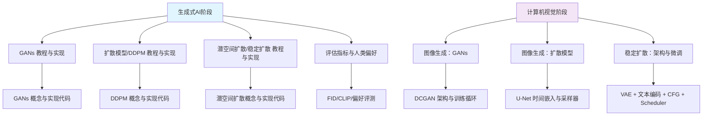
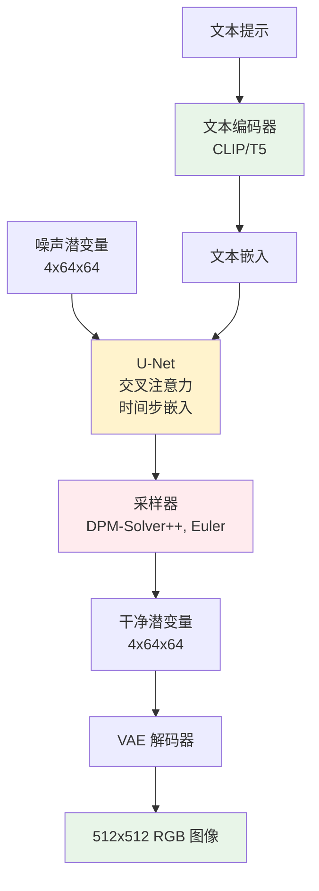
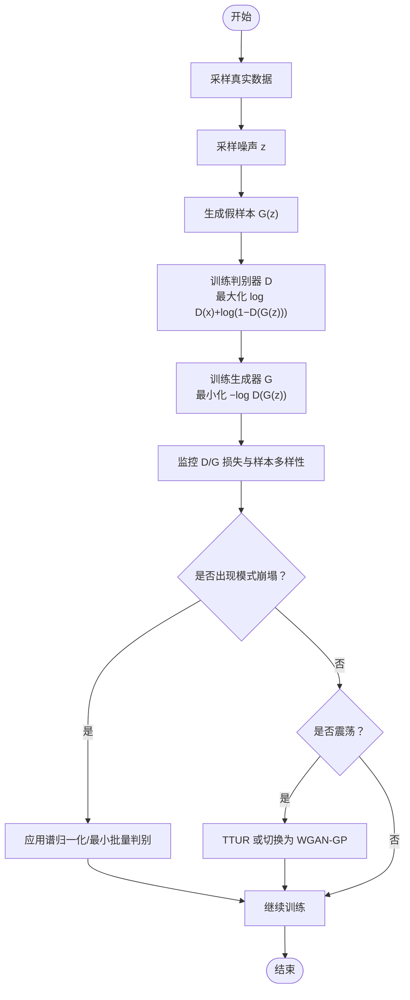
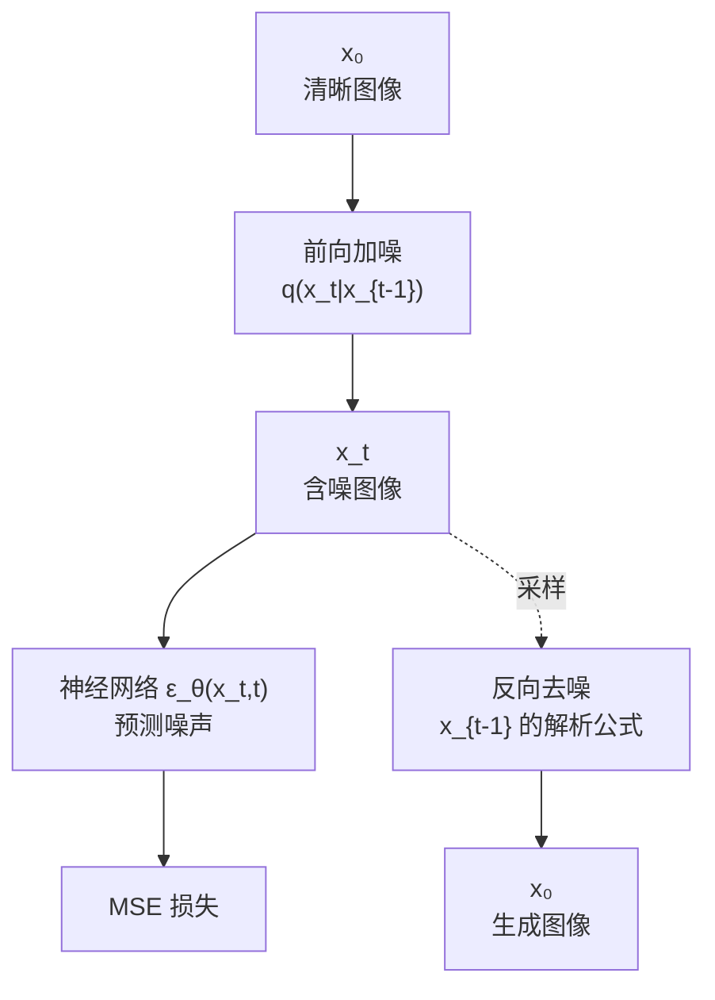
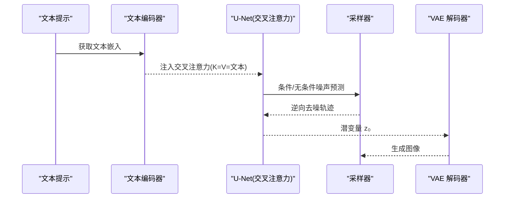
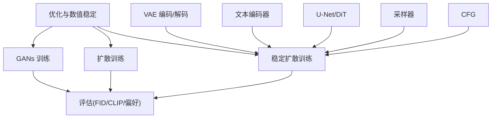
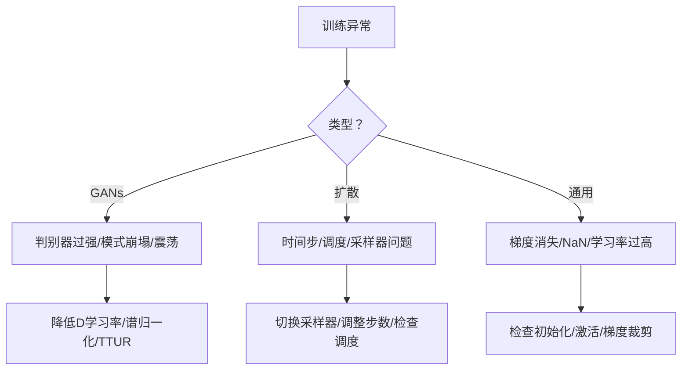

# 图像生成

<cite>
**本文引用的文件**
- [README.md](file://README.md)
- [ROADMAP.md](file://ROADMAP.md)
- [site/data.js](file://site/data.js)
- [phases/08-generative-ai/03-gans-generator-discriminator/docs/en.md](file://phases/08-generative-ai/03-gans-generator-discriminator/docs/en.md)
- [phases/08-generative-ai/03-gans-generator-discriminator/code/main.py](file://phases/08-generative-ai/03-gans-generator-discriminator/code/main.py)
- [phases/04-computer-vision/09-image-generation-gans/docs/en.md](file://phases/04-computer-vision/09-image-generation-gans/docs/en.md)
- [phases/08-generative-ai/06-diffusion-ddpm-from-scratch/docs/en.md](file://phases/08-generative-ai/06-diffusion-ddpm-from-scratch/docs/en.md)
- [phases/08-generative-ai/06-diffusion-ddpm-from-scratch/code/main.py](file://phases/08-generative-ai/06-diffusion-ddpm-from-scratch/code/main.py)
- [phases/04-computer-vision/10-image-generation-diffusion/docs/en.md](file://phases/04-computer-vision/10-image-generation-diffusion/docs/en.md)
- [phases/08-generative-ai/07-latent-diffusion-stable-diffusion/docs/en.md](file://phases/08-generative-ai/07-latent-diffusion-stable-diffusion/docs/en.md)
- [phases/08-generative-ai/07-latent-diffusion-stable-diffusion/code/main.py](file://phases/08-generative-ai/07-latent-diffusion-stable-diffusion/code/main.py)
- [phases/04-computer-vision/11-stable-diffusion/docs/en.md](file://phases/04-computer-vision/11-stable-diffusion/docs/en.md)
- [phases/08-generative-ai/14-evaluation-fid-clip-score/docs/en.md](file://phases/08-generative-ai/14-evaluation-fid-clip-score/docs/en.md)
- [phases/01-math-foundations/08-optimization/docs/en.md](file://phases/01-math-foundations/08-optimization/docs/en.md)
- [phases/01-math-foundations/08-optimization/code/optimizers.py](file://phases/01-math-foundations/08-optimization/code/optimizers.py)
- [site/figures-dl.js](file://site/figures-dl.js)
</cite>

## 目录
1. [引言](#引言)
2. [项目结构](#项目结构)
3. [核心组件](#核心组件)
4. [架构总览](#架构总览)
5. [详细组件分析](#详细组件分析)
6. [依赖关系分析](#依赖关系分析)
7. [性能考量](#性能考量)
8. [故障排查指南](#故障排查指南)
9. [结论](#结论)
10. [附录](#附录)

## 引言
本课程围绕“图像生成”主题，系统讲解两类主流生成范式：生成对抗网络（GANs）与扩散模型（Diffusion），并深入到稳定扩散（Stable Diffusion）的潜空间扩散机制与文本到图像生成流程。课程目标是帮助学习者理解对抗训练、去噪建模、概率流形与跨模态条件注入等核心思想，并掌握损失函数设计、训练技巧、收敛监控、常见问题诊断与修复策略，以及图像生成的质量评估与多样性控制方法。

## 项目结构
该仓库提供了从数学基础到生成模型实践的完整路径，其中与图像生成直接相关的核心模块分布在“生成式AI”和“计算机视觉”两大阶段中。下图给出与本课程相关的知识地图与对应文件位置。

**图表来源**
- [README.md:476-495](file://README.md#L476-L495)
- [ROADMAP.md:206-224](file://ROADMAP.md#L206-L224)
- [site/data.js:1494-1531](file://site/data.js#L1494-L1531)

**章节来源**
- [README.md:476-495](file://README.md#L476-L495)
- [ROADMAP.md:206-224](file://ROADMAP.md#L206-L224)
- [site/data.js:1494-1531](file://site/data.js#L1494-L1531)

## 核心组件
- 对抗训练（GANs）
  - 生成器与判别器的最小最大博弈，非饱和损失，典型失败模式（模式崩塌、梯度消失、震荡）及其修复策略。
  - 参考：[GANs 概念与实现:1-168](file://phases/08-generative-ai/03-gans-generator-discriminator/docs/en.md#L1-L168)，[DCGAN 架构与训练循环:107-248](file://phases/04-computer-vision/09-image-generation-gans/docs/en.md#L107-L248)，[实现代码:1-192](file://phases/08-generative-ai/03-gans-generator-discriminator/code/main.py#L1-L192)

- 扩散模型（DDPM）
  - 前向加噪与反向去噪的马尔可夫链，噪声预测损失，时间步嵌入，采样器家族（DDPM/ DDIM）。
  - 参考：[DDPM 概念与实现:1-186](file://phases/08-generative-ai/06-diffusion-ddpm-from-scratch/docs/en.md#L1-L186)，[U-Net 时间嵌入与采样器:123-279](file://phases/04-computer-vision/10-image-generation-diffusion/docs/en.md#L123-L279)，[实现代码:1-182](file://phases/08-generative-ai/06-diffusion-ddpm-from-scratch/code/main.py#L1-L182)

- 潜空间扩散与稳定扩散（Latent Diffusion/SD）
  - VAE 编码器/解码器 + 在潜空间扩散，文本编码器与交叉注意力注入，分类器自由引导（CFG）。
  - 参考：[潜空间扩散概念与实现:1-150](file://phases/08-generative-ai/07-latent-diffusion-stable-diffusion/docs/en.md#L1-L150)，[稳定扩散：架构与微调:1-268](file://phases/04-computer-vision/11-stable-diffusion/docs/en.md#L1-L268)，[实现代码:1-185](file://phases/08-generative-ai/07-latent-diffusion-stable-diffusion/code/main.py#L1-L185)

- 评估与质量控制
  - FID、CLIP 分数、人类偏好评测，以及离线推理与特征缓存等工程化要点。
  - 参考：[评估指标与人类偏好:1-184](file://phases/08-generative-ai/14-evaluation-fid-clip-score/docs/en.md#L1-L184)

**章节来源**
- [phases/08-generative-ai/03-gans-generator-discriminator/docs/en.md:1-168](file://phases/08-generative-ai/03-gans-generator-discriminator/docs/en.md#L1-L168)
- [phases/04-computer-vision/09-image-generation-gans/docs/en.md:107-248](file://phases/04-computer-vision/09-image-generation-gans/docs/en.md#L107-L248)
- [phases/08-generative-ai/06-diffusion-ddpm-from-scratch/docs/en.md:1-186](file://phases/08-generative-ai/06-diffusion-ddpm-from-scratch/docs/en.md#L1-L186)
- [phases/04-computer-vision/10-image-generation-diffusion/docs/en.md:123-279](file://phases/04-computer-vision/10-image-generation-diffusion/docs/en.md#L123-L279)
- [phases/08-generative-ai/07-latent-diffusion-stable-diffusion/docs/en.md:1-150](file://phases/08-generative-ai/07-latent-diffusion-stable-diffusion/docs/en.md#L1-L150)
- [phases/04-computer-vision/11-stable-diffusion/docs/en.md:1-268](file://phases/04-computer-vision/11-stable-diffusion/docs/en.md#L1-L268)
- [phases/08-generative-ai/14-evaluation-fid-clip-score/docs/en.md:1-184](file://phases/08-generative-ai/14-evaluation-fid-clip-score/docs/en.md#L1-L184)

## 架构总览
下图展示了稳定扩散在潜空间中的端到端流程：VAE 编码器将真实图像映射到潜空间，扩散模型在潜空间进行去噪；文本编码器通过交叉注意力将提示注入到 U-Net 的多分辨率特征中；采样器（如 DPM-Solver++）以确定性或随机方式完成逆向去噪；最后由 VAE 解码器重建像素级图像。CFG 在推理时混合条件与无条件噪声预测，增强提示遵循度。

**图表来源**
- [phases/04-computer-vision/11-stable-diffusion/docs/en.md:27-53](file://phases/04-computer-vision/11-stable-diffusion/docs/en.md#L27-L53)
- [phases/08-generative-ai/07-latent-diffusion-stable-diffusion/docs/en.md:18-31](file://phases/08-generative-ai/07-latent-diffusion-stable-diffusion/docs/en.md#L18-L31)

**章节来源**
- [phases/04-computer-vision/11-stable-diffusion/docs/en.md:27-53](file://phases/04-computer-vision/11-stable-diffusion/docs/en.md#L27-L53)
- [phases/08-generative-ai/07-latent-diffusion-stable-diffusion/docs/en.md:18-31](file://phases/08-generative-ai/07-latent-diffusion-stable-diffusion/docs/en.md#L18-L31)

## 详细组件分析

### GANs：生成器与判别器的对抗训练
- 核心思想
  - 最小最大博弈：生成器试图欺骗判别器，判别器力求区分真假样本。均衡点处生成分布与数据分布一致。
  - 非饱和损失：使用 -log D(G(z)) 替代 log(1 - D(G(z)))，避免早期饱和导致的梯度消失。
  - 典型失败模式：模式崩塌（生成器只覆盖少数模式）、判别器过强导致生成器梯度消失、震荡（两方交替占优）。
- 实现要点
  - 训练循环：交替更新 D 与 G，G 的梯度不应回传到 D（使用 detach）。
  - 稳定化技巧：谱归一化（约束判别器的 Lipschitz 常数）、两时间尺度更新规则（TTUR）、批归一化统计泄漏规避。
- 代码参考
  - [实现代码（1-D GAN）:1-192](file://phases/08-generative-ai/03-gans-generator-discriminator/code/main.py#L1-L192)
  - [DCGAN 架构与训练循环:107-248](file://phases/04-computer-vision/09-image-generation-gans/docs/en.md#L107-L248)

**图表来源**
- [phases/08-generative-ai/03-gans-generator-discriminator/docs/en.md:32-42](file://phases/08-generative-ai/03-gans-generator-discriminator/docs/en.md#L32-L42)
- [phases/04-computer-vision/09-image-generation-gans/docs/en.md:79-95](file://phases/04-computer-vision/09-image-generation-gans/docs/en.md#L79-L95)

**章节来源**
- [phases/08-generative-ai/03-gans-generator-discriminator/docs/en.md:32-42](file://phases/08-generative-ai/03-gans-generator-discriminator/docs/en.md#L32-L42)
- [phases/04-computer-vision/09-image-generation-gans/docs/en.md:79-95](file://phases/04-computer-vision/09-image-generation-gans/docs/en.md#L79-L95)

### 扩散模型：去噪过程与概率建模
- 核心思想
  - 前向过程 q：逐步添加高斯噪声，形成可解析的闭式分布；反向过程 p_θ：训练神经网络预测每一步噪声，逆向逐步去噪。
  - 简单损失：对噪声预测的均方误差，无需最小最大博弈、KL 或重参数化技巧。
  - 时间步嵌入：正弦时间嵌入或 FiLM 条件注入，使网络知道当前噪声水平。
- 实现要点
  - 训练：随机选择时间步 t，计算 x_t 的闭式形式，回归噪声预测。
  - 采样：从纯噪声开始，按逆向公式迭代，可选 DDIM 等更快采样器。
- 代码参考
  - [DDPM 概念与实现:60-129](file://phases/08-generative-ai/06-diffusion-ddpm-from-scratch/docs/en.md#L60-L129)
  - [U-Net 时间嵌入与采样器:123-279](file://phases/04-computer-vision/10-image-generation-diffusion/docs/en.md#L123-L279)
  - [实现代码（1-D DDPM）:1-182](file://phases/08-generative-ai/06-diffusion-ddpm-from-scratch/code/main.py#L1-L182)

**图表来源**
- [phases/08-generative-ai/06-diffusion-ddpm-from-scratch/docs/en.md:16-44](file://phases/08-generative-ai/06-diffusion-ddpm-from-scratch/docs/en.md#L16-L44)
- [phases/04-computer-vision/10-image-generation-diffusion/docs/en.md:55-102](file://phases/04-computer-vision/10-image-generation-diffusion/docs/en.md#L55-L102)

**章节来源**
- [phases/08-generative-ai/06-diffusion-ddpm-from-scratch/docs/en.md:16-44](file://phases/08-generative-ai/06-diffusion-ddpm-from-scratch/docs/en.md#L16-L44)
- [phases/04-computer-vision/10-image-generation-diffusion/docs/en.md:55-102](file://phases/04-computer-vision/10-image-generation-diffusion/docs/en.md#L55-L102)

### 潜空间扩散与稳定扩散：文本到图像生成
- 核心思想
  - 将扩散从像素空间迁移到 VAE 潜空间，显著降低计算成本；文本编码器通过交叉注意力将提示注入到 U-Net 的多分辨率特征中。
  - 分类器自由引导（CFG）：在推理时混合条件与无条件噪声预测，提升提示遵循度。
- 实现要点
  - 编码器/解码器：冻结的 VAE；扩散在 4x64x64 潜空间进行。
  - 文本条件：CLIP-L/CLIP-G/T5-XXL 文本编码器，交叉注意力注入。
  - CFG：在采样时以权重 w 调整条件强度。
- 代码参考
  - [潜空间扩散概念与实现:50-86](file://phases/08-generative-ai/07-latent-diffusion-stable-diffusion/docs/en.md#L50-L86)
  - [稳定扩散：架构与微调:27-53](file://phases/04-computer-vision/11-stable-diffusion/docs/en.md#L27-L53)
  - [实现代码（类条件潜扩散 + CFG）:129-181](file://phases/08-generative-ai/07-latent-diffusion-stable-diffusion/code/main.py#L129-L181)

**图表来源**
- [phases/08-generative-ai/07-latent-diffusion-stable-diffusion/docs/en.md:77-85](file://phases/08-generative-ai/07-latent-diffusion-stable-diffusion/docs/en.md#L77-L85)
- [phases/04-computer-vision/11-stable-diffusion/docs/en.md:54-64](file://phases/04-computer-vision/11-stable-diffusion/docs/en.md#L54-L64)

**章节来源**
- [phases/08-generative-ai/07-latent-diffusion-stable-diffusion/docs/en.md:77-85](file://phases/08-generative-ai/07-latent-diffusion-stable-diffusion/docs/en.md#L77-L85)
- [phases/04-computer-vision/11-stable-diffusion/docs/en.md:54-64](file://phases/04-computer-vision/11-stable-diffusion/docs/en.md#L54-L64)

### 评估与质量控制：FID、CLIP 分数与人类偏好
- FID：在 Inception 特征空间计算真实与生成分布的 Fréchet 距离，越低越好；注意小样本偏差与领域偏移。
- CLIP 分数：生成图像与提示的 CLIP 图像-文本相似度，越高表示遵循度越好；注意提示长度与“高质量”等短语的机械增益。
- 人类偏好：盲测对比两个模型，聚合为 Elo 或 Bradley-Terry 排名；需避免提示重叠与评分员偏差。
- 工程化建议：离线评估时批量推理、缓存真实集特征、CI 回归门禁采用子集评估。

**章节来源**
- [phases/08-generative-ai/14-evaluation-fid-clip-score/docs/en.md:20-81](file://phases/08-generative-ai/14-evaluation-fid-clip-score/docs/en.md#L20-L81)

## 依赖关系分析
- 数学与优化基础
  - 优化器（SGD/Momentum/Adam）与学习率调度在训练稳定性与收敛速度上起决定作用。
  - 梯度消失与爆炸、权重初始化、正则化等直接影响 GANs 与扩散模型的训练动态。
- 生成模型内部耦合
  - GANs：生成器与判别器的耦合训练，需要平衡两者能力；失败模式与修复策略相互关联。
  - 扩散模型：U-Net 的时间步嵌入与跨分辨率连接、采样器家族的选择影响质量与延迟。
  - 稳定扩散：VAE、文本编码器、U-Net、采样器、CFG 的组合决定了最终的生成质量与可控性。

**图表来源**
- [phases/01-math-foundations/08-optimization/docs/en.md:1-200](file://phases/01-math-foundations/08-optimization/docs/en.md#L1-L200)
- [phases/04-computer-vision/11-stable-diffusion/docs/en.md:27-53](file://phases/04-computer-vision/11-stable-diffusion/docs/en.md#L27-L53)

**章节来源**
- [phases/01-math-foundations/08-optimization/docs/en.md:1-200](file://phases/01-math-foundations/08-optimization/docs/en.md#L1-L200)
- [phases/04-computer-vision/11-stable-diffusion/docs/en.md:27-53](file://phases/04-computer-vision/11-stable-diffusion/docs/en.md#L27-L53)

## 性能考量
- 计算复杂度与内存占用
  - 像素空间扩散在 512×512 上每步约百亿级 FLOPS；潜空间扩散将分辨率降至 64×64，显著降低计算与显存压力。
  - 稳定扩散的 U-Net/DiT 参数量随分辨率与通道数增长；文本编码器规模（T5-XXL）带来额外显存开销。
- 推理延迟与吞吐
  - 步数与采样器家族决定延迟；DDIM/Euler/DPM-Solver++ 等可在相同质量下大幅减少步数。
  - 离线评估时应采用静态批量化与特征缓存，以最大化吞吐。
- 工程化优化
  - 量化（4-bit）、CPU 卸载、编译加速（如 torch.compile）可进一步降低单步延迟。

**章节来源**
- [phases/08-generative-ai/07-latent-diffusion-stable-diffusion/docs/en.md:131-139](file://phases/08-generative-ai/07-latent-diffusion-stable-diffusion/docs/en.md#L131-L139)
- [phases/04-computer-vision/10-image-generation-diffusion/docs/en.md:167-176](file://phases/04-computer-vision/10-image-generation-diffusion/docs/en.md#L167-L176)
- [phases/08-generative-ai/14-evaluation-fid-clip-score/docs/en.md:166-174](file://phases/08-generative-ai/14-evaluation-fid-clip-score/docs/en.md#L166-L174)

## 故障排查指南
- GANs 常见问题
  - 判别器过强：降低 D 学习率、在输入加入噪声、使用谱归一化。
  - 模式崩塌：引入最小批量判别层、标签平滑、增大批次或切换到 WGAN-GP。
  - 训练震荡：采用 TTUR（判别器更快）、切换为 WGAN-GP。
- 扩散模型常见问题
  - 采样质量差：检查时间步嵌入、噪声调度、采样器选择；尝试不同步数或 DPM-Solver++。
  - 训练不稳定：关注学习率、梯度裁剪、权重初始化；必要时使用余弦调度。
- 通用数值问题
  - 梯度消失：检查激活函数（ReLU 更利于深层传播）、权重初始化、正则化。
  - NaN/Inf：启用检测、定位出错层、调整学习率或引入梯度裁剪。

**图表来源**
- [site/figures-dl.js:126-175](file://site/figures-dl.js#L126-L175)
- [phases/08-generative-ai/03-gans-generator-discriminator/docs/en.md:103-109](file://phases/08-generative-ai/03-gans-generator-discriminator/docs/en.md#L103-L109)

**章节来源**
- [site/figures-dl.js:126-175](file://site/figures-dl.js#L126-L175)
- [phases/08-generative-ai/03-gans-generator-discriminator/docs/en.md:103-109](file://phases/08-generative-ai/03-gans-generator-discriminator/docs/en.md#L103-L109)

## 结论
本课程通过 GANs、扩散模型与稳定扩散的递进式讲解，帮助学习者建立从理论到实践的完整知识体系。通过对对抗训练、去噪建模、潜空间扩散与文本条件注入的深入剖析，配合损失函数设计、训练技巧、收敛监控与评估体系，学习者可以系统地构建与优化高质量图像生成系统，并在工程实践中高效落地。

## 附录
- 进一步阅读与资源
  - GANs：Goodfellow 等原始论文、DCGAN、WGAN、谱归一化、StyleGAN 家族。
  - 扩散模型：Ho et al. DDPM、DDIM、改进的噪声调度与 v-prediction。
  - 稳定扩散：潜空间扩散、CFG、LoRA 微调、Diffusers 生态。
- 实践建议
  - 从简单的一维示例入手，逐步扩展到二维合成数据与真实图像。
  - 使用 diffusers 快速搭建稳定扩散管线，结合 CFG 与采样器进行质量与效率权衡。
  - 建立完善的评估流水线（FID/CLIP/偏好），并纳入 CI 回归门禁。