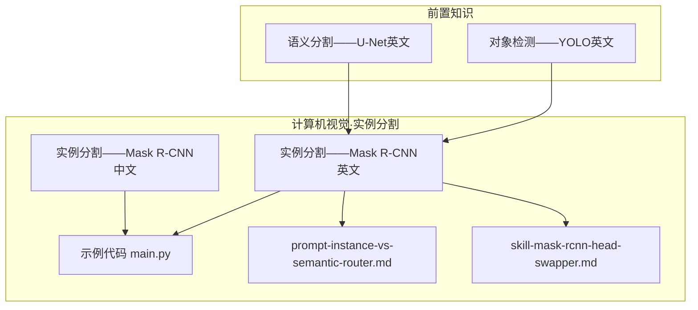
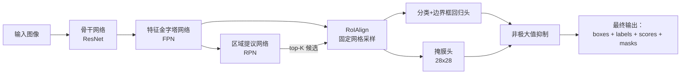
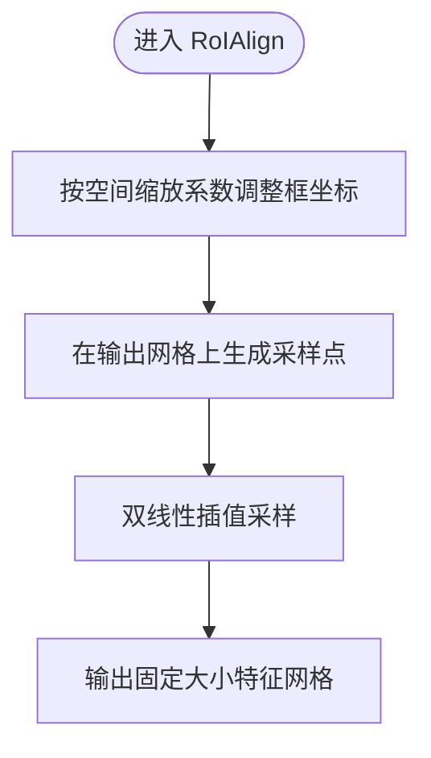
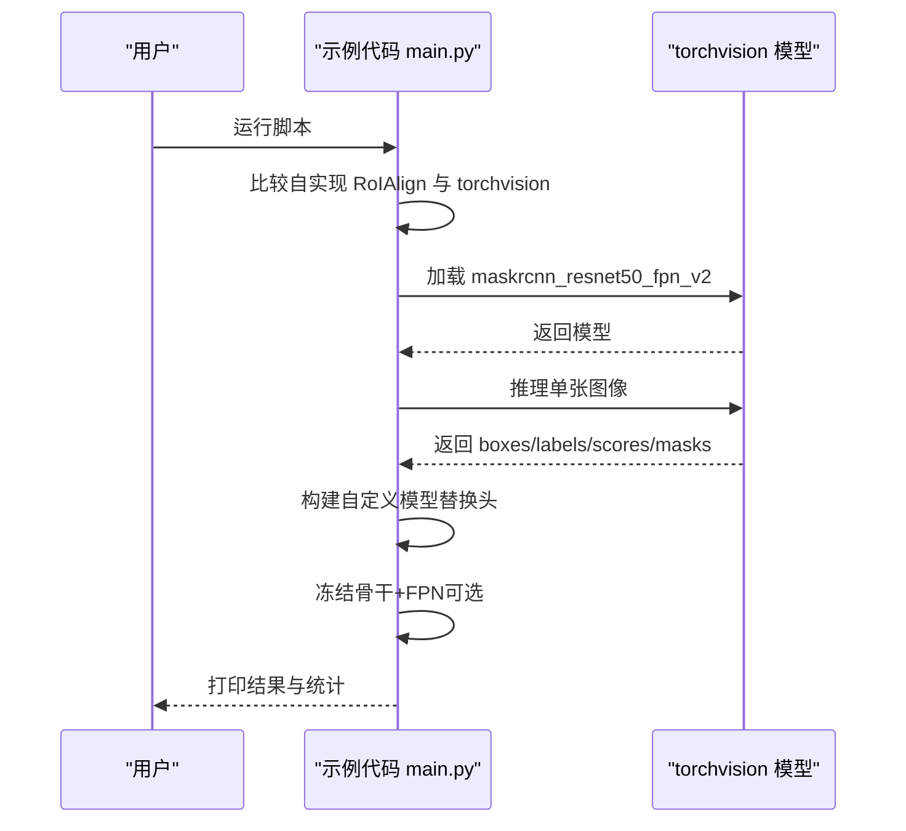
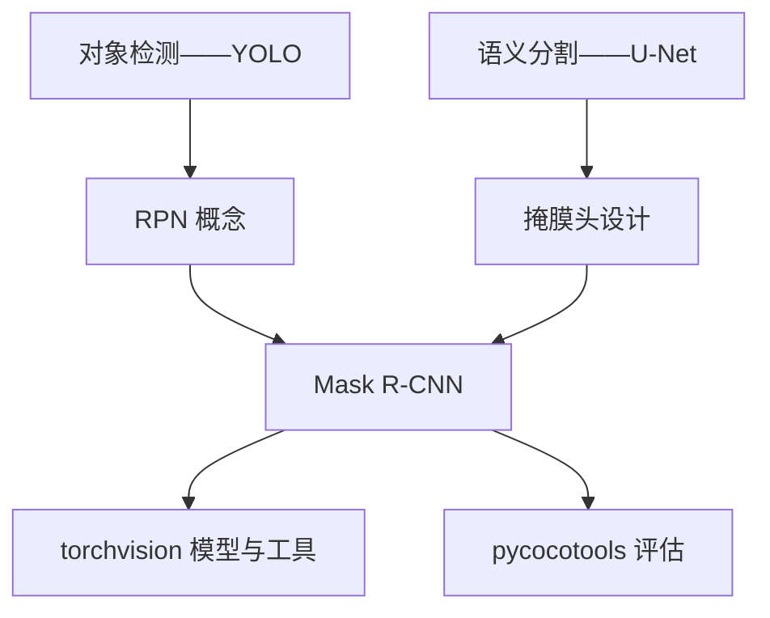

# 实例分割

<cite>
**本文引用的文件**   
- [实例分割——Mask R-CNN（英文）](file://phases/04-computer-vision/08-instance-segmentation-mask-rcnn/docs/en.md)
- [实例分割——Mask R-CNN（中文）](file://phases/04-computer-vision/08-instance-segmentation-mask-rcnn/docs/zh.md)
- [实例分割——Mask R-CNN 示例代码](file://phases/04-computer-vision/08-instance-segmentation-mask-rcnn/code/main.py)
- [实例分割路由提示（英文）](file://phases/04-computer-vision/08-instance-segmentation-mask-rcnn/outputs/prompt-instance-vs-semantic-router.md)
- [Mask R-CNN 头交换技能（英文）](file://phases/04-computer-vision/08-instance-segmentation-mask-rcnn/outputs/skill-mask-rcnn-head-swapper.md)
- [语义分割——U-Net（英文）](file://phases/04-computer-vision/07-semantic-segmentation-unet/docs/en.md)
- [对象检测——YOLO（英文）](file://phases/04-computer-vision/06-object-detection-yolo/docs/en.md)
- [站点数据索引（包含课程信息）](file://site/data.js)
</cite>

## 目录
1. [引言](#引言)
2. [项目结构](#项目结构)
3. [核心组件](#核心组件)
4. [架构总览](#架构总览)
5. [详细组件分析](#详细组件分析)
6. [依赖关系分析](#依赖关系分析)
7. [性能考量](#性能考量)
8. [故障排查指南](#故障排查指南)
9. [结论](#结论)
10. [附录](#附录)

## 引言
本课程围绕“实例分割”展开，系统讲解实例分割与语义分割的区别，重点剖析两阶段检测器（Faster R-CNN）在实例分割中的扩展思路，以及 Mask R-CNN 的完整架构与实现要点。课程强调以下关键能力：
- 区分实例分割与语义分割：前者按对象给出独立掩膜，后者按像素给出类别标签。
- 理解并实现 RoIAlign：解决提议框与特征图像素不对齐导致的定位漂移问题。
- 掌握 Mask R-CNN 的五大模块：骨干网络、FPN、RPN、RoIAlign、头部（分类+边界框回归+掩膜）。
- 理解损失函数组合与评估指标：RPN 分类/回归、分类头分类/回归、掩膜损失，以及 mAP@0.5:0.95（掩膜）。
- 实战：使用 torchvision 的 maskrcnn_resnet50_fpn_v2 进行推理、微调与头替换。

## 项目结构
本课程位于“计算机视觉”阶段的第 8 课，配套有教学文档、示例代码与提示模板。相关文件组织如下：
- 教学文档：英文版与中文版，涵盖概念、架构、实现步骤、练习与术语表。
- 示例代码：包含 RoIAlign 实现、与 torchvision 对比、加载预训练模型、构建自定义模型、冻结策略与主流程。
- 输出产物：任务路由提示（帮助选择实例/语义/全景分割及模型）、头交换技能（快速替换分类头与掩膜头）。

**图表来源**
- [实例分割——Mask R-CNN（英文）:1-296](file://phases/04-computer-vision/08-instance-segmentation-mask-rcnn/docs/en.md#L1-L296)
- [实例分割——Mask R-CNN 示例代码:1-104](file://phases/04-computer-vision/08-instance-segmentation-mask-rcnn/code/main.py#L1-L104)
- [实例分割路由提示（英文）:1-76](file://phases/04-computer-vision/08-instance-segmentation-mask-rcnn/outputs/prompt-instance-vs-semantic-router.md#L1-L76)
- [Mask R-CNN 头交换技能（英文）:1-92](file://phases/04-computer-vision/08-instance-segmentation-mask-rcnn/outputs/skill-mask-rcnn-head-swapper.md#L1-L92)
- [对象检测——YOLO（英文）:1-406](file://phases/04-computer-vision/06-object-detection-yolo/docs/en.md#L1-L406)
- [语义分割——U-Net（英文）:1-400](file://phases/04-computer-vision/07-semantic-segmentation-unet/docs/en.md#L1-L400)

**章节来源**
- [实例分割——Mask R-CNN（英文）:1-296](file://phases/04-computer-vision/08-instance-segmentation-mask-rcnn/docs/en.md#L1-L296)
- [实例分割——Mask R-CNN（中文）:1-296](file://phases/04-computer-vision/08-instance-segmentation-mask-rcnn/docs/zh.md#L1-L296)
- [实例分割——Mask R-CNN 示例代码:1-104](file://phases/04-computer-vision/08-instance-segmentation-mask-rcnn/code/main.py#L1-L104)
- [实例分割路由提示（英文）:1-76](file://phases/04-computer-vision/08-instance-segmentation-mask-rcnn/outputs/prompt-instance-vs-semantic-router.md#L1-L76)
- [Mask R-CNN 头交换技能（英文）:1-92](file://phases/04-computer-vision/08-instance-segmentation-mask-rcnn/outputs/skill-mask-rcnn-head-swapper.md#L1-L92)
- [对象检测——YOLO（英文）:1-406](file://phases/04-computer-vision/06-object-detection-yolo/docs/en.md#L1-L406)
- [语义分割——U-Net（英文）:1-400](file://phases/04-computer-vision/07-semantic-segmentation-unet/docs/en.md#L1-L400)

## 核心组件
- 骨干网络（Backbone）：ResNet-50/101（ImageNet 预训练），输出多尺度特征图（步幅 4/8/16/32）。
- FPN（特征金字塔网络）：自顶向下 + 侧向连接，为不同尺寸目标提供语义丰富的多层特征。
- RPN（区域提议网络）：在每个锚点预测“是否含物体”和“框回归”，筛选 top-K 候选框。
- RoIAlign：从任意浮点坐标的提议框中，双线性插值采样固定大小的特征网格（如 7x7/14x14），避免量化误差。
- 头部（Heads）：两层分类+边界框回归头（Refine），以及掩膜头（28x28 掩膜，逐像素二值交叉熵）。
- 损失函数：L = L_rpn_cls + L_rpn_box + L_box_cls + L_box_reg + L_mask。
- 输出格式：每张图返回 boxes、labels、scores、masks（N,1,H,W），掩膜经阈值化得到二值掩膜。

**章节来源**
- [实例分割——Mask R-CNN（英文）:27-114](file://phases/04-computer-vision/08-instance-segmentation-mask-rcnn/docs/en.md#L27-L114)
- [实例分割——Mask R-CNN（中文）:27-114](file://phases/04-computer-vision/08-instance-segmentation-mask-rcnn/docs/zh.md#L27-L114)

## 架构总览
下图展示了 Mask R-CNN 的端到端流程：输入图像经骨干+FPN，RPN生成候选框，RoIAlign对每个提议采样特征，分别送入分类+边界框回归头与掩膜头，最后经 NMS 合并输出。

**图表来源**
- [实例分割——Mask R-CNN（英文）:29-46](file://phases/04-computer-vision/08-instance-segmentation-mask-rcnn/docs/en.md#L29-L46)

**章节来源**
- [实例分割——Mask R-CNN（英文）:27-46](file://phases/04-computer-vision/08-instance-segmentation-mask-rcnn/docs/en.md#L27-L46)

## 详细组件分析

### RoIAlign：为何不再使用 RoIPool
- RoIPool 将提议框网格化并四舍五入到整数像素，导致特征图与像素坐标存在最大达一整像素的偏移；在高分辨率特征图（步幅 32）上尤为严重。
- RoIAlign 使用双线性插值在浮点坐标采样，全程无量化，显著提升掩膜 AP（COCO 上约 3-4 点）。
- 课程提供了从零实现的 RoIAlign，并与 torchvision.ops.roi_align 对比，验证一致性。

**图表来源**
- [实例分割——Mask R-CNN 示例代码:6-21](file://phases/04-computer-vision/08-instance-segmentation-mask-rcnn/code/main.py#L6-L21)

**章节来源**
- [实例分割——Mask R-CNN（英文）:56-73](file://phases/04-computer-vision/08-instance-segmentation-mask-rcnn/docs/en.md#L56-L73)
- [实例分割——Mask R-CNN 示例代码:6-21](file://phases/04-computer-vision/08-instance-segmentation-mask-rcnn/code/main.py#L6-L21)

### RPN：提议生成与筛选
- 在每个特征图位置放置 K 个锚点，预测每个锚点的物体性分数与框回归偏移；保留 top~1000 个，IoU 0.7 NMS 后送入头部。
- RPN 损失结构与 YOLO 的分类+回归类似，仅类别数为 2（有物体/无物体）。

**章节来源**
- [实例分割——Mask R-CNN（英文）:75-78](file://phases/04-computer-vision/08-instance-segmentation-mask-rcnn/docs/en.md#L75-L78)
- [对象检测——YOLO（英文）:112-126](file://phases/04-computer-vision/06-object-detection-yolo/docs/en.md#L112-L126)

### 掩膜头：28x28 掩膜预测与上采样
- 每个提议经 RoIAlign 后，掩膜头由若干卷积构成，输出与类别数一致的 28x28 掩膜；仅保留预测类别的通道。
- 最终掩膜在推理时被上采样至提议原始像素尺寸，得到与输入图像分辨率一致的二值掩膜。

**章节来源**
- [实例分割——Mask R-CNN（英文）:79-84](file://phases/04-computer-vision/08-instance-segmentation-mask-rcnn/docs/en.md#L79-L84)

### 损失函数与评估指标
- 总损失：L = L_rpn_cls + L_rpn_box + L_box_cls + L_box_reg + L_mask。
- 评估：COCO 掩膜 mAP@0.5:0.95；需同时关注边界框头与掩膜头的表现，以判断瓶颈所在。

**章节来源**
- [实例分割——Mask R-CNN（英文）:85-99](file://phases/04-computer-vision/08-instance-segmentation-mask-rcnn/docs/en.md#L85-L99)
- [实例分割——Mask R-CNN（英文）:262-262](file://phases/04-computer-vision/08-instance-segmentation-mask-rcnn/docs/en.md#L262-L262)

### 预训练模型与推理
- 使用 torchvision.models.detection.maskrcnn_resnet50_fpn_v2，支持 DEFAULT 权重；输出包含 boxes、labels、scores、masks。
- 掩膜为 float32 的概率图，阈值 0.5 得到二值掩膜。

**章节来源**
- [实例分割——Mask R-CNN（英文）:100-114](file://phases/04-computer-vision/08-instance-segmentation-mask-rcnn/docs/en.md#L100-L114)
- [实例分割——Mask R-CNN 示例代码:45-51](file://phases/04-computer-vision/08-instance-segmentation-mask-rcnn/code/main.py#L45-L51)

### 微调与头替换
- 常见做法：复用骨干+FPN+RPN，仅替换分类头与掩膜头；在小数据集上冻结骨干+FPN，仅训练头部。
- 提供头替换模板与冻结策略，便于快速适配自定义类别数。

**章节来源**
- [实例分割——Mask R-CNN（英文）:202-244](file://phases/04-computer-vision/08-instance-segmentation-mask-rcnn/docs/en.md#L202-L244)
- [Mask R-CNN 头交换技能（英文）:1-92](file://phases/04-computer-vision/08-instance-segmentation-mask-rcnn/outputs/skill-mask-rcnn-head-swapper.md#L1-L92)

### 数据标注与评估
- 训练目标需包含每张图的 boxes、labels、masks（二值掩膜，形状为 (num_instances, H, W)）。
- 评估使用 pycocotools，输出 mAP@0.5:0.95（掩膜）与（边界框），用于定位与分割两端的诊断。

**章节来源**
- [实例分割——Mask R-CNN（英文）:260-262](file://phases/04-computer-vision/08-instance-segmentation-mask-rcnn/docs/en.md#L260-L262)

### 多实例与遮挡处理
- 实例分割天然区分同一类别中的多个对象，适合计数与跟踪场景。
- 遮挡处理依赖高质量的 RPN 与 RoIAlign，以及掩膜头的边界精度；建议结合 Dice 损失与边界 F1 指标进行优化与诊断。

**章节来源**
- [语义分割——U-Net（英文）:17-23](file://phases/04-computer-vision/07-semantic-segmentation-unet/docs/en.md#L17-L23)
- [语义分割——U-Net（英文）:119-127](file://phases/04-computer-vision/07-semantic-segmentation-unet/docs/en.md#L119-L127)

### 完整 Pipeline 实现示例
- 步骤概览：RoIAlign 实现与对比、加载预训练模型、推理输出解析、构建自定义模型、冻结策略、训练循环（torchvision 默认）。
- 代码路径：示例脚本包含上述所有步骤，便于直接运行与验证。

**图表来源**
- [实例分割——Mask R-CNN 示例代码:24-104](file://phases/04-computer-vision/08-instance-segmentation-mask-rcnn/code/main.py#L24-L104)

**章节来源**
- [实例分割——Mask R-CNN 示例代码:1-104](file://phases/04-computer-vision/08-instance-segmentation-mask-rcnn/code/main.py#L1-L104)

## 依赖关系分析
- 与前置课程的关系：
  - YOLO：理解检测的网格+锚点+损失+NMS，有助于理解 RPN 与后处理。
  - U-Net：理解像素级预测与掩膜输出，有助于理解实例分割的掩膜头设计。
- 与外部库的关系：
  - torchvision：提供骨干、FPN、RPN、RoIAlign、预训练模型与头替换接口。
  - pycocotools：提供 COCO 指标评估（mAP@0.5:0.95）。

**图表来源**
- [对象检测——YOLO（英文）:1-406](file://phases/04-computer-vision/06-object-detection-yolo/docs/en.md#L1-L406)
- [语义分割——U-Net（英文）:1-400](file://phases/04-computer-vision/07-semantic-segmentation-unet/docs/en.md#L1-L400)
- [实例分割——Mask R-CNN（英文）:1-296](file://phases/04-computer-vision/08-instance-segmentation-mask-rcnn/docs/en.md#L1-L296)

**章节来源**
- [对象检测——YOLO（英文）:1-406](file://phases/04-computer-vision/06-object-detection-yolo/docs/en.md#L1-L406)
- [语义分割——U-Net（英文）:1-400](file://phases/04-computer-vision/07-semantic-segmentation-unet/docs/en.md#L1-L400)
- [实例分割——Mask R-CNN（英文）:1-296](file://phases/04-computer-vision/08-instance-segmentation-mask-rcnn/docs/en.md#L1-L296)

## 性能考量
- RoIAlign 的定位精度直接影响掩膜 AP；在高分辨率特征图上优势明显。
- 小数据集微调时，冻结骨干+FPN 可有效防止过拟合并加速收敛。
- 训练循环简洁（torchvision 默认），损失组合稳定，适合快速迭代。

**章节来源**
- [实例分割——Mask R-CNN（英文）:23-23](file://phases/04-computer-vision/08-instance-segmentation-mask-rcnn/docs/en.md#L23-L23)
- [实例分割——Mask R-CNN（英文）:225-244](file://phases/04-computer-vision/08-instance-segmentation-mask-rcnn/docs/en.md#L225-L244)
- [实例分割——Mask R-CNN（英文）:247-258](file://phases/04-computer-vision/08-instance-segmentation-mask-rcnn/docs/en.md#L247-L258)

## 故障排查指南
- RoIAlign 对比失败：检查 spatial_scale、output_size、aligned 参数是否一致；确认 align_corners=False。
- 预训练模型加载失败：首次下载权重可能耗时较长，确保网络可用；若报错，尝试更换默认权重来源。
- 头替换报错：确保 num_classes 包含背景类；仅适用于 maskrcnn_resnet50_fpn/_v2；Faster R-CNN 仅有分类头，RetinaNet 无 roi_heads。
- 冻结策略：小数据集优先冻结骨干+FPN；大数据集可考虑逐步解冻。

**章节来源**
- [实例分割——Mask R-CNN 示例代码:24-104](file://phases/04-computer-vision/08-instance-segmentation-mask-rcnn/code/main.py#L24-L104)
- [Mask R-CNN 头交换技能（英文）:20-25](file://phases/04-computer-vision/08-instance-segmentation-mask-rcnn/outputs/skill-mask-rcnn-head-swapper.md#L20-L25)
- [实例分割——Mask R-CNN（英文）:262-262](file://phases/04-computer-vision/08-instance-segmentation-mask-rcnn/docs/en.md#L262-L262)

## 结论
本课程以 Mask R-CNN 为核心，系统讲解了实例分割的工程实现：从 RoIAlign 的必要性，到两阶段检测器的提议、分类、回归与掩膜预测流程，再到损失函数组合与评估指标。配合 torchvision 的高效实现与头替换技巧，可在小样本数据上快速落地实例分割任务。建议在实践中重点关注 RoIAlign 的精度、小样本的冻结策略与掩膜头的边界质量，并结合 pycocotools 指标进行端到端诊断。

## 附录
- 任务路由提示：根据是否需要计数/跟踪、像素级标签范围与算力预算，自动推荐实例/语义/全景分割的首选用例与模型。
- 练习建议：
  - 验证 RoIAlign 与 torchvision 的一致性；
  - 在小数据集上微调并报告掩膜 AP@0.5；
  - 尝试增大掩膜头输出分辨率并评估 mAP@0.75 的收益。

**章节来源**
- [实例分割路由提示（英文）:1-76](file://phases/04-computer-vision/08-instance-segmentation-mask-rcnn/outputs/prompt-instance-vs-semantic-router.md#L1-L76)
- [实例分割——Mask R-CNN（英文）:271-276](file://phases/04-computer-vision/08-instance-segmentation-mask-rcnn/docs/en.md#L271-L276)