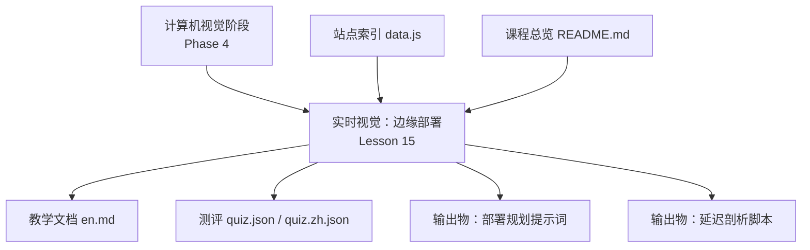
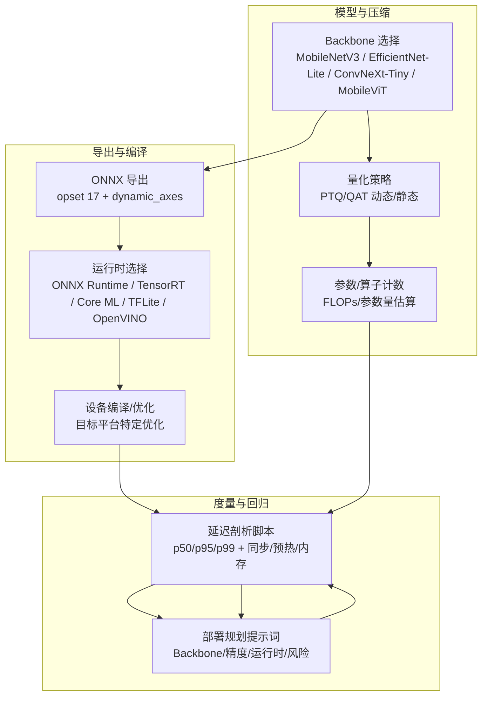
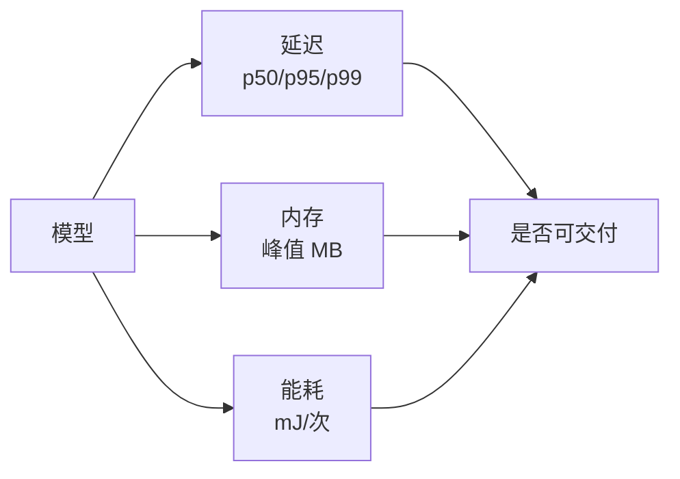
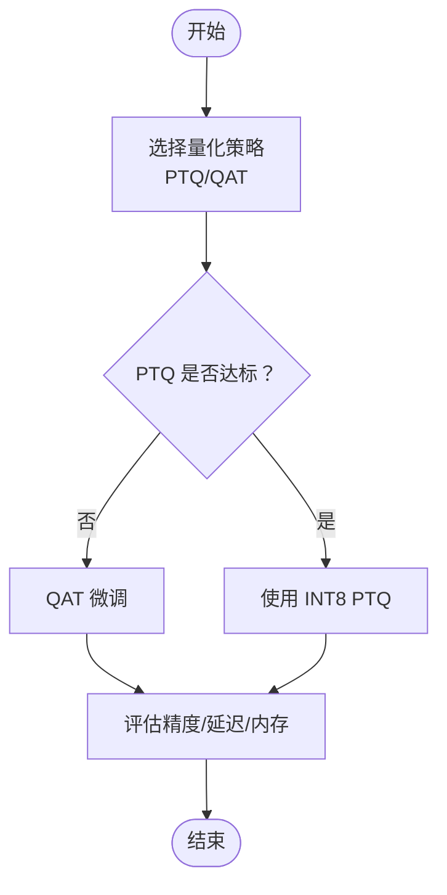
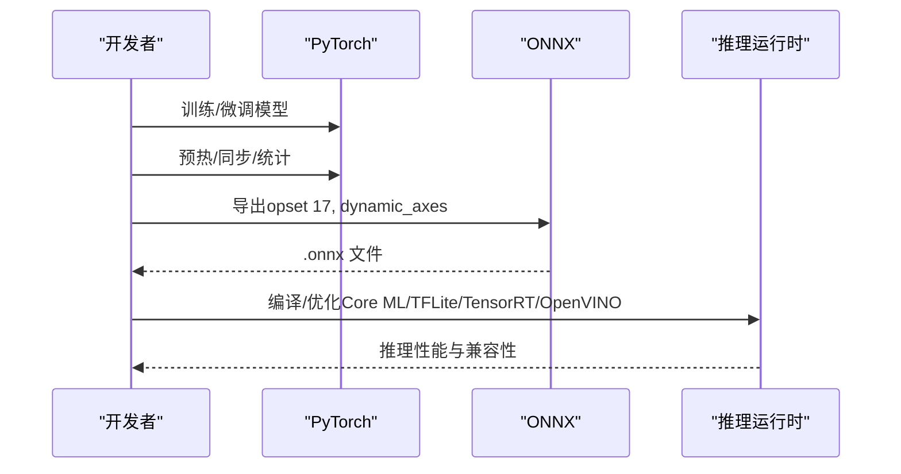
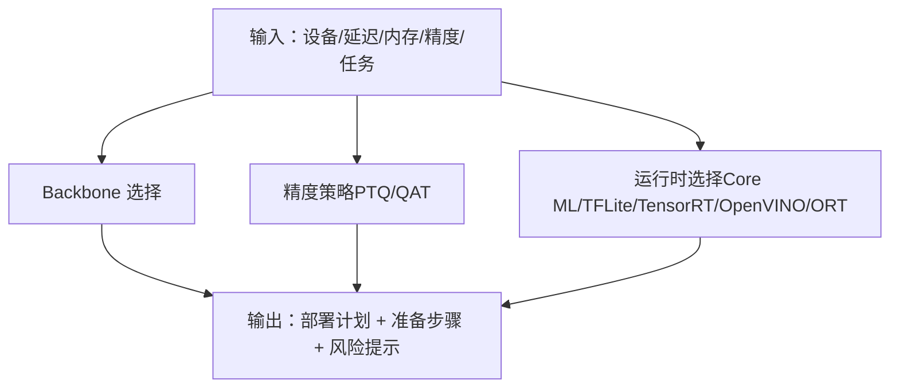
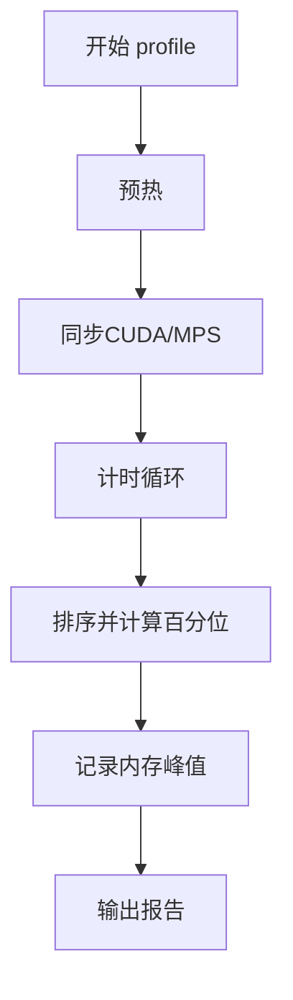
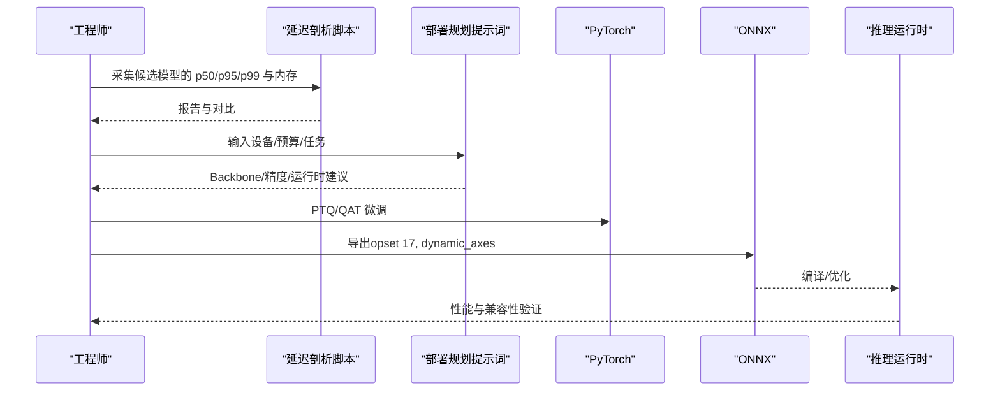

# 实时边缘计算

<cite>
**本文引用的文件**
- [phases/04-computer-vision/15-real-time-edge/docs/en.md](file://phases/04-computer-vision/15-real-time-edge/docs/en.md)
- [phases/04-computer-vision/15-real-time-edge/quiz.json](file://phases/04-computer-vision/15-real-time-edge/quiz.json)
- [phases/04-computer-vision/15-real-time-edge/quiz.zh.json](file://phases/04-computer-vision/15-real-time-edge/quiz.zh.json)
- [phases/04-computer-vision/15-real-time-edge/outputs/prompt-edge-deployment-planner.md](file://phases/04-computer-vision/15-real-time-edge/outputs/prompt-edge-deployment-planner.md)
- [phases/04-computer-vision/15-real-time-edge/outputs/skill-latency-profiler.md](file://phases/04-computer-vision/15-real-time-edge/outputs/skill-latency-profiler.md)
- [site/data.js](file://site/data.js)
- [README.md](file://README.md)
- [glossary/myths.md](file://glossary/myths.md)
</cite>

## 目录
1. [引言](#引言)
2. [项目结构](#项目结构)
3. [核心组件](#核心组件)
4. [架构总览](#架构总览)
5. [详细组件分析](#详细组件分析)
6. [依赖关系分析](#依赖关系分析)
7. [性能考量](#性能考量)
8. [故障排查指南](#故障排查指南)
9. [结论](#结论)
10. [附录](#附录)

## 引言
本课程围绕“实时边缘计算”展开，聚焦计算机视觉模型在资源受限设备（手机、嵌入式、工业相机、Jetson 等）上的部署挑战与系统化解法。内容覆盖三大预算（延迟、峰值内存、能耗）的度量与权衡、模型压缩（量化、剪枝、知识蒸馏）、轻量化网络设计（MobileNetV3、EfficientNet-Lite、ConvNeXt-Tiny、MobileViT 等）、推理引擎工具链（ONNX Runtime、TensorRT、Core ML、TFLite、OpenVINO）以及实时优化策略（批处理、异步推理、硬件加速）。课程强调“先度量再优化”，并提供可复用的脚手架与提示词模板，帮助学员构建端到端的边缘视觉系统。

## 项目结构
本仓库为系统化的 AI 工程学习体系，边缘计算与计算机视觉相关内容集中在“计算机视觉”阶段第 15 课“实时视觉：边缘部署”。配套材料包括：
- 教学文档：系统化知识与步骤
- 测评题：验证关键概念掌握
- 输出物：可复用提示词与性能剖析脚本
- 站点索引：课程在整体学习路径中的定位

图表来源
- [site/data.js:753-762](file://site/data.js#L753-L762)
- [README.md:366](file://README.md#L366)

章节来源
- [site/data.js:753-762](file://site/data.js#L753-L762)
- [README.md:366](file://README.md#L366)

## 核心组件
- 边缘部署知识框架：明确三预算（延迟/内存/能耗）、测量纪律、FLOPs 作为架构对比代理、量化（PTQ/QAT）、剪枝与蒸馏、推理运行时选型与导出流程。
- 部署规划提示词：面向多设备（iPhone、Jetson、Pixel、树莓派、Edge TPU、云 GPU）与任务类型（分类/检测/分割/嵌入）给出可执行的 Backbone、精度与运行时建议。
- 延迟剖析脚本：提供统一的预热、同步、定时、百分位统计与内存追踪模板，支持 CPU/GPU/MPS 设备。
- 测评题：覆盖延迟度量缺失项、FLOPs 与实测不一致原因、PTQ 精度损失范围、小预算模型选型、ONNX 导出常见失败原因等关键问题。

章节来源
- [phases/04-computer-vision/15-real-time-edge/docs/en.md:10-275](file://phases/04-computer-vision/15-real-time-edge/docs/en.md#L10-L275)
- [phases/04-computer-vision/15-real-time-edge/outputs/prompt-edge-deployment-planner.md:1-71](file://phases/04-computer-vision/15-real-time-edge/outputs/prompt-edge-deployment-planner.md#L1-L71)
- [phases/04-computer-vision/15-real-time-edge/outputs/skill-latency-profiler.md:1-116](file://phases/04-computer-vision/15-real-time-edge/outputs/skill-latency-profiler.md#L1-L116)
- [phases/04-computer-vision/15-real-time-edge/quiz.json:1-40](file://phases/04-computer-vision/15-real-time-edge/quiz.json#L1-L40)
- [phases/04-computer-vision/15-real-time-edge/quiz.zh.json:1-40](file://phases/04-computer-vision/15-real-time-edge/quiz.zh.json#L1-L40)

## 架构总览
边缘视觉系统由“模型—量化—导出—运行时—设备”五段闭环构成。部署流程以“先度量、再压缩、后导出、最后运行时编译/优化”的顺序推进，确保每一步都有可验证的指标与回退策略。

图表来源
- [phases/04-computer-vision/15-real-time-edge/docs/en.md:109-242](file://phases/04-computer-vision/15-real-time-edge/docs/en.md#L109-L242)
- [phases/04-computer-vision/15-real-time-edge/outputs/skill-latency-profiler.md:51-107](file://phases/04-computer-vision/15-real-time-edge/outputs/skill-latency-profiler.md#L51-L107)
- [phases/04-computer-vision/15-real-time-edge/outputs/prompt-edge-deployment-planner.md:18-71](file://phases/04-computer-vision/15-real-time-edge/outputs/prompt-edge-deployment-planner.md#L18-L71)

## 详细组件分析

### 组件A：三预算与测量纪律
- 三预算：延迟（p50/p95/p99）、峰值内存（非稳态均值）、能耗（mJ/次推理，常以利用率×时间近似）。
- 测量纪律：预热、GPU/CPU 同步、固定生产分辨率、百分位统计、内存峰值记录。
- FLOPs 代理：用于架构对比，不等同于真实延迟；需结合硬件友好度（如深度可分离卷积 vs 大卷积核）理解。

图表来源
- [phases/04-computer-vision/15-real-time-edge/docs/en.md:27-48](file://phases/04-computer-vision/15-real-time-edge/docs/en.md#L27-L48)

章节来源
- [phases/04-computer-vision/15-real-time-edge/docs/en.md:50-67](file://phases/04-computer-vision/15-real-time-edge/docs/en.md#L50-L67)

### 组件B：量化策略（PTQ/QAT）
- PTQ（训练后静态量化）：易用、收益高（约 95%），适合多数边缘场景；需校准激活范围、融合 BN。
- QAT（量化感知训练）：训练期模拟量化，精度更优，需标注数据与额外训练成本。
- INT8 替换 FP32 权重/激活，带来存储、带宽与计算的显著下降，典型精度损失 0.1–1%。

图表来源
- [phases/04-computer-vision/15-real-time-edge/docs/en.md:64-80](file://phases/04-computer-vision/15-real-time-edge/docs/en.md#L64-L80)

章节来源
- [phases/04-computer-vision/15-real-time-edge/docs/en.md:64-80](file://phases/04-computer-vision/15-real-time-edge/docs/en.md#L64-L80)

### 组件C：剪枝与知识蒸馏
- 剪枝：按幅度/结构移除权重/通道，对超参模型有效，对已紧凑架构收益有限。
- 蒸馏：以教师模型指导学生模型，恢复压缩带来的精度损失，是生产级边缘模型的标准做法。

章节来源
- [phases/04-computer-vision/15-real-time-edge/docs/en.md:76-80](file://phases/04-computer-vision/15-real-time-edge/docs/en.md#L76-L80)

### 组件D：推理运行时与导出
- 运行时矩阵：ONNX Runtime（中立）、TensorRT（NVIDIA 最佳）、Core ML（Apple）、TFLite（Android/ARM）、OpenVINO（Intel CPU/VPU）。
- 导出流程：PyTorch → ONNX（opset 17 + dynamic_axes）→ 选定运行时编译/优化。
- 常见导出失败：追踪无法捕获的控制流、Python 级分支、自定义 CUDA 算子、隐式张量-标量交互。

图表来源
- [phases/04-computer-vision/15-real-time-edge/docs/en.md:81-92](file://phases/04-computer-vision/15-real-time-edge/docs/en.md#L81-L92)
- [phases/04-computer-vision/15-real-time-edge/docs/en.md:197-215](file://phases/04-computer-vision/15-real-time-edge/docs/en.md#L197-L215)

章节来源
- [phases/04-computer-vision/15-real-time-edge/docs/en.md:81-92](file://phases/04-computer-vision/15-real-time-edge/docs/en.md#L81-L92)
- [phases/04-computer-vision/15-real-time-edge/docs/en.md:197-215](file://phases/04-computer-vision/15-real-time-edge/docs/en.md#L197-L215)

### 组件E：轻量化网络设计与 Backbone 选择
- 小参数预算（<3M）：MobileNetV3-Small。
- 中参数预算（3–10M）：EfficientNet-Lite-B0（TFLite 下精度最优）。
- 中高参数预算（10–20M）：ConvNeXt-Tiny（CPU 友好、精度高）。
- 高参数预算（20–30M）：MobileViT-S/EfficientViT（Transformer 图像精度）。
- 更大预算（30–80M）：Swin-V2-Tiny（若栈支持窗口注意力）。

章节来源
- [phases/04-computer-vision/15-real-time-edge/docs/en.md:93-104](file://phases/04-computer-vision/15-real-time-edge/docs/en.md#L93-L104)

### 组件F：部署规划提示词（跨设备/任务）
提示词根据设备类别（iPhone、Jetson Nano/Orin、Pixel、Raspberry Pi 5、Edge TPU、笔记本 CPU、云 GPU）、延迟目标、峰值内存预算、精度底线与任务类型，输出：
- Backbone 与规模
- 精度策略（INT8/FP16/BF16）
- 运行时与编译方式
- 预期延迟与内存
- 准备步骤与风险提示

图表来源
- [phases/04-computer-vision/15-real-time-edge/outputs/prompt-edge-deployment-planner.md:18-71](file://phases/04-computer-vision/15-real-time-edge/outputs/prompt-edge-deployment-planner.md#L18-L71)

章节来源
- [phases/04-computer-vision/15-real-time-edge/outputs/prompt-edge-deployment-planner.md:18-71](file://phases/04-computer-vision/15-real-time-edge/outputs/prompt-edge-deployment-planner.md#L18-L71)

### 组件G：延迟剖析脚本（统一度量）
脚本提供：
- 预热、同步、计时（time.perf_counter）、百分位统计、内存峰值记录
- 支持 CPU/GPU/MPS
- 批大小扫描揭示吞吐/延迟权衡
- 输出包含 p50/p90/p95/p99、均值/标准差、RSS/峰值显存

图表来源
- [phases/04-computer-vision/15-real-time-edge/outputs/skill-latency-profiler.md:51-107](file://phases/04-computer-vision/15-real-time-edge/outputs/skill-latency-profiler.md#L51-L107)

章节来源
- [phases/04-computer-vision/15-real-time-edge/outputs/skill-latency-profiler.md:1-116](file://phases/04-computer-vision/15-real-time-edge/outputs/skill-latency-profiler.md#L1-L116)

### 组件H：实时性能优化策略
- 批处理：在设备允许范围内提升吞吐，注意引入排队延迟。
- 异步推理：主线程与推理线程解耦，避免 UI/控制环阻塞。
- 硬件加速：优先选择具备 INT8/张量核/向量化能力的设备；NVIDIA 使用 TensorRT，Apple 使用 Core ML，Android 使用 TFLite，Intel 使用 OpenVINO。
- 分层优化：先冻结参数（冻结 BN/头），再做 PTQ/QAT，最后导出与编译。

章节来源
- [phases/04-computer-vision/15-real-time-edge/docs/en.md:235-242](file://phases/04-computer-vision/15-real-time-edge/docs/en.md#L235-L242)

### 组件I：资源限制与功耗考量
- 内存预算：峰值内存决定能否稳定运行，OOM 即失败。
- 功耗预算：电池供电设备以 mJ/次为单位衡量能耗，关注峰值功耗与热管理。
- 硬件适配：不同平台的算子支持、量化后加速效果差异显著。

章节来源
- [phases/04-computer-vision/15-real-time-edge/docs/en.md:27-48](file://phases/04-computer-vision/15-real-time-edge/docs/en.md#L27-L48)

### 组件J：完整边缘视觉系统部署示例（流程）
以下为端到端示例流程，可直接映射至仓库提供的脚本与提示词：

图表来源
- [phases/04-computer-vision/15-real-time-edge/outputs/skill-latency-profiler.md:51-107](file://phases/04-computer-vision/15-real-time-edge/outputs/skill-latency-profiler.md#L51-L107)
- [phases/04-computer-vision/15-real-time-edge/outputs/prompt-edge-deployment-planner.md:18-71](file://phases/04-computer-vision/15-real-time-edge/outputs/prompt-edge-deployment-planner.md#L18-L71)
- [phases/04-computer-vision/15-real-time-edge/docs/en.md:180-231](file://phases/04-computer-vision/15-real-time-edge/docs/en.md#L180-L231)

## 依赖关系分析
- 文档与输出物：教学文档为骨架，提示词与脚本为工具，二者共同支撑“先度量、再决策、后验证”的闭环。
- 站点索引与课程总览：将边缘部署课程纳入计算机视觉阶段，便于学习路径导航。

图表来源
- [site/data.js:753-762](file://site/data.js#L753-L762)
- [README.md:366](file://README.md#L366)

章节来源
- [site/data.js:753-762](file://site/data.js#L753-L762)
- [README.md:366](file://README.md#L366)

## 性能考量
- 硬件友好度：深度可分离卷积在移动设备上更省带宽；大卷积核在具备 Tensor Cores 的 GPU 上更高效。
- 量化收益：INT8 在具备 INT8 内核的 SoC 上通常获得 2–4x 加速；PTQ 在校准充分时精度损失极低。
- 导出稳定性：ONNX 导出依赖静态图追踪，需规避动态控制流与自定义算子；必要时改用脚本化或更高 opset。
- 批大小权衡：增大批可提升吞吐但增加排队延迟，需结合设备内存与 SLA 选择。

## 故障排查指南
- 延迟度量不准确
  - 缺少百分位、未做预热、未同步 GPU/CPU、分辨率不一致。
- FLOPs 与实测不符
  - 不同算子硬件友好度差异、内存带宽/缓存/内核启动开销主导延迟。
- PTQ 精度损失过大
  - 校准集不足/异常值/未融合 BN/逐通道量化不当。
- ONNX 导出失败
  - 自定义算子无映射、动态控制流、隐式张量-标量交互；修复：替换算子、脚本化、升级 opset。
- 移动端体积/延迟超限
  - Backbone 规模过大或未量化；优先 MobileNetV3/ EfficientNet-Lite-B0 并量化至 INT8。

章节来源
- [phases/04-computer-vision/15-real-time-edge/quiz.json:1-40](file://phases/04-computer-vision/15-real-time-edge/quiz.json#L1-L40)
- [phases/04-computer-vision/15-real-time-edge/quiz.zh.json:1-40](file://phases/04-computer-vision/15-real-time-edge/quiz.zh.json#L1-L40)
- [phases/04-computer-vision/15-real-time-edge/docs/en.md:197-215](file://phases/04-computer-vision/15-real-time-edge/docs/en.md#L197-L215)

## 结论
边缘视觉系统的成功交付取决于“度量先行、预算清晰、策略可验证”。通过统一的延迟剖析脚本与部署规划提示词，结合量化、剪枝与蒸馏等压缩手段，以及 ONNX 为纽带的多运行时编译链路，可在手机、嵌入式与边缘服务器等多样化设备上实现高精度、低延迟与低功耗的平衡。建议在项目初期即建立标准化的度量与回归流程，持续迭代以逼近 SLA。

## 附录
- 关键术语
  - 延迟：输入到输出的时间，应报告 p50/p95/p99，而非均值。
  - FLOPs：每前向的浮点运算次数，作为架构对比代理。
  - INT8 量化：用 8 位整数替代 FP32 权重/激活，通常带来 4x 存储/带宽/计算收益。
  - PTQ：训练后静态量化，易用且收益高。
  - QAT：训练期模拟量化，精度更优。
  - ONNX：主流模型交换格式，被各推理运行时支持。
  - TensorRT：NVIDIA 推理编译器，擅长 GPU 加速。
  - 蒸馏：以教师模型指导学生模型，恢复精度。

章节来源
- [phases/04-computer-vision/15-real-time-edge/docs/en.md:256-275](file://phases/04-computer-vision/15-real-time-edge/docs/en.md#L256-L275)