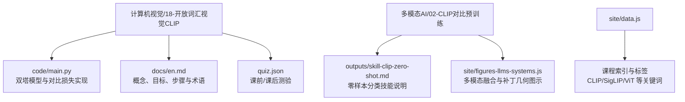
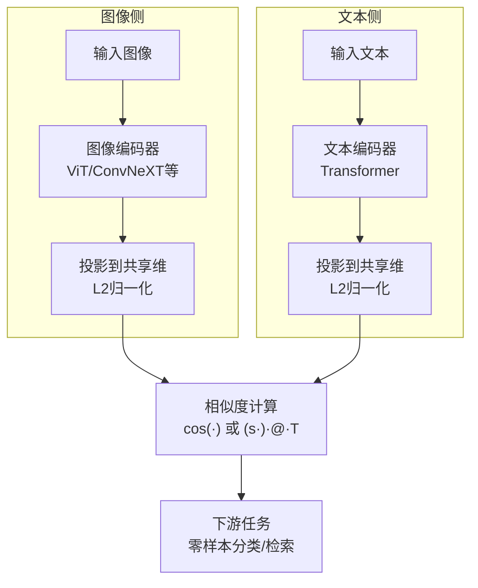
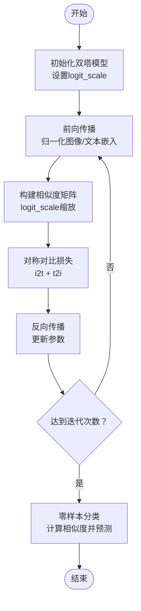
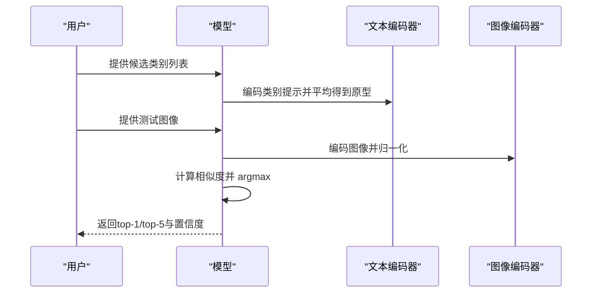
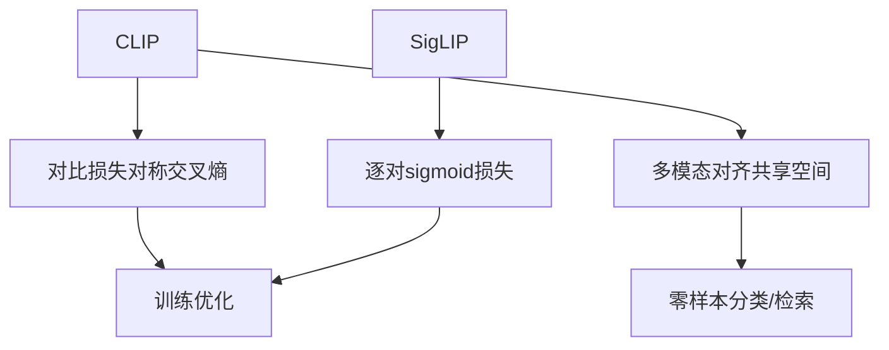

# 开放词汇视觉

<cite>
**本文引用的文件**
- [main.py](file://phases/04-computer-vision/18-open-vocab-clip/code/main.py)
- [en.md](file://phases/04-computer-vision/18-open-vocab-clip/docs/en.md)
- [quiz.json](file://phases/04-computer-vision/18-open-vocab-clip/quiz.json)
- [skill-clip-zero-shot.md](file://phases/12-multimodal-ai/02-clip-contrastive-pretraining/outputs/skill-clip-zero-shot.md)
- [multimodalFusion.svg](file://site/figures-llms-systems.js)
- [patch-tokens.svg](file://site/figures-llms-systems.js)
- [data.js](file://site/data.js)
</cite>

## 目录
1. [引言](#引言)
2. [项目结构](#项目结构)
3. [核心组件](#核心组件)
4. [架构总览](#架构总览)
5. [详细组件分析](#详细组件分析)
6. [依赖关系分析](#依赖关系分析)
7. [性能考量](#性能考量)
8. [故障排查指南](#故障排查指南)
9. [结论](#结论)
10. [附录](#附录)

## 引言
本文件围绕“开放词汇视觉”主题，系统梳理并实证解读对比语言-图像预训练（CLIP 等）的工作原理与工程实践。重点覆盖：
- 双塔（两路独立编码器）架构与对比学习目标
- 温度参数与相似度归一化
- 零样本分类、文本-图像检索等典型应用
- 多模态特征对齐与投影策略
- 实战示例：从自实现双塔模型到零样本推理流程

本教程以仓库内“开放词汇视觉（CLIP）”课程为依据，结合可视化图示与练习题，帮助读者建立从理论到工程的完整认知。

## 项目结构
本专题位于计算机视觉阶段第18课“开放词汇视觉（CLIP）”，配套有可运行代码、英文讲义与测验；同时在多模态AI阶段提供了“零样本分类技能”说明与可视化素材，便于跨阶段理解。

图表来源
- [main.py:1-89](file://phases/04-computer-vision/18-open-vocab-clip/code/main.py#L1-L89)
- [en.md:1-224](file://phases/04-computer-vision/18-open-vocab-clip/docs/en.md#L1-L224)
- [quiz.json:1-40](file://phases/04-computer-vision/18-open-vocab-clip/quiz.json#L1-L40)
- [skill-clip-zero-shot.md:1-31](file://phases/12-multimodal-ai/02-clip-contrastive-pretraining/outputs/skill-clip-zero-shot.md#L1-L31)
- [data.js:2115-2130](file://site/data.js#L2115-L2130)

章节来源
- [main.py:1-89](file://phases/04-computer-vision/18-open-vocab-clip/code/main.py#L1-L89)
- [en.md:1-224](file://phases/04-computer-vision/18-open-vocab-clip/docs/en.md#L1-L224)
- [quiz.json:1-40](file://phases/04-computer-vision/18-open-vocab-clip/quiz.json#L1-L40)
- [skill-clip-zero-shot.md:1-31](file://phases/12-multimodal-ai/02-clip-contrastive-pretraining/outputs/skill-clip-zero-shot.md#L1-L31)
- [data.js:2115-2130](file://site/data.js#L2115-L2130)

## 核心组件
- 双塔模型（TwoTower）
  - 图像编码器与文本编码器分别映射到共享嵌入空间，并进行L2归一化
  - 通过可学习温度参数（logit_scale）控制相似度锐度
- 对比损失（clip_loss）
  - 基于对称的交叉熵损失，鼓励匹配对相似度高、非匹配对相似度低
- 零样本分类（zero_shot_classify）
  - 使用类提示（prompt）构造类别原型，计算测试图像与类原型的余弦相似度，取最大者作为预测

章节来源
- [main.py:6-23](file://phases/04-computer-vision/18-open-vocab-clip/code/main.py#L6-L23)
- [main.py:25-31](file://phases/04-computer-vision/18-open-vocab-clip/code/main.py#L25-L31)
- [main.py:34-41](file://phases/04-computer-vision/18-open-vocab-clip/code/main.py#L34-L41)
- [en.md:91-149](file://phases/04-computer-vision/18-open-vocab-clip/docs/en.md#L91-L149)

## 架构总览
CLIP式多模态对齐采用“晚期融合”范式：图像与文本分别经编码器映射至共享空间，最终在该空间内进行相似度比较。下图展示两种融合路径（晚期 vs 早期）及相似度计算公式。

图表来源
- [multimodalFusion.svg:417-482](file://site/figures-llms-systems.js#L417-L482)
- [en.md:27-41](file://phases/04-computer-vision/18-open-vocab-clip/docs/en.md#L27-L41)

## 详细组件分析

### 组件A：双塔模型与对比损失
- 结构要点
  - 图像与文本分别通过MLP投影到共享维度，并进行L2归一化
  - logit_scale为可学习标量，用于缩放相似度矩阵，影响softmax锐度
  - 对比损失对称地作用于图像→文本与文本→图像两个方向
- 训练流程
  - 随机初始化时，损失应接近 log(N)
  - 在合成结构化的配对数据上进行训练，逐步收敛
- 推理流程
  - 零样本分类：对每个类构造提示并平均嵌入，得到类原型；对测试图像计算相似度并 argmax

图表来源
- [main.py:6-23](file://phases/04-computer-vision/18-open-vocab-clip/code/main.py#L6-L23)
- [main.py:25-31](file://phases/04-computer-vision/18-open-vocab-clip/code/main.py#L25-L31)
- [main.py:34-41](file://phases/04-computer-vision/18-open-vocab-clip/code/main.py#L34-L41)

章节来源
- [main.py:6-23](file://phases/04-computer-vision/18-open-vocab-clip/code/main.py#L6-L23)
- [main.py:25-31](file://phases/04-computer-vision/18-open-vocab-clip/code/main.py#L25-L31)
- [main.py:34-41](file://phases/04-computer-vision/18-open-vocab-clip/code/main.py#L34-L41)
- [en.md:91-149](file://phases/04-computer-vision/18-open-vocab-clip/docs/en.md#L91-L149)

### 组件B：零样本分类流程
- 步骤
  - 为每个类别构造提示模板（如“a photo of a {}”），编码并平均得到类原型
  - 对测试图像进行编码并归一化
  - 计算相似度矩阵，取 argmax 得到预测类别
- 技能边界与建议
  - 使用多个模板并平均可提升精度
  - 输出包含置信度与检查点元信息，避免跨检查点直接比较分数

图表来源
- [skill-clip-zero-shot.md:10-18](file://phases/12-multimodal-ai/02-clip-contrastive-pretraining/outputs/skill-clip-zero-shot.md#L10-L18)
- [en.md:132-148](file://phases/04-computer-vision/18-open-vocab-clip/docs/en.md#L132-L148)

章节来源
- [skill-clip-zero-shot.md:1-31](file://phases/12-multimodal-ai/02-clip-contrastive-pretraining/outputs/skill-clip-zero-shot.md#L1-L31)
- [en.md:68-88](file://phases/04-computer-vision/18-open-vocab-clip/docs/en.md#L68-L88)

### 组件C：多模态融合与补丁几何
- 融合方式
  - 晚期融合：分别编码后投影到共享空间，最后比较相似度（CLIP风格）
  - 早期融合：将图像与文本token拼接后联合建模
- 补丁几何
  - ViT将图像切分为固定尺寸的补丁序列，类似词序列；序列长度随分辨率与补丁大小变化
  - 序列长度与注意力成本呈平方关系，降低补丁尺寸会显著增加计算

图表来源
- [patch-tokens.svg:365-415](file://site/figures-llms-systems.js#L365-L415)
- [multimodalFusion.svg:417-482](file://site/figures-llms-systems.js#L417-L482)

章节来源
- [patch-tokens.svg:365-415](file://site/figures-llms-systems.js#L365-L415)
- [multimodalFusion.svg:417-482](file://site/figures-llms-systems.js#L417-L482)

## 依赖关系分析
- 概念依赖
  - CLIP依赖对比学习与温度参数；SigLIP以逐对sigmoid替代softmax，改善小批量训练稳定性
  - 零样本分类依赖高质量提示工程与类原型对齐
- 工程依赖
  - 视觉编码器通常为ViT或其变体；文本编码器为Transformer
  - 多模态融合采用晚期对齐（共享嵌入空间）而非早期强耦合

图表来源
- [en.md:43-66](file://phases/04-computer-vision/18-open-vocab-clip/docs/en.md#L43-L66)
- [en.md:80-89](file://phases/04-computer-vision/18-open-vocab-clip/docs/en.md#L80-L89)

章节来源
- [en.md:43-66](file://phases/04-computer-vision/18-open-vocab-clip/docs/en.md#L43-L66)
- [en.md:80-89](file://phases/04-computer-vision/18-open-vocab-clip/docs/en.md#L80-L89)

## 性能考量
- 温度参数（logit_scale）
  - 控制相似度矩阵的锐度；过大可能导致数值不稳定，过小则相似度趋近均匀
- 批大小与损失
  - CLIP的softmax损失依赖批次规模；SigLIP的逐对sigmoid在小批场景更稳定
- 计算复杂度
  - ViT注意力复杂度与序列长度平方相关；降低补丁尺寸会显著增加计算与内存
- 推理效率
  - 零样本分类仅需一次前向与相似度计算；检索可离线构建索引以加速查询

章节来源
- [en.md:55-66](file://phases/04-computer-vision/18-open-vocab-clip/docs/en.md#L55-L66)
- [patch-tokens.svg:365-415](file://site/figures-llms-systems.js#L365-L415)

## 故障排查指南
- 零样本准确率偏低
  - 检查是否使用了多个提示模板并平均；确认类原型与图像嵌入均已L2归一化
- 分数不可比
  - 不同检查点（CLIP vs SigLIP）的得分尺度不同，不应直接比较
- 类别外泛化风险
  - 零样本在预训练分布之外的类别上可能不可靠，注意置信度阈值与提示质量
- 数据与提示工程
  - 合成训练数据需保证图像与文本在语义上一致；提示模板应覆盖多角度描述

章节来源
- [skill-clip-zero-shot.md:14-18](file://phases/12-multimodal-ai/02-clip-contrastive-pretraining/outputs/skill-clip-zero-shot.md#L14-L18)
- [en.md:78-79](file://phases/04-computer-vision/18-open-vocab-clip/docs/en.md#L78-L79)

## 结论
CLIP通过“双塔+对比学习”的范式实现了强大的开放词汇能力：零样本分类、检索与多种下游任务均可统一建模为嵌入空间内的距离计算。实践中，提示工程、温度参数与损失选择（CLIP vs SigLIP）是决定性能的关键因素；同时需关注计算开销与部署约束。

## 附录
- 关键术语
  - 双塔/双编码器：图像与文本分别编码并在共享空间对齐
  - 零样本：推理时不使用目标任务标注，仅用自然语言描述类别
  - 温度/对数尺度：控制相似度锐度的可学习参数
  - 提示模板：包裹类别名的自然语言句式，多模板平均可提升鲁棒性
- 进一步阅读
  - CLIP论文、SigLIP论文与OpenCLIP社区资源
  - 多模态融合与ViT补丁几何的可视化说明

章节来源
- [en.md:205-224](file://phases/04-computer-vision/18-open-vocab-clip/docs/en.md#L205-L224)
- [data.js:2115-2130](file://site/data.js#L2115-L2130)