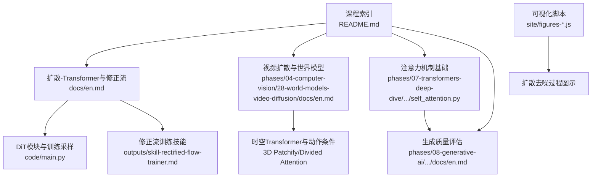
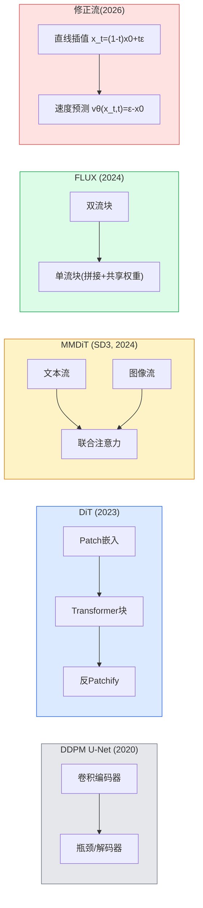
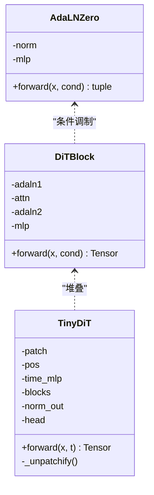
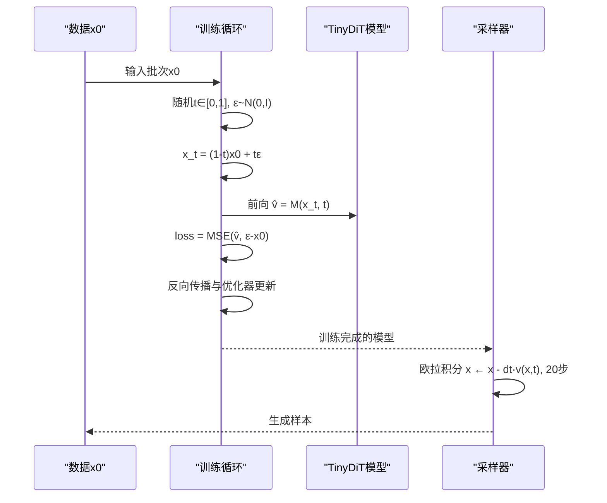
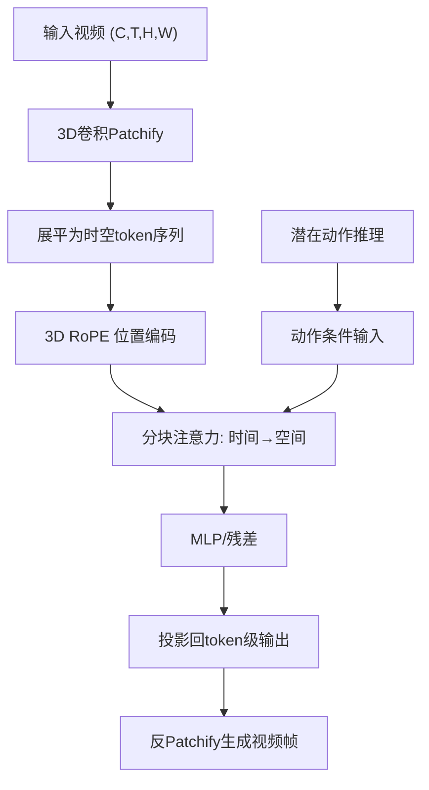
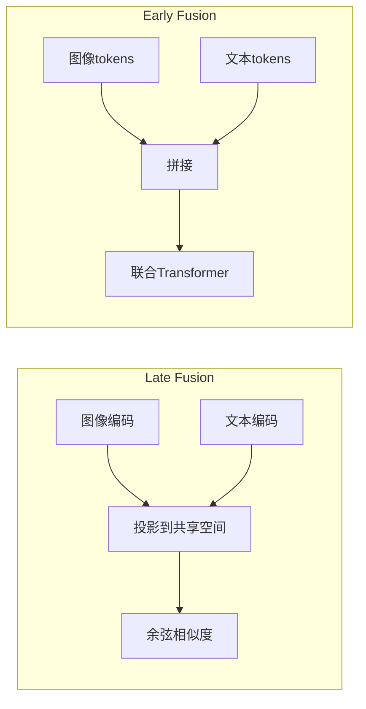
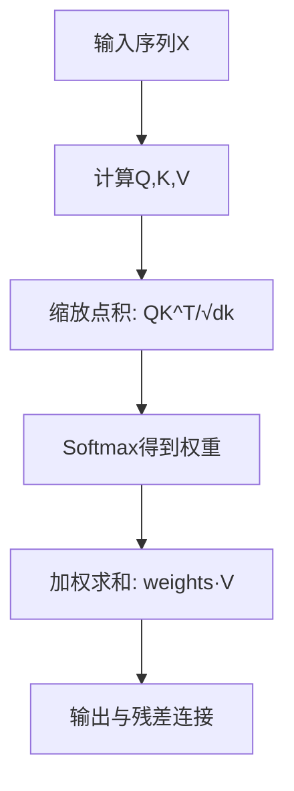
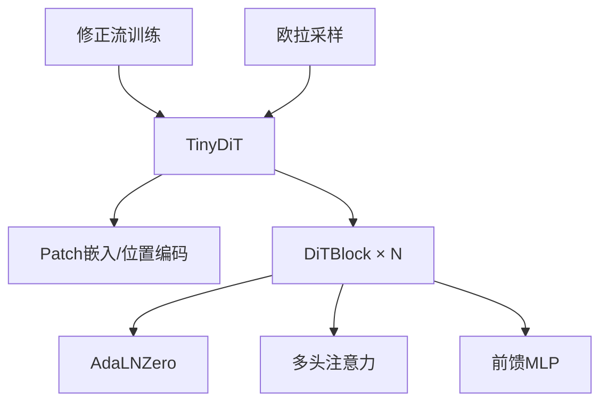

# 扩散模型与Transformer结合

<cite>
**本文引用的文件**
- [en.md](file://phases/04-computer-vision/23-diffusion-transformers-rectified-flow/docs/en.md)
- [main.py](file://phases/04-computer-vision/23-diffusion-transformers-rectified-flow/code/main.py)
- [skill-rectified-flow-trainer.md](file://phases/04-computer-vision/23-diffusion-transformers-rectified-flow/outputs/skill-rectified-flow-trainer.md)
- [en.md](file://phases/04-computer-vision/28-world-models-video-diffusion/docs/en.md)
- [self_attention.py](file://phases/07-transformers-deep-dive/02-self-attention-from-scratch/code/self_attention.py)
- [docs/en.md](file://phases/08-generative-ai/14-evaluation-fid-clip-score/docs/en.md)
- [site/figures-genai-rl.js](file://site/figures-genai-rl.js)
- [site/figures-llms-systems.js](file://site/figures-llms-systems.js)
- [site/figures-transformers.js](file://site/figures-transformers.js)
- [README.md](file://README.md)
</cite>

## 目录
1. [引言](#引言)
2. [项目结构](#项目结构)
3. [核心组件](#核心组件)
4. [架构总览](#架构总览)
5. [详细组件分析](#详细组件分析)
6. [依赖关系分析](#依赖关系分析)
7. [性能考量](#性能考量)
8. [故障排查指南](#故障排查指南)
9. [结论](#结论)
10. [附录](#附录)

## 引言
本课程围绕“扩散模型与Transformer结合”的前沿范式展开，系统讲解如何用Transformer替代传统U-Net作为扩散模型的去噪器，并以流模型（Rectified Flow）替代DDPM的噪声调度，从而实现更高效、可控且可扩展的图像/视频生成。文档覆盖从DiT基础模块、AdaLN条件归一化、双流/单一流架构，到视频时空Transformer、动作条件世界模型、注意力机制在生成中的作用与优化策略，以及生成质量评估与训练稳定性问题的解决方案。

## 项目结构
该仓库在计算机视觉与生成模型阶段提供了完整的学习与构建路径，其中与本主题直接相关的核心文件如下：
- 扩散-Transformer与修正流：docs/en.md、code/main.py、outputs/skill-rectified-flow-trainer.md
- 视频扩散与世界模型：phases/04-computer-vision/28-world-models-video-diffusion/docs/en.md
- 注意力机制基础：phases/07-transformers-deep-dive/02-self-attention-from-scratch/code/self_attention.py
- 生成质量评估：phases/08-generative-ai/14-evaluation-fid-clip-score/docs/en.md
- 可视化脚本：site/figures-genai-rl.js、site/figures-llms-systems.js、site/figures-transformers.js
- 课程索引：README.md

图表来源
- [en.md:1-351](file://phases/04-computer-vision/23-diffusion-transformers-rectified-flow/docs/en.md#L1-L351)
- [main.py:1-160](file://phases/04-computer-vision/23-diffusion-transformers-rectified-flow/code/main.py#L1-L160)
- [skill-rectified-flow-trainer.md:1-92](file://phases/04-computer-vision/23-diffusion-transformers-rectified-flow/outputs/skill-rectified-flow-trainer.md#L1-L92)
- [en.md:1-300](file://phases/04-computer-vision/28-world-models-video-diffusion/docs/en.md#L1-L300)
- [self_attention.py:1-147](file://phases/07-transformers-deep-dive/02-self-attention-from-scratch/code/self_attention.py#L1-L147)
- [docs/en.md:1-184](file://phases/08-generative-ai/14-evaluation-fid-clip-score/docs/en.md#L1-L184)
- [site/figures-genai-rl.js:41-59](file://site/figures-genai-rl.js#L41-L59)
- [site/figures-llms-systems.js:417-482](file://site/figures-llms-systems.js#L417-L482)
- [site/figures-transformers.js:358-380](file://site/figures-transformers.js#L358-L380)
- [README.md:350-379](file://README.md#L350-L379)

章节来源
- [README.md:350-379](file://README.md#L350-L379)

## 核心组件
- DiT基础模块与AdaLN条件归一化：实现轻量级Transformer去噪器，支持时间步/文本条件，采用零初始化的AdaLN保证训练稳定。
- 修正流训练与欧拉采样：以直线插值的流目标替代DDPM噪声目标，采样仅需20步即可达到高质量。
- 视频DiT与时空注意力：3D Patchify + 分块注意力（时间-空间交替），支持长视频与交互式世界模型。
- 多模态融合与条件生成：Late Fusion（CLIP风格）与Early Fusion（联合建模），适配文本-图像对齐与跨模态一致性。
- 生成质量评估：FID、CLIP Score、人类偏好评测三位一体，规避单一指标陷阱。

章节来源
- [en.md:123-170](file://phases/04-computer-vision/23-diffusion-transformers-rectified-flow/docs/en.md#L123-L170)
- [main.py:15-86](file://phases/04-computer-vision/23-diffusion-transformers-rectified-flow/code/main.py#L15-L86)
- [skill-rectified-flow-trainer.md:27-68](file://phases/04-computer-vision/23-diffusion-transformers-rectified-flow/outputs/skill-rectified-flow-trainer.md#L27-L68)
- [en.md:124-231](file://phases/04-computer-vision/28-world-models-video-diffusion/docs/en.md#L124-L231)
- [docs/en.md:20-80](file://phases/08-generative-ai/14-evaluation-fid-clip-score/docs/en.md#L20-L80)

## 架构总览
下图展示了从扩散到Transformer再到流模型的关键演进路径，以及DiT、MMDiT、FLUX等变体的结构差异与适用场景。

图表来源
- [en.md:27-54](file://phases/04-computer-vision/23-diffusion-transformers-rectified-flow/docs/en.md#L27-L54)
- [en.md:56-68](file://phases/04-computer-vision/23-diffusion-transformers-rectified-flow/docs/en.md#L56-L68)

## 详细组件分析

### DiT与AdaLN条件归一化
- AdaLNZero：通过零初始化的MLP预测(scale, shift, gate)，在LayerNorm之后施加条件调制，使模块初始为恒等映射，显著提升深层训练稳定性。
- DiTBlock：两层AdaLN + 自注意力 + MLP残差，形成标准的Transformer解码器式结构。
- TinyDiT：将输入图像Patch化并加入2D位置编码，经若干DiTBlock后反Patchify输出。

图表来源
- [main.py:15-47](file://phases/04-computer-vision/23-diffusion-transformers-rectified-flow/code/main.py#L15-L47)
- [main.py:50-85](file://phases/04-computer-vision/23-diffusion-transformers-rectified-flow/code/main.py#L50-L85)

章节来源
- [main.py:15-86](file://phases/04-computer-vision/23-diffusion-transformers-rectified-flow/code/main.py#L15-L86)
- [en.md:123-170](file://phases/04-computer-vision/23-diffusion-transformers-rectified-flow/docs/en.md#L123-L170)

### 修正流训练与采样
- 修正流目标：x_t = (1-t)x0 + tε，目标速度v = ε - x0，训练回归速度而非噪声。
- 训练步骤：随机采样t与ε，构造x_t，计算MSE损失并反传更新。
- 采样：欧拉法x ← x - dt·v(x,t)，20步近似DDPM 1000步质量。

图表来源
- [main.py:88-114](file://phases/04-computer-vision/23-diffusion-transformers-rectified-flow/code/main.py#L88-L114)
- [skill-rectified-flow-trainer.md:27-60](file://phases/04-computer-vision/23-diffusion-transformers-rectified-flow/outputs/skill-rectified-flow-trainer.md#L27-L60)

章节来源
- [main.py:88-114](file://phases/04-computer-vision/23-diffusion-transformers-rectified-flow/code/main.py#L88-L114)
- [skill-rectified-flow-trainer.md:27-68](file://phases/04-computer-vision/23-diffusion-transformers-rectified-flow/outputs/skill-rectified-flow-trainer.md#L27-L68)

### 视频时空Transformer与世界模型
- 3D Patchify：将(C, T, H, W)以卷积核步幅切分为时空token网格。
- 3D RoPE：沿t、h、w分别注入旋转位置编码，保持时序与空间结构。
- 分块注意力：先时间注意力（同一空间位置跨时间），再空间注意力（同一时刻跨空间），将复杂度从O(N^2)降至O(T^2 + HW^2)。
- 世界模型：以动作条件的潜在动作推理，驱动未来帧预测，形成“语言/视觉规划 → 视频模型模拟 → 逆动力学执行”的闭环。

图表来源
- [en.md:124-231](file://phases/04-computer-vision/28-world-models-video-diffusion/docs/en.md#L124-L231)

章节来源
- [en.md:52-101](file://phases/04-computer-vision/28-world-models-video-diffusion/docs/en.md#L52-L101)
- [en.md:124-231](file://phases/04-computer-vision/28-world-models-video-diffusion/docs/en.md#L124-L231)

### 多模态融合与条件生成
- Late Fusion（CLIP风格）：图像与文本分别编码，投影到统一空间后比较，适合文本-图像检索与对齐。
- Early Fusion（联合建模）：将图像与文本token拼接为单一序列，由Transformer联合建模，适合端到端对齐与生成。

图表来源
- [site/figures-llms-systems.js:417-482](file://site/figures-llms-systems.js#L417-L482)

章节来源
- [site/figures-llms-systems.js:417-482](file://site/figures-llms-systems.js#L417-L482)
- [en.md:79-85](file://phases/04-computer-vision/23-diffusion-transformers-rectified-flow/docs/en.md#L79-L85)

### 注意力机制在生成中的作用与优化
- 自注意力与多头注意力：通过缩放点积计算注意力权重，实现全局依赖建模；多头并行聚合不同子空间信息。
- 数值稳定性：softmax前减最大值避免溢出；合理初始化与归一化防止梯度爆炸。
- 生成过程中的注意力：在DiT中，注意力帮助跨token对齐语义；在视频DiT中，分块注意力平衡长序列复杂度与建模能力。

图表来源
- [self_attention.py:10-32](file://phases/07-transformers-deep-dive/02-self-attention-from-scratch/code/self_attention.py#L10-L32)

章节来源
- [self_attention.py:1-147](file://phases/07-transformers-deep-dive/02-self-attention-from-scratch/code/self_attention.py#L1-L147)
- [site/figures-transformers.js:358-380](file://site/figures-transformers.js#L358-L380)

## 依赖关系分析
- 模块内聚与耦合
  - DiTBlock内部通过AdaLN与注意力/MLP解耦，便于深度堆叠与稳定训练。
  - TinyDiT将Patch嵌入、位置编码、条件MLP与Transformer块组合，形成端到端的扩散去噪器。
- 外部依赖
  - 修正流训练依赖正态噪声与均匀时间采样；采样依赖欧拉积分。
  - 视频DiT依赖3D卷积与分块注意力，对显存与算力要求更高。
- 可能的环依赖
  - 当前文件间无循环导入；训练/采样与模型定义分离清晰。

图表来源
- [main.py:50-85](file://phases/04-computer-vision/23-diffusion-transformers-rectified-flow/code/main.py#L50-L85)
- [main.py:88-114](file://phases/04-computer-vision/23-diffusion-transformers-rectified-flow/code/main.py#L88-L114)

章节来源
- [main.py:50-114](file://phases/04-computer-vision/23-diffusion-transformers-rectified-flow/code/main.py#L50-L114)

## 性能考量
- 计算复杂度
  - 图像DiT：注意力O(N^2)，N为patch数量；通过深度堆叠与高效实现可扩展至高分辨率。
  - 视频DiT：分块注意力将复杂度分解为时间与空间两部分，适合长视频序列。
- 内存与吞吐
  - 修正流采样仅需20步，显著降低推理延迟；批处理与bf16混合精度可进一步提速。
- 训练稳定性
  - AdaLNZero零初始化与条件门控抑制梯度爆炸；梯度裁剪与学习率调度保障收敛。
- 评估开销
  - FID与CLIP Score需大规模推理与特征提取，建议离线缓存真实特征并批量化评估。

## 故障排查指南
- 训练不稳定
  - 检查AdaLNZero初始化是否正确；确认条件调制尺度与偏置未被错误累加。
  - 使用梯度裁剪与合适的优化器（AdamW + 余弦退火）。
- 采样质量差
  - 确认修正流速度目标与DDPM噪声目标未混用；检查t分布与数据归一化。
  - 提升采样步数或引入CFG（分类器自由指导）。
- 视频模型内存不足
  - 采用分块注意力或窗口注意力；降低时空patch尺寸与序列长度。
- 评估指标异常
  - FID需足够样本（≥10k）；CLIP Score受提示词影响，应避免过度提示；人类偏好需盲测与多样化提示池。

章节来源
- [skill-rectified-flow-trainer.md:86-92](file://phases/04-computer-vision/23-diffusion-transformers-rectified-flow/outputs/skill-rectified-flow-trainer.md#L86-L92)
- [docs/en.md:121-174](file://phases/08-generative-ai/14-evaluation-fid-clip-score/docs/en.md#L121-L174)

## 结论
通过将Transformer引入扩散模型并采用修正流，2026年的主流文本到图像/视频生成模型实现了更快的推理速度、更强的可控性与更好的可扩展性。DiT、MMDiT与FLUX代表了从U-Net到Transformer的关键跃迁；视频DiT与世界模型进一步拓展到时空建模与交互仿真。配合稳健的训练策略、注意力机制优化与多维评估体系，可构建高质量、可落地的生成系统。

## 附录
- 实现要点速查
  - DiT：Patch嵌入 + AdaLN条件 + 多头注意力 + MLP残差
  - 修正流：速度目标v = ε - x0，欧拉采样20步
  - 视频DiT：3D Patchify + 3D RoPE + 分块注意力
  - 评估：FID、CLIP Score、人类偏好三支柱
- 参考资料
  - DiT论文、SD3论文、FLUX技术报告、Sora技术报告、TimeSformer、DreamerV3等