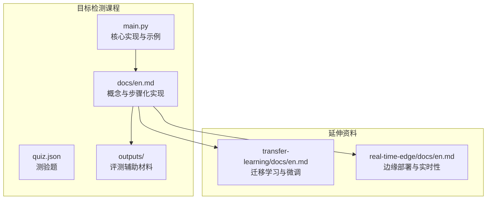
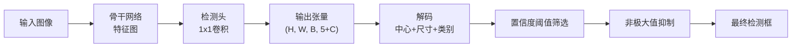
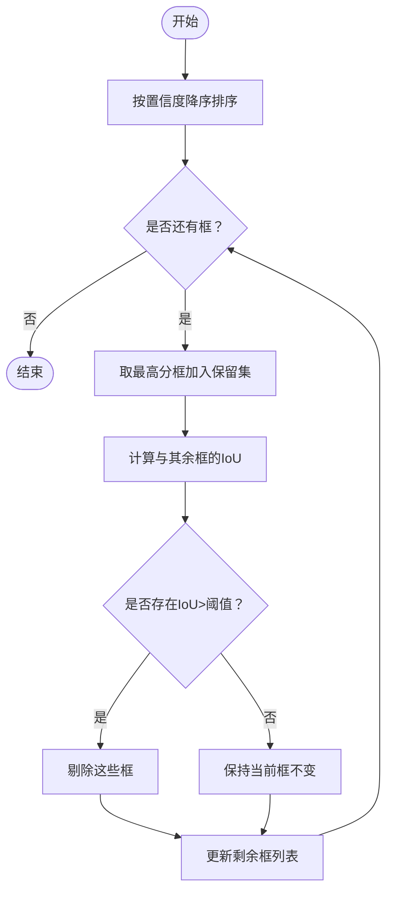
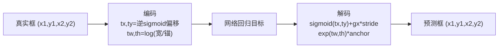
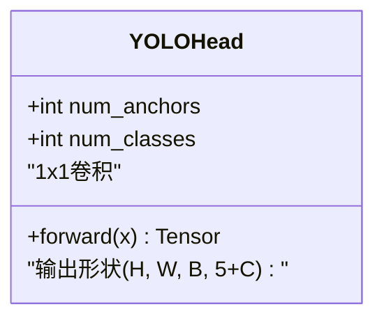
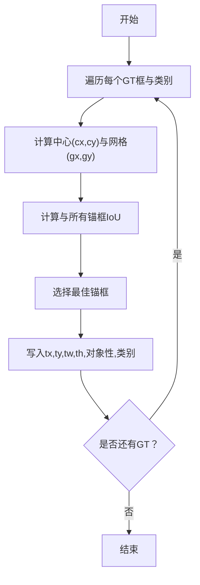
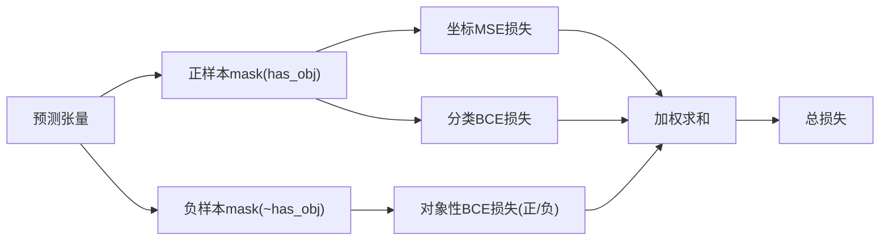
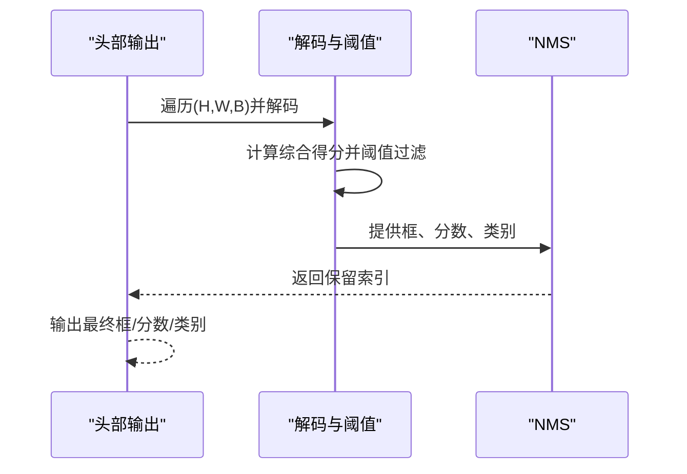
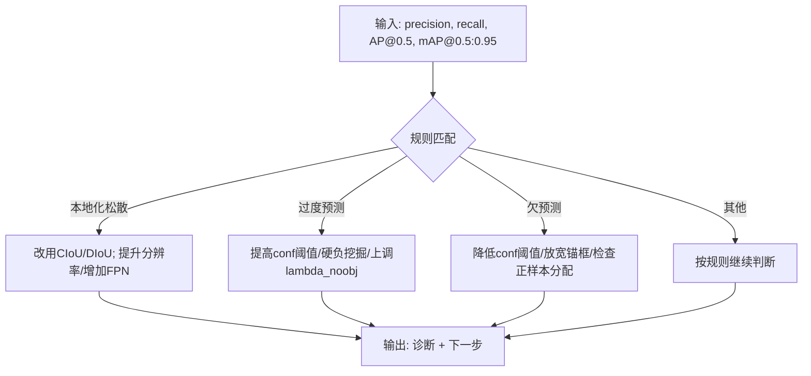
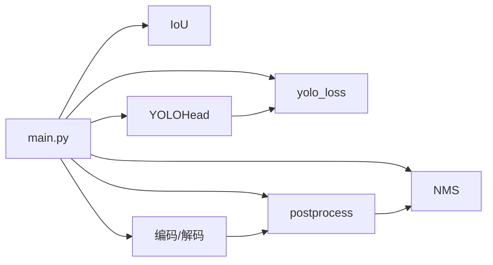

# 目标检测

<cite>
**本文引用的文件**
- [phases/04-computer-vision/06-object-detection-yolo/code/main.py](file://phases/04-computer-vision/06-object-detection-yolo/code/main.py)
- [phases/04-computer-vision/06-object-detection-yolo/docs/en.md](file://phases/04-computer-vision/06-object-detection-yolo/docs/en.md)
- [phases/04-computer-vision/06-object-detection-yolo/quiz.json](file://phases/04-computer-vision/06-object-detection-yolo/quiz.json)
- [phases/04-computer-vision/06-object-detection-yolo/outputs/prompt-detection-metric-reader.md](file://phases/04-computer-vision/06-object-detection-yolo/outputs/prompt-detection-metric-reader.md)
- [phases/04-computer-vision/06-object-detection-yolo/outputs/skill-anchor-designer.md](file://phases/04-computer-vision/06-object-detection-yolo/outputs/skill-anchor-designer.md)
- [phases/04-computer-vision/06-object-detection-yolo/outputs/skill-anchor-designer.zh.md](file://phases/04-computer-vision/06-object-detection-yolo/outputs/skill-anchor-designer.zh.md)
- [phases/04-computer-vision/05-transfer-learning/docs/en.md](file://phases/04-computer-vision/05-transfer-learning/docs/en.md)
- [phases/04-computer-vision/15-real-time-edge/docs/en.md](file://phases/04-computer-vision/15-real-time-edge/docs/en.md)
</cite>

## 目录
1. [引言](#引言)
2. [项目结构](#项目结构)
3. [核心组件](#核心组件)
4. [架构总览](#架构总览)
5. [详细组件分析](#详细组件分析)
6. [依赖关系分析](#依赖关系分析)
7. [性能考虑](#性能考虑)
8. [故障排查指南](#故障排查指南)
9. [结论](#结论)
10. [附录](#附录)

## 引言
本课程围绕“目标检测”展开，系统讲解任务定义、数据标注格式、评估指标（如 mAP、IoU 等）的计算方法，并深入剖析 YOLO 系列算法的发展脉络与关键设计思想。课程以“YOLO 从零实现”为主线，涵盖网格划分、边界框回归、置信度预测、非极大值抑制（NMS）、多尺度检测、以及面向实时部署的精度-速度权衡策略。同时提供可直接运行的训练与推理示例路径，帮助学习者在实践中掌握端到端检测管线。

## 项目结构
目标检测课程位于计算机视觉阶段（Phase 4）第 6 讲，配套有：
- 可执行代码：YOLO 核心函数与最小头实现、损失与后处理
- 教学文档：概念讲解、步骤化构建指南、术语表与参考文献
- 评测辅助材料：检测指标解读提示词、锚框设计技能
- 测验：关于网格、锚框、NMS、mAP 的要点问答
- 延伸资料：迁移学习与边缘部署相关内容，便于理解检测系统的上下文

图示来源
- [phases/04-computer-vision/06-object-detection-yolo/code/main.py:1-251](file://phases/04-computer-vision/06-object-detection-yolo/code/main.py#L1-L251)
- [phases/04-computer-vision/06-object-detection-yolo/docs/en.md:1-406](file://phases/04-computer-vision/06-object-detection-yolo/docs/en.md#L1-L406)
- [phases/04-computer-vision/05-transfer-learning/docs/en.md:1-331](file://phases/04-computer-vision/05-transfer-learning/docs/en.md#L1-L331)
- [phases/04-computer-vision/15-real-time-edge/docs/en.md:1-275](file://phases/04-computer-vision/15-real-time-edge/docs/en.md#L1-L275)

章节来源
- [phases/04-computer-vision/06-object-detection-yolo/docs/en.md:1-406](file://phases/04-computer-vision/06-object-detection-yolo/docs/en.md#L1-L406)

## 核心组件
- IoU 与 NMS：用于两两框相似度度量与去重，是检测后处理的关键。
- 编码/解码：将像素坐标转换为网络回归目标（tx, ty, tw, th），再由解码还原为框坐标。
- YOLO 头部：单层 1×1 卷积输出张量，形状为 (N, H, W, B, 5+C)，包含每个网格每个锚框的回归与分类信息。
- 目标分配：基于 GT 中心落入网格与最佳锚框 IoU，确定负责该 GT 的网格-锚组合。
- 损失函数：三段式加权损失（坐标、正样本对象性、负样本对象性、分类）。
- 推理管线：头部前向 -> 解码 -> 阈值筛选 -> NMS -> 最终框集合。

章节来源
- [phases/04-computer-vision/06-object-detection-yolo/code/main.py:11-251](file://phases/04-computer-vision/06-object-detection-yolo/code/main.py#L11-L251)
- [phases/04-computer-vision/06-object-detection-yolo/docs/en.md:140-353](file://phases/04-computer-vision/06-object-detection-yolo/docs/en.md#L140-L353)

## 架构总览
下图展示从输入图像到最终检测框的完整流程，强调“网格+锚框”的密集预测范式与后处理环节。

图示来源
- [phases/04-computer-vision/06-object-detection-yolo/docs/en.md:27-45](file://phases/04-computer-vision/06-object-detection-yolo/docs/en.md#L27-L45)

## 详细组件分析

### 组件一：IoU 与 NMS
- IoU 实现支持成对矩阵计算，返回 (N×M) 的相似度矩阵；常用于匹配 GT 与先验框、或作为 NMS 的重叠度量。
- NMS 实现按置信度降序挑选，移除与已选框 IoU 超过阈值的候选框；典型阈值 0.45。

图示来源
- [phases/04-computer-vision/06-object-detection-yolo/code/main.py:11-41](file://phases/04-computer-vision/06-object-detection-yolo/code/main.py#L11-L41)

章节来源
- [phases/04-computer-vision/06-object-detection-yolo/code/main.py:11-41](file://phases/04-computer-vision/06-object-detection-yolo/code/main.py#L11-L41)
- [phases/04-computer-vision/06-object-detection-yolo/docs/en.md:86-111](file://phases/04-computer-vision/06-object-detection-yolo/docs/en.md#L86-L111)

### 组件二：编码与解码（tx, ty, tw, th）
- 编码：将 (x1, y1, x2, y2) 映射到 (tx, ty, tw, th)，其中 tx/ty 经 logit（sigmoid 反函数）以保证中心偏移稳定在单元内；tw/th 使用 log 以约束尺度为正值。
- 解码：先对 tx/ty 做 sigmoid，再加网格坐标并乘以步长 stride，得到中心像素坐标；对 tw/th 做 exp 并乘以锚框宽高，得到最终框尺寸。

图示来源
- [phases/04-computer-vision/06-object-detection-yolo/code/main.py:44-66](file://phases/04-computer-vision/06-object-detection-yolo/code/main.py#L44-L66)
- [phases/04-computer-vision/06-object-detection-yolo/docs/en.md:73-84](file://phases/04-computer-vision/06-object-detection-yolo/docs/en.md#L73-L84)

章节来源
- [phases/04-computer-vision/06-object-detection-yolo/code/main.py:44-66](file://phases/04-computer-vision/06-object-detection-yolo/code/main.py#L44-L66)
- [phases/04-computer-vision/06-object-detection-yolo/docs/en.md:73-84](file://phases/04-computer-vision/06-object-detection-yolo/docs/en.md#L73-L84)

### 组件三：YOLO 头部（YOLOHead）
- 结构：单层 1×1 卷积，将通道数映射为 (B, 5+C)，随后 reshape 并 permute 成 (H, W, B, 5+C)。
- 输出含义：每格每锚包含 [tx, ty, tw, th, 对象性, C个类logits]。

图示来源
- [phases/04-computer-vision/06-object-detection-yolo/code/main.py:69-82](file://phases/04-computer-vision/06-object-detection-yolo/code/main.py#L69-L82)

章节来源
- [phases/04-computer-vision/06-object-detection-yolo/code/main.py:69-82](file://phases/04-computer-vision/06-object-detection-yolo/code/main.py#L69-L82)
- [phases/04-computer-vision/06-object-detection-yolo/docs/en.md:220-244](file://phases/04-computer-vision/06-object-detection-yolo/docs/en.md#L220-L244)

### 组件四：目标分配（assign_targets）
- 步骤：遍历每个 GT，计算其中心落入的网格 (gx, gy)，并计算与各锚框的 IoU，选取最佳锚框；将 tx/ty/tw/th、对象性与类别标签写入对应位置，标记 has_obj。
- 影响：决定哪些网格-锚对需要回归 GT，哪些仅参与负样本对象性损失。

图示来源
- [phases/04-computer-vision/06-object-detection-yolo/code/main.py:84-118](file://phases/04-computer-vision/06-object-detection-yolo/code/main.py#L84-L118)

章节来源
- [phases/04-computer-vision/06-object-detection-yolo/code/main.py:84-118](file://phases/04-computer-vision/06-object-detection-yolo/code/main.py#L84-L118)
- [phases/04-computer-vision/06-object-detection-yolo/docs/en.md:245-278](file://phases/04-computer-vision/06-object-detection-yolo/docs/en.md#L245-L278)

### 组件五：损失函数（yolo_loss）
- 三段式损失加权求和：坐标损失（仅正样本）、正样本对象性损失、负样本对象性损失、分类损失（仅正样本）。
- 超参：lambda_coord、lambda_obj、lambda_noobj、lambda_cls；默认比例反映“空格主导”与“回归损失相对较小”的现实。

图示来源
- [phases/04-computer-vision/06-object-detection-yolo/code/main.py:121-152](file://phases/04-computer-vision/06-object-detection-yolo/code/main.py#L121-L152)

章节来源
- [phases/04-computer-vision/06-object-detection-yolo/code/main.py:121-152](file://phases/04-computer-vision/06-object-detection-yolo/code/main.py#L121-L152)
- [phases/04-computer-vision/06-object-detection-yolo/docs/en.md:112-126](file://phases/04-computer-vision/06-object-detection-yolo/docs/en.md#L112-L126)

### 组件六：推理后处理（postprocess）
- 将头部输出按网格扫描，对每个锚框做解码、类别概率归一化、综合得分（对象性×最大类别概率）阈值过滤。
- 应用 NMS 去重，返回最终框、分数与类别。

图示来源
- [phases/04-computer-vision/06-object-detection-yolo/code/main.py:155-186](file://phases/04-computer-vision/06-object-detection-yolo/code/main.py#L155-L186)

章节来源
- [phases/04-computer-vision/06-object-detection-yolo/code/main.py:155-186](file://phases/04-computer-vision/06-object-detection-yolo/code/main.py#L155-L186)
- [phases/04-computer-vision/06-object-detection-yolo/docs/en.md:316-353](file://phases/04-computer-vision/06-object-detection-yolo/docs/en.md#L316-L353)

### 组件七：评估指标与诊断
- 关键指标：Precision@0.5、Recall@0.5、AP@0.5、mAP@0.5:0.95（COCO 标准）。
- 诊断提示词：根据给定指标行，给出“诊断一句话 + 下一步实验”，覆盖本地化松散、过度预测、欠预测、类别不平衡、类别混淆等场景。

图示来源
- [phases/04-computer-vision/06-object-detection-yolo/outputs/prompt-detection-metric-reader.md:18-57](file://phases/04-computer-vision/06-object-detection-yolo/outputs/prompt-detection-metric-reader.md#L18-L57)

章节来源
- [phases/04-computer-vision/06-object-detection-yolo/docs/en.md:127-137](file://phases/04-computer-vision/06-object-detection-yolo/docs/en.md#L127-L137)
- [phases/04-computer-vision/06-object-detection-yolo/outputs/prompt-detection-metric-reader.md:1-58](file://phases/04-computer-vision/06-object-detection-yolo/outputs/prompt-detection-metric-reader.md#L1-L58)

### 组件八：锚框设计（Anchor Designer）
- 给定数据集中 GT 框，对 (w, h) 运行聚类，输出每级 FPN 的锚框集合及覆盖率统计，指导锚框数量与尺度选择。

章节来源
- [phases/04-computer-vision/06-object-detection-yolo/outputs/skill-anchor-designer.md](file://phases/04-computer-vision/06-object-detection-yolo/outputs/skill-anchor-designer.md)
- [phases/04-computer-vision/06-object-detection-yolo/outputs/skill-anchor-designer.zh.md](file://phases/04-computer-vision/06-object-detection-yolo/outputs/skill-anchor-designer.zh.md)

### 组件九：YOLO 系列发展与 YOLOv1 至最新版本演进
- YOLOv1：首次提出“一次性检测”，将检测视为密集预测问题，奠定网格+锚框+回归+置信度的基础。
- YOLOv2/YOLOv3：引入锚框聚类、多尺度训练、FPN 风格特征金字塔，提升小目标与多尺度鲁棒性。
- YOLOv4/YOLOv5：引入更多训练技巧（Mosaic、MixUp、Cosine LR 等）与网络模块优化。
- YOLOv8/YOLOv9：进一步融合工程化细节（如更稳定的损失、更好的数据增强、推理优化）。
- YOLO-NAS、RT-DETR 等：在结构上探索 NAS 自搜索与基于 DETR 的无锚方案，但核心仍围绕“网格+回归+置信度+NMS”。

章节来源
- [phases/04-computer-vision/06-object-detection-yolo/docs/en.md:23-24](file://phases/04-computer-vision/06-object-detection-yolo/docs/en.md#L23-L24)
- [phases/04-computer-vision/06-object-detection-yolo/docs/en.md:402-406](file://phases/04-computer-vision/06-object-detection-yolo/docs/en.md#L402-L406)

### 组件十：多尺度检测与训练
- 多尺度训练：在不同输入尺寸之间切换，提升模型对尺度变化的鲁棒性。
- 多尺度推理：对同一图像在多个尺度上推理，合并预测并统一 NMS，通常能提升 mAP。
- FPN：在浅层使用小锚框捕获细节，在深层使用大锚框捕获全局语义。

章节来源
- [phases/04-computer-vision/06-object-detection-yolo/docs/en.md:71-72](file://phases/04-computer-vision/06-object-detection-yolo/docs/en.md#L71-L72)
- [phases/04-computer-vision/06-object-detection-yolo/docs/en.md:384-385](file://phases/04-computer-vision/06-object-detection-yolo/docs/en.md#L384-L385)

### 组件十一：实时检测与精度-速度权衡
- 边缘部署关注三预算：延迟（p50/p95/p99）、峰值内存、功耗（以毫焦计）。测量需预热、同步、固定输入尺寸。
- 量化（PTQ/QAT）、导出 ONNX、选择合适运行时（ORT/TensorRT/CoreML/TFLite）是主流路径。
- 架构选择：参数量与算力预算决定模型规模，结合 INT8 量化与硬件友好算子可显著提速。

章节来源
- [phases/04-computer-vision/15-real-time-edge/docs/en.md:27-49](file://phases/04-computer-vision/15-real-time-edge/docs/en.md#L27-L49)
- [phases/04-computer-vision/15-real-time-edge/docs/en.md:109-104](file://phases/04-computer-vision/15-real-time-edge/docs/en.md#L109-L104)
- [phases/04-computer-vision/15-real-time-edge/docs/en.md:233-242](file://phases/04-computer-vision/15-real-time-edge/docs/en.md#L233-L242)

## 依赖关系分析
- 内部依赖：main.py 中的 IoU/NMS/编码/解码/头部/损失/后处理构成闭环；目标分配与损失共同驱动头部回归。
- 外部依赖：推理阶段可复用 torchvision 或 ultralytics（YOLOv8/v9）内部完成解码与 NMS。
- 上下文依赖：迁移学习为检测提供强初始化特征；边缘部署为检测系统落地提供性能保障。

图示来源
- [phases/04-computer-vision/06-object-detection-yolo/code/main.py:11-251](file://phases/04-computer-vision/06-object-detection-yolo/code/main.py#L11-L251)

章节来源
- [phases/04-computer-vision/06-object-detection-yolo/code/main.py:11-251](file://phases/04-computer-vision/06-object-detection-yolo/code/main.py#L11-L251)

## 性能考虑
- 训练阶段
  - 合理设置 lambda_noobj 以避免空格主导损失；lambda_coord 使坐标回归梯度与分类相近。
  - 使用 CIoU/DIoU 替代 MSE 可提升定位精度，尤其在严格 IoU 下。
  - 多尺度训练与数据增强（如 Mosaic、MixUp）有助于提升泛化。
- 推理阶段
  - 固定输入尺寸、预热、同步 GPU，统计 p50/p95/p99 延迟。
  - INT8 量化（PTQ）通常带来 2-4×加速且精度损失可控。
  - ONNX 导出 + ORT/TensorRT 在 CPU/GPU 上获得一致的跨平台性能。
- 工程实践
  - 先用迁移学习快速上线，再逐步放开冻结层与增大 LR。
  - 针对小样本或类别不平衡，采用分阶段解冻、类别平衡采样与困难负样本挖掘。

## 故障排查指南
- 常见问题与对策
  - NMS 结果异常：确认阈值设置、IoU 计算正确、后处理中置信度阈值是否过高。
  - 定位不准：检查锚框是否与数据分布匹配；考虑 CIoU/DIoU、更高分辨率输入或 FPN。
  - 过度预测：提高置信度阈值、硬负挖掘、上调 lambda_noobj。
  - 欠预测：降低置信度阈值、放宽锚框、检查 GT 中心落入网格的分配逻辑。
  - 类别不平衡：对少数类进行上采样、类别平衡采样、核查标注质量。
  - 指标不一致：区分 AP@0.5 与 mAP@0.5:0.95 的差异，前者宽松后者严格，差距大说明本地化不足。
- 边缘部署问题
  - 延迟异常：确保预热与同步；固定输入尺寸；对比不同运行时。
  - 准确率下降：优先尝试 PTQ；必要时采用蒸馏或 QAT。

章节来源
- [phases/04-computer-vision/06-object-detection-yolo/quiz.json:1-40](file://phases/04-computer-vision/06-object-detection-yolo/quiz.json#L1-L40)
- [phases/04-computer-vision/06-object-detection-yolo/outputs/prompt-detection-metric-reader.md:18-57](file://phases/04-computer-vision/06-object-detection-yolo/outputs/prompt-detection-metric-reader.md#L18-L57)
- [phases/04-computer-vision/15-real-time-edge/docs/en.md:109-144](file://phases/04-computer-vision/15-real-time-edge/docs/en.md#L109-L144)

## 结论
本课程通过“从零实现 YOLO”的方式，系统串联了检测任务的核心组成：网格与锚框、边界框回归、对象性与分类、IoU 与 NMS、损失设计与推理后处理。在此基础上，课程进一步拓展到指标解读、锚框设计、多尺度与实时部署，形成一套可迁移的工程化方法论。建议学习者在掌握理论与实现后，结合迁移学习与边缘部署知识，完成从训练到生产的闭环。

## 附录
- 训练与推理示例路径
  - 训练：参考 yolo_loss 与 assign_targets 的组合使用，配合数据加载与优化器调度。
  - 推理：参考 postprocess 的完整流程，或使用 ultralytics 的 YOLO 模型直接推理。
- 参考资源
  - YOLOv1、YOLOv3 论文与 Ultralytics 文档
  - 检测指标解读提示词与锚框设计技能

章节来源
- [phases/04-computer-vision/06-object-detection-yolo/docs/en.md:354-373](file://phases/04-computer-vision/06-object-detection-yolo/docs/en.md#L354-L373)
- [phases/04-computer-vision/06-object-detection-yolo/docs/en.md:400-406](file://phases/04-computer-vision/06-object-detection-yolo/docs/en.md#L400-L406)
- [phases/04-computer-vision/05-transfer-learning/docs/en.md:282-298](file://phases/04-computer-vision/05-transfer-learning/docs/en.md#L282-L298)
- [phases/04-computer-vision/15-real-time-edge/docs/en.md:233-242](file://phases/04-computer-vision/15-real-time-edge/docs/en.md#L233-L242)