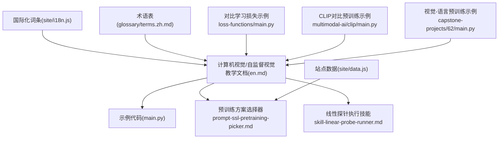
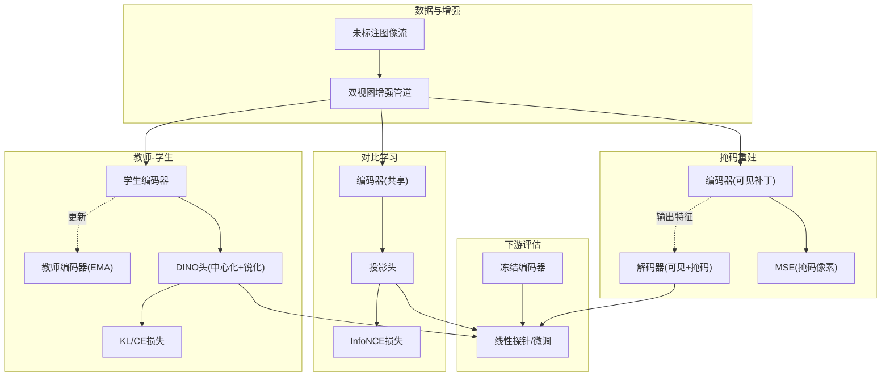
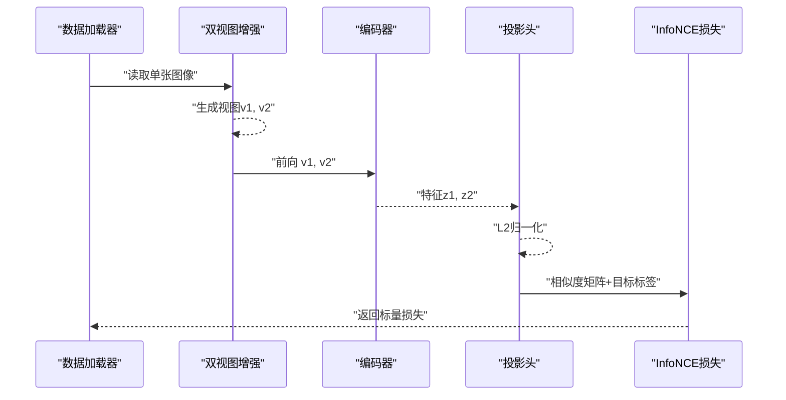
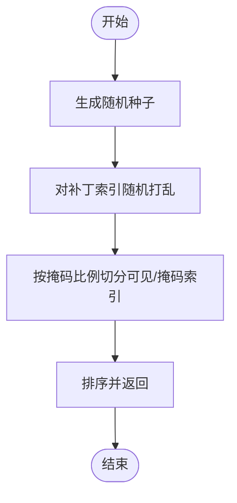
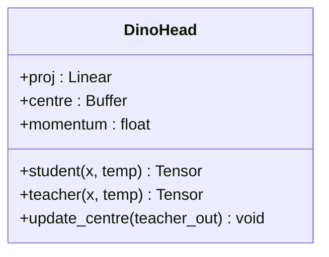
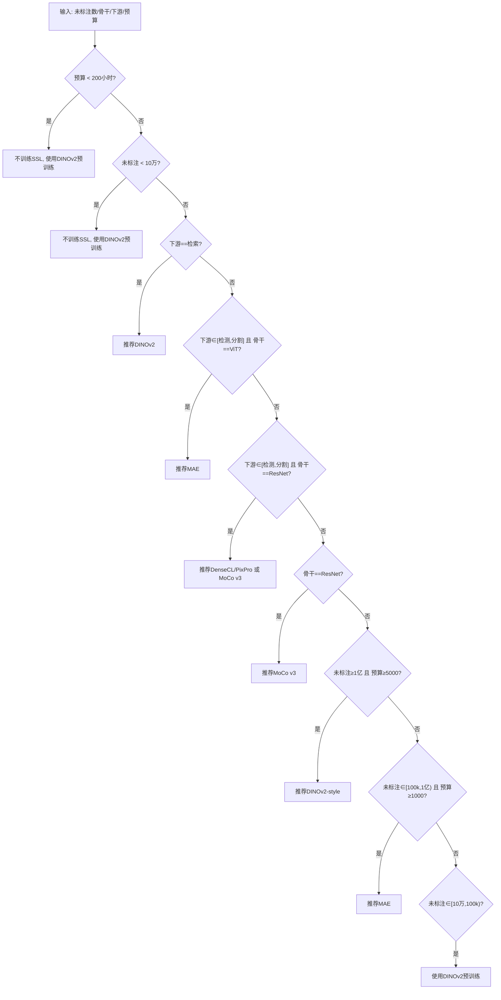
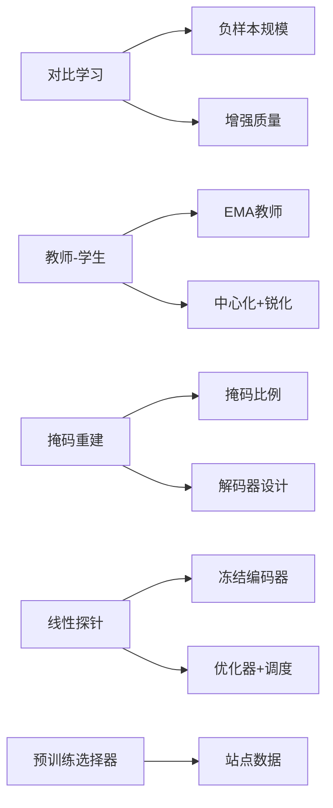

# 自监督视觉

<cite>
**本文引用的文件**
- [phases/04-computer-vision/17-self-supervised-vision/docs/en.md](file://phases/04-computer-vision/17-self-supervised-vision/docs/en.md)
- [phases/04-computer-vision/17-self-supervised-vision/code/main.py](file://phases/04-computer-vision/17-self-supervised-vision/code/main.py)
- [phases/04-computer-vision/17-self-supervised-vision/outputs/prompt-ssl-pretraining-picker.md](file://phases/04-computer-vision/17-self-supervised-vision/outputs/prompt-ssl-pretraining-picker.md)
- [phases/04-computer-vision/17-self-supervised-vision/outputs/skill-linear-probe-runner.md](file://phases/04-computer-vision/17-self-supervised-vision/outputs/skill-linear-probe-runner.md)
- [site/data.js](file://site/data.js)
- [site/i18n.js](file://site/i18n.js)
- [glossary/terms.zh.md](file://glossary/terms.zh.md)
- [phases/03-deep-learning-core/05-loss-functions/code/main.py](file://phases/03-deep-learning-core/05-loss-functions/code/main.py)
- [phases/12-multimodal-ai/02-clip-contrastive-pretraining/code/main.py](file://phases/12-multimodal-ai/02-clip-contrastive-pretraining/code/main.py)
- [phases/19-capstone-projects/62-vision-language-pretraining/code/main.py](file://phases/19-capstone-projects/62-vision-language-pretraining/code/main.py)
</cite>

## 目录
1. [引言](#引言)
2. [项目结构](#项目结构)
3. [核心组件](#核心组件)
4. [架构总览](#架构总览)
5. [详细组件分析](#详细组件分析)
6. [依赖分析](#依赖分析)
7. [性能考虑](#性能考虑)
8. [故障排查指南](#故障排查指南)
9. [结论](#结论)
10. [附录](#附录)

## 引言
本文件围绕自监督视觉（Self-supervised Vision）构建系统化知识与实践指南，面向希望掌握对比学习、生成式重建与教师-学生蒸馏三大范式的工程师与研究者。文档以“理论—实现—评估—部署”为主线，结合仓库中的教学材料与示例脚本，给出可复现的预训练流程、下游任务微调策略与性能评估方法，并强调在数据稀缺场景下自监督学习的价值。

## 项目结构
本主题位于“计算机视觉”阶段的第17课，配套有：
- 教学文档：系统阐述三大家族方法、代表性算法与工程要点
- 示例代码：InfoNCE损失、MAE掩码采样、DINO中心化与锐化头
- 工具与提示词：预训练方案选择器、线性探针执行技能
- 术语与国际化词条：统一概念口径，便于跨语言学习



图示来源
- [phases/04-computer-vision/17-self-supervised-vision/docs/en.md:1-253](file://phases/04-computer-vision/17-self-supervised-vision/docs/en.md#L1-L253)
- [phases/04-computer-vision/17-self-supervised-vision/code/main.py:1-77](file://phases/04-computer-vision/17-self-supervised-vision/code/main.py#L1-L77)
- [phases/04-computer-vision/17-self-supervised-vision/outputs/prompt-ssl-pretraining-picker.md:1-64](file://phases/04-computer-vision/17-self-supervised-vision/outputs/prompt-ssl-pretraining-picker.md#L1-L64)
- [phases/04-computer-vision/17-self-supervised-vision/outputs/skill-linear-probe-runner.md:1-105](file://phases/04-computer-vision/17-self-supervised-vision/outputs/skill-linear-probe-runner.md#L1-L105)
- [site/data.js:7406-7443](file://site/data.js#L7406-L7443)
- [site/i18n.js:454-467](file://site/i18n.js#L454-L467)
- [glossary/terms.zh.md:76-100](file://glossary/terms.zh.md#L76-L100)
- [phases/03-deep-learning-core/05-loss-functions/code/main.py:85-120](file://phases/03-deep-learning-core/05-loss-functions/code/main.py#L85-L120)
- [phases/12-multimodal-ai/02-clip-contrastive-pretraining/code/main.py:1-20](file://phases/12-multimodal-ai/02-clip-contrastive-pretraining/code/main.py#L1-L20)
- [phases/19-capstone-projects/62-vision-language-pretraining/code/main.py:1-20](file://phases/19-capstone-projects/62-vision-language-pretraining/code/main.py#L1-L20)

章节来源
- [phases/04-computer-vision/17-self-supervised-vision/docs/en.md:1-253](file://phases/04-computer-vision/17-self-supervised-vision/docs/en.md#L1-L253)
- [site/data.js:7406-7443](file://site/data.js#L7406-L7443)

## 核心组件
- 三大家族方法
  - 对比学习（SimCLR、MoCo、CLIP）：通过对比正负样本对，使同一图像的不同增强视图在嵌入空间中彼此靠近，而与其他样本彼此远离。典型损失为InfoNCE，需要较大的负样本规模（批量）。
  - 教师-学生（DINO、BYOL、iBOT）：学生网络预测教师网络的输出；教师通过指数滑动平均（EMA）更新。为避免输出退化，采用“中心化+锐化”的技巧。
  - 掩码重建（MAE、BEiT、SimMIM）：对ViT输入的补丁进行高比例掩码（如75%），仅可见补丁进入编码器，小解码器在可见特征上重构被掩码区域像素，损失仅作用于掩码区域。
- 代表性算法与实现要点
  - InfoNCE损失：在L2归一化嵌入上计算余弦相似度，构造正负样本矩阵并使用交叉熵；温度参数控制分布锐利程度。
  - MAE掩码采样：按固定比例随机打乱补丁索引，返回可见与掩码索引集合；保证可重复性与批处理友好。
  - DINO头：线性投影后进行中心化与锐化，教师输出经softmax归一且在反向传播中detach，同时维护中心缓冲并以指数滑动平均更新。
- 下游评估与微调
  - 线性探针：冻结编码器，仅训练顶层线性分类器；标准做法，用于评估特征质量。
  - 零样本检索：使用预训练编码器（如DINOv2）提取图像嵌入，进行相似度检索与下游任务迁移。

章节来源
- [phases/04-computer-vision/17-self-supervised-vision/docs/en.md:27-106](file://phases/04-computer-vision/17-self-supervised-vision/docs/en.md#L27-L106)
- [phases/04-computer-vision/17-self-supervised-vision/code/main.py:5-46](file://phases/04-computer-vision/17-self-supervised-vision/code/main.py#L5-L46)
- [phases/04-computer-vision/17-self-supervised-vision/outputs/skill-linear-probe-runner.md:10-105](file://phases/04-computer-vision/17-self-supervised-vision/outputs/skill-linear-probe-runner.md#L10-L105)

## 架构总览
下图展示自监督视觉的三种范式在“数据—表示—评估”上的共同目标与差异：



图示来源
- [phases/04-computer-vision/17-self-supervised-vision/docs/en.md:40-106](file://phases/04-computer-vision/17-self-supervised-vision/docs/en.md#L40-L106)
- [phases/04-computer-vision/17-self-supervised-vision/code/main.py:5-46](file://phases/04-computer-vision/17-self-supervised-vision/code/main.py#L5-L46)

## 详细组件分析

### 组件A：InfoNCE损失与双视图增强
- 设计思想
  - 双视图增强：同一图像经随机裁剪、翻转、颜色扰动等得到两视图，分别送入共享编码器与投影头，形成正样本对。
  - InfoNCE：在批次内将正样本对与其他样本视为负样本，通过softmax归一化，最大化正样本对的相对概率。
  - 温度参数：控制分布锐利程度；温度越低，正负区分越明显，但需要更大负样本规模。
- 实现要点
  - 嵌入L2归一化后再计算相似度矩阵，避免内积尺度影响。
  - 使用对角掩码排除自身配对，确保正样本唯一性。
  - 通过目标排列构造标签，使用交叉熵计算损失。
- 典型流程序列图



图示来源
- [phases/04-computer-vision/17-self-supervised-vision/docs/en.md:110-177](file://phases/04-computer-vision/17-self-supervised-vision/docs/en.md#L110-L177)
- [phases/04-computer-vision/17-self-supervised-vision/code/main.py:5-12](file://phases/04-computer-vision/17-self-supervised-vision/code/main.py#L5-L12)
- [phases/03-deep-learning-core/05-loss-functions/code/main.py:85-120](file://phases/03-deep-learning-core/05-loss-functions/code/main.py#L85-L120)

章节来源
- [phases/04-computer-vision/17-self-supervised-vision/docs/en.md:110-177](file://phases/04-computer-vision/17-self-supervised-vision/docs/en.md#L110-L177)
- [phases/04-computer-vision/17-self-supervised-vision/code/main.py:5-12](file://phases/04-computer-vision/17-self-supervised-vision/code/main.py#L5-L12)
- [phases/03-deep-learning-core/05-loss-functions/code/main.py:85-120](file://phases/03-deep-learning-core/05-loss-functions/code/main.py#L85-L120)

### 组件B：MAE掩码采样与重建
- 设计思想
  - 高比例掩码（如75%）迫使编码器理解全局语义而非简单空间外推。
  - 对称编码器-解码器结构：编码器仅处理可见补丁，解码器负责在可见特征基础上重建掩码区域。
  - 仅对掩码区域计算像素级MSE，降低计算负担并聚焦语义重建。
- 实现要点
  - 随机打乱补丁索引，按比例切分可见与掩码索引，支持固定种子保证可重复性。
  - 批处理时可为每样本维护独立掩码，便于分布式训练。
- 掩码采样流程图



图示来源
- [phases/04-computer-vision/17-self-supervised-vision/docs/en.md:178-196](file://phases/04-computer-vision/17-self-supervised-vision/docs/en.md#L178-L196)
- [phases/04-computer-vision/17-self-supervised-vision/code/main.py:15-21](file://phases/04-computer-vision/17-self-supervised-vision/code/main.py#L15-L21)

章节来源
- [phases/04-computer-vision/17-self-supervised-vision/docs/en.md:178-196](file://phases/04-computer-vision/17-self-supervised-vision/docs/en.md#L178-L196)
- [phases/04-computer-vision/17-self-supervised-vision/code/main.py:15-21](file://phases/04-computer-vision/17-self-supervised-vision/code/main.py#L15-L21)

### 组件C：DINO头（中心化+锐化）
- 设计思想
  - 教师输出经中心化（减去每维均值）与锐化（除以小温度）防止输出退化至常数。
  - 教师权重通过EMA从学生权重更新，输出在反传时不参与学生更新（detach）。
  - 维护中心缓冲并以指数滑动平均更新，保持教师分布稳定。
- 实现要点
  - 学生输出：log_softmax（温度控制锐利度）。
  - 教师输出：softmax（温度更小，更锐利），并detach梯度。
  - 更新中心：按移动平均系数融合当前均值。
- 类关系图



图示来源
- [phases/04-computer-vision/17-self-supervised-vision/code/main.py:24-46](file://phases/04-computer-vision/17-self-supervised-vision/code/main.py#L24-L46)

章节来源
- [phases/04-computer-vision/17-self-supervised-vision/code/main.py:24-46](file://phases/04-computer-vision/17-self-supervised-vision/code/main.py#L24-L46)

### 组件D：预训练方案选择器（Prompt）
- 功能概述
  - 根据未标注图像数量、骨干类型（ResNet/ViT）、下游任务（分类/检测/分割/检索）与GPU小时预算，推荐合适的自监督方法（SimCLR/MoCo v3/DINO/MAE等），或建议直接使用预训练检查点。
- 决策规则（节选）
  - 预算过低：不建议从零训练，直接使用DINOv2预训练。
  - 数据不足：直接使用DINOv2预训练。
  - 检索任务：优先DINOv2。
  - 密集任务+ViT：优先MAE。
  - 密集任务+ResNet：优先DenseCL/PixPro，若不可用则MoCo v3。
  - ViT+海量数据+充足预算：DINOv2；否则MAE。
- 输出模板
  - 包含方法、是否使用预训练、计划轮数、批大小、数据增强列表、评估方式（线性探针/kNN/微调）及若干告警项。



图示来源
- [phases/04-computer-vision/17-self-supervised-vision/outputs/prompt-ssl-pretraining-picker.md:17-64](file://phases/04-computer-vision/17-self-supervised-vision/outputs/prompt-ssl-pretraining-picker.md#L17-L64)
- [site/data.js:7406-7443](file://site/data.js#L7406-L7443)

章节来源
- [phases/04-computer-vision/17-self-supervised-vision/outputs/prompt-ssl-pretraining-picker.md:17-64](file://phases/04-computer-vision/17-self-supervised-vision/outputs/prompt-ssl-pretraining-picker.md#L17-L64)
- [site/data.js:7406-7443](file://site/data.js#L7406-L7443)

### 组件E：线性探针执行技能
- 适用场景
  - 比较不同自监督预训练检查点；跟踪预训练过程中特征质量；判断是否可直接零样本/少量样本完成下游任务。
- 标准流程
  - 冻结编码器参数，设置为eval模式；对训练与验证集一次性抽取特征。
  - 训练一个线性分类头（SGD+余弦退火，无权重衰减），报告最佳验证Top-1准确率。
- 关键超参
  - 学习率对线性探针敏感，需针对不同SSL方法进行学习率扫描。
  - 批大小通常较大（如1024），以稳定梯度与优化。

```mermaid
sequenceDiagram
participant DS as "数据集"
participant ENC as "冻结编码器"
participant HEAD as "线性头"
participant OPT as "优化器+调度器"
DS->>ENC : "特征提取(一次性)"
ENC-->>DS : "缓存特征与标签"
loop 多轮训练
DS->>HEAD : "mini-batch特征+标签"
HEAD->>OPT : "计算损失并反传"
OPT-->>HEAD : "参数更新"
end
HEAD-->>DS : "验证集Top-1准确率"
```

图示来源
- [phases/04-computer-vision/17-self-supervised-vision/outputs/skill-linear-probe-runner.md:29-87](file://phases/04-computer-vision/17-self-supervised-vision/outputs/skill-linear-probe-runner.md#L29-L87)

章节来源
- [phases/04-computer-vision/17-self-supervised-vision/outputs/skill-linear-probe-runner.md:10-105](file://phases/04-computer-vision/17-self-supervised-vision/outputs/skill-linear-probe-runner.md#L10-L105)

### 组件F：术语与概念支撑
- 关键术语
  - 自监督：通过无标签数据的 pretext 任务学习有用表示。
  - Pretext 任务：对比、蒸馏、重建等预训练目标，预训练后丢弃。
  - 线性探针：冻结编码器，仅训练顶层线性分类器的评估方法。
  - InfoNCE：对比损失，正样本为同一图像的两个视图，其余为负样本。
  - EMA教师：教师权重为学生权重的指数滑动平均。
  - 掩码比例：MAE中掩蔽补丁的比例，视觉任务常用75%，文本任务常用15%。
  - 表示退化：编码器输出恒定向量，可通过中心化、锐化或负样本来抑制。
  - DINOv2：Meta 2023发布的自监督ViT，2026年生产级骨干。
- 国际化词条
  - 对比学习、余弦相似度、交叉熵、数据增强等均有词条定义，便于多语言学习。

章节来源
- [phases/04-computer-vision/17-self-supervised-vision/docs/en.md:234-246](file://phases/04-computer-vision/17-self-supervised-vision/docs/en.md#L234-L246)
- [site/i18n.js:454-467](file://site/i18n.js#L454-L467)
- [glossary/terms.zh.md:76-100](file://glossary/terms.zh.md#L76-L100)

## 依赖分析
- 方法间依赖
  - 对比学习依赖大规模负样本（批量）与高质量增强；MoCo通过动量队列缓解负样本规模限制。
  - 教师-学生范式依赖稳定的EMA教师与中心化/锐化技巧，避免输出退化。
  - 掩码重建依赖高掩码比例与轻量解码器，使编码器学习语义表示。
- 评估依赖
  - 线性探针依赖冻结编码器与高效特征缓存；优化器与学习率调度对结果影响显著。
- 外部接口
  - 预训练方案选择器与站点数据联动，提供决策依据与可视化线索。
  - 国际化词条与术语表为跨语言学习提供一致语义基础。



图示来源
- [phases/04-computer-vision/17-self-supervised-vision/docs/en.md:40-106](file://phases/04-computer-vision/17-self-supervised-vision/docs/en.md#L40-L106)
- [phases/04-computer-vision/17-self-supervised-vision/outputs/skill-linear-probe-runner.md:29-87](file://phases/04-computer-vision/17-self-supervised-vision/outputs/skill-linear-probe-runner.md#L29-L87)
- [site/data.js:7406-7443](file://site/data.js#L7406-L7443)

章节来源
- [phases/04-computer-vision/17-self-supervised-vision/docs/en.md:40-106](file://phases/04-computer-vision/17-self-supervised-vision/docs/en.md#L40-L106)
- [phases/04-computer-vision/17-self-supervised-vision/outputs/skill-linear-probe-runner.md:29-87](file://phases/04-computer-vision/17-self-supervised-vision/outputs/skill-linear-probe-runner.md#L29-L87)
- [site/data.js:7406-7443](file://site/data.js#L7406-L7443)

## 性能考虑
- 批量与负样本
  - 对比学习对大批量敏感；较小批量时MoCo的队列机制可更快收敛并达到相近质量。
- 温度与锐化
  - InfoNCE温度过低会提高区分度但需更多负样本；DINO的锐化与中心化有助于稳定分布。
- 掩码比例
  - 视觉任务高掩码比例（如75%）迫使编码器学习语义而非局部相关性；文本任务较低（如15%）即可维持信息密度。
- 解码器效率
  - MAE采用轻量解码器，仅在可见补丁上重建，显著降低预训练成本。
- 评估稳定性
  - 线性探针对学习率敏感，建议针对不同SSL方法进行学习率扫描；使用SGD+余弦退火通常优于Adam。

## 故障排查指南
- 线性探针效果差
  - 检查是否冻结编码器参数；确认特征缓存是否一次性抽取；尝试调整学习率与优化器配置。
- InfoNCE损失异常
  - 确认嵌入已L2归一化；检查对角掩码是否正确应用；核对目标标签排列与温度设置。
- DINO输出退化
  - 检查中心缓冲是否更新；锐化温度是否过小；EMA更新频率是否合理。
- MAE重建误差大
  - 检查掩码比例与可见补丁索引；确认仅对掩码区域计算损失；评估解码器容量与初始化。

章节来源
- [phases/04-computer-vision/17-self-supervised-vision/outputs/skill-linear-probe-runner.md:99-105](file://phases/04-computer-vision/17-self-supervised-vision/outputs/skill-linear-probe-runner.md#L99-L105)
- [phases/04-computer-vision/17-self-supervised-vision/code/main.py:5-46](file://phases/04-computer-vision/17-self-supervised-vision/code/main.py#L5-L46)

## 结论
自监督视觉通过对比、蒸馏与重建三大范式，实现了从海量未标注数据中学习通用视觉表征的目标。在数据稀缺场景下，预训练编码器可显著降低下游任务标注成本并提升泛化能力。结合合理的数据增强、负样本采样与损失设计，以及严格的线性探针评估，可在多种下游任务中取得稳健性能。生产实践中，DINOv2与MAE已成为主流骨干，配合预训练方案选择器与线性探针执行技能，可快速落地端到端的自监督视觉系统。

## 附录
- 相关示例与参考
  - 对比学习损失实现与InfoNCE公式说明：[对比学习损失示例:85-120](file://phases/03-deep-learning-core/05-loss-functions/code/main.py#L85-L120)
  - CLIP对比预训练示例：[CLIP示例:1-20](file://phases/12-multimodal-ai/02-clip-contrastive-pretraining/code/main.py#L1-L20)
  - 视觉-语言预训练（对比+语言建模）：[VLP示例:1-20](file://phases/19-capstone-projects/62-vision-language-pretraining/code/main.py#L1-L20)