# 视觉Transformer

<cite>
**本文引用的文件**
- [site/figures-transformers.js](file://site/figures-transformers.js)
- [site/figures-llms2.js](file://site/figures-llms2.js)
- [site/data.js](file://site/data.js)
- [glossary/myths.md](file://glossary/myths.md)
- [phases/01-math-foundations/09-information-theory/outputs/skill-information-theory.md](file://phases/01-math-foundations/09-information-theory/outputs/skill-information-theory.md)
</cite>

## 目录
1. [引言](#引言)
2. [项目结构](#项目结构)
3. [核心组件](#核心组件)
4. [架构总览](#架构总览)
5. [详细组件分析](#详细组件分析)
6. [依赖关系分析](#依赖关系分析)
7. [性能考量](#性能考量)
8. [故障排查指南](#故障排查指南)
9. [结论](#结论)
10. [附录](#附录)

## 引言
本课程围绕“视觉Transformer”展开，系统讲解Transformer在计算机视觉中的应用，重点覆盖以下主题：
- 视觉预处理与Patch嵌入：如何将图像切分为固定大小的补丁，并将其映射为序列化token
- 位置编码：如何在自注意力中引入顺序信息
- 自注意力机制：多头注意力、因果掩码、softmax缩放、残差连接
- ViT（Vision Transformer）网络设计与训练策略：分层Transformer、CLS token池化、预LayerNorm等
- 混合模型：以Swin Transformer为例，讲解滑动窗口注意力机制
- 实现细节：多头注意力、前馈网络、残差连接、归一化策略
- 优化技术：模型压缩、知识蒸馏（结合信息论与KL散度）
- 应用场景：图像分类、检测、分割等任务中的视觉Transformer实践

本课程配套交互式可视化图示，帮助读者直观理解注意力热力图、多头拆分、滑动窗口注意力、差异注意力等关键概念。

## 项目结构
仓库包含多个阶段的学习内容与可视化素材，与视觉Transformer密切相关的部分如下：
- site/figures-transformers.js：提供注意力热力图、多头拆分、因果掩码、softmax缩放、GQA-KV共享、Transformer残差路径、FlashAttention内存曲线等交互式图示
- site/figures-llms2.js：提供滑动窗口注意力、差异注意力、权重 tying 等图示
- site/data.js：列出与视觉相关的课程条目，如“Vision Encoder Patches”“Vision Transformer Encoder”
- glossary/myths.md：澄清“CNN是否过时”的误解，强调CNN与ViT的互补性
- phases/01-math-foundations/09-information-theory/outputs/skill-information-theory.md：涵盖交叉熵、KL散度、温度缩放、困惑度等数学基础，支撑知识蒸馏与模型评估

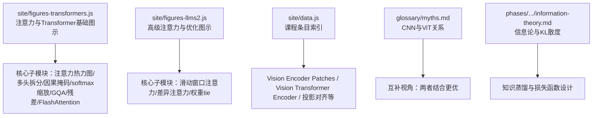

**图表来源**
- [site/figures-transformers.js:1-459](file://site/figures-transformers.js#L1-L459)
- [site/figures-llms2.js:333-376](file://site/figures-llms2.js#L333-L376)
- [site/data.js:4430-4452](file://site/data.js#L4430-L4452)
- [glossary/myths.md:155-159](file://glossary/myths.md#L155-L159)
- [phases/01-math-foundations/09-information-theory/outputs/skill-information-theory.md:76-95](file://phases/01-math-foundations/09-information-theory/outputs/skill-information-theory.md#L76-L95)

**章节来源**
- [site/figures-transformers.js:1-459](file://site/figures-transformers.js#L1-L459)
- [site/figures-llms2.js:333-376](file://site/figures-llms2.js#L333-L376)
- [site/data.js:4430-4452](file://site/data.js#L4430-L4452)
- [glossary/myths.md:155-159](file://glossary/myths.md#L155-L159)
- [phases/01-math-foundations/09-information-theory/outputs/skill-information-theory.md:76-95](file://phases/01-math-foundations/09-information-theory/outputs/skill-information-theory.md#L76-L95)

## 核心组件
- Patch嵌入与位置编码：将输入图像切分为规则网格，每个补丁展平并通过线性投影得到d_model向量；随后叠加可学习的位置编码或正余弦位置编码
- 自注意力与多头注意力：查询、键、值由线性变换生成；按头维度拆分后进行缩放点积注意力；最后拼接并线性投影
- 前馈网络（FFN）：通常采用两层结构，第一层经激活（如GELU/SwiGLU），第二层线性映射回d_model
- 残差连接与归一化：每个子层前后均执行add&norm，支持预归一化（pre-Norm）或后归一化（post-Norm）
- 滑动窗口注意力：在长序列上仅关注局部窗口，降低计算与内存开销
- 差异注意力：通过两个softmax映射相减，抑制共同噪声，突出真实信号
- 权重tie：输出投影与输入嵌入共享参数，减少参数量
- 知识蒸馏：利用KL散度衡量教师与学生分布差异，指导学生模型学习

**章节来源**
- [site/figures-transformers.js:19-60](file://site/figures-transformers.js#L19-L60)
- [site/figures-transformers.js:62-101](file://site/figures-transformers.js#L62-L101)
- [site/figures-transformers.js:103-138](file://site/figures-transformers.js#L103-L138)
- [site/figures-transformers.js:140-184](file://site/figures-transformers.js#L140-L184)
- [site/figures-transformers.js:308-356](file://site/figures-transformers.js#L308-L356)
- [site/figures-transformers.js:358-404](file://site/figures-transformers.js#L358-L404)
- [site/figures-transformers.js:406-445](file://site/figures-transformers.js#L406-L445)
- [site/figures-llms2.js:333-376](file://site/figures-llms2.js#L333-L376)
- [site/figures-llms2.js:378-427](file://site/figures-llms2.js#L378-L427)
- [site/figures-llms2.js:429-471](file://site/figures-llms2.js#L429-L471)
- [phases/01-math-foundations/09-information-theory/outputs/skill-information-theory.md:76-95](file://phases/01-math-foundations/09-information-theory/outputs/skill-information-theory.md#L76-L95)

## 架构总览
下图展示了从图像到序列再到上下文表示的整体流程，以及Transformer块内部的残差与归一化路径。

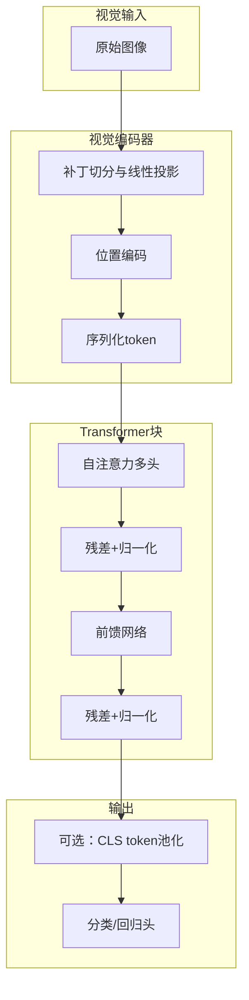

**图表来源**
- [site/figures-transformers.js:358-404](file://site/figures-transformers.js#L358-L404)
- [site/figures-transformers.js:62-101](file://site/figures-transformers.js#L62-L101)
- [site/figures-transformers.js:140-184](file://site/figures-transformers.js#L140-L184)

## 详细组件分析

### 组件A：注意力热力图与softmax缩放
- 注意力热力图展示QK^T得分矩阵、行内softmax分布及温度T的影响
- softmax缩放解释为何需要除以sqrt(d_k)，避免得分过大导致softmax饱和

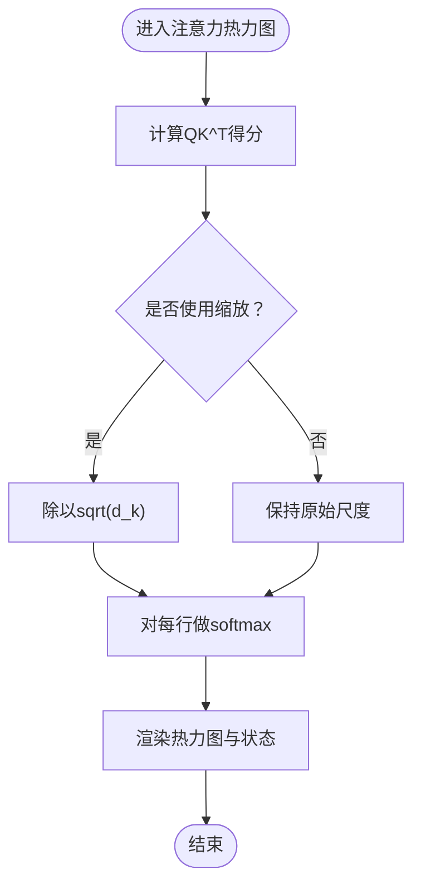

**图表来源**
- [site/figures-transformers.js:19-60](file://site/figures-transformers.js#L19-L60)
- [site/figures-transformers.js:140-184](file://site/figures-transformers.js#L140-L184)

**章节来源**
- [site/figures-transformers.js:19-60](file://site/figures-transformers.js#L19-L60)
- [site/figures-transformers.js:140-184](file://site/figures-transformers.js#L140-L184)

### 组件B：多头注意力与维度拆分
- 将d_model均匀拆分为num_heads个头，每个头维度为d_model/num_heads
- 参数总量不变，但并行计算提升表达能力

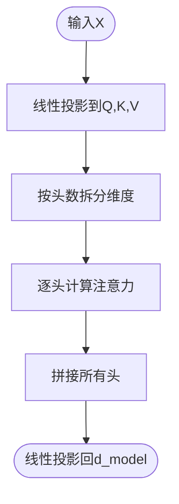

**图表来源**
- [site/figures-transformers.js:62-101](file://site/figures-transformers.js#L62-L101)

**章节来源**
- [site/figures-transformers.js:62-101](file://site/figures-transformers.js#L62-L101)

### 组件C：因果掩码与序列长度
- 因果掩码确保每个token仅关注自身及之前的token
- 随着序列长度增加，未遮蔽位置数量线性增长

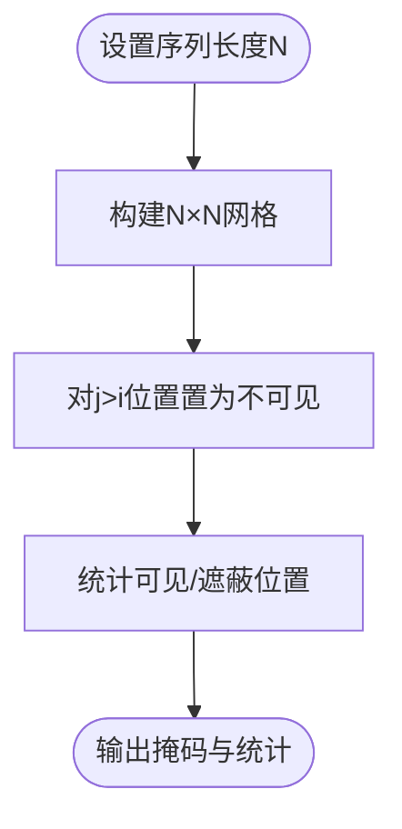

**图表来源**
- [site/figures-transformers.js:103-138](file://site/figures-transformers.js#L103-L138)

**章节来源**
- [site/figures-transformers.js:103-138](file://site/figures-transformers.js#L103-L138)

### 组件D：GQA/KV共享与缓存优化
- 查询头与KV头可按组共享，显著减少KV缓存占用
- 计算因子为查询头数除以KV头数

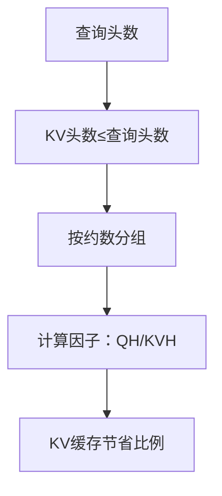

**图表来源**
- [site/figures-transformers.js:308-356](file://site/figures-transformers.js#L308-L356)

**章节来源**
- [site/figures-transformers.js:308-356](file://site/figures-transformers.js#L308-L356)

### 组件E：Transformer残差路径
- 每个子层后添加残差与归一化，保证深层网络稳定训练

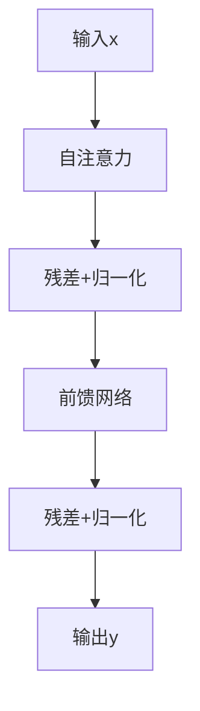

**图表来源**
- [site/figures-transformers.js:358-404](file://site/figures-transformers.js#L358-L404)

**章节来源**
- [site/figures-transformers.js:358-404](file://site/figures-transformers.js#L358-L404)

### 组件F：滑动窗口注意力
- 在因果三角形内仅保留宽度为w的带状区域，大幅降低计算复杂度

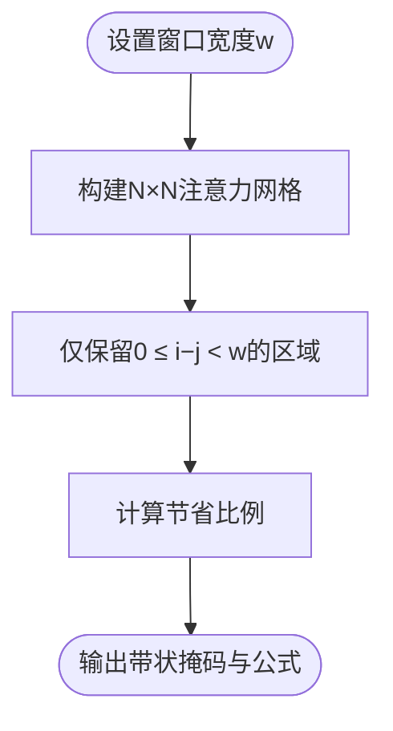

**图表来源**
- [site/figures-llms2.js:333-376](file://site/figures-llms2.js#L333-L376)

**章节来源**
- [site/figures-llms2.js:333-376](file://site/figures-llms2.js#L333-L376)

### 组件G：差异注意力
- 两个softmax映射相减，抑制共同噪声，突出真实峰值

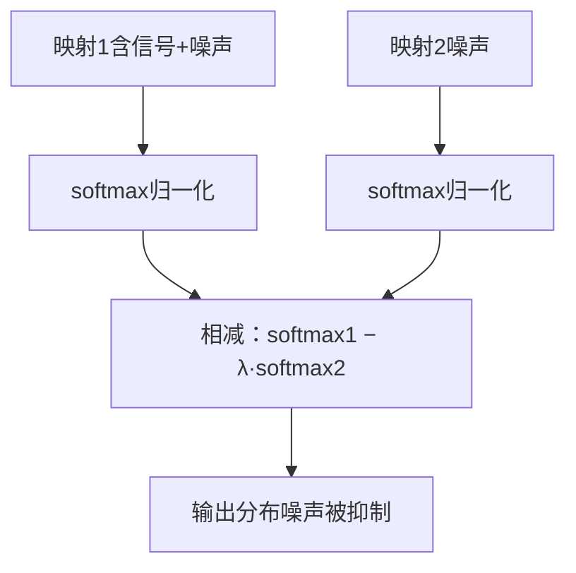

**图表来源**
- [site/figures-llms2.js:378-427](file://site/figures-llms2.js#L378-L427)

**章节来源**
- [site/figures-llms2.js:378-427](file://site/figures-llms2.js#L378-L427)

### 组件H：权重tie与参数节省
- 输出投影与输入嵌入共享同一矩阵，节省vocab×d_model参数

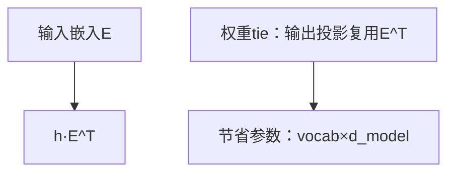

**图表来源**
- [site/figures-llms2.js:429-471](file://site/figures-llms2.js#L429-L471)

**章节来源**
- [site/figures-llms2.js:429-471](file://site/figures-llms2.js#L429-L471)

### 组件I：知识蒸馏与KL散度
- 利用KL散度衡量教师与学生分布差异，指导学生模型学习
- 交叉熵、温度缩放、困惑度等概念支撑蒸馏与评估

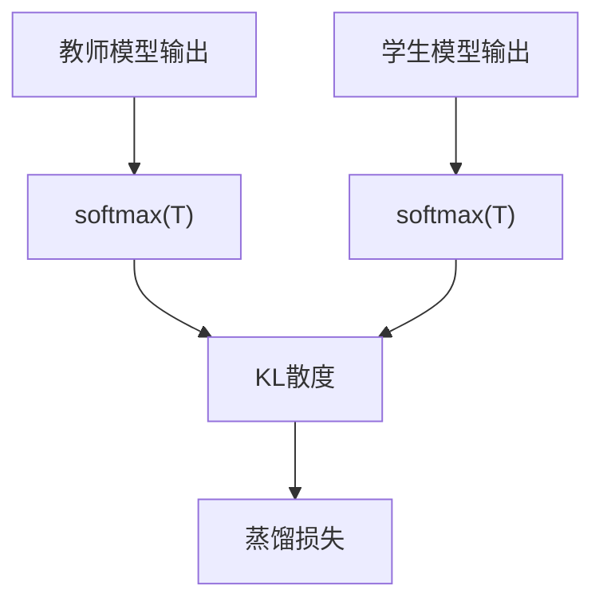

**图表来源**
- [phases/01-math-foundations/09-information-theory/outputs/skill-information-theory.md:76-95](file://phases/01-math-foundations/09-information-theory/outputs/skill-information-theory.md#L76-L95)

**章节来源**
- [phases/01-math-foundations/09-information-theory/outputs/skill-information-theory.md:76-95](file://phases/01-math-foundations/09-information-theory/outputs/skill-information-theory.md#L76-L95)

## 依赖关系分析
- 图形库依赖：上述图示通过统一的LF工具注册与渲染，无外部JS依赖，便于在浏览器端直接运行
- 数学基础依赖：信息论与优化相关知识为蒸馏与训练策略提供理论支撑
- 课程条目依赖：数据索引文件明确列出“Vision Encoder Patches”“Vision Transformer Encoder”等项目，作为课程实施依据

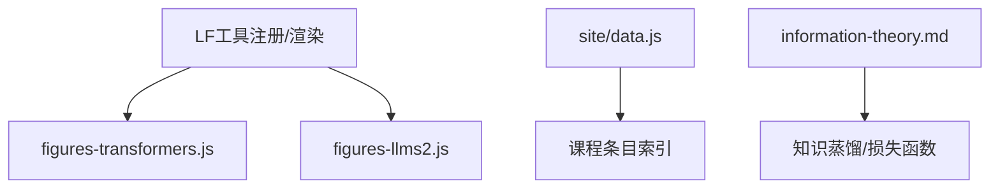

**图表来源**
- [site/figures-transformers.js:1-17](file://site/figures-transformers.js#L1-L17)
- [site/figures-llms2.js:1-17](file://site/figures-llms2.js#L1-L17)
- [site/data.js:4430-4452](file://site/data.js#L4430-L4452)
- [phases/01-math-foundations/09-information-theory/outputs/skill-information-theory.md:76-95](file://phases/01-math-foundations/09-information-theory/outputs/skill-information-theory.md#L76-L95)

**章节来源**
- [site/figures-transformers.js:1-17](file://site/figures-transformers.js#L1-L17)
- [site/figures-llms2.js:1-17](file://site/figures-llms2.js#L1-L17)
- [site/data.js:4430-4452](file://site/data.js#L4430-L4452)
- [phases/01-math-foundations/09-information-theory/outputs/skill-information-theory.md:76-95](file://phases/01-math-foundations/09-information-theory/outputs/skill-information-theory.md#L76-L95)

## 性能考量
- 计算复杂度：标准注意力为O(N^2)，FlashAttention通过分块避免显式存储N×N分数矩阵，降至O(N)
- 内存占用：滑动窗口注意力将关注范围限制在带状区域，显著降低KV缓存占用
- 归一化策略：RMSNorm相较LayerNorm省去均值中心化步骤，减少一次偏移与除法，适合大规模推理
- 参数规模：权重tie减少输出层参数；GQA/KV共享降低KV缓存与通信开销

**章节来源**
- [site/figures-transformers.js:406-445](file://site/figures-transformers.js#L406-L445)
- [site/figures-llms2.js:333-376](file://site/figures-llms2.js#L333-L376)
- [site/figures-llms2.js:429-471](file://site/figures-llms2.js#L429-L471)

## 故障排查指南
- 网络与下载问题：国内网络限制可设置镜像端点；模型下载不稳定可启用多线程下载
- 设备与运行时：Colab默认CPU需切换至GPU；遇到平台特定报错需调整设备映射
- 微调后异常：若训练中包含用户问题，应加入标签屏蔽
- 代码粘贴问题：Colab粘贴可能引入多余空格，建议上传notebook文件
- 推理与评估：不同词表规模下的困惑度不可直接比较；注意使用一致的评估指标

**章节来源**
- [phases/01-math-foundations/09-information-theory/outputs/skill-information-theory.md:76-95](file://phases/01-math-foundations/09-information-theory/outputs/skill-information-theory.md#L76-L95)

## 结论
本课程通过系统化的理论讲解与丰富的交互式图示，帮助学习者掌握视觉Transformer的核心组件与实现细节。结合CNN与ViT的互补优势、滑动窗口注意力与差异注意力等优化手段，以及基于信息论的知识蒸馏策略，能够在图像分类、检测、分割等任务中取得更好的性能与效率平衡。

## 附录
- 课程条目参考：Vision Encoder Patches、Vision Transformer Encoder、投影层对齐、交叉注意力融合、视觉语言预训练等
- 关于CNN与ViT：两者并非替代关系，而是根据任务约束（速度、资源、数据量）灵活选择或组合

**章节来源**
- [site/data.js:4430-4452](file://site/data.js#L4430-L4452)
- [glossary/myths.md:155-159](file://glossary/myths.md#L155-L159)