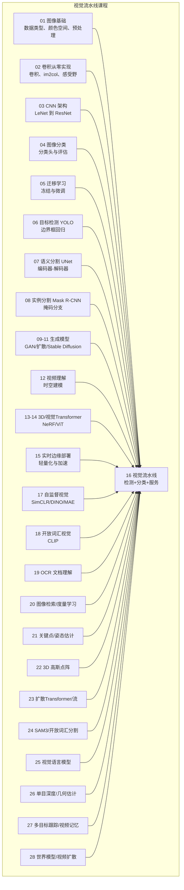
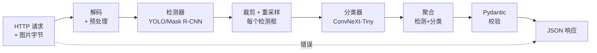
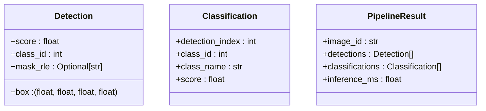
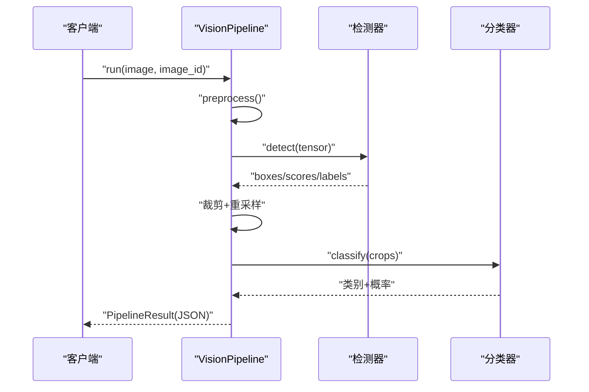
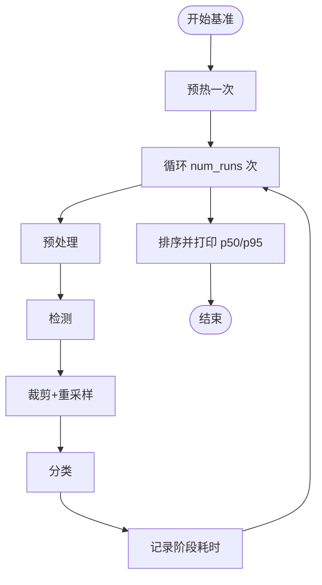
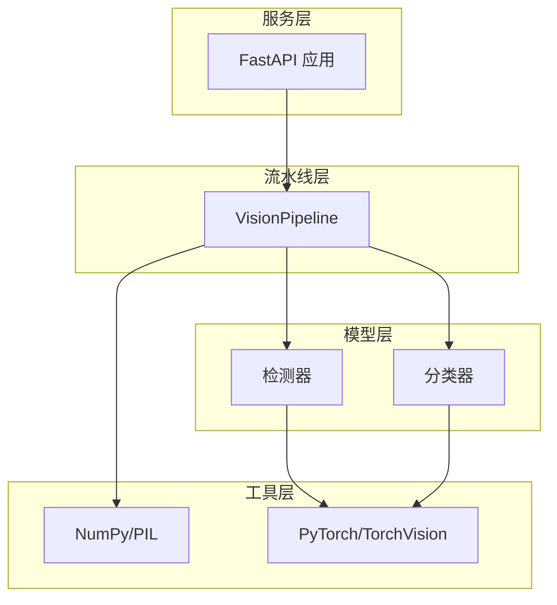
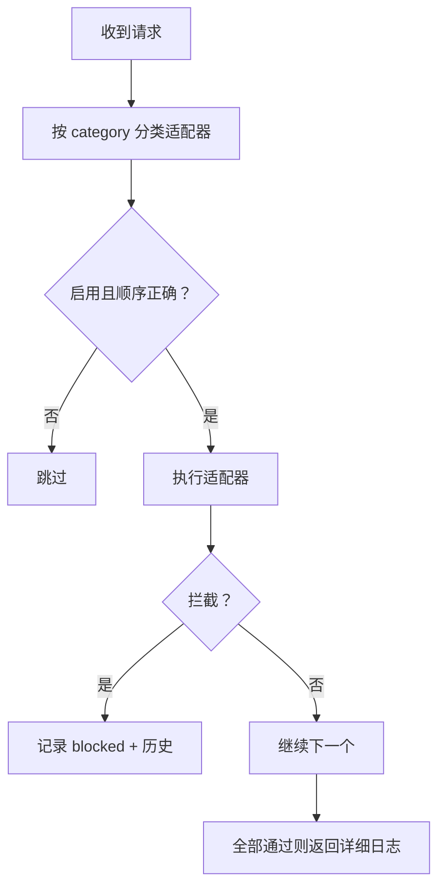

# 视觉系统流水线

<cite>
**本文档引用的文件**
- [README.md](file://README.md)
- [ROADMAP.md](file://ROADMAP.md)
- [main.py](file://phases/04-computer-vision/16-vision-pipeline-capstone/code/main.py)
- [docs/en.md](file://phases/04-computer-vision/16-vision-pipeline-capstone/docs/en.md)
- [main.py](file://phases/04-computer-vision/01-image-fundamentals/code/main.py)
- [main.py](file://phases/04-computer-vision/02-convolutions-from-scratch/code/main.py)
- [Dockerfile](file://phases/00-setup-and-tooling/07-docker-for-ai/code/Dockerfile)
- [docs/en.md](file://phases/00-setup-and-tooling/07-docker-for-ai/docs/en.md)
- [run.sh](file://guardrails-sandbox/run.sh)
- [pipeline.py](file://guardrails-sandbox/backend/pipeline.py)
- [PlaygroundPanel.vue](file://guardrails-sandbox/frontend/src/components/PlaygroundPanel.vue)
- [data.js](file://site/data.js)
</cite>

## 目录
1. [引言](#引言)
2. [项目结构](#项目结构)
3. [核心组件](#核心组件)
4. [架构总览](#架构总览)
5. [详细组件分析](#详细组件分析)
6. [依赖关系分析](#依赖关系分析)
7. [性能考量](#性能考量)
8. [故障排查指南](#故障排查指南)
9. [结论](#结论)
10. [附录](#附录)

## 引言
本文件面向“视觉系统流水线”课程，基于仓库中计算机视觉与工程实践的完整内容，系统性地构建从图像采集到最终决策的端到端视觉应用。文档综合了以下要点：
- 多模块协调：检测器、分类器、数据契约与服务层的协同
- 数据流管理：输入预处理、推理、后处理与结构化输出
- 错误处理：空检测、越界框、小裁剪、损坏上传等边界情况
- 性能监控与基准：分阶段耗时统计与瓶颈定位
- 工程实践：Docker 容器化、FastAPI 服务、版本管理与可观测性
- 可扩展性与可维护性：模块化接口、数据契约、微批处理与健康检查

## 项目结构
仓库采用“阶段-课程”的组织方式，视觉流水线课程位于 Phase 4 的第 16 课“构建完整的视觉流水线”。该课程以“端到端”为目标，将之前各课的视觉知识整合为可生产的服务。

图示来源
- [README.md:346-379](file://README.md#L346-L379)
- [ROADMAP.md:96-127](file://ROADMAP.md#L96-L127)

章节来源
- [README.md:346-379](file://README.md#L346-L379)
- [ROADMAP.md:96-127](file://ROADMAP.md#L96-L127)

## 核心组件
- 数据契约（Pydantic）：定义 Detection、Classification、PipelineResult，确保跨模块接口稳定
- VisionPipeline：统一的流水线封装，包含预处理、检测、分类、聚合与计时
- StubDetector/StubClassifier：最小可用的检测与分类模块，便于端到端验证
- FastAPI 服务：接收图片上传，运行流水线并返回结构化 JSON
- 基准脚本：分阶段统计耗时，识别瓶颈（通常为预处理与检测）

章节来源
- [main.py:10-150](file://phases/04-computer-vision/16-vision-pipeline-capstone/code/main.py#L10-L150)
- [docs/en.md:96-212](file://phases/04-computer-vision/16-vision-pipeline-capstone/docs/en.md#L96-L212)

## 架构总览
视觉流水线的端到端架构如下：

图示来源
- [docs/en.md:29-44](file://phases/04-computer-vision/16-vision-pipeline-capstone/docs/en.md#L29-L44)

章节来源
- [docs/en.md:25-47](file://phases/04-computer-vision/16-vision-pipeline-capstone/docs/en.md#L25-L47)

## 详细组件分析

### 组件一：数据契约与结果模型
- Detection：绝对像素坐标 (x1, y1, x2, y2)，置信度 [0,1]，类别 ID，可选掩码 RLE
- Classification：对应检测索引、类别 ID/名称、置信度
- PipelineResult：包含 image_id、检测列表、分类列表、推理耗时（毫秒）

图示来源
- [main.py:10-29](file://phases/04-computer-vision/16-vision-pipeline-capstone/code/main.py#L10-L29)

章节来源
- [main.py:10-29](file://phases/04-computer-vision/16-vision-pipeline-capstone/code/main.py#L10-L29)

### 组件二：VisionPipeline 流水线
- preprocess：支持 numpy 数组与 torch 张量，强制 HWC/CHW 与归一化
- detect：调用检测器，返回 boxes/scores/labels
- classify：批量分类，返回类别与概率
- run：主流程，含裁剪、尺寸过滤、重采样、聚合与计时

图示来源
- [main.py:69-150](file://phases/04-computer-vision/16-vision-pipeline-capstone/code/main.py#L69-L150)

章节来源
- [main.py:69-150](file://phases/04-computer-vision/16-vision-pipeline-capstone/code/main.py#L69-L150)

### 组件三：Stub 模型与基准
- StubDetector：固定生成若干检测框，用于端到端验证
- StubClassifier：简单分类头，输出类别概率
- benchmark：分阶段统计耗时（预处理、检测、分类、总计），排序输出 p50/p95

图示来源
- [main.py:152-191](file://phases/04-computer-vision/16-vision-pipeline-capstone/code/main.py#L152-L191)

章节来源
- [main.py:152-191](file://phases/04-computer-vision/16-vision-pipeline-capstone/code/main.py#L152-L191)

### 组件四：FastAPI 服务
- /detect：接收图片上传，进行类型校验与解码，调用流水线，返回结构化 JSON
- /health：健康检查端点（建议实现）
- 启动方式：uvicorn main:app --host 0.0.0.0 --port 8000

章节来源
- [docs/en.md:235-264](file://phases/04-computer-vision/16-vision-pipeline-capstone/docs/en.md#L235-L264)

### 组件五：工程实践与容器化
- Docker：CUDA 12.4 + PyTorch 2.3 + 常用科学计算库；暴露 Jupyter 端口，挂载工作区与模型目录
- Docker Compose：本地组合 AI 开发容器与向量数据库（如 Qdrant）
- 守卫沙箱：后端（Pipeline 编排）+ 前端（Playground）一体化启动脚本

章节来源
- [Dockerfile:1-44](file://phases/00-setup-and-tooling/07-docker-for-ai/code/Dockerfile#L1-L44)
- [docs/en.md:1-373](file://phases/00-setup-and-tooling/07-docker-for-ai/docs/en.md#L1-L373)
- [run.sh:1-34](file://guardrails-sandbox/run.sh#L1-L34)
- [PlaygroundPanel.vue:1-51](file://guardrails-sandbox/frontend/src/components/PlaygroundPanel.vue#L1-L51)

## 依赖关系分析
- 模块耦合
  - VisionPipeline 依赖检测器与分类器接口，通过统一的数据契约解耦具体模型
  - FastAPI 服务仅依赖 VisionPipeline，便于替换模型与部署框架
- 外部依赖
  - PyTorch/TorchVision：检测与分类模型
  - NumPy/PIL：图像解码与预处理
  - FastAPI/Uvicorn：服务层
  - Docker/NVIDIA Container Toolkit：容器化与 GPU 加速

图示来源
- [main.py:69-150](file://phases/04-computer-vision/16-vision-pipeline-capstone/code/main.py#L69-L150)
- [Dockerfile:20-35](file://phases/00-setup-and-tooling/07-docker-for-ai/code/Dockerfile#L20-L35)

章节来源
- [main.py:69-150](file://phases/04-computer-vision/16-vision-pipeline-capstone/code/main.py#L69-L150)
- [Dockerfile:20-35](file://phases/00-setup-and-tooling/07-docker-for-ai/code/Dockerfile#L20-L35)

## 性能考量
- 三大真相
  - 预处理通常是最大单体瓶颈（解码、色彩空间转换、缩放）
  - 检测器占 GPU 时间的 70%-90%
  - 后处理（NMS、RLE 编解码）在 CPU 上相对昂贵
- 微批处理（Micro-batcher）
  - 收集请求窗口（如 10ms）内多个请求，一次性分类，提升吞吐
  - 需权衡额外等待带来的延迟
- 其他优化方向
  - 模型量化/蒸馏
  - CUDA 同步与设备选择（CPU/GPU）
  - 输入尺寸与批大小的权衡

章节来源
- [docs/en.md:70-79](file://phases/04-computer-vision/16-vision-pipeline-capstone/docs/en.md#L70-L79)
- [docs/en.md:266-303](file://phases/04-computer-vision/16-vision-pipeline-capstone/docs/en.md#L266-L303)

## 故障排查指南
- 常见失败模式
  - 空检测：返回空列表而非崩溃，记录日志
  - 越界框：裁剪前钳制到图像边界
  - 小裁剪：跳过小于分类器最小输入的区域
  - 损坏上传：返回 400 并指定错误码，避免 500
  - 模型加载失败：服务启动期失败，不在首请求报错
- 守卫沙箱（Pipeline 编排）
  - 按输入/输出分类适配器，按 order 排序，遇拦截短路
  - 统计 total/blocked/passed 与每层统计，保留最近拦截历史

图示来源
- [pipeline.py:12-29](file://guardrails-sandbox/backend/pipeline.py#L12-L29)

章节来源
- [docs/en.md:80-89](file://phases/04-computer-vision/16-vision-pipeline-capstone/docs/en.md#L80-L89)
- [pipeline.py:12-29](file://guardrails-sandbox/backend/pipeline.py#L12-L29)

## 结论
本课程将计算机视觉的理论与工程实践结合，形成“检测—分类—服务”的完整流水线。通过数据契约、模块化接口与基准测试，实现了可扩展、可维护、可观测的视觉系统。配合 Docker 容器化与守卫沙箱，可快速落地到生产环境并持续演进。

## 附录

### A. 端到端开发流程
- 需求分析：明确任务（检测+分类）、输入格式（图片）、输出结构（JSON）
- 技术选型：检测器（YOLO/Mask R-CNN）、分类器（ConvNeXt-Tiny）、服务框架（FastAPI）
- 实现部署：编写 VisionPipeline、FastAPI 服务、Dockerfile 与 docker-compose
- 性能监控：基准脚本、分阶段耗时、trace ID、健康检查
- 版本管理：模型权重哈希、服务版本号、容器镜像标签

章节来源
- [docs/en.md:307-318](file://phases/04-computer-vision/16-vision-pipeline-capstone/docs/en.md#L307-L318)

### B. 关键术语
- Pipeline：有序链路，带类型化接口
- 数据契约：Pydantic/Dataclass，边界处捕获集成错误
- 预处理：解码、色彩转换、缩放、归一化
- 后处理：NMS、掩码重采样、阈值、RLE 编码
- 微批处理：固定窗口收集请求，单次 GPU 调用
- Trace ID：每请求标识，便于端到端追踪
- 健康检查：就绪探针，负载均衡依赖

章节来源
- [docs/en.md:326-344](file://phases/04-computer-vision/16-vision-pipeline-capstone/docs/en.md#L326-L344)

### C. 相关资源与提示
- 图像基础与预处理：像素、通道、颜色空间、归一化与反归一化
- 卷积与感受野：im2col、输出尺寸、感受野累积
- 容器化与 GPU：CUDA 基础镜像、NVIDIA Container Toolkit、Compose 编排
- 守卫沙箱：后端 Pipeline 编排 + 前端 Playground

章节来源
- [main.py:1-146](file://phases/04-computer-vision/01-image-fundamentals/code/main.py#L1-L146)
- [main.py:1-135](file://phases/04-computer-vision/02-convolutions-from-scratch/code/main.py#L1-L135)
- [docs/en.md:1-373](file://phases/00-setup-and-tooling/07-docker-for-ai/docs/en.md#L1-L373)
- [run.sh:1-34](file://guardrails-sandbox/run.sh#L1-L34)
- [PlaygroundPanel.vue:1-51](file://guardrails-sandbox/frontend/src/components/PlaygroundPanel.vue#L1-L51)