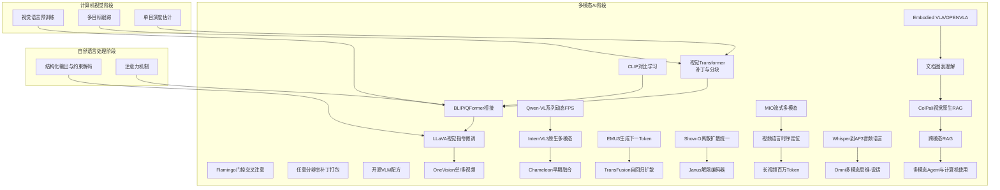
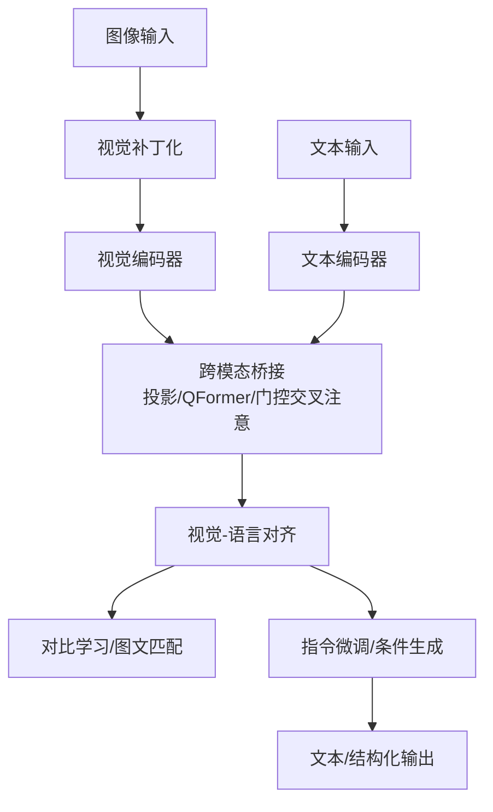
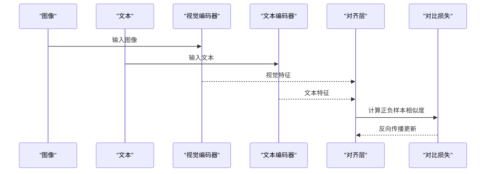
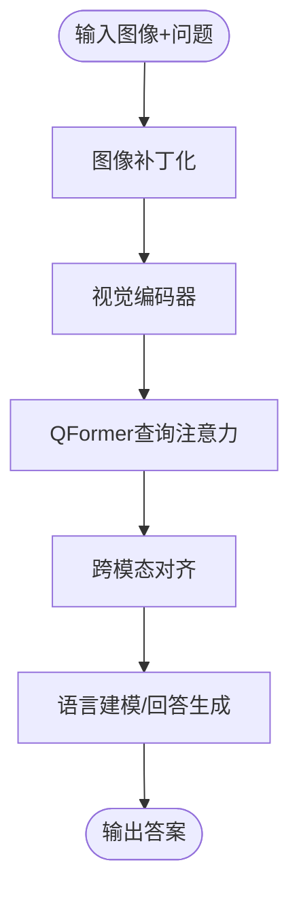
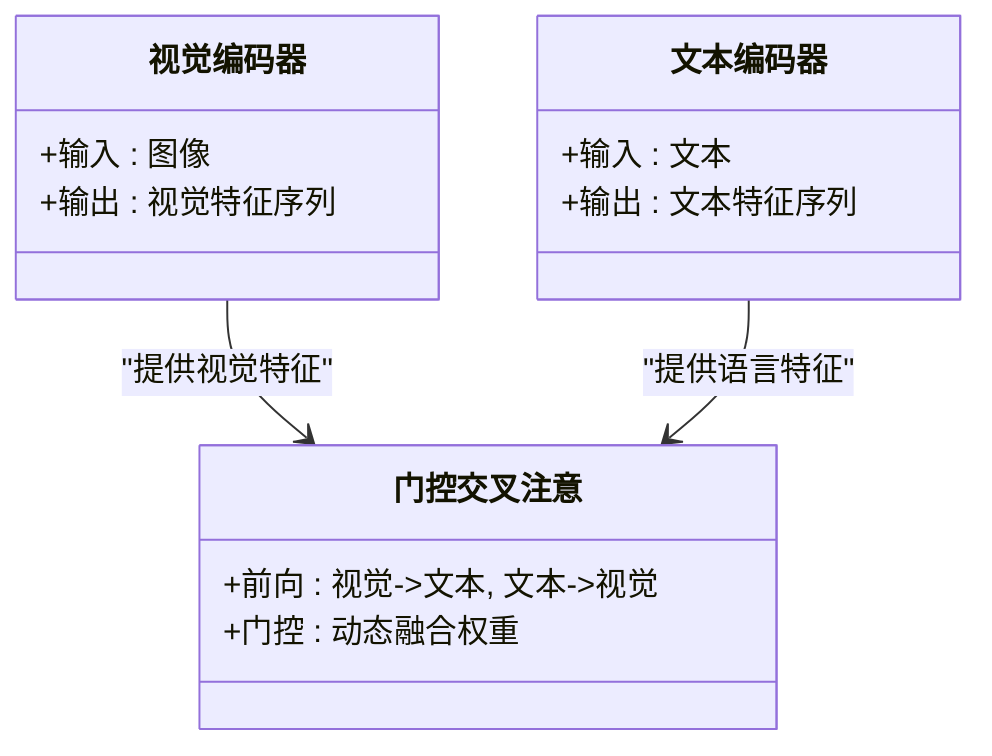
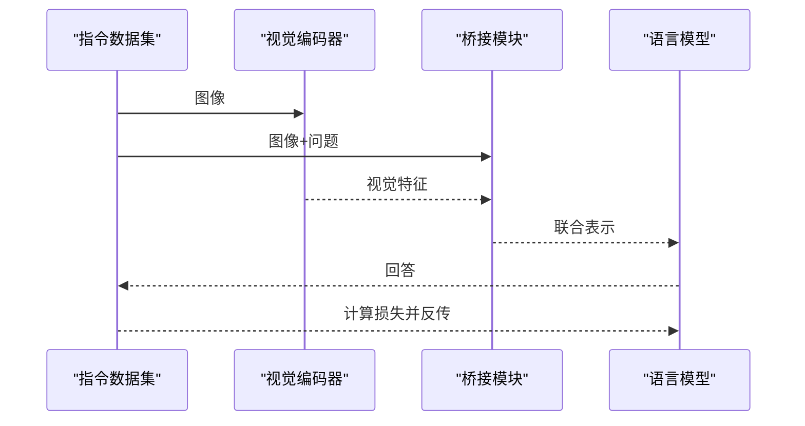
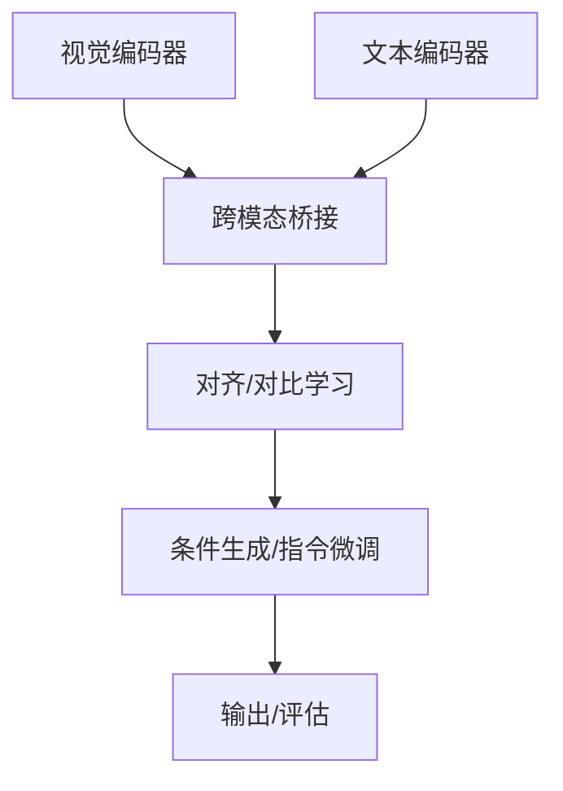

# 视觉语言模型

<cite>
**本文引用的文件**
- [phases/12-multimodal-ai/README.md](file://phases/12-multimodal-ai/README.md)
- [phases/04-computer-vision/README.md](file://phases/04-computer-vision/README.md)
- [phases/05-nlp-foundations-to-advanced/README.md](file://phases/05-nlp-foundations-to-advanced/README.md)
- [phases/12-multimodal-ai/01-vision-transformer-patch-tokens/docs/zh.md](file://phases/12-multimodal-ai/01-vision-transformer-patch-tokens/docs/zh.md)
- [phases/12-multimodal-ai/02-clip-contrastive-pretraining/docs/zh.md](file://phases/12-multimodal-ai/02-clip-contrastive-pretraining/docs/zh.md)
- [phases/12-multimodal-ai/03-blip2-qformer-bridge/docs/zh.md](file://phases/12-multimodal-ai/03-blip2-qformer-bridge/docs/zh.md)
- [phases/12-multimodal-ai/04-flamingo-gated-cross-attention/docs/zh.md](file://phases/12-multimodal-ai/04-flamingo-gated-cross-attention/docs/zh.md)
- [phases/12-multimodal-ai/05-llava-visual-instruction-tuning/docs/zh.md](file://phases/12-multimodal-ai/05-llava-visual-instruction-tuning/docs/zh.md)
- [phases/12-multimodal-ai/06-any-resolution-patch-n-pack/docs/zh.md](file://phases/12-multimodal-ai/06-any-resolution-patch-n-pack/docs/zh.md)
- [phases/12-multimodal-ai/07-open-weight-vlm-recipes/docs/zh.md](file://phases/12-multimodal-ai/07-open-weight-vlm-recipes/docs/zh.md)
- [phases/12-multimodal-ai/08-llava-onevision-single-multi-video/docs/zh.md](file://phases/12-multimodal-ai/08-llava-onevision-single-multi-video/docs/zh.md)
- [phases/12-multimodal-ai/09-qwen-vl-family-dynamic-fps/docs/zh.md](file://phases/12-multimodal-ai/09-qwen-vl-family-dynamic-fps/docs/zh.md)
- [phases/12-multimodal-ai/10-internvl3-native-multimodal/docs/zh.md](file://phases/12-multimodal-ai/10-internvl3-native-multimodal/docs/zh.md)
- [phases/12-multimodal-ai/11-chameleon-early-fusion-tokens/docs/zh.md](file://phases/12-multimodal-ai/11-chameleon-early-fusion-tokens/docs/zh.md)
- [phases/12-multimodal-ai/12-emu3-next-token-for-generation/docs/zh.md](file://phases/12-multimodal-ai/12-emu3-next-token-for-generation/docs/zh.md)
- [phases/12-multimodal-ai/13-transfusion-autoregressive-diffusion/docs/zh.md](file://phases/12-multimodal-ai/13-transfusion-autoregressive-diffusion/docs/zh.md)
- [phases/12-multimodal-ai/14-show-o-discrete-diffusion-unified/docs/zh.md](file://phases/12-multimodal-ai/14-show-o-discrete-diffusion-unified/docs/zh.md)
- [phases/12-multimodal-ai/15-janus-pro-decoupled-encoders/docs/zh.md](file://phases/12-multimodal-ai/15-janus-pro-decoupled-encoders/docs/zh.md)
- [phases/12-multimodal-ai/16-mio-any-to-any-streaming/docs/zh.md](file://phases/12-multimodal-ai/16-mio-any-to-any-streaming/docs/zh.md)
- [phases/12-multimodal-ai/17-video-language-temporal-grounding/docs/zh.md](file://phases/12-multimodal-ai/17-video-language-temporal-grounding/docs/zh.md)
- [phases/12-multimodal-ai/18-long-video-million-token/docs/zh.md](file://phases/12-multimodal-ai/18-long-video-million-token/docs/zh.md)
- [phases/12-multimodal-ai/19-audio-language-whisper-to-af3/docs/zh.md](file://phases/12-multimodal-ai/19-audio-language-whisper-to-af3/docs/zh.md)
- [phases/12-multimodal-ai/20-omni-models-thinker-talker/docs/zh.md](file://phases/12-multimodal-ai/20-omni-models-thinker-talker/docs/zh.md)
- [phases/12-multimodal-ai/21-embodied-vlas-openvla-pi0-groot/docs/zh.md](file://phases/12-multimodal-ai/21-embodied-vlas-openvla-pi0-groot/docs/zh.md)
- [phases/12-multimodal-ai/22-document-diagram-understanding/docs/zh.md](file://phases/12-multimodal-ai/22-document-diagram-understanding/docs/zh.md)
- [phases/12-multimodal-ai/23-colpali-vision-native-rag/docs/zh.md](file://phases/12-multimodal-ai/23-colpali-vision-native-rag/docs/zh.md)
- [phases/12-multimodal-ai/24-multimodal-rag-cross-modal/docs/zh.md](file://phases/12-multimodal-ai/24-multimodal-rag-cross-modal/docs/zh.md)
- [phases/12-multimodal-ai/25-multimodal-agents-computer-use/docs/zh.md](file://phases/12-multimodal-ai/25-multimodal-agents-computer-use/docs/zh.md)
- [phases/04-computer-vision/25-vision-language-models/docs/zh.md](file://phases/04-computer-vision/25-vision-language-models/docs/zh.md)
- [phases/04-computer-vision/26-monocular-depth/docs/zh.md](file://phases/04-computer-vision/26-monocular-depth/docs/zh.md)
- [phases/04-computer-vision/27-multi-object-tracking/docs/zh.md](file://phases/04-computer-vision/27-multi-object-tracking/docs/zh.md)
- [phases/05-nlp-foundations-to-advanced/10-attention-mechanism/docs/zh.md](file://phases/05-nlp-foundations-to-advanced/10-attention-mechanism/docs/zh.md)
- [phases/05-nlp-foundations-to-advanced/20-structured-outputs-constrained-decoding/docs/zh.md](file://phases/05-nlp-foundations-to-advanced/20-structured-outputs-constrained-decoding/docs/zh.md)
- [phases/12-multimodal-ai/09-qwen-vl-family-dynamic-fps/assets/qwen-vl-lineage.svg](file://phases/12-multimodal-ai/09-qwen-vl-family-dynamic-fps/assets/qwen-vl-lineage.svg)
</cite>

## 目录
1. [引言](#引言)
2. [项目结构](#项目结构)
3. [核心组件](#核心组件)
4. [架构总览](#架构总览)
5. [详细组件分析](#详细组件分析)
6. [依赖关系分析](#依赖关系分析)
7. [性能考量](#性能考量)
8. [故障排查指南](#故障排查指南)
9. [结论](#结论)
10. [附录](#附录)

## 引言
本文件面向“视觉语言模型”课程，系统梳理多模态学习基础、视觉语言对齐技术与典型模型（如 BLIP、Florence、Qwen-VL 等）的架构与训练策略；并覆盖视觉-语言对比学习、图文匹配、视觉问答等应用任务。同时，结合单目深度估计、多目标跟踪等视觉任务，给出与语言模型结合的实现思路；最后总结跨模态特征融合、注意力机制、条件生成等关键技术，并列举智能助手、内容理解、辅助诊断等应用场景与完整系统实现路径。

## 项目结构
该仓库以“阶段化学习路径”组织内容，视觉语言模型相关内容主要分布在以下模块：
- 多模态AI阶段：系统性介绍视觉-语言对齐、跨模态桥接、多模态指令微调、视频-语言、音频-语言、通用多模态等主题。
- 计算机视觉阶段：涵盖视觉Transformer、CLIP对比预训练、视觉语言预训练、单目深度估计、多目标跟踪等。
- 自然语言处理阶段：涵盖注意力机制、结构化输出与约束解码等与多模态生成密切相关的NLP基础。

图示来源
- [phases/12-multimodal-ai/README.md](file://phases/12-multimodal-ai/README.md)
- [phases/04-computer-vision/README.md](file://phases/04-computer-vision/README.md)
- [phases/05-nlp-foundations-to-advanced/README.md](file://phases/05-nlp-foundations-to-advanced/README.md)

章节来源
- [phases/12-multimodal-ai/README.md](file://phases/12-multimodal-ai/README.md)
- [phases/04-computer-vision/README.md](file://phases/04-computer-vision/README.md)
- [phases/05-nlp-foundations-to-advanced/README.md](file://phases/05-nlp-foundations-to-advanced/README.md)

## 核心组件
- 视觉编码器与分块：将图像划分为序列化的视觉补丁，作为视觉侧的离散表示，支撑后续跨模态对齐与融合。
- 文本编码器与语言建模：负责文本序列的嵌入、位置编码与自注意力堆叠，形成语言侧表示。
- 跨模态桥接与对齐：通过Q-Former、门控交叉注意、投影层等方式实现视觉与语言的联合表征空间对齐。
- 对比学习与图文匹配：利用对比损失在图像-文本层面进行对齐，提升检索与理解能力。
- 条件生成与指令微调：在视觉指令数据上进行监督微调，使模型具备遵循语言指令完成视觉任务的能力。
- 多模态RAG与结构化输出：在复杂问答与推理中，结合检索增强与约束解码，确保输出结构化与可验证。

章节来源
- [phases/12-multimodal-ai/01-vision-transformer-patch-tokens/docs/zh.md](file://phases/12-multimodal-ai/01-vision-transformer-patch-tokens/docs/zh.md)
- [phases/12-multimodal-ai/02-clip-contrastive-pretraining/docs/zh.md](file://phases/12-multimodal-ai/02-clip-contrastive-pretraining/docs/zh.md)
- [phases/12-multimodal-ai/03-blip2-qformer-bridge/docs/zh.md](file://phases/12-multimodal-ai/03-blip2-qformer-bridge/docs/zh.md)
- [phases/12-multimodal-ai/04-flamingo-gated-cross-attention/docs/zh.md](file://phases/12-multimodal-ai/04-flamingo-gated-cross-attention/docs/zh.md)
- [phases/12-multimodal-ai/05-llava-visual-instruction-tuning/docs/zh.md](file://phases/12-multimodal-ai/05-llava-visual-instruction-tuning/docs/zh.md)
- [phases/12-multimodal-ai/07-open-weight-vlm-recipes/docs/zh.md](file://phases/12-multimodal-ai/07-open-weight-vlm-recipes/docs/zh.md)
- [phases/12-multimodal-ai/23-colpali-vision-native-rag/docs/zh.md](file://phases/12-multimodal-ai/23-colpali-vision-native-rag/docs/zh.md)
- [phases/05-nlp-foundations-to-advanced/20-structured-outputs-constrained-decoding/docs/zh.md](file://phases/05-nlp-foundations-to-advanced/20-structured-outputs-constrained-decoding/docs/zh.md)

## 架构总览
下图展示了从视觉输入到语言输出的关键通路：视觉编码器将图像切分为补丁序列，经跨模态桥接进入统一表征空间；随后通过对比学习或指令微调优化；在推理阶段，结合注意力与条件生成完成图文匹配、视觉问答、视觉指令控制等任务。

图示来源
- [phases/12-multimodal-ai/01-vision-transformer-patch-tokens/docs/zh.md](file://phases/12-multimodal-ai/01-vision-transformer-patch-tokens/docs/zh.md)
- [phases/12-multimodal-ai/02-clip-contrastive-pretraining/docs/zh.md](file://phases/12-multimodal-ai/02-clip-contrastive-pretraining/docs/zh.md)
- [phases/12-multimodal-ai/03-blip2-qformer-bridge/docs/zh.md](file://phases/12-multimodal-ai/03-blip2-qformer-bridge/docs/zh.md)
- [phases/12-multimodal-ai/04-flamingo-gated-cross-attention/docs/zh.md](file://phases/12-multimodal-ai/04-flamingo-gated-cross-attention/docs/zh.md)
- [phases/12-multimodal-ai/05-llava-visual-instruction-tuning/docs/zh.md](file://phases/12-multimodal-ai/05-llava-visual-instruction-tuning/docs/zh.md)

## 详细组件分析

### 视觉-语言对比学习与图文匹配
- 基本原理：通过对比损失在图像-文本嵌入空间中拉近正样本、推远负样本，实现跨模态对齐。
- 关键实现点：CLIP式的双塔结构、温度参数缩放、全局特征对齐与归一化。
- 应用：零样本图像分类、检索、跨模态检索排序。

图示来源
- [phases/12-multimodal-ai/02-clip-contrastive-pretraining/docs/zh.md](file://phases/12-multimodal-ai/02-clip-contrastive-pretraining/docs/zh.md)

章节来源
- [phases/12-multimodal-ai/02-clip-contrastive-pretraining/docs/zh.md](file://phases/12-multimodal-ai/02-clip-contrastive-pretraining/docs/zh.md)

### BLIP/QFormer视觉-语言对齐与桥接
- QFormer：引入查询注意力，将视觉特征映射到“语言友好”的查询空间，再与文本侧对齐。
- 训练策略：掩码视觉重建、图文匹配、语言建模三阶段或联合优化。
- 优势：在少样本与零样本场景表现稳健，适合下游任务迁移。

图示来源
- [phases/12-multimodal-ai/03-blip2-qformer-bridge/docs/zh.md](file://phases/12-multimodal-ai/03-blip2-qformer-bridge/docs/zh.md)

章节来源
- [phases/12-multimodal-ai/03-blip2-qformer-bridge/docs/zh.md](file://phases/12-multimodal-ai/03-blip2-qformer-bridge/docs/zh.md)

### Flamingo门控交叉注意力与多模态融合
- 门控机制：在交叉注意力中引入门控，按需选择视觉与语言信息的融合程度。
- 融合方式：早期融合（拼接/投影）、晚期融合（后处理/条件生成）。
- 适用场景：开放域问答、视觉推理、视频理解。

图示来源
- [phases/12-multimodal-ai/04-flamingo-gated-cross-attention/docs/zh.md](file://phases/12-multimodal-ai/04-flamingo-gated-cross-attention/docs/zh.md)

章节来源
- [phases/12-multimodal-ai/04-flamingo-gated-cross-attention/docs/zh.md](file://phases/12-multimodal-ai/04-flamingo-gated-cross-attention/docs/zh.md)

### LLaVA视觉指令微调与条件生成
- 数据与流程：视觉指令数据集（图像-问题-回答），监督微调语言模型参数。
- 关键点：冻结视觉编码器、仅训练桥接与语言模型部分，或端到端微调。
- 评估：基于准确率、流畅度、一致性等指标。

图示来源
- [phases/12-multimodal-ai/05-llava-visual-instruction-tuning/docs/zh.md](file://phases/12-multimodal-ai/05-llava-visual-instruction-tuning/docs/zh.md)

章节来源
- [phases/12-multimodal-ai/05-llava-visual-instruction-tuning/docs/zh.md](file://phases/12-multimodal-ai/05-llava-visual-instruction-tuning/docs/zh.md)

### Qwen-VL系列动态帧采样与多模态管线
- 动态FPS：根据内容复杂度与任务需求调整帧采样频率，平衡质量与效率。
- 系列演进：从基础视觉问答到多模态理解、推理与生成，逐步扩展能力边界。
- 管线设计：输入解析、视觉编码、跨模态对齐、条件生成、后处理与输出。

图示来源
- [phases/12-multimodal-ai/09-qwen-vl-family-dynamic-fps/docs/zh.md](file://phases/12-multimodal-ai/09-qwen-vl-family-dynamic-fps/docs/zh.md)
- [phases/12-multimodal-ai/09-qwen-vl-family-dynamic-fps/assets/qwen-vl-lineage.svg](file://phases/12-multimodal-ai/09-qwen-vl-family-dynamic-fps/assets/qwen-vl-lineage.svg)

章节来源
- [phases/12-multimodal-ai/09-qwen-vl-family-dynamic-fps/docs/zh.md](file://phases/12-multimodal-ai/09-qwen-vl-family-dynamic-fps/docs/zh.md)
- [phases/12-multimodal-ai/09-qwen-vl-family-dynamic-fps/assets/qwen-vl-lineage.svg](file://phases/12-multimodal-ai/09-qwen-vl-family-dynamic-fps/assets/qwen-vl-lineage.svg)

### 视觉语言预训练与下游任务迁移
- 预训练：图文匹配、对比学习、语言建模等。
- 迁移：在视觉问答、图像描述、检索等任务上微调或提示。

章节来源
- [phases/04-computer-vision/25-vision-language-models/docs/zh.md](file://phases/04-computer-vision/25-vision-language-models/docs/zh.md)

### 单目深度估计与语言模型结合
- 思路：将深度估计结果作为额外视觉线索，与语言提示共同驱动生成或推理。
- 实现要点：深度图编码、与RGB特征融合、条件生成、误差校正。

章节来源
- [phases/04-computer-vision/26-monocular-depth/docs/zh.md](file://phases/04-computer-vision/26-monocular-depth/docs/zh.md)

### 多目标跟踪与语言模型结合
- 思路：将轨迹与属性信息作为语言上下文，提升多模态问答与推理准确性。
- 实现要点：轨迹编码、时序对齐、跨模态检索与生成。

章节来源
- [phases/04-computer-vision/27-multi-object-tracking/docs/zh.md](file://phases/04-computer-vision/27-multi-object-tracking/docs/zh.md)

### 注意力机制与结构化输出
- 注意力：自注意力与交叉注意力是跨模态融合的核心。
- 结构化输出：在多模态生成中，通过约束解码保证格式与一致性。

章节来源
- [phases/05-nlp-foundations-to-advanced/10-attention-mechanism/docs/zh.md](file://phases/05-nlp-foundations-to-advanced/10-attention-mechanism/docs/zh.md)
- [phases/05-nlp-foundations-to-advanced/20-structured-outputs-constrained-decoding/docs/zh.md](file://phases/05-nlp-foundations-to-advanced/20-structured-outputs-constrained-decoding/docs/zh.md)

## 依赖关系分析
- 模块内聚：各主题围绕“视觉-语言对齐—桥接—生成/检索”主线展开，内部逻辑连贯。
- 模块耦合：视觉编码器与文本编码器相对独立，跨模态桥接模块承担耦合职责。
- 外部依赖：主流Transformers库提供模型实现与工具函数，便于快速实验与复现。

图示来源
- [phases/12-multimodal-ai/01-vision-transformer-patch-tokens/docs/zh.md](file://phases/12-multimodal-ai/01-vision-transformer-patch-tokens/docs/zh.md)
- [phases/12-multimodal-ai/03-blip2-qformer-bridge/docs/zh.md](file://phases/12-multimodal-ai/03-blip2-qformer-bridge/docs/zh.md)
- [phases/12-multimodal-ai/05-llava-visual-instruction-tuning/docs/zh.md](file://phases/12-multimodal-ai/05-llava-visual-instruction-tuning/docs/zh.md)

章节来源
- [phases/12-multimodal-ai/01-vision-transformer-patch-tokens/docs/zh.md](file://phases/12-multimodal-ai/01-vision-transformer-patch-tokens/docs/zh.md)
- [phases/12-multimodal-ai/03-blip2-qformer-bridge/docs/zh.md](file://phases/12-multimodal-ai/03-blip2-qformer-bridge/docs/zh.md)
- [phases/12-multimodal-ai/05-llava-visual-instruction-tuning/docs/zh.md](file://phases/12-multimodal-ai/05-llava-visual-instruction-tuning/docs/zh.md)

## 性能考量
- 计算与内存：视觉编码器通常较重，建议采用混合精度、梯度检查点与分布式并行。
- 通信与吞吐：跨模态桥接与注意力计算存在通信瓶颈，需优化KV缓存与批处理策略。
- 推理延迟：在实时场景中，优先考虑轻量化视觉编码器与高效解码策略。
- 数据效率：对比学习与指令微调可显著降低标注成本，提升泛化能力。

## 故障排查指南
- 对齐失败：检查视觉与文本对齐维度是否一致、归一化与温度参数设置。
- 生成不稳：核查约束解码配置、最大长度与采样策略；必要时启用结构化输出模板。
- 训练发散：监控对比损失与困惑度，调整学习率与正则化强度。
- 内存溢出：减少批大小、启用梯度累积、使用半精度与梯度检查点。

## 结论
本课程体系以“视觉-语言对齐”为核心，贯通从基础视觉编码、跨模态桥接到对比学习、指令微调与生成的完整链路。结合单目深度估计、多目标跟踪等视觉任务，可构建面向真实场景的多模态系统。通过合理选择模型架构（如QFormer、门控交叉注意）、优化训练策略与推理管线，可在智能助手、内容理解、辅助诊断等领域取得良好效果。

## 附录
- 应用场景举例
  - 智能助手：基于视觉指令的自动化操作与问答。
  - 内容理解：文档与图表理解、跨模态RAG与推理。
  - 辅助诊断：医学影像与报告生成、多目标跟踪辅助分析。
- 完整系统实现建议
  - 输入：图像/视频+文本提示
  - 编码：视觉编码器+文本编码器
  - 对齐：投影/QFormer/门控交叉注意
  - 优化：对比学习+指令微调
  - 输出：自由文本/结构化JSON/动作序列