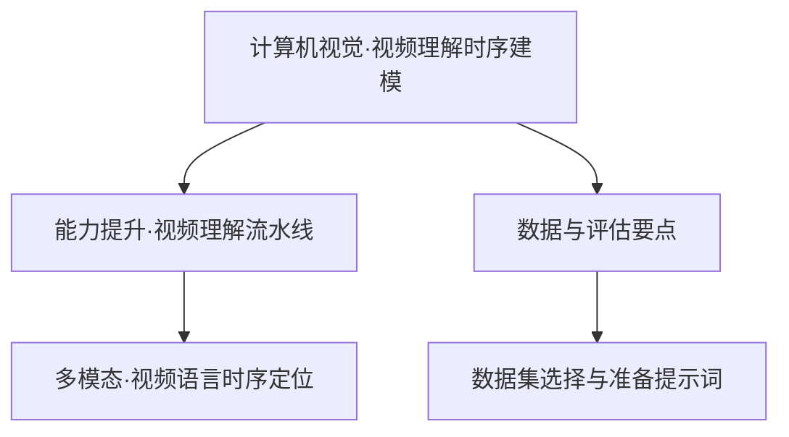
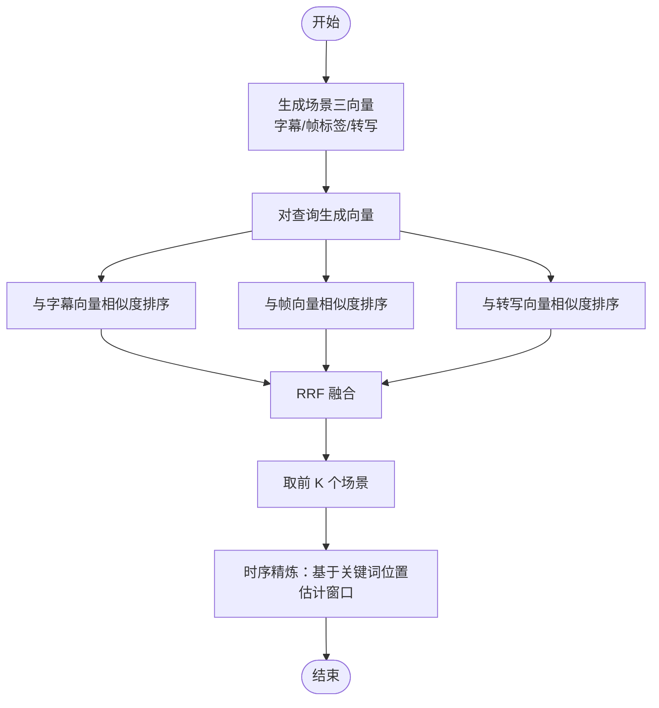
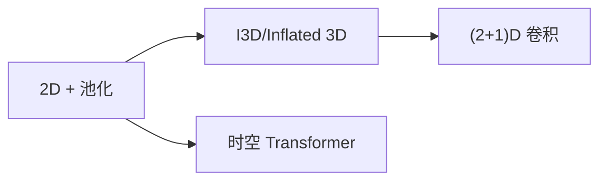
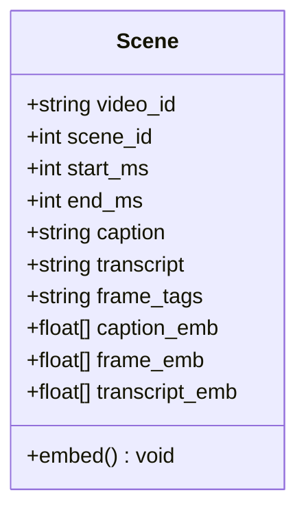
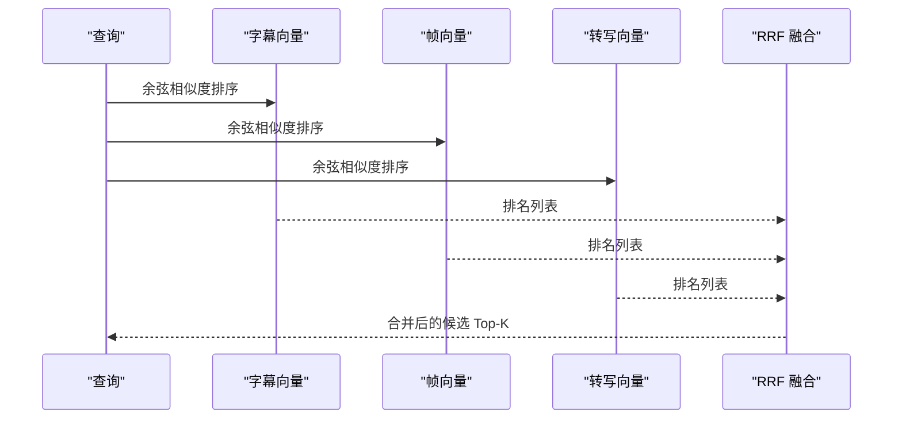
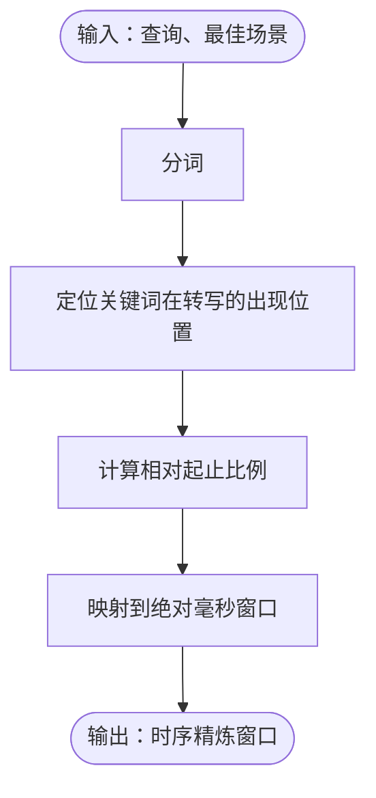
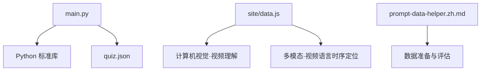

# 视频理解

<cite>
**本文引用的文件**
- [main.py](file://phases/19-capstone-projects/12-video-understanding-pipeline/code/main.py)
- [quiz.json](file://phases/19-capstone-projects/12-video-understanding-pipeline/quiz.json)
- [data.js](file://site/data.js)
- [README.md](file://README.md)
- [ROADMAP.md](file://ROADMAP.md)
- [prompt-data-helper.zh.md](file://phases/00-setup-and-tooling/09-data-management/outputs/prompt-data-helper.zh.md)
</cite>

## 目录
1. [引言](#引言)
2. [项目结构](#项目结构)
3. [核心组件](#核心组件)
4. [架构总览](#架构总览)
5. [详细组件分析](#详细组件分析)
6. [依赖关系分析](#依赖关系分析)
7. [性能考量](#性能考量)
8. [故障排查指南](#故障排查指南)
9. [结论](#结论)
10. [附录](#附录)

## 引言
本课程围绕“视频理解”的关键任务与挑战展开：如何在视频中同时建模空间与时间信息，完成视频分类、动作识别、行为分析、视频检索与时序定位等任务。我们将系统讲解三类主流架构范式（2D + 池化、3D 卷积、时空 Transformer），以及帧采样策略、注意力机制、光流估计与时空特征提取等核心技术；并通过一个可运行的多向量场景索引与召回融合（RRF）流水线，演示从查询到时序精炼（temporal grounding）的完整流程。

## 项目结构
本仓库将视频理解作为计算机视觉阶段的重要一环，并配套端到端的流水线示例与评估要点。核心位置如下：
- 计算机视觉阶段第 12 课“视频理解——时序建模”：提供架构选型、数据与评估要点的系统性知识。
- 能力提升阶段第 12 课“视频理解流水线”：以 Python 示例展示多向量场景索引、三通道并行检索与 RRF 融合、时序精炼等关键步骤。
- 多模态阶段第 17 课“视频-语言时序定位”：进一步引入跨模态对齐与时序定位的工程实践。
- 数据管理与数据集辅助：提供数据集选择与准备的提示词与参考清单。

**章节来源**
- [README.md: 第 363 行](file://README.md#L363)
- [data.js: 第 728–734 行:728-734](file://site/data.js#L728-L734)
- [ROADMAP.md: 第 292–320 行:292-320](file://ROADMAP.md#L292-L320)

## 核心组件
本课程的“视频理解流水线”示例由以下核心组件构成：
- 场景记录与多向量表示：每个场景包含字幕、转写文本与帧级标签（作为帧嵌入的占位），并生成三路向量表示。
- 查询与三路检索：对查询分别与三路向量进行相似度排序。
- RRF 融合：对三个排序列表按 Reciprocal Rank Fusion 合并，得到最终候选。
- 时序精炼（Temporal Grounding）：在最佳场景内基于查询关键词在转写中的位置，粗略估计起止窗口。

**图表来源**
- [main.py: 第 59–62 行:59-62](file://phases/19-capstone-projects/12-video-understanding-pipeline/code/main.py#L59-L62)
- [main.py: 第 91–108 行:91-108](file://phases/19-capstone-projects/12-video-understanding-pipeline/code/main.py#L91-L108)
- [main.py: 第 115–129 行:115-129](file://phases/19-capstone-projects/12-video-understanding-pipeline/code/main.py#L115-L129)

**章节来源**
- [main.py: 第 46–63 行:46-63](file://phases/19-capstone-projects/12-video-understanding-pipeline/code/main.py#L46-L63)
- [main.py: 第 91–108 行:91-108](file://phases/19-capstone-projects/12-video-understanding-pipeline/code/main.py#L91-L108)
- [main.py: 第 115–129 行:115-129](file://phases/19-capson-projects/12-video-understanding-pipeline/code/main.py#L115-L129)

## 架构总览
视频理解的三大架构家族与适用场景：
- 2D + 池化：将时间视为序列，用 2D 视觉主干 + 时间池化或插值，适合资源受限与强调外观的场景。
- 3D 卷积：直接在时空立方体上建模，强调运动与形变，常用于动作识别与行为分析。
- 时空 Transformer：将视频帧序列化后用自注意力建模长程依赖，适合复杂时序逻辑与细粒度定位。

**章节来源**
- [data.js: 第 728–734 行:728-734](file://site/data.js#L728-L734)

## 详细组件分析

### 场景记录与多向量表示
- 字段：视频 ID、场景 ID、起止毫秒、字幕、转写、帧标签（占位为帧嵌入特征）。
- 方法：对字幕、帧标签、转写分别生成向量，作为后续检索的基础。
- 关键点：向量维度与归一化，确保余弦相似度稳定有效。

**图表来源**
- [main.py: 第 46–63 行:46-63](file://phases/19-capstone-projects/12-video-understanding-pipeline/code/main.py#L46-L63)

**章节来源**
- [main.py: 第 46–63 行:46-63](file://phases/19-capstone-projects/12-video-understanding-pipeline/code/main.py#L46-L63)

### 三路检索与 RRF 融合
- 对查询向量与三路向量分别做相似度排序。
- 使用 Reciprocal Rank Fusion 合并三个排序列表，缓解单一模态偏差。
- 输出前 K 个场景作为候选。

**图表来源**
- [main.py: 第 91–108 行:91-108](file://phases/19-capstone-projects/12-video-understanding-pipeline/code/main.py#L91-L108)

**章节来源**
- [main.py: 第 91–108 行:91-108](file://phases/19-capstone-projects/12-video-understanding-pipeline/code/main.py#L91-L108)

### 时序精炼（Temporal Grounding）
- 输入：查询与最佳场景。
- 方法：在转写中定位查询关键词首次与末次出现的位置，据此估算窗口的相对比例，再映射到绝对毫秒范围。
- 边界处理：若无关键词或为空，则返回原场景窗口。

**图表来源**
- [main.py: 第 115–129 行:115-129](file://phases/19-capstone-projects/12-video-understanding-pipeline/code/main.py#L115-L129)

**章节来源**
- [main.py: 第 115–129 行:115-129](file://phases/19-capstone-projects/12-video-understanding-pipeline/code/main.py#L115-L129)

### 典型任务与解决方案
- 视频分类：以 2D + 池化或 3D 卷积为主，强调外观特征与运动特征的组合。
- 动作检测/定位：利用时空 Transformer 或 3D 卷积，配合时序精炼，输出事件起止窗口。
- 视频检索：以多向量索引（字幕、帧、转写）并行检索，RRF 融合，再做时序精炼。
- 多模态融合：视频-语言对齐（如 CLIP 思想）与跨模态检索，结合时序定位。

**章节来源**
- [data.js: 第 728–734 行:728-734](file://site/data.js#L728-L734)
- [ROADMAP.md: 第 312 行](file://ROADMAP.md#L312)

## 依赖关系分析
- 代码依赖：示例脚本依赖 Python 内置库（正则、随机、数学、数据类、默认字典）。
- 数据与评估：课程提供数据集选择与准备的提示词，便于快速落地。
- 多模态支撑：多模态阶段提供视频-语言时序定位与跨模态检索的工程经验。

**图表来源**
- [main.py: 第 12–18 行:12-18](file://phases/19-capstone-projects/12-video-understanding-pipeline/code/main.py#L12-L18)
- [quiz.json: 第 35–78 行:35-78](file://phases/19-capstone-projects/12-video-understanding-pipeline/quiz.json#L35-L78)
- [data.js: 第 728–734 行:728-734](file://site/data.js#L728-L734)
- [ROADMAP.md: 第 312 行](file://ROADMAP.md#L312)
- [prompt-data-helper.zh.md: 第 32–47 行:32-47](file://phases/00-setup-and-tooling/09-data-management/outputs/prompt-data-helper.zh.md#L32-L47)

**章节来源**
- [main.py: 第 12–18 行:12-18](file://phases/19-capstone-projects/12-video-understanding-pipeline/code/main.py#L12-L18)
- [quiz.json: 第 35–78 行:35-78](file://phases/19-capstone-projects/12-video-understanding-pipeline/quiz.json#L35-L78)
- [data.js: 第 728–734 行:728-734](file://site/data.js#L728-L734)
- [ROADMAP.md: 第 312 行](file://ROADMAP.md#L312)
- [prompt-data-helper.zh.md: 第 32–47 行:32-47](file://phases/00-setup-and-tooling/09-data-management/outputs/prompt-data-helper.zh.md#L32-L47)

## 性能考量
- 向量维度与归一化：控制嵌入维度与单位化，有助于相似度稳定与加速。
- 检索策略：三路并行检索与 RRF 融合，兼顾召回与稳定性。
- 时序精炼：基于关键词位置的窗口估计，避免全时序扫描，提高交互效率。
- 架构选型：依据数据规模、计算预算与任务侧重（外观 vs 运动）选择 2D + 池化、3D 卷积或时空 Transformer。

## 故障排查指南
- 帧采样审计：检查采样边界（off-by-one）、短片段处理与裁剪一致性，避免时序错位。
- 评估指标：关注时序定位的 IoU、接受率、MRR 等指标，针对特定问题类别（如计数与动作顺序）进行专项评估。
- 多模态对齐：注意跨模态融合的早期/晚期策略差异，确保投影空间一致与相似度可比。

**章节来源**
- [data.js: 第 7160–7196 行:7160-7196](file://site/data.js#L7160-L7196)
- [quiz.json: 第 35–78 行:35-78](file://phases/19-capstone-projects/12-video-understanding-pipeline/quiz.json#L35-L78)

## 结论
通过“视频理解流水线”示例，我们系统展示了从多向量场景索引、三路检索与 RRF 融合，到时序精炼的完整技术路径。结合计算机视觉与多模态阶段的知识，可灵活选配 2D + 池化、3D 卷积与时空 Transformer 等架构，并在视频分类、动作检测、视频检索与跨模态定位等任务中取得稳健效果。

## 附录

### 课程与资料索引
- 计算机视觉·视频理解（时序建模）：提供架构选型、数据与评估要点。
- 能力提升·视频理解流水线：可运行示例，涵盖多向量索引、RRF 融合与时序精炼。
- 多模态·视频语言时序定位：跨模态对齐与时序定位工程实践。
- 数据与评估：数据集选择与准备提示词，帮助快速落地。

**章节来源**
- [README.md: 第 363 行](file://README.md#L363)
- [data.js: 第 728–734 行:728-734](file://site/data.js#L728-L734)
- [ROADMAP.md: 第 292–320 行:292-320](file://ROADMAP.md#L292-L320)
- [prompt-data-helper.zh.md: 第 32–47 行:32-47](file://phases/00-setup-and-tooling/09-data-management/outputs/prompt-data-helper.zh.md#L32-L47)