# 计算机视觉

<cite>
**本文引用的文件**
- [计算机视觉阶段总览](file://phases/04-computer-vision/README.md)
- [图像基础：像素、通道与色彩空间](file://phases/04-computer-vision/01-image-fundamentals/docs/en.md)
- [从零实现卷积：输出尺寸与核设计](file://phases/04-computer-vision/02-convolutions-from-scratch/docs/en.md)
- [从LeNet到ResNet：经典CNN架构](file://phases/04-computer-vision/03-cnns-lenet-to-resnet/docs/en.md)
- [图像分类与迁移学习](file://phases/04-computer-vision/04-image-classification/docs/en.md)
- [目标检测：YOLO从零实现](file://phases/04-computer-vision/06-object-detection-yolo/docs/en.md)
- [语义分割：U-Net从零实现](file://phases/04-computer-vision/07-semantic-segmentation-unet/docs/en.md)
- [图像生成：GANs](file://phases/04-computer-vision/09-image-generation-gans/docs/en.md)
- [图像生成：扩散模型（DDPM）](file://phases/04-computer-vision/10-image-generation-diffusion/docs/en.md)
- [Stable Diffusion：架构与微调](file://phases/04-computer-vision/11-stable-diffusion/docs/en.md)
- [视觉Transformer（ViT）](file://phases/04-computer-vision/14-vision-transformers/docs/en.md)
- [开放词汇视觉：CLIP](file://phases/04-computer-vision/18-open-vocab-clip/docs/en.md)
</cite>

## 目录
1. [引言](#引言)
2. [项目结构](#项目结构)
3. [核心组件](#核心组件)
4. [架构总览](#架构总览)
5. [详细组件分析](#详细组件分析)
6. [依赖关系分析](#依赖关系分析)
7. [性能考虑](#性能考虑)
8. [故障排查指南](#故障排查指南)
9. [结论](#结论)
10. [附录](#附录)

## 引言
本课程面向“从像素到理解”的计算机视觉学习路径，覆盖图像处理基础、卷积神经网络、目标检测、语义分割、图像生成与多模态视觉模型（如ViT与CLIP）。课程以动手实践为主，结合理论推导与工程化实现，帮助学习者建立从底层像素操作到高层视觉任务的完整知识体系，并掌握现代视觉系统的关键设计思想与工程技巧。

## 项目结构
计算机视觉课程位于 phases/04-computer-vision 目录下，按主题划分为多个独立的“构建+学习”模块，每个模块包含：
- docs/en.md：概念讲解、公式推导与实现要点
- code/main.py：可运行的示例脚本或框架
- outputs/*：用于工程检查与技能训练的提示词与技能清单
- quiz.json / quiz.zh.json：自测题目

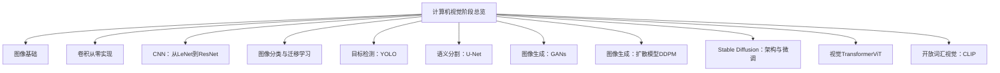

图表来源
- [计算机视觉阶段总览](file://phases/04-computer-vision/README.md)

章节来源
- [计算机视觉阶段总览](file://phases/04-computer-vision/README.md)

## 核心组件
本课程围绕以下核心主题展开：
- 图像预处理与张量规范：统一输入布局、颜色空间转换、标准化流程
- 卷积与感受野：输出尺寸计算、核设计、im2col向量化
- 经典CNN架构：LeNet、VGG风格堆叠、ResNet残差连接
- 检测与分割：网格+锚框、非极大值抑制、U-Net编码器-解码器+跳跃连接
- 生成模型：GAN对抗训练、扩散模型前向/反向过程、Stable Diffusion潜空间与CFG
- 多模态视觉：ViT图像块嵌入、CLIP对比学习与零样本分类

章节来源
- [图像基础：像素、通道与色彩空间](file://phases/04-computer-vision/01-image-fundamentals/docs/en.md)
- [从零实现卷积：输出尺寸与核设计](file://phases/04-computer-vision/02-convolutions-from-scratch/docs/en.md)
- [从LeNet到ResNet：经典CNN架构](file://phases/04-computer-vision/03-cnns-lenet-to-resnet/docs/en.md)
- [目标检测：YOLO从零实现](file://phases/04-computer-vision/06-object-detection-yolo/docs/en.md)
- [语义分割：U-Net从零实现](file://phases/04-computer-vision/07-semantic-segmentation-unet/docs/en.md)
- [图像生成：GANs](file://phases/04-computer-vision/09-image-generation-gans/docs/en.md)
- [图像生成：扩散模型（DDPM）](file://phases/04-computer-vision/10-image-generation-diffusion/docs/en.md)
- [Stable Diffusion：架构与微调](file://phases/04-computer-vision/11-stable-diffusion/docs/en.md)
- [视觉Transformer（ViT）](file://phases/04-computer-vision/14-vision-transformers/docs/en.md)
- [开放词汇视觉：CLIP](file://phases/04-computer-vision/18-open-vocab-clip/docs/en.md)

## 架构总览
下面给出从图像到多模态视觉任务的整体架构视图，展示数据流与关键模块之间的关系。

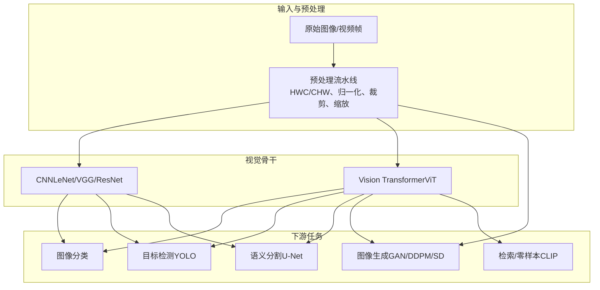

图表来源
- [图像基础：像素、通道与色彩空间](file://phases/04-computer-vision/01-image-fundamentals/docs/en.md)
- [从LeNet到ResNet：经典CNN架构](file://phases/04-computer-vision/03-cnns-lenet-to-resnet/docs/en.md)
- [视觉Transformer（ViT）](file://phases/04-computer-vision/14-vision-transformers/docs/en.md)
- [目标检测：YOLO从零实现](file://phases/04-computer-vision/06-object-detection-yolo/docs/en.md)
- [语义分割：U-Net从零实现](file://phases/04-computer-vision/07-semantic-segmentation-unet/docs/en.md)
- [图像生成：扩散模型（DDPM）](file://phases/04-computer-vision/10-image-generation-diffusion/docs/en.md)
- [Stable Diffusion：架构与微调](file://phases/04-computer-vision/11-stable-diffusion/docs/en.md)
- [开放词汇视觉：CLIP](file://phases/04-computer-vision/18-open-vocab-clip/docs/en.md)

## 详细组件分析

### 图像基础：像素、通道与色彩空间
- 关键点
  - 像素是光子采样的离散结果；通道顺序（HWC/CHW）与数据类型（uint8/float32）决定后续处理
  - 颜色空间：RGB、HSV、YCbCr、灰度；灰度由加权和定义（匹配人眼感知）
  - 预处理流水线：解码、色彩空间转换、缩放、中心裁剪、归一化、转轴、批维度扩展
  - 插值策略：最近邻（标签）、双线性（训练）、三次/兰索斯（显示）

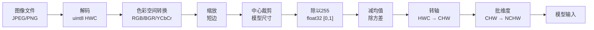

图表来源
- [图像基础：像素、通道与色彩空间](file://phases/04-computer-vision/01-image-fundamentals/docs/en.md)

章节来源
- [图像基础：像素、通道与色彩空间](file://phases/04-computer-vision/01-image-fundamentals/docs/en.md)

### 卷积从零实现：输出尺寸与核设计
- 关键点
  - 输出尺寸公式：H_out = floor((H - K + 2P) / S) + 1
  - 填充策略：零填充、反射、复制、环形
  - 步幅：默认1，stride=2常用于降采样
  - 多通道卷积：每个输入通道对应一个K×K核，逐通道相乘求和
  - im2col技巧：将所有感受野窗口展平为列，卷积变为一次GEMM
  - 受 receptive field 影响：两层3×3等效一层5×5但参数更少且含额外非线性

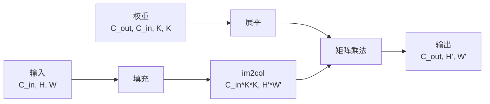

图表来源
- [从零实现卷积：输出尺寸与核设计](file://phases/04-computer-vision/02-convolutions-from-scratch/docs/en.md)

章节来源
- [从零实现卷积：输出尺寸与核设计](file://phases/04-computer-vision/02-convolutions-from-scratch/docs/en.md)

### 经典CNN架构：LeNet、VGG、ResNet
- 关键点
  - LeNet-5：两段卷积+池化+全连接，奠定CNN模板
  - VGG：仅使用3×3堆叠，深度优先；两层3×3等效一层5×5且参数更少
  - ResNet：引入残差连接解决深度退化问题；Identity skip + 批归一化 + ReLU
  - 现代变体：BasicBlock（两3×3）与Bottleneck（1×1→3×3→1×1）在高通道时更高效

```mermaid
flowchart LR
subgraph "残差块"
X["输入 x"] --> F["F(x)<br/>conv + BN + ReLU<br/>conv + BN"]
X -.->|"恒等跳跃|"+["+"]
F --> "+" --> RELU["ReLU"]
"+" --> Y["输出 y"]
end
```

图表来源
- [从LeNet到ResNet：经典CNN架构](file://phases/04-computer-vision/03-cnns-lenet-to-resnet/docs/en.md)

章节来源
- [从LeNet到ResNet：经典CNN架构](file://phases/04-computer-vision/03-cnns-lenet-to-resnet/docs/en.md)

### 目标检测：YOLO从零实现
- 关键点
  - 网格+锚框：将检测转化为密集预测；每个网格预测B个框（tx,ty,tw,th）、对象性分数与类别概率
  - 解码：sigmoid(tx,ty)+网格坐标、exp(tw,th)×锚框宽高、stride还原像素坐标
  - IoU与NMS：IoU作为相似度，NMS去重；阈值通常0.45
  - 损失：框回归（MSE或CIoU/DIoU）、对象性（正负样本）、分类（交叉熵），加权组合
  - 指标：Precision@0.5、Recall@0.5、AP@0.5、mAP@0.5:0.95

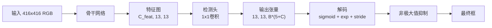

图表来源
- [目标检测：YOLO从零实现](file://phases/04-computer-vision/06-object-detection-yolo/docs/en.md)

章节来源
- [目标检测：YOLO从零实现](file://phases/04-computer-vision/06-object-detection-yolo/docs/en.md)

### 语义分割：U-Net从零实现
- 关键点
  - 结构：编码器逐步下采样+通道加深，瓶颈后解码器上采样，跳跃连接融合细节
  - 上采样：转置卷积或双线性插值+卷积；后者更稳定
  - 损失：交叉熵、Dice损失或二者组合；Dice对类别不平衡鲁棒
  - 评估：IoU（mIoU）、Dice、边界F1；报告每类IoU避免被多数类掩盖
  - 输入分辨率权衡：内存与精度；常用256×256起步，医学图像可达1024×1024

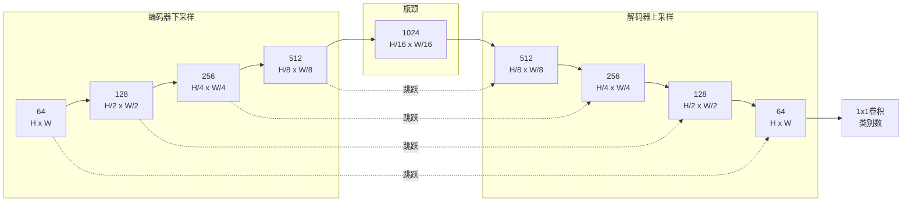

图表来源
- [语义分割：U-Net从零实现](file://phases/04-computer-vision/07-semantic-segmentation-unet/docs/en.md)

章节来源
- [语义分割：U-Net从零实现](file://phases/04-computer-vision/07-semantic-segmentation-unet/docs/en.md)

### 图像生成：GANs
- 关键点
  - 最小化-最大化博弈：min_G max_D E_x[log D(x)] + E_z[log(1 - D(G(z)))]
  - 非饱和损失：G采用-log D(G(z))，缓解早期梯度消失
  - DCGAN五条规则：下采样/上采样用步幅卷积、BN（G输出/D输入除外）、无全连接、G用ReLU（输出tanh）、D用LeakyReLU
  - 失败模式：模式崩溃（样本多样性下降）、判别器占优（G梯度消失）、震荡（G/D交替获胜）
  - 评估：样本直观检查、FID、Inception Score、Precision/Recall

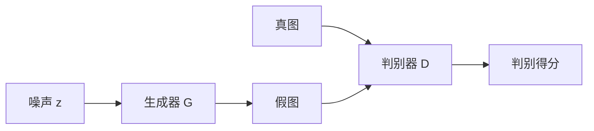

图表来源
- [图像生成：GANs](file://phases/04-computer-vision/09-image-generation-gans/docs/en.md)

章节来源
- [图像生成：GANs](file://phases/04-computer-vision/09-image-generation-gans/docs/en.md)

### 图像生成：扩散模型（DDPM）
- 关键点
  - 前向加噪：q(x_t|x_{t-1}) = N(√(1-β_t)*x_{t-1}, β_t*I)，T步后近似纯高斯
  - 闭式形式：q(x_t|x_0)=N(√ᾱ_t*x_0, (1-ᾱ_t)*I)
  - 反向采样：学习噪声预测ε_θ(x_t,t)，按贝叶斯推导的条件逐步去噪
  - 训练目标：对随机t，预测ε，MSE最小化
  - 采样：DDPM（渐进高斯）、DDIM（确定性快速采样）
  - 时间条件：正弦时间嵌入注入到U-Net各层

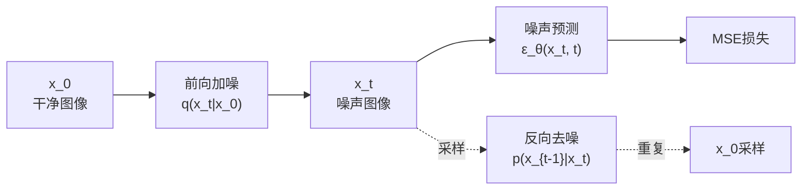

图表来源
- [图像生成：扩散模型（DDPM）](file://phases/04-computer-vision/10-image-generation-diffusion/docs/en.md)

章节来源
- [图像生成：扩散模型（DDPM）](file://phases/04-computer-vision/10-image-generation-diffusion/docs/en.md)

### Stable Diffusion：架构与微调
- 关键点
  - 潜空间扩散：VAE将3×512×512映射到4×64×64潜变量，训练/推理均大幅降维
  - 文本条件：CLIP文本编码器，跨注意力将文本嵌入注入U-Net
  - 采样器：DDIM、Euler、DPM-Solver++等，可替换
  - 分类器自由引导（CFG）：同时预测条件与无条件噪声，线性混合增强提示词影响
  - LoRA微调：冻结主干，在注意力中注入低秩适配，轻量高效

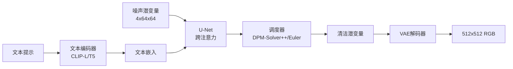

图表来源
- [Stable Diffusion：架构与微调](file://phases/04-computer-vision/11-stable-diffusion/docs/en.md)

章节来源
- [Stable Diffusion：架构与微调](file://phases/04-computer-vision/11-stable-diffusion/docs/en.md)

### 视觉Transformer（ViT）
- 关键点
  - 将图像切分为补丁，经16×16卷积投影为序列token，附加[CLS]与位置嵌入
  - 预LayerNorm + 多头自注意力 + MLP，堆叠若干层
  - 训练：DeiT（强aug、随机深度、重复增强、蒸馏）；MAE（掩码自编码器）
  - 对比：Swin（局部窗口注意力）、ConvNeXt（现代CNN设计）

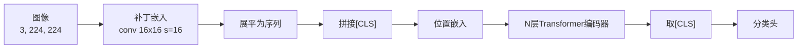

图表来源
- [视觉Transformer（ViT）](file://phases/04-computer-vision/14-vision-transformers/docs/en.md)

章节来源
- [视觉Transformer（ViT）](file://phases/04-computer-vision/14-vision-transformers/docs/en.md)

### 开放词汇视觉：CLIP
- 关键点
  - 双塔架构：图像编码器（ViT）+ 文本编码器（Transformer），投影至共享嵌入空间
  - 对比学习：对称损失，使匹配对相似度高、不匹配对低
  - 零样本分类：对每个类别构造提示词，计算余弦相似度，argmax得到类别
  - 应用：零样本分类、检索、文本条件检测/分割、VLMs、文生图

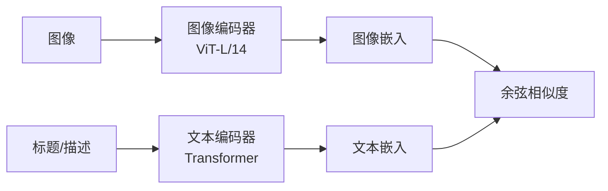

图表来源
- [开放词汇视觉：CLIP](file://phases/04-computer-vision/18-open-vocab-clip/docs/en.md)

章节来源
- [开放词汇视觉：CLIP](file://phases/04-computer-vision/18-open-vocab-clip/docs/en.md)

## 依赖关系分析
- 数据与预处理
  - 所有视觉任务均依赖统一的预处理流水线（HWC/CHW、归一化、裁剪、缩放）
- 骨干网络
  - CNN（LeNet/VGG/ResNet）与ViT分别作为通用特征提取器
- 下游任务
  - 分类：直接在骨干后接全局池化+分类头
  - 检测：在骨干特征图上叠加检测头，解码为框、对象性与类别
  - 分割：U-Net编码器-解码器+跳跃连接
  - 生成：VAE（冻结）+ 文本编码器（可选）+ U-Net（扩散）/GAN生成器
  - 多模态：CLIP双塔+零样本分类/检索

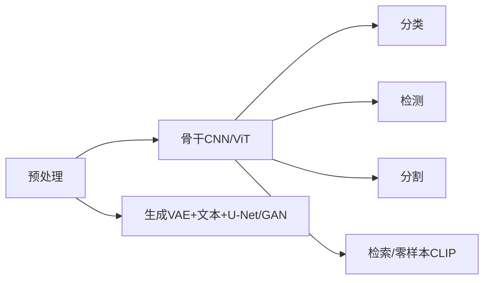

图表来源
- [图像基础：像素、通道与色彩空间](file://phases/04-computer-vision/01-image-fundamentals/docs/en.md)
- [从LeNet到ResNet：经典CNN架构](file://phases/04-computer-vision/03-cnns-lenet-to-resnet/docs/en.md)
- [视觉Transformer（ViT）](file://phases/04-computer-vision/14-vision-transformers/docs/en.md)
- [目标检测：YOLO从零实现](file://phases/04-computer-vision/06-object-detection-yolo/docs/en.md)
- [语义分割：U-Net从零实现](file://phases/04-computer-vision/07-semantic-segmentation-unet/docs/en.md)
- [图像生成：扩散模型（DDPM）](file://phases/04-computer-vision/10-image-generation-diffusion/docs/en.md)
- [图像生成：GANs](file://phases/04-computer-vision/09-image-generation-gans/docs/en.md)
- [开放词汇视觉：CLIP](file://phases/04-computer-vision/18-open-vocab-clip/docs/en.md)

## 性能考虑
- 预处理
  - 使用正确的布局与dtype，避免隐式转换带来的错误与性能损耗
  - 合理选择插值方式：训练用双线性，显示用三次/兰索斯，标签用最近邻
- 卷积
  - im2col将卷积转为GEMM，结合BLAS与GPU内核获得最佳吞吐
  - 合理设置padding与stride，平衡感受野与计算成本
- 检测
  - 锚框设计：基于数据集的(w,h)聚类，按FPN层级分配
  - NMS阈值与置信度阈值需结合任务严格调参
- 分割
  - Dice损失缓解类别不平衡；组合损失在不同阶段互补
  - 输入分辨率与内存预算权衡，必要时分块/瓦片推理
- 生成
  - GAN稳定性：非饱和损失、谱归一化、TTUR、标签平滑
  - 扩散采样：DDIM等更快采样器；潜空间扩散显著降低显存与延迟
  - SD微调：LoRA低秩适配，显著减少参数更新与显存占用
- 多模态
  - CLIP零样本效果受提示词模板影响，模板平均可提升精度
  - 检索可离线索引（FAISS）加速查询

## 故障排查指南
- 预处理与输入
  - 症状：模型运行但指标异常
  - 排查：确认dtype、布局、归一化统计是否与模型期望一致
  - 参考：预处理流水线与反变换
- 检测
  - 症状：漏检/误检/重复框
  - 排查：IoU阈值、NMS实现、锚框大小与数量、损失权重
- 分割
  - 症状：边界模糊/小物体召回低
  - 排查：Dice损失、评估指标（IoU/Dice）、输入分辨率
- 生成
  - 症状：模式崩溃/判别器过强/震荡
  - 排查：学习率比例（TTUR）、谱归一化、损失函数与正则
- 多模态
  - 症状：零样本效果差
  - 排查：提示词模板质量与数量、温度参数、嵌入归一化

章节来源
- [图像基础：像素、通道与色彩空间](file://phases/04-computer-vision/01-image-fundamentals/docs/en.md)
- [目标检测：YOLO从零实现](file://phases/04-computer-vision/06-object-detection-yolo/docs/en.md)
- [语义分割：U-Net从零实现](file://phases/04-computer-vision/07-semantic-segmentation-unet/docs/en.md)
- [图像生成：GANs](file://phases/04-computer-vision/09-image-generation-gans/docs/en.md)
- [图像生成：扩散模型（DDPM）](file://phases/04-computer-vision/10-image-generation-diffusion/docs/en.md)
- [开放词汇视觉：CLIP](file://phases/04-computer-vision/18-open-vocab-clip/docs/en.md)

## 结论
本课程通过从像素到多模态的系统化学习，帮助学习者掌握计算机视觉的核心原理与工程实现。建议按顺序完成：图像预处理 → 卷积与感受野 → 经典CNN → 检测/分割 → 生成模型 → ViT与CLIP。在此基础上，结合工程化实践（如LoRA微调、推理优化、指标诊断）可快速落地真实项目。

## 附录
- 实践建议
  - 每个模块完成后，对照outputs/*中的提示词与技能进行自我检查
  - 在合成数据集上验证算法正确性，再迁移到真实数据
  - 注重可视化与中间结果检查，便于定位问题
- 进一步阅读
  - 各模块末尾提供了进一步阅读材料链接，建议按兴趣深入