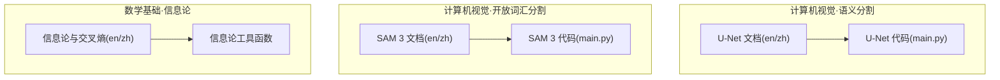
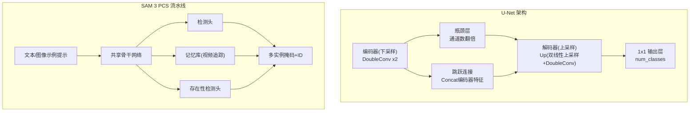
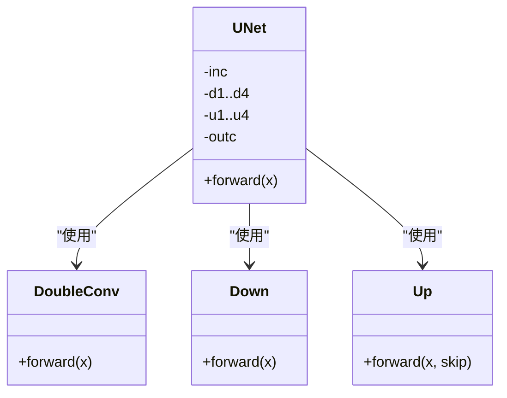
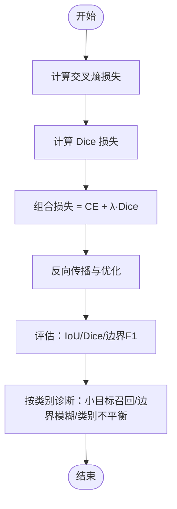
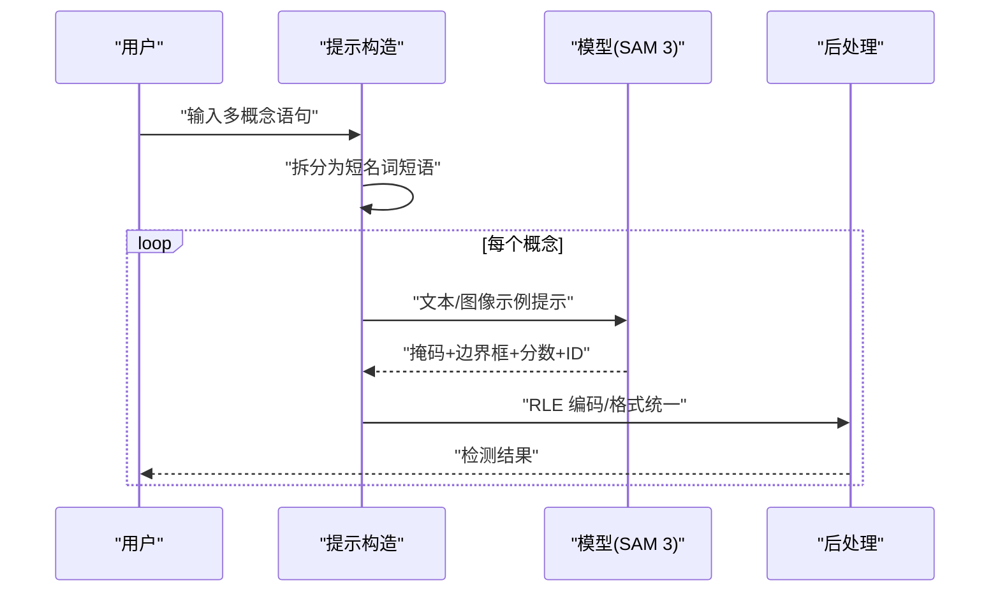
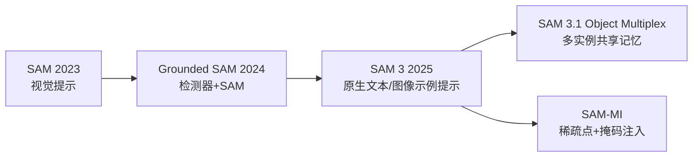
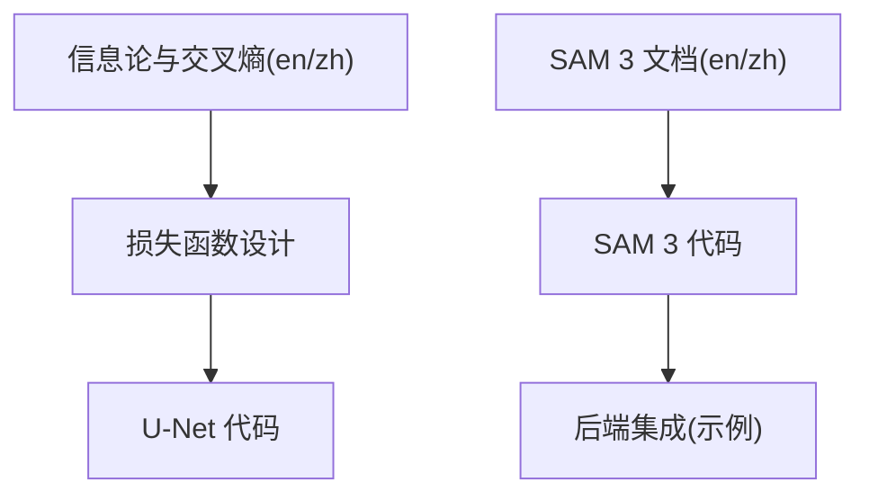

# 语义分割

<cite>
**本文引用的文件**
- [语义分割—U-Net 文档（英文）](file://phases/04-computer-vision/07-semantic-segmentation-unet/docs/en.md)
- [语义分割—U-Net 文档（中文）](file://phases/04-computer-vision/07-semantic-segmentation-unet/docs/zh.md)
- [语义分割—U-Net 代码](file://phases/04-computer-vision/07-semantic-segmentation-unet/code/main.py)
- [开放词汇分割—SAM 3 文档（英文）](file://phases/04-computer-vision/24-sam3-open-vocab-segmentation/docs/en.md)
- [开放词汇分割—SAM 3 文档（中文）](file://phases/04-computer-vision/24-sam3-open-vocab-segmentation/docs/zh.md)
- [开放词汇分割—SAM 3 代码](file://phases/04-computer-vision/24-sam3-open-vocab-segmentation/code/main.py)
- [信息论与交叉熵（英文）](file://phases/01-math-foundations/09-information-theory/docs/en.md)
- [信息论与交叉熵（中文）](file://phases/01-math-foundations/09-information-theory/docs/zh.md)
- [信息论工具函数（代码）](file://phases/01-math-foundations/09-information-theory/code/information_theory.py)
</cite>

## 目录
1. [引言](#引言)
2. [项目结构](#项目结构)
3. [核心组件](#核心组件)
4. [架构总览](#架构总览)
5. [详细组件分析](#详细组件分析)
6. [依赖分析](#依赖分析)
7. [性能考虑](#性能考虑)
8. [故障排查指南](#故障排查指南)
9. [结论](#结论)
10. [附录](#附录)

## 引言
本课程围绕“语义分割”展开，系统讲解像素级分类任务的挑战与解决方案，重点包括：
- 任务定义与应用场景：医学影像、自动驾驶、卫星遥感、文档理解、机器人抓取等。
- U-Net 编码器-解码器结构与跳跃连接的设计思想。
- 损失函数设计：交叉熵、Dice 损失及组合策略。
- 评估指标：IoU、Dice、边界 F1 等。
- 数据增强与后处理：几何变换、颜色抖动、RLE 编码等。
- 扩展应用：实例分割、全景分割。
- 开放词汇分割：SAM 3 的概念提示分割（PCS）与端到端流水线。

## 项目结构
本课程涉及计算机视觉阶段的两个核心模块：
- 语义分割（U-Net）：从零实现编码器-解码器、跳跃连接、损失与评估。
- 开放词汇分割（SAM 3）：文本/图像示例提示下的端到端分割与视频追踪。

图表来源
- [语义分割—U-Net 文档（英文）](file://phases/04-computer-vision/07-semantic-segmentation-unet/docs/en.md)
- [语义分割—U-Net 文档（中文）](file://phases/04-computer-vision/07-semantic-segmentation-unet/docs/zh.md)
- [语义分割—U-Net 代码](file://phases/04-computer-vision/07-semantic-segmentation-unet/code/main.py)
- [开放词汇分割—SAM 3 文档（英文）](file://phases/04-computer-vision/24-sam3-open-vocab-segmentation/docs/en.md)
- [开放词汇分割—SAM 3 文档（中文）](file://phases/04-computer-vision/24-sam3-open-vocab-segmentation/docs/zh.md)
- [开放词汇分割—SAM 3 代码](file://phases/04-computer-vision/24-sam3-open-vocab-segmentation/code/main.py)
- [信息论与交叉熵（英文）](file://phases/01-math-foundations/09-information-theory/docs/en.md)
- [信息论与交叉熵（中文）](file://phases/01-math-foundations/09-information-theory/docs/zh.md)
- [信息论工具函数（代码）](file://phases/01-math-foundations/09-information-theory/code/information_theory.py)

章节来源
- [语义分割—U-Net 文档（英文）](file://phases/04-computer-vision/07-semantic-segmentation-unet/docs/en.md)
- [开放词汇分割—SAM 3 文档（英文）](file://phases/04-computer-vision/24-sam3-open-vocab-segmentation/docs/en.md)

## 核心组件
- U-Net 编码器-解码器与跳跃连接：通过下采样获取全局上下文，再通过上采样恢复空间细节，并用跳跃连接融合高层语义与低层细节。
- 损失函数：像素级交叉熵用于稳定梯度，Dice 损失关注掩膜重叠与类别平衡，二者组合提升收敛与边界精度。
- 评估指标：IoU（mIoU）、Dice、边界 F1，强调按类别报告与避免均值掩盖问题。
- 数据与后处理：合成数据集验证端到端流程；RLE 编码降低掩码体积。
- 开放词汇分割：SAM 3 的概念提示分割（PCS），支持文本或图像示例提示，单次前向返回多实例掩码与 ID，并具备视频追踪能力。

章节来源
- [语义分割—U-Net 文档（中文）](file://phases/04-computer-vision/07-semantic-segmentation-unet/docs/zh.md)
- [语义分割—U-Net 文档（英文）](file://phases/04-computer-vision/07-semantic-segmentation-unet/docs/en.md)
- [开放词汇分割—SAM 3 文档（中文）](file://phases/04-computer-vision/24-sam3-open-vocab-segmentation/docs/zh.md)
- [开放词汇分割—SAM 3 文档（英文）](file://phases/04-computer-vision/24-sam3-open-vocab-segmentation/docs/en.md)

## 架构总览
下图展示 U-Net 的编码器-解码器与跳跃连接，以及 SAM 3 的概念提示分割（PCS）端到端流程。

图表来源
- [语义分割—U-Net 文档（英文）](file://phases/04-computer-vision/07-semantic-segmentation-unet/docs/en.md)
- [开放词汇分割—SAM 3 文档（英文）](file://phases/04-computer-vision/24-sam3-open-vocab-segmentation/docs/en.md)

## 详细组件分析

### U-Net 组件详解
- 编码器块（DoubleConv）：两个 3x3 卷积 + BN + ReLU，通道数逐步增加。
- 下采样块（Down）：最大池化 + DoubleConv，空间分辨率减半。
- 上采样块（Up）：双线性上采样 + DoubleConv，尺寸与编码器对应层对齐后拼接。
- 跳跃连接：在每个分辨率上将编码器特征与解码器特征拼接，保留边缘细节。
- 输出层：1x1 卷积映射到类别通道，得到 H×W×C 的像素级分类。

图表来源
- [语义分割—U-Net 代码](file://phases/04-computer-vision/07-semantic-segmentation-unet/code/main.py)

章节来源
- [语义分割—U-Net 文档（中文）](file://phases/04-computer-vision/07-semantic-segmentation-unet/docs/zh.md)
- [语义分割—U-Net 文档（英文）](file://phases/04-computer-vision/07-semantic-segmentation-unet/docs/en.md)
- [语义分割—U-Net 代码](file://phases/04-computer-vision/07-semantic-segmentation-unet/code/main.py)

### 损失函数与评估指标
- 交叉熵损失：像素级分类的标准损失，天然支持多类。
- Dice 损失：直接优化预测与真值掩膜的重叠，对类别不平衡鲁棒。
- 组合损失：交叉熵 + λ·Dice，兼顾早期稳定与边界拟合。
- 评估指标：IoU（含按类别报告与 mIoU）、Dice、边界 F1；强调避免用 mIoU 掩盖个别类低分。

图表来源
- [语义分割—U-Net 文档（中文）](file://phases/04-computer-vision/07-semantic-segmentation-unet/docs/zh.md)
- [语义分割—U-Net 文档（英文）](file://phases/04-computer-vision/07-semantic-segmentation-unet/docs/en.md)

章节来源
- [语义分割—U-Net 文档（中文）](file://phases/04-computer-vision/07-semantic-segmentation-unet/docs/zh.md)
- [语义分割—U-Net 文档（英文）](file://phases/04-computer-vision/07-semantic-segmentation-unet/docs/en.md)

### 数据与后处理
- 合成数据集：在彩色背景上生成形状（圆/方），迫使模型学习形状而非颜色，便于端到端验证。
- RLE 编码：游程编码用于紧凑存储掩码，降低响应体积，兼容多模型输出格式。
- 多概念提示：将用户语句拆分为短名词短语，逐个概念执行 PCS，汇总检测结果。

图表来源
- [开放词汇分割—SAM 3 文档（中文）](file://phases/04-computer-vision/24-sam3-open-vocab-segmentation/docs/zh.md)
- [开放词汇分割—SAM 3 文档（英文）](file://phases/04-computer-vision/24-sam3-open-vocab-segmentation/docs/en.md)
- [开放词汇分割—SAM 3 代码](file://phases/04-computer-vision/24-sam3-open-vocab-segmentation/code/main.py)

章节来源
- [开放词汇分割—SAM 3 文档（中文）](file://phases/04-computer-vision/24-sam3-open-vocab-segmentation/docs/zh.md)
- [开放词汇分割—SAM 3 文档（英文）](file://phases/04-computer-vision/24-sam3-open-vocab-segmentation/docs/en.md)
- [开放词汇分割—SAM 3 代码](file://phases/04-computer-vision/24-sam3-open-vocab-segmentation/code/main.py)

### SAM 3 的概念提示分割（PCS）
- 三代模型对比：SAM（仅视觉提示）→ Grounded SAM（检测器+SAM）→ SAM 3（原生文本/图像示例提示）。
- 关键架构：共享骨干 + 检测头 + 记忆库（视频追踪）+ 存在性检测头 + 解耦检测-追踪。
- 输出格式统一：边界框、标签、分数、掩码、实例 ID，便于下游流水线复用。
- 性能与效率：Object Multiplex（SAM 3.1）实现多实例共享记忆，显著提升追踪速度；SAM-MI 通过稀疏点提示与掩码注入提速。

图表来源
- [开放词汇分割—SAM 3 文档（英文）](file://phases/04-computer-vision/24-sam3-open-vocab-segmentation/docs/en.md)
- [开放词汇分割—SAM 3 文档（中文）](file://phases/04-computer-vision/24-sam3-open-vocab-segmentation/docs/zh.md)

章节来源
- [开放词汇分割—SAM 3 文档（中文）](file://phases/04-computer-vision/24-sam3-open-vocab-segmentation/docs/zh.md)
- [开放词汇分割—SAM 3 文档（英文）](file://phases/04-computer-vision/24-sam3-open-vocab-segmentation/docs/en.md)

## 依赖分析
- 数学基础：信息论与交叉熵为损失函数提供理论支撑，理解“正确且自信”的代价与模型校准。
- U-Net 代码依赖：PyTorch 模块（卷积、BN、ReLU、上采样、交叉熵、softmax）。
- SAM 3 代码依赖：抽象接口与桩实现，便于替换真实后端（如 Hugging Face transformers）。

图表来源
- [信息论与交叉熵（英文）](file://phases/01-math-foundations/09-information-theory/docs/en.md)
- [信息论与交叉熵（中文）](file://phases/01-math-foundations/09-information-theory/docs/zh.md)
- [信息论工具函数（代码）](file://phases/01-math-foundations/09-information-theory/code/information_theory.py)
- [语义分割—U-Net 代码](file://phases/04-computer-vision/07-semantic-segmentation-unet/code/main.py)
- [开放词汇分割—SAM 3 代码](file://phases/04-computer-vision/24-sam3-open-vocab-segmentation/code/main.py)

章节来源
- [信息论与交叉熵（英文）](file://phases/01-math-foundations/09-information-theory/docs/en.md)
- [信息论与交叉熵（中文）](file://phases/01-math-foundations/09-information-theory/docs/zh.md)
- [信息论工具函数（代码）](file://phases/01-math-foundations/09-information-theory/code/information_theory.py)
- [语义分割—U-Net 代码](file://phases/04-computer-vision/07-semantic-segmentation-unet/code/main.py)
- [开放词汇分割—SAM 3 代码](file://phases/04-computer-vision/24-sam3-open-vocab-segmentation/code/main.py)

## 性能考虑
- 输入分辨率权衡：U-Net 编码器四次下采样，需满足 16 的整除；高分辨率带来内存压力，可通过分块或扩张卷积缓解。
- 上采样策略：双线性上采样 + 3x3 卷积更稳健；转置卷积易产生伪影，需谨慎设置步幅与核大小。
- 训练稳定性：组合损失在早期稳定梯度，后期聚焦边界拟合；按类别报告 IoU，避免 mIoU 掩盖问题。
- 推理效率：SAM-MI 的稀疏点提示与掩码注入显著提速；SAM 3.1 的 Object Multiplex 提升多实例追踪速度。

## 故障排查指南
- 尺寸不匹配：上采样后与跳跃连接特征尺寸不一致时，需插值对齐，避免通道差异误触发。
- 类别不平衡：仅靠交叉熵可能导致多数类主导，引入 Dice 损失并报告按类别 IoU。
- 边界模糊：关注边界 F1 指标，必要时调整损失权重或数据增强策略。
- SAM 3 输出一致性：确保统一的输出格式（边界框、标签、分数、掩码、ID），便于下游复用。

章节来源
- [语义分割—U-Net 文档（中文）](file://phases/04-computer-vision/07-semantic-segmentation-unet/docs/zh.md)
- [语义分割—U-Net 文档（英文）](file://phases/04-computer-vision/07-semantic-segmentation-unet/docs/en.md)
- [开放词汇分割—SAM 3 文档（中文）](file://phases/04-computer-vision/24-sam3-open-vocab-segmentation/docs/zh.md)
- [开放词汇分割—SAM 3 文档（英文）](file://phases/04-computer-vision/24-sam3-open-vocab-segmentation/docs/en.md)

## 结论
本课程从任务定义出发，系统梳理了语义分割的关键技术：U-Net 的编码器-解码器与跳跃连接、损失与评估、数据与后处理，并进一步拓展到开放词汇分割的 SAM 3 PCS。通过理论与实践结合，读者能够掌握从零实现到端到端部署的完整流程，并具备针对具体场景选择合适架构与策略的能力。

## 附录
- 练习建议
  - U-Net：实现二值 Dice-BCE 组合损失并在合成数据上验证；替换上采样方式比较 IoU；在真实数据集上训练并分析各类别 IoU。
  - SAM 3：构建概念提示拆分器与后处理工具；封装统一接口；在多概念场景下评估召回与速度。
- 参考资料
  - U-Net 原文与 FCN 论文
  - segmentation_models_pytorch
  - SAM 3 与 SAM 3.1 论文与 Hugging Face 集成