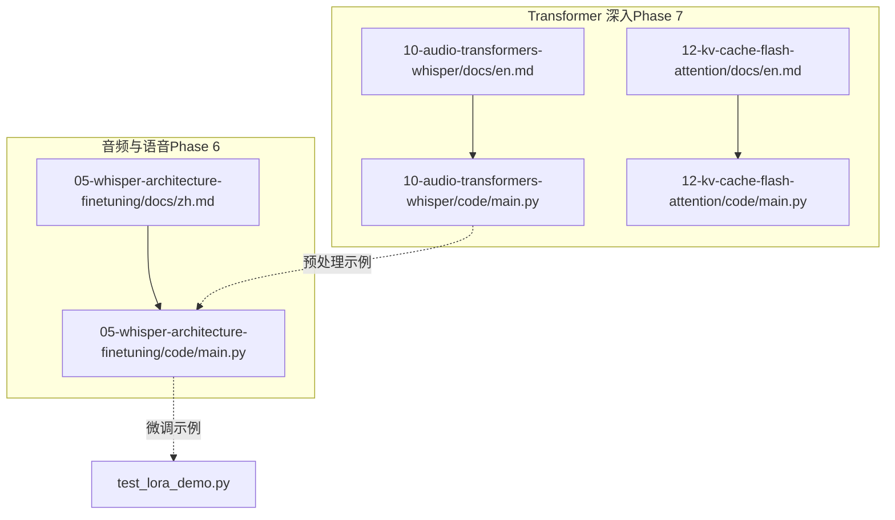
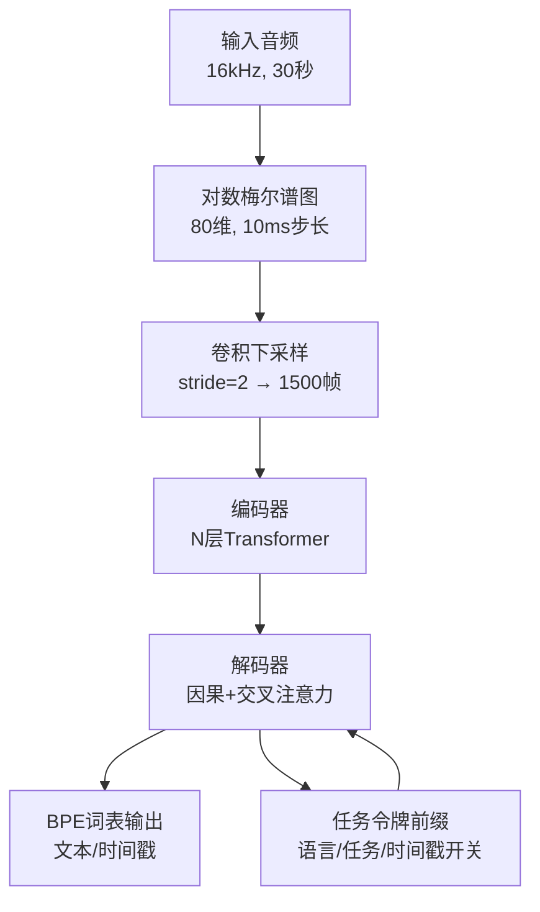
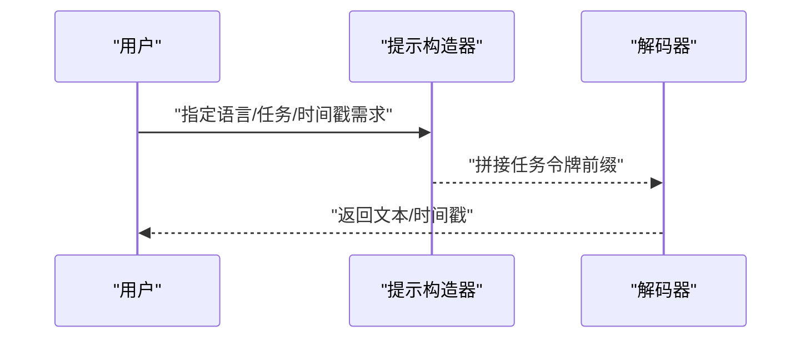
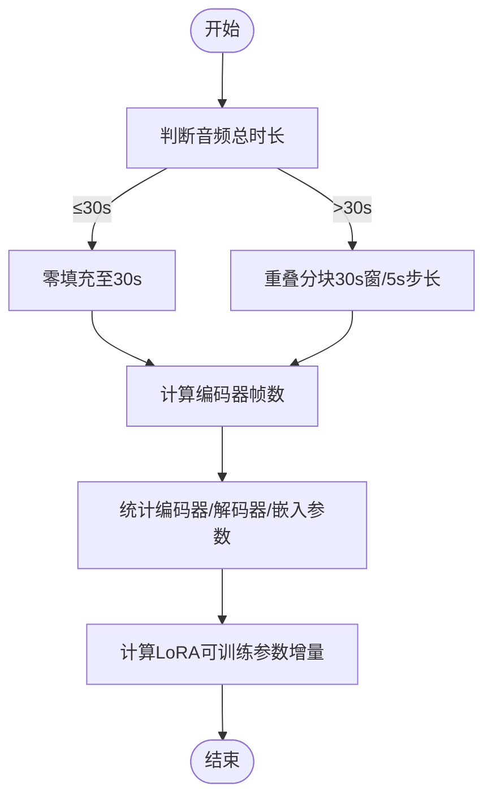
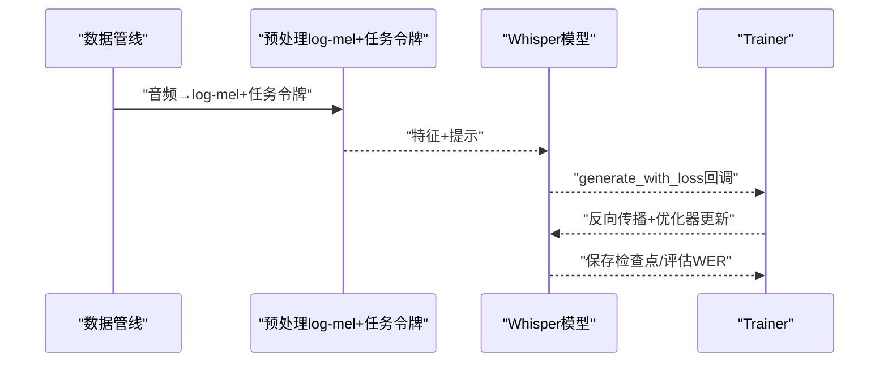
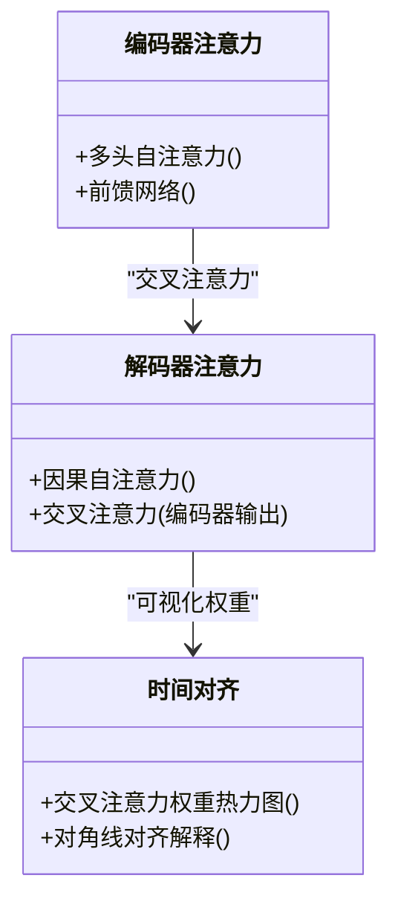
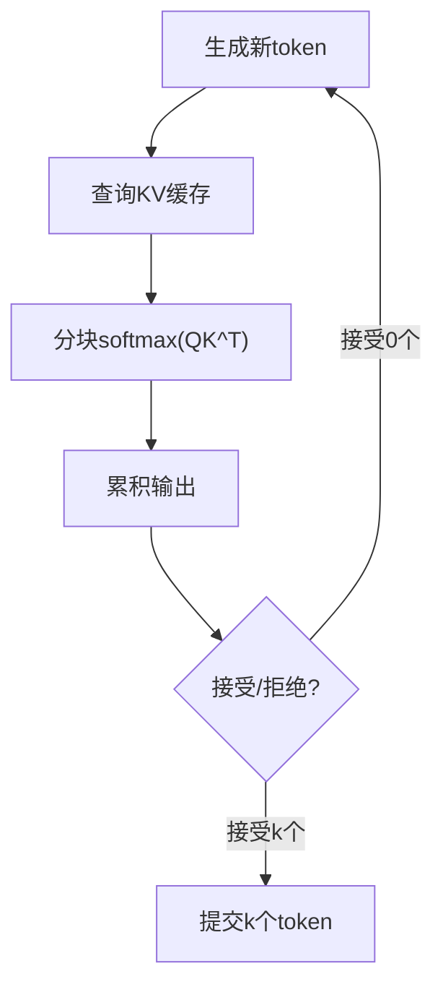
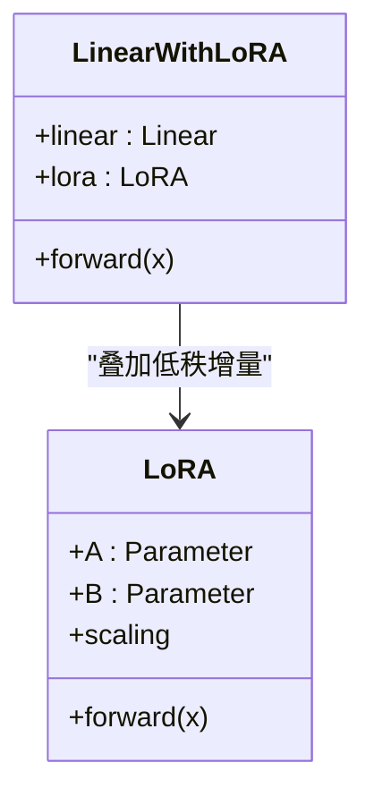
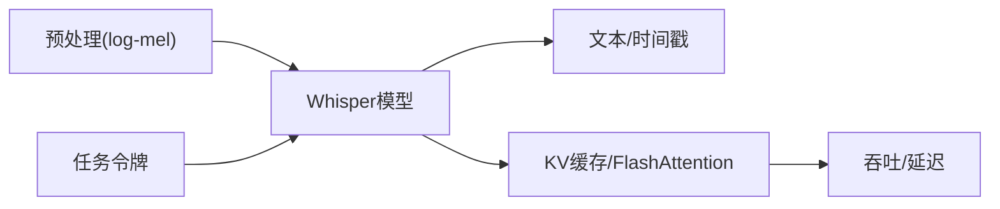

# Whisper架构与微调

<cite>
**本文引用的文件**
- [phases/06-speech-and-audio/05-whisper-architecture-finetuning/docs/zh.md](file://phases/06-speech-and-audio/05-whisper-architecture-finetuning/docs/zh.md)
- [phases/06-speech-and-audio/05-whisper-architecture-finetuning/code/main.py](file://phases/06-speech-and-audio/05-whisper-architecture-finetuning/code/main.py)
- [phases/07-transformers-deep-dive/10-audio-transformers-whisper/docs/en.md](file://phases/07-transformers-deep-dive/10-audio-transformers-whisper/docs/en.md)
- [phases/07-transformers-deep-dive/10-audio-transformers-whisper/code/main.py](file://phases/07-transformers-deep-dive/10-audio-transformers-whisper/code/main.py)
- [phases/07-transformers-deep-dive/12-kv-cache-flash-attention/docs/en.md](file://phases/07-transformers-deep-dive/12-kv-cache-flash-attention/docs/en.md)
- [phases/07-transformers-deep-dive/12-kv-cache-flash-attention/code/main.py](file://phases/07-transformers-deep-dive/12-kv-cache-flash-attention/code/main.py)
- [test_lora_demo.py](file://test_lora_demo.py)
- [README.md](file://README.md)
</cite>

## 目录
1. [引言](#引言)
2. [项目结构](#项目结构)
3. [核心组件](#核心组件)
4. [架构总览](#架构总览)
5. [详细组件分析](#详细组件分析)
6. [依赖关系分析](#依赖关系分析)
7. [性能考虑](#性能考虑)
8. [故障排查指南](#故障排查指南)
9. [结论](#结论)
10. [附录](#附录)

## 引言
本文件面向希望系统掌握 Whisper 架构与微调实践的读者，围绕以下目标展开：  
- 深入解析 Whisper 的编码器-解码器结构、多头注意力机制、时间对齐策略等核心技术；  
- 详解 Whisper 的多语言能力：语言检测、翻译模式与转录模式的区别与切换；  
- 提供从零实现 Whisper 变体的完整流程，包括模型初始化、损失函数设计、优化器配置等关键步骤；  
- 覆盖微调策略：指令微调、持续学习、领域适应；  
- 解释推理优化技术：KV 缓存、分块解码、混合精度等；  
- 提供性能监控与调试工具的使用指南。

## 项目结构
本仓库中与 Whisper 相关的学习材料主要分布在两个模块：
- 音频与语音模块（Phase 6）：包含 Whisper 架构与微调的实战文档与示例代码，涵盖提示格式、分块推理、LoRA 微调与参数预算等。
- Transformer 深入模块（Phase 7）：包含音频 Transformer 与 Whisper 架构讲解、KV 缓存与 Flash Attention 推理优化的构建性内容。

图表来源
- [phases/06-speech-and-audio/05-whisper-architecture-finetuning/docs/zh.md](file://phases/06-speech-and-audio/05-whisper-architecture-finetuning/docs/zh.md)
- [phases/06-speech-and-audio/05-whisper-architecture-finetuning/code/main.py](file://phases/06-speech-and-audio/05-whisper-architecture-finetuning/code/main.py)
- [phases/07-transformers-deep-dive/10-audio-transformers-whisper/docs/en.md](file://phases/07-transformers-deep-dive/10-audio-transformers-whisper/docs/en.md)
- [phases/07-transformers-deep-dive/10-audio-transformers-whisper/code/main.py](file://phases/07-transformers-deep-dive/10-audio-transformers-whisper/code/main.py)
- [phases/07-transformers-deep-dive/12-kv-cache-flash-attention/docs/en.md](file://phases/07-transformers-deep-dive/12-kv-cache-flash-attention/docs/en.md)
- [phases/07-transformers-deep-dive/12-kv-cache-flash-attention/code/main.py](file://phases/07-transformers-deep-dive/12-kv-cache-flash-attention/code/main.py)
- [test_lora_demo.py](file://test_lora_demo.py)

章节来源
- [README.md](file://README.md)
- [phases/06-speech-and-audio/05-whisper-architecture-finetuning/docs/zh.md](file://phases/06-speech-and-audio/05-whisper-architecture-finetuning/docs/zh.md)
- [phases/07-transformers-deep-dive/10-audio-transformers-whisper/docs/en.md](file://phases/07-transformers-deep-dive/10-audio-transformers-whisper/docs/en.md)
- [phases/07-transformers-deep-dive/12-kv-cache-flash-attention/docs/en.md](file://phases/07-transformers-deep-dive/12-kv-cache-flash-attention/docs/en.md)

## 核心组件
- Whisper 编码器-解码器架构：编码器采用卷积下采样 + 多层 Transformer，解码器为因果自注意力 + 与编码器的交叉注意力，共享词表与位置编码扩展。
- 任务控制令牌（Prompt Tokens）：通过解码器前缀控制语言、任务（转录/翻译）与时间戳开关。
- 30 秒窗口与分块推理：固定输入长度，长音频需重叠分块；短音频需零填充。
- 多语言能力：通过语言令牌切换，支持 99+ 语言的统一模型。
- 微调策略：LoRA 参数高效微调、冻结编码器、保留 Whisper 分词器与提示格式。
- 推理优化：KV 缓存、Flash Attention、连续批处理、分页 KV 缓存、推测式解码等。

章节来源
- [phases/06-speech-and-audio/05-whisper-architecture-finetuning/docs/zh.md](file://phases/06-speech-and-audio/05-whisper-architecture-finetuning/docs/zh.md)
- [phases/07-transformers-deep-dive/10-audio-transformers-whisper/docs/en.md](file://phases/07-transformers-deep-dive/10-audio-transformers-whisper/docs/en.md)
- [phases/07-transformers-deep-dive/12-kv-cache-flash-attention/docs/en.md](file://phases/07-transformers-deep-dive/12-kv-cache-flash-attention/docs/en.md)

## 架构总览
Whisper 将音频转换为对数梅尔谱图（80 维，10 ms 步长），经卷积下采样至 1500 帧，再进入编码器 Transformer；解码器以 BPE 词表生成文本，通过任务令牌控制任务与输出格式。时间对齐通过交叉注意力权重的对角线结构体现。

图表来源
- [phases/07-transformers-deep-dive/10-audio-transformers-whisper/docs/en.md](file://phases/07-transformers-deep-dive/10-audio-transformers-whisper/docs/en.md)
- [phases/06-speech-and-audio/05-whisper-architecture-finetuning/docs/zh.md](file://phases/06-speech-and-audio/05-whisper-architecture-finetuning/docs/zh.md)

## 详细组件分析

### 组件A：提示格式与任务令牌
- 任务令牌包含：开始转录、语言标签、转录/翻译、时间戳开关等。
- 通过改变语言令牌可切换多语言；通过任务令牌切换翻译/转录；通过时间戳令牌控制是否输出词级时间戳。
- 该前缀即“指令式微调”的语音版本，无需额外训练即可切换行为。

图表来源
- [phases/07-transformers-deep-dive/10-audio-transformers-whisper/code/main.py](file://phases/07-transformers-deep-dive/10-audio-transformers-whisper/code/main.py)
- [phases/06-speech-and-audio/05-whisper-architecture-finetuning/code/main.py](file://phases/06-speech-and-audio/05-whisper-architecture-finetuning/code/main.py)

章节来源
- [phases/07-transformers-deep-dive/10-audio-transformers-whisper/docs/en.md](file://phases/07-transformers-deep-dive/10-audio-transformers-whisper/docs/en.md)
- [phases/07-transformers-deep-dive/10-audio-transformers-whisper/code/main.py](file://phases/07-transformers-deep-dive/10-audio-transformers-whisper/code/main.py)
- [phases/06-speech-and-audio/05-whisper-architecture-finetuning/docs/zh.md](file://phases/06-speech-and-audio/05-whisper-architecture-finetuning/docs/zh.md)
- [phases/06-speech-and-audio/05-whisper-architecture-finetuning/code/main.py](file://phases/06-speech-and-audio/05-whisper-architecture-finetuning/code/main.py)

### 组件B：分块推理与参数预算
- 30 秒窗口：短音频零填充，长音频重叠分块（如 30s 窗口、5s 步长）。
- 编码器帧预算：按采样率与步长估算输入帧数，确保与模型期望一致。
- 参数预算：分别统计编码器、解码器与嵌入层参数量，比较不同变体（如 Large-v3 与 Turbo）的差异。
- LoRA 参数：仅在注意力投影层注入低秩适配器，显著减少可训练参数数量。

图表来源
- [phases/06-speech-and-audio/05-whisper-architecture-finetuning/code/main.py](file://phases/06-speech-and-audio/05-whisper-architecture-finetuning/code/main.py)

章节来源
- [phases/06-speech-and-audio/05-whisper-architecture-finetuning/code/main.py](file://phases/06-speech-and-audio/05-whisper-architecture-finetuning/code/main.py)
- [phases/06-speech-and-audio/05-whisper-architecture-finetuning/docs/zh.md](file://phases/06-speech-and-audio/05-whisper-architecture-finetuning/docs/zh.md)

### 组件C：从零实现 Whisper 变体（流程）
- 数据与预处理：使用 Whisper 的对数梅尔谱图与任务令牌前缀，避免使用 librosa 的 mel 统计量。
- 模型初始化：加载预训练权重，冻结编码器或仅微调解码器（低资源场景）。
- 损失函数：使用条件生成损失（如 generate_with_loss 回调），结合 Whisper 的分词器与提示格式。
- 优化器配置：AdamW，学习率调度（余弦退火/阶梯衰减），梯度裁剪与混合精度。
- 微调策略：LoRA 注入 q_proj/v_proj，冻结编码器（数据<10h），在保留集上评估 WER。
- 推理：WhisperX/Whisper-Streaming/Faster-Whisper 等包装器用于长音频与实时场景。

图表来源
- [phases/06-speech-and-audio/05-whisper-architecture-finetuning/docs/zh.md](file://phases/06-speech-and-audio/05-whisper-architecture-finetuning/docs/zh.md)

章节来源
- [phases/06-speech-and-audio/05-whisper-architecture-finetuning/docs/zh.md](file://phases/06-speech-and-audio/05-whisper-architecture-finetuning/docs/zh.md)

### 组件D：多头注意力与时间对齐
- 多头注意力：自注意力与交叉注意力均采用多头并行，隐藏维度与头数决定计算开销。
- 时间对齐：交叉注意力权重呈现对角线结构，对应“词级时间戳”的内在机制。
- 可视化：在解码过程中启用输出注意力，绘制热力图观察对角线对齐。

图表来源
- [phases/07-transformers-deep-dive/10-audio-transformers-whisper/docs/en.md](file://phases/07-transformers-deep-dive/10-audio-transformers-whisper/docs/en.md)
- [phases/06-speech-and-audio/05-whisper-architecture-finetuning/docs/zh.md](file://phases/06-speech-and-audio/05-whisper-architecture-finetuning/docs/zh.md)

章节来源
- [phases/07-transformers-deep-dive/10-audio-transformers-whisper/docs/en.md](file://phases/07-transformers-deep-dive/10-audio-transformers-whisper/docs/en.md)
- [phases/06-speech-and-audio/05-whisper-architecture-finetuning/docs/zh.md](file://phases/06-speech-and-audio/05-whisper-architecture-finetuning/docs/zh.md)

### 组件E：推理优化（KV 缓存、分块解码、混合精度）
- KV 缓存：存储历史 K/V 向量，将每步注意力复杂度从 O(N^2) 降到 O(N)。
- Flash Attention：分块计算 softmax 与乘法，避免显存中物化 N×N 分数矩阵，显著降低内存占用。
- 连续批处理与分页 KV：在 vLLM 等系统中实现高吞吐与低碎片化。
- 推测式解码：廉价草稿模型并行验证，提升吞吐与延迟性价比。
- 混合精度：在支持的硬件上使用 bf16/fp16，兼顾数值稳定与速度。

图表来源
- [phases/07-transformers-deep-dive/12-kv-cache-flash-attention/docs/en.md](file://phases/07-transformers-deep-dive/12-kv-cache-flash-attention/docs/en.md)
- [phases/07-transformers-deep-dive/12-kv-cache-flash-attention/code/main.py](file://phases/07-transformers-deep-dive/12-kv-cache-flash-attention/code/main.py)

章节来源
- [phases/07-transformers-deep-dive/12-kv-cache-flash-attention/docs/en.md](file://phases/07-transformers-deep-dive/12-kv-cache-flash-attention/docs/en.md)
- [phases/07-transformers-deep-dive/12-kv-cache-flash-attention/code/main.py](file://phases/07-transformers-deep-dive/12-kv-cache-flash-attention/code/main.py)

### 组件F：LoRA 微调示例与参数注入
- LoRA 组件：在注意力投影层注入低秩矩阵，训练时仅更新低秩参数，大幅降低显存与计算成本。
- 参数统计：通过统计总参数与可训练参数，验证 LoRA 的高效性。
- 合并 LoRA：推理阶段可将低秩增量合并回主权重，便于部署。

图表来源
- [test_lora_demo.py](file://test_lora_demo.py)

章节来源
- [test_lora_demo.py](file://test_lora_demo.py)

## 依赖关系分析
- Whisper 架构依赖于标准 Transformer 的多头注意力与前馈网络，同时引入任务令牌前缀以实现多任务统一。
- 预处理依赖 Whisper 自身的 log-mel 统计量，不建议使用 librosa 的 mel 滤波器。
- 微调依赖 Hugging Face Transformers 的 Seq2SeqTrainer 与 PEFT 的 LoRA 配置。
- 推理优化依赖 Flash Attention 与 KV 缓存实现，配合连续批处理与分页 KV。

图表来源
- [phases/07-transformers-deep-dive/10-audio-transformers-whisper/docs/en.md](file://phases/07-transformers-deep-dive/10-audio-transformers-whisper/docs/en.md)
- [phases/07-transformers-deep-dive/12-kv-cache-flash-attention/docs/en.md](file://phases/07-transformers-deep-dive/12-kv-cache-flash-attention/docs/en.md)
- [phases/06-speech-and-audio/05-whisper-architecture-finetuning/docs/zh.md](file://phases/06-speech-and-audio/05-whisper-architecture-finetuning/docs/zh.md)

章节来源
- [phases/07-transformers-deep-dive/10-audio-transformers-whisper/docs/en.md](file://phases/07-transformers-deep-dive/10-audio-transformers-whisper/docs/en.md)
- [phases/07-transformers-deep-dive/12-kv-cache-flash-attention/docs/en.md](file://phases/07-transformers-deep-dive/12-kv-cache-flash-attention/docs/en.md)
- [phases/06-speech-and-audio/05-whisper-architecture-finetuning/docs/zh.md](file://phases/06-speech-and-audio/05-whisper-architecture-finetuning/docs/zh.md)

## 性能考虑
- 训练阶段：FLOP 受限，注意批大小与并行策略；使用混合精度与梯度累积。
- 推理阶段：内存受限，优先启用 KV 缓存与 Flash Attention；在长上下文中采用分页 KV 与连续批处理。
- 任务切换：通过任务令牌快速切换，避免重新训练；在低资源场景使用 LoRA 微调。
- 端到端优化：WhisperX/Whisper-Streaming/Faster-Whisper 等生态工具链可显著改善吞吐与延迟。

## 故障排查指南
- 静音幻觉：在静音区域产生文本。解决方法：使用 VAD 门控，或在推理前过滤静音。
- 级联幻觉：跨窗口重复问题。解决方法：关闭“基于先前文本”选项，或在跨块连接处谨慎处理上下文。
- 填充幻觉：短片段零填充导致尾部静音产生伪文本。解决方法：禁用填充或使用 VAD。
- 梅尔统计量错误：使用 librosa 的 mel 滤波器替代 Whisper 的 log-mel 会导致输出随机。解决方法：使用 Whisper 的 log_mel_spectrogram。
- 评估指标：使用 WER 作为主要指标，结合词级时间戳（WhisperX）与说话人日志（pyannote）进行质量评估。

章节来源
- [phases/06-speech-and-audio/05-whisper-architecture-finetuning/docs/zh.md](file://phases/06-speech-and-audio/05-whisper-architecture-finetuning/docs/zh.md)

## 结论
Whisper 以统一的编码器-解码器架构与任务令牌机制实现了强大的多语言与多任务能力。通过严格的预处理、参数高效的 LoRA 微调与完善的推理优化（KV 缓存、Flash Attention、连续批处理），可在离线与在线场景中取得优异的吞吐与延迟表现。结合 WhisperX/Whisper-Streaming/Faster-Whisper 生态，可进一步满足长音频与实时应用的需求。

## 附录
- 练习与进阶：实现完整的 Whisper 预处理管道、LoRA 微调流程与推理优化；在低资源语言上进行领域适应；评估不同变体在 WER 与延迟上的权衡。