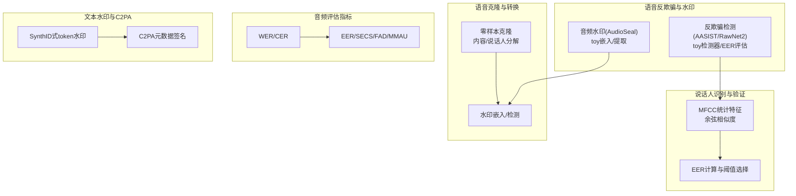
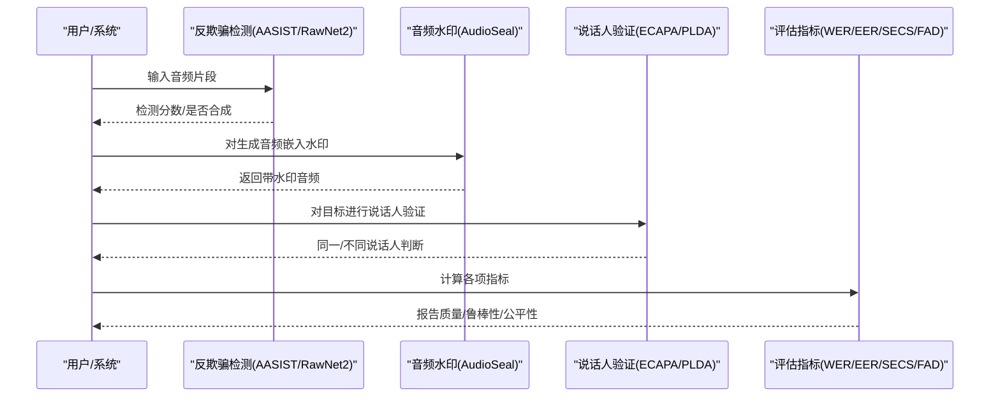
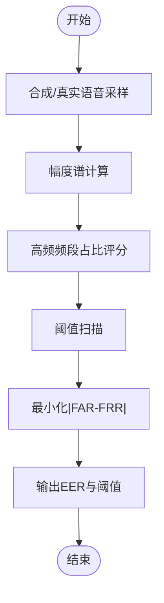
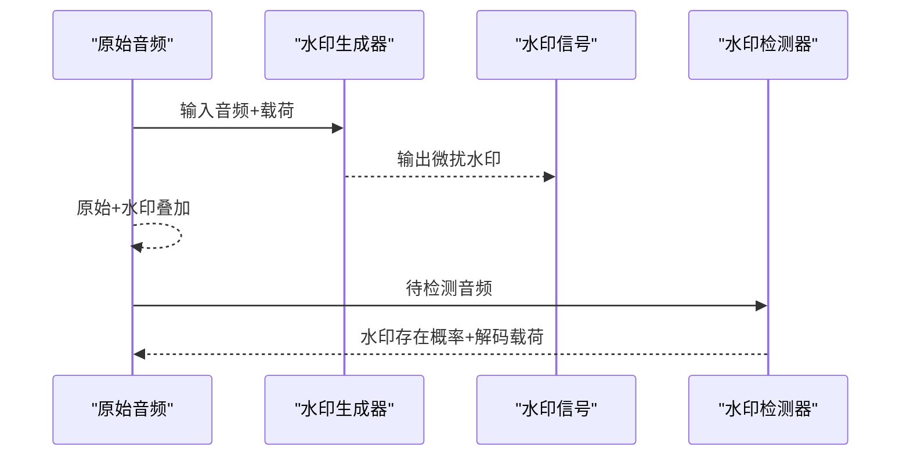
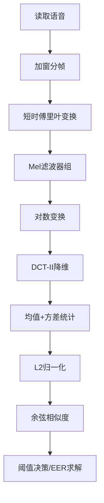
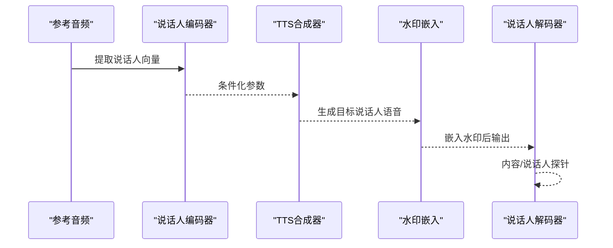
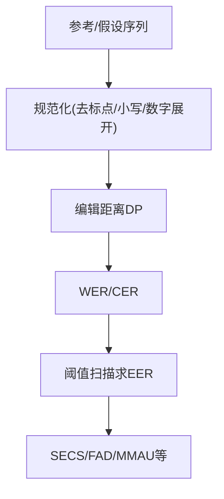
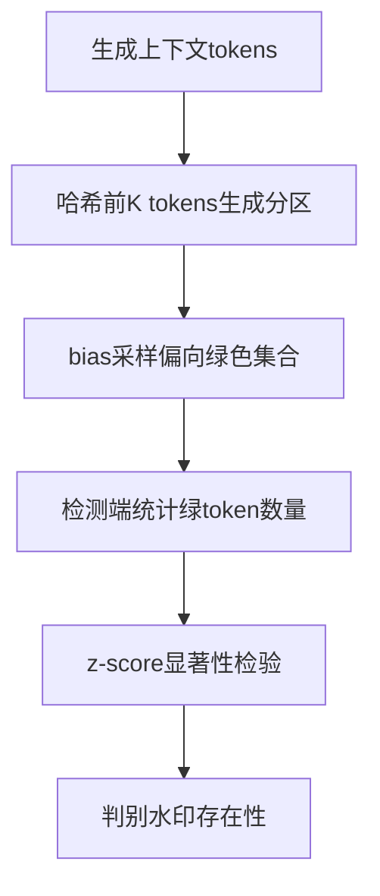
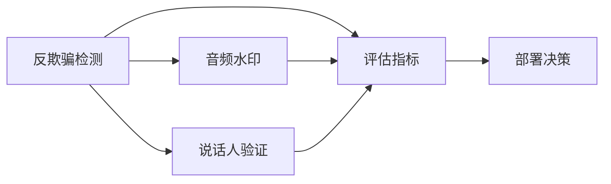

# 反欺骗与音频水印

<cite>
**本文引用的文件**
- [phases/06-speech-and-audio/16-anti-spoofing-audio-watermarking/code/main.py](file://phases/06-speech-and-audio/16-anti-spoofing-audio-watermarking/code/main.py)
- [phases/06-speech-and-audio/16-anti-spoofing-audio-watermarking/docs/en.md](file://phases/06-speech-and-audio/16-anti-spoofing-audio-watermarking/docs/en.md)
- [phases/06-speech-and-audio/06-speaker-recognition-verification/code/main.py](file://phases/06-speech-and-audio/06-speaker-recognition-verification/code/main.py)
- [phases/06-speech-and-audio/06-speaker-recognition-verification/docs/en.md](file://phases/06-speech-and-audio/06-speaker-recognition-verification/docs/en.md)
- [phases/06-speech-and-audio/08-voice-cloning-conversion/code/main.py](file://phases/06-speech-and-audio/08-voice-cloning-conversion/code/main.py)
- [phases/06-speech-and-audio/08-voice-cloning-conversion/docs/en.md](file://phases/06-speech-and-audio/08-voice-cloning-conversion/docs/en.md)
- [phases/06-speech-and-audio/17-audio-evaluation-metrics/code/main.py](file://phases/06-speech-and-audio/17-audio-evaluation-metrics/code/main.py)
- [phases/06-speech-and-audio/17-audio-evaluation-metrics/docs/en.md](file://phases/06-speech-and-audio/17-audio-evaluation-metrics/docs/en.md)
- [phases/18-ethics-safety-alignment/23-watermarking-synthid-stable-signature-c2pa/code/main.py](file://phases/18-ethics-safety-alignment/23-watermarking-synthid-stable-signature-c2pa/code/main.py)
- [phases/18-ethics-safety-alignment/23-watermarking-synthid-stable-signature-c2pa/docs/en.md](file://phases/18-ethics-safety-alignment/23-watermarking-synthid-stable-signature-c2pa/docs/en.md)
</cite>

## 目录
1. [引言](#引言)
2. [项目结构](#项目结构)
3. [核心组件](#核心组件)
4. [架构总览](#架构总览)
5. [详细组件分析](#详细组件分析)
6. [依赖关系分析](#依赖关系分析)
7. [性能考量](#性能考量)
8. [故障排查指南](#故障排查指南)
9. [结论](#结论)
10. [附录](#附录)

## 引言
本课程围绕“反欺骗与音频水印”主题，系统讲解语音欺骗攻击的类型与检测方法（文本无关识别、说话人伪造、音频篡改等），并深入剖析反欺骗技术的关键实现：对抗样本训练、鲁棒特征提取、异常检测等。同时，提供从零实现音频水印系统的完整思路与代码路径，覆盖信息嵌入、鲁棒性保护、提取算法、完整性验证等模块；并阐述水印分类（可见/不可见、鲁棒/脆弱）、水印容量与透明度/安全性的权衡策略，以及性能评估与攻击模拟测试方法。

## 项目结构
本课程涉及的音频与反欺骗相关内容主要分布在以下模块：
- 语音反欺骗与水印：演示AASIST/RawNet2检测器与AudioSeal水印接口，给出EER评估与2026基准对比
- 说话人识别与验证：MFCC统计特征、余弦相似度、EER计算，展示SV流水线
- 语音克隆与转换：零/少样本克隆、声纹交换、水印嵌入与检测
- 音频评估指标：WER/CER、EER、SECS、FAD、MMAU等，构建评测体系
- 文本水印与C2PA：SynthID式token级水印与C2PA元数据签名互补

图示来源
- [phases/06-speech-and-audio/16-anti-spoofing-audio-watermarking/code/main.py:77-140](file://phases/06-speech-and-audio/16-anti-spoofing-audio-watermarking/code/main.py#L77-L140)
- [phases/06-speech-and-audio/06-speaker-recognition-verification/code/main.py:135-198](file://phases/06-speech-and-audio/06-speaker-recognition-verification/code/main.py#L135-L198)
- [phases/06-speech-and-audio/08-voice-cloning-conversion/code/main.py:86-161](file://phases/06-speech-and-audio/08-voice-cloning-conversion/code/main.py#L86-L161)
- [phases/06-speech-and-audio/17-audio-evaluation-metrics/code/main.py:80-151](file://phases/06-speech-and-audio/17-audio-evaluation-metrics/code/main.py#L80-L151)
- [phases/18-ethics-safety-alignment/23-watermarking-synthid-stable-signature-c2pa/code/main.py:76-112](file://phases/18-ethics-safety-alignment/23-watermarking-synthid-stable-signature-c2pa/code/main.py#L76-L112)

章节来源
- [phases/06-speech-and-audio/16-anti-spoofing-audio-watermarking/docs/en.md:1-193](file://phases/06-speech-and-audio/16-anti-spoofing-audio-watermarking/docs/en.md#L1-L193)
- [phases/06-speech-and-audio/06-speaker-recognition-verification/docs/en.md:1-173](file://phases/06-speech-and-audio/06-speaker-recognition-verification/docs/en.md#L1-L173)
- [phases/06-speech-and-audio/08-voice-cloning-conversion/docs/en.md:1-172](file://phases/06-speech-and-audio/08-voice-cloning-conversion/docs/en.md#L1-L172)
- [phases/06-speech-and-audio/17-audio-evaluation-metrics/docs/en.md:1-225](file://phases/06-speech-and-audio/17-audio-evaluation-metrics/docs/en.md#L1-L225)
- [phases/18-ethics-safety-alignment/23-watermarking-synthid-stable-signature-c2pa/docs/en.md:1-115](file://phases/18-ethics-safety-alignment/23-watermarking-synthid-stable-signature-c2pa/docs/en.md#L1-L115)

## 核心组件
- 反欺骗检测（AASIST/RawNet2）：基于频谱/梅尔域特征的图注意力或卷积+TDNN模型，当前SOTA在ASVspoof 5挑战中达到约7.23% EER；课件提供toy检测器与EER求解流程
- 音频水印（AudioSeal/WavMark）：AudioSeal采用局部化嵌入与联合训练，具备鲁棒性与高实时性；WavMark为早期可逆神经网络方案
- 说话人识别与验证（SV）：MFCC统计特征+余弦相似度+EER阈值选择，展示典型生产流水线
- 语音克隆与转换：零样本克隆与声纹交换，结合水印嵌入与检测
- 音频评估指标：WER/CER、EER、SECS、FAD、MMAU等，支撑全面评测
- 文本水印与C2PA：SynthID式token水印与C2PA元数据签名互补

章节来源
- [phases/06-speech-and-audio/16-anti-spoofing-audio-watermarking/docs/en.md:35-67](file://phases/06-speech-and-audio/16-anti-spoofing-audio-watermarking/docs/en.md#L35-L67)
- [phases/06-speech-and-audio/06-speaker-recognition-verification/docs/en.md:18-47](file://phases/06-speech-and-audio/06-speaker-recognition-verification/docs/en.md#L18-L47)
- [phases/06-speech-and-audio/08-voice-cloning-conversion/docs/en.md:23-58](file://phases/06-speech-and-audio/08-voice-cloning-conversion/docs/en.md#L23-L58)
- [phases/06-speech-and-audio/17-audio-evaluation-metrics/docs/en.md:12-25](file://phases/06-speech-and-audio/17-audio-evaluation-metrics/docs/en.md#L12-L25)
- [phases/18-ethics-safety-alignment/23-watermarking-synthid-stable-signature-c2pa/docs/en.md:21-58](file://phases/18-ethics-safety-alignment/23-watermarking-synthid-stable-signature-c2pa/docs/en.md#L21-L58)

## 架构总览
下图展示了从“输入音频/文本”到“检测/水印/验证”的端到端流程，强调检测与水印双保险、以及与C2PA元数据签名的协同。

图示来源
- [phases/06-speech-and-audio/16-anti-spoofing-audio-watermarking/code/main.py:77-140](file://phases/06-speech-and-audio/16-anti-spoofing-audio-watermarking/code/main.py#L77-L140)
- [phases/06-speech-and-audio/06-speaker-recognition-verification/code/main.py:135-198](file://phases/06-speech-and-audio/06-speaker-recognition-verification/code/main.py#L135-L198)
- [phases/06-speech-and-audio/17-audio-evaluation-metrics/code/main.py:80-151](file://phases/06-speech-and-audio/17-audio-evaluation-metrics/code/main.py#L80-L151)

## 详细组件分析

### 组件A：反欺骗检测（AASIST/RawNet2）
- 关键点
  - 特征：log-mel或谱特征；AASIST使用图注意力，RawNet2采用卷积前端+TDNN骨干
  - 评估：EER作为主指标；课件提供toy检测器与阈值扫描求EER
  - 基准：ASVspoof 5（真实场景、多攻击算法、双赛道），SOTA约7.23%
- 实现要点
  - toy检测器：基于幅度谱高频能量占比，直观体现“合成语音通常高频平坦”的直觉
  - EER求解：遍历候选阈值，最小化FAR与FRR差值，得到EER与最佳阈值

图示来源
- [phases/06-speech-and-audio/16-anti-spoofing-audio-watermarking/code/main.py:50-104](file://phases/06-speech-and-audio/16-anti-spoofing-audio-watermarking/code/main.py#L50-L104)

章节来源
- [phases/06-speech-and-audio/16-anti-spoofing-audio-watermarking/docs/en.md:35-42](file://phases/06-speech-and-audio/16-anti-spoofing-audio-watermarking/docs/en.md#L35-L42)
- [phases/06-speech-and-audio/16-anti-spoofing-audio-watermarking/code/main.py:50-104](file://phases/06-speech-and-audio/16-anti-spoofing-audio-watermarking/code/main.py#L50-L104)

### 组件B：音频水印（AudioSeal）
- 关键点
  - 局部化嵌入：每帧1/16000秒分辨率，生成器与检测器联合训练
  - 鲁棒性：MP3/AAC压缩、EQ、变速±10%、噪声混合+10dB SNR均能存活
  - 容量：16比特载荷（可编码模型ID、生成时间戳、用户ID）
  - 速度：检测器可达485×实时
- 实现要点
  - 课件提供toy嵌入/提取：按位步长在时域加入微小直流偏置，再以相同步长抽样恢复
  - 2026基准：AudioSeal预攻击位准确率>99%，WavMark约99.52%

图示来源
- [phases/06-speech-and-audio/16-anti-spoofing-audio-watermarking/code/main.py:57-74](file://phases/06-speech-and-audio/16-anti-spoofing-audio-watermarking/code/main.py#L57-L74)

章节来源
- [phases/06-speech-and-audio/16-anti-spoofing-audio-watermarking/docs/en.md:43-63](file://phases/06-speech-and-audio/16-anti-spoofing-audio-watermarking/docs/en.md#L43-L63)
- [phases/06-speech-and-audio/16-anti-spoofing-audio-watermarking/code/main.py:57-74](file://phases/06-speech-and-audio/16-anti-spoofing-audio-watermarking/code/main.py#L57-L74)

### 组件C：说话人识别与验证（SV）
- 关键点
  - 典型流水线：STFT→Mel滤波器组→对数变换→DCT-II→统计聚合→L2归一化→余弦相似度
  - EER：使FAR=FRR的阈值，是SV任务的黄金指标
  - 生产模型：ECAPA-TDNN、WavLM-SV、x-vector等
- 实现要点
  - 课件提供toy MFCC统计嵌入与EER求解，演示同/异讲者对的相似度分布与阈值选择

图示来源
- [phases/06-speech-and-audio/06-speaker-recognition-verification/code/main.py:95-132](file://phases/06-speech-and-audio/06-speaker-recognition-verification/code/main.py#L95-L132)

章节来源
- [phases/06-speech-and-audio/06-speaker-recognition-verification/docs/en.md:18-47](file://phases/06-speech-and-audio/06-speaker-recognition-verification/docs/en.md#L18-L47)
- [phases/06-speech-and-audio/06-speaker-recognition-verification/code/main.py:108-132](file://phases/06-speech-and-audio/06-speaker-recognition-verification/code/main.py#L108-L132)

### 组件D：语音克隆与转换（含水印）
- 关键点
  - 零样本克隆：用5秒参考声纹+文本生成目标说话人的语音
  - 声纹交换：提取源内容，重合成目标说话人，保留语义
  - 质量度量：SECS（ECAPA余弦）>0.70通常不可区分
  - 水印：SilentCipher/SilentCipher风格嵌入，MP3重编码后仍可检测
- 实现要点
  - 课件通过确定性内容向量与随机化说话人向量，演示内容/说话人分离与交换
  - 提供toy水印嵌入/检测流程，验证位准确率

图示来源
- [phases/06-speech-and-audio/08-voice-cloning-conversion/code/main.py:32-84](file://phases/06-speech-and-audio/08-voice-cloning-conversion/code/main.py#L32-L84)
- [phases/06-speech-and-audio/08-voice-cloning-conversion/docs/en.md:23-58](file://phases/06-speech-and-audio/08-voice-cloning-conversion/docs/en.md#L23-L58)

章节来源
- [phases/06-speech-and-audio/08-voice-cloning-conversion/docs/en.md:98-120](file://phases/06-speech-and-audio/08-voice-cloning-conversion/docs/en.md#L98-L120)
- [phases/06-speech-and-audio/08-voice-cloning-conversion/code/main.py:57-84](file://phases/06-speech-and-audio/08-voice-cloning-conversion/code/main.py#L57-L84)

### 组件E：音频评估指标（WER/EER/SECS/FAD/MMAU）
- 关键点
  - ASR：WER/CER/首词延迟/实时因子
  - TTS：MOS/UTMOS/SECS/往返WER/TTFA
  - SV：EER/minDCF
  - 音乐生成：FAD/CLAP/MOS
  - LALM：MMAU-Pro/LongAudioBench
- 实现要点
  - 课件提供编辑距离、EER求解、SECS、FAD类距离等实现，便于自建评测

图示来源
- [phases/06-speech-and-audio/17-audio-evaluation-metrics/code/main.py:13-78](file://phases/06-speech-and-audio/17-audio-evaluation-metrics/code/main.py#L13-L78)

章节来源
- [phases/06-speech-and-audio/17-audio-evaluation-metrics/docs/en.md:12-25](file://phases/06-speech-and-audio/17-audio-evaluation-metrics/docs/en.md#L12-L25)
- [phases/06-speech-and-audio/17-audio-evaluation-metrics/code/main.py:43-78](file://phases/06-speech-and-audio/17-audio-evaluation-metrics/code/main.py#L43-L78)

### 组件F：文本水印与C2PA（SynthID/C2PA）
- 关键点
  - SynthID式token水印：每步哈希前K个token，伪随机划分词汇绿/红集合，偏向绿色采样，检测端统计绿token z-score
  - 稳定签名（Stable Signature）：微调潜在扩散解码器嵌入固定消息，但易被后处理微调移除
  - C2PA：加密签名的溯源元数据，富信息但可被剥离
- 实现要点
  - 课件提供toy token水印：K=4，按seed生成分区集合，bias采样，检测端计算z-score；展示改写攻击对信号的影响

图示来源
- [phases/18-ethics-safety-alignment/23-watermarking-synthid-stable-signature-c2pa/code/main.py:25-64](file://phases/18-ethics-safety-alignment/23-watermarking-synthid-stable-signature-c2pa/code/main.py#L25-L64)

章节来源
- [phases/18-ethics-safety-alignment/23-watermarking-synthid-stable-signature-c2pa/docs/en.md:21-67](file://phases/18-ethics-safety-alignment/23-watermarking-synthid-stable-signature-c2pa/docs/en.md#L21-L67)
- [phases/18-ethics-safety-alignment/23-watermarking-synthid-stable-signature-c2pa/code/main.py:52-107](file://phases/18-ethics-safety-alignment/23-watermarking-synthid-stable-signature-c2pa/code/main.py#L52-L107)

## 依赖关系分析
- 组件耦合
  - 反欺骗检测与水印：二者互补，检测用于对抗不配合的攻击者，水印用于合规标识
  - 说话人验证与水印：SV用于身份确认，水印用于内容溯源
  - 评估指标贯穿各组件：为部署提供客观度量
- 外部依赖
  - 模型与工具：AudioSeal、AASIST/RawNet2、ECAPA-TDNN、SilentCipher等
  - 基准与数据集：ASVspoof 5、VoxCeleb、MMAU-Pro、Open ASR Leaderboard等

图示来源
- [phases/06-speech-and-audio/16-anti-spoofing-audio-watermarking/docs/en.md:145-166](file://phases/06-speech-and-audio/16-anti-spoofing-audio-watermarking/docs/en.md#L145-L166)
- [phases/06-speech-and-audio/17-audio-evaluation-metrics/docs/en.md:176-183](file://phases/06-speech-and-audio/17-audio-evaluation-metrics/docs/en.md#L176-L183)

章节来源
- [phases/06-speech-and-audio/16-anti-spoofing-audio-watermarking/docs/en.md:145-166](file://phases/06-speech-and-audio/16-anti-spoofing-audio-watermarking/docs/en.md#L145-L166)
- [phases/06-speech-and-audio/17-audio-evaluation-metrics/docs/en.md:176-183](file://phases/06-speech-and-audio/17-audio-evaluation-metrics/docs/en.md#L176-L183)

## 性能考量
- 检测性能
  - EER是SV/反欺骗任务的主指标；需在目标域校准，避免过拟合
  - AASIST/RawNet2在ASVspoof 5上SOTA约7.23%，实际野外部署约5-10%
- 水印鲁棒性
  - AudioSeal在标准攻击下位准确率>99%，但受激进变调影响；需结合检测作为后备
  - SilentCipher风格水印在MP3重编码后仍可检测
- 评估建议
  - 规范化后再打分（如WER/CER），报告P50/P95/P99与分层召回
  - 结合公开基准与自有域数据集，形成“公开+私有”的双轨评测

## 故障排查指南
- 常见陷阱
  - 仅嵌入水印而未运行检测：无实际防护价值
  - 未校准检测阈值：域外泛化差
  - 忽视变调攻击：大多数水印对激进变调敏感
  - 仅依赖元数据：C2PA可被剥离，需与感知/密码学双重防御结合
  - 将活体检测当作检测：无法阻止实时克隆
- 排查步骤
  - 运行toy检测器与EER求解，观察阈值与误报/拒收平衡
  - 在合成/真实样本上分别评估水印位准确率，注入噪声/压缩/变调测试
  - 使用SECS/DER/FAD等指标评估克隆/转写/分类质量

章节来源
- [phases/06-speech-and-audio/16-anti-spoofing-audio-watermarking/docs/en.md:155-162](file://phases/06-speech-and-audio/16-anti-spoofing-audio-watermarking/docs/en.md#L155-L162)
- [phases/06-speech-and-audio/17-audio-evaluation-metrics/docs/en.md:184-191](file://phases/06-speech-and-audio/17-audio-evaluation-metrics/docs/en.md#L184-L191)

## 结论
2026语音系统必须同时具备“反欺骗检测+音频水印+溯源元数据”三层能力：检测应对不配合攻击者，水印确保合规与可追溯，C2PA提供加密签名的溯源链。通过课件提供的toy实现与评估脚本，可以快速搭建端到端流水线，并在真实域数据上进行EER、位准确率、SECS、FAD等多维度评估，持续迭代安全与质量。

## 附录
- 从零实现音频水印系统的建议模块
  - 信息嵌入：局部化DC偏置或感知域扰动（如PerTh/SilentCipher风格），支持步长抽样与同步
  - 鲁棒性保护：对常见攻击（压缩、变速、噪声、裁剪）进行对抗训练或增强
  - 提取算法：基于相同步长的统计估计，计算平均偏置极性，还原二进制载荷
  - 完整性验证：结合水印存在性概率与载荷一致性，输出可信度
  - 性能评估：EER（反欺骗）、位准确率（水印）、SECS（克隆）、FAD（音乐生成）等
  - 攻击模拟：变调、变速、MP3重编码、随机改写等，评估鲁棒边界

章节来源
- [phases/06-speech-and-audio/16-anti-spoofing-audio-watermarking/docs/en.md:65-67](file://phases/06-speech-and-audio/16-anti-spoofing-audio-watermarking/docs/en.md#L65-L67)
- [phases/06-speech-and-audio/17-audio-evaluation-metrics/docs/en.md:102-113](file://phases/06-speech-and-audio/17-audio-evaluation-metrics/docs/en.md#L102-L113)
- [phases/18-ethics-safety-alignment/23-watermarking-synthid-stable-signature-c2pa/docs/en.md:61-67](file://phases/18-ethics-safety-alignment/23-watermarking-synthid-stable-signature-c2pa/docs/en.md#L61-L67)