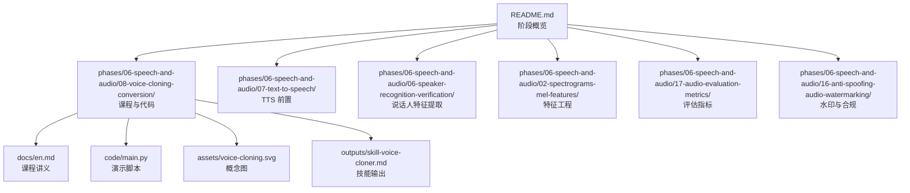
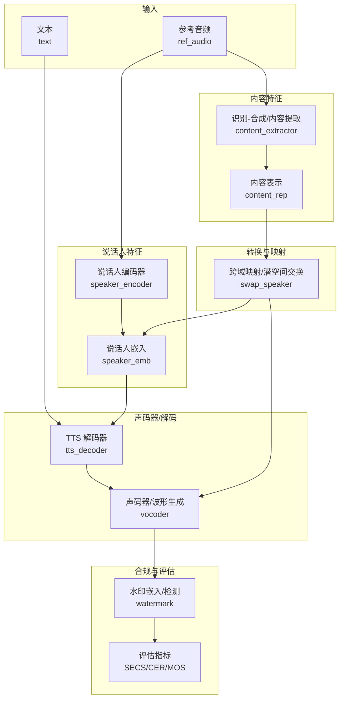
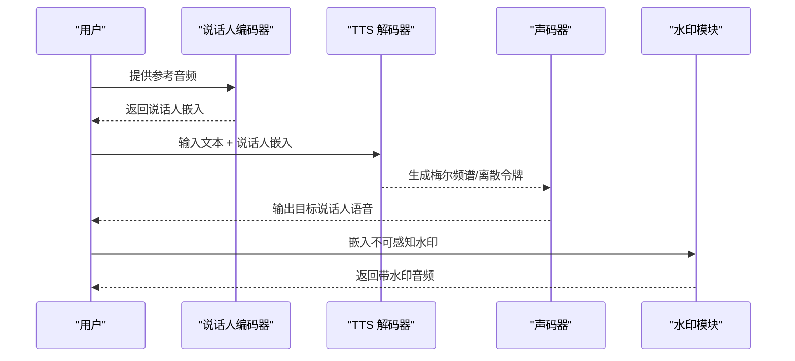
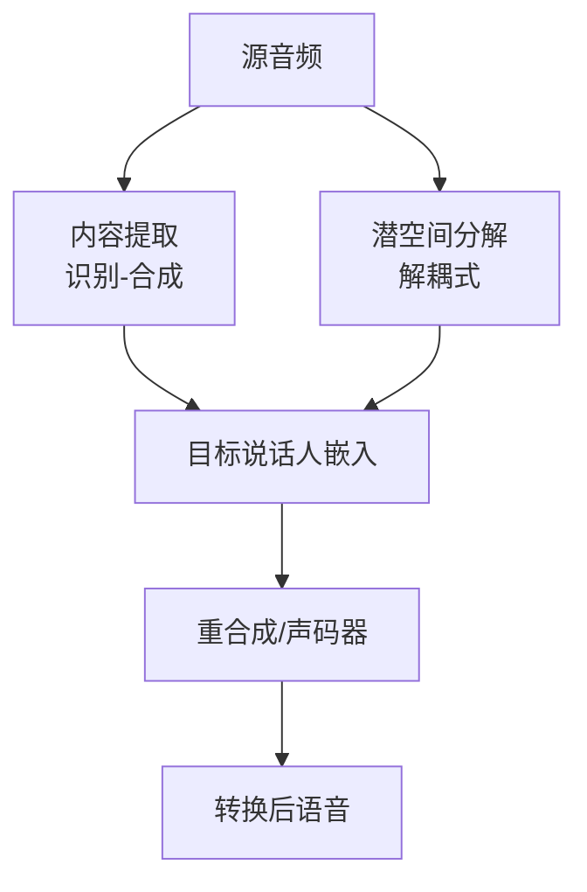
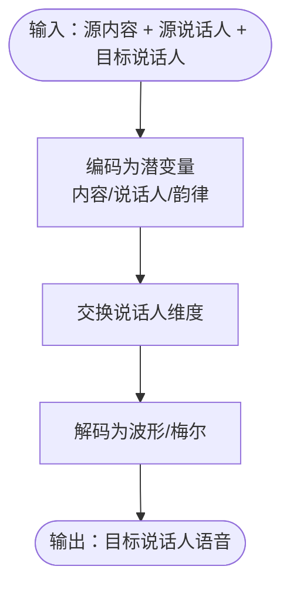
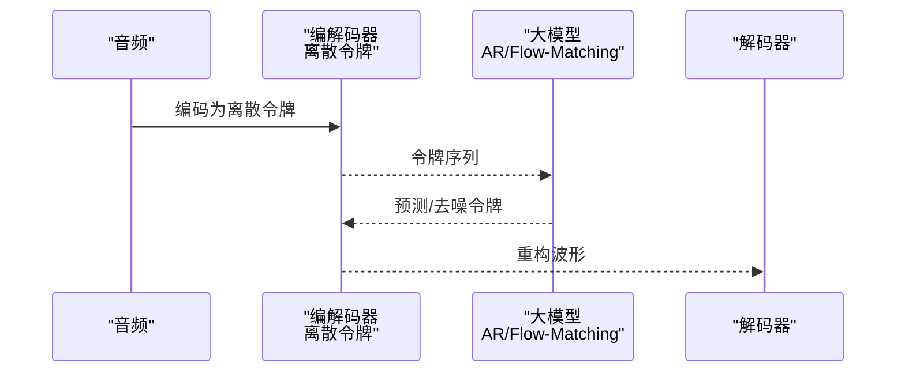
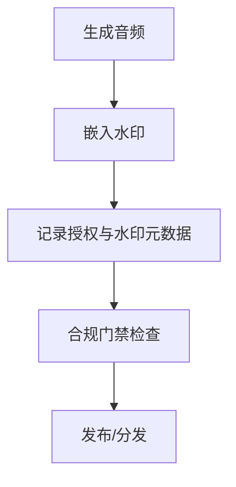
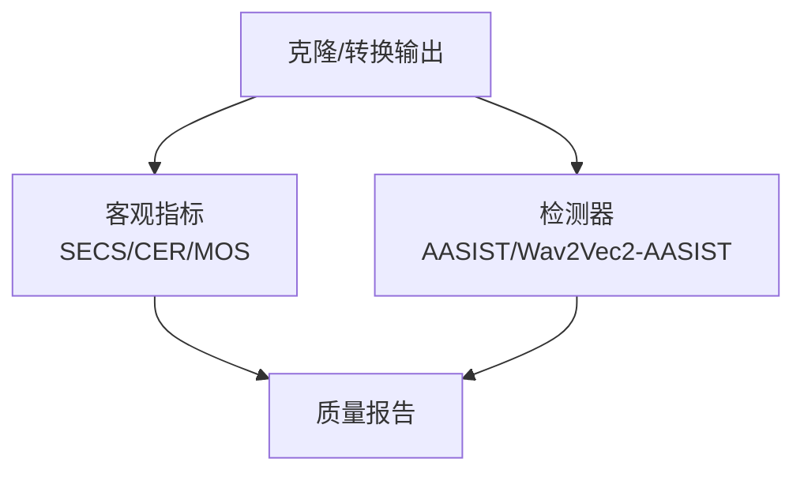
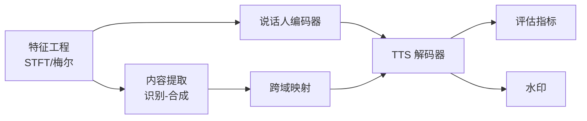

# 声音克隆与转换

<cite>
**本文引用的文件**
- [README.md](file://README.md)
- [ROADMAP.md](file://ROADMAP.md)
- [site/data.js](file://site/data.js)
- [phases/06-speech-and-audio/08-voice-cloning-conversion/docs/en.md](file://phases/06-speech-and-audio/08-voice-cloning-conversion/docs/en.md)
- [phases/06-speech-and-audio/08-voice-cloning-conversion/code/main.py](file://phases/06-speech-and-audio/08-voice-cloning-conversion/code/main.py)
- [phases/06-speech-and-audio/08-voice-cloning-conversion/assets/voice-cloning.svg](file://phases/06-speech-and-audio/08-voice-cloning-conversion/assets/voice-cloning.svg)
- [phases/06-speech-and-audio/08-voice-cloning-conversion/outputs/skill-voice-cloner.md](file://phases/06-speech-and-audio/08-voice-cloning-conversion/outputs/skill-voice-cloner.md)
- [phases/06-speech-and-audio/07-text-to-speech/docs/en.md](file://phases/06-speech-and-audio/07-text-to-speech/docs/en.md)
- [phases/06-speech-and-audio/06-speaker-recognition-verification/docs/en.md](file://phases/06-speech-and-audio/06-speaker-recognition-verification/docs/en.md)
- [phases/06-speech-and-audio/17-audio-evaluation-metrics/docs/en.md](file://phases/06-speech-and-audio/17-audio-evaluation-metrics/docs/en.md)
- [phases/06-speech-and-audio/13-neural-audio-codecs/docs/en.md](file://phases/06-speech-and-audio/13-neural-audio-codecs/docs/en.md)
- [phases/06-speech-and-audio/16-anti-spoofing-audio-watermarking/docs/en.md](file://phases/06-speech-and-audio/16-anti-spoofing-audio-watermarking/docs/en.md)
- [phases/06-speech-and-audio/02-spectrograms-mel-features/docs/en.md](file://phases/06-speech-and-audio/02-spectrograms-mel-features/docs/en.md)
- [phases/06-speech-and-audio/01-audio-fundamentals/docs/en.md](file://phases/06-speech-and-audio/01-audio-fundamentals/docs/en.md)
</cite>

## 目录
1. [引言](#引言)
2. [项目结构](#项目结构)
3. [核心组件](#核心组件)
4. [架构总览](#架构总览)
5. [详细组件分析](#详细组件分析)
6. [依赖关系分析](#依赖关系分析)
7. [性能考量](#性能考量)
8. [故障排查指南](#故障排查指南)
9. [结论](#结论)
10. [附录](#附录)

## 引言
本课程围绕“声音克隆与转换”展开，系统讲解如何将语音分解为内容与说话人特征，并在保留内容不变的前提下进行风格/说话人替换。课程覆盖零样本克隆、少量样本微调、语音转换（识别-合成与解耦式）、跨语种/年龄/性别等应用方向，并结合对抗训练、周期一致性损失、风格保持损失等训练策略，以及水印与合规门禁、检测与评估体系，帮助读者从零构建可落地的声音克隆系统。

## 项目结构
本仓库的第六阶段“语音与音频”包含多门课程，其中与声音克隆与转换直接相关的内容集中在第8课“Voice Cloning & Voice Conversion”，配套有演示代码、技能输出文档与图示资源。同时，前置知识由“说话人识别与验证”“文本转语音”“梅尔谱与音频特征”等课程提供支撑；评估与合规方面由“音频评估指标”“反欺骗与音频水印”等课程补充。

图表来源
- [README.md:421-443](file://README.md#L421-L443)
- [phases/06-speech-and-audio/08-voice-cloning-conversion/docs/en.md:1-172](file://phases/06-speech-and-audio/08-voice-cloning-conversion/docs/en.md#L1-L172)
- [phases/06-speech-and-audio/08-voice-cloning-conversion/code/main.py:1-161](file://phases/06-speech-and-audio/08-voice-cloning-conversion/code/main.py#L1-L161)

章节来源
- [README.md:421-443](file://README.md#L421-L443)
- [ROADMAP.md:163-183](file://ROADMAP.md#L163-L183)
- [site/data.js:1164-1180](file://site/data.js#L1164-L1180)

## 核心组件
- 说话人特征提取器（说话人编码器）：将参考音频映射为说话人嵌入，用于零样本克隆或转换。
- 内容特征提取器（识别-合成路径）：从源音频中抽取内容表示（如软音素后验/PPG），用于转换时保留原意。
- 文本转语音解码器（TTS）：以文本与说话人嵌入为条件，合成目标说话人的语音。
- 跨域映射网络：在潜空间中分离内容、说话人与韵律，实现推理时的说话人替换。
- 音频编解码与离散令牌：以 EnCodec/SoundStream 等离散令牌为建模对象的大语言模型/流匹配模型。
- 水印与合规门禁：嵌入不可感知水印并建立可验证的授权记录，满足法律要求。
- 评估与检测：以 SECS、CER、MOS、WER 等指标评估质量与相似度，使用 AASIST 等检测器评估深度伪造风险。

章节来源
- [phases/06-speech-and-audio/08-voice-cloning-conversion/docs/en.md:10-60](file://phases/06-speech-and-audio/08-voice-cloning-conversion/docs/en.md#L10-L60)
- [phases/06-speech-and-audio/07-text-to-speech/docs/en.md](file://phases/06-speech-and-audio/07-text-to-speech/docs/en.md)
- [phases/06-speech-and-audio/06-speaker-recognition-verification/docs/en.md](file://phases/06-speech-and-audio/06-speaker-recognition-verification/docs/en.md)
- [phases/06-speech-and-audio/17-audio-evaluation-metrics/docs/en.md](file://phases/06-speech-and-audio/17-audio-evaluation-metrics/docs/en.md)
- [phases/06-speech-and-audio/16-anti-spoofing-audio-watermarking/docs/en.md](file://phases/06-speech-and-audio/16-anti-spoofing-audio-watermarking/docs/en.md)

## 架构总览
下图展示声音克隆与转换的端到端流程：参考音频经说话人编码器得到说话人嵌入；文本经 TTS 解码器合成目标说话人语音；语音转换则先用识别-合成路径抽取内容表示，再以目标说话人嵌入重合成；最后进行水印嵌入与合规校验。

图表来源
- [phases/06-speech-and-audio/08-voice-cloning-conversion/assets/voice-cloning.svg](file://phases/06-speech-and-audio/08-voice-cloning-conversion/assets/voice-cloning.svg)
- [phases/06-speech-and-audio/08-voice-cloning-conversion/docs/en.md:23-39](file://phases/06-speech-and-audio/08-voice-cloning-conversion/docs/en.md#L23-L39)

## 详细组件分析

### 组件A：零样本克隆流水线（识别-合成路径）
该路径将参考音频映射为说话人嵌入，文本作为内容输入，TTS 条件化说话人嵌入与文本，生成目标说话人语音。演示脚本展示了内容与说话人向量的构造、合成、相似度探测与水印嵌入/检测流程。

图表来源
- [phases/06-speech-and-audio/08-voice-cloning-conversion/code/main.py:64-83](file://phases/06-speech-and-audio/08-voice-cloning-conversion/code/main.py#L64-L83)
- [phases/06-speech-and-audio/08-voice-cloning-conversion/docs/en.md:62-83](file://phases/06-speech-and-audio/08-voice-cloning-conversion/docs/en.md#L62-L83)

章节来源
- [phases/06-speech-and-audio/08-voice-cloning-conversion/code/main.py:17-84](file://phases/06-speech-and-audio/08-voice-cloning-conversion/code/main.py#L17-L84)
- [phases/06-speech-and-audio/08-voice-cloning-conversion/docs/en.md:62-83](file://phases/06-speech-and-audio/08-voice-cloning-conversion/docs/en.md#L62-L83)

### 组件B：语音转换（识别-合成与解耦式）
- 识别-合成路径：抽取源音频的内容表示（如 PPG），以目标说话人嵌入重合成，鲁棒性强。
- 解耦式路径：在瓶颈层分离内容、说话人、韵律潜变量，推理时仅交换说话人嵌入，速度更快但质量略低。

图表来源
- [phases/06-speech-and-audio/08-voice-cloning-conversion/docs/en.md:33-38](file://phases/06-speech-and-audio/08-voice-cloning-conversion/docs/en.md#L33-L38)

章节来源
- [phases/06-speech-and-audio/08-voice-cloning-conversion/docs/en.md:33-38](file://phases/06-speech-and-audio/08-voice-cloning-conversion/docs/en.md#L33-L38)

### 组件C：跨域映射网络（潜空间说话人交换）
该组件在内容、说话人、韵律的联合潜空间中进行说话人维度的交换，推理时仅替换说话人嵌入，从而在保持内容不变的同时改变说话人特征。

图表来源
- [phases/06-speech-and-audio/08-voice-cloning-conversion/docs/en.md:36](file://phases/06-speech-and-audio/08-voice-cloning-conversion/docs/en.md#L36)

章节来源
- [phases/06-speech-and-audio/08-voice-cloning-conversion/docs/en.md:36](file://phases/06-speech-and-audio/08-voice-cloning-conversion/docs/en.md#L36)

### 组件D：神经编解码器风格建模（VALL-E 系列）
将音频视为来自 SoundStream/EnCodec 的离散令牌序列，使用自回归或流匹配模型在令牌空间建模，实现高质量克隆与生成。

图表来源
- [phases/06-speech-and-audio/13-neural-audio-codecs/docs/en.md](file://phases/06-speech-and-audio/13-neural-audio-codecs/docs/en.md)
- [phases/06-speech-and-audio/08-voice-cloning-conversion/docs/en.md:38](file://phases/06-speech-and-audio/08-voice-cloning-conversion/docs/en.md#L38)

章节来源
- [phases/06-speech-and-audio/08-voice-cloning-conversion/docs/en.md:38](file://phases/06-speech-and-audio/08-voice-cloning-conversion/docs/en.md#L38)
- [phases/06-speech-and-audio/13-neural-audio-codecs/docs/en.md](file://phases/06-speech-and-audio/13-neural-audio-codecs/docs/en.md)

### 组件E：水印与合规门禁
- 水印：在感知域嵌入约 32 位不可感知标识，能抵抗重编码与常见编辑。
- 合规门禁：每笔克隆输出需绑定可验证授权记录，存储防篡改日志。

图表来源
- [phases/06-speech-and-audio/08-voice-cloning-conversion/docs/en.md:98-120](file://phases/06-speech-and-audio/08-voice-cloning-conversion/docs/en.md#L98-L120)
- [phases/06-speech-and-audio/16-anti-spoofing-audio-watermarking/docs/en.md](file://phases/06-speech-and-audio/16-anti-spoofing-audio-watermarking/docs/en.md)

章节来源
- [phases/06-speech-and-audio/08-voice-cloning-conversion/docs/en.md:98-120](file://phases/06-speech-and-audio/08-voice-cloning-conversion/docs/en.md#L98-L120)
- [phases/06-speech-and-audio/16-anti-spoofing-audio-watermarking/docs/en.md](file://phases/06-speech-and-audio/16-anti-spoofing-audio-watermarking/docs/en.md)

### 组件F：评估与检测
- 克隆质量：SECS（说话人嵌入余弦相似度）、CER（字符错误率）、MOS（语音自然度）。
- 深度伪造检测：AASIST、Wav2Vec2-AASIST 等检测器评估合成语音的可辨识度。

图表来源
- [phases/06-speech-and-audio/17-audio-evaluation-metrics/docs/en.md](file://phases/06-speech-and-audio/17-audio-evaluation-metrics/docs/en.md)
- [phases/06-speech-and-audio/08-voice-cloning-conversion/docs/en.md:48-58](file://phases/06-speech-and-audio/08-voice-cloning-conversion/docs/en.md#L48-L58)

章节来源
- [phases/06-speech-and-audio/17-audio-evaluation-metrics/docs/en.md](file://phases/06-speech-and-audio/17-audio-evaluation-metrics/docs/en.md)
- [phases/06-speech-and-audio/08-voice-cloning-conversion/docs/en.md:48-58](file://phases/06-speech-and-audio/08-voice-cloning-conversion/docs/en.md#L48-L58)

## 依赖关系分析
声音克隆与转换的实现依赖于多个前置能力与工具链：
- 特征工程：STFT、梅尔滤波、对数幅度等，确保神经网络消费高质量频谱特征。
- 说话人建模：ECAPA-TDNN 等说话人编码器输出稳定嵌入。
- 文本转语音：TTS 解码器以文本与说话人嵌入为条件生成语音。
- 评估与合规：SECS、CER、MOS、AASIST 等指标与水印/检测工具。

图表来源
- [phases/06-speech-and-audio/02-spectrograms-mel-features/docs/en.md](file://phases/06-speech-and-audio/02-spectrograms-mel-features/docs/en.md)
- [phases/06-speech-and-audio/06-speaker-recognition-verification/docs/en.md](file://phases/06-speech-and-audio/06-speaker-recognition-verification/docs/en.md)
- [phases/06-speech-and-audio/07-text-to-speech/docs/en.md](file://phases/06-speech-and-audio/07-text-to-speech/docs/en.md)
- [phases/06-speech-and-audio/17-audio-evaluation-metrics/docs/en.md](file://phases/06-speech-and-audio/17-audio-evaluation-metrics/docs/en.md)
- [phases/06-speech-and-audio/16-anti-spoofing-audio-watermarking/docs/en.md](file://phases/06-speech-and-audio/16-anti-spoofing-audio-watermarking/docs/en.md)

章节来源
- [phases/06-speech-and-audio/02-spectrograms-mel-features/docs/en.md](file://phases/06-speech-and-audio/02-spectrograms-mel-features/docs/en.md)
- [phases/06-speech-and-audio/06-speaker-recognition-verification/docs/en.md](file://phases/06-speech-and-audio/06-speaker-recognition-verification/docs/en.md)
- [phases/06-speech-and-audio/07-text-to-speech/docs/en.md](file://phases/06-speech-and-audio/07-text-to-speech/docs/en.md)
- [phases/06-speech-and-audio/17-audio-evaluation-metrics/docs/en.md](file://phases/06-speech-and-audio/17-audio-evaluation-metrics/docs/en.md)
- [phases/06-speech-and-audio/16-anti-spoofing-audio-watermarking/docs/en.md](file://phases/06-speech-and-audio/16-anti-spoofing-audio-watermarking/docs/en.md)

## 性能考量
- 计算复杂度：TTS 与编解码器的计算开销与模型规模、令牌长度、解码策略密切相关；离散令牌建模可显著提升质量但增加推理成本。
- 实时性：语音助手与流式场景需权衡延迟与质量，采用快速解码策略与轻量化子模块。
- 数据与特征：高质量参考音频与稳健的梅尔特征是零样本克隆的关键；避免混响与情感不一致。
- 法律与伦理：必须嵌入水印并建立授权门禁，满足欧盟与加州等法规要求。

## 故障排查指南
- 参考文本不匹配：零样本克隆要求参考文本与音频严格一致，否则对齐失败。
- 参考音频质量差：混响、噪声会破坏说话人表征，建议干声、近讲录制。
- 情感不一致：训练参考情感与用途不匹配会导致克隆情感偏差。
- 语言泄漏：跨语言克隆需使用支持多语言的模型（如 XTTS、VALL-E X）。
- 无水印：未嵌入水印将无法在相关司法管辖区合法投放。

章节来源
- [phases/06-speech-and-audio/08-voice-cloning-conversion/docs/en.md:134-141](file://phases/06-speech-and-audio/08-voice-cloning-conversion/docs/en.md#L134-L141)

## 结论
本课程从理论到实践全面覆盖声音克隆与转换的关键技术：内容-说话人解耦、识别-合成与解耦式转换、神经编解码器风格建模、水印与合规、评估与检测。通过演示脚本与课程讲义，读者可以理解并实现从零到一的声音克隆系统，并在真实场景中安全、可控地部署。

## 附录
- 技能输出：将本课程的实现思路与最佳实践整理为技能文档，便于复用与交付。
- 进一步阅读：可参考课程讲义中列出的代表性论文与模型，扩展至更多应用方向（如跨语种、年龄/性别变换）。

章节来源
- [phases/06-speech-and-audio/08-voice-cloning-conversion/outputs/skill-voice-cloner.md](file://phases/06-speech-and-audio/08-voice-cloning-conversion/outputs/skill-voice-cloner.md)
- [phases/06-speech-and-audio/08-voice-cloning-conversion/docs/en.md:164-172](file://phases/06-speech-and-audio/08-voice-cloning-conversion/docs/en.md#L164-L172)