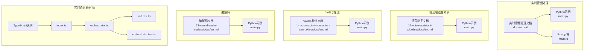
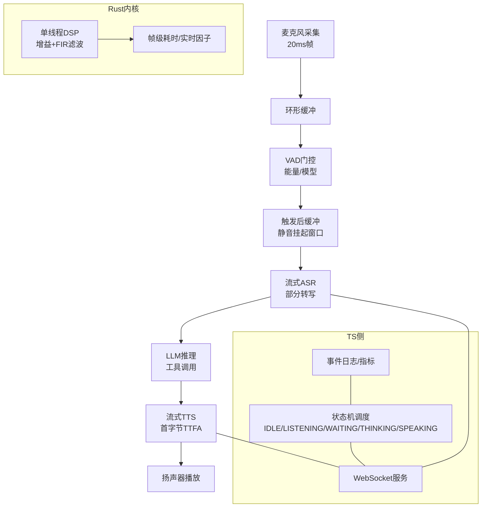
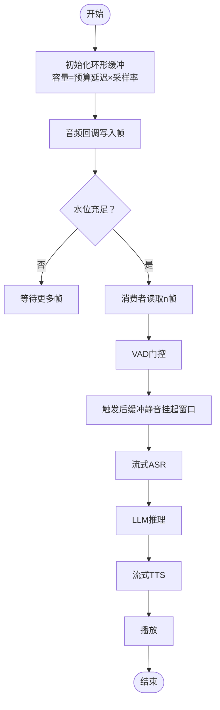
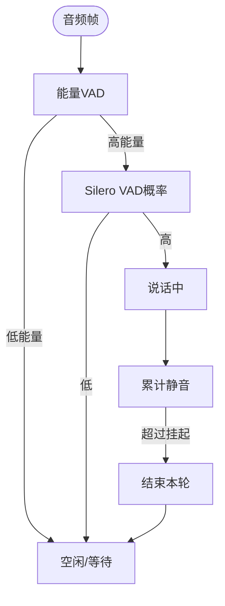
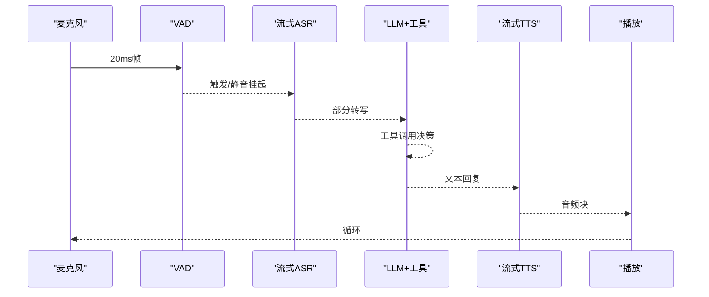
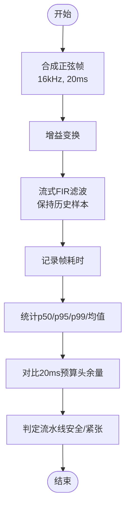
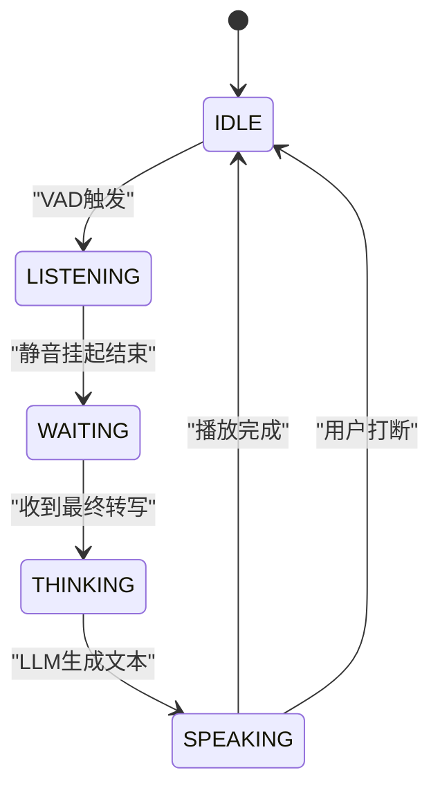
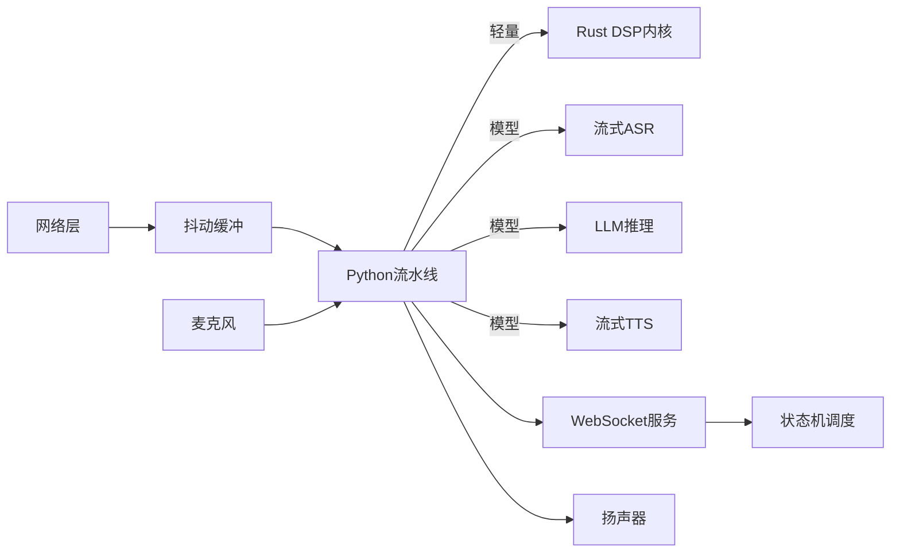

# 实时音频处理

<cite>
**本文引用的文件**
- [实时音频处理（文档）](file://phases/06-speech-and-audio/11-real-time-audio-processing/docs/en.md)
- [实时音频处理（Python示例）](file://phases/06-speech-and-audio/11-real-time-audio-processing/code/main.py)
- [实时音频处理（Rust示例）](file://phases/06-speech-and-audio/11-real-time-audio-processing/code/main.rs)
- [端到端语音助手（Python示例）](file://phases/06-speech-and-audio/12-voice-assistant-pipeline/code/main.py)
- [语音活动检测与轮流（Python示例）](file://phases/06-speech-and-audio/14-voice-activity-detection-turn-taking/code/main.py)
- [神经音频编解码（Python示例）](file://phases/06-speech-and-audio/13-neural-audio-codecs/code/main.py)
- [实时语音助手（TypeScript前端）](file://phases/19-capstone-projects/03-realtime-voice-assistant/code/ts/src/index.ts)
- [实时语音助手（Orchestrator）](file://phases/19-capstone-projects/03-realtime-voice-assistant/code/ts/src/orchestrator.ts)
- [实时语音助手（VAD测试）](file://phases/19-capstone-projects/03-realtime-voice-assistant/code/ts/tests/vad.test.ts)
- [实时语音助手（Orchestrator测试）](file://phases/19-capstone-projects/03-realtime-voice-assistant/code/ts/tests/orchestrator.test.ts)
- [实时语音助手（TypeScript说明）](file://phases/19-capstone-projects/03-realtime-voice-assistant/code/ts/README.md)
- [站点图表示例：采样与混叠](file://site/figures-vision-speech.js)
- [路线图（Phase 6）](file://ROADMAP.md)
- [站点数据索引](file://site/data.js)
</cite>

## 目录
1. [简介](#简介)
2. [项目结构](#项目结构)
3. [核心组件](#核心组件)
4. [架构总览](#架构总览)
5. [详细组件分析](#详细组件分析)
6. [依赖关系分析](#依赖关系分析)
7. [性能考量](#性能考量)
8. [故障排查指南](#故障排查指南)
9. [结论](#结论)
10. [附录](#附录)

## 简介
本文件面向“实时音频处理”课程，系统梳理从零构建低延迟音频处理流水线的关键技术与工程实践，覆盖缓冲管理、延迟控制、吞吐量优化、多线程与异步I/O、同步与状态管理、错误恢复、性能监控与调试等主题。文档以仓库中“语音与音频”阶段的实战代码为基础，结合实时语音助手的端到端示例，给出可直接参考的实现路径与可视化流程。

## 项目结构
本课程围绕“语音与音频”阶段的多个实战模块展开，重点包括：
- 实时音频处理（Python/Rust）：环形缓冲、能量VAD、流式ASR、中断处理、吞吐度量
- 端到端语音助手：麦克风采集、VAD、流式STT、LLM工具调用、流式TTS、播放
- 语音活动检测与轮流：三级级联VAD与轮流检测状态机
- 神经音频编解码：RVQ量化与语义-声学因子化
- 实时语音助手（TypeScript）：WebSocket服务、状态机调度、打点与断言

**图表来源**
- [实时音频处理（文档）](file://phases/06-speech-and-audio/11-real-time-audio-processing/docs/en.md)
- [实时音频处理（Python示例）](file://phases/06-speech-and-audio/11-real-time-audio-processing/code/main.py)
- [实时音频处理（Rust示例）](file://phases/06-speech-and-audio/11-real-time-audio-processing/code/main.rs)
- [端到端语音助手（Python示例）](file://phases/06-speech-and-audio/12-voice-assistant-pipeline/code/main.py)
- [语音活动检测与轮流（Python示例）](file://phases/06-speech-and-audio/14-voice-activity-detection-turn-taking/code/main.py)
- [神经音频编解码（Python示例）](file://phases/06-speech-and-audio/13-neural-audio-codecs/code/main.py)
- [实时语音助手（TypeScript前端）](file://phases/19-capstone-projects/03-realtime-voice-assistant/code/ts/src/index.ts)
- [实时语音助手（Orchestrator）](file://phases/19-capstone-projects/03-realtime-voice-assistant/code/ts/src/orchestrator.ts)
- [实时语音助手（VAD测试）](file://phases/19-capstone-projects/03-realtime-voice-assistant/code/ts/tests/vad.test.ts)
- [实时语音助手（Orchestrator测试）](file://phases/19-capstone-projects/03-realtime-voice-assistant/code/ts/tests/orchestrator.test.ts)
- [实时语音助手（TypeScript说明）](file://phases/19-capstone-projects/03-realtime-voice-assistant/code/ts/README.md)

**章节来源**
- [实时音频处理（文档）](file://phases/06-speech-and-audio/11-real-time-audio-processing/docs/en.md)
- [实时音频处理（Python示例）](file://phases/06-speech-and-audio/11-real-time-audio-processing/code/main.py)
- [实时音频处理（Rust示例）](file://phases/06-speech-and-audio/11-real-time-audio-processing/code/main.rs)
- [端到端语音助手（Python示例）](file://phases/06-speech-and-audio/12-voice-assistant-pipeline/code/main.py)
- [语音活动检测与轮流（Python示例）](file://phases/06-speech-and-audio/14-voice-activity-detection-turn-taking/code/main.py)
- [神经音频编解码（Python示例）](file://phases/06-speech-and-audio/13-neural-audio-codecs/code/main.py)
- [实时语音助手（TypeScript前端）](file://phases/19-capstone-projects/03-realtime-voice-assistant/code/ts/src/index.ts)
- [实时语音助手（Orchestrator）](file://phases/19-capstone-projects/03-realtime-voice-assistant/code/ts/src/orchestrator.ts)
- [实时语音助手（VAD测试）](file://phases/19-capstone-projects/03-realtime-voice-assistant/code/ts/tests/vad.test.ts)
- [实时语音助手（Orchestrator测试）](file://phases/19-capstone-projects/03-realtime-voice-assistant/code/ts/tests/orchestrator.test.ts)
- [实时语音助手（TypeScript说明）](file://phases/19-capstone-projects/03-realtime-voice-assistant/code/ts/README.md)

## 核心组件
- 环形缓冲（Ring Buffer）
  - 固定容量的循环队列，避免热路径上的频繁分配；容量与最大延迟预算相关（如2秒、16kHz样本数≈32000）
  - 在Python示例中通过双端队列实现写入与读取
- 能量VAD（Energy VAD）
  - 基于RMS能量阈值判断是否活跃；在生产环境建议替换为更鲁棒的模型（如Silero VAD）
- 流式ASR
  - 模拟流式转写过程，输出部分文本；实际可接入NeMo Parakeet或Whisper-Streaming
- 中断处理（Bar-urge-in）
  - 用户在助手说话期间打断时，需快速取消TTS并切换到新的ASR输入
- Rust内核DSP
  - 单线程流式FIR滤波、增益、帧级耗时统计与实时因子评估，用于验证流水线在20ms帧预算下的吞吐余量

**章节来源**
- [实时音频处理（文档）](file://phases/06-speech-and-audio/11-real-time-audio-processing/docs/en.md)
- [实时音频处理（Python示例）](file://phases/06-speech-and-audio/11-real-time-audio-processing/code/main.py)
- [实时音频处理（Rust示例）](file://phases/06-speech-and-audio/11-real-time-audio-processing/code/main.rs)

## 架构总览
下图展示了从麦克风到播放的端到端实时音频处理流水线，包含VAD门控、环形缓冲、流式ASR、LLM工具调用、流式TTS与播放。同时展示TS侧的状态机与WebSocket交互，以及RMS/吞吐度量。

**图表来源**
- [实时音频处理（文档）](file://phases/06-speech-and-audio/11-real-time-audio-processing/docs/en.md)
- [端到端语音助手（Python示例）](file://phases/06-speech-and-audio/12-voice-assistant-pipeline/code/main.py)
- [实时语音助手（TypeScript前端）](file://phases/19-capstone-projects/03-realtime-voice-assistant/code/ts/src/index.ts)
- [实时语音助手（Orchestrator）](file://phases/19-capstone-projects/03-realtime-voice-assistant/code/ts/src/orchestrator.ts)
- [实时音频处理（Rust示例）](file://phases/06-speech-and-audio/11-real-time-audio-processing/code/main.rs)

## 详细组件分析

### 环形缓冲与延迟预算
- 设计要点
  - 容量=预算延迟×采样率；例如2秒×16kHz≈32000样本
  - 写入由音频回调线程执行，读取由处理线程消费，避免GIL与重计算阻塞
- 关键接口
  - 写入/读取/水位查询；在Python示例中体现为双端队列的扩展与弹出
- 延迟预算
  - 全链路预算约400ms，其中Mic→缓冲占20ms，VAD约10ms，STT约150ms，LLM约100ms，TTS首字节约100ms，渲染约20ms

**图表来源**
- [实时音频处理（文档）](file://phases/06-speech-and-audio/11-real-time-audio-processing/docs/en.md)
- [实时音频处理（Python示例）](file://phases/06-speech-and-audio/11-real-time-audio-processing/code/main.py)

**章节来源**
- [实时音频处理（文档）](file://phases/06-speech-and-audio/11-real-time-audio-processing/docs/en.md)
- [实时音频处理（Python示例）](file://phases/06-speech-and-audio/11-real-time-audio-processing/code/main.py)

### VAD与轮流检测
- 能量VAD作为第一道门，Silero VAD作为生产替代
- 三段式级联：能量门→模型VAD→轮流状态机（最小语音时长、静音挂起、预滚缓冲）
- 针对清咳等瞬态干扰，模型VAD能更好抑制误触发

**图表来源**
- [语音活动检测与轮流（Python示例）](file://phases/06-speech-and-audio/14-voice-activity-detection-turn-taking/code/main.py)

**章节来源**
- [语音活动检测与轮流（Python示例）](file://phases/06-speech-and-audio/14-voice-activity-detection-turn-taking/code/main.py)

### 流式ASR与工具调用
- 流式ASR在音频到达的同时输出部分文本，降低端到端延迟
- LLM阶段支持工具调用（如设置定时器），随后进入TTS阶段
- Python示例模拟了从采集、VAD、STT、LLM工具、TTS到播放的完整流程

**图表来源**
- [端到端语音助手（Python示例）](file://phases/06-speech-and-audio/12-voice-assistant-pipeline/code/main.py)

**章节来源**
- [端到端语音助手（Python示例）](file://phases/06-speech-and-audio/12-voice-assistant-pipeline/code/main.py)

### Rust内核DSP与吞吐度量
- 单线程流式FIR滤波与增益，记录每帧耗时并计算中位/95/99分位与平均值
- 计算实时因子与每99分位的“头余量”，判断流水线在20ms预算下是否安全
- 适合在Python热路径之外进行关键DSP计算，或作为性能基线

**图表来源**
- [实时音频处理（Rust示例）](file://phases/06-speech-and-audio/11-real-time-audio-processing/code/main.rs)

**章节来源**
- [实时音频处理（Rust示例）](file://phases/06-speech-and-audio/11-real-time-audio-processing/code/main.rs)

### TypeScript状态机与WebSocket
- 状态机：IDLE → LISTENING → WAITING → THINKING → SPEAKING，支持用户打断与填充注入
- WebSocket服务：健康检查与升级，接收/发送协议化帧
- 断言与测试：对回合完成评分、帧序列单调性、打断次数等进行验证

**图表来源**
- [实时语音助手（Orchestrator）](file://phases/19-capstone-projects/03-realtime-voice-assistant/code/ts/src/orchestrator.ts)
- [实时语音助手（TypeScript前端）](file://phases/19-capstone-projects/03-realtime-voice-assistant/code/ts/src/index.ts)

**章节来源**
- [实时语音助手（Orchestrator）](file://phases/19-capstone-projects/03-realtime-voice-assistant/code/ts/src/orchestrator.ts)
- [实时语音助手（TypeScript前端）](file://phases/19-capstone-projects/03-realtime-voice-assistant/code/ts/src/index.ts)
- [实时语音助手（VAD测试）](file://phases/19-capstone-projects/03-realtime-voice-assistant/code/ts/tests/vad.test.ts)
- [实时语音助手（Orchestrator测试）](file://phases/19-capstone-projects/03-realtime-voice-assistant/code/ts/tests/orchestrator.test.ts)
- [实时语音助手（TypeScript说明）](file://phases/19-capstone-projects/03-realtime-voice-assistant/code/ts/README.md)

### 编解码与语义-声学因子化
- RVQ级联小码书优于单一大码书，降低存储与计算复杂度
- 语义-声学因子化（如Mimi）先生成语义tokens再生成声学残差，利于克隆音色与高质量重建
- 适用于端到端生成与压缩场景

**章节来源**
- [神经音频编解码（Python示例）](file://phases/06-speech-and-audio/13-neural-audio-codecs/code/main.py)

## 依赖关系分析
- Python热路径应尽量避免重型计算，将关键DSP移至Rust或C/C++扩展
- VAD与ASR模型加载与预热，确保首次请求的TTFA满足预算
- WebSocket服务与状态机解耦，便于独立测试与演进
- 网络抖动缓冲（Jitter Buffer）与回声消除（AEC3）在全双工场景至关重要

**图表来源**
- [实时音频处理（Python示例）](file://phases/06-speech-and-audio/11-real-time-audio-processing/code/main.py)
- [实时音频处理（Rust示例）](file://phases/06-speech-and-audio/11-real-time-audio-processing/code/main.rs)
- [端到端语音助手（Python示例）](file://phases/06-speech-and-audio/12-voice-assistant-pipeline/code/main.py)
- [实时语音助手（TypeScript前端）](file://phases/19-capstone-projects/03-realtime-voice-assistant/code/ts/src/index.ts)

**章节来源**
- [实时音频处理（文档）](file://phases/06-speech-and-audio/11-real-time-audio-processing/docs/en.md)
- [端到端语音助手（Python示例）](file://phases/06-speech-and-audio/12-voice-assistant-pipeline/code/main.py)
- [实时语音助手（TypeScript前端）](file://phases/19-capstone-projects/03-realtime-voice-assistant/code/ts/src/index.ts)

## 性能考量
- 帧大小与预算
  - 20ms帧是业界标准；过小的块会引入更多开销，过大则增加延迟
- 实时因子与头余量
  - 使用Rust示例的统计方法评估p99耗时与预算比，确保不掉帧
- 线程与I/O
  - 避免在Python热路径做重活；采用C回调音频库与异步I/O
- 模型预热与缓存
  - TTS首字节TTFA通常有冷启动成本，需预热与缓存
- 网络与回声
  - 抖动缓冲与AEC3减少延迟与音频失真

[本节为通用指导，无需特定文件引用]

## 故障排查指南
- 帧级耗时异常
  - 使用Rust示例的统计输出定位p95/p99瓶颈
- 打断（Barge-in）未生效
  - 检查VAD状态机与WebSocket事件传递；确认打断时间点与取消逻辑
- 无摘要帧
  - 确认WebSocket服务端升级与消息序列正确；查看断言测试
- 采样与混叠
  - 参考站点图表示例，确保采样率高于奈奎斯特定律两倍以上，并在采样前低通滤波

**章节来源**
- [实时音频处理（Rust示例）](file://phases/06-speech-and-audio/11-real-time-audio-processing/code/main.rs)
- [实时语音助手（VAD测试）](file://phases/19-capstone-projects/03-realtime-voice-assistant/code/ts/tests/vad.test.ts)
- [实时语音助手（Orchestrator测试）](file://phases/19-capstone-projects/03-realtime-voice-assistant/code/ts/tests/orchestrator.test.ts)
- [站点图表示例：采样与混叠](file://site/figures-vision-speech.js)

## 结论
通过环形缓冲、VAD门控、流式ASR/LLM/TTS与Rust内核DSP的组合，可在20ms帧预算下实现稳定的低延迟实时音频处理。配合WebSocket状态机与严格的性能度量，可进一步提升用户体验与工程可靠性。生产落地建议优先采用成熟的模型与框架，并在关键环节进行预热与头余量校验。

[本节为总结性内容，无需特定文件引用]

## 附录
- 相关学习路径与技能清单可参考站点数据索引与路线图
- 更多图示与可视化资源可参考站点脚本中的音频/视觉演示

**章节来源**
- [站点数据索引](file://site/data.js)
- [路线图（Phase 6）](file://ROADMAP.md)