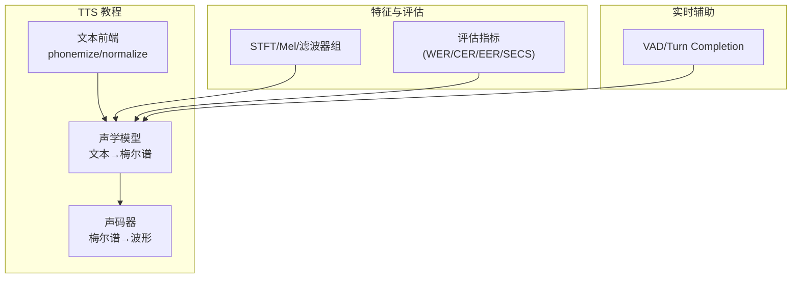
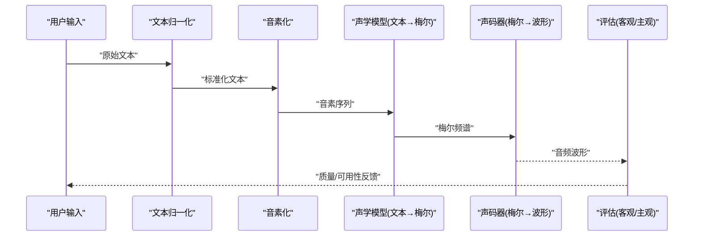
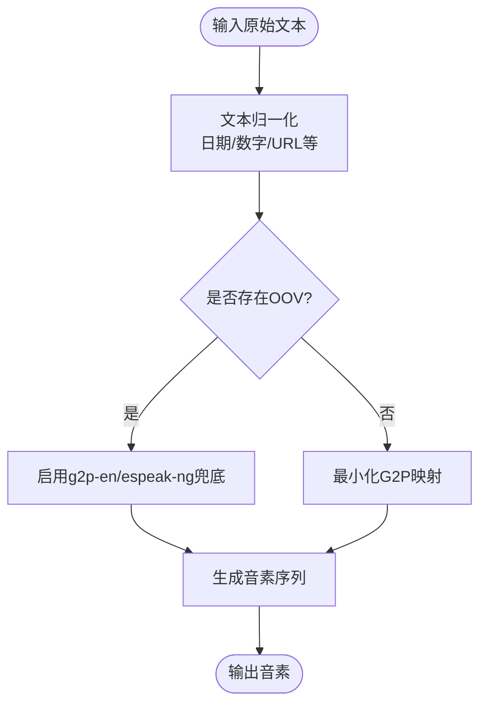
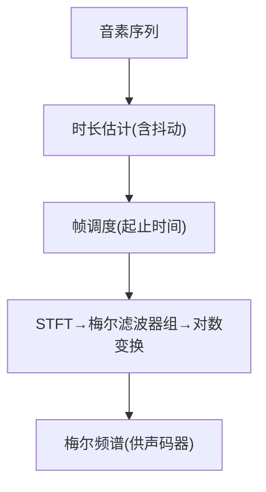
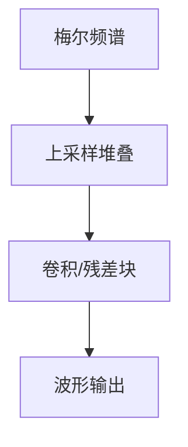
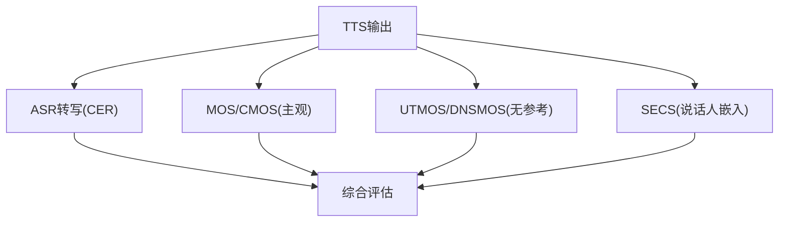

# 文本转语音

<cite>
**本文引用的文件**
- [phases/06-speech-and-audio/07-text-to-speech/docs/en.md](file://phases/06-speech-and-audio/07-text-to-speech/docs/en.md)
- [phases/06-speech-and-audio/07-text-to-speech/docs/zh.md](file://phases/06-speech-and-audio/07-text-to-speech/docs/zh.md)
- [phases/06-speech-and-audio/07-text-to-speech/code/main.py](file://phases/06-speech-and-audio/07-text-to-speech/code/main.py)
- [phases/06-speech-and-audio/07-text-to-speech/outputs/skill-tts-designer.md](file://phases/06-speech-and-audio/07-text-to-speech/outputs/skill-tts-designer.md)
- [phases/06-speech-and-audio/02-spectrograms-mel-features/code/main.py](file://phases/06-speech-and-audio/02-spectrograms-mel-features/code/main.py)
- [phases/06-speech-and-audio/17-audio-evaluation-metrics/code/main.py](file://phases/06-speech-and-audio/17-audio-evaluation-metrics/code/main.py)
- [site/figures-vision-speech.js](file://site/figures-vision-speech.js)
- [phases/19-capstone-projects/03-realtime-voice-assistant/code/ts/src/vad.ts](file://phases/19-capstone-projects/03-realtime-voice-assistant/code/ts/src/vad.ts)
- [phases/19-capstone-projects/03-realtime-voice-assistant/code/ts/tests/vad.test.ts](file://phases/19-capstone-projects/03-realtime-voice-assistant/code/ts/tests/vad.test.ts)
</cite>

## 目录
1. [简介](#简介)
2. [项目结构](#项目结构)
3. [核心组件](#核心组件)
4. [架构总览](#架构总览)
5. [详细组件分析](#详细组件分析)
6. [依赖关系分析](#依赖关系分析)
7. [性能考虑](#性能考虑)
8. [故障排查指南](#故障排查指南)
9. [结论](#结论)
10. [附录](#附录)

## 简介
本文件面向“从零实现文本转语音（TTS）系统”的课程目标，系统性梳理TTS技术路线与工程实践，覆盖拼接合成、参数合成、神经合成三大范式，以及端到端TTS的架构设计（文本前端、声学特征预测、声码器）。文档同时提供从零实现的步骤指引、关键模块的代码路径、语音质量评估指标（MOS、CER、SECS等）与实时/批量优化策略，帮助读者完成可运行的TTS流水线。

## 项目结构
本课程围绕“语音与音频”阶段展开，重点文件分布如下：
- 文档与示例：text-to-speech/docs 与 code
- 频谱与梅尔特征：spectrograms-mel-features/code
- 评估指标：audio-evaluation-metrics/code
- 实时语音助手中的VAD与合成：realtime-voice-assistant/ts

**章节来源**
- [phases/06-speech-and-audio/07-text-to-speech/docs/en.md:14-20](file://phases/06-speech-and-audio/07-text-to-speech/docs/en.md#L14-L20)
- [phases/06-speech-and-audio/02-spectrograms-mel-features/code/main.py:112-161](file://phases/06-speech-and-audio/02-spectrograms-mel-features/code/main.py#L112-L161)
- [phases/06-speech-and-audio/17-audio-evaluation-metrics/code/main.py:80-146](file://phases/06-speech-and-audio/17-audio-evaluation-metrics/code/main.py#L80-L146)

## 核心组件
- 文本前端（Normalization + Phonemization）
  - 文本归一化：日期、数字、URL等标准化，避免歧义
  - 音素化：将文本映射为音素序列，建议使用成熟的后端（如espeak-ng）
- 声学模型（Acoustic Model）
  - 传统路线：Tacotron 2（自回归）、FastSpeech 2（非自回归）
  - 现代端到端：VITS、F5-TTS、Kokoro
- 声码器（Vocoder）
  - WaveNet、WaveRNN、HiFi-GAN、BigVGAN、神经编解码器（SNAC/DAC）
- 评估与质量度量
  - MOS/CMOS、UTMOS/DNSMOS、CER（经ASR）、SECS（说话人相似度）

**章节来源**
- [phases/06-speech-and-audio/07-text-to-speech/docs/en.md:14-20](file://phases/06-speech-and-audio/07-text-to-speech/docs/en.md#L14-L20)
- [phases/06-speech-and-audio/07-text-to-speech/docs/en.md:50-68](file://phases/06-speech-and-audio/07-text-to-speech/docs/en.md#L50-L68)

## 架构总览
下图展示从文本到波形的三段式流水线，以及与特征提取、评估、实时VAD的衔接。

**图表来源**
- [phases/06-speech-and-audio/07-text-to-speech/docs/en.md:14-20](file://phases/06-speech-and-audio/07-text-to-speech/docs/en.md#L14-L20)
- [phases/06-speech-and-audio/07-text-to-speech/code/main.py:91-116](file://phases/06-speech-and-audio/07-text-to-speech/code/main.py#L91-L116)

**章节来源**
- [phases/06-speech-and-audio/07-text-to-speech/docs/en.md:14-20](file://phases/06-speech-and-audio/07-text-to-speech/docs/en.md#L14-L20)
- [phases/06-speech-and-audio/07-text-to-speech/code/main.py:91-116](file://phases/06-speech-and-audio/07-text-to-speech/code/main.py#L91-L116)

## 详细组件分析

### 文本前端：字符规范化与音素转换
- 字符规范化
  - 处理日期、时间、数字、邮箱、URL等，减少歧义
  - 与音素化前后顺序：必须先归一化再音素化
- 音素化
  - 使用成熟工具链（如espeak-ng/g2p-en）；演示脚本提供最小化G2P映射
  - 注意OOV（未登录词）兜底策略

**图表来源**
- [phases/06-speech-and-audio/07-text-to-speech/docs/en.md:71-79](file://phases/06-speech-and-audio/07-text-to-speech/docs/en.md#L71-L79)
- [phases/06-speech-and-audio/07-text-to-speech/code/main.py:14-38](file://phases/06-speech-and-audio/07-text-to-speech/code/main.py#L14-L38)

**章节来源**
- [phases/06-speech-and-audio/07-text-to-speech/docs/en.md:71-79](file://phases/06-speech-and-audio/07-text-to-speech/docs/en.md#L71-L79)
- [phases/06-speech-and-audio/07-text-to-speech/code/main.py:14-38](file://phases/06-speech-and-audio/07-text-to-speech/code/main.py#L14-L38)

### 声学特征预测：从音素到梅尔谱
- 时长估计与帧调度
  - 基于音素的典型时长（帧数@12.5ms hop），加入抖动模拟自然韵律
  - 生成音素→起止时间的帧调度，估算总时长与内存预算
- 梅尔谱生成
  - 使用STFT+汉宁窗+梅尔滤波器组+对数变换
  - 作为声码器输入的中间表示

**图表来源**
- [phases/06-speech-and-audio/07-text-to-speech/code/main.py:72-88](file://phases/06-speech-and-audio/07-text-to-speech/code/main.py#L72-L88)
- [phases/06-speech-and-audio/02-spectrograms-mel-features/code/main.py:50-101](file://phases/06-speech-and-audio/02-spectrograms-mel-features/code/main.py#L50-L101)

**章节来源**
- [phases/06-speech-and-audio/07-text-to-speech/code/main.py:82-88](file://phases/06-speech-and-audio/07-text-to-speech/code/main.py#L82-L88)
- [phases/06-speech-and-audio/02-spectrograms-mel-features/code/main.py:50-101](file://phases/06-speech-and-audio/02-spectrograms-mel-features/code/main.py#L50-L101)

### 声码器：从梅尔谱到波形
- 传统声码器
  - WaveNet/WaveRNN：自回归，质量高但延迟大
  - HiFi-GAN/BigVGAN：非自回归，实时性更好
- 神经编解码器
  - SNAC/DAC：离散表示，比特效率更高，常与AR模型集成
- 从零实现要点
  - 上采样堆叠（upsample_rates）、判别器对抗损失、梅尔重建与特征匹配损失

**图表来源**
- [phases/06-speech-and-audio/07-text-to-speech/docs/en.md:106-121](file://phases/06-speech-and-audio/07-text-to-speech/docs/en.md#L106-L121)

**章节来源**
- [phases/06-speech-and-audio/07-text-to-speech/docs/en.md:106-121](file://phases/06-speech-and-audio/07-text-to-speech/docs/en.md#L106-L121)

### 从零实现TTS流水线（步骤指引）
- 步骤1：安装依赖并准备数据
  - 安装phonemizer、kokoro/f5-tts等（按需）
- 步骤2：文本归一化与音素化
  - 使用espeak-ng或g2p-en；确保OOV兜底
- 步骤3：声学模型推理
  - 使用Kokoro（CPU友好）或F5-TTS（零样本克隆）
- 步骤4：声码器合成
  - 采用HiFi-GAN或加载预训练权重
- 步骤5：保存与播放
  - 写入WAV并校验采样率与幅度范围

**章节来源**
- [phases/06-speech-and-audio/07-text-to-speech/docs/en.md:71-130](file://phases/06-speech-and-audio/07-text-to-speech/docs/en.md#L71-L130)

### 端到端TTS模型的架构设计
- 代表性模型
  - Tacotron 2：自回归解码器+注意力
  - FastSpeech 2：非自回归+时长预测器
  - VITS：流模型+变分推断+HiFi-GAN
  - F5-TTS：扩散+流匹配+零样本克隆
  - Kokoro：轻量CPU友好
- 适用场景
  - 实时语音助手：Kokoro/XTTS v2
  - 语音克隆：F5-TTS
  - 商业角色声音：ElevenLabs v2.5
  - 低资源语言：VITS小语种数据集

**章节来源**
- [phases/06-speech-and-audio/07-text-to-speech/docs/en.md:26-36](file://phases/06-speech-and-audio/07-text-to-speech/docs/en.md#L26-L36)
- [phases/06-speech-and-audio/07-text-to-speech/docs/en.md:134-145](file://phases/06-speech-and-audio/07-text-to-speech/docs/en.md#L134-L145)

### 高级特性：韵律控制、情感表达、口音调节
- 韵律控制
  - 通过时长预测器/能量/焦点等声学特征条件控制
- 情感表达
  - 使用情感标签（如[whispered]、[laughing]）或风格迁移
- 口音调节
  - 多说话人/多口音数据集训练，或基于参考音频的零样本克隆

**章节来源**
- [phases/06-speech-and-audio/07-text-to-speech/docs/en.md:139-143](file://phases/06-speech-and-audio/07-text-to-speech/docs/en.md#L139-L143)

### 语音质量评估指标
- 主观 MOS/CMOS
- 无参考预测 UTMOS/DNSMOS
- 可懂度 CER（经Whisper）
- 说话人相似度 SECS
- 其他：WER/CER/EER（演示脚本包含实现思路）

**图表来源**
- [phases/06-speech-and-audio/07-text-to-speech/docs/en.md:50-57](file://phases/06-speech-and-audio/07-text-to-speech/docs/en.md#L50-L57)
- [phases/06-speech-and-audio/17-audio-evaluation-metrics/code/main.py:34-77](file://phases/06-speech-and-audio/17-audio-evaluation-metrics/code/main.py#L34-L77)

**章节来源**
- [phases/06-speech-and-audio/07-text-to-speech/docs/en.md:50-57](file://phases/06-speech-and-audio/07-text-to-speech/docs/en.md#L50-L57)
- [phases/06-speech-and-audio/17-audio-evaluation-metrics/code/main.py:34-77](file://phases/06-speech-and-audio/17-audio-evaluation-metrics/code/main.py#L34-L77)

### 实时TTS与批量合成的性能优化
- 实时侧
  - 低延迟：Kokoro/HiFi-GAN；VAD/打断检测；端点检测（turn completion）
  - 低功耗：CPU优先模型（Kokoro），避免高算力声码器
- 批量侧
  - 预计算/缓存梅尔谱，分片并行，批内复用特征
- 通用建议
  - 合理的hop/帧长、滤波器组数量、上采样倍数
  - 采样率一致性与裁剪防削波

**章节来源**
- [phases/06-speech-and-audio/07-text-to-speech/docs/en.md:138-142](file://phases/06-speech-and-audio/07-text-to-speech/docs/en.md#L138-L142)
- [phases/19-capstone-projects/03-realtime-voice-assistant/code/ts/src/vad.ts:3-12](file://phases/19-capstone-projects/03-realtime-voice-assistant/code/ts/src/vad.ts#L3-L12)

## 依赖关系分析
- 组件耦合
  - 文本前端与声学模型紧耦合（音素→梅尔）
  - 声码器对梅尔尺度与动态范围敏感
- 外部依赖
  - phonemizer、kokoro、f5-tts、hifi-gan等
- 数据流
  - 输入文本→归一化→音素→梅尔→波形→评估

**图表来源**
- [phases/06-speech-and-audio/07-text-to-speech/docs/en.md:14-20](file://phases/06-speech-and-audio/07-text-to-speech/docs/en.md#L14-L20)
- [phases/06-speech-and-audio/07-text-to-speech/code/main.py:91-116](file://phases/06-speech-and-audio/07-text-to-speech/code/main.py#L91-L116)

**章节来源**
- [phases/06-speech-and-audio/07-text-to-speech/docs/en.md:14-20](file://phases/06-speech-and-audio/07-text-to-speech/docs/en.md#L14-L20)
- [phases/06-speech-and-audio/07-text-to-speech/code/main.py:91-116](file://phases/06-speech-and-audio/07-text-to-speech/code/main.py#L91-L116)

## 性能考虑
- 延迟与吞吐
  - 优先选择非自回归声学模型（如FastSpeech 2/VITS）与HiFi-GAN
  - 实时场景下避免WaveNet/WaveRNN
- 内存与计算
  - 控制梅尔维度与上采样倍数；合理batch大小
- 采样率与稳定性
  - 严格保持采样率一致；输出裁剪防止削波

[本节为通用指导，无需特定文件引用]

## 故障排查指南
- 常见问题
  - 缺少文本归一化：导致歧义与发音错误
  - OOV未处理：出现音素映射失败
  - 采样率不匹配：产生混叠或失真
  - 削波：输出超出[-1,1]范围
- 诊断手段
  - 对照官方质量榜单（UTMOS/CER/大小）
  - 使用WER/CER/EER/SECS进行量化评估
  - 实时VAD测试（打断/静音检测）

**章节来源**
- [phases/06-speech-and-audio/07-text-to-speech/docs/en.md:147-152](file://phases/06-speech-and-audio/07-text-to-speech/docs/en.md#L147-L152)
- [phases/06-speech-and-audio/17-audio-evaluation-metrics/code/main.py:34-77](file://phases/06-speech-and-audio/17-audio-evaluation-metrics/code/main.py#L34-L77)
- [phases/19-capstone-projects/03-realtime-voice-assistant/code/ts/tests/vad.test.ts:1-40](file://phases/19-capstone-projects/03-realtime-voice-assistant/code/ts/tests/vad.test.ts#L1-L40)

## 结论
本课程以“从零实现TTS系统”为目标，结合文本前端、声学特征预测与声码器三个关键环节，给出可落地的实现步骤与优化策略。通过STFT/Mel特征与评估指标的工程化实现，配合实时VAD与质量榜单，可快速搭建从CPU到GPU、从离线到在线的TTS系统。

[本节为总结，无需特定文件引用]

## 附录

### 从零实现TTS的代码路径清单
- 文本前端与音素调度
  - [phases/06-speech-and-audio/07-text-to-speech/code/main.py](file://phases/06-speech-and-audio/07-text-to-speech/code/main.py)
- 梅尔特征与STFT实现
  - [phases/06-speech-and-audio/02-spectrograms-mel-features/code/main.py](file://phases/06-speech-and-audio/02-spectrograms-mel-features/code/main.py)
- 评估指标（WER/CER/EER/SECS）
  - [phases/06-speech-and-audio/17-audio-evaluation-metrics/code/main.py](file://phases/06-speech-and-audio/17-audio-evaluation-metrics/code/main.py)
- 实时VAD与打断检测
  - [phases/19-capstone-projects/03-realtime-voice-assistant/code/ts/src/vad.ts](file://phases/19-capstone-projects/03-realtime-voice-assistant/code/ts/src/vad.ts)
  - [phases/19-capstone-projects/03-realtime-voice-assistant/code/ts/tests/vad.test.ts](file://phases/19-capstone-projects/03-realtime-voice-assistant/code/ts/tests/vad.test.ts)

**章节来源**
- [phases/06-speech-and-audio/07-text-to-speech/code/main.py:1-135](file://phases/06-speech-and-audio/07-text-to-speech/code/main.py#L1-L135)
- [phases/06-speech-and-audio/02-spectrograms-mel-features/code/main.py:1-166](file://phases/06-speech-and-audio/02-spectrograms-mel-features/code/main.py#L1-L166)
- [phases/06-speech-and-audio/17-audio-evaluation-metrics/code/main.py:1-151](file://phases/06-speech-and-audio/17-audio-evaluation-metrics/code/main.py#L1-L151)
- [phases/19-capstone-projects/03-realtime-voice-assistant/code/ts/src/vad.ts:1-37](file://phases/19-capstone-projects/03-realtime-voice-assistant/code/ts/src/vad.ts#L1-L37)
- [phases/19-capstone-projects/03-realtime-voice-assistant/code/ts/tests/vad.test.ts:1-40](file://phases/19-capstone-projects/03-realtime-voice-assistant/code/ts/tests/vad.test.ts#L1-L40)