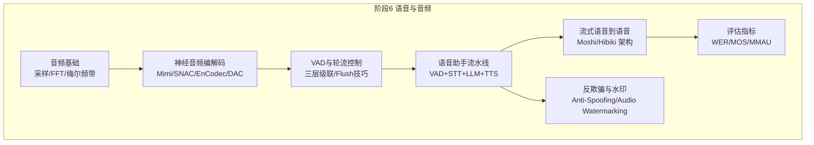
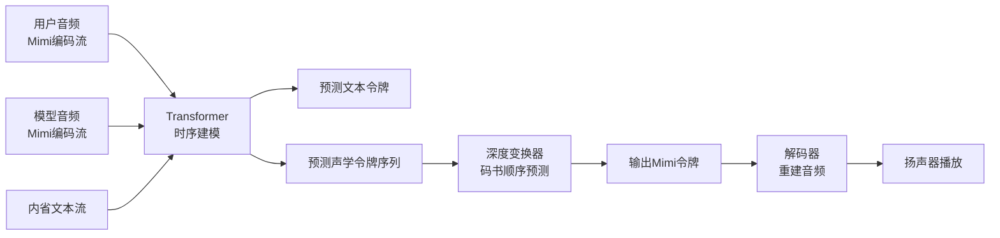
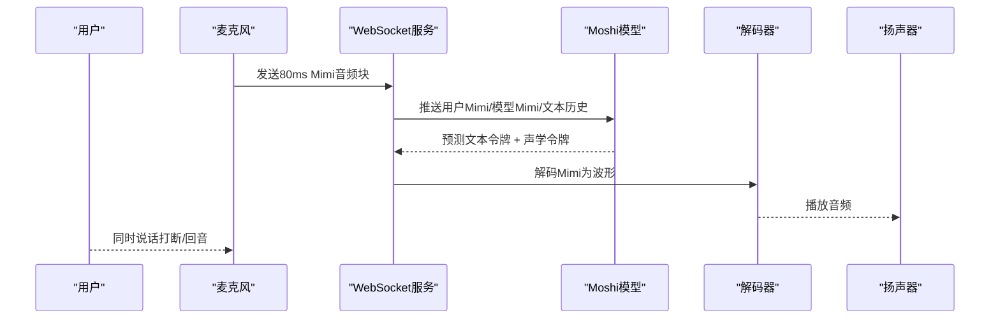
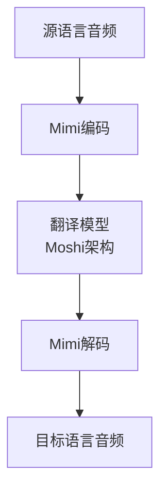
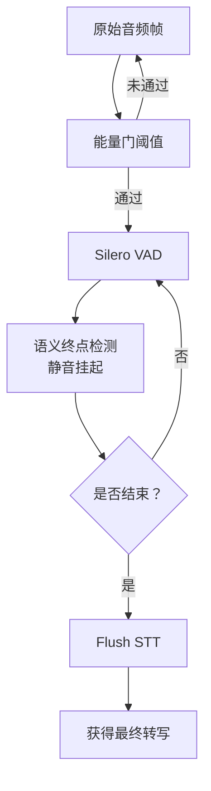
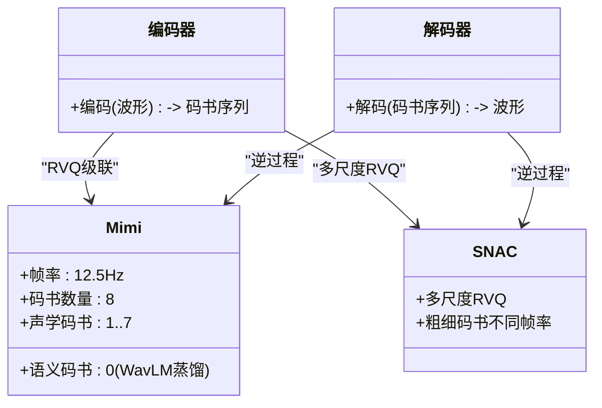
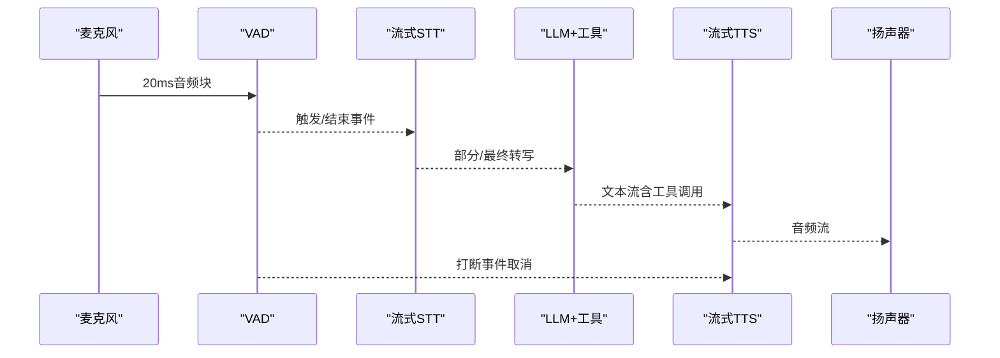
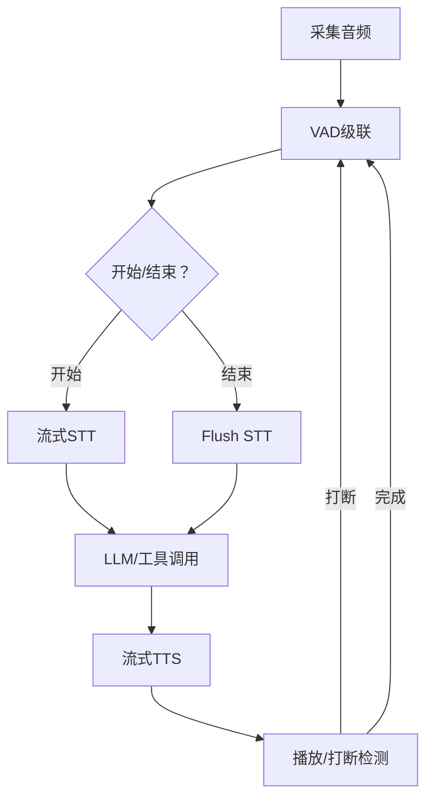
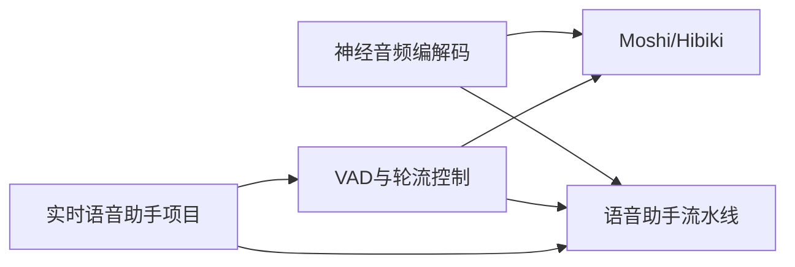

# 流式语音到语音

<cite>
**本文引用的文件**
- [phases/06-speech-and-audio/15-streaming-speech-to-speech-moshi-hibiki/docs/en.md](file://phases/06-speech-and-audio/15-streaming-speech-to-speech-moshi-hibiki/docs/en.md)
- [phases/06-speech-and-audio/14-voice-activity-detection-turn-taking/docs/en.md](file://phases/06-speech-and-audio/14-voice-activity-detection-turn-taking/docs/en.md)
- [phases/06-speech-and-audio/13-neural-audio-codecs/docs/en.md](file://phases/06-speech-and-audio/13-neural-audio-codecs/docs/en.md)
- [phases/06-speech-and-audio/12-voice-assistant-pipeline/docs/en.md](file://phases/06-speech-and-audio/12-voice-assistant-pipeline/docs/en.md)
- [phases/19-capstone-projects/03-realtime-voice-assistant/code/main.py](file://phases/19-capstone-projects/03-realtime-voice-assistant/code/main.py)
- [site/data.js](file://site/data.js)
- [ROADMAP.md](file://ROADMAP.md)
</cite>

## 目录
1. [引言](#引言)
2. [项目结构](#项目结构)
3. [核心组件](#核心组件)
4. [架构总览](#架构总览)
5. [详细组件分析](#详细组件分析)
6. [依赖关系分析](#依赖关系分析)
7. [性能考量](#性能考量)
8. [故障排查指南](#故障排查指南)
9. [结论](#结论)
10. [附录](#附录)

## 引言
本文件围绕“流式语音到语音”课程目标，系统梳理双向语音转换的关键技术与工程实践，重点覆盖以下主题：
- 技术挑战：延迟控制、缓冲管理、上下文保持、实时反馈
- 先进系统：Moshi（全双工对话）、Hibiki（流式语音翻译）的架构设计与流水线优化
- 实现路径：从零构建低延迟语音到语音系统，包含语音活动检测（VAD）、说话人分离、实时翻译、语音合成等模块
- 多语言实时翻译：语言检测、词汇对齐、句法转换、语音合成的端到端流程
- 系统优化：模型量化、缓存机制、优先级调度等
- 评估方法：延迟测量与用户体验指标

本课程以“阶段6 语音与音频”的系列内容为基础，结合“实时语音助手”实战项目，形成从理论到工程落地的完整知识图谱。

## 项目结构
本仓库在“阶段6 语音与音频”中提供了完整的教学与实践材料，围绕“流式语音到语音”的关键能力分层建设：
- 音频基础与特征：采样、梅尔频带、频谱图
- 神经音频编解码：Mimi/SNAC/EnCodec/DAC 的语义-声学拆分与RVQ
- 语音活动检测与轮流控制：三层VAD级联、静音挂起、语义终点检测、Flush技巧
- 语音助手流水线：VAD + STT + LLM + TTS 的端到端集成
- 流式语音到语音：Moshi/Hibiki 的全双工架构与流水线优化
- 反 spoof 与音频水印：反欺骗与溯源
- 评估指标：WER/MOS/MMAU 等

**章节来源**
- [ROADMAP.md:163-183](file://ROADMAP.md#L163-L183)
- [site/data.js:1284-1291](file://site/data.js#L1284-L1291)

## 核心组件
围绕流式语音到语音，本课程的核心组件包括：
- 编解码与令牌化：使用Mimi/SNAC等将连续波形离散化为语义-声学令牌序列，支撑低帧率下的高效自回归建模
- 语音活动检测（VAD）与轮流控制：三层VAD级联（能量门+Silero+语义终点），配合静音挂起与Flush技巧，降低端到端延迟
- 全双工对话（Moshi）：单模型同时处理用户音频、自身音频与内部文本（内省），实现亚250ms端到端延迟
- 流式翻译（Hibiki）：基于Moshi架构训练翻译对，支持句子级数据与强化学习优化，消除词对齐需求
- 语音助手流水线（Pipeline）：VAD触发、流式STT、工具调用、流式TTS与抢占打断，作为对比与补充方案

**章节来源**
- [phases/06-speech-and-audio/13-neural-audio-codecs/docs/en.md:1-186](file://phases/06-speech-and-audio/13-neural-audio-codecs/docs/en.md#L1-L186)
- [phases/06-speech-and-audio/14-voice-activity-detection-turn-taking/docs/en.md:1-174](file://phases/06-speech-and-audio/14-voice-activity-detection-turn-taking/docs/en.md#L1-L174)
- [phases/06-speech-and-audio/15-streaming-speech-to-speech-moshi-hibiki/docs/en.md:1-181](file://phases/06-speech-and-audio/15-streaming-speech-to-speech-moshi-hibiki/docs/en.md#L1-L181)
- [phases/06-speech-and-audio/12-voice-assistant-pipeline/docs/en.md:1-178](file://phases/06-speech-and-audio/12-voice-assistant-pipeline/docs/en.md#L1-L178)

## 架构总览
下图展示了Moshe/Hibiki的全双工架构与关键数据流：用户音频与模型自身音频并行输入，内部文本流作为“内省”，模型在每个80ms步长上预测下一个文本令牌与声学令牌序列（深度变换器按码书顺序预测）。

**图表来源**
- [phases/06-speech-and-audio/15-streaming-speech-to-speech-moshi-hibiki/docs/en.md:22-46](file://phases/06-speech-and-audio/15-streaming-speech-to-speech-moshi-hibiki/docs/en.md#L22-L46)

**章节来源**
- [phases/06-speech-and-audio/15-streaming-speech-to-speech-moshi-hibiki/docs/en.md:18-58](file://phases/06-speech-and-audio/15-streaming-speech-to-speech-moshi-hibiki/docs/en.md#L18-L58)

## 详细组件分析

### 组件A：全双工对话（Moshi）
- 输入：两条Mimi流（用户音频、模型自身音频）与内省文本流
- 处理：Transformer在每80ms步长消费最新令牌，先预测文本，再由深度变换器顺序预测8个码书的声学令牌
- 输出：Mimi令牌与文本令牌，通过解码器实时播放
- 关键优势：亚250ms端到端延迟、自然回音与打断、无流水线胶水代码
- 局限性：工具调用需额外路径、推理长度受限、资源占用较高

**图表来源**
- [phases/06-speech-and-audio/15-streaming-speech-to-speech-moshi-hibiki/docs/en.md:77-108](file://phases/06-speech-and-audio/15-streaming-speech-to-speech-moshi-hibiki/docs/en.md#L77-L108)

**章节来源**
- [phases/06-speech-and-audio/15-streaming-speech-to-speech-moshi-hibiki/docs/en.md:10-74](file://phases/06-speech-and-audio/15-streaming-speech-to-speech-moshi-hibiki/docs/en.md#L10-L74)

### 组件B：流式语音翻译（Hibiki）
- 架构：与Moshi相同，但训练目标为源语言→目标语言的翻译对
- 数据：Hibiki-Zero使用句子级数据与强化学习优化，无需词对齐标注
- 适用场景：实时翻译通话，支持多语言对（初始4对，可扩展）

**图表来源**
- [phases/06-speech-and-audio/15-streaming-speech-to-speech-moshi-hibiki/docs/en.md:44-48](file://phases/06-speech-and-audio/15-streaming-speech-to-speech-moshi-hibiki/docs/en.md#L44-L48)

**章节来源**
- [phases/06-speech-and-audio/15-streaming-speech-to-speech-moshi-hibiki/docs/en.md:44-58](file://phases/06-speech-and-audio/15-streaming-speech-to-speech-moshi-hibiki/docs/en.md#L44-L58)

### 组件C：VAD与轮流控制（三层级联 + Flush）
- 能量门：快速过滤明显静音，避免噪声误触发
- Silero VAD：高鲁棒性（>87% TPR@5%FPR），每30ms约1ms推理
- 语义终点检测：区分“思考停顿”与“结束”，结合静音挂起
- Flush技巧：VAD判定结束即向STT发送flush信号，加速最终转写，显著降低端到端延迟

**图表来源**
- [phases/06-speech-and-audio/14-voice-activity-detection-turn-taking/docs/en.md:24-44](file://phases/06-speech-and-audio/14-voice-activity-detection-turn-taking/docs/en.md#L24-L44)

**章节来源**
- [phases/06-speech-and-audio/14-voice-activity-detection-turn-taking/docs/en.md:10-54](file://phases/06-speech-and-audio/14-voice-activity-detection-turn-taking/docs/en.md#L10-L54)

### 组件D：神经音频编解码（Mimi/SNAC/EnCodec/DAC）
- 核心思想：残差向量量化（RVQ）级联小码书，降低序列长度，提升语言模型效率
- 语义-声学拆分：Mimi将第一个码书用于内容（受WavLM蒸馏），其余用于音色、韵律、背景噪声
- 帧率权衡：越低帧率越利于AR LM；12.5Hz适合流式语音，SNAC提供多尺度层级结构

**图表来源**
- [phases/06-speech-and-audio/13-neural-audio-codecs/docs/en.md:25-63](file://phases/06-speech-and-audio/13-neural-audio-codecs/docs/en.md#L25-L63)

**章节来源**
- [phases/06-speech-and-audio/13-neural-audio-codecs/docs/en.md:10-76](file://phases/06-speech-and-audio/13-neural-audio-codecs/docs/en.md#L10-L76)

### 组件E：语音助手流水线（对比参考）
- 组件：音频采集、VAD、流式STT、LLM（含工具调用）、流式TTS、播放、打断处理
- 关键点：VAD触发与静音挂起决定回合边界；TTS异步流式输出；用户打断时取消LLM并重启新回合
- 对比意义：Moshi的单模型全双工在延迟上具备优势，但在工具调用与复杂推理方面仍需流水线补齐

**图表来源**
- [phases/06-speech-and-audio/12-voice-assistant-pipeline/docs/en.md:28-43](file://phases/06-speech-and-audio/12-voice-assistant-pipeline/docs/en.md#L28-L43)

**章节来源**
- [phases/06-speech-and-audio/12-voice-assistant-pipeline/docs/en.md:10-53](file://phases/06-speech-and-audio/12-voice-assistant-pipeline/docs/en.md#L10-L53)

### 组件F：从零实现低延迟语音到语音系统（工程化要点）
- 语音活动检测（VAD）：采用三层级联（能量门→Silero→语义终点），配置最小语音时长、静音挂起与预滚缓冲
- 说话人分离：可选（取决于场景与合规要求），在多说话人场景中提升转写与翻译质量
- 实时翻译：基于Moshi/Hibiki架构，使用Mimi语义码书进行跨语言映射，结合强化学习优化端到端延迟
- 语音合成：使用流式TTS（如Kokoro/Cartesia），在LLM文本流到达后尽快开始合成
- 抢占与打断：VAD在TTS播放期间检测到用户说话即取消TTS并重启新回合
- 评估与监控：记录端到端延迟、首字节TTS时间、转写准确率（WER）、主观MOS

**图表来源**
- [phases/06-speech-and-audio/14-voice-activity-detection-turn-taking/docs/en.md:85-122](file://phases/06-speech-and-audio/14-voice-activity-detection-turn-taking/docs/en.md#L85-L122)
- [phases/06-speech-and-audio/12-voice-assistant-pipeline/docs/en.md:117-128](file://phases/06-speech-and-audio/12-voice-assistant-pipeline/docs/en.md#L117-L128)

**章节来源**
- [phases/06-speech-and-audio/14-voice-activity-detection-turn-taking/docs/en.md:56-122](file://phases/06-speech-and-audio/14-voice-activity-detection-turn-taking/docs/en.md#L56-L122)
- [phases/06-speech-and-audio/12-voice-assistant-pipeline/docs/en.md:54-128](file://phases/06-speech-and-audio/12-voice-assistant-pipeline/docs/en.md#L54-L128)

## 依赖关系分析
- Moshi/Hibiki依赖于神经音频编解码（Mimi/SNAC）提供的低帧率、离散令牌表示，从而支撑高效的自回归建模
- VAD与轮流控制为流水线提供可靠的回合边界，Flush技巧进一步缩短最终转写等待时间
- 语音助手流水线作为对比与补充，强调工具调用与复杂推理场景下的可用性
- 实时语音助手项目（capstone）通过模拟框架验证状态机、打断与延迟计时，为工程落地提供参考

**图表来源**
- [phases/06-speech-and-audio/13-neural-audio-codecs/docs/en.md:10-76](file://phases/06-speech-and-audio/13-neural-audio-codecs/docs/en.md#L10-L76)
- [phases/06-speech-and-audio/14-voice-activity-detection-turn-taking/docs/en.md:10-54](file://phases/06-speech-and-audio/14-voice-activity-detection-turn-taking/docs/en.md#L10-L54)
- [phases/19-capstone-projects/03-realtime-voice-assistant/code/main.py:1-71](file://phases/19-capstone-projects/03-realtime-voice-assistant/code/main.py#L1-L71)

**章节来源**
- [phases/06-speech-and-audio/15-streaming-speech-to-speech-moshi-hibiki/docs/en.md:10-74](file://phases/06-speech-and-audio/15-streaming-speech-to-speech-moshi-hibiki/docs/en.md#L10-L74)
- [phases/06-speech-and-audio/12-voice-assistant-pipeline/docs/en.md:10-53](file://phases/06-speech-and-audio/12-voice-assistant-pipeline/docs/en.md#L10-L53)

## 性能考量
- 延迟控制
  - Moshi：理论160ms（80ms帧 + 80ms声学延迟），实测200ms（单GPU）
  - Flush技巧：VAD结束即Flush STT，将等待窗口从数百毫秒降至约125ms
- 缓冲管理
  - 预滚缓冲（300–500ms）避免首字裁剪
  - 静音挂起（500–800ms）平衡打断与迟滞
- 上下文保持
  - Moshi内省文本流提供语义连贯性，便于切换语言模型头与生成转录
- 并行处理与流水线优化
  - Moshi：三路并行（用户音频、模型音频、内省文本）
  - 语音助手流水线：各组件异步流式运行，VAD触发与打断协调
- 系统优化策略
  - 模型量化：降低显存占用与推理时延
  - 缓存机制：热点提示与中间结果缓存
  - 优先级调度：根据用户打断动态调整下游任务优先级

**章节来源**
- [phases/06-speech-and-audio/15-streaming-speech-to-speech-moshi-hibiki/docs/en.md:64-74](file://phases/06-speech-and-audio/15-streaming-speech-to-speech-moshi-hibiki/docs/en.md#L64-L74)
- [phases/06-speech-and-audio/14-voice-activity-detection-turn-taking/docs/en.md:39-44](file://phases/06-speech-and-audio/14-voice-activity-detection-turn-taking/docs/en.md#L39-L44)
- [phases/06-speech-and-audio/12-voice-assistant-pipeline/docs/en.md:140-147](file://phases/06-speech-and-audio/12-voice-assistant-pipeline/docs/en.md#L140-L147)

## 故障排查指南
- VAD相关
  - 固定阈值：在嘈杂环境失效，建议使用Silero或切换商业模型
  - 静音挂起过短：频繁打断；过长：迟滞感强；建议A/B测试
  - 无预滚缓冲：首字裁剪；务必保留300–500ms滚动缓冲
  - 忽略语义终点：思考停顿被误判为结束；引入语义终点检测
- 打断与抢占
  - TTS阻塞事件循环：改用异步或独立线程
  - 未正确取消LLM：导致“说-over”；需在VAD检测到打断时立即取消
- 语义与声学
  - 仅用重建质量衡量：可能忽略语义结构；应关注LM生成质量与内容保真度
  - 码书不等价：语义码书0对可懂度影响最大；丢失7号声学码书影响较小

**章节来源**
- [phases/06-speech-and-audio/14-voice-activity-detection-turn-taking/docs/en.md:136-143](file://phases/06-speech-and-audio/14-voice-activity-detection-turn-taking/docs/en.md#L136-L143)
- [phases/06-speech-and-audio/12-voice-assistant-pipeline/docs/en.md:140-147](file://phases/06-speech-and-audio/12-voice-assistant-pipeline/docs/en.md#L140-L147)
- [phases/06-speech-and-audio/13-neural-audio-codecs/docs/en.md:149-155](file://phases/06-speech-and-audio/13-neural-audio-codecs/docs/en.md#L149-L155)

## 结论
- Moshi/Hibiki代表了2026语音AI的新范式：以Mimi语义-声学令牌为桥梁，通过全双工与深度变换器实现低延迟、自然交互
- VAD与轮流控制是流水线稳定性的关键，Flush技巧显著缩短端到端延迟
- 工程落地需综合考虑延迟、稳定性、工具调用与合规要求，必要时采用流水线补齐复杂能力
- 通过量化、缓存与优先级调度等系统优化手段，可在资源受限环境下维持高质量体验

## 附录
- 实战项目：实时语音助手（capstone）通过模拟框架演示状态机、打断与延迟统计，适合作为工程原型的起点
- 评估指标：端到端延迟、首字节TTS时间、WER、MOS、MMAU等，建议建立持续监控与A/B测试体系

**章节来源**
- [phases/19-capstone-projects/03-realtime-voice-assistant/code/main.py:1-71](file://phases/19-capstone-projects/03-realtime-voice-assistant/code/main.py#L1-L71)
- [site/data.js:1284-1291](file://site/data.js#L1284-L1291)