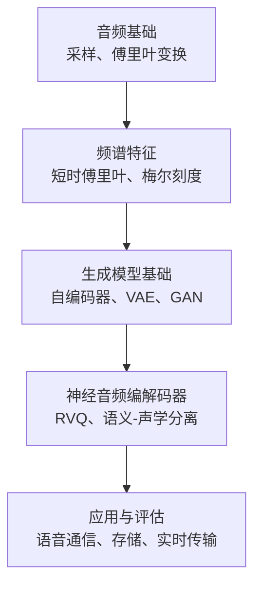
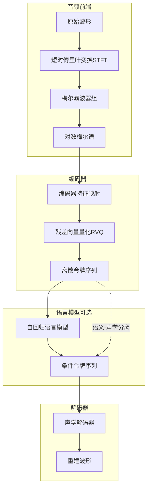
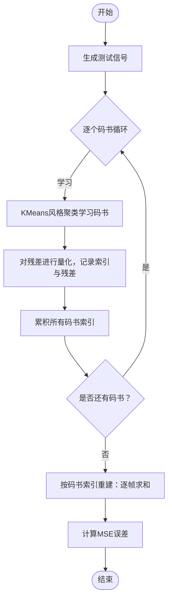
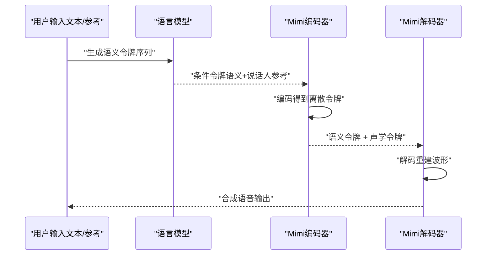
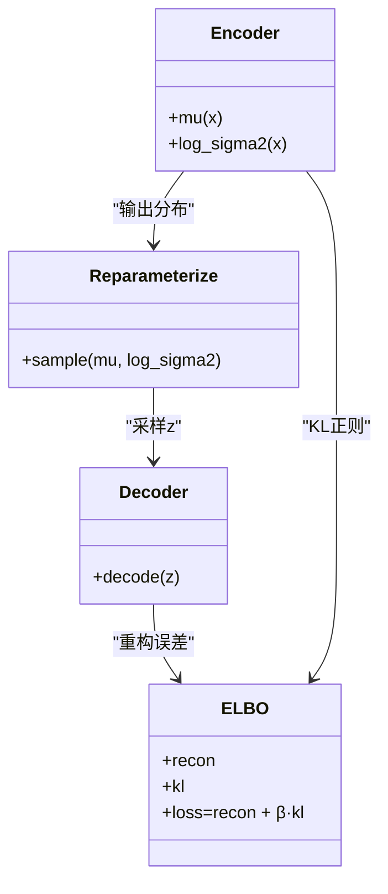
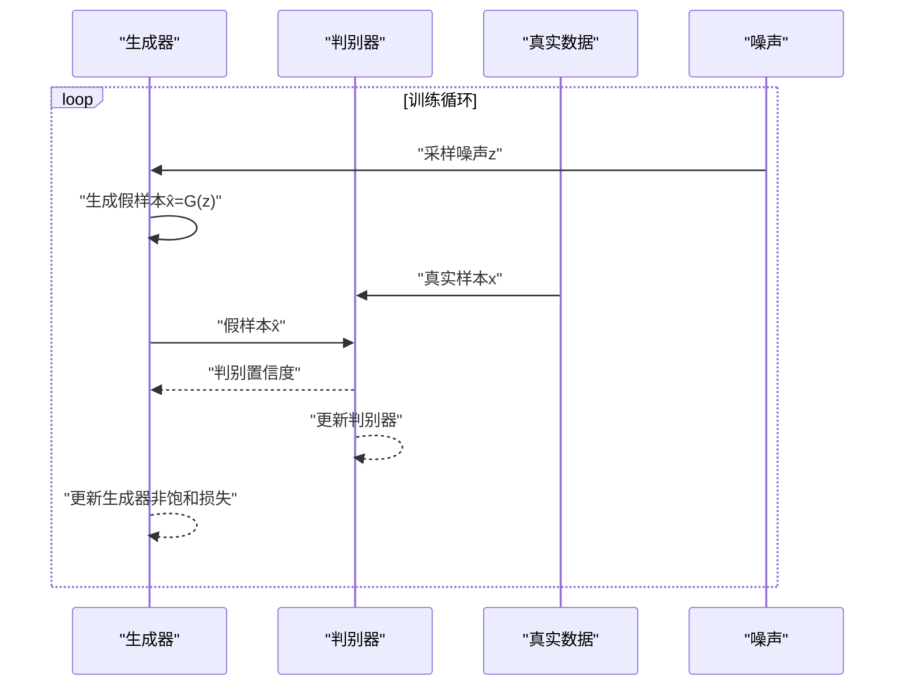
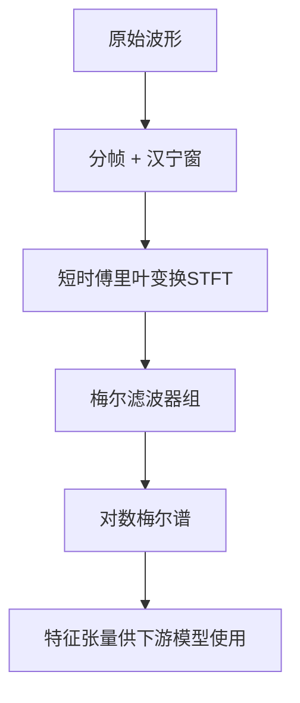
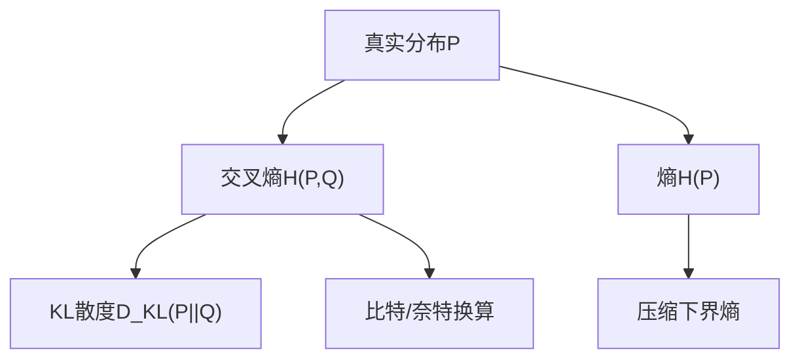
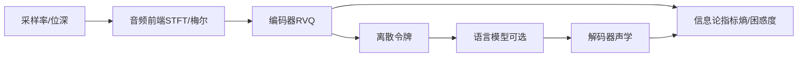

# 神经音频编解码器

<cite>
**本文档引用的文件**
- [phases/06-speech-and-audio/13-neural-audio-codecs/docs/en.md](file://phases/06-speech-and-audio/13-neural-audio-codecs/docs/en.md)
- [phases/06-speech-and-audio/13-neural-audio-codecs/code/main.py](file://phases/06-speech-and-audio/13-neural-audio-codecs/code/main.py)
- [phases/06-speech-and-audio/02-spectrograms-mel-features/docs/en.md](file://phases/06-speech-and-audio/02-spectrograms-mel-features/docs/en.md)
- [phases/06-speech-and-audio/01-audio-fundamentals/docs/en.md](file://phases/06-speech-and-audio/01-audio-fundamentals/docs/en.md)
- [phases/08-generative-ai/02-autoencoders-vae/docs/en.md](file://phases/08-generative-ai/02-autoencoders-vae/docs/en.md)
- [phases/08-generative-ai/03-gans-generator-discriminator/docs/en.md](file://phases/08-generative-ai/03-gans-generator-discriminator/docs/en.md)
- [phases/01-math-foundations/09-information-theory/docs/en.md](file://phases/01-math-foundations/09-information-theory/docs/en.md)
- [site/figures-vision-speech.js](file://site/figures-vision-speech.js)
- [site/figures-genai-rl.js](file://site/figures-genai-rl.js)
- [README.md](file://README.md)
- [ROADMAP.md](file://ROADMAP.md)
</cite>

## 目录
1. [引言](#引言)
2. [项目结构](#项目结构)
3. [核心组件](#核心组件)
4. [架构总览](#架构总览)
5. [详细组件分析](#详细组件分析)
6. [依赖关系分析](#依赖关系分析)
7. [性能考量](#性能考量)
8. [故障排查指南](#故障排查指南)
9. [结论](#结论)
10. [附录](#附录)

## 引言
本课程围绕神经音频编解码器展开，系统讲解从基础音频信号处理到现代神经编解码器（EnCodec、DAC、SNAC、Mimi）的完整技术链路。重点覆盖：
- 自编码器与变分自编码器在潜空间建模中的作用
- 生成对抗网络在高质量重建中的应用
- 音频压缩中的关键算法：时频域变换、残差向量量化（RVQ）、语义-声学分离
- 从零实现神经音频编解码器的完整流程：编码器、解码器、正则化项、损失函数
- 不同应用场景的编解码器设计权衡：语音通信、音频存储、实时传输
- 压缩比与音质的平衡策略：有损压缩、无损压缩、渐进式传输
- 性能评估与比较方法

## 项目结构
本仓库将音频相关知识按“基础 → 特征工程 → 生成模型 → 编解码器”的路径组织，神经音频编解码器位于“语音与音频”阶段第13课，配套有完整的教学文档与从零实现脚本。

图示来源
- [phases/06-speech-and-audio/01-audio-fundamentals/docs/en.md:22-47](file://phases/06-speech-and-audio/01-audio-fundamentals/docs/en.md#L22-L47)
- [phases/06-speech-and-audio/02-spectrograms-mel-features/docs/en.md:18-35](file://phases/06-speech-and-audio/02-spectrograms-mel-features/docs/en.md#L18-L35)
- [phases/08-generative-ai/02-autoencoders-vae/docs/en.md:10-18](file://phases/08-generative-ai/02-autoencoders-vae/docs/en.md#L10-L18)
- [phases/08-generative-ai/03-gans-generator-discriminator/docs/en.md:10-22](file://phases/08-generative-ai/03-gans-generator-discriminator/docs/en.md#L10-L22)
- [phases/06-speech-and-audio/13-neural-audio-codecs/docs/en.md:10-20](file://phases/06-speech-and-audio/13-neural-audio-codecs/docs/en.md#L10-L20)

章节来源
- [README.md:425-443](file://README.md#L425-L443)
- [ROADMAP.md:163-183](file://ROADMAP.md#L163-L183)

## 核心组件
- 音频前端与特征工程：短时傅里叶变换（STFT）、汉宁窗、梅尔滤波器组、对数梅尔谱
- 生成模型基础：自编码器（AE）、变分自编码器（VAE，含重参数化技巧）、生成对抗网络（GAN）
- 神经音频编解码器：残差向量量化（RVQ）、语义-声学分离（Mimi）、多尺度RVQ（SNAC）、最高保真度开放编解码器（DAC）
- 信息论与熵编码：熵、交叉熵、困惑度、比特/奈特单位换算

章节来源
- [phases/06-speech-and-audio/02-spectrograms-mel-features/docs/en.md:18-35](file://phases/06-speech-and-audio/02-spectrograms-mel-features/docs/en.md#L18-L35)
- [phases/08-generative-ai/02-autoencoders-vae/docs/en.md:20-43](file://phases/08-generative-ai/02-autoencoders-vae/docs/en.md#L20-L43)
- [phases/08-generative-ai/03-gans-generator-discriminator/docs/en.md:24-42](file://phases/08-generative-ai/03-gans-generator-discriminator/docs/en.md#L24-L42)
- [phases/06-speech-and-audio/13-neural-audio-codecs/docs/en.md:25-63](file://phases/06-speech-and-audio/13-neural-audio-codecs/docs/en.md#L25-L63)
- [phases/01-math-foundations/09-information-theory/docs/en.md:37-81](file://phases/01-math-foundations/09-information-theory/docs/en.md#L37-L81)

## 架构总览
神经音频编解码器的整体架构由“特征前端 → 编码器 → 潜空间/离散令牌 → 解码器 → 重建”构成。现代编解码器普遍采用RVQ级联小码书，结合语义-声学分离，使基于Transformer的语言模型能够高效地对音频令牌序列进行建模。

图示来源
- [phases/06-speech-and-audio/02-spectrograms-mel-features/docs/en.md:22-32](file://phases/06-speech-and-audio/02-spectrograms-mel-features/docs/en.md#L22-L32)
- [phases/06-speech-and-audio/13-neural-audio-codecs/docs/en.md:25-63](file://phases/06-speech-and-audio/13-neural-audio-codecs/docs/en.md#L25-L63)
- [phases/08-generative-ai/02-autoencoders-vae/docs/en.md:26-37](file://phases/08-generative-ai/02-autoencoders-vae/docs/en.md#L26-L37)

## 详细组件分析

### 组件A：残差向量量化（RVQ）与从零实现
RVQ通过“级联的小码书”替代单一超大码书，显著提升建模效率与质量。本节提供从零实现的RVQ脚本，演示随着码书数量增加，重建误差如何下降，并给出帧速率与比特率的关系。

图示来源
- [phases/06-speech-and-audio/13-neural-audio-codecs/code/main.py:14-67](file://phases/06-speech-and-audio/13-neural-audio-codecs/code/main.py#L14-L67)

章节来源
- [phases/06-speech-and-audio/13-neural-audio-codecs/code/main.py:1-119](file://phases/06-speech-and-audio/13-neural-audio-codecs/code/main.py#L1-L119)
- [phases/06-speech-and-audio/13-neural-audio-codecs/docs/en.md:25-30](file://phases/06-speech-and-audio/13-neural-audio-codecs/docs/en.md#L25-L30)

### 组件B：语义-声学分离（Mimi）
Mimi将第一个码书（语义码书）与后续码书（声学残差）分离，前者从自监督语音表示（如WavLM）蒸馏而来，承载“说了什么”，后者承载“怎么说”。该分离使得文本到语义、再从语义到声学的两阶段生成成为可能，支持零样本音色克隆。

图示来源
- [phases/06-speech-and-audio/13-neural-audio-codecs/docs/en.md:54-63](file://phases/06-speech-and-audio/13-neural-audio-codecs/docs/en.md#L54-L63)
- [phases/06-speech-and-audio/13-neural-audio-codecs/docs/en.md:109-122](file://phases/06-speech-and-audio/13-neural-audio-codecs/docs/en.md#L109-L122)

章节来源
- [phases/06-speech-and-audio/13-neural-audio-codecs/docs/en.md:54-63](file://phases/06-speech-and-audio/13-neural-audio-codecs/docs/en.md#L54-L63)

### 组件C：自编码器与变分自编码器（VAE）
VAE通过重参数化技巧将编码器输出的分布拉回先验（通常为标准高斯），形成平滑的潜空间，从而实现从先验采样的生成。VAE是许多扩散模型的潜空间编码器，亦是RVQ离散潜空间的重要理论基础。

图示来源
- [phases/08-generative-ai/02-autoencoders-vae/docs/en.md:26-37](file://phases/08-generative-ai/02-autoencoders-vae/docs/en.md#L26-L37)
- [phases/08-generative-ai/02-autoencoders-vae/docs/en.md:74-83](file://phases/08-generative-ai/02-autoencoders-vae/docs/en.md#L74-L83)

章节来源
- [phases/08-generative-ai/02-autoencoders-vae/docs/en.md:10-18](file://phases/08-generative-ai/02-autoencoders-vae/docs/en.md#L10-L18)

### 组件D：生成对抗网络（GAN）
GAN通过生成器与判别器的对抗训练，学习数据分布的“真实性”信号。虽然2026主流生成范式转向扩散与流匹配，但GAN仍广泛用于感知损失、快速蒸馏与人脸等固定域的极致质量生成。

图示来源
- [phases/08-generative-ai/03-gans-generator-discriminator/docs/en.md:16-37](file://phases/08-generative-ai/03-gans-generator-discriminator/docs/en.md#L16-L37)

章节来源
- [phases/08-generative-ai/03-gans-generator-discriminator/docs/en.md:10-22](file://phases/08-generative-ai/03-gans-generator-discriminator/docs/en.md#L10-L22)

### 组件E：时频域变换与梅尔特征
音频前端将原始波形转换为适合深度学习的频谱表示。STFT提供时频局部化，汉宁窗抑制频谱泄漏；梅尔刻度模拟人类听觉特性，滤波器组投影到梅尔频带后取对数，作为2026通用的音频前端。

图示来源
- [phases/06-speech-and-audio/02-spectrograms-mel-features/docs/en.md:22-32](file://phases/06-speech-and-audio/02-spectrograms-mel-features/docs/en.md#L22-L32)
- [site/figures-vision-speech.js:256-291](file://site/figures-vision-speech.js#L256-L291)

章节来源
- [phases/06-speech-and-audio/02-spectrograms-mel-features/docs/en.md:18-35](file://phases/06-speech-and-audio/02-spectrograms-mel-features/docs/en.md#L18-L35)

### 组件F：信息论与熵编码基础
信息论为压缩与评估提供统一框架：熵衡量不可压缩的不确定性，交叉熵衡量编码浪费，困惑度用于语言模型评估。比特与奈特的换算关系在工程中至关重要。

图示来源
- [phases/01-math-foundations/09-information-theory/docs/en.md:37-81](file://phases/01-math-foundations/09-information-theory/docs/en.md#L37-L81)
- [phases/01-math-foundations/09-information-theory/docs/en.md:307-357](file://phases/01-math-foundations/09-information-theory/docs/en.md#L307-L357)

章节来源
- [phases/01-math-foundations/09-information-theory/docs/en.md:233-259](file://phases/01-math-foundations/09-information-theory/docs/en.md#L233-L259)

## 依赖关系分析
- 音频前端依赖于采样率与窗口长度的折衷（时间分辨率与频率分辨率），直接影响梅尔特征的质量与下游模型的稳定性
- 编码器依赖于特征质量与RVQ的级联结构，码书数量与容量决定令牌维度与重建误差
- 语义-声学分离依赖于语义码书的蒸馏质量与声学残差的建模能力
- 生成模型（VAE/GAN）为编解码器提供潜空间结构和平滑性约束，影响重建清晰度与生成稳定性
- 信息论指标（PESQ、ViSQOL、困惑度）用于客观评估重建质量与语言模型生成效果

图示来源
- [phases/06-speech-and-audio/01-audio-fundamentals/docs/en.md:28-47](file://phases/06-speech-and-audio/01-audio-fundamentals/docs/en.md#L28-L47)
- [phases/06-speech-and-audio/02-spectrograms-mel-features/docs/en.md:22-32](file://phases/06-speech-and-audio/02-spectrograms-mel-features/docs/en.md#L22-L32)
- [phases/06-speech-and-audio/13-neural-audio-codecs/docs/en.md:65-75](file://phases/06-speech-and-audio/13-neural-audio-codecs/docs/en.md#L65-L75)

章节来源
- [phases/06-speech-and-audio/01-audio-fundamentals/docs/en.md:39-47](file://phases/06-speech-and-audio/01-audio-fundamentals/docs/en.md#L39-L47)
- [phases/06-speech-and-audio/02-spectrograms-mel-features/docs/en.md:34-35](file://phases/06-speech-and-audio/02-spectrograms-mel-features/docs/en.md#L34-L35)

## 性能考量
- 帧速率与上下文长度：较低帧速率（如Mimi的12.5 Hz）显著降低序列长度，有利于Transformer高效建模
- 码书数量与容量：增加码书数量可提升保真度，但会线性增加上下文长度与计算开销，建议8-12个为上限
- 语义-声学分离：语义码书承载内容信息，声学残差承载音色与细节，前者损坏导致可懂度下降，后者损坏影响自然度
- 保真度与生成质量：传统编解码器（如Opus）在每比特质量上仍占优；神经编解码器在离散令牌与生成质量上更具优势
- 实时性与内存：解码器在高分辨率（如1024²）时是激活峰值热点，需启用切片/平铺与合适的数值精度

## 故障排查指南
- 采样率不匹配：上游特征与下游模型采样率不一致会导致性能异常，务必在特征提取前完成正确重采样
- 梅尔参数漂移：训练与推理阶段的归一化统计不一致会导致WOR/WER翻倍，需严格对齐
- 频谱泄漏与边界效应：末尾零填充会产生平坦谱，应采用对称填充或复制策略
- 语义码书破坏：在Mimi中，语义码书损坏会显著影响可懂度，声学码书损坏对自然度影响较小
- 重建质量误判：仅看重建MSE/PESQ可能误导，还需评估令牌离散度与语言模型生成能力

章节来源
- [phases/06-speech-and-audio/02-spectrograms-mel-features/docs/en.md:137-143](file://phases/06-speech-and-audio/02-spectrograms-mel-features/docs/en.md#L137-L143)
- [phases/06-speech-and-audio/13-neural-audio-codecs/docs/en.md:149-154](file://phases/06-speech-and-audio/13-neural-audio-codecs/docs/en.md#L149-L154)

## 结论
神经音频编解码器以RVQ为核心，结合语义-声学分离与现代生成模型，实现了从连续波形到离散令牌的高效转换。通过合理的特征工程、潜空间建模与信息论评估，可在语音通信、音频存储与实时传输等场景中取得压缩比与音质的最佳平衡。建议优先采用Mimi/SNAC构建生成式流水线，采用传统编解码器（如Opus/DAC）构建压缩流水线，并根据具体任务选择合适的帧速率与码书配置。

## 附录
- 术语速查：RVQ、帧速率、语义码书、声学码书、PESQ/ViSQOL、EnCodec/Mimi等
- 进一步阅读：EnCodec、DAC、SNAC、Mimi、SoundStream等论文与实现资源

章节来源
- [phases/06-speech-and-audio/13-neural-audio-codecs/docs/en.md:166-186](file://phases/06-speech-and-audio/13-neural-audio-codecs/docs/en.md#L166-L186)