# 语音与音频

<cite>
**本文档引用的文件**
- [README.md](file://phases/06-speech-and-audio/README.md)
- [音频基础.md](file://phases/06-speech-and-audio/01-audio-fundamentals/docs/zh.md)
- [频谱图与Mel特征.md](file://phases/06-speech-and-audio/02-spectrograms-mel-features/docs/zh.md)
- [音频分类.md](file://phases/06-speech-and-audio/03-audio-classification/docs/zh.md)
- [语音识别ASR.md](file://phases/06-speech-and-audio/04-speech-recognition-asr/docs/zh.md)
- [Whisper架构与微调.md](file://phases/06-speech-and-audio/05-whisper-architecture-finetuning/docs/zh.md)
- [说话人识别与验证.md](file://phases/06-speech-and-audio/06-speaker-recognition-verification/docs/zh.md)
- [文本转语音TTS.md](file://phases/06-speech-and-audio/07-text-to-speech/docs/zh.md)
- [语音克隆与转换.md](file://phases/06-speech-and-audio/08-voice-cloning-conversion/docs/zh.md)
- [音乐生成.md](file://phases/06-speech-and-audio/09-music-generation/docs/zh.md)
- [音频语言模型.md](file://phases/06-speech-and-audio/10-audio-language-models/docs/zh.md)
- [实时音频处理.md](file://phases/06-speech-and-audio/11-real-time-audio-processing/docs/zh.md)
- [语音助手流水线.md](file://phases/06-speech-and-audio/12-voice-assistant-pipeline/docs/zh.md)
- [神经音频编解码器.md](file://phases/06-speech-and-audio/13-neural-audio-codecs/docs/zh.md)
- [语音活动检测与话轮切换.md](file://phases/06-speech-and-audio/14-voice-activity-detection-turn-taking/docs/zh.md)
- [流式语音到语音MoshiHibiki.md](file://phases/06-speech-and-audio/15-streaming-speech-to-speech-moshi-hibiki/docs/zh.md)
</cite>

## 目录
1. [引言](#引言)
2. [项目结构](#项目结构)
3. [核心组件](#核心组件)
4. [架构总览](#架构总览)
5. [详细组件分析](#详细组件分析)
6. [依赖关系分析](#依赖关系分析)
7. [性能考量](#性能考量)
8. [故障排查指南](#故障排查指南)
9. [结论](#结论)
10. [附录](#附录)

## 引言
本课程围绕“语音与音频”展开，系统讲解从基础信号处理到前沿生成与理解模型的完整技术体系。内容覆盖音频特征提取（波形、STFT、Mel频谱、MFCC）、音频分类、语音识别（CTC/RNN-T/注意力）、文本转语音（Tacotron/FastSpeech/VITS/F5-TTS/Kokoro）、语音克隆与转换、音乐生成、音频语言模型（ALM/LALM）、实时音频处理与全双工语音到语音（Moshi/Hibiki）、神经音频编解码器（EnCodec/SNAC/Mimi/DAC）、语音反欺骗与音频水印等。课程强调工程落地与生产实践，提供从零实现语音识别系统、构建语音助手管道、以及在多模态AI中发挥关键作用的思路与方法。

## 项目结构
语音与音频课程位于 phases/06-speech-and-audio，共 15 个模块，每个模块包含中文文档、示例代码与输出技能文档，形成“概念 → 动手 → 交付”的闭环学习路径。模块组织遵循“从基础到前沿”的递进关系，便于逐步构建端到端能力。

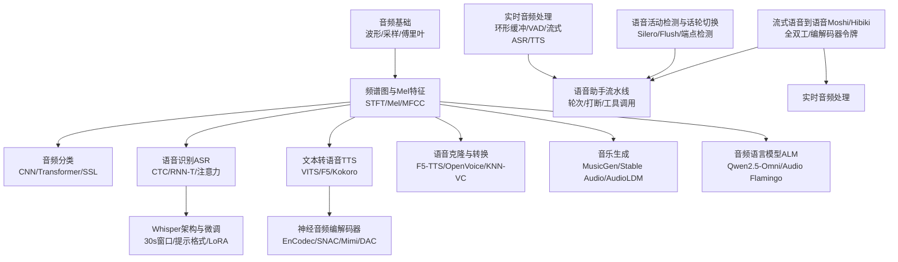

**图表来源**
- [音频基础.md:1-143](file://phases/06-speech-and-audio/01-audio-fundamentals/docs/zh.md#L1-L143)
- [频谱图与Mel特征.md:1-175](file://phases/06-speech-and-audio/02-spectrograms-mel-features/docs/zh.md#L1-L175)
- [音频分类.md:1-180](file://phases/06-speech-and-audio/03-audio-classification/docs/zh.md#L1-L180)
- [语音识别ASR.md:1-182](file://phases/06-speech-and-audio/04-speech-recognition-asr/docs/zh.md#L1-L182)
- [Whisper架构与微调.md:1-188](file://phases/06-speech-and-audio/05-whisper-architecture-finetuning/docs/zh.md#L1-L188)
- [文本转语音TTS.md:1-184](file://phases/06-speech-and-audio/07-text-to-speech/docs/zh.md#L1-L184)
- [神经音频编解码器.md:1-186](file://phases/06-speech-and-audio/13-neural-audio-codecs/docs/zh.md#L1-L186)
- [语音克隆与转换.md:1-172](file://phases/06-speech-and-audio/08-voice-cloning-conversion/docs/zh.md#L1-L172)
- [音乐生成.md:1-169](file://phases/06-speech-and-audio/09-music-generation/docs/zh.md#L1-L169)
- [音频语言模型.md:1-187](file://phases/06-speech-and-audio/10-audio-language-models/docs/zh.md#L1-L187)
- [实时音频处理.md:1-175](file://phases/06-speech-and-audio/11-real-time-audio-processing/docs/zh.md#L1-L175)
- [语音助手流水线.md:1-178](file://phases/06-speech-and-audio/12-voice-assistant-pipeline/docs/zh.md#L1-L178)
- [语音活动检测与话轮切换.md:1-174](file://phases/06-speech-and-audio/14-voice-activity-detection-turn-taking/docs/zh.md#L1-L174)
- [流式语音到语音MoshiHibiki.md:1-181](file://phases/06-speech-and-audio/15-streaming-speech-to-speech-moshi-hibiki/docs/zh.md#L1-L181)

**章节来源**
- [README.md:1-6](file://phases/06-speech-and-audio/README.md#L1-L6)

## 核心组件
- 音频前端与特征工程：波形、采样率、奈奎斯特、STFT、Mel滤波器组、对数Mel、MFCC。
- 音频理解与分类：k-NN、CNN、Transformer、BEATs、Whisper编码器冻结。
- 语音识别：CTC、RNN-T、注意力编码器-解码器；Whisper流水线与微调。
- 文本转语音：Tacotron/FastSpeech/VITS/F5-TTS/Kokoro；声码器演进。
- 语音克隆与转换：零样本/少样本、KNN-VC、神经编解码器TTS、水印与反欺骗。
- 音乐生成：MusicGen/Stable Audio/AudioLDM/ACE-Step；FAD/CLAP评估。
- 音频语言模型：Qwen2.5-Omni/Audio Flamingo；MMAU/LongAudioBench。
- 实时音频处理：环形缓冲、VAD、流式ASR/TTS、打断、WebRTC传输。
- 全双工语音到语音：Moshi/Hibiki；Mimi编解码器令牌。
- 神经音频编解码器：EnCodec/SNAC/Mimi/DAC；语义-声学分离。

**章节来源**
- [音频基础.md:22-143](file://phases/06-speech-and-audio/01-audio-fundamentals/docs/zh.md#L22-L143)
- [频谱图与Mel特征.md:18-175](file://phases/06-speech-and-audio/02-spectrograms-mel-features/docs/zh.md#L18-L175)
- [音频分类.md:16-180](file://phases/06-speech-and-audio/03-audio-classification/docs/zh.md#L16-L180)
- [语音识别ASR.md:10-182](file://phases/06-speech-and-audio/04-speech-recognition-asr/docs/zh.md#L10-L182)
- [Whisper架构与微调.md:10-188](file://phases/06-speech-and-audio/05-whisper-architecture-finetuning/docs/zh.md#L10-L188)
- [文本转语音TTS.md:10-184](file://phases/06-speech-and-audio/07-text-to-speech/docs/zh.md#L10-L184)
- [神经音频编解码器.md:10-186](file://phases/06-speech-and-audio/13-neural-audio-codecs/docs/zh.md#L10-L186)
- [语音克隆与转换.md:10-172](file://phases/06-speech-and-audio/08-voice-cloning-conversion/docs/zh.md#L10-L172)
- [音乐生成.md:10-169](file://phases/06-speech-and-audio/09-music-generation/docs/zh.md#L10-L169)
- [音频语言模型.md:10-187](file://phases/06-speech-and-audio/10-audio-language-models/docs/zh.md#L10-L187)
- [实时音频处理.md:10-175](file://phases/06-speech-and-audio/11-real-time-audio-processing/docs/zh.md#L10-L175)
- [流式语音到语音MoshiHibiki.md:10-181](file://phases/06-speech-and-audio/15-streaming-speech-to-speech-moshi-hibiki/docs/zh.md#L10-L181)

## 架构总览
本课程的“端到端语音系统”由“采集-检测-理解-生成-播放-交互”构成。模块化设计确保可替换性与可扩展性，既可采用传统管线（VAD→ASR→LLM→TTS→播放），也可采用全双工（Mimi令牌+深度Transformer）的新型架构。

```mermaid
graph TB
subgraph "输入与采集"
Mic["麦克风/音频源"]
SD["音频I/O<br/>sounddevice"]
end
subgraph "前端处理"
VAD["VAD<br/>Silero/能量门控"]
STFT["STFT/Mel特征"]
end
subgraph "理解与推理"
ASR["流式ASR<br/>Whisper/Parakeet"]
LLM["LLM/Agent<br/>工具调用"]
ALM["音频语言模型<br/>Qwen2.5-Omni"]
end
subgraph "生成与播放"
TTS["流式TTS<br/>Kokoro/F5-TTS"]
VOC["声码器<br/>HiFi-GAN/DAC"]
Spk["扬声器/渲染"]
end
subgraph "全双工与编解码"
Mimi["Mimi编解码器<br/>12.5Hz帧率"]
Moshi["Moshi/Hibiki<br/>全双工"]
end
Mic --> SD --> VAD --> STFT --> ASR --> LLM --> TTS --> VOC --> Spk
STFT --> ALM
Mimi <- --> Moshi
VAD -.-> Interrupt["打断处理"]
```

**图表来源**
- [实时音频处理.md:26-175](file://phases/06-speech-and-audio/11-real-time-audio-processing/docs/zh.md#L26-L175)
- [语音助手流水线.md:24-178](file://phases/06-speech-and-audio/12-voice-assistant-pipeline/docs/zh.md#L24-L178)
- [流式语音到语音MoshiHibiki.md:18-181](file://phases/06-speech-and-audio/15-streaming-speech-to-speech-moshi-hibiki/docs/zh.md#L18-L181)
- [神经音频编解码器.md:21-186](file://phases/06-speech-and-audio/13-neural-audio-codecs/docs/zh.md#L21-L186)

## 详细组件分析

### 音频基础与特征提取
- 波形、采样率、奈奎斯特频率、位深度、DFT/FFT、分帧与加窗、STFT。
- 从原始波形到Mel频谱图的完整链路：分帧→汉宁窗→STFT→Mel滤波器组→对数Mel。
- 关键陷阱：采样率不匹配、混叠、dB与对数混淆、归一化漂移、填充泄漏。

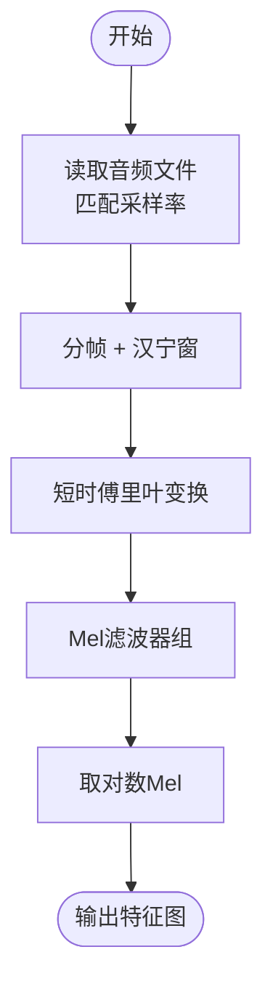

**图表来源**
- [音频基础.md:53-122](file://phases/06-speech-and-audio/01-audio-fundamentals/docs/zh.md#L53-L122)
- [频谱图与Mel特征.md:40-121](file://phases/06-speech-and-audio/02-spectrograms-mel-features/docs/zh.md#L40-L121)

**章节来源**
- [音频基础.md:10-143](file://phases/06-speech-and-audio/01-audio-fundamentals/docs/zh.md#L10-L143)
- [频谱图与Mel特征.md:10-175](file://phases/06-speech-and-audio/02-spectrograms-mel-features/docs/zh.md#L10-L175)

### 音频分类：从MFCC到BEATs
- k-NN（MFCC均值）→ 2D CNN（对数Mel）→ AST（ViT）→ BEATs/WavLM（SSL微调）→ Whisper编码器冻结。
- 数据层面：类别不平衡、Mixup、SpecAugment；评估：mAP、每类召回率、宏F1。
- 交付：为任务选择架构、增强与评估指标。

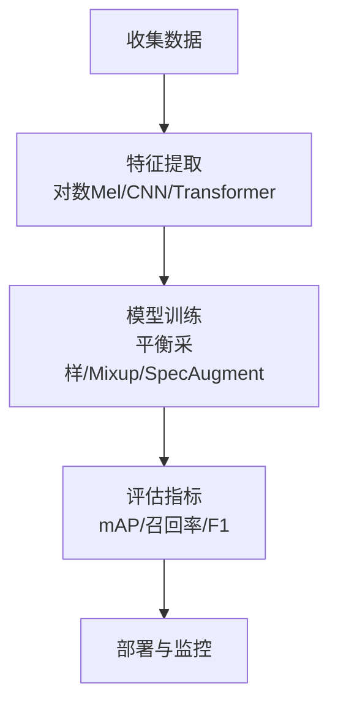

**图表来源**
- [音频分类.md:52-150](file://phases/06-speech-and-audio/03-audio-classification/docs/zh.md#L52-L150)

**章节来源**
- [音频分类.md:10-180](file://phases/06-speech-and-audio/03-audio-classification/docs/zh.md#L10-L180)

### 语音识别ASR：CTC/RNN-T/注意力
- CTC（非自回归，速度快）、RNN-T（可流式+内部LM）、注意力（离线质量最高，需工程化流式）。
- WER是唯一重要指标；2026年基准：Parakeet-TDT-1.1B、Whisper-Large-v3-turbo、Canary-1B Flash。
- 动手：贪心/波束搜索CTC解码、WER计算、Whisper推理、流式Parakeet/wav2vec 2.0。

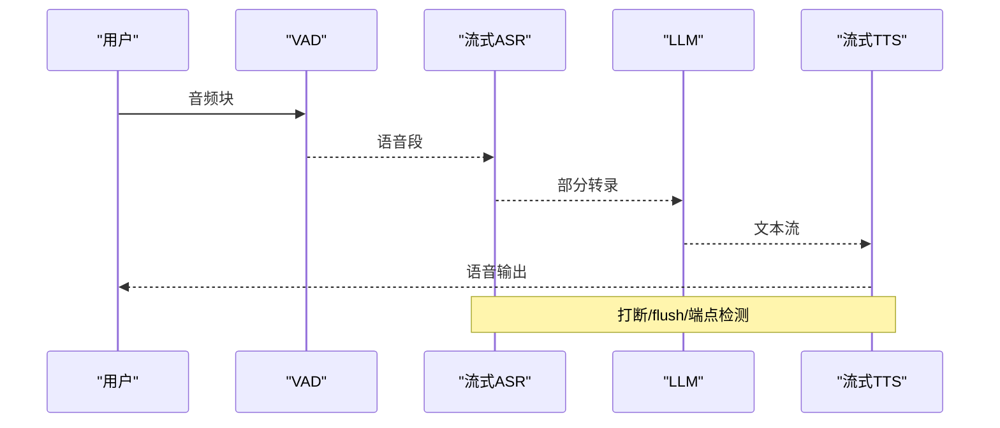

**图表来源**
- [语音识别ASR.md:51-132](file://phases/06-speech-and-audio/04-speech-recognition-asr/docs/zh.md#L51-L132)
- [实时音频处理.md:26-122](file://phases/06-speech-and-audio/11-real-time-audio-processing/docs/zh.md#L26-L122)

**章节来源**
- [语音识别ASR.md:10-182](file://phases/06-speech-and-audio/04-speech-recognition-asr/docs/zh.md#L10-L182)

### Whisper架构与微调
- 架构：30秒窗口的编码器-解码器（Transformer），提示格式控制任务与语言。
- 微调：generate_with_loss回调、LoRA高效微调、冻结编码器、Whisper分词器与提示格式。
- 交付：为领域设计微调/推理流水线。

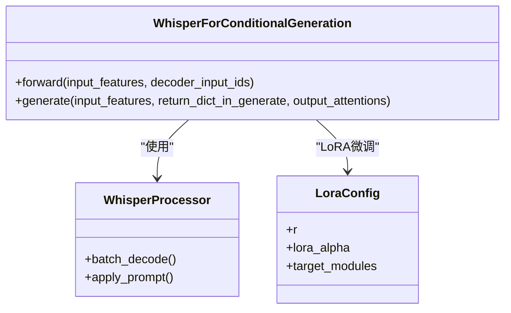

**图表来源**
- [Whisper架构与微调.md:73-121](file://phases/06-speech-and-audio/05-whisper-architecture-finetuning/docs/zh.md#L73-L121)

**章节来源**
- [Whisper架构与微调.md:10-188](file://phases/06-speech-and-audio/05-whisper-architecture-finetuning/docs/zh.md#L10-L188)

### 说话人识别与验证
- 注册：固定维度嵌入（ECAPA-TDNN/WavLM-SV/x-vector）；验证：余弦相似度+阈值；EER为核心指标。
- 说话人日志：VAD→分割→嵌入→聚类→平滑边界；pyannote.audio 3.1。
- 交付：选择模型、注册协议、阈值调整与防欺诈。

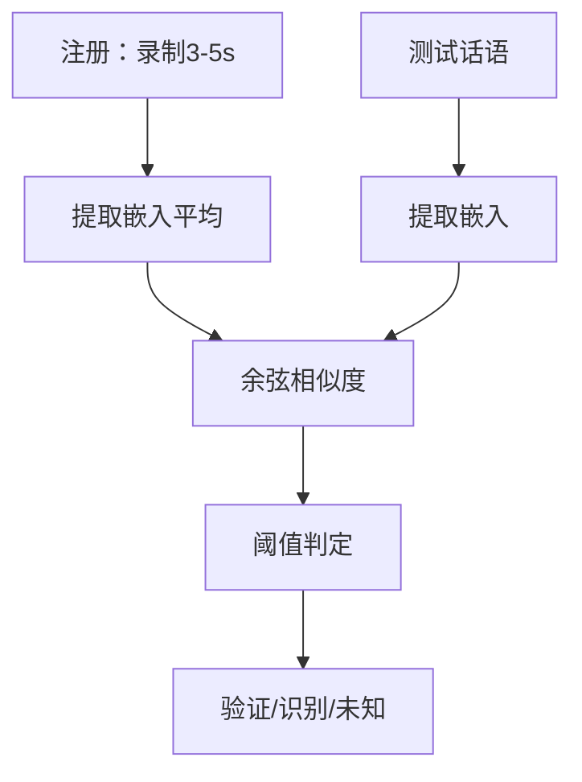

**图表来源**
- [说话人识别与验证.md:52-122](file://phases/06-speech-and-audio/06-speaker-recognition-verification/docs/zh.md#L52-L122)

**章节来源**
- [说话人识别与验证.md:10-173](file://phases/06-speech-and-audio/06-speaker-recognition-verification/docs/zh.md#L10-L173)

### 文本转语音TTS：从Tacotron到F5与Kokoro
- 三阶段：文本前端（归一化/音素/韵律）→ 声学模型（Tacotron/FastSpeech/VITS/F5-TTS/Kokoro）→ 声码器（WaveNet/WaveRNN/HiFi-GAN/BigVGAN/神经编解码器）。
- 评估：UTMOS、CMOS、CER（通过Whisper）、SECS（克隆保真度）。
- 交付：为声音/延迟/语言目标设计TTS流水线。

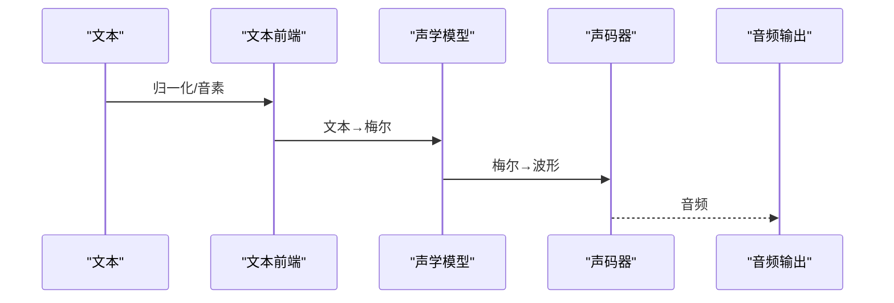

**图表来源**
- [文本转语音TTS.md:69-131](file://phases/06-speech-and-audio/07-text-to-speech/docs/zh.md#L69-L131)

**章节来源**
- [文本转语音TTS.md:10-184](file://phases/06-speech-and-audio/07-text-to-speech/docs/zh.md#L10-L184)

### 语音克隆与转换：零样本/少样本/VC
- 零样本：F5-TTS/OpenVoice v2；少样本微调：LoRA；语音转换：KNN-VC/Diff-HierVC；神经编解码器TTS：VALL-E 2/VoiceBox。
- 伦理与合规：水印（SilentCipher）、同意门控、检测（AASIST/Wav2Vec2-AASIST）。
- 交付：带水印+同意+质量目标的克隆/转换流水线。

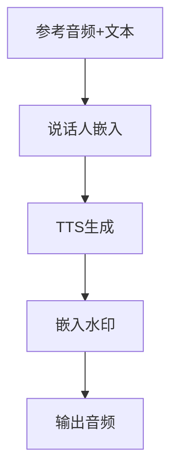

**图表来源**
- [语音克隆与转换.md:60-120](file://phases/06-speech-and-audio/08-voice-cloning-conversion/docs/zh.md#L60-L120)

**章节来源**
- [语音克隆与转换.md:10-172](file://phases/06-speech-and-audio/08-voice-cloning-conversion/docs/zh.md#L10-L172)

### 音乐生成：MusicGen/Stable Audio/AudioLDM
- 基于编解码器词元的AR语言模型（MusicGen/ACE-Step）与扩散（Stable Audio/AudioLDM）。
- 评估：FAD、CLAP、音乐性主观；法律环境：版权与披露要求。
- 交付：为生成部署选择模型、许可策略与披露元数据。

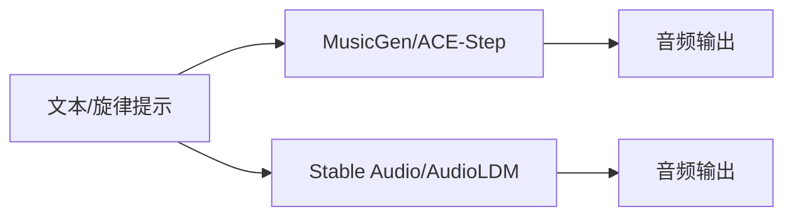

**图表来源**
- [音乐生成.md:71-120](file://phases/06-speech-and-audio/09-music-generation/docs/zh.md#L71-L120)

**章节来源**
- [音乐生成.md:10-169](file://phases/06-speech-and-audio/09-music-generation/docs/zh.md#L10-L169)

### 音频语言模型ALM：Qwen2.5-Omni/Audio Flamingo
- 三组件：音频编码器（Whisper/BEATs/CLAP/WavLM）+ 投影器 + LLM。
- 基准：MMAU-Pro/LongAudioBench；实用场景：合规审计、无障碍、内容审核、播客分章、音乐分析。
- 交付：为任务选择模型+基准+输出模态。

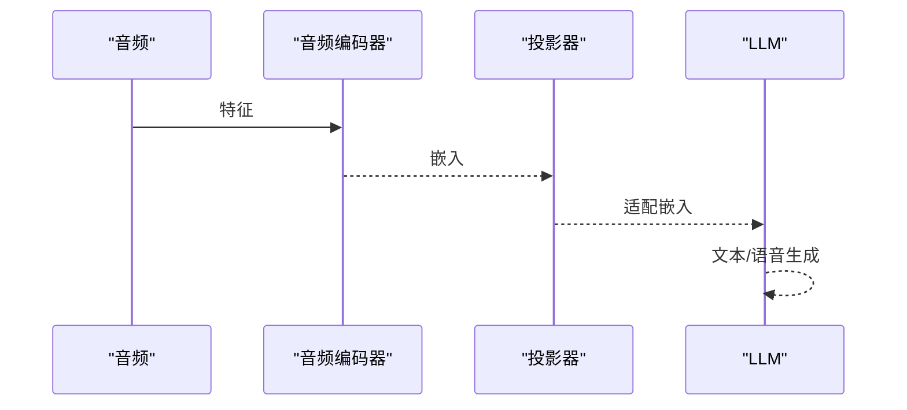

**图表来源**
- [音频语言模型.md:83-139](file://phases/06-speech-and-audio/10-audio-language-models/docs/zh.md#L83-L139)

**章节来源**
- [音频语言模型.md:10-187](file://phases/06-speech-and-audio/10-audio-language-models/docs/zh.md#L10-L187)

### 实时音频处理：延迟预算与流水线
- 延迟预算：麦克风→缓冲（20ms）、VAD（10ms）、流式ASR（150ms）、LLM（100ms）、TTS（100ms）、渲染（20ms），总计≈400ms。
- 关键技术：环形缓冲区、VAD门控、流式ASR、中断、WebRTC Opus传输、抖动缓冲区、回声消除。
- 交付：设计实时音频流水线，包含每个阶段的具体预算。

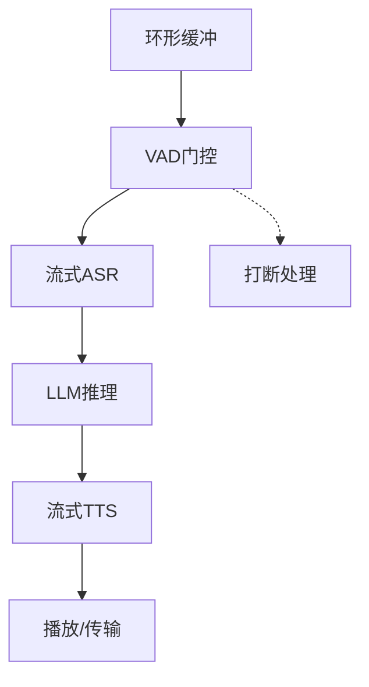

**图表来源**
- [实时音频处理.md:55-122](file://phases/06-speech-and-audio/11-real-time-audio-processing/docs/zh.md#L55-L122)

**章节来源**
- [实时音频处理.md:10-175](file://phases/06-speech-and-audio/11-real-time-audio-processing/docs/zh.md#L10-L175)

### 语音助手流水线：端到端集成
- 七组件：音频捕获、VAD、流式STT、LLM（工具调用）、流式TTS、播放、中断处理。
- 质量目标：无漏词、无静音幻觉、无克隆泄漏、无提示注入成功；延迟目标：CPU笔记本<800ms。
- 交付：根据预算/规模/语言/合规生成技术栈规格。

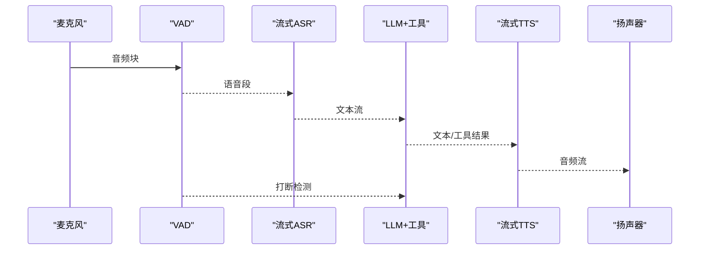

**图表来源**
- [语音助手流水线.md:54-129](file://phases/06-speech-and-audio/12-voice-assistant-pipeline/docs/zh.md#L54-L129)

**章节来源**
- [语音助手流水线.md:10-178](file://phases/06-speech-and-audio/12-voice-assistant-pipeline/docs/zh.md#L10-L178)

### 神经音频编解码器：EnCodec/SNAC/Mimi/DAC
- 核心：残差向量量化（RVQ）；帧率与语言建模的关系；语义-声学分离（Mimi）。
- 应用：通用音乐生成（EnCodec）、最高保真（DAC）、语音AR-LM（SNAC/Mimi）、精细编辑（DAC）。
- 交付：为生成/压缩任务选择编解码器。


**图表来源**
- [神经音频编解码器.md:77-123](file://phases/06-speech-and-audio/13-neural-audio-codecs/docs/zh.md#L77-L123)

**章节来源**
- [神经音频编解码器.md:10-186](file://phases/06-speech-and-audio/13-neural-audio-codecs/docs/zh.md#L10-L186)

### 语音活动检测与话轮切换：Silero/Flush
- 三级VAD级联：能量门控→Silero VAD→语义话轮检测；关键参数：阈值、最小语音、静默延续、预卷缓冲。
- Flush技巧：VAD检测结束→向STT发送flush信号→缩短延迟。
- 交付：为工作负载选择VAD模型与策略。

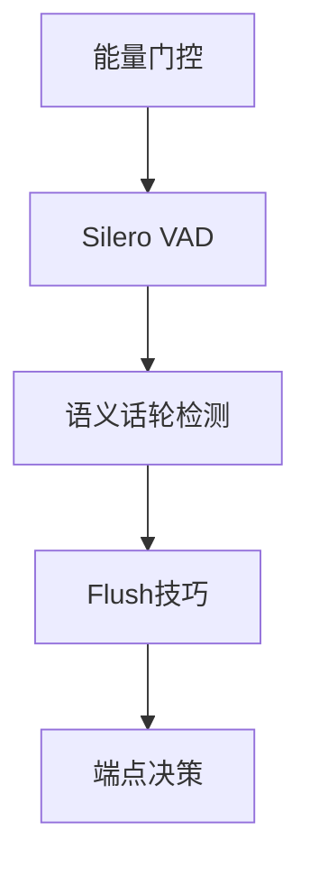

**图表来源**
- [语音活动检测与话轮切换.md:56-122](file://phases/06-speech-and-audio/14-voice-activity-detection-turn-taking/docs/zh.md#L56-L122)

**章节来源**
- [语音活动检测与话轮切换.md:10-174](file://phases/06-speech-and-audio/14-voice-activity-detection-turn-taking/docs/zh.md#L10-L174)

### 流式语音到语音：Moshi/Hibiki与全双工
- 架构：两个并行Mimi流+内心独白文本；深度Transformer顺序预测8个码本；理论延迟160ms（实际200ms）。
- Hibiki：流式语音到语音翻译，无需词级对齐数据；Sesame CSM：上下文条件TTS。
- 交付：选择管线vs全双工架构的理由。

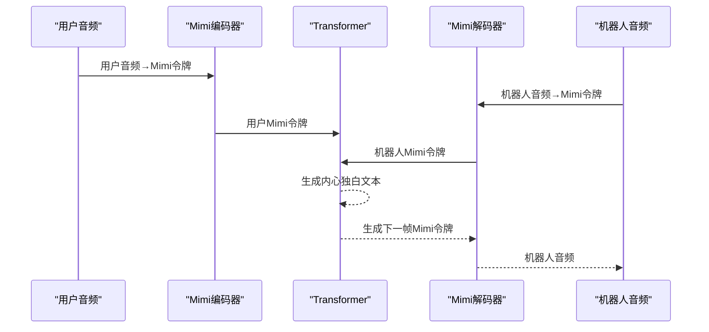

**图表来源**
- [流式语音到语音MoshiHibiki.md:75-118](file://phases/06-speech-and-audio/15-streaming-speech-to-speech-moshi-hibiki/docs/zh.md#L75-L118)

**章节来源**
- [流式语音到语音MoshiHibiki.md:10-181](file://phases/06-speech-and-audio/15-streaming-speech-to-speech-moshi-hibiki/docs/zh.md#L10-L181)

## 依赖关系分析
- 模块内依赖：特征提取（02）是ASR（04）、TTS（07）、分类（03）、ALM（10）的基础；Whisper（05）依赖ASR（04）与特征（02）。
- 模块间依赖：实时处理（11）贯穿ASR/TTS/播放；全双工（15）与编解码器（13）共同推动新一代语音助手；VAD/话轮（14）保障流水线稳定性。
- 外部依赖：Librosa/torchaudio、transformers、SpeechBrain、pyannote、Silero VAD、WebRTC、Encodec/Mosi等。

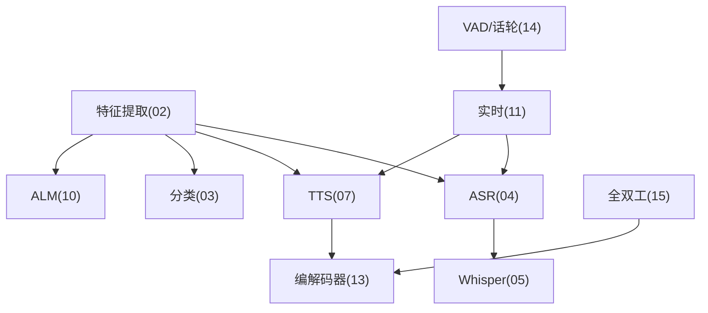

**图表来源**
- [音频基础.md:1-143](file://phases/06-speech-and-audio/01-audio-fundamentals/docs/zh.md#L1-L143)
- [频谱图与Mel特征.md:1-175](file://phases/06-speech-and-audio/02-spectrograms-mel-features/docs/zh.md#L1-L175)
- [语音识别ASR.md:1-182](file://phases/06-speech-and-audio/04-speech-recognition-asr/docs/zh.md#L1-L182)
- [Whisper架构与微调.md:1-188](file://phases/06-speech-and-audio/05-whisper-architecture-finetuning/docs/zh.md#L1-L188)
- [文本转语音TTS.md:1-184](file://phases/06-speech-and-audio/07-text-to-speech/docs/zh.md#L1-L184)
- [神经音频编解码器.md:1-186](file://phases/06-speech-and-audio/13-neural-audio-codecs/docs/zh.md#L1-L186)
- [实时音频处理.md:1-175](file://phases/06-speech-and-audio/11-real-time-audio-processing/docs/zh.md#L1-L175)
- [语音活动检测与话轮切换.md:1-174](file://phases/06-speech-and-audio/14-voice-activity-detection-turn-taking/docs/zh.md#L1-L174)
- [流式语音到语音MoshiHibiki.md:1-181](file://phases/06-speech-and-audio/15-streaming-speech-to-speech-moshi-hibiki/docs/zh.md#L1-L181)

## 性能考量
- 延迟预算：实时流水线严格遵循各阶段预算，避免累积延迟；全双工（Moshi/Hibiki）在硬件受限时提供更低延迟。
- 质量与效率：Whisper Turbo/Parakeet在延迟与WER之间取得平衡；TTS选择Kokoro（CPU友好）或F5-TTS（高质量）。
- 数据与评估：类别不平衡、Mixup、SpecAugment提升分类稳健性；FAD/CMOS/UTMOS/SECS等指标指导生成与克隆质量。
- 压缩与生成：EnCodec/DAC/SNAC/Mimi在重建质量与令牌语言建模之间权衡；Mimi的语义-声学分离显著提升生成效率。

[本节为通用指导，无需具体文件分析]

## 故障排查指南
- 采样率与混叠：确保上游采样率与下游模型一致；使用抗混叠重采样。
- 静音幻觉：始终配合VAD门控；Whisper默认阈值与条件参数需谨慎设置。
- 特征不匹配：Mel数量、窗口/步长、归一化方案需两端一致。
- 说话人识别：短话语、信道不匹配、阈值固定、未归一化嵌入会影响EER。
- TTS削波与采样率：声码器输出需裁剪；输出采样率与下游不一致会导致混叠。
- 音乐生成：版权与披露要求；超过30秒易出现重复/漂移，需交叉淡化或结构一致性。
- 全双工与中断：打断处理必须可取消；VAD与flush技巧协同降低端到端延迟。
- 语音克隆：参考转录必须完全匹配；水印与同意门控为法律合规要求。

**章节来源**
- [音频基础.md:137-143](file://phases/06-speech-and-audio/01-audio-fundamentals/docs/zh.md#L137-L143)
- [频谱图与Mel特征.md:137-144](file://phases/06-speech-and-audio/02-spectrograms-mel-features/docs/zh.md#L137-L144)
- [音频分类.md:149-150](file://phases/06-speech-and-audio/03-audio-classification/docs/zh.md#L149-L150)
- [语音识别ASR.md:146-152](file://phases/06-speech-and-audio/04-speech-recognition-asr/docs/zh.md#L146-L152)
- [Whisper架构与微调.md:152-158](file://phases/06-speech-and-audio/05-whisper-architecture-finetuning/docs/zh.md#L152-L158)
- [说话人识别与验证.md:135-142](file://phases/06-speech-and-audio/06-speaker-recognition-verification/docs/zh.md#L135-L142)
- [文本转语音TTS.md:147-153](file://phases/06-speech-and-audio/07-text-to-speech/docs/zh.md#L147-L153)
- [音乐生成.md:132-139](file://phases/06-speech-and-audio/09-music-generation/docs/zh.md#L132-L139)
- [实时音频处理.md:138-145](file://phases/06-speech-and-audio/11-real-time-audio-processing/docs/zh.md#L138-L145)
- [语音活动检测与话轮切换.md:136-143](file://phases/06-speech-and-audio/14-voice-activity-detection-turn-taking/docs/zh.md#L136-L143)
- [语音克隆与转换.md:134-141](file://phases/06-speech-and-audio/08-voice-cloning-conversion/docs/zh.md#L134-L141)

## 结论
本课程以“从零实现语音系统”为目标，系统覆盖从音频基础、特征工程、理解与生成，到实时处理与全双工架构的完整技术栈。通过模块化学习与动手实践，学习者可掌握构建高质量、低延迟、可扩展的语音与音频系统的工程能力，并在多模态AI中发挥关键作用。课程强调生产落地与合规（水印、同意、披露），并提供可交付的技能文档与练习，帮助学员在真实场景中快速迭代与交付。

[本节为总结，无需具体文件分析]

## 附录
- 术语速查：采样率、奈奎斯特、位深度、DFT/FFT、Bin、STFT、Mel、对数Mel、MFCC、WER、EER、FAD、UTMOS、SECS、VAD、Flush、全双工、Mimi、EnCodec、SNAC、DAC、AASIST、SilentCipher。
- 进一步阅读：各模块末尾列出的论文与仓库链接，便于深入学习与复现。

[本节为概览，无需具体文件分析]