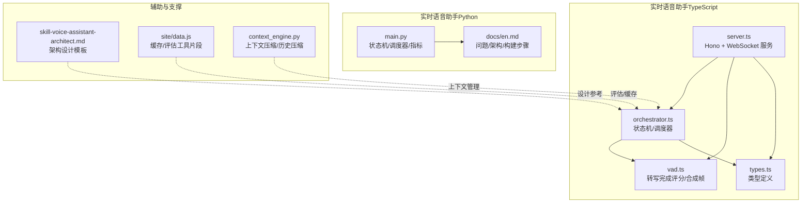
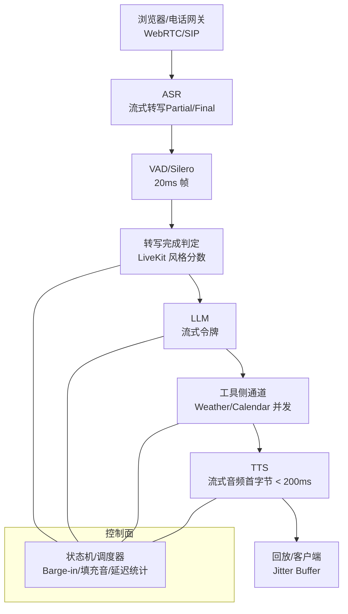
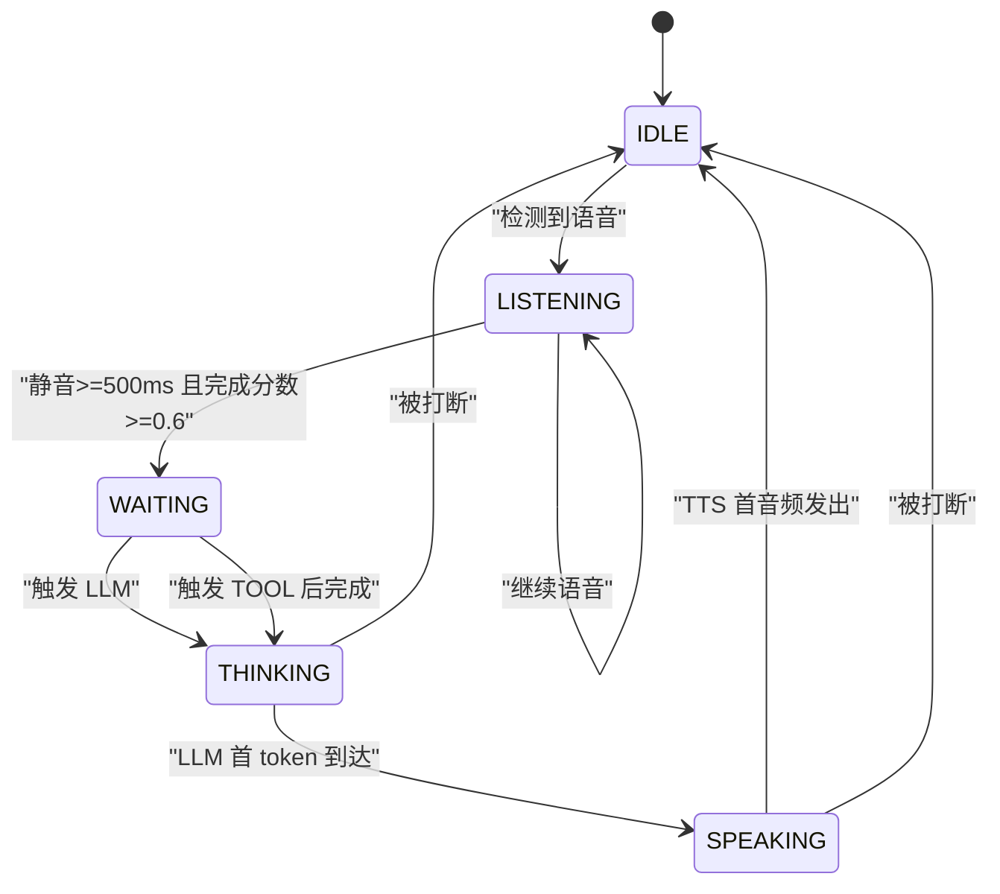
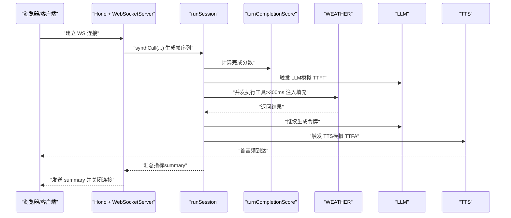
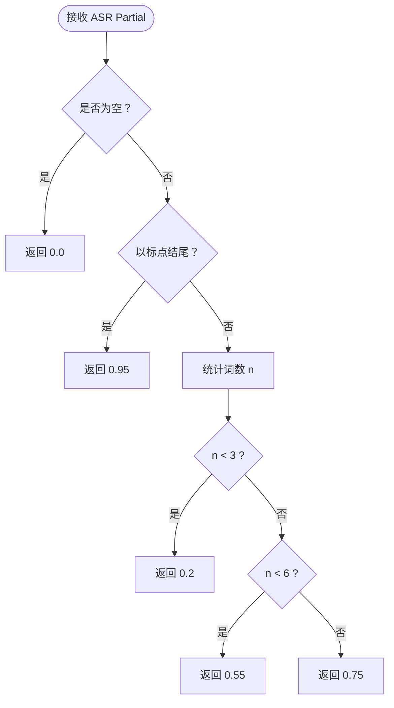
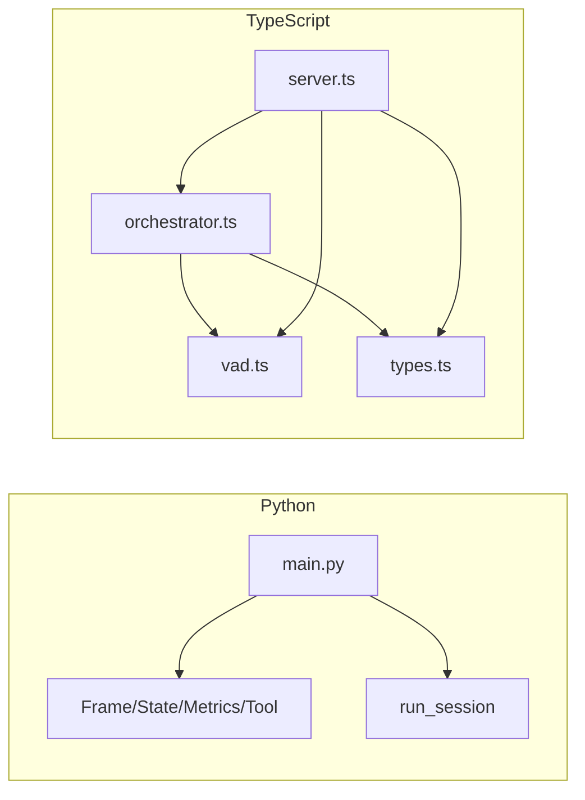

# 语音助手管道

<cite>
**本文引用的文件**
- [main.py](file://phases/19-capstone-projects/03-realtime-voice-assistant/code/main.py)
- [en.md](file://phases/19-capstone-projects/03-realtime-voice-assistant/docs/en.md)
- [orchestrator.ts](file://phases/19-capstone-projects/03-realtime-voice-assistant/code/ts/src/orchestrator.ts)
- [vad.ts](file://phases/19-capstone-projects/03-realtime-voice-assistant/code/ts/src/vad.ts)
- [types.ts](file://phases/19-capstone-projects/03-realtime-voice-assistant/code/ts/src/types.ts)
- [server.ts](file://phases/19-capstone-projects/03-realtime-voice-assistant/code/ts/src/server.ts)
- [skill-voice-assistant-architect.md](file://phases/06-speech-and-audio/12-voice-assistant-pipeline/outputs/skill-voice-assistant-architect.md)
- [data.js](file://site/data.js)
- [context_engine.py](file://guardrails-sandbox/backend/adapters/context_engine.py)
</cite>

## 目录
1. [引言](#引言)
2. [项目结构](#项目结构)
3. [核心组件](#核心组件)
4. [架构总览](#架构总览)
5. [详细组件分析](#详细组件分析)
6. [依赖关系分析](#依赖关系分析)
7. [性能考量](#性能考量)
8. [故障排查指南](#故障排查指南)
9. [结论](#结论)
10. [附录](#附录)

## 引言
本课程围绕“语音助手管道”的完整实现展开，覆盖从唤醒词与语音活动检测（VAD）、流式语音识别（ASR）、转写完成判定（Turn Detection）、意图与上下文理解（NLU/LLM）、对话管理与工具调用、到流式语音合成（TTS）与回放的全链路。文档重点阐述模块间接口设计与数据流，给出端到端实现的代码路径指引，并补充多轮对话、上下文压缩、个性化设置、性能优化与测试部署最佳实践。

## 项目结构
该仓库中与语音助手管道直接相关的核心代码位于“实时语音助手”项目，包含 Python 的离线状态机模拟与 TypeScript 的 Web 客户端与 WebSocket 服务端示例；同时配套了语音助手架构设计技能文档与站点数据脚本用于评估与可视化。

图示来源
- [main.py:1-239](file://phases/19-capstone-projects/03-realtime-voice-assistant/code/main.py#L1-L239)
- [en.md:1-152](file://phases/19-capstone-projects/03-realtime-voice-assistant/docs/en.md#L1-L152)
- [orchestrator.ts:1-163](file://phases/19-capstone-projects/03-realtime-voice-assistant/code/ts/src/orchestrator.ts#L1-L163)
- [vad.ts:1-38](file://phases/19-capstone-projects/03-realtime-voice-assistant/code/ts/src/vad.ts#L1-L38)
- [types.ts:1-32](file://phases/19-capstone-projects/03-realtime-voice-assistant/code/ts/src/types.ts#L1-L32)
- [server.ts:1-61](file://phases/19-capstone-projects/03-realtime-voice-assistant/code/ts/src/server.ts#L1-L61)
- [skill-voice-assistant-architect.md:1-30](file://phases/06-speech-and-audio/12-voice-assistant-pipeline/outputs/skill-voice-assistant-architect.md#L1-L30)
- [data.js:8854-9133](file://site/data.js#L8854-L9133)
- [context_engine.py:139-176](file://guardrails-sandbox/backend/adapters/context_engine.py#L139-L176)

章节来源
- [main.py:1-239](file://phases/19-capstone-projects/03-realtime-voice-assistant/code/main.py#L1-L239)
- [en.md:1-152](file://phases/19-capstone-projects/03-realtime-voice-assistant/docs/en.md#L1-L152)
- [orchestrator.ts:1-163](file://phases/19-capstone-projects/03-realtime-voice-assistant/code/ts/src/orchestrator.ts#L1-L163)
- [vad.ts:1-38](file://phases/19-capstone-projects/03-realtime-voice-assistant/code/ts/src/vad.ts#L1-L38)
- [types.ts:1-32](file://phases/19-capstone-projects/03-realtime-voice-assistant/code/ts/src/types.ts#L1-L32)
- [server.ts:1-61](file://phases/19-capstone-projects/03-realtime-voice-assistant/code/ts/src/server.ts#L1-L61)
- [skill-voice-assistant-architect.md:1-30](file://phases/06-speech-and-audio/12-voice-assistant-pipeline/outputs/skill-voice-assistant-architect.md#L1-L30)
- [data.js:8854-9133](file://site/data.js#L8854-L9133)
- [context_engine.py:139-176](file://guardrails-sandbox/backend/adapters/context_engine.py#L139-L176)

## 核心组件
- 状态机与调度器：负责在五阶段流水线（音频输入、ASR、转写完成判定、LLM、TTS）之间进行仲裁，处理打断（barge-in）、工具侧通道、填充音注入与延迟统计。
- VAD 与转写完成判定：基于 20ms 帧的静音持续时间与转写片段的完成分数，决定“说话结束”。
- 工具侧通道：在不阻塞音频播放的前提下并发执行工具调用，必要时注入填充语句。
- 流式 TTS：在 LLM 首 token 后尽快输出首音频包，确保端到端低延迟。
- WebRTC/WS 服务端（TS）：提供健康检查与 WebSocket 推送事件与摘要，便于前端演示与监控。

章节来源
- [main.py:78-202](file://phases/19-capstone-projects/03-realtime-voice-assistant/code/main.py#L78-L202)
- [orchestrator.ts:42-151](file://phases/19-capstone-projects/03-realtime-voice-assistant/code/ts/src/orchestrator.ts#L42-L151)
- [vad.ts:3-12](file://phases/19-capstone-projects/03-realtime-voice-assistant/code/ts/src/vad.ts#L3-L12)
- [server.ts:38-47](file://phases/19-capstone-projects/03-realtime-voice-assistant/code/ts/src/server.ts#L38-L47)

## 架构总览
语音助手管道采用“端到端流式”架构，强调每个环节的低延迟与可插拔性。核心链路如下：

图示来源
- [en.md:25-59](file://phases/19-capstone-projects/03-realtime-voice-assistant/docs/en.md#L25-L59)
- [main.py:123-202](file://phases/19-capstone-projects/03-realtime-voice-assistant/code/main.py#L123-L202)
- [orchestrator.ts:42-151](file://phases/19-capstone-projects/03-realtime-voice-assistant/code/ts/src/orchestrator.ts#L42-L151)

## 详细组件分析

### Python 状态机与调度器
- 数据结构
  - 帧 Frame：包含时间戳、是否语音、累计转写片段。
  - 状态 State：IDLE/LISTENING/WAITING/THINKING/SPEAKING/TOOL。
  - 指标 Metrics：记录事件、转写完成时刻、LLM 首 token 时刻、TTS 首音频时刻、误截断次数、打断次数。
- 关键流程
  - LISTENING：跟踪静音持续时间与最终转写片段；当静音≥500ms 且完成分数≥0.6，进入 WAITING。
  - WAITING：触发 LLM（模拟首 token 延迟），若启用工具则进入 TOOL。
  - TOOL：并发执行天气查询，超过 300ms 注入填充音，完成后恢复 THINKING 并再次触发 LLM。
  - THINKING：收到 LLM 首 token 后，触发 TTS（模拟首音频延迟）。
  - SPEAKING：TTS 首音频发出后，会话结束。
  - 打断（Barge-in）：若在 SPEAKING 或 THINKING 期间检测到用户新语音，立即取消 TTS/LLM，重新进入 LISTENING。

图示来源
- [main.py:78-202](file://phases/19-capstone-projects/03-realtime-voice-assistant/code/main.py#L78-L202)

章节来源
- [main.py:25-52](file://phases/19-capstone-projects/03-realtime-voice-assistant/code/main.py#L25-L52)
- [main.py:59-71](file://phases/19-capstone-projects/03-realtime-voice-assistant/code/main.py#L59-L71)
- [main.py:78-85](file://phases/19-capstone-projects/03-realtime-voice-assistant/code/main.py#L78-L85)
- [main.py:87-103](file://phases/19-capstone-projects/03-realtime-voice-assistant/code/main.py#L87-L103)
- [main.py:123-202](file://phases/19-capstone-projects/03-realtime-voice-assistant/code/main.py#L123-L202)

### TypeScript 状态机与调度器（Web 客户端/服务端）
- 类型定义：State、AudioChunk、Tool、Metrics、SessionOptions、SessionSummary。
- 转写完成评分：基于标点与词数的启发式分数。
- 会话运行：与 Python 版本一致的状态机逻辑，支持回调事件推送与摘要生成。
- WebSocket 服务：Hono 提供 /healthz；连接建立后驱动一次会话并通过 WS 推送事件与摘要。

图示来源
- [server.ts:38-47](file://phases/19-capstone-projects/03-realtime-voice-assistant/code/ts/src/server.ts#L38-L47)
- [orchestrator.ts:42-151](file://phases/19-capstone-projects/03-realtime-voice-assistant/code/ts/src/orchestrator.ts#L42-L151)
- [vad.ts:3-12](file://phases/19-capstone-projects/03-realtime-voice-assistant/code/ts/src/vad.ts#L3-L12)
- [types.ts:1-32](file://phases/19-capstone-projects/03-realtime-voice-assistant/code/ts/src/types.ts#L1-L32)

章节来源
- [types.ts:1-32](file://phases/19-capstone-projects/03-realtime-voice-assistant/code/ts/src/types.ts#L1-L32)
- [vad.ts:1-38](file://phases/19-capstone-projects/03-realtime-voice-assistant/code/ts/src/vad.ts#L1-L38)
- [orchestrator.ts:1-163](file://phases/19-capstone-projects/03-realtime-voice-assistant/code/ts/src/orchestrator.ts#L1-L163)
- [server.ts:1-61](file://phases/19-capstone-projects/03-realtime-voice-assistant/code/ts/src/server.ts#L1-L61)

### 转写完成判定（Turn Detection）
- 输入：ASR 累计 partial。
- 规则：以标点结尾优先高分；否则按词数阈值分段评分；结合 VAD 静音窗口（≥500ms）避免误判。
- 输出：完成分数，作为进入 WAITING 的决策依据。

图示来源
- [main.py:59-71](file://phases/19-capstone-projects/03-realtime-voice-assistant/code/main.py#L59-L71)
- [vad.ts:3-12](file://phases/19-capstone-projects/03-realtime-voice-assistant/code/ts/src/vad.ts#L3-L12)

章节来源
- [main.py:59-71](file://phases/19-capstone-projects/03-realtime-voice-assistant/code/main.py#L59-L71)
- [vad.ts:3-12](file://phases/19-capstone-projects/03-realtime-voice-assistant/code/ts/src/vad.ts#L3-L12)

### 工具侧通道与填充音
- 并发执行：在 WAITING 或 THINKING 阶段触发工具调用，避免阻塞音频。
- 填充音策略：若工具耗时超过 300ms，先由 LLM 输出短暂停留语句，提升交互感知。
- 结果回传：工具完成后恢复 LLM 生成，随后触发 TTS。

章节来源
- [main.py:173-187](file://phases/19-capstone-projects/03-realtime-voice-assistant/code/main.py#L173-L187)
- [orchestrator.ts:107-131](file://phases/19-capstone-projects/03-realtime-voice-assistant/code/ts/src/orchestrator.ts#L107-L131)

### 多轮对话与上下文管理
- 上下文压缩：通过滚动摘要与分层存储，维持对话长度与 token 预算的平衡。
- 历史压缩：当上下文总量超过阈值时，将最早若干轮对话压缩为摘要，保留最新对话以减少信息丢失。

章节来源
- [context_engine.py:139-176](file://guardrails-sandbox/backend/adapters/context_engine.py#L139-L176)

### 语音助手架构设计模板
- 组件清单：麦克风/分块、VAD、流式 STT、LLM+工具、流式 TTS、回放、打断处理。
- 延迟预算：按阶段拆分 P50/P95/P99，明确串行与并行阶段。
- 工具 Schema：JSON 规范、错误处理与回退文本，要求 LLM 失败两次后的“无法帮助”路径。
- 安全与合规：提示注入防护、语音克隆限制、PII 日志脱敏、保留期限等。

章节来源
- [skill-voice-assistant-architect.md:10-30](file://phases/06-speech-and-audio/12-voice-assistant-pipeline/outputs/skill-voice-assistant-architect.md#L10-L30)

## 依赖关系分析
- Python 端
  - main.py 依赖自身定义的 Frame、State、Metrics、Tool 以及 turn_completion_score。
  - 运行会话函数 run_session 是调度器核心，串联 VAD、ASR partial、LLM、TTS、工具。
- TypeScript 端
  - orchestrator.ts 依赖 vad.ts 的 turnCompletionScore 与 types.ts 的类型定义。
  - server.ts 依赖 Hono 与 ws，提供 /healthz 与 WebSocket 升级，驱动会话并推送事件与摘要。

图示来源
- [main.py:1-239](file://phases/19-capstone-projects/03-realtime-voice-assistant/code/main.py#L1-L239)
- [orchestrator.ts:1-163](file://phases/19-capstone-projects/03-realtime-voice-assistant/code/ts/src/orchestrator.ts#L1-L163)
- [vad.ts:1-38](file://phases/19-capstone-projects/03-realtime-voice-assistant/code/ts/src/vad.ts#L1-L38)
- [types.ts:1-32](file://phases/19-capstone-projects/03-realtime-voice-assistant/code/ts/src/types.ts#L1-L32)
- [server.ts:1-61](file://phases/19-capstone-projects/03-realtime-voice-assistant/code/ts/src/server.ts#L1-L61)

章节来源
- [main.py:1-239](file://phases/19-capstone-projects/03-realtime-voice-assistant/code/main.py#L1-L239)
- [orchestrator.ts:1-163](file://phases/19-capstone-projects/03-realtime-voice-assistant/code/ts/src/orchestrator.ts#L1-L163)
- [vad.ts:1-38](file://phases/19-capstone-projects/03-realtime-voice-assistant/code/ts/src/vad.ts#L1-L38)
- [types.ts:1-32](file://phases/19-capstone-projects/03-realtime-voice-assistant/code/ts/src/types.ts#L1-L32)
- [server.ts:1-61](file://phases/19-capstone-projects/03-realtime-voice-assistant/code/ts/src/server.ts#L1-L61)

## 性能考量
- 延迟预算与阶段划分
  - 端到端目标：Hamming VAD 基准下，15dB SNR 下 WER<8%，P50 首音频出 <800ms，假打断率<3%，TTS MOS>4.2。
  - 阶段拆分：采集/编解码、VAD、ASR、LLM TTFT、TTS TTFA，明确串行/并行关系。
- 缓存与前缀稳定性
  - 使用前缀缓存降低重复请求成本，站点数据脚本展示了 TTL、命中/未命中统计与淘汰策略。
- 并发与资源分配
  - 在单实例上承载 50 并发会话，需关注 GPU/CPU 分配、批处理与流水线并行。
- 网络鲁棒性
  - 注入丢包（3%）测试，验证转写完成判定与 TTS 抗抖动能力。

章节来源
- [en.md:23-91](file://phases/19-capstone-projects/03-realtime-voice-assistant/docs/en.md#L23-L91)
- [data.js:865-900](file://site/data.js#L865-L900)

## 故障排查指南
- 常见问题定位
  - 假打断（False cutoff）：VAD 对电视声误判导致提前提交转写，应提高静音阈值或调整 turn 分数阈值。
  - 打断处理不当：在工具执行中被打断需正确取消 TTS/LLM 并重置状态机。
  - TTS 缓冲：确保 TTS 首音频在 LLM 首 token 后 200ms 内到达。
- 指标与观测
  - 使用 Metrics 记录事件与关键时刻，结合 WS 推送与摘要输出进行回放与分析。
- 安全与合规
  - 架构模板要求提示注入防护、语音克隆限制、PII 脱敏与保留期约束。

章节来源
- [main.py:87-103](file://phases/19-capstone-projects/03-realtime-voice-assistant/code/main.py#L87-L103)
- [server.ts:38-47](file://phases/19-capstone-projects/03-realtime-voice-assistant/code/ts/src/server.ts#L38-L47)
- [skill-voice-assistant-architect.md:14-19](file://phases/06-speech-and-audio/12-voice-assistant-pipeline/outputs/skill-voice-assistant-architect.md#L14-L19)

## 结论
本课程提供了从理论到实现的完整语音助手管道蓝图：以流式 ASR/VAD/LLM/TTS 为核心，辅以转写完成判定、工具侧通道、打断仲裁与上下文压缩，形成低延迟、可扩展、可观测的端到端系统。通过 Python 与 TypeScript 的双实现，既可离线验证调度逻辑，也可在线演示与监控。配合架构设计模板与站点评估工具，能够快速落地生产级语音助手。

## 附录
- 快速上手
  - 运行 Python 示例：查看 [main.py:209-239](file://phases/19-capstone-projects/03-realtime-voice-assistant/code/main.py#L209-L239)。
  - 启动 TypeScript 服务：查看 [server.ts:49-60](file://phases/19-capstone-projects/03-realtime-voice-assistant/code/ts/src/server.ts#L49-L60)，访问 /healthz 与 WS。
- 评估与报告
  - 参考 [en.md:105-117](file://phases/19-capstone-projects/03-realtime-voice-assistant/docs/en.md#L105-L117) 的交付物与评分维度。
- 架构参考
  - 参考 [skill-voice-assistant-architect.md:10-30](file://phases/06-speech-and-audio/12-voice-assistant-pipeline/outputs/skill-voice-assistant-architect.md#L10-L30) 的组件清单与合规要求。