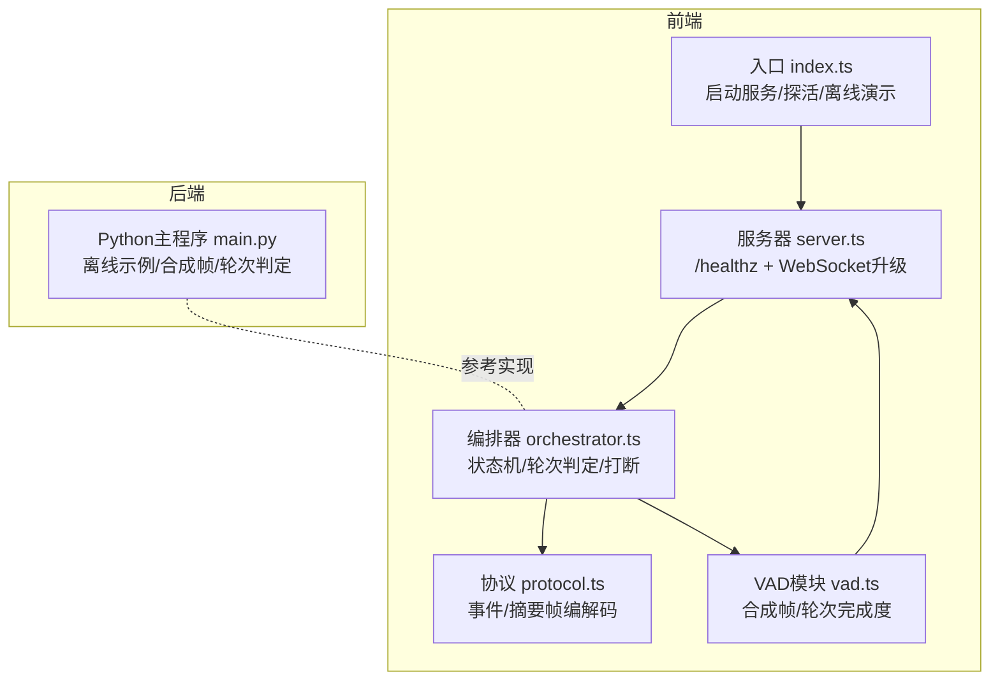
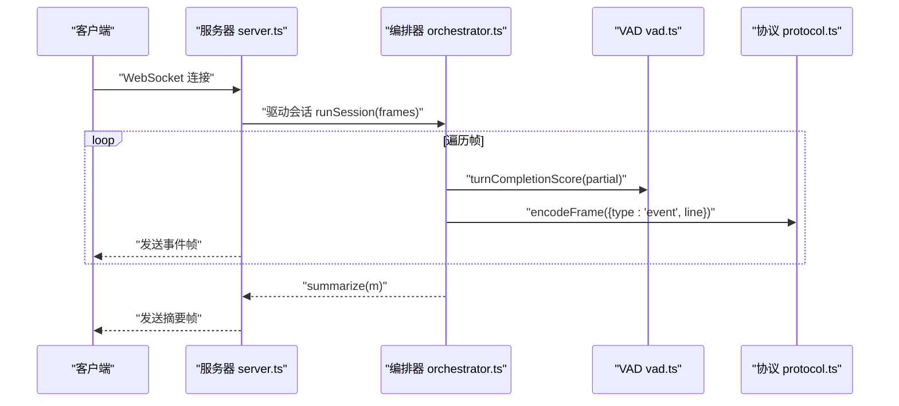
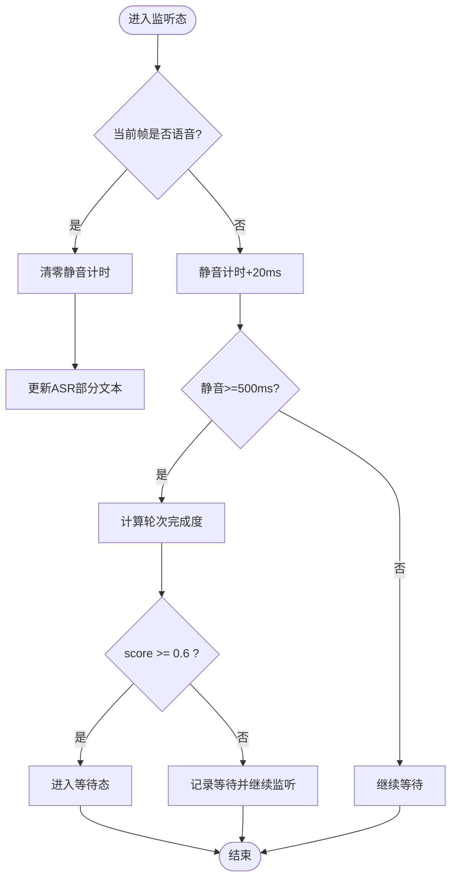
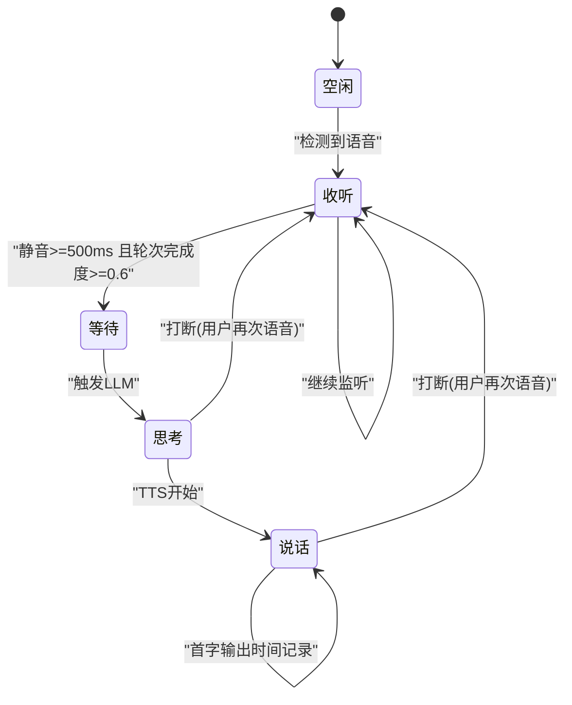
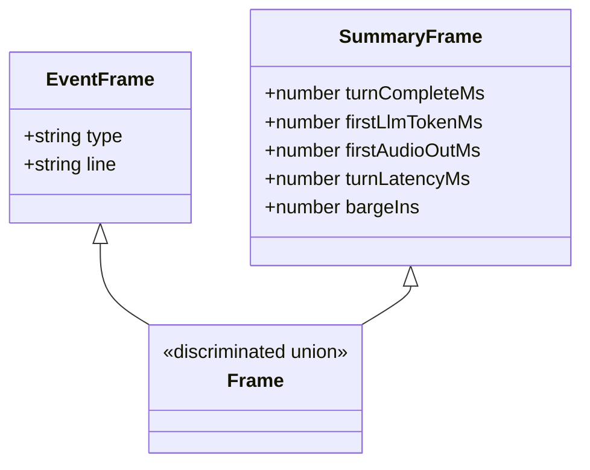
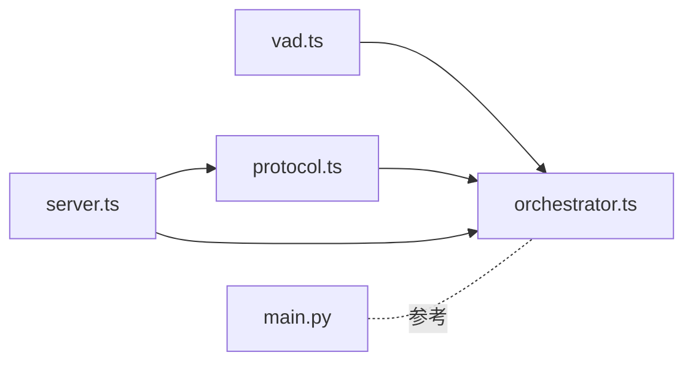

# 语音活动检测与轮流

<cite>
**本文引用的文件**
- [main.py](file://phases/19-capstone-projects/03-realtime-voice-assistant/code/main.py)
- [vad.ts](file://phases/19-capstone-projects/03-realtime-voice-assistant/code/ts/src/vad.ts)
- [orchestrator.ts](file://phases/19-capstone-projects/03-realtime-voice-assistant/code/ts/src/orchestrator.ts)
- [server.ts](file://phases/19-capstone-projects/03-realtime-voice-assistant/code/ts/src/server.ts)
- [protocol.ts](file://phases/19-capstone-projects/03-realtime-voice-assistant/code/ts/src/protocol.ts)
- [types.ts](file://phases/19-capstone-projects/03-realtime-voice-assistant/code/ts/src/types.ts)
- [vad.test.ts](file://phases/19-capstone-projects/03-realtime-voice-assistant/code/ts/tests/vad.test.ts)
- [index.ts](file://phases/19-capstone-projects/03-realtime-voice-assistant/code/ts/src/index.ts)
- [figures-vision-speech.js](file://site/figures-vision-speech.js)
- [data.js](file://site/data.js)
</cite>

## 目录
1. [引言](#引言)
2. [项目结构](#项目结构)
3. [核心组件](#核心组件)
4. [架构总览](#架构总览)
5. [详细组件分析](#详细组件分析)
6. [依赖关系分析](#依赖关系分析)
7. [性能考量](#性能考量)
8. [故障排查指南](#故障排查指南)
9. [结论](#结论)
10. [附录](#附录)

## 引言
本文件围绕“语音活动检测（VAD）与轮流检测”主题，结合仓库中的实时语音助手骨架代码，系统化梳理从零实现智能VAD系统的要点，覆盖实时特征抽取、分类器设计、阈值自适应、去抖动处理、双声道对话的说话人分离与交叉干扰抑制、回声消除等高级能力，并给出针对安静环境、嘈杂环境、多人对话等场景的参数调优建议与性能评估方法。

## 项目结构
该语音助手骨架以“帧驱动”的方式模拟20毫秒音频帧，通过VAD输出“是否语音”，并结合ASR部分结果计算“轮次完成度”，最终驱动状态机完成端到端调度。前端使用WebSocket传输事件与摘要，后端以Hono + ws提供健康检查与会话驱动。

图表来源
- [index.ts:1-20](file://phases/19-capstone-projects/03-realtime-voice-assistant/code/ts/src/index.ts#L1-L20)
- [server.ts:49-60](file://phases/19-capstone-projects/03-realtime-voice-assistant/code/ts/src/server.ts#L49-L60)
- [orchestrator.ts:42-151](file://phases/19-capstone-projects/03-realtime-voice-assistant/code/ts/src/orchestrator.ts#L42-L151)
- [vad.ts:1-38](file://phases/19-capstone-projects/03-realtime-voice-assistant/code/ts/src/vad.ts#L1-L38)
- [protocol.ts:1-29](file://phases/19-capstone-projects/03-realtime-voice-assistant/code/ts/src/protocol.ts#L1-L29)
- [main.py:123-202](file://phases/19-capstone-projects/03-realtime-voice-assistant/code/main.py#L123-L202)

章节来源
- [index.ts:1-20](file://phases/19-capstone-projects/03-realtime-voice-assistant/code/ts/src/index.ts#L1-L20)
- [server.ts:49-60](file://phases/19-capstone-projects/03-realtime-voice-assistant/code/ts/src/server.ts#L49-L60)
- [orchestrator.ts:42-151](file://phases/19-capstone-projects/03-realtime-voice-assistant/code/ts/src/orchestrator.ts#L42-L151)
- [vad.ts:1-38](file://phases/19-capstone-projects/03-realtime-voice-assistant/code/ts/src/vad.ts#L1-L38)
- [protocol.ts:1-29](file://phases/19-capstone-projects/03-realtime-voice-assistant/code/ts/src/protocol.ts#L1-L29)
- [main.py:123-202](file://phases/19-capstone-projects/03-realtime-voice-assistant/code/main.py#L123-L202)

## 核心组件
- 帧与数据模型
  - 帧结构包含时间戳、VAD判定、ASR部分文本，用于驱动状态机与轮次判定。
  - 关键类型定义见 [types.ts:1-32](file://phases/19-capstone-projects/03-realtime-voice-assistant/code/ts/src/types.ts#L1-L32)。
- VAD与轮次完成度
  - VAD合成函数生成带前导静音、语音段、尾随静音的帧序列，便于端到端验证状态机行为。
  - 轮次完成度基于标点与词数启发式打分，见 [vad.ts:3-12](file://phases/19-capstone-projects/03-realtime-voice-assistant/code/ts/src/vad.ts#L3-L12) 与 [main.py:59-71](file://phases/19-capstone-projects/03-realtime-voice-assistant/code/main.py#L59-L71)。
- 编排器与状态机
  - 状态机在空闲、收听、等待、思考、说话之间流转，支持打断与工具侧道执行，见 [orchestrator.ts:42-151](file://phases/19-capstone-projects/03-realtime-voice-assistant/code/ts/src/orchestrator.ts#L42-L151) 与 [main.py:123-202](file://phases/19-capstone-projects/03-realtime-voice-assistant/code/main.py#L123-L202)。
- 协议与服务
  - 使用Zod校验的事件/摘要帧，WebSocket推送事件，见 [protocol.ts:1-29](file://phases/19-capstone-projects/03-realtime-voice-assistant/code/ts/src/protocol.ts#L1-L29)。
  - 服务器提供健康检查与连接驱动，见 [server.ts:49-60](file://phases/19-capstone-projects/03-realtime-voice-assistant/code/ts/src/server.ts#L49-L60)。
- 测试与验证
  - 对轮次完成度与合成帧进行断言，见 [vad.test.ts:1-40](file://phases/19-capstone-projects/03-realtime-voice-assistant/code/ts/tests/vad.test.ts#L1-L40)。

章节来源
- [types.ts:1-32](file://phases/19-capstone-projects/03-realtime-voice-assistant/code/ts/src/types.ts#L1-L32)
- [vad.ts:3-12](file://phases/19-capstone-projects/03-realtime-voice-assistant/code/ts/src/vad.ts#L3-L12)
- [main.py:59-71](file://phases/19-capstone-projects/03-realtime-voice-assistant/code/main.py#L59-L71)
- [orchestrator.ts:42-151](file://phases/19-capstone-projects/03-realtime-voice-assistant/code/ts/src/orchestrator.ts#L42-L151)
- [main.py:123-202](file://phases/19-capstone-projects/03-realtime-voice-assistant/code/main.py#L123-L202)
- [protocol.ts:1-29](file://phases/19-capstone-projects/03-realtime-voice-assistant/code/ts/src/protocol.ts#L1-L29)
- [server.ts:49-60](file://phases/19-capstone-projects/03-realtime-voice-assistant/code/ts/src/server.ts#L49-L60)
- [vad.test.ts:1-40](file://phases/19-capstone-projects/03-realtime-voice-assistant/code/ts/tests/vad.test.ts#L1-L40)

## 架构总览
下图展示从WebSocket连接建立到事件流式推送、最终汇总摘要的端到端流程。

图表来源
- [server.ts:38-47](file://phases/19-capstone-projects/03-realtime-voice-assistant/code/ts/src/server.ts#L38-L47)
- [orchestrator.ts:42-151](file://phases/19-capstone-projects/03-realtime-voice-assistant/code/ts/src/orchestrator.ts#L42-L151)
- [vad.ts:3-12](file://phases/19-capstone-projects/03-realtime-voice-assistant/code/ts/src/vad.ts#L3-L12)
- [protocol.ts:22-28](file://phases/19-capstone-projects/03-realtime-voice-assistant/code/ts/src/protocol.ts#L22-L28)

## 详细组件分析

### 组件A：VAD与轮次完成度
- 合成帧
  - 生成前导静音、按词扩展的语音段、尾随静音，确保状态机可完整运行，见 [vad.ts:14-37](file://phases/19-capstone-projects/03-realtime-voice-assistant/code/ts/src/vad.ts#L14-L37) 与 [main.py:32-52](file://phases/19-capstone-projects/03-realtime-voice-assistant/code/main.py#L32-L52)。
- 轮次完成度
  - 基于标点结尾与词数的启发式打分，作为“静音窗口+ASR部分”的融合信号，见 [vad.ts:3-12](file://phases/19-capstone-projects/03-realtime-voice-assistant/code/ts/src/vad.ts#L3-L12) 与 [main.py:59-71](file://phases/19-capstone-projects/03-realtime-voice-assistant/code/main.py#L59-L71)。
- 去抖动与阈值
  - 采用固定静音时长阈值触发轮次判定，避免瞬时噪声导致的误判，见 [orchestrator.ts:86-105](file://phases/19-capstone-projects/03-realtime-voice-assistant/code/ts/src/orchestrator.ts#L86-L105) 与 [main.py:152-167](file://phases/19-capstone-projects/03-realtime-voice-assistant/code/main.py#L152-L167)。

图表来源
- [orchestrator.ts:86-105](file://phases/19-capstone-projects/03-realtime-voice-assistant/code/ts/src/orchestrator.ts#L86-L105)
- [main.py:152-167](file://phases/19-capstone-projects/03-realtime-voice-assistant/code/main.py#L152-L167)
- [vad.ts:3-12](file://phases/19-capstone-projects/03-realtime-voice-assistant/code/ts/src/vad.ts#L3-L12)

章节来源
- [vad.ts:3-12](file://phases/19-capstone-projects/03-realtime-voice-assistant/code/ts/src/vad.ts#L3-L12)
- [main.py:32-52](file://phases/19-capstone-projects/03-realtime-voice-assistant/code/main.py#L32-L52)
- [orchestrator.ts:86-105](file://phases/19-capstone-projects/03-realtime-voice-assistant/code/ts/src/orchestrator.ts#L86-L105)
- [main.py:152-167](file://phases/19-capstone-projects/03-realtime-voice-assistant/code/main.py#L152-L167)

### 组件B：状态机与打断控制
- 状态转换
  - IDLE → LISTENING → WAITING → THINKING → SPEAKING，支持工具侧道与填充音注入，见 [orchestrator.ts:42-151](file://phases/19-capstone-projects/03-realtime-voice-assistant/code/ts/src/orchestrator.ts#L42-L151) 与 [main.py:123-202](file://phases/19-capstone-projects/03-realtime-voice-assistant/code/main.py#L123-L202)。
- 打断（Barge-in）
  - 在响应或思考中检测到用户再次语音即触发取消当前输出并重新开启ASR，见 [orchestrator.ts:58-76](file://phases/19-capstone-projects/03-realtime-voice-assistant/code/ts/src/orchestrator.ts#L58-L76) 与 [main.py:135-146](file://phases/19-capstone-projects/03-realtime-voice-assistant/code/main.py#L135-L146)。

图表来源
- [orchestrator.ts:42-151](file://phases/19-capstone-projects/03-realtime-voice-assistant/code/ts/src/orchestrator.ts#L42-L151)
- [main.py:123-202](file://phases/19-capstone-projects/03-realtime-voice-assistant/code/main.py#L123-L202)

章节来源
- [orchestrator.ts:42-151](file://phases/19-capstone-projects/03-realtime-voice-assistant/code/ts/src/orchestrator.ts#L42-L151)
- [main.py:123-202](file://phases/19-capstone-projects/03-realtime-voice-assistant/code/main.py#L123-L202)

### 组件C：协议与服务
- 帧类型
  - 事件帧与摘要帧分别承载过程事件与最终统计，见 [protocol.ts:3-17](file://phases/19-capstone-projects/03-realtime-voice-assistant/code/ts/src/protocol.ts#L3-L17)。
- 服务器
  - 提供健康检查与WebSocket升级，连接建立后驱动单次会话，见 [server.ts:49-60](file://phases/19-capstone-projects/03-realtime-voice-assistant/code/ts/src/server.ts#L49-L60)。

图表来源
- [protocol.ts:3-17](file://phases/19-capstone-projects/03-realtime-voice-assistant/code/ts/src/protocol.ts#L3-L17)

章节来源
- [protocol.ts:1-29](file://phases/19-capstone-projects/03-realtime-voice-assistant/code/ts/src/protocol.ts#L1-L29)
- [server.ts:49-60](file://phases/19-capstone-projects/03-realtime-voice-assistant/code/ts/src/server.ts#L49-L60)

### 组件D：从零实现智能VAD系统（方法论）
以下为从零构建智能VAD的系统化步骤，结合仓库中的“合成帧+启发式轮次完成度”思路，扩展到真实特征与分类器设计：

- 实时特征提取
  - 时间域：能量、过零率（ZCR），适合简单阈值法与规则融合。
  - 频域/时频域：短时傅里叶变换（STFT）与梅尔滤波器组，提取梅尔谱与MFCC，适配深度学习模型。
  - 参考可视化资源：窗口长度对时间/频率分辨率的影响、梅尔刻度与采样定理，见 [figures-vision-speech.js:256-386](file://site/figures-vision-speech.js#L256-L386)。
- 分类器设计
  - 传统方法：能量阈值、ZCR阈值、动态阈值（背景估计+自适应），结合静音挂起（hangover）与预滚（pre-roll）减少抖动。
  - 深度学习方法：端到端VAD（如Silero、Cobra），或基于CNN/RNN的说话人激活分类，输入为梅尔谱/对数能量。
- 阈值自适应
  - 基于噪声估计（如短时能量分布）动态调整阈值，结合历史帧的熵/方差抑制误判。
- 去抖动处理
  - 设定静音挂起时长（如200–500ms）与语音挂起时长，防止边界抖动；结合轮次完成度（ASR部分）提升稳定性。
- 双声道对话增强
  - 说话人分离：基于盲源分离（如IVA）或深度聚类（X-vector/GEV）；交叉干扰抑制：利用双耳相干性与空间滤波；回声消除：RLS/LMS自适应滤波或深度学习回声抑制器。
- 参数调优
  - 安静环境：较低能量阈值、较短挂起；嘈杂环境：提高阈值、增加挂起、启用自适应；多人对话：引入说话人活动图谱与重叠说话检测（OSD）。
- 性能评估与鲁棒性测试
  - 指标：准确率、召回率、F1、漏检/误检率、延迟；场景：安静/嘈杂/混响/多人；数据集：有标注的VAD数据集（如CHiME、WHAM!）与真实对话数据。

章节来源
- [figures-vision-speech.js:256-386](file://site/figures-vision-speech.js#L256-L386)

## 依赖关系分析
- 模块耦合
  - 编排器依赖VAD提供的轮次完成度与合成帧；协议负责事件/摘要帧的编码解码；服务器负责生命周期管理。
- 外部依赖
  - WebSocket（ws）、HTTP（Hono）、Zod（类型校验）。
- 循环依赖
  - 未发现循环导入；模块职责清晰。

图表来源
- [vad.ts:1-38](file://phases/19-capstone-projects/03-realtime-voice-assistant/code/ts/src/vad.ts#L1-L38)
- [orchestrator.ts:1-163](file://phases/19-capstone-projects/03-realtime-voice-assistant/code/ts/src/orchestrator.ts#L1-L163)
- [protocol.ts:1-29](file://phases/19-capstone-projects/03-realtime-voice-assistant/code/ts/src/protocol.ts#L1-L29)
- [server.ts:1-61](file://phases/19-capstone-projects/03-realtime-voice-assistant/code/ts/src/server.ts#L1-L61)
- [main.py:1-239](file://phases/19-capstone-projects/03-realtime-voice-assistant/code/main.py#L1-L239)

章节来源
- [vad.ts:1-38](file://phases/19-capstone-projects/03-realtime-voice-assistant/code/ts/src/vad.ts#L1-L38)
- [orchestrator.ts:1-163](file://phases/19-capstone-projects/03-realtime-voice-assistant/code/ts/src/orchestrator.ts#L1-L163)
- [protocol.ts:1-29](file://phases/19-capstone-projects/03-realtime-voice-assistant/code/ts/src/protocol.ts#L1-L29)
- [server.ts:1-61](file://phases/19-capstone-projects/03-realtime-voice-assistant/code/ts/src/server.ts#L1-L61)
- [main.py:1-239](file://phases/19-capstone-projects/03-realtime-voice-assistant/code/main.py#L1-L239)

## 性能考量
- 延迟与吞吐
  - 采用20ms帧步长平衡延迟与精度；WebSocket事件流式推送降低端到端等待。
- 资源占用
  - VAD与轮次完成度计算轻量，适合嵌入式/边缘部署；深度学习模型需量化/剪枝与批处理优化。
- 稳健性
  - 固定阈值+挂起策略在安静环境表现稳定；在嘈杂/多人场景建议引入自适应与OSD。

## 故障排查指南
- WebSocket未收到摘要帧
  - 检查服务器是否正确驱动会话与关闭连接，见 [server.ts:38-47](file://phases/19-capstone-projects/03-realtime-voice-assistant/code/ts/src/server.ts#L38-L47)。
- 事件帧解析失败
  - 确认协议编解码逻辑与Zod校验，见 [protocol.ts:22-28](file://phases/19-capstone-projects/03-realtime-voice-assistant/code/ts/src/protocol.ts#L22-L28)。
- 轮次判定异常
  - 核对静音累计与轮次完成度阈值，见 [orchestrator.ts:86-105](file://phases/19-capstone-projects/03-realtime-voice-assistant/code/ts/src/orchestrator.ts#L86-L105) 与 [vad.test.ts:1-40](file://phases/19-capstone-projects/03-realtime-voice-assistant/code/ts/tests/vad.test.ts#L1-L40)。

章节来源
- [server.ts:38-47](file://phases/19-capstone-projects/03-realtime-voice-assistant/code/ts/src/server.ts#L38-L47)
- [protocol.ts:22-28](file://phases/19-capstone-projects/03-realtime-voice-assistant/code/ts/src/protocol.ts#L22-L28)
- [orchestrator.ts:86-105](file://phases/19-capstone-projects/03-realtime-voice-assistant/code/ts/src/orchestrator.ts#L86-L105)
- [vad.test.ts:1-40](file://phases/19-capstone-projects/03-realtime-voice-assistant/code/ts/tests/vad.test.ts#L1-L40)

## 结论
本项目以“帧驱动+启发式轮次完成度”为核心，提供了从VAD到轮流检测再到端到端调度的完整骨架。在此基础上，可进一步接入真实音频特征与深度学习模型，结合自适应阈值、去抖动与OSD，实现面向安静/嘈杂/多人场景的鲁棒VAD系统，并通过严格的指标与场景化测试保障性能。

## 附录
- 相关技能与资料索引
  - VAD调参技能卡片（模型选择、阈值、挂起、预滚、轮次策略），见 [data.js:9170-9176](file://site/data.js#L9170-L9176)。
- 可视化参考
  - STFT窗口与梅尔刻度、采样与混叠等音频基础概念，见 [figures-vision-speech.js:256-386](file://site/figures-vision-speech.js#L256-L386)。

章节来源
- [data.js:9170-9176](file://site/data.js#L9170-L9176)
- [figures-vision-speech.js:256-386](file://site/figures-vision-speech.js#L256-L386)