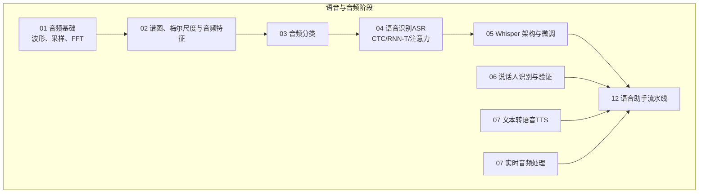
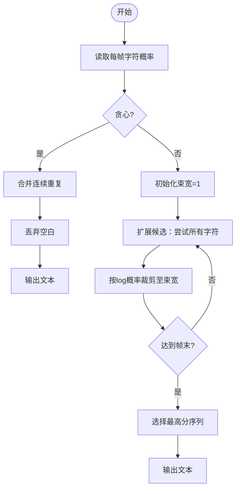
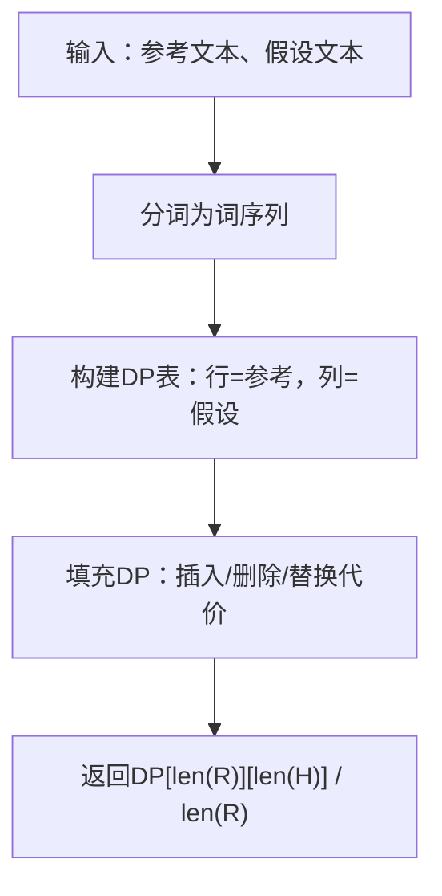
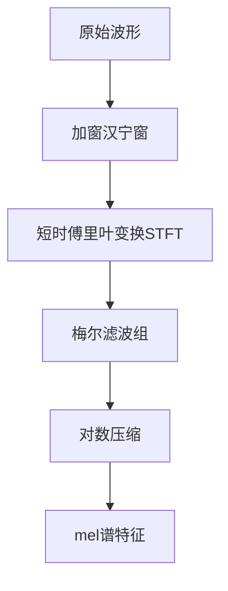
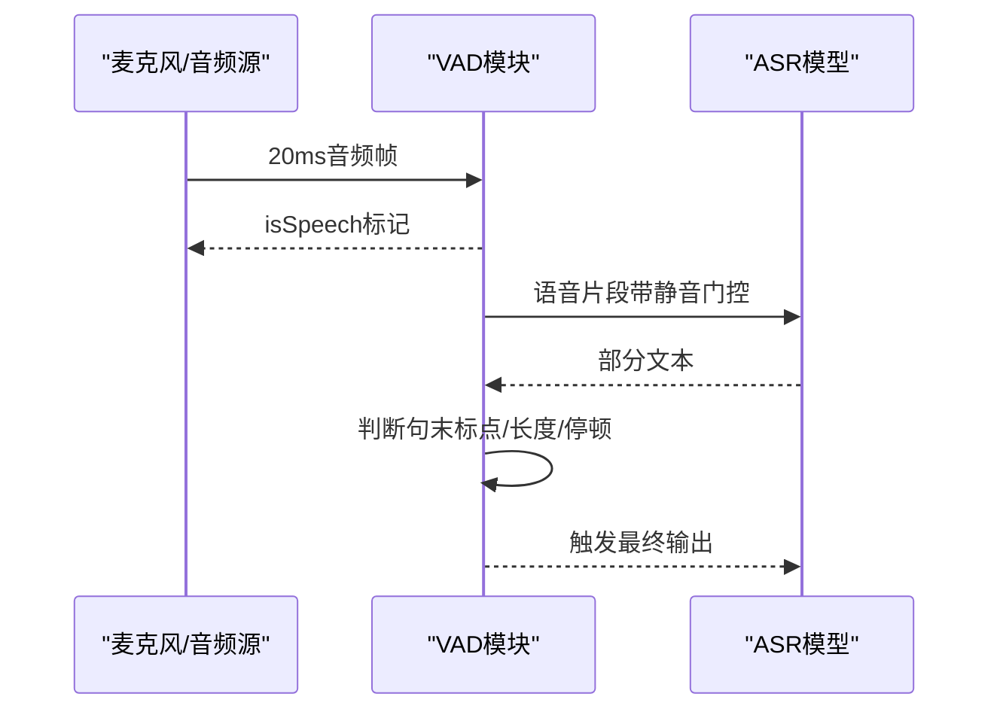
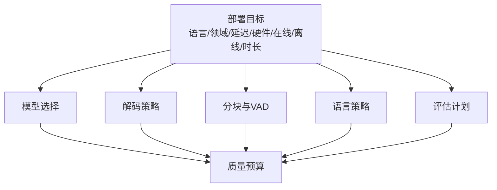

# 语音识别

<cite>
**本文引用的文件**
- [phases/06-speech-and-audio/04-speech-recognition-asr/docs/en.md](file://phases/06-speech-and-audio/04-speech-recognition-asr/docs/en.md)
- [phases/06-speech-and-audio/04-speech-recognition-asr/code/main.py](file://phases/06-speech-and-audio/04-speech-recognition-asr/code/main.py)
- [phases/06-speech-and-audio/04-speech-recognition-asr/outputs/skill-asr-picker.md](file://phases/06-speech-and-audio/04-speech-recognition-asr/outputs/skill-asr-picker.md)
- [site/figures-vision-speech.js](file://site/figures-vision-speech.js)
- [phases/19-capstone-projects/03-realtime-voice-assistant/code/ts/src/vad.ts](file://phases/19-capstone-projects/03-realtime-voice-assistant/code/ts/src/vad.ts)
- [phases/19-capstone-projects/03-realtime-voice-assistant/code/ts/tests/vad.test.ts](file://phases/19-capstone-projects/03-realtime-voice-assistant/code/ts/tests/vad.test.ts)
- [README.md](file://README.md)
- [site/data.js](file://site/data.js)
</cite>

## 目录
1. [引言](#引言)
2. [项目结构](#项目结构)
3. [核心组件](#核心组件)
4. [架构总览](#架构总览)
5. [详细组件分析](#详细组件分析)
6. [依赖分析](#依赖分析)
7. [性能考虑](#性能考虑)
8. [故障排查指南](#故障排查指南)
9. [结论](#结论)
10. [附录](#附录)

## 引言
本课程围绕自动语音识别（ASR）系统展开，系统讲解端到端模型与传统HMM-DNN架构的对比；阐明声学模型、语言模型、发音词典在现代ASR中的作用与实现方式；提供从零实现轻量级ASR的关键步骤：音频预处理、特征提取、CTC损失与解码、词错率（WER）评估；并覆盖实时语音识别的挑战与优化（延迟、内存、并发），以及多语言、方言、噪声鲁棒性的进阶主题。课程配套实战代码与可视化图示，帮助读者建立“可运行”的ASR知识体系。

## 项目结构
本仓库中与语音识别直接相关的内容集中在“语音与音频”阶段，其中第04课“语音识别（ASR）”提供了理论与实践的完整材料，包含：
- 文档：阐述三种主流ASR公式（CTC、RNN-T、注意力编码器-解码器）、WER指标、模型选型建议与常见陷阱
- 代码：最小可运行示例（手写CTC输出、贪心与束搜索解码、WER计算）
- 技能输出：面向部署场景的“ASR选型器”，指导模型、解码策略、分块与LM融合

此外，实时语音助手项目展示了VAD（语音活动检测）在端到端流水线中的关键作用，为实时ASR提供静音门控与流式边界判定。

图表来源
- [README.md:421-443](file://README.md#L421-L443)

章节来源
- [README.md:421-443](file://README.md#L421-L443)

## 核心组件
- 声学模型（Acoustic Model）
  - 将输入音频帧映射为每个时间步的字符/子词概率分布；在端到端ASR中通常由卷积/Transformer编码器完成
  - 在CTC框架下，输出额外的“空白”类别用于对齐与去重
- 语言模型（Language Model）
  - 提供词/子词序列的先验概率，改善解码质量；常通过外部LM与束搜索融合，或在RNN-T中内嵌
- 发音词典（Pronunciation Lexicon）
  - 将词汇映射为音素序列，辅助拼写-发音规则与多语种/方言建模
- 解码器（Decoder）
  - 贪心解码（CTC）：逐帧取最大，合并重复并丢弃空白
  - 束搜索（Beam Search）：维护多个候选序列，结合LM权重提升正确率
- 评估指标（WER）
  - 字词编辑距离的标准化度量，是ASR质量的“一维指标”
- 特征与预处理
  - 短时傅里叶变换（STFT）、汉宁窗、梅尔滤波组、对数压缩，形成稳定的mel谱输入
- 实时与流式
  - VAD静音门控、分块与步长、跨注意力裁剪、状态传递

章节来源
- [phases/06-speech-and-audio/04-speech-recognition-asr/docs/en.md:10-50](file://phases/06-speech-and-audio/04-speech-recognition-asr/docs/en.md#L10-L50)
- [phases/06-speech-and-audio/04-speech-recognition-asr/docs/en.md:38-49](file://phases/06-speech-and-audio/04-speech-recognition-asr/docs/en.md#L38-L49)

## 架构总览
下图展示现代端到端ASR的典型数据流：输入音频经特征提取后进入编码器，输出每帧的字符/子词分布；在CTC模式下，通过贪心或束搜索解码得到最终文本；同时可引入外部语言模型进行融合；评估阶段使用WER等指标衡量质量。

图表来源
- [phases/06-speech-and-audio/04-speech-recognition-asr/docs/en.md:14-37](file://phases/06-speech-and-audio/04-speech-recognition-asr/docs/en.md#L14-L37)
- [phases/06-speech-and-audio/04-speech-recognition-asr/code/main.py:16-47](file://phases/06-speech-and-audio/04-speech-recognition-asr/code/main.py#L16-L47)

## 详细组件分析

### 组件A：CTC解码（贪心与束搜索）
- 贪心解码
  - 规则：逐帧取最大索引，相邻重复合并，丢弃空白
  - 优点：非自回归、零前瞻、速度快
  - 局限：忽略帧间条件依赖，需外置LM或浅融合
- 束搜索解码
  - 维护若干候选序列，按log概率排序，逐步扩展
  - 可加入空白/非空白状态，正确处理重复字符
  - 生产环境常配合前缀树与LM权重

图表来源
- [phases/06-speech-and-audio/04-speech-recognition-asr/code/main.py:16-47](file://phases/06-speech-and-audio/04-speech-recognition-asr/code/main.py#L16-L47)

章节来源
- [phases/06-speech-and-audio/04-speech-recognition-asr/docs/en.md:53-88](file://phases/06-speech-and-audio/04-speech-recognition-asr/docs/en.md#L53-L88)
- [phases/06-speech-and-audio/04-speech-recognition-asr/code/main.py:16-47](file://phases/06-speech-and-audio/04-speech-recognition-asr/code/main.py#L16-L47)

### 组件B：WER评估
- 计算参考与假设之间的编辑距离，归一化为字词级错误率
- 适合离线评测，是ASR质量的“一维指标”

图表来源
- [phases/06-speech-and-audio/04-speech-recognition-asr/code/main.py:50-65](file://phases/06-speech-and-audio/04-speech-recognition-asr/code/main.py#L50-L65)

章节来源
- [phases/06-speech-and-audio/04-speech-recognition-asr/docs/en.md:38-49](file://phases/06-speech-and-audio/04-speech-recognition-asr/docs/en.md#L38-L49)
- [phases/06-speech-and-audio/04-speech-recognition-asr/code/main.py:50-65](file://phases/06-speech-and-audio/04-speech-recognition-asr/code/main.py#L50-L65)

### 组件C：特征提取与梅尔尺度
- STFT与汉宁窗：将时域信号切片并加窗
- 梅尔滤波组：将频率轴映射到感知尺度，突出人类听觉敏感区域
- 对数压缩：稳定动态范围，适配神经网络

图表来源
- [site/figures-vision-speech.js:282-386](file://site/figures-vision-speech.js#L282-L386)

章节来源
- [site/figures-vision-speech.js:282-386](file://site/figures-vision-speech.js#L282-L386)

### 组件D：实时语音识别中的VAD与流式边界
- VAD（语音活动检测）：在静音段抑制ASR，降低幻觉风险
- 流式边界：基于停顿、标点或统计阈值判断用户话语结束，触发ASR输出
- 本仓库提供了VAD相关工具与单元测试，演示了20ms帧的时间戳与静音/语音标记

图表来源
- [phases/19-capstone-projects/03-realtime-voice-assistant/code/ts/src/vad.ts:1-37](file://phases/19-capstone-projects/03-realtime-voice-assistant/code/ts/src/vad.ts#L1-L37)
- [phases/19-capstone-projects/03-realtime-voice-assistant/code/ts/tests/vad.test.ts:1-40](file://phases/19-capstone-projects/03-realtime-voice-assistant/code/ts/tests/vad.test.ts#L1-L40)

章节来源
- [phases/19-capstone-projects/03-realtime-voice-assistant/code/ts/src/vad.ts:1-37](file://phases/19-capstone-projects/03-realtime-voice-assistant/code/ts/src/vad.ts#L1-L37)
- [phases/19-capstone-projects/03-realtime-voice-assistant/code/ts/tests/vad.test.ts:1-40](file://phases/19-capstone-projects/03-realtime-voice-assistant/code/ts/tests/vad.test.ts#L1-L40)

### 组件E：从零实现轻量级ASR（步骤清单）
- 步骤1：音频预处理与特征提取
  - 使用STFT与汉宁窗，构建梅尔谱；归一化至标准范围
- 步骤2：声学模型输出
  - 编码器输出每帧的字符/子词分布（含空白）
- 步骤3：CTC解码
  - 贪心解码：合并重复、丢弃空白
  - 束搜索：维护候选序列，按log概率裁剪，必要时引入LM权重
- 步骤4：评估
  - 计算WER，报告规范化后的字词级错误率
- 步骤5：部署与优化
  - 选择模型（如Whisper、Parakeet、wav2vec 2.0）与解码策略
  - 分块与步长（chunk/stride）控制延迟与吞吐
  - VAD静音门控，避免静音段幻觉

章节来源
- [phases/06-speech-and-audio/04-speech-recognition-asr/docs/en.md:51-132](file://phases/06-speech-and-audio/04-speech-recognition-asr/docs/en.md#L51-L132)
- [phases/06-speech-and-audio/04-speech-recognition-asr/code/main.py:16-65](file://phases/06-speech-and-audio/04-speech-recognition-asr/code/main.py#L16-L65)

## 依赖分析
- 模型选型与部署建议
  - 英语离线最高质量：Whisper-large-v3-turbo
  - 多语言鲁棒：SeamlessM4T v2
  - 流式低延迟：Parakeet-TDT-1.1B 或 Riva
  - 边缘移动端：<500ms延迟：Whisper-Tiny量化或Moonshine（2024）
  - 长文本：Whisper + VAD分块（WhisperX）
  - 领域特定：wav2vec 2.0 + 领域LM融合
- 常见陷阱
  - 无VAD：静音段易产生幻觉
  - 字符/单词/子词WER：统一报告单词级且做大小写与标点归一化
  - 语言ID漂移：在已知语言场景强制指定language参数
  - 长片段未分块：Whisper有约30秒窗口，需设置chunk_length_s与stride

图表来源
- [phases/06-speech-and-audio/04-speech-recognition-asr/docs/en.md:133-152](file://phases/06-speech-and-audio/04-speech-recognition-asr/docs/en.md#L133-L152)

章节来源
- [phases/06-speech-and-audio/04-speech-recognition-asr/docs/en.md:133-152](file://phases/06-speech-and-audio/04-speech-recognition-asr/docs/en.md#L133-L152)

## 性能考虑
- 延迟优化
  - 流式ASR：限制注意力范围（如chunked Whisper-Streaming），使用分块与步长
  - 解码策略：束搜索宽度与LM权重权衡速度与准确率
- 内存管理
  - 分块编码器注意力，保留必要的上下文状态
  - 量化与蒸馏（如Tiny/Flash）降低显存占用
- 并发处理
  - 多路音频分块并发解码，VAD并行检测
  - 批量推理与流水线调度，避免GPU/CPU瓶颈
- 特征稳定性
  - STFT窗口与步长、梅尔滤波组参数影响时频分辨率与延迟
- 评估与基准
  - 使用标准数据集（如LibriSpeech）计算WER，记录不同模型与配置下的吞吐与延迟

## 故障排查指南
- 幻觉问题
  - 症状：静音段输出文本
  - 处理：启用VAD静音门控，仅在语音活动时触发ASR
- 语言漂移
  - 症状：在噪声或非目标语言场景误判语言ID
  - 处理：明确指定language参数，避免自动语言ID
- 长文本越界
  - 症状：超长音频报错或截断
  - 处理：设置chunk_length_s与stride，分块处理
- 解码质量差
  - 症状：贪心解码退化，束搜索过窄或无LM融合
  - 处理：增大束宽，引入LM权重，使用前缀树束搜索

章节来源
- [phases/06-speech-and-audio/04-speech-recognition-asr/docs/en.md:146-152](file://phases/06-speech-and-audio/04-speech-recognition-asr/docs/en.md#L146-L152)
- [phases/19-capstone-projects/03-realtime-voice-assistant/code/ts/src/vad.ts:1-37](file://phases/19-capstone-projects/03-realtime-voice-assistant/code/ts/src/vad.ts#L1-L37)

## 结论
本课程以“从零实现轻量级ASR”为主线，串联起特征提取、声学模型、CTC解码与WER评估，并结合实时语音助手中的VAD与流式边界，给出可落地的工程实践路径。通过模型选型与部署建议、性能优化与故障排查，帮助读者在真实场景中快速搭建高质量、低延迟的ASR系统。

## 附录
- 相关技能与课程导航
  - ASR选型器：根据部署目标输出模型、解码策略、分块与LM融合建议
  - 语音助手架构：端到端语音助手的技术栈规格与可观测性
  - 实时音频处理：延迟预算、并发与缓存策略

章节来源
- [phases/06-speech-and-audio/04-speech-recognition-asr/outputs/skill-asr-picker.md:1-19](file://phases/06-speech-and-audio/04-speech-recognition-asr/outputs/skill-asr-picker.md#L1-L19)
- [site/data.js:8850-8877](file://site/data.js#L8850-L8877)
- [site/data.js:9088-9099](file://site/data.js#L9088-L9099)