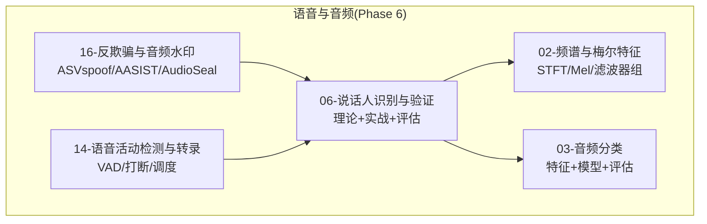
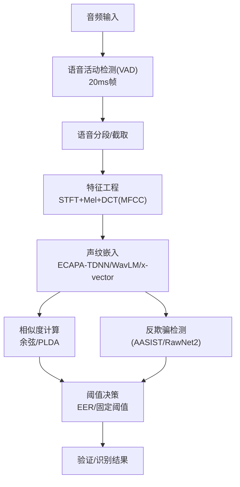
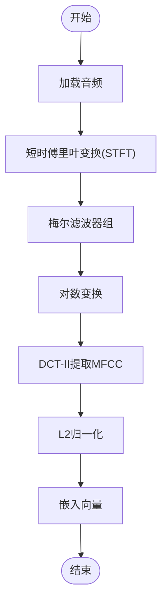
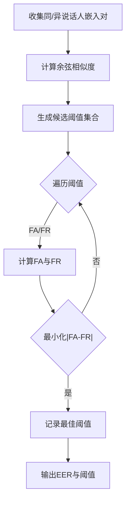
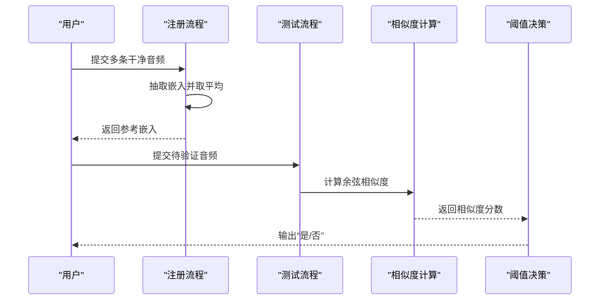
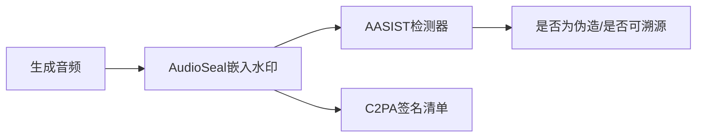
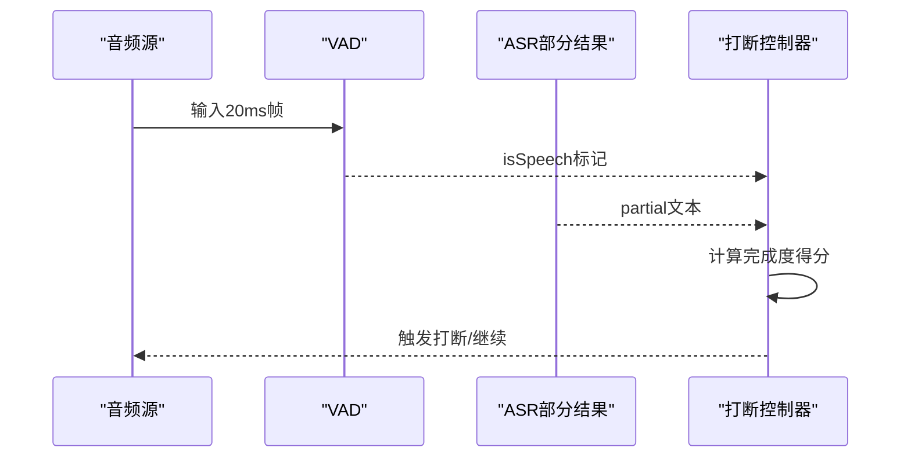
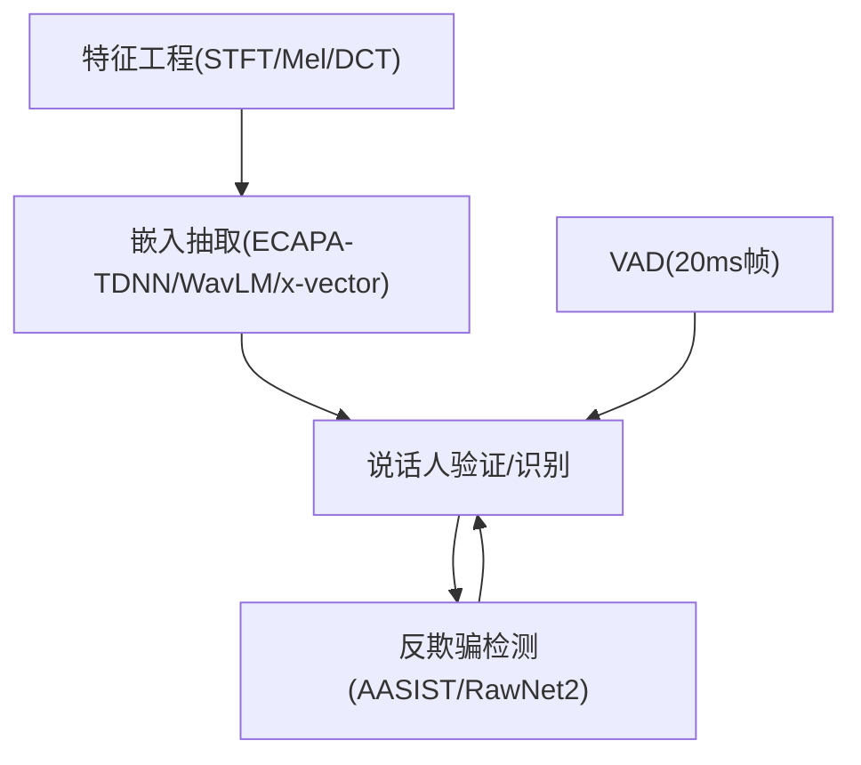

# 说话人识别与验证

<cite>
**本文引用的文件**
- [phases/06-speech-and-audio/06-speaker-recognition-verification/docs/en.md](file://phases/06-speech-and-audio/06-speaker-recognition-verification/docs/en.md)
- [phases/06-speech-and-audio/06-speaker-recognition-verification/docs/zh.md](file://phases/06-speech-and-audio/06-speaker-recognition-verification/docs/zh.md)
- [phases/06-speech-and-audio/06-speaker-recognition-verification/code/main.py](file://phases/06-speech-and-audio/06-speaker-recognition-verification/code/main.py)
- [phases/06-speech-and-audio/06-speaker-recognition-verification/outputs/skill-speaker-verifier.md](file://phases/06-speech-and-audio/06-speaker-recognition-verification/outputs/skill-speaker-verifier.md)
- [phases/06-speech-and-audio/16-anti-spoofing-audio-watermarking/docs/en.md](file://phases/06-speech-and-audio/16-anti-spoofing-audio-watermarking/docs/en.md)
- [phases/06-speech-and-audio/16-anti-spoofing-audio-watermarking/docs/zh.md](file://phases/06-speech-and-audio/16-anti-spoofing-audio-watermarking/docs/zh.md)
- [site/figures-vision-speech.js](file://site/figures-vision-speech.js)
- [phases/06-speech-and-audio/14-voice-activity-detection-turn-taking/docs/en.md](file://phases/06-speech-and-audio/14-voice-activity-detection-turn-taking/docs/en.md)
- [phases/06-speech-and-audio/14-voice-activity-detection-turn-taking/docs/zh.md](file://phases/06-speech-and-audio/14-voice-activity-detection-turn-taking/docs/zh.md)
- [phases/19-capstone-projects/03-realtime-voice-assistant/code/main.py](file://phases/19-capstone-projects/03-realtime-voice-assistant/code/main.py)
- [phases/19-capstone-projects/03-realtime-voice-assistant/code/ts/tests/vad.test.ts](file://phases/19-capstone-projects/03-realtime-voice-assistant/code/ts/tests/vad.test.ts)
- [phases/06-speech-and-audio/02-spectrograms-mel-features/docs/en.md](file://phases/06-speech-and-audio/02-spectrograms-mel-features/docs/en.md)
- [phases/06-speech-and-audio/02-spectrograms-mel-features/docs/zh.md](file://phases/06-speech-and-audio/02-spectrograms-mel-features/docs/zh.md)
- [phases/06-speech-and-audio/03-audio-classification/docs/en.md](file://phases/06-speech-and-audio/03-audio-classification/docs/en.md)
- [phases/06-speech-and-audio/03-audio-classification/docs/zh.md](file://phases/06-speech-and-audio/03-audio-classification/docs/zh.md)
- [README.md](file://README.md)
</cite>

## 目录
1. [引言](#引言)
2. [项目结构](#项目结构)
3. [核心组件](#核心组件)
4. [架构总览](#架构总览)
5. [详细组件分析](#详细组件分析)
6. [依赖关系分析](#依赖关系分析)
7. [性能考量](#性能考量)
8. [故障排查指南](#故障排查指南)
9. [结论](#结论)
10. [附录](#附录)

## 引言
本课程围绕“说话人识别与验证”展开，系统讲解从特征提取、声纹嵌入、相似度计算到阈值设定与系统评估的完整链路。课程覆盖两类典型任务：1:1 说话人验证（确认）与 1:N 说话人识别（查找），并结合 2026 年主流深度架构（ECAPA-TDNN、WavLM、x-vector）与反欺骗（ASVspoof、AASIST、AudioSeal）实践，帮助读者从零构建端到端的说话人验证系统。

## 项目结构
本仓库中与“说话人识别与验证”直接相关的核心资源集中在 Phase 6 的“语音与音频”模块，具体包括：
- 说话人识别与验证（含理论、流程、评估与实战示例）
- 反欺骗与音频水印（含 ASVspoof 基准、AASIST、AudioSeal）
- 语音活动检测与转录（VAD、转写、打断调度）
- 频谱与梅尔特征工程（MFCC、STFT、滤波器组）
- 语音分类与基础音频处理

图表来源
- [README.md:421-443](file://README.md#L421-L443)

章节来源
- [README.md:421-443](file://README.md#L421-L443)

## 核心组件
- 特征工程与声纹嵌入
  - 采用梅尔频谱与DCT系数（MFCC统计）构造低维嵌入向量，支持L2归一化，便于余弦相似度计算。
  - 支持使用 SpeechBrain 的 ECAPA-TDNN 嵌入器进行生产级嵌入抽取。
- 相似度与阈值决策
  - 余弦相似度作为基础打分；通过阈值判断是否为同一说话人。
  - EER（等错误率）用于自动确定最优阈值，兼顾“拒真率”与“受骗率”的平衡。
- 说话人验证与识别
  - 验证（Verification，1:1）：注册多个干净样本取平均得到参考嵌入，测试样本与之对比。
  - 识别（Identification，1:N）：对候选集合逐一比较，返回最高相似度说话人。
- 反欺骗与水印
  - 使用 AASIST/RawNet2 等检测器区分真实/伪造语音；使用 AudioSeal 对生成音频嵌入不可感知水印；结合 C2PA 提供溯源清单。
- 语音活动检测（VAD）与打断调度
  - 基于 20ms 帧的 VAD 判定，结合转写完成度与打断策略，支撑实时语音助手流水线。

章节来源
- [phases/06-speech-and-audio/06-speaker-recognition-verification/docs/en.md:10-51](file://phases/06-speech-and-audio/06-speaker-recognition-verification/docs/en.md#L10-L51)
- [phases/06-speech-and-audio/16-anti-spoofing-audio-watermarking/docs/en.md:10-72](file://phases/06-speech-and-audio/16-anti-spoofing-audio-watermarking/docs/en.md#L10-L72)
- [phases/06-speech-and-audio/14-voice-activity-detection-turn-taking/docs/en.md:1-120](file://phases/06-speech-and-audio/14-voice-activity-detection-turn-taking/docs/en.md#L1-L120)

## 架构总览
下图展示了从音频输入到最终决策的端到端流程，涵盖特征提取、嵌入抽取、相似度计算、阈值判定与反欺骗防护。

图表来源
- [phases/06-speech-and-audio/06-speaker-recognition-verification/docs/en.md:20-36](file://phases/06-speech-and-audio/06-speaker-recognition-verification/docs/en.md#L20-L36)
- [phases/06-speech-and-audio/16-anti-spoofing-audio-watermarking/docs/en.md:20-42](file://phases/06-speech-and-audio/16-anti-spoofing-audio-watermarking/docs/en.md#L20-L42)
- [phases/06-speech-and-audio/14-voice-activity-detection-turn-taking/docs/en.md:1-120](file://phases/06-speech-and-audio/14-voice-activity-detection-turn-taking/docs/en.md#L1-L120)

## 详细组件分析

### 组件A：特征工程与嵌入抽取
- 设计要点
  - STFT窗长/步长、汉宁窗、梅尔滤波器组、对数变换、DCT-II 提取 MFCC 统计量。
  - 嵌入抽取支持自实现（MFCC统计）与 SpeechBrain ECAPA-TDNN。
- 复杂度与性能
  - 特征工程主要瓶颈在 STFT 与滤波器组；DCT 为线性变换，整体近似 O(T·F)。
  - ECAPA-TDNN 嵌入维度小（如 192），便于在线相似度计算。
- 优化建议
  - 固定采样率与窗参数，批量化 STFT；对梅尔滤波器组做缓存复用；嵌入抽取使用半精度或量化以提升吞吐。

图表来源
- [phases/06-speech-and-audio/06-speaker-recognition-verification/code/main.py:95-101](file://phases/06-speech-and-audio/06-speaker-recognition-verification/code/main.py#L95-L101)
- [phases/06-speech-and-audio/06-speaker-recognition-verification/code/main.py:103-114](file://phases/06-speech-and-audio/06-speaker-recognition-verification/code/main.py#L103-L114)

章节来源
- [phases/06-speech-and-audio/06-speaker-recognition-verification/code/main.py:95-114](file://phases/06-speech-and-audio/06-speaker-recognition-verification/code/main.py#L95-L114)
- [phases/06-speech-and-audio/02-spectrograms-mel-features/docs/en.md:1167-1174](file://phases/06-speech-and-audio/02-spectrograms-mel-features/docs/en.md#L1167-L1174)

### 组件B：相似度计算与阈值设定
- 设计要点
  - 余弦相似度：对嵌入向量进行 L2 归一化后点积；也可扩展为 PLDA 似然比评分。
  - EER：穷举所有可能阈值，寻找 FA（拒真）与 FR（受骗）差距最小的阈值，作为最优决策阈值。
- 复杂度与性能
  - 验证阶段：O(D) 计算余弦；识别阶段：O(N·D) 对候选集评分。
  - EER：排序去重后遍历，复杂度 O(K log K)，K 为分数数量。
- 优化建议
  - 使用向量化运算（如 NumPy/Torch）加速余弦；对候选集做索引或近邻检索（ANN）降低复杂度。

图表来源
- [phases/06-speech-and-audio/06-speaker-recognition-verification/code/main.py:117-132](file://phases/06-speech-and-audio/06-speaker-recognition-verification/code/main.py#L117-L132)

章节来源
- [phases/06-speech-and-audio/06-speaker-recognition-verification/code/main.py:117-132](file://phases/06-speech-and-audio/06-speaker-recognition-verification/code/main.py#L117-L132)

### 组件C：验证（1:1）与识别（1:N）
- 验证（Verification，1:1）
  - 注册：对多个干净样本抽取嵌入并取平均，形成参考向量。
  - 测试：对测试样本计算相似度，与阈值比较得出“是/否”。
- 识别（Identification，1:N）
  - 对候选集合逐一计算相似度，返回最高分说话人；或对所有候选做 Top-K 排序。
- 差异与权衡
  - 验证侧重“拒假”，识别侧重“召回”；识别需考虑开集（未知说话人）与阈值裁剪。

图表来源
- [phases/06-speech-and-audio/06-speaker-recognition-verification/docs/en.md:100-111](file://phases/06-speech-and-audio/06-speaker-recognition-verification/docs/en.md#L100-L111)

章节来源
- [phases/06-speech-and-audio/06-speaker-recognition-verification/docs/en.md:100-111](file://phases/06-speech-and-audio/06-speaker-recognition-verification/docs/en.md#L100-L111)

### 组件D：反欺骗与水印（ASVspoof/AASIST/AudioSeal）
- 检测（AASIST/RawNet2）
  - 面向 ASVspoof 基准（LA/2019、ASVspoof 5），区分真实/伪造语音；需在目标域校准阈值。
- 水印（AudioSeal/WaveVerify）
  - 在生成音频中嵌入不可感知水印，具备鲁棒性与高速检测能力；WaveVerify 针对时域篡改增强。
- 溯源（C2PA）
  - 通过加密签名的元数据清单提供创作信息，配合水印形成“感知+密码学”双重防护。

图表来源
- [phases/06-speech-and-audio/16-anti-spoofing-audio-watermarking/docs/en.md:20-72](file://phases/06-speech-and-audio/16-anti-spoofing-audio-watermarking/docs/en.md#L20-L72)
- [phases/06-speech-and-audio/16-anti-spoofing-audio-watermarking/docs/en.md:117-143](file://phases/06-speech-and-audio/16-anti-spoofing-audio-watermarking/docs/en.md#L117-L143)

章节来源
- [phases/06-speech-and-audio/16-anti-spoofing-audio-watermarking/docs/en.md:117-143](file://phases/06-speech-and-audio/16-anti-spoofing-audio-watermarking/docs/en.md#L117-L143)

### 组件E：语音活动检测（VAD）与打断调度
- 设计要点
  - 以 20ms 为单位的音频帧流，VAD 判定静音/语音；结合 ASR 部分结果与完成度启发式，决定打断时机。
- 实现参考
  - Python 示例模拟了帧结构、合成语音序列与时间戳单调性；TypeScript 测试覆盖了完成度评分与帧序列特性。

图表来源
- [phases/19-capstone-projects/03-realtime-voice-assistant/code/main.py:25-71](file://phases/19-capstone-projects/03-realtime-voice-assistant/code/main.py#L25-L71)
- [phases/19-capstone-projects/03-realtime-voice-assistant/code/ts/tests/vad.test.ts:5-40](file://phases/19-capstone-projects/03-realtime-voice-assistant/code/ts/tests/vad.test.ts#L5-L40)

章节来源
- [phases/19-capstone-projects/03-realtime-voice-assistant/code/main.py:25-71](file://phases/19-capstone-projects/03-realtime-voice-assistant/code/main.py#L25-L71)
- [phases/19-capstone-projects/03-realtime-voice-assistant/code/ts/tests/vad.test.ts:5-40](file://phases/19-capstone-projects/03-realtime-voice-assistant/code/ts/tests/vad.test.ts#L5-L40)

## 依赖关系分析
- 模块内依赖
  - 说话人识别依赖特征工程（STFT/Mel/DCT）与嵌入抽取（ECAPA-TDNN/WavLM/x-vector）。
  - 反欺骗与水印依赖检测器与水印生成器，二者共同构成“感知+密码学”双防线。
  - VAD 为上游输入，驱动后续的验证/识别与打断控制。
- 外部依赖
  - SpeechBrain 提供 ECAPA-TDNN 嵌入抽取与相似度接口。
  - ASVspoof 数据集与 AASIST/RawNet2 模型用于检测器训练与评估。
  - AudioSeal/WaveVerify 提供水印嵌入与检测能力。

图表来源
- [phases/06-speech-and-audio/06-speaker-recognition-verification/docs/en.md:98-111](file://phases/06-speech-and-audio/06-speaker-recognition-verification/docs/en.md#L98-L111)
- [phases/06-speech-and-audio/16-anti-spoofing-audio-watermarking/docs/en.md:131-143](file://phases/06-speech-and-audio/16-anti-spoofing-audio-watermarking/docs/en.md#L131-L143)

章节来源
- [phases/06-speech-and-audio/06-speaker-recognition-verification/docs/en.md:98-111](file://phases/06-speech-and-audio/06-speaker-recognition-verification/docs/en.md#L98-L111)
- [phases/06-speech-and-audio/16-anti-spoofing-audio-watermarking/docs/en.md:131-143](file://phases/06-speech-and-audio/16-anti-spoofing-audio-watermarking/docs/en.md#L131-L143)

## 性能考量
- 计算效率
  - 特征工程与嵌入抽取可批量化与向量化；嵌入维度（如 192/256）小，相似度计算成本低。
  - 在边缘设备优先选择轻量模型（如 x-vector/ECAPA-TDNN），云端可选更高精度模型（WavLM-SV）。
- 评估指标
  - EER 为核心指标；跨域评估需进行阈值校准与分数归一化（AS-norm）。
- 时延与吞吐
  - VAD 与 ASR 部分结果需低延迟反馈；嵌入抽取与相似度可在后台批量处理以提升吞吐。

## 故障排查指南
- 常见问题
  - 信道不匹配：在不同设备/渠道采集的数据上评估与部署，需在目标域重新校准阈值。
  - 短语音：测试时长不足会导致 EER 显著恶化，建议≥3秒。
  - 注册噪声：单条噪声样本会污染参考向量，应使用≥3条干净样本并取平均。
  - 固定阈值：跨条件使用固定阈值会引入偏差，应在目标域开发集上调优。
  - 未归一化嵌入：余弦相似度对幅度敏感，需先 L2 归一化。
- 反欺骗
  - 水印未检测：必须在 CI 中集成检测器；检测器需在目标域校准。
  - 音高偏移：音高修改常导致水印失效，需以检测器作为后备。
  - 元数据剥离：C2PA 可被重新编码剥离，需与水印协同部署。

章节来源
- [phases/06-speech-and-audio/06-speaker-recognition-verification/docs/en.md:135-142](file://phases/06-speech-and-audio/06-speaker-recognition-verification/docs/en.md#L135-L142)
- [phases/06-speech-and-audio/16-anti-spoofing-audio-watermarking/docs/en.md:155-162](file://phases/06-speech-and-audio/16-anti-spoofing-audio-watermarking/docs/en.md#L155-L162)

## 结论
本课程提供了从特征工程到嵌入抽取、从相似度计算到阈值设定的完整链路，并结合 2026 年主流模型与反欺骗实践，帮助读者构建稳健、可评估且可扩展的说话人验证系统。验证与识别在阈值与评估策略上存在差异，反欺骗与水印则构成了面向真实世界的“感知+密码学”双防线。

## 附录
- 术语速查
  - EER：等错误率，用于自动阈值选择。
  - Verification：1:1 验证（确认）。
  - Identification：1:N 识别（查找）。
  - PLDA：概率线性判别分析，用于似然比评分。
  - DER：说话人日志错误率，衡量多说话人场景下的边界平滑与聚类质量。
- 学习路径建议
  - 先掌握频谱与梅尔特征工程，再进入嵌入抽取与相似度计算。
  - 通过实战脚本理解 EER 与阈值调优过程。
  - 结合反欺骗与水印，形成端到端的生产级方案。

章节来源
- [phases/06-speech-and-audio/06-speaker-recognition-verification/docs/en.md:153-173](file://phases/06-speech-and-audio/06-speaker-recognition-verification/docs/en.md#L153-L173)
- [phases/06-speech-and-audio/16-anti-spoofing-audio-watermarking/docs/en.md:173-193](file://phases/06-speech-and-audio/16-anti-spoofing-audio-watermarking/docs/en.md#L173-L193)