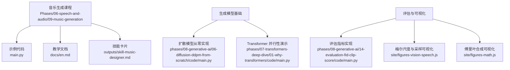
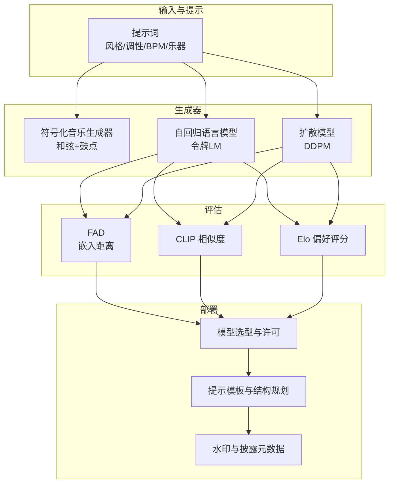
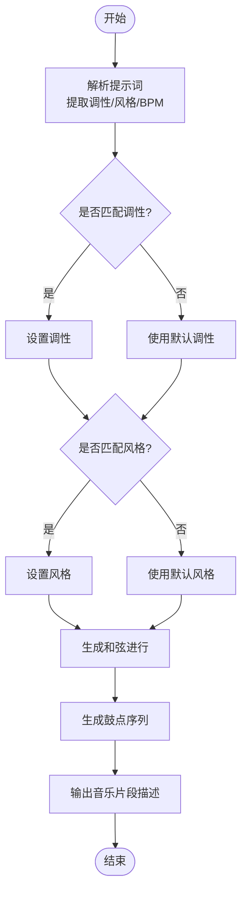
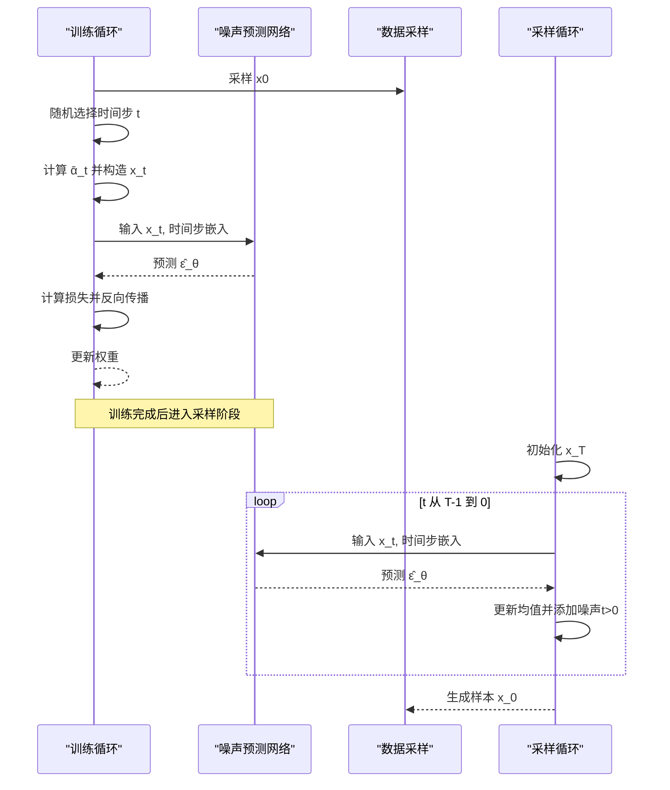
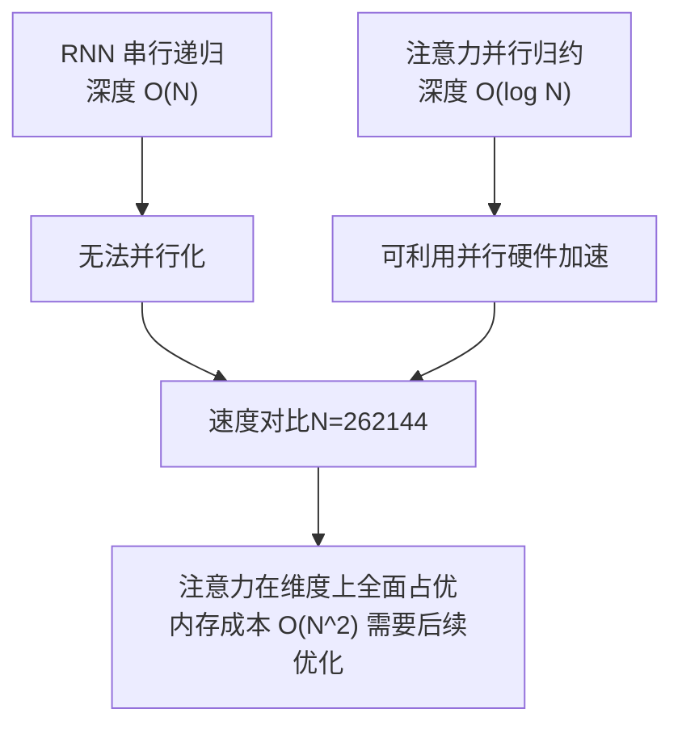
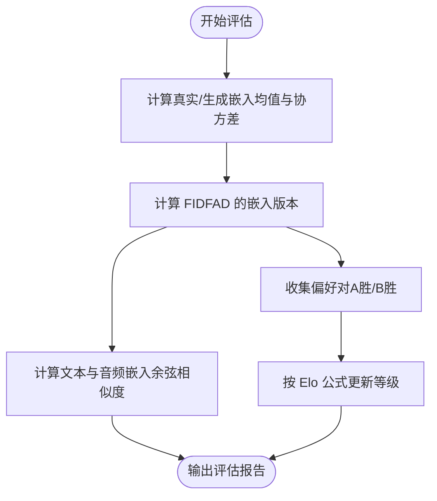
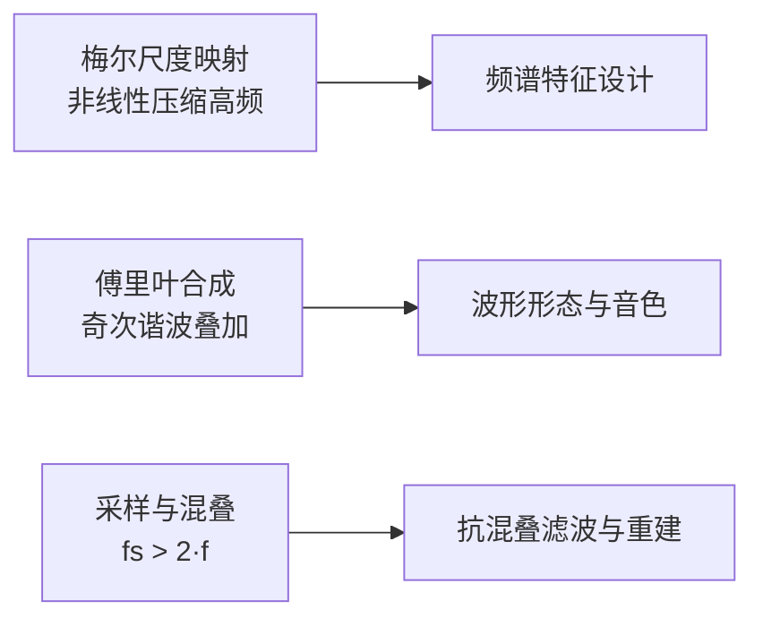
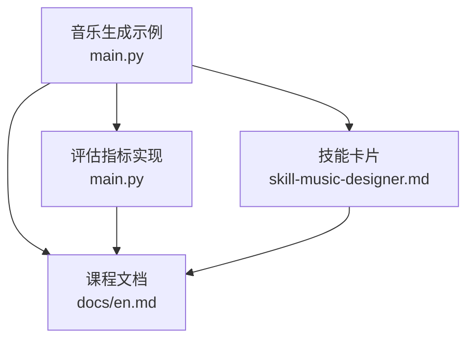

# 音乐生成

<cite>
**本文引用的文件**
- [phases/06-speech-and-audio/09-music-generation/code/main.py](file://phases/06-speech-and-audio/09-music-generation/code/main.py)
- [phases/06-speech-and-audio/09-music-generation/docs/en.md](file://phases/06-speech-and-audio/09-music-generation/docs/en.md)
- [phases/06-speech-and-audio/09-music-generation/outputs/skill-music-designer.md](file://phases/06-speech-and-audio/09-music-generation/outputs/skill-music-designer.md)
- [phases/08-generative-ai/06-diffusion-ddpm-from-scratch/code/main.py](file://phases/08-generative-ai/06-diffusion-ddpm-from-scratch/code/main.py)
- [phases/07-transformers-deep-dive/01-why-transformers/code/main.py](file://phases/07-transformers-deep-dive/01-why-transformers/code/main.py)
- [phases/08-generative-ai/14-evaluation-fid-clip-score/code/main.py](file://phases/08-generative-ai/14-evaluation-fid-clip-score/code/main.py)
- [site/figures-vision-speech.js](file://site/figures-vision-speech.js)
- [site/figures-math.js](file://site/figures-math.js)
</cite>

## 目录
1. [引言](#引言)
2. [项目结构](#项目结构)
3. [核心组件](#核心组件)
4. [架构总览](#架构总览)
5. [详细组件分析](#详细组件分析)
6. [依赖关系分析](#依赖关系分析)
7. [性能考量](#性能考量)
8. [故障排查指南](#故障排查指南)
9. [结论](#结论)
10. [附录](#附录)

## 引言
本课程围绕“音乐生成”主题，系统讲解从基础理论到工程实践的关键路径：序列建模、和声理解、节奏控制、乐器分离、风格建模、先验约束融合、质量评估与创作辅助工具。课程以“符号化音乐生成”示例作为入门，随后引入基于深度学习的主流范式（自回归语言模型、扩散模型），并结合真实可运行的代码片段与可视化资源，帮助读者完成从零到一的音乐生成器构建。

## 项目结构
本仓库中与音乐生成直接相关的内容集中在“语音与音频”阶段的“音乐生成”课程，配套有：
- 示例代码：符号化音乐生成（和弦进行与鼓点模式）
- 教学文档：模型选型、流程、法律与合规要点
- 输出技能卡片：面向部署的模型选择与许可策略
- 扩散模型从零实现：噪声预测器与反向采样
- Transformer 深入：序列并行性优势演示
- 评估指标：Fréchet 音频距离（FAD）、CLIP 类相似度、Elo 偏好评分
- 可视化素材：梅尔尺度、傅里叶合成、采样与混叠等

**图表来源**
- [phases/06-speech-and-audio/09-music-generation/code/main.py:1-127](file://phases/06-speech-and-audio/09-music-generation/code/main.py#L1-L127)
- [phases/06-speech-and-audio/09-music-generation/docs/en.md:1-169](file://phases/06-speech-and-audio/09-music-generation/docs/en.md#L1-L169)
- [phases/06-speech-and-audio/09-music-generation/outputs/skill-music-designer.md:1-28](file://phases/06-speech-and-audio/09-music-generation/outputs/skill-music-designer.md#L1-L28)
- [phases/08-generative-ai/06-diffusion-ddpm-from-scratch/code/main.py:1-182](file://phases/08-generative-ai/06-diffusion-ddpm-from-scratch/code/main.py#L1-L182)
- [phases/07-transformers-deep-dive/01-why-transformers/code/main.py:1-111](file://phases/07-transformers-deep-dive/01-why-transformers/code/main.py#L1-L111)
- [phases/08-generative-ai/14-evaluation-fid-clip-score/code/main.py:1-147](file://phases/08-generative-ai/14-evaluation-fid-clip-score/code/main.py#L1-L147)
- [site/figures-vision-speech.js:307-386](file://site/figures-vision-speech.js#L307-L386)
- [site/figures-math.js:381-422](file://site/figures-math.js#L381-L422)

**章节来源**
- [phases/06-speech-and-audio/09-music-generation/code/main.py:1-127](file://phases/06-speech-and-audio/09-music-generation/code/main.py#L1-L127)
- [phases/06-speech-and-audio/09-music-generation/docs/en.md:1-169](file://phases/06-speech-and-audio/09-music-generation/docs/en.md#L1-L169)
- [phases/06-speech-and-audio/09-music-generation/outputs/skill-music-designer.md:1-28](file://phases/06-speech-and-audio/09-music-generation/outputs/skill-music-designer.md#L1-L28)

## 核心组件
- 符号化音乐生成器：根据提示词解析调性、节拍、风格，生成和弦进行与鼓点序列。
- 评估指标实现：FAD（嵌入分布距离）、CLIP 类相似度、Elo 偏好评分。
- 扩散模型最小实现：噪声预测网络、时间步嵌入、前向加噪与反向采样链。
- Transformer 并行性演示：对比 RNN 串行深度与注意力并行扫描的优势。
- 可视化素材：梅尔尺度映射、傅里叶合成、采样与混叠。

**章节来源**
- [phases/06-speech-and-audio/09-music-generation/code/main.py:14-80](file://phases/06-speech-and-audio/09-music-generation/code/main.py#L14-L80)
- [phases/08-generative-ai/14-evaluation-fid-clip-score/code/main.py:73-96](file://phases/08-generative-ai/14-evaluation-fid-clip-score/code/main.py#L73-L96)
- [phases/08-generative-ai/06-diffusion-ddpm-from-scratch/code/main.py:5-139](file://phases/08-generative-ai/06-diffusion-ddpm-from-scratch/code/main.py#L5-L139)
- [phases/07-transformers-deep-dive/01-why-transformers/code/main.py:11-76](file://phases/07-transformers-deep-dive/01-why-transformers/code/main.py#L11-L76)
- [site/figures-vision-speech.js:307-386](file://site/figures-vision-speech.js#L307-L386)
- [site/figures-math.js:381-422](file://site/figures-math.js#L381-L422)

## 架构总览
课程采用“概念—实现—评估—部署”的闭环路径：
- 概念：符号化音乐生成（和弦/鼓点）作为“令牌在时间上”的直观示意。
- 实现：自回归语言模型（音乐令牌）与扩散模型（直接波形或潜在空间）两条主干。
- 评估：FAD、CLIP 相似度、人类偏好（Elo）三类指标互补。
- 部署：模型选型、许可策略、长度与结构规划、提示规范、披露与元数据。

**图表来源**
- [phases/06-speech-and-audio/09-music-generation/code/main.py:51-79](file://phases/06-speech-and-audio/09-music-generation/code/main.py#L51-L79)
- [phases/08-generative-ai/06-diffusion-ddpm-from-scratch/code/main.py:112-139](file://phases/08-generative-ai/06-diffusion-ddpm-from-scratch/code/main.py#L112-L139)
- [phases/08-generative-ai/14-evaluation-fid-clip-score/code/main.py:73-96](file://phases/08-generative-ai/14-evaluation-fid-clip-score/code/main.py#L73-L96)
- [phases/06-speech-and-audio/09-music-generation/docs/en.md:45-57](file://phases/06-speech-and-audio/09-music-generation/docs/en.md#L45-L57)
- [phases/06-speech-and-audio/09-music-generation/outputs/skill-music-designer.md:10-18](file://phases/06-speech-and-audio/09-music-generation/outputs/skill-music-designer.md#L10-L18)

## 详细组件分析

### 符号化音乐生成器（和弦进行与鼓点）
该组件将自然语言提示解析为音乐结构：调性、风格、节拍、小节数，再生成和弦进行与鼓点序列。其核心逻辑包括：
- 解析调性与风格关键词，确定音阶与和弦进行模式
- 根据风格映射鼓点模板
- 将参数与序列输出为可回放格式

**图表来源**
- [phases/06-speech-and-audio/09-music-generation/code/main.py:14-79](file://phases/06-speech-and-audio/09-music-generation/code/main.py#L14-L79)

**章节来源**
- [phases/06-speech-and-audio/09-music-generation/code/main.py:38-79](file://phases/06-speech-and-audio/09-music-generation/code/main.py#L38-L79)
- [phases/06-speech-and-audio/09-music-generation/docs/en.md:71-120](file://phases/06-speech-and-audio/09-music-generation/docs/en.md#L71-L120)

### 自回归语言模型（令牌LM）与扩散模型（扩散DDPM）
- 自回归语言模型：以“令牌在时间上”建模，适合结构化音乐（如和声、节拍、乐器）。课程示例展示噪声预测网络、时间步嵌入、训练与采样流程。
- 扩散模型（DDPM）：通过逐步加噪与去噪过程学习数据分布，反向采样生成样本；课程示例以一维高斯混合为目标，演示噪声预测器与采样链。

**图表来源**
- [phases/08-generative-ai/06-diffusion-ddpm-from-scratch/code/main.py:112-139](file://phases/08-generative-ai/06-diffusion-ddpm-from-scratch/code/main.py#L112-L139)

**章节来源**
- [phases/08-generative-ai/06-diffusion-ddpm-from-scratch/code/main.py:5-139](file://phases/08-generative-ai/06-diffusion-ddpm-from-scratch/code/main.py#L5-L139)

### Transformer 序列并行性演示
该示例强调注意力的顺序无关归约能力，对比 RNN 的串行递归深度，说明注意力在并行计算上的优势。

**图表来源**
- [phases/07-transformers-deep-dive/01-why-transformers/code/main.py:72-106](file://phases/07-transformers-deep-dive/01-why-transformers/code/main.py#L72-L106)

**章节来源**
- [phases/07-transformers-deep-dive/01-why-transformers/code/main.py:11-106](file://phases/07-transformers-deep-dive/01-why-transformers/code/main.py#L11-L106)

### 评估指标实现（FAD、CLIP 相似度、Elo）
- FAD：计算真实与生成音频嵌入的均值与协方差差异，用于衡量分布相似性。
- CLIP 相似度：余弦相似度衡量文本与音频嵌入的对齐程度。
- Elo：基于偏好对的等级更新，聚合人类偏好结果。

**图表来源**
- [phases/08-generative-ai/14-evaluation-fid-clip-score/code/main.py:73-139](file://phases/08-generative-ai/14-evaluation-fid-clip-score/code/main.py#L73-L139)

**章节来源**
- [phases/08-generative-ai/14-evaluation-fid-clip-score/code/main.py:5-147](file://phases/08-generative-ai/14-evaluation-fid-clip-score/code/main.py#L5-L147)

### 可视化与先验知识
- 梅尔尺度：强调高频压缩特性，指导频谱特征设计与感知一致性。
- 傅里叶合成：展示谐波叠加形成不同波形，体现音乐信号的谐波结构。
- 采样与混叠：Nyquist 定理与抗混叠滤波的重要性。

**图表来源**
- [site/figures-vision-speech.js:307-386](file://site/figures-vision-speech.js#L307-L386)
- [site/figures-math.js:381-422](file://site/figures-math.js#L381-L422)

**章节来源**
- [site/figures-vision-speech.js:307-386](file://site/figures-vision-speech.js#L307-L386)
- [site/figures-math.js:381-422](file://site/figures-math.js#L381-L422)

## 依赖关系分析
- 课程内部依赖：音乐生成示例依赖于提示解析与风格/鼓点模板；评估模块独立于具体生成器；可视化素材服务于音频特征与信号理解。
- 外部依赖：课程文档与示例以纯 Python 实现，便于在本地运行与扩展。

**图表来源**
- [phases/06-speech-and-audio/09-music-generation/code/main.py:1-127](file://phases/06-speech-and-audio/09-music-generation/code/main.py#L1-L127)
- [phases/06-speech-and-audio/09-music-generation/docs/en.md:1-169](file://phases/06-speech-and-audio/09-music-generation/docs/en.md#L1-L169)
- [phases/06-speech-and-audio/09-music-generation/outputs/skill-music-designer.md:1-28](file://phases/06-speech-and-audio/09-music-generation/outputs/skill-music-designer.md#L1-L28)
- [phases/08-generative-ai/14-evaluation-fid-clip-score/code/main.py:1-147](file://phases/08-generative-ai/14-evaluation-fid-clip-score/code/main.py#L1-L147)

**章节来源**
- [phases/06-speech-and-audio/09-music-generation/code/main.py:1-127](file://phases/06-speech-and-audio/09-music-generation/code/main.py#L1-L127)
- [phases/06-speech-and-audio/09-music-generation/docs/en.md:1-169](file://phases/06-speech-and-audio/09-music-generation/docs/en.md#L1-L169)
- [phases/06-speech-and-audio/09-music-generation/outputs/skill-music-designer.md:1-28](file://phases/06-speech-and-audio/09-music-generation/outputs/skill-music-designer.md#L1-L28)
- [phases/08-generative-ai/14-evaluation-fid-clip-score/code/main.py:1-147](file://phases/08-generative-ai/14-evaluation-fid-clip-score/code/main.py#L1-L147)

## 性能考量
- 计算效率：注意力的并行性显著优于 RNN 的串行深度，适合长序列音乐建模。
- 内存开销：全注意力的二次复杂度需要窗口化、稀疏化或局部注意力等缓解策略。
- 采样与混叠：严格遵循奈奎斯特定理，避免混叠失真。
- 评估稳定性：小样本下的 FAD 存在偏差，需增大样本规模或采用稳健估计。

[本节为通用指导，无需列出具体文件来源]

## 故障排查指南
- 和弦/鼓点不匹配风格：检查提示词中的风格关键词是否被正确识别，必要时增加显式调性与节拍信息。
- 重复与漂移：AR 模型在较长段落易出现重复与结构漂移，建议采用分段生成与交叉淡化，或使用具备更强结构约束的模型。
- 节奏漂移：在提示中固定 BPM，并在后处理阶段使用节拍跟踪校正。
- 声道问题：部分开源模型输出单声道，可通过立体声重建增强听感。
- 法律与版权：遵循模型许可证与披露要求，标注 AI 生成与水印信息。

**章节来源**
- [phases/06-speech-and-audio/09-music-generation/docs/en.md:132-139](file://phases/06-speech-and-audio/09-music-generation/docs/en.md#L132-L139)
- [phases/06-speech-and-audio/09-music-generation/outputs/skill-music-designer.md:18-18](file://phases/06-speech-and-audio/09-music-generation/outputs/skill-music-designer.md#L18-L18)

## 结论
本课程以“符号化音乐生成”为入口，串联起序列建模、风格与结构约束、评估与合规等关键环节，并通过扩散模型与 Transformer 的实现示例，帮助读者建立从理论到工程的一体化认知。结合课程提供的模型选型、提示模板与评估脚本，可快速搭建可运行的音乐生成系统，并在实际部署中平衡质量、效率与合规。

[本节为总结性内容，无需列出具体文件来源]

## 附录
- 从零实现音乐生成器的步骤建议
  - 数据与预处理：将乐谱转换为令牌序列，定义时间步与事件边界
  - 特征编码：时间步嵌入、调性/风格/乐器嵌入
  - 条件生成：文本/旋律/和声条件注入，注意力掩码与因果掩码
  - 后处理：节拍校正、交叉淡化、立体声重建、水印与元数据写入
- 不同风格的建模策略
  - 流行/摇滚：强调强拍与典型和弦进行，鼓点模板化
  - 古典：注重结构与对位规则，使用更长上下文与更严格的和声约束
  - 爵士：强调即兴与复杂和弦，引入更丰富的和声与节奏变体
- 先验知识融入
  - 音程与和弦规则、节拍与小节数约束、乐器音域与组合限制
  - 使用掩码与温度采样控制结构与多样性
- 评估与创作辅助
  - FAD、CLIP 相似度、人类偏好（Elo）三类指标互补
  - 提示模板与结构规划，确保可复现与可控

[本节为概念性内容，无需列出具体文件来源]