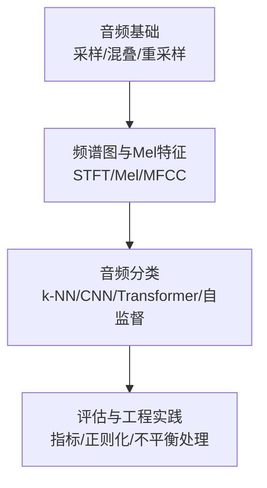
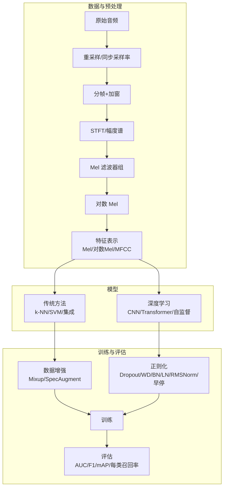
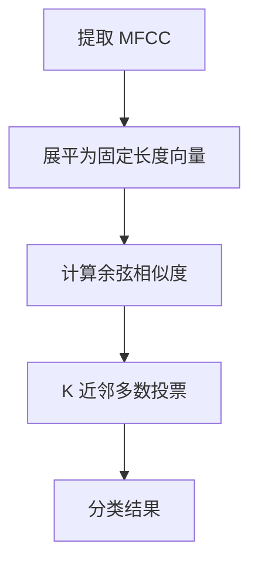
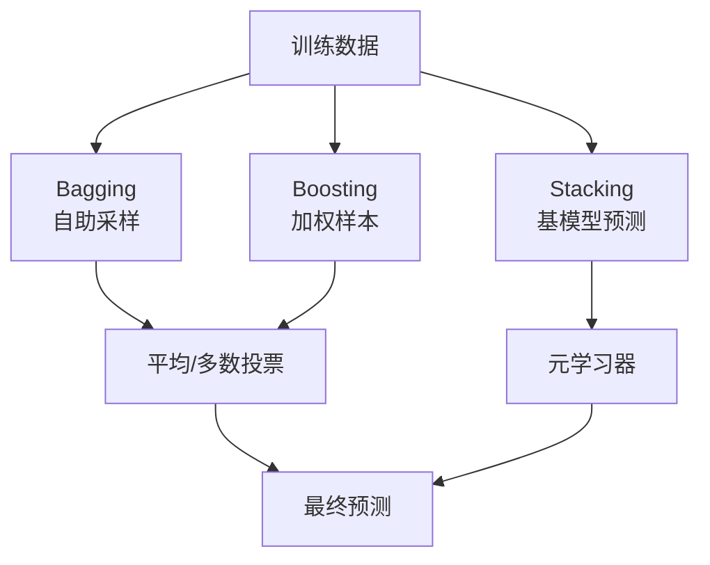
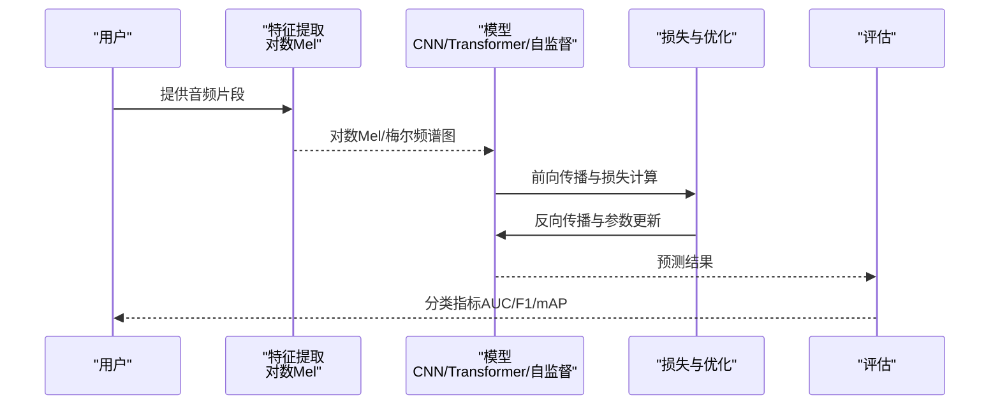
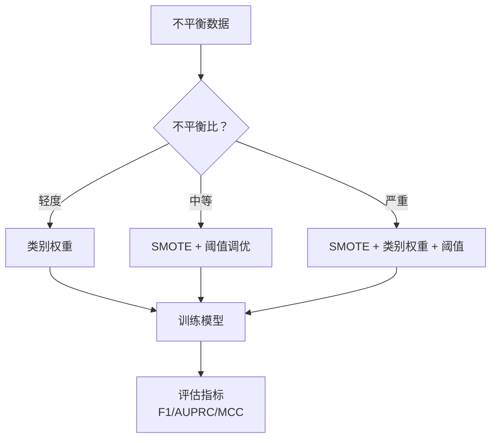
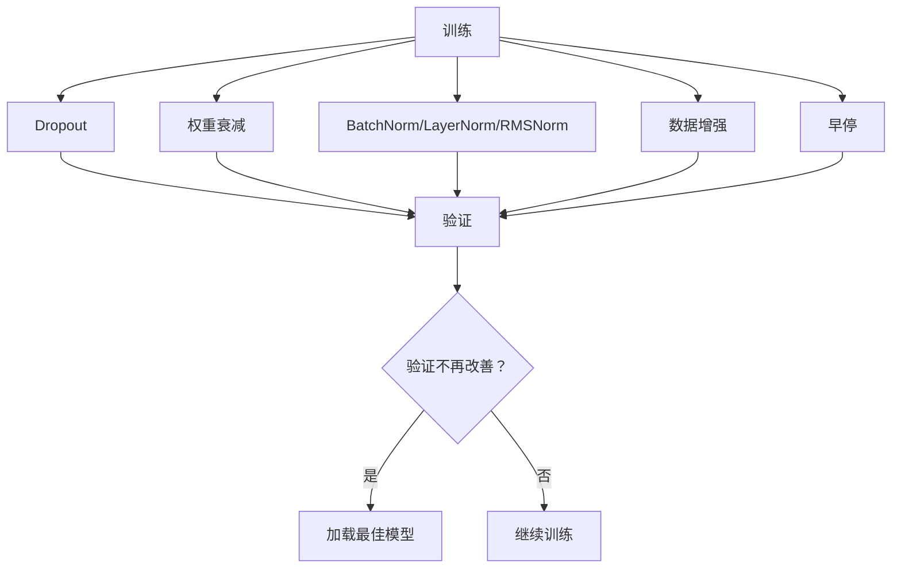
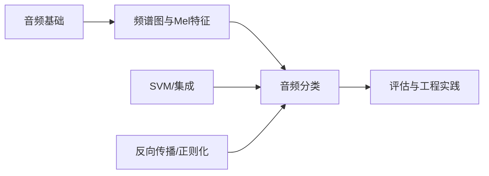

# 音频分类

<cite>
**本文档引用的文件**
- [音频基础（音频基础）](file://phases/06-speech-and-audio/01-audio-fundamentals/docs/zh.md)
- [频谱图、Mel 尺度与音频特征](file://phases/06-speech-and-audio/02-spectrograms-mel-features/docs/zh.md)
- [音频分类](file://phases/06-speech-and-audio/03-audio-classification/docs/zh.md)
- [支持向量机](file://phases/02-ml-fundamentals/05-support-vector-machines/docs/zh.md)
- [集成方法](file://phases/02-ml-fundamentals/11-ensemble-methods/docs/zh.md)
- [处理不平衡数据](file://phases/02-ml-fundamentals/17-imbalanced-data/docs/zh.md)
- [从零实现反向传播](file://phases/03-deep-learning-core/03-backpropagation/docs/zh.md)
- [正则化](file://phases/03-deep-learning-core/07-regularization/docs/zh.md)
</cite>

## 目录
1. [引言](#引言)
2. [项目结构](#项目结构)
3. [核心组件](#核心组件)
4. [架构总览](#架构总览)
5. [详细组件分析](#详细组件分析)
6. [依赖分析](#依赖分析)
7. [性能考量](#性能考量)
8. [故障排查指南](#故障排查指南)
9. [结论](#结论)
10. [附录](#附录)

## 引言
本课程围绕“音频分类”展开，系统讲解从传统机器学习到深度学习的完整技术路线，覆盖数据准备、特征工程、模型训练与评估、数据增强与正则化、类别不平衡处理、过拟合预防等关键主题。课程强调“数据大于架构”的理念：在音频分类中，数据质量、增强与评估指标往往比模型选择更重要。课程还提供从零实现的全流程思路与可视化图示，帮助读者建立端到端的工程能力。

## 项目结构
本课程位于“语音与音频”阶段，配套包含三门核心课程：
- 音频基础：采样、傅里叶、混叠与重采样等基础知识
- 频谱图、Mel 尺度与音频特征：STFT、Mel 滤波器组、对数 Mel、MFCC 等特征工程
- 音频分类：k-NN、CNN、Transformer、自监督预训练模型（BEATs、AST）等

**章节来源**
- [音频基础（音频基础）:1-143](file://phases/06-speech-and-audio/01-audio-fundamentals/docs/zh.md#L1-L143)
- [频谱图、Mel 尺度与音频特征:1-175](file://phases/06-speech-and-audio/02-spectrograms-mel-features/docs/zh.md#L1-L175)
- [音频分类:1-180](file://phases/06-speech-and-audio/03-audio-classification/docs/zh.md#L1-L180)

## 核心组件
- 数据与预处理
  - 采样率与重采样：确保上游采样率与下游模型一致，避免混叠
  - 分帧与加窗：STFT 生成频谱图，控制帧长与步长
  - Mel 滤波器组与对数 Mel：压缩动态范围，适配 2026 年主流输入
  - MFCC：去相关特征，适合说话人识别与关键词检测
- 传统方法
  - k-NN（MFCC 嵌入）：无需 GPU 的基线，适合小数据集
  - SVM：最大间隔、铰链损失、核技巧，适合中小规模高维稀疏特征
  - 集成方法：Bagging/随机森林、AdaBoost、梯度提升、Stacking
- 深度学习
  - CNN（Mel 图像化）：ResNet 风格，全局平均池化 + Softmax
  - Transformer（AST）：Mel 分块 + 位置嵌入 + ViT
  - 自监督预训练（BEATs/Whisper 编码器）：海量数据预训练 + 有监督微调
- 工程实践
  - 数据增强：SpecAugment、Mixup
  - 不平衡处理：SMOTE、类别权重、阈值调优
  - 正则化：Dropout、权重衰减、BN/LN/RMSNorm、早停
  - 评估：AUC/F1/mAP/每类召回率

**章节来源**
- [音频基础（音频基础）:10-143](file://phases/06-speech-and-audio/01-audio-fundamentals/docs/zh.md#L10-L143)
- [频谱图、Mel 尺度与音频特征:10-175](file://phases/06-speech-and-audio/02-spectrograms-mel-features/docs/zh.md#L10-L175)
- [音频分类:10-180](file://phases/06-speech-and-audio/03-audio-classification/docs/zh.md#L10-L180)
- [支持向量机:10-373](file://phases/02-ml-fundamentals/05-support-vector-machines/docs/zh.md#L10-L373)
- [集成方法:10-348](file://phases/02-ml-fundamentals/11-ensemble-methods/docs/zh.md#L10-L348)
- [处理不平衡数据:10-535](file://phases/02-ml-fundamentals/17-imbalanced-data/docs/zh.md#L10-L535)
- [正则化:10-533](file://phases/03-deep-learning-core/07-regularization/docs/zh.md#L10-L533)

## 架构总览
下图展示了从“原始音频”到“分类决策”的端到端流程，涵盖特征工程、模型与评估的关键环节。

**图表来源**
- [音频基础（音频基础）:10-111](file://phases/06-speech-and-audio/01-audio-fundamentals/docs/zh.md#L10-L111)
- [频谱图、Mel 尺度与音频特征:10-147](file://phases/06-speech-and-audio/02-spectrograms-mel-features/docs/zh.md#L10-L147)
- [音频分类:10-150](file://phases/06-speech-and-audio/03-audio-classification/docs/zh.md#L10-L150)
- [处理不平衡数据:58-74](file://phases/02-ml-fundamentals/17-imbalanced-data/docs/zh.md#L58-L74)
- [正则化:169-188](file://phases/03-deep-learning-core/07-regularization/docs/zh.md#L169-L188)

## 详细组件分析

### 传统方法：k-NN 与 SVM
- k-NN（MFCC 嵌入）
  - 思路：对每个片段提取 MFCC，展平后计算与标记库的余弦相似度，取 K 个多数投票
  - 适用：小数据集、干净环境、快速基线
  - 优势：无需 GPU、实现简单、在 ESC-50 等基准上表现稳健
- SVM
  - 最大间隔与铰链损失：最大化间隔，最小化误分类
  - 核技巧：线性/多项式/RBF，避免显式高维映射
  - 适用：中小规模高维稀疏特征（如 TF-IDF 文本分类），也可用于音频特征空间
  - 与深度学习对比：SVM 在小数据、高维稀疏、需要理论保证时更优；深度学习在大规模数据与复杂结构上占优

**图表来源**
- [音频分类:54-93](file://phases/06-speech-and-audio/03-audio-classification/docs/zh.md#L54-L93)

**章节来源**
- [音频分类:54-93](file://phases/06-speech-and-audio/03-audio-classification/docs/zh.md#L54-L93)
- [支持向量机:27-139](file://phases/02-ml-fundamentals/05-support-vector-machines/docs/zh.md#L27-L139)

### 集成方法：Bagging/Boosting/Stacking
- Bagging（自助聚合）：通过自助采样训练多个模型，降低方差
- Boosting（AdaBoost/梯度提升）：顺序纠正错误，降低偏差
- Stacking：用多个基模型的预测作为元学习器的输入
- 适用：表格数据与结构化特征；在音频分类中可用于特征融合或元学习

**图表来源**
- [集成方法:42-171](file://phases/02-ml-fundamentals/11-ensemble-methods/docs/zh.md#L42-L171)

**章节来源**
- [集成方法:42-171](file://phases/02-ml-fundamentals/11-ensemble-methods/docs/zh.md#L42-L171)

### 深度学习：CNN、Transformer 与自监督
- CNN（Mel 图像化）
  - 思想：将对数 Mel 视为图像，用卷积提取局部模式，全局平均池化后 Softmax
  - 适用：大多数 Kaggle 比赛基线，参数量可控，推理快速
- Transformer（AST）
  - 思想：对数 Mel 分块 + 位置嵌入 + ViT，适合长序列与全局依赖
  - 适用：大规模数据与强监督信号
- 自监督预训练（BEATs/Whisper 编码器）
  - 思想：在海量音频上预训练，仅需少量有标注数据微调
  - 适用：数据稀缺或实时边缘设备（量化）

**图表来源**
- [音频分类:94-150](file://phases/06-speech-and-audio/03-audio-classification/docs/zh.md#L94-L150)

**章节来源**
- [音频分类:94-150](file://phases/06-speech-and-audio/03-audio-classification/docs/zh.md#L94-L150)

### 数据增强与类别不平衡处理
- 数据增强
  - Mixup：线性插值两个样本及其标签，提升泛化
  - SpecAugment：随机掩蔽时间/频率段，模拟噪声与遮挡
- 类别不平衡
  - SMOTE：在少数类样本间插值生成合成样本
  - 类别权重：在损失中为少数类赋予更高权重
  - 阈值调优：根据业务目标调整分类阈值，优化精确率/召回率权衡

**图表来源**
- [处理不平衡数据:58-74](file://phases/02-ml-fundamentals/17-imbalanced-data/docs/zh.md#L58-L74)

**章节来源**
- [处理不平衡数据:58-212](file://phases/02-ml-fundamentals/17-imbalanced-data/docs/zh.md#L58-L212)

### 正则化与过拟合预防
- Dropout：训练期随机置零，测试期缩放，强制冗余表示
- 权重衰减（L2）：抑制大权重，降低模型复杂度
- 归一化：BatchNorm（CNN）、LayerNorm（Transformer）、RMSNorm（LLM）
- 早停：验证损失不再下降时停止训练，避免过度拟合

**图表来源**
- [正则化:169-188](file://phases/03-deep-learning-core/07-regularization/docs/zh.md#L169-L188)

**章节来源**
- [正则化:169-438](file://phases/03-deep-learning-core/07-regularization/docs/zh.md#L169-L438)

## 依赖分析
- 前置知识依赖
  - 音频基础 → 频谱图与 Mel 特征 → 音频分类
  - 机器学习基础（SVM、集成）→ 音频分类传统方法
  - 深度学习基础（反向传播、正则化）→ 深度模型训练
- 外部依赖
  - 特征提取：STFT、Mel 滤波器组、对数 Mel
  - 模型：CNN、Transformer、自监督预训练（BEATs、Whisper 编码器）
  - 评估：AUC、F1、mAP、每类召回率

**图表来源**
- [音频基础（音频基础）:10-111](file://phases/06-speech-and-audio/01-audio-fundamentals/docs/zh.md#L10-L111)
- [频谱图、Mel 尺度与音频特征:10-147](file://phases/06-speech-and-audio/02-spectrograms-mel-features/docs/zh.md#L10-L147)
- [音频分类:10-150](file://phases/06-speech-and-audio/03-audio-classification/docs/zh.md#L10-L150)
- [支持向量机:10-373](file://phases/02-ml-fundamentals/05-support-vector-machines/docs/zh.md#L10-L373)
- [集成方法:10-348](file://phases/02-ml-fundamentals/11-ensemble-methods/docs/zh.md#L10-L348)
- [从零实现反向传播:10-471](file://phases/03-deep-learning-core/03-backpropagation/docs/zh.md#L10-L471)
- [正则化:10-533](file://phases/03-deep-learning-core/07-regularization/docs/zh.md#L10-L533)

## 性能考量
- 特征工程
  - Mel 数量与帧/步长：80 对数 Mel 为通用起点；ASR/分类任务略有差异
  - 采样率一致性：上游采样率与模型期望不一致会导致性能骤降
- 模型选择
  - 小数据集：k-NN + 增强
  - 中等数据集：CNN/Transformer 微调
  - 大数据集：自监督预训练 + 少样本微调
- 训练稳定性
  - 正则化组合：Dropout + 权重衰减 + 归一化 + 早停
  - 学习率调度与优化器：AdamW（解耦权重衰减）在深度模型中更稳健

## 故障排查指南
- 常见陷阱
  - Mel 数量不匹配：训练与推理使用不同 Mel 数量
  - 采样率不一致：上游 22.05kHz 与模型 16kHz 不符
  - 归一化漂移：训练按话语归一化，推理使用全局归一化
  - 填充泄漏：末尾补零导致频谱平坦，应对称填充或复制边缘
- 不平衡问题
  - 指标选择：准确率在不平衡数据上失效，优先 AUPRC/F1/MCC
  - 策略组合：SMOTE + 类别权重 + 阈值调优
- 过拟合
  - 诊断：训练准确率远高于测试准确率
  - 处理：增加正则化、数据增强、早停、更小模型或更少特征

**章节来源**
- [频谱图、Mel 尺度与音频特征:137-144](file://phases/06-speech-and-audio/02-spectrograms-mel-features/docs/zh.md#L137-L144)
- [处理不平衡数据:29-57](file://phases/02-ml-fundamentals/17-imbalanced-data/docs/zh.md#L29-L57)
- [正则化:169-188](file://phases/03-deep-learning-core/07-regularization/docs/zh.md#L169-L188)

## 结论
音频分类的工程成功关键在于“高质量数据 + 合适的特征 + 稳健的训练策略”。传统方法（k-NN、SVM、集成）在小数据与高维稀疏特征上仍有价值；深度学习在大规模数据与复杂结构上具备优势。结合数据增强、类别不平衡处理与正则化，可在真实场景中取得稳健的性能。自 2026 年以来，对数 Mel + CNN/Transformer + 自监督微调已成为主流范式，值得优先尝试。

## 附录
- 术语速查
  - Mel：对数感知频率尺度，压缩动态范围
  - 对数 Mel：Whisper 等模型的标准输入
  - MFCC：DCT 去相关特征，适合关键词检测与说话人识别
  - SpecAugment：掩蔽时间/频率段，提升鲁棒性
  - Mixup：样本插值增强
  - mAP：多标签主要指标
  - AUPRC：不平衡场景下的 PR 曲线下面积
  - BEATs：自监督音频预训练，迭代版本在 AudioSet 上领先
  - AST：音频频谱图 Transformer，ViT 在 Mel 块上的应用

**章节来源**
- [音频分类:161-180](file://phases/06-speech-and-audio/03-audio-classification/docs/zh.md#L161-L180)
- [频谱图、Mel 尺度与音频特征:155-167](file://phases/06-speech-and-audio/02-spectrograms-mel-features/docs/zh.md#L155-L167)
- [处理不平衡数据:515-527](file://phases/02-ml-fundamentals/17-imbalanced-data/docs/zh.md#L515-L527)