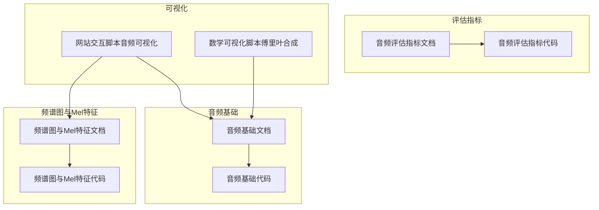
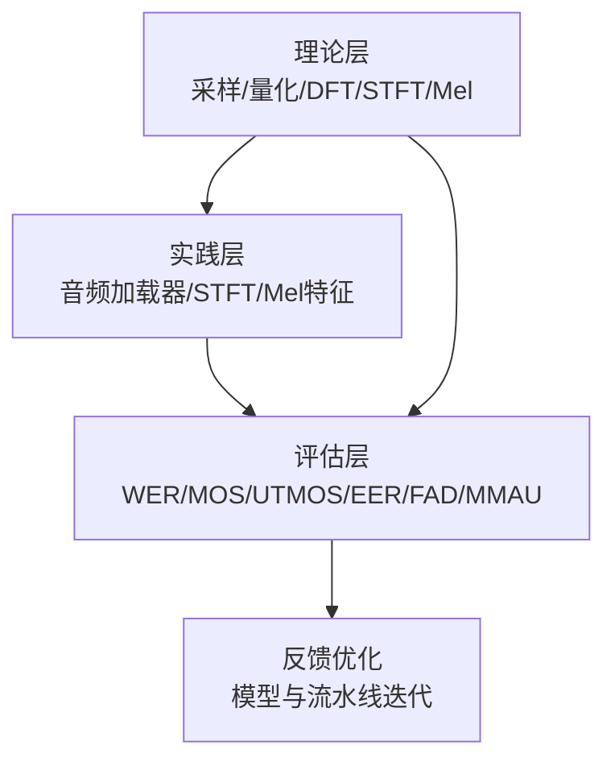
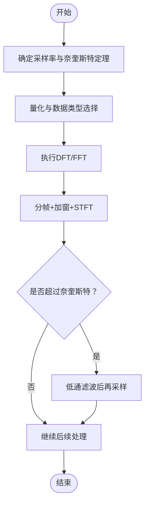
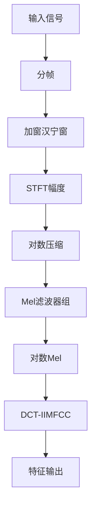
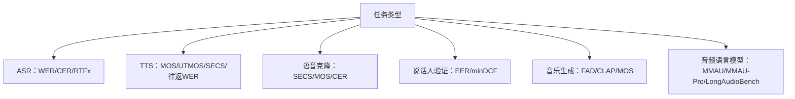
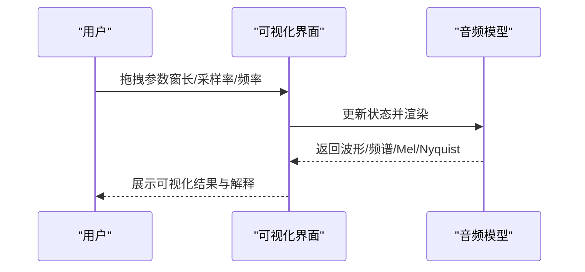
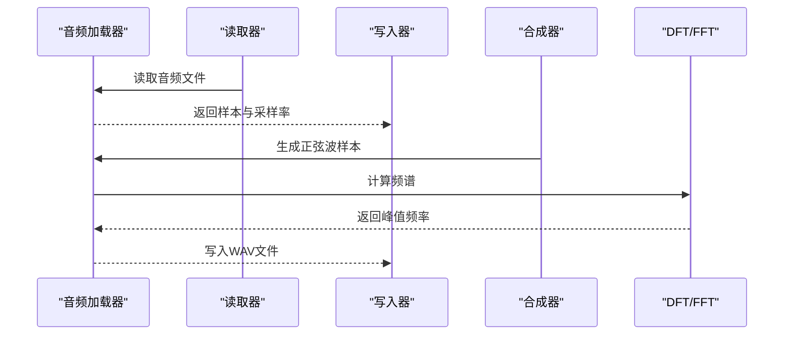

# 音频基础

<cite>
**本文引用的文件**
- [音频基础（文档）](file://phases/06-speech-and-audio/01-audio-fundamentals/docs/zh.md)
- [音频基础（代码）](file://phases/06-speech-and-audio/01-audio-fundamentals/code/main.py)
- [频谱图与Mel特征（文档）](file://phases/06-speech-and-audio/02-spectrograms-mel-features/docs/zh.md)
- [频谱图与Mel特征（代码）](file://phases/06-speech-and-audio/02-spectrograms-mel-features/code/main.py)
- [音频评估指标（文档）](file://phases/06-speech-and-audio/17-audio-evaluation-metrics/docs/zh.md)
- [音频评估指标（代码）](file://phases/06-speech-and-audio/17-audio-evaluation-metrics/code/main.py)
- [网站交互脚本（音频可视化）](file://site/figures-vision-speech.js)
- [数学可视化脚本（傅里叶合成）](file://site/figures-math.js)
</cite>

## 目录
1. [引言](#引言)
2. [项目结构](#项目结构)
3. [核心组件](#核心组件)
4. [架构总览](#架构总览)
5. [详细组件分析](#详细组件分析)
6. [依赖分析](#依赖分析)
7. [性能考虑](#性能考虑)
8. [故障排查指南](#故障排查指南)
9. [结论](#结论)
10. [附录](#附录)

## 引言
本课程围绕数字音频的基础理论与工程实践展开，系统讲解采样定理、量化、频率响应、时域与频域表示、傅里叶变换及其在音频处理中的应用。课程还覆盖常见音频文件格式（WAV、MP3、FLAC）的技术细节与适用场景，提供从零实现音频加载器的完整流程，包括文件读取、格式转换、采样率调整等。此外，课程包含音频可视化技术（波形图、频谱图）与质量评估指标（WER、MOS、UTMOS、MMAU、FAD、EER）及噪声处理思路，帮助读者建立完整的音频工程能力。

## 项目结构
本课程位于“语音与音频”阶段，包含三部分核心内容：
- 音频基础：采样、量化、混叠、DFT/FFT、STFT、可视化
- 频谱图与Mel特征：分帧、加窗、STFT、Mel滤波器组、对数压缩、MFCC
- 音频评估指标：WER、MOS、UTMOS、EER、FAD、MMAU等指标与基准

**图表来源**
- [音频基础（文档）](file://phases/06-speech-and-audio/01-audio-fundamentals/docs/zh.md)
- [音频基础（代码）](file://phases/06-speech-and-audio/01-audio-fundamentals/code/main.py)
- [频谱图与Mel特征（文档）](file://phases/06-speech-and-audio/02-spectrograms-mel-features/docs/zh.md)
- [频谱图与Mel特征（代码）](file://phases/06-speech-and-audio/02-spectrograms-mel-features/code/main.py)
- [音频评估指标（文档）](file://phases/06-speech-and-audio/17-audio-evaluation-metrics/docs/zh.md)
- [音频评估指标（代码）](file://phases/06-speech-and-audio/17-audio-evaluation-metrics/code/main.py)
- [网站交互脚本（音频可视化）](file://site/figures-vision-speech.js)
- [数学可视化脚本（傅里叶合成）](file://site/figures-math.js)

**章节来源**
- [音频基础（文档）](file://phases/06-speech-and-audio/01-audio-fundamentals/docs/zh.md)
- [频谱图与Mel特征（文档）](file://phases/06-speech-and-audio/02-spectrograms-mel-features/docs/zh.md)
- [音频评估指标（文档）](file://phases/06-speech-and-audio/17-audio-evaluation-metrics/docs/zh.md)

## 核心组件
- 音频基础（采样、量化、混叠、DFT/FFT、STFT）
- 频谱图与Mel特征（分帧、加窗、Mel滤波器组、对数压缩、MFCC）
- 音频评估指标（WER、MOS、UTMOS、EER、FAD、MMAU）
- 可视化工具（波形、频谱图、Mel尺度、Nyquist与混叠）

**章节来源**
- [音频基础（文档）](file://phases/06-speech-and-audio/01-audio-fundamentals/docs/zh.md)
- [频谱图与Mel特征（文档）](file://phases/06-speech-and-audio/02-spectrograms-mel-features/docs/zh.md)
- [音频评估指标（文档）](file://phases/06-speech-and-audio/17-audio-evaluation-metrics/docs/zh.md)

## 架构总览
课程采用“理论-实践-评估”的三层架构：
- 理论层：采样定理、量化、频率响应、DFT/FFT、STFT
- 实践层：从零实现音频加载器、STFT与Mel特征提取
- 评估层：指标体系与基准测试

[本图为概念性架构示意，无需图表来源]

## 详细组件分析

### 组件A：音频基础（采样、量化、混叠、DFT/FFT、STFT）
- 采样定理与奈奎斯特定理：采样率必须大于两倍最高频率，否则发生混叠
- 量化：PCM位深度与数值范围，常见为16位整型或32位浮点
- DFT/FFT：离散傅里叶变换与快速算法，频率分辨率与窗函数的关系
- STFT：分帧与加窗，时间-频率局部化

**图表来源**
- [音频基础（代码）](file://phases/06-speech-and-audio/01-audio-fundamentals/code/main.py)
- [音频基础（文档）](file://phases/06-speech-and-audio/01-audio-fundamentals/docs/zh.md)

**章节来源**
- [音频基础（文档）](file://phases/06-speech-and-audio/01-audio-fundamentals/docs/zh.md)
- [音频基础（代码）](file://phases/06-speech-and-audio/01-audio-fundamentals/code/main.py)

### 组件B：频谱图与Mel特征（分帧、加窗、Mel滤波器组、对数压缩、MFCC）
- 分帧与步长：常用25ms窗与10ms步长
- 窗函数：汉宁窗减少频谱泄漏
- STFT幅度：对数压缩动态范围
- Mel尺度与滤波器组：按人类听觉特性压缩高频
- 对数Mel与MFCC：降维与去相关

**图表来源**
- [频谱图与Mel特征（代码）](file://phases/06-speech-and-audio/02-spectrograms-mel-features/code/main.py)
- [频谱图与Mel特征（文档）](file://phases/06-speech-and-audio/02-spectrograms-mel-features/docs/zh.md)

**章节来源**
- [频谱图与Mel特征（文档）](file://phases/06-speech-and-audio/02-spectrograms-mel-features/docs/zh.md)
- [频谱图与Mel特征（代码）](file://phases/06-speech-and-audio/02-spectrograms-mel-features/code/main.py)

### 组件C：音频评估指标（WER、MOS、UTMOS、EER、FAD、MMAU）
- ASR：WER/CER/RTFx/首token延迟
- TTS：MOS/UTMOS/SECS/往返WER/TTFA
- 语音克隆：SECS/MOS/CER
- 说话人验证：EER/minDCF
- 音乐生成：FAD/CLAP/MOS
- 音频语言模型：MMAU/MMAU-Pro/LongAudioBench/AudioCaps

**图表来源**
- [音频评估指标（文档）](file://phases/06-speech-and-audio/17-audio-evaluation-metrics/docs/zh.md)

**章节来源**
- [音频评估指标（文档）](file://phases/06-speech-and-audio/17-audio-evaluation-metrics/docs/zh.md)
- [音频评估指标（代码）](file://phases/06-speech-and-audio/17-audio-evaluation-metrics/code/main.py)

### 组件D：可视化与交互（波形、频谱图、Mel尺度、Nyquist与混叠）
- 窗口大小与时间-频率权衡：短窗精确定时，长窗精细频率
- Mel尺度：压缩高频，贴合人类听觉
- Nyquist与混叠：采样率不足导致折叠频率

**图表来源**
- [网站交互脚本（音频可视化）](file://site/figures-vision-speech.js)

**章节来源**
- [网站交互脚本（音频可视化）](file://site/figures-vision-speech.js)

## 依赖分析
- 理论与实践耦合：音频基础理论直接驱动STFT与Mel特征实现
- 实践与评估联动：特征质量直接影响WER/MOS等指标
- 可视化辅助理解：交互式工具加深对采样、混叠、Mel尺度的理解

[本图为概念性依赖示意，无需图表来源]

**章节来源**
- [音频基础（文档）](file://phases/06-speech-and-audio/01-audio-fundamentals/docs/zh.md)
- [频谱图与Mel特征（文档）](file://phases/06-speech-and-audio/02-spectrograms-mel-features/docs/zh.md)
- [音频评估指标（文档）](file://phases/06-speech-and-audio/17-audio-evaluation-metrics/docs/zh.md)
- [网站交互脚本（音频可视化）](file://site/figures-vision-speech.js)

## 性能考虑
- FFT复杂度：N点FFT为O(N log N)，需选择合适的N（常为2的幂）
- 窗函数与零填充：合理设置窗长与步长，平衡时间-频率分辨率
- Mel滤波器组：稀疏矩阵乘法，注意内存与计算效率
- 评估指标：批量计算与缓存中间结果，避免重复开销

[本节为通用指导，无需章节来源]

## 故障排查指南
- 采样率不匹配：确保输入与模型期望一致，必要时进行抗混叠重采样
- 混叠现象：采样前低通滤波，避免高于奈奎斯特的频率成分
- 特征形状不一致：Mel数量、帧/步长与训练时保持一致
- 归一化漂移：训练与推理使用相同的归一化策略
- 填充泄漏：避免末尾零填充导致的频谱伪影

**章节来源**
- [音频基础（文档）](file://phases/06-speech-and-audio/01-audio-fundamentals/docs/zh.md)
- [频谱图与Mel特征（文档）](file://phases/06-speech-and-audio/02-spectrograms-mel-features/docs/zh.md)
- [音频评估指标（文档）](file://phases/06-speech-and-audio/17-audio-evaluation-metrics/docs/zh.md)

## 结论
本课程通过“理论-实践-评估-可视化”的闭环设计，帮助读者掌握数字音频的核心知识与工程能力。从采样定理到STFT/Mel特征，再到指标与基准，形成完整的音频处理流水线。建议在实践中严格遵循采样率与归一化一致性，重视抗混叠与特征稳定性，并结合可视化工具加深理解。

[本节为总结性内容，无需章节来源]

## 附录

### 附录A：从零实现音频加载器（步骤概览）
- 读取音频：使用标准库或第三方库读取WAV/PCM
- 写入音频：将浮点样本写回WAV文件
- 合成正弦波：按采样率生成指定频率与持续时间的信号
- DFT峰值检测：定位主频
- 演示混叠：以高于奈奎斯特的频率采样，观察折叠频率

**图表来源**
- [音频基础（代码）](file://phases/06-speech-and-audio/01-audio-fundamentals/code/main.py)

**章节来源**
- [音频基础（代码）](file://phases/06-speech-and-audio/01-audio-fundamentals/code/main.py)

### 附录B：常见音频文件格式与应用场景
- WAV：无损、广泛支持，适合科研与离线处理
- MP3：有损压缩，适合分发与存储
- FLAC：无损压缩，体积小于WAV，适合存储与传输

**章节来源**
- [音频基础（文档）](file://phases/06-speech-and-audio/01-audio-fundamentals/docs/zh.md)

### 附录C：傅里叶变换在音频处理中的应用
- 时域到频域：STFT生成随时间变化的频谱
- 频域特征：Mel频带、对数压缩、MFCC降维
- 可视化：波形图、频谱图、Mel尺度曲线

**章节来源**
- [数学可视化脚本（傅里叶合成）](file://site/figures-math.js)
- [网站交互脚本（音频可视化）](file://site/figures-vision-speech.js)