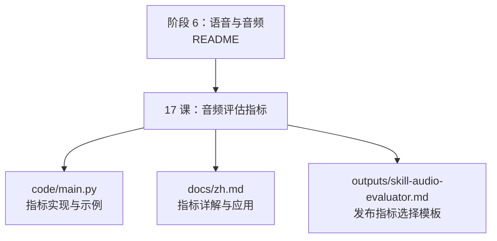
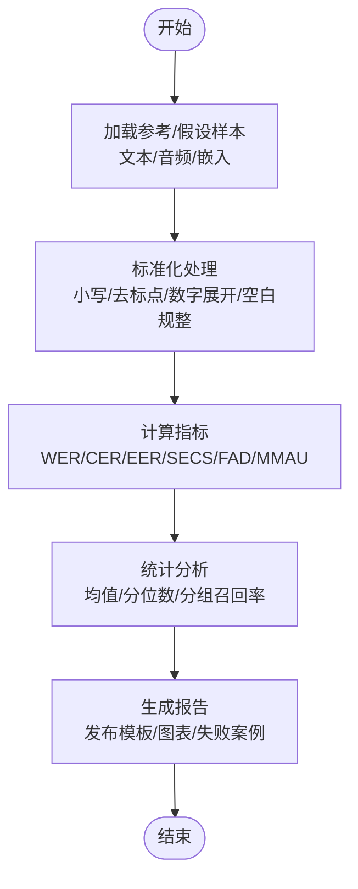
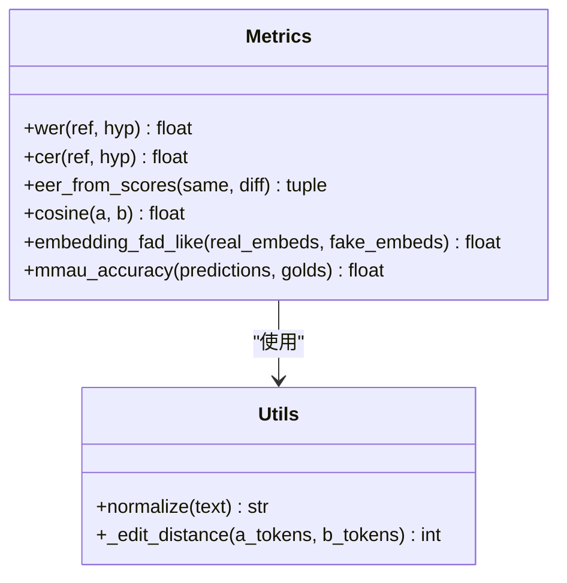
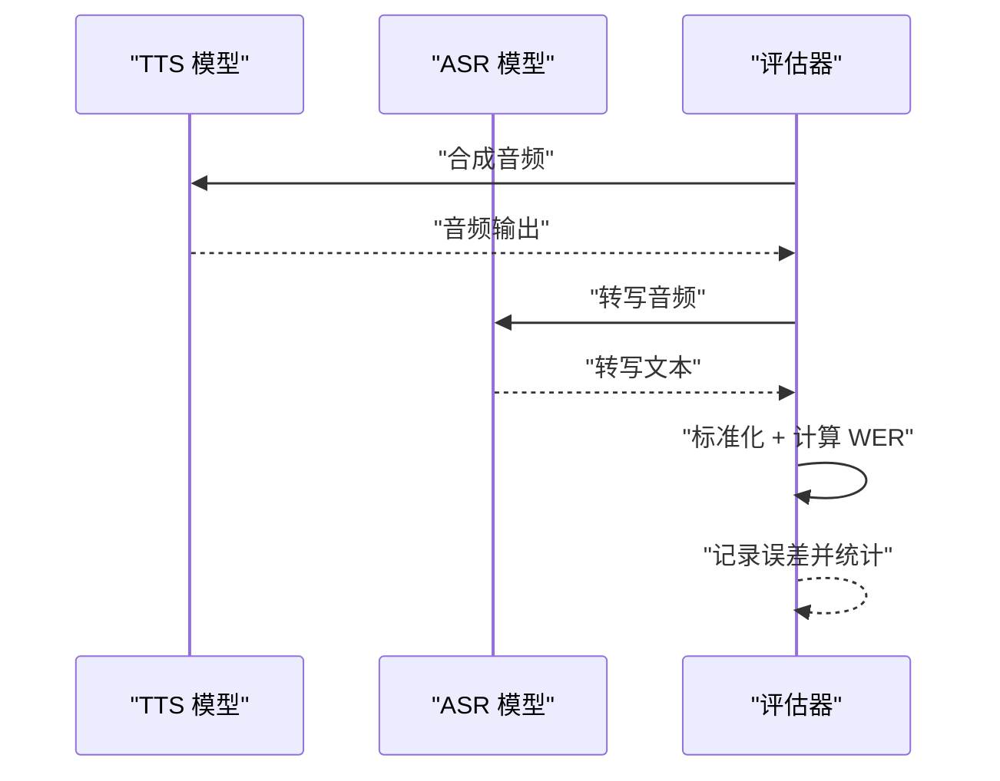
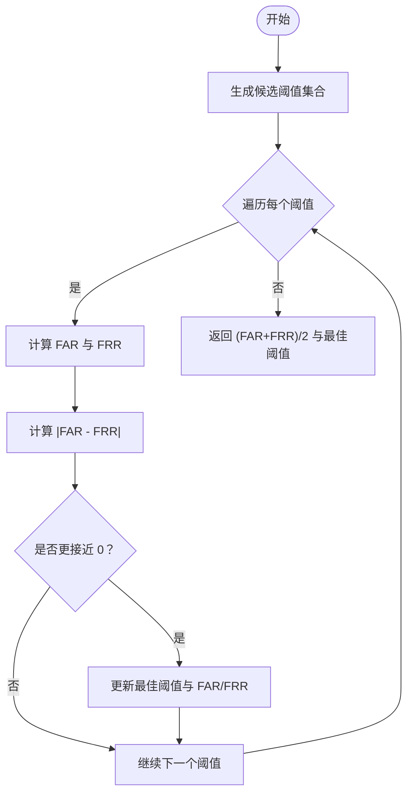
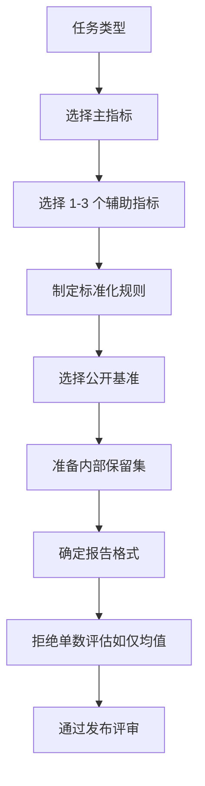
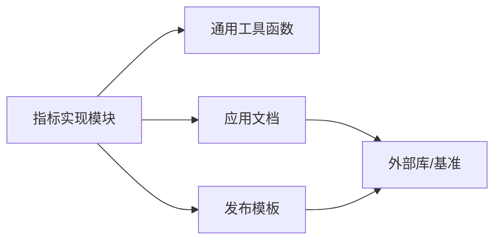

# 音频评估指标

<cite>
**本文档引用的文件**
- [phases/06-speech-and-audio/17-audio-evaluation-metrics/code/main.py](file://phases/06-speech-and-audio/17-audio-evaluation-metrics/code/main.py)
- [phases/06-speech-and-audio/17-audio-evaluation-metrics/docs/zh.md](file://phases/06-speech-and-audio/17-audio-evaluation-metrics/docs/zh.md)
- [phases/06-speech-and-audio/17-audio-evaluation-metrics/outputs/skill-audio-evaluator.md](file://phases/06-speech-and-audio/17-audio-evaluation-metrics/outputs/skill-audio-evaluator.md)
- [phases/06-speech-and-audio/README.md](file://phases/06-speech-and-audio/README.md)
</cite>

## 目录
1. [引言](#引言)
2. [项目结构](#项目结构)
3. [核心组件](#核心组件)
4. [架构总览](#架构总览)
5. [详细组件分析](#详细组件分析)
6. [依赖分析](#依赖分析)
7. [性能考虑](#性能考虑)
8. [故障排查指南](#故障排查指南)
9. [结论](#结论)
10. [附录](#附录)

## 引言
本课程围绕“音频评估指标”展开，系统讲解客观指标与主观评测方法，覆盖 ASR（语音转写）、TTS（语音合成）、语音克隆、说话人验证、音乐生成、音频语言模型（LALM）等任务的评估策略与指标组合。重点包括：
- 客观指标：WER、CER、EER、FAD、MOS、UTMOS、SECS、MMAU 等
- 主观评测：MOS 评分、ABX 测试、双试验（double-blind）等
- 评估系统：从零实现质量评分、统计分析与报告生成
- 多维度评估框架：语音质量、音频质量、感知质量
- 数据集构建与标注：MOS、ABX、双试验实验设计
- 统计分析与显著性检验

## 项目结构
本课程位于“语音与音频”阶段，评估指标模块位于 17 课，包含：
- 代码实现：从零实现若干常用指标与基准流程
- 文档说明：指标定义、应用场景、常见陷阱与最佳实践
- 技能输出：面向发布流程的指标选择与报告模板

图示来源
- [phases/06-speech-and-audio/README.md:1-6](file://phases/06-speech-and-audio/README.md#L1-L6)
- [phases/06-speech-and-audio/17-audio-evaluation-metrics/code/main.py:1-151](file://phases/06-speech-and-audio/17-audio-evaluation-metrics/code/main.py#L1-L151)
- [phases/06-speech-and-audio/17-audio-evaluation-metrics/docs/zh.md:1-225](file://phases/06-speech-and-audio/17-audio-evaluation-metrics/docs/zh.md#L1-L225)
- [phases/06-speech-and-audio/17-audio-evaluation-metrics/outputs/skill-audio-evaluator.md:1-30](file://phases/06-speech-and-audio/17-audio-evaluation-metrics/outputs/skill-audio-evaluator.md#L1-L30)

章节来源
- [phases/06-speech-and-audio/README.md:1-6](file://phases/06-speech-and-audio/README.md#L1-L6)

## 核心组件
- 指标实现模块：包含编辑距离（WER/CER）、EER、余弦相似度（SECS）、嵌入空间距离（FAD 类似）、多项选择准确率（MMAU）等
- 应用文档：提供指标定义、适用任务、典型数值范围、常见陷阱与最佳实践
- 发布模板：指导如何为不同任务选择主次指标、标准化规则、公开基准与内部数据集、报告格式

章节来源
- [phases/06-speech-and-audio/17-audio-evaluation-metrics/code/main.py:1-151](file://phases/06-speech-and-audio/17-audio-evaluation-metrics/code/main.py#L1-L151)
- [phases/06-speech-and-audio/17-audio-evaluation-metrics/docs/zh.md:1-225](file://phases/06-speech-and-audio/17-audio-evaluation-metrics/docs/zh.md#L1-L225)
- [phases/06-speech-and-audio/17-audio-evaluation-metrics/outputs/skill-audio-evaluator.md:1-30](file://phases/06-speech-and-audio/17-audio-evaluation-metrics/outputs/skill-audio-evaluator.md#L1-L30)

## 架构总览
下图展示从“输入数据/模型输出”到“指标计算/统计分析/报告”的整体流程。

图示来源
- [phases/06-speech-and-audio/17-audio-evaluation-metrics/code/main.py:80-151](file://phases/06-speech-and-audio/17-audio-evaluation-metrics/code/main.py#L80-L151)
- [phases/06-speech-and-audio/17-audio-evaluation-metrics/docs/zh.md:176-183](file://phases/06-speech-and-audio/17-audio-evaluation-metrics/docs/zh.md#L176-L183)

## 详细组件分析

### 组件 A：指标实现与调用（从零实现）
该组件提供若干常用指标的纯 Python 实现，便于理解原理与快速集成。

图示来源
- [phases/06-speech-and-audio/17-audio-evaluation-metrics/code/main.py:13-78](file://phases/06-speech-and-audio/17-audio-evaluation-metrics/code/main.py#L13-L78)

章节来源
- [phases/06-speech-and-audio/17-audio-evaluation-metrics/code/main.py:1-151](file://phases/06-speech-and-audio/17-audio-evaluation-metrics/code/main.py#L1-L151)

### 组件 B：指标工作流（端到端示例）
以“TTS 往返 WER”为例，展示从合成到转写的完整流程。

图示来源
- [phases/06-speech-and-audio/17-audio-evaluation-metrics/docs/zh.md:131-141](file://phases/06-speech-and-audio/17-audio-evaluation-metrics/docs/zh.md#L131-L141)

章节来源
- [phases/06-speech-and-audio/17-audio-evaluation-metrics/docs/zh.md:131-141](file://phases/06-speech-and-audio/17-audio-evaluation-metrics/docs/zh.md#L131-L141)

### 组件 C：复杂逻辑流程（EER 计算）
EER 通过遍历阈值寻找 FAR 与 FRR 最接近的点，体现“等错误率”的平衡。

图示来源
- [phases/06-speech-and-audio/17-audio-evaluation-metrics/code/main.py:43-52](file://phases/06-speech-and-audio/17-audio-evaluation-metrics/code/main.py#L43-L52)

章节来源
- [phases/06-speech-and-audio/17-audio-evaluation-metrics/code/main.py:43-52](file://phases/06-speech-and-audio/17-audio-evaluation-metrics/code/main.py#L43-L52)

### 组件 D：发布指标选择模板
该模板帮助团队在发布前确定主次指标、标准化规则、公开基准与内部数据集，确保可复现与可比较。

图示来源
- [phases/06-speech-and-audio/17-audio-evaluation-metrics/outputs/skill-audio-evaluator.md:10-30](file://phases/06-speech-and-audio/17-audio-evaluation-metrics/outputs/skill-audio-evaluator.md#L10-L30)

章节来源
- [phases/06-speech-and-audio/17-audio-evaluation-metrics/outputs/skill-audio-evaluator.md:10-30](file://phases/06-speech-and-audio/17-audio-evaluation-metrics/outputs/skill-audio-evaluator.md#L10-L30)

## 依赖分析
- 内部依赖：指标实现模块之间存在轻耦合，主要通过通用工具函数（如标准化、编辑距离）协作
- 外部依赖：文档中给出的外部库（如 jiwer、UTMOS、FAD 计算库）用于实际工程中的高效实现
- 评估系统集成：发布模板与指标实现共同构成“评估系统”的前后端（实现层与规范层）

图示来源
- [phases/06-speech-and-audio/17-audio-evaluation-metrics/code/main.py:13-78](file://phases/06-speech-and-audio/17-audio-evaluation-metrics/code/main.py#L13-L78)
- [phases/06-speech-and-audio/17-audio-evaluation-metrics/docs/zh.md:116-174](file://phases/06-speech-and-audio/17-audio-evaluation-metrics/docs/zh.md#L116-L174)
- [phases/06-speech-and-audio/17-audio-evaluation-metrics/outputs/skill-audio-evaluator.md:10-30](file://phases/06-speech-and-audio/17-audio-evaluation-metrics/outputs/skill-audio-evaluator.md#L10-L30)

章节来源
- [phases/06-speech-and-audio/17-audio-evaluation-metrics/docs/zh.md:116-174](file://phases/06-speech-and-audio/17-audio-evaluation-metrics/docs/zh.md#L116-L174)

## 性能考虑
- 计算复杂度
  - 编辑距离：O(NM)，适合短文本；长文本建议分段或采样
  - 余弦相似度与嵌入距离：O(D·N)，其中 D 为维度、N 为样本数；可批量向量化
- 实用建议
  - 标准化前置：减少拼写差异带来的噪声
  - 分位数报告：延迟 P50/P95/P99 更能反映尾部性能
  - 分类任务：按类别召回率，避免聚合掩盖局部失败
  - 公开基准 + 内部保留集：兼顾公平比较与业务相关性

## 故障排查指南
- 标准化不当导致的偏差
  - 症状：WER/CER 明显偏高
  - 处理：统一采用小写、去标点、数字展开与空白规整，并在报告中明确规则
- 指标选择不当
  - 症状：模型在仪表盘表现好但在生产差
  - 处理：依据任务选择主指标（如 ASR 的 WER、TTS 的 MOS/UTMOS/SECS、音乐的 FAD+人类 MOS）
- 公开基准饱和
  - 症状：多数前沿模型接近上限
  - 处理：构建反映真实流量的内部保留集，按人群/场景切片
- 统计报告单一
  - 症状：仅报告均值，忽略尾部与类别差异
  - 处理：补充 P50/P95/P99、每类召回率、分组对比

章节来源
- [phases/06-speech-and-audio/17-audio-evaluation-metrics/docs/zh.md:184-191](file://phases/06-speech-and-audio/17-audio-evaluation-metrics/docs/zh.md#L184-L191)
- [phases/06-speech-and-audio/17-audio-evaluation-metrics/outputs/skill-audio-evaluator.md:17-19](file://phases/06-speech-and-audio/17-audio-evaluation-metrics/outputs/skill-audio-evaluator.md#L17-L19)

## 结论
本课程提供了从零实现音频评估系统的关键路径：先以纯 Python 实现核心指标，再结合文档与发布模板形成可落地的评估体系。通过标准化、多维度统计与公开基准，能够有效提升模型发布质量与可复现性。

## 附录

### 附录 A：常用指标与适用任务速览
- ASR：WER、CER、RTFx、首 token 延迟
- TTS：MOS、UTMOS、SECS、往返 WER、TTFA
- 语音克隆：SECS、MOS、CER
- 说话人验证：EER、minDCF、工作点 FAR/FRR
- 说话人分离：DER、JER
- 音频分类：top-1/mAP、宏 F1、每类召回率
- 音乐生成：FAD、CLAP、听感小组 MOS
- 音频语言模型：MMAU、MMAU-Pro、LongAudioBench、AudioCaps/Clotho
- 流式 S2S：延迟 P50/P95、WER、MOS、打断响应速度

章节来源
- [phases/06-speech-and-audio/17-audio-evaluation-metrics/docs/zh.md:14-25](file://phases/06-speech-and-audio/17-audio-evaluation-metrics/docs/zh.md#L14-L25)

### 附录 B：从零实现评估系统步骤
- 步骤 1：带标准化的 WER
  - 参考路径：[phases/06-speech-and-audio/17-audio-evaluation-metrics/docs/zh.md:116-129](file://phases/06-speech-and-audio/17-audio-evaluation-metrics/docs/zh.md#L116-L129)
- 步骤 2：TTS 往返 WER
  - 参考路径：[phases/06-speech-and-audio/17-audio-evaluation-metrics/docs/zh.md:131-141](file://phases/06-speech-and-audio/17-audio-evaluation-metrics/docs/zh.md#L131-L141)
- 步骤 3：语音克隆的 SECS
  - 参考路径：[phases/06-speech-and-audio/17-audio-evaluation-metrics/docs/zh.md:143-152](file://phases/06-speech-and-audio/17-audio-evaluation-metrics/docs/zh.md#L143-L152)
- 步骤 4：音乐生成的 FAD
  - 参考路径：[phases/06-speech-and-audio/17-audio-evaluation-metrics/docs/zh.md:154-160](file://phases/06-speech-and-audio/17-audio-evaluation-metrics/docs/zh.md#L154-L160)
- 步骤 5：说话人验证的 EER
  - 参考路径：[phases/06-speech-and-audio/17-audio-evaluation-metrics/docs/zh.md:162-174](file://phases/06-speech-and-audio/17-audio-evaluation-metrics/docs/zh.md#L162-L174)

### 附录 C：评估数据集构建与标注
- MOS 评分：建议 20+ 听者 × 100+ 样本，注意小组偏差与代表性
- ABX 测试：对比 A/B/X 三样本，消除偏好偏差
- 双试验：盲法、随机化、交叉设计，提高统计稳健性
- 切片分析：按人群、口音、场景、设备等维度拆解，避免聚合掩盖问题

章节来源
- [phases/06-speech-and-audio/17-audio-evaluation-metrics/docs/zh.md:184-191](file://phases/06-speech-and-audio/17-audio-evaluation-metrics/docs/zh.md#L184-L191)