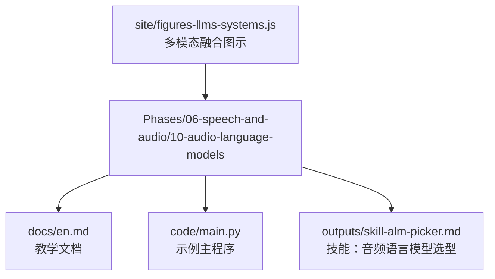
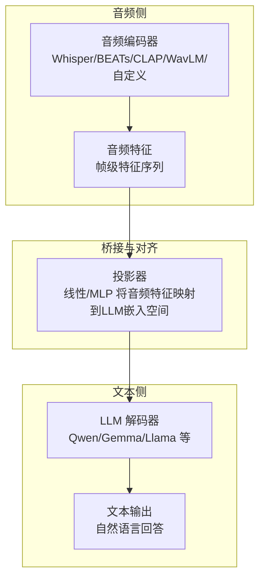
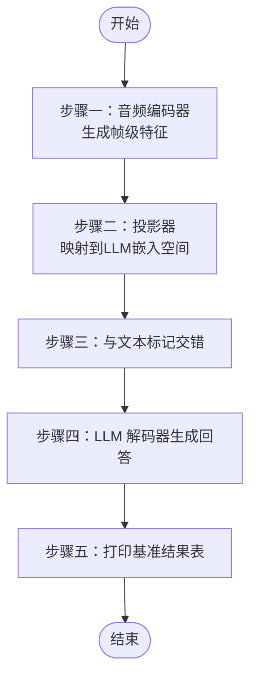
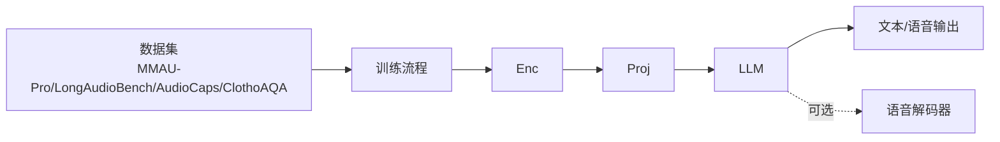
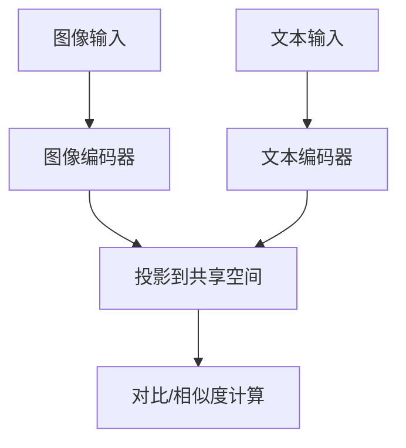

# 音频语言模型

<cite>
**本文引用的文件**   
- [音频语言模型文档（英文）](file://phases/06-speech-and-audio/10-audio-language-models/docs/en.md)
- [示例主程序](file://phases/06-speech-and-audio/10-audio-language-models/code/main.py)
- [技能：音频语言模型选型](file://phases/06-speech-and-audio/10-audio-language-models/outputs/skill-alm-picker.md)
- [多模态融合图示（系统图）](file://site/figures-llms-systems.js)
- [路线图（Phase 6）](file://ROADMAP.md)
- [课程总览（Phase 6）](file://README.md)
</cite>

## 目录
1. [引言](#引言)
2. [项目结构](#项目结构)
3. [核心组件](#核心组件)
4. [架构总览](#架构总览)
5. [详细组件分析](#详细组件分析)
6. [依赖关系分析](#依赖关系分析)
7. [性能考量](#性能考量)
8. [故障排查指南](#故障排查指南)
9. [结论](#结论)
10. [附录](#附录)

## 引言
本课程围绕“音频语言模型”（Audio-Language Model，简称 LALM/ALM）展开，系统讲解其概念、架构、训练范式与典型应用。重点覆盖以下主题：
- 多模态交互场景：音频描述、音频问答、音频对话、语音输入/输出代理等
- 技术挑战：时序建模、多分辨率特征、跨模态对齐与投影
- 从零实现：音频编码器、文本解码器、交叉注意力/投影桥接等核心组件
- 下游任务：音频理解（分类、事件检测、情感分析）、音频-文本对齐、音频检索、音频生成
- 评估与基准：MMAU-Pro、LongAudioBench 等指标与方法

## 项目结构
本仓库中与“音频语言模型”直接相关的内容集中在 Phase 6 的第 10 课“Audio-Language Models”。该课提供：
- 教学文档：包含问题定义、概念拆解、三段式模板、训练阶段、模型地图、基准评测现状与建议
- 示例代码：一个最小可运行骨架，演示“音频编码 → 投影 → 文本解码”的数据流
- 技能输出：面向实际工程的“模型选型与落地守则”，含基准子集、输出模态、护栏与升级策略

**图表来源**
- [音频语言模型文档（英文）:1-187](file://phases/06-speech-and-audio/10-audio-language-models/docs/en.md#L1-L187)
- [示例主程序:1-86](file://phases/06-speech-and-audio/10-audio-language-models/code/main.py#L1-L86)
- [技能：音频语言模型选型:1-28](file://phases/06-speech-and-audio/10-audio-language-models/outputs/skill-alm-picker.md#L1-L28)
- [多模态融合图示（系统图）:417-482](file://site/figures-llms-systems.js#L417-L482)

**章节来源**
- [路线图（Phase 6）:163-183](file://ROADMAP.md#L163-L183)
- [课程总览（Phase 6）:421-443](file://README.md#L421-L443)

## 核心组件
音频语言模型遵循“三段式模板”：
- 音频编码器：提取音频特征（如 Whisper 编码器、BEATs、CLAP、WavLM 或自定义）
- 投影桥接（Projector）：将音频特征映射到大语言模型的嵌入空间
- 文本解码器（LLM）：接收交错的文本与音频标记序列，生成自然语言回答

训练流程分为三个阶段：
- 阶段一：冻结编码器与 LLM，仅训练投影器（预训练任务：ASR/字幕数据）
- 阶段二：全量或 LoRA 微调，指令跟随任务（问答、推理、音乐理解）
- 阶段三（可选）：加入语音解码器，实现“语音输入/语音输出”的端到端代理

**章节来源**
- [音频语言模型文档（英文）:25-38](file://phases/06-speech-and-audio/10-audio-language-models/docs/en.md#L25-L38)

## 架构总览
下图展示“音频语言模型”的通用架构：音频编码器 → 投影桥接 → LLM 解码器；并以多模态融合视角说明“早期融合 vs 晚期融合”的对比。

**图表来源**
- [音频语言模型文档（英文）:25-38](file://phases/06-speech-and-audio/10-audio-language-models/docs/en.md#L25-L38)
- [多模态融合图示（系统图）:417-482](file://site/figures-llms-systems.js#L417-L482)

## 详细组件分析

### 组件一：音频编码器（Audio Encoder）
- 输入：原始波形或梅尔谱等音频表示
- 输出：按时间步排列的特征向量序列（帧级特征）
- 典型方案：Whisper 编码器（用于语音/字幕）、BEATs（环境声/音乐）、CLAP（对比学习特征）、WavLM（自监督）

在示例中，我们用一个“假编码器”模拟 3 秒音频产生固定维度的帧序列，便于理解后续投影与解码流程。

**章节来源**
- [示例主程序:14-17](file://phases/06-speech-and-audio/10-audio-language-models/code/main.py#L14-L17)
- [音频语言模型文档（英文）](file://phases/06-speech-and-audio/10-audio-language-models/docs/en.md#L29)

### 组件二：投影桥接（Projector）
- 目标：将音频特征映射到与 LLM 嵌入空间一致的维度
- 结构：通常由 1–3 层线性层组成，激活函数（如 GELU）提升非线性能力
- 训练：先在 ASR/字幕数据上仅训练投影器，再进行指令跟随微调

示例中展示了“假投影器”的前向计算逻辑，帮助理解矩阵乘与逐元素激活的流程。

**章节来源**
- [示例主程序:20-28](file://phases/06-speech-and-audio/10-audio-language-models/code/main.py#L20-L28)
- [音频语言模型文档（英文）:106-122](file://phases/06-speech-and-audio/10-audio-language-models/docs/en.md#L106-L122)

### 组件三：文本解码器（LLM）
- 接收：交错的“音频标记 + 文本标记”序列
- 生成：基于上下文的因果解码，输出自然语言回答
- 可扩展：在阶段三引入语音解码器，实现“语音输入/语音输出”的端到端代理

示例中通过“假 LLM 回答”函数模拟解码器的输出行为。

**章节来源**
- [示例主程序:35-38](file://phases/06-speech-and-audio/10-audio-language-models/code/main.py#L35-L38)
- [音频语言模型文档（英文）](file://phases/06-speech-and-audio/10-audio-language-models/docs/en.md#L31)

### 组件四：训练流程（阶段化）
- 阶段一：冻结编码器与 LLM，仅训练投影器（预训练）
- 阶段二：全量/LoRA 微调，指令跟随（QA/推理/音乐理解）
- 阶段三（可选）：加入语音解码器，构建语音原生代理

**章节来源**
- [音频语言模型文档（英文）:33-37](file://phases/06-speech-and-audio/10-audio-language-models/docs/en.md#L33-L37)

### 组件五：基准与评估
- MMAU-Pro：覆盖语音/声音/音乐/混合的 1800 条 QA，强调多音频推理
- LongAudioBench：长音频语义查询评测
- 实践建议：按类别分别报告（语音/声音/音乐/多音频），避免聚合掩盖短板

**章节来源**
- [音频语言模型文档（英文）:53-66](file://phases/06-speech-and-audio/10-audio-language-models/docs/en.md#L53-L66)
- [音频语言模型文档（英文）:124-138](file://phases/06-speech-and-audio/10-audio-language-models/docs/en.md#L124-L138)

### 组件六：从零实现（代码骨架）
示例主程序提供了完整的“骨架流程”：
- 步骤一：编码 3 秒音频 → 特征（帧级）
- 步骤二：投影 → LLM 嵌入空间
- 步骤三：与文本标记交错
- 步骤四：解码器生成回答
- 步骤五：打印基准结果表（MMAU-Pro）

**图表来源**
- [示例主程序:41-82](file://phases/06-speech-and-audio/10-audio-language-models/code/main.py#L41-L82)

**章节来源**
- [示例主程序:1-86](file://phases/06-speech-and-audio/10-audio-language-models/code/main.py#L1-L86)

### 组件七：工程选型与落地守则（技能）
技能输出“alm-picker”给出面向任务的选型清单与护栏：
- 模型选择：根据任务类型（语音/声音/音乐/多音频/长音频）与许可/输出模态（文本/语音）挑选合适模型
- 基准子集：针对任务轴选择对应评测集合（如 MMAU-Pro 的语音/声音/音乐/多音频）
- 输出模态：是否需要语音输出（如 Qwen2.5-Omni/GPT-4o Audio）
- 护栏：拒绝多音频比较类任务（若模型多音频分数低于阈值）；长音频需先做说话人分割
- 升级策略：当 LALM 不是最佳方案时，回退到专用模型（Whisper/分类/BERT/说话人分割）

**章节来源**
- [技能：音频语言模型选型:10-27](file://phases/06-speech-and-audio/10-audio-language-models/outputs/skill-alm-picker.md#L10-L27)

## 依赖关系分析
- 组件耦合
  - 音频编码器与投影器：强耦合（特征维度需匹配）
  - 投影器与 LLM：弱耦合（仅需嵌入维度一致）
  - LLM 与语音解码器（可选）：独立模块，通过共享嵌入空间实现端到端语音输入/输出
- 外部依赖
  - 数据集：MMAU-Pro、LongAudioBench、AudioCaps、ClothoAQA
  - 开源模型：Qwen2.5-Omni、Audio Flamingo Next、SALMONN、LTU、GAMA 等
  - 工具链：Hugging Face Transformers、Datasets、PyTorch 等

**图表来源**
- [音频语言模型文档（英文）:33-37](file://phases/06-speech-and-audio/10-audio-language-models/docs/en.md#L33-L37)
- [技能：音频语言模型选型:10-16](file://phases/06-speech-and-audio/10-audio-language-models/outputs/skill-alm-picker.md#L10-L16)

**章节来源**
- [音频语言模型文档（英文）:33-37](file://phases/06-speech-and-audio/10-audio-language-models/docs/en.md#L33-L37)
- [技能：音频语言模型选型:10-16](file://phases/06-speech-and-audio/10-audio-language-models/outputs/skill-alm-picker.md#L10-L16)

## 性能考量
- 多音频推理接近随机（约 22–26%），需谨慎使用
- 长音频（>10 分钟）的说话人归因能力下降，建议先做说话人分割再总结
- 静默区域可能引发幻觉，建议采用 VAD 进行门控
- 基准选择需细粒度：不要仅看整体分数，关注语音/声音/音乐/多音频的拆分表现

**章节来源**
- [音频语言模型文档（英文）:66-81](file://phases/06-speech-and-audio/10-audio-language-models/docs/en.md#L66-L81)
- [音频语言模型文档（英文）:151-156](file://phases/06-speech-and-audio/10-audio-language-models/docs/en.md#L151-L156)

## 故障排查指南
- 多音频比较任务失败
  - 现象：多音频子集准确率低
  - 处理：拒绝此类任务或提升模型/数据质量
- 长音频推理退化
  - 现象：超过 10 分钟后说话人归属错误增多
  - 处理：先做说话人分割，再对每段进行摘要/问答
- 静默区域幻觉
  - 现象：无明确语音时出现不实描述
  - 处理：启用 VAD 门控，过滤静音片段
- 基准选择偏差
  - 现象：供应商报告与实际不符
  - 处理：独立复测关键子集（尤其是多音频）

**章节来源**
- [音频语言模型文档（英文）:151-156](file://phases/06-speech-and-audio/10-audio-language-models/docs/en.md#L151-L156)

## 结论
音频语言模型以“音频编码器 + 投影桥接 + 文本解码器”的三段式模板为核心，结合阶段化训练策略，在语音/声音/音乐理解与问答方面取得显著进展。当前仍面临多音频推理与长音频稳定性等挑战。工程实践中应依据任务特性选择合适的模型与基准，并建立护栏与升级策略，确保在真实场景中安全可靠地交付。

## 附录

### 附录A：典型多模态融合方式（参考）
- 早期融合：将图像与文本标记拼接为单一序列，联合建模
- 晚期融合：分别编码后投影到同一空间，最后进行对比/相似度计算

**图表来源**
- [多模态融合图示（系统图）:417-482](file://site/figures-llms-systems.js#L417-L482)

### 附录B：课程与资源索引
- Phase 6 课程总览与时间安排
- 音频语言模型课程页面与技能输出

**章节来源**
- [路线图（Phase 6）:163-183](file://ROADMAP.md#L163-L183)
- [课程总览（Phase 6）:421-443](file://README.md#L421-L443)
- [技能：音频语言模型选型:1-28](file://phases/06-speech-and-audio/10-audio-language-models/outputs/skill-alm-picker.md#L1-L28)