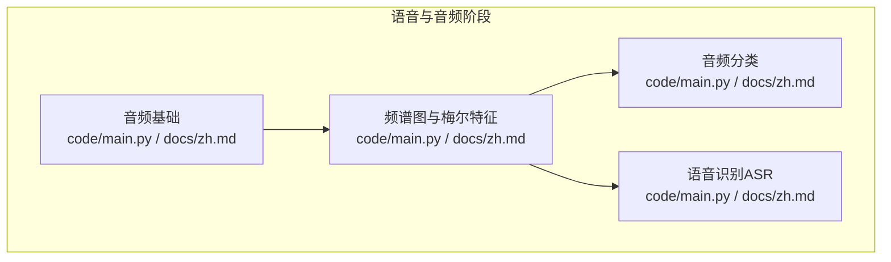
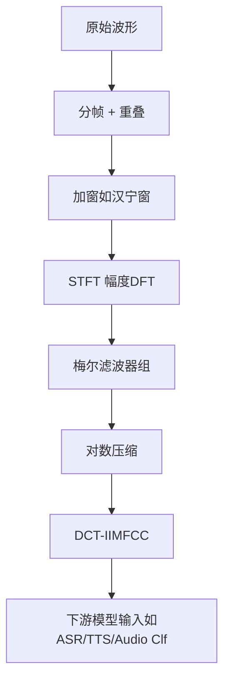
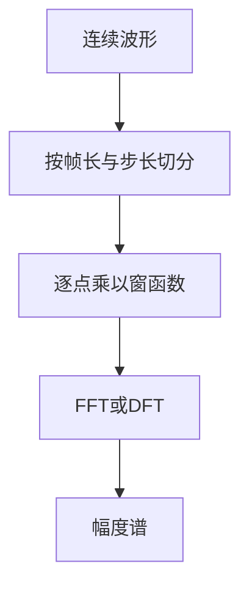
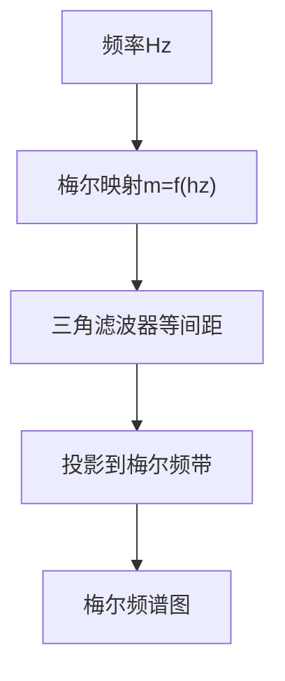
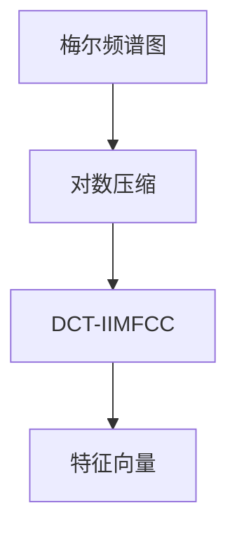
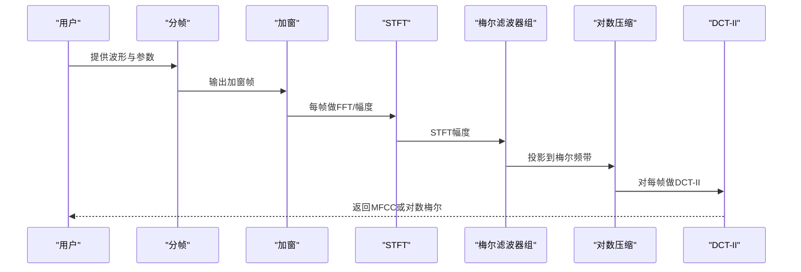
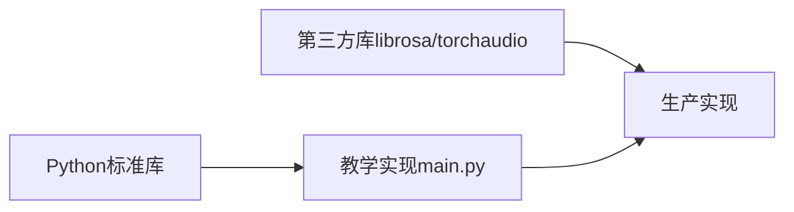

# 频谱图与梅尔特征

<cite>
**本文引用的文件**
- [phases/06-speech-and-audio/02-spectrograms-mel-features/code/main.py](file://phases/06-speech-and-audio/02-spectrograms-mel-features/code/main.py)
- [phases/06-speech-and-audio/02-spectrograms-mel-features/docs/zh.md](file://phases/06-speech-and-audio/02-spectrograms-mel-features/docs/zh.md)
- [phases/06-speech-and-audio/01-audio-fundamentals/code/main.py](file://phases/06-speech-and-audio/01-audio-fundamentals/code/main.py)
- [phases/06-speech-and-audio/01-audio-fundamentals/docs/zh.md](file://phases/06-speech-and-audio/01-audio-fundamentals/docs/zh.md)
- [phases/06-speech-and-audio/03-audio-classification/code/main.py](file://phases/06-speech-and-audio/03-audio-classification/code/main.py)
- [phases/06-speech-and-audio/04-speech-recognition-asr/code/main.py](file://phases/06-speech-and-audio/04-speech-recognition-asr/code/main.py)
- [requirements.txt](file://requirements.txt)
</cite>

## 目录
1. [简介](#简介)
2. [项目结构](#项目结构)
3. [核心组件](#核心组件)
4. [架构总览](#架构总览)
5. [详细组件分析](#详细组件分析)
6. [依赖分析](#依赖分析)
7. [性能考虑](#性能考虑)
8. [故障排查指南](#故障排查指南)
9. [结论](#结论)
10. [附录](#附录)

## 简介
本课程围绕“频谱图与梅尔特征”展开，目标是帮助读者从零实现完整的音频前端：短时傅里叶变换（STFT）、窗函数与重叠策略、梅尔刻度与滤波器组、对数压缩、以及梅尔频谱图与MFCC等特征的生成流程。课程强调工程落地与生产一致性，给出可直接运行的最小实现，并结合ASR/TTS/音频分类等场景的应用建议与常见陷阱。

## 项目结构
本课程位于“语音与音频”阶段，包含三门子课程与配套代码：
- 音频基础：采样、DFT、混叠演示与波形读写
- 频谱图、梅尔尺度与音频特征：从零实现STFT、梅尔滤波器组、对数压缩与MFCC
- 音频分类：基于k-NN与均值方差池化MFCC的基线
- 语音识别（ASR）：CTC解码与WER评估

**图表来源**
- [phases/06-speech-and-audio/01-audio-fundamentals/code/main.py:1-129](file://phases/06-speech-and-audio/01-audio-fundamentals/code/main.py#L1-L129)
- [phases/06-speech-and-audio/02-spectrograms-mel-features/code/main.py:1-166](file://phases/06-speech-and-audio/02-spectrograms-mel-features/code/main.py#L1-L166)
- [phases/06-speech-and-audio/03-audio-classification/code/main.py:1-179](file://phases/06-speech-and-audio/03-audio-classification/code/main.py#L1-L179)
- [phases/06-speech-and-audio/04-speech-recognition-asr/code/main.py:1-156](file://phases/06-speech-and-audio/04-speech-recognition-asr/code/main.py#L1-L156)

**章节来源**
- [phases/06-speech-and-audio/README.md:1-6](file://phases/06-speech-and-audio/README.md#L1-L6)

## 核心组件
- 分帧与加窗：将连续波形切分为重叠帧，并乘以窗函数（如汉宁窗）以减少频谱泄漏
- STFT幅度：对每帧进行DFT（此处为教学版DFT，生产环境使用FFT）
- 梅尔滤波器组：在梅尔刻度上等间距布置三角滤波器，将STFT幅度投影到梅尔频带
- 对数压缩：对梅尔谱取对数，压缩动态范围
- MFCC：对每帧对数梅尔谱做DCT-II，保留前若干系数作为特征
- 变体与扩展：介绍LFCC等其他频谱特征思路（概念性）

上述组件在“频谱图与梅尔特征”课程的代码中均有完整实现，且通过示例输出展示关键指标（如峰值bin、梅尔滤波器宽度、MFCC系数等）。

**章节来源**
- [phases/06-speech-and-audio/02-spectrograms-mel-features/code/main.py:43-166](file://phases/06-speech-and-audio/02-spectrograms-mel-features/code/main.py#L43-L166)
- [phases/06-speech-and-audio/02-spectrograms-mel-features/docs/zh.md:22-121](file://phases/06-speech-and-audio/02-spectrograms-mel-features/docs/zh.md#L22-L121)

## 架构总览
从原始波形到最终特征的端到端流程如下：

**图表来源**
- [phases/06-speech-and-audio/02-spectrograms-mel-features/code/main.py:43-166](file://phases/06-speech-and-audio/02-spectrograms-mel-features/code/main.py#L43-L166)

## 详细组件分析

### STFT与窗函数
- 分帧策略：固定帧长度与步长，步长通常为帧长的一定比例（如10ms步长对应25ms帧长在16kHz采样率下）
- 窗函数：汉宁窗是最常用的选择，能有效抑制截断带来的频谱泄漏
- 幅度谱：对每帧做DFT（教学版实现为纯循环，生产环境使用FFT）

**图表来源**
- [phases/06-speech-and-audio/02-spectrograms-mel-features/code/main.py:43-54](file://phases/06-speech-and-audio/02-spectrograms-mel-features/code/main.py#L43-L54)

**章节来源**
- [phases/06-speech-and-audio/02-spectrograms-mel-features/code/main.py:43-54](file://phases/06-speech-and-audio/02-spectrograms-mel-features/code/main.py#L43-L54)
- [phases/06-speech-and-audio/02-spectrograms-mel-features/docs/zh.md:22-34](file://phases/06-speech-and-audio/02-spectrograms-mel-features/docs/zh.md#L22-L34)

### 梅尔刻度与滤波器组
- 梅尔刻度：m = 2595·log10(1 + f/700)，在低频近似线性、高频近似对数，贴合人类听觉感知
- 滤波器组：在梅尔刻度上等间距布置三角滤波器，每个滤波器是相邻FFT bin的加权和
- 梅尔谱：将STFT幅度与滤波器组矩阵相乘，得到每帧的梅尔能量

**图表来源**
- [phases/06-speech-and-audio/02-spectrograms-mel-features/code/main.py:56-97](file://phases/06-speech-and-audio/02-spectrograms-mel-features/code/main.py#L56-L97)

**章节来源**
- [phases/06-speech-and-audio/02-spectrograms-mel-features/code/main.py:56-97](file://phases/06-speech-and-audio/02-spectrograms-mel-features/code/main.py#L56-L97)
- [phases/06-speech-and-audio/02-spectrograms-mel-features/docs/zh.md:26-30](file://phases/06-speech-and-audio/02-spectrograms-mel-features/docs/zh.md#L26-L30)

### 对数压缩与MFCC
- 对数压缩：log(mel_spec + ε)，压缩动态范围，Whisper等主流模型采用
- MFCC：对每帧对数梅尔谱做DCT-II，保留前若干系数（如13），常用于说话人识别与早期ASR

**图表来源**
- [phases/06-speech-and-audio/02-spectrograms-mel-features/code/main.py:100-166](file://phases/06-speech-and-audio/02-spectrograms-mel-features/code/main.py#L100-L166)

**章节来源**
- [phases/06-speech-and-audio/02-spectrograms-mel-features/code/main.py:100-166](file://phases/06-speech-and-audio/02-spectrograms-mel-features/code/main.py#L100-L166)
- [phases/06-speech-and-audio/02-spectrograms-mel-features/docs/zh.md:30-32](file://phases/06-speech-and-audio/02-spectrograms-mel-features/docs/zh.md#L30-L32)

### 从零实现梅尔频谱图生成器（步骤清单）
- 步骤1：分帧与重叠
- 步骤2：汉宁窗加窗
- 步骤3：STFT幅度（DFT）
- 步骤4：梅尔滤波器组
- 步骤5：对数压缩
- 步骤6：MFCC（可选）

**图表来源**
- [phases/06-speech-and-audio/02-spectrograms-mel-features/code/main.py:43-166](file://phases/06-speech-and-audio/02-spectrograms-mel-features/code/main.py#L43-L166)

**章节来源**
- [phases/06-speech-and-audio/02-spectrograms-mel-features/docs/zh.md:40-121](file://phases/06-speech-and-audio/02-spectrograms-mel-features/docs/zh.md#L40-L121)

### 频谱特征在语音识别与音频分类中的应用
- ASR（Whisper、Parakeet、SeamlessM4T）：80个对数梅尔，10ms步长，25ms窗
- TTS声学模型（VITS、F5-TTS、Kokoro）：80个梅尔，5–12ms步长以精细时间控制
- 音频分类（AST、PANNs、BEATs）：128个对数梅尔，10ms步长
- 说话人嵌入（ECAPA-TDNN、WavLM）：80个对数梅尔或自监督波形
- 音乐（MusicGen、Stable Audio 2）：EnCodec离散token（非梅尔）
- 关键词检测：40个MFCC（小设备友好）

**章节来源**
- [phases/06-speech-and-audio/02-spectrograms-mel-features/docs/zh.md:122-135](file://phases/06-speech-and-audio/02-spectrograms-mel-features/docs/zh.md#L122-L135)

### 音频基础与混叠演示（前置知识）
- 采样定理与奈奎斯特频率：采样率必须大于两倍最高频率
- 混叠现象：高于奈奎斯特的频率折叠回低频
- DFT与FFT：教学版DFT用于理解，生产环境使用FFT

**章节来源**
- [phases/06-speech-and-audio/01-audio-fundamentals/code/main.py:42-124](file://phases/06-speech-and-audio/01-audio-fundamentals/code/main.py#L42-L124)
- [phases/06-speech-and-audio/01-audio-fundamentals/docs/zh.md:26-47](file://phases/06-speech-and-audio/01-audio-fundamentals/docs/zh.md#L26-L47)

### 音频分类基线（k-NN + MFCC池化）
- 使用均值+方差池化后的MFCC作为样本特征
- k-NN分类器进行基准评估
- 展示从原始波形到分类特征的完整链路

**章节来源**
- [phases/06-speech-and-audio/03-audio-classification/code/main.py:97-179](file://phases/06-speech-and-audio/03-audio-classification/code/main.py#L97-L179)

### ASR基础（CTC解码与WER）
- 手写CTC贪婪解码与简化解码束搜索
- Word错误率（WER）计算
- 展示特征（如对数梅尔）与解码器的衔接

**章节来源**
- [phases/06-speech-and-audio/04-speech-recognition-asr/code/main.py:16-156](file://phases/06-speech-and-audio/04-speech-recognition-asr/code/main.py#L16-L156)

## 依赖分析
- 课程代码仅使用Python标准库（math、wave、struct、tempfile等），便于离线学习与无依赖运行
- 生产环境推荐使用第三方库（如librosa、torchaudio）以获得高性能FFT、重采样与特征提取能力

**图表来源**
- [phases/06-speech-and-audio/02-spectrograms-mel-features/code/main.py:1-10](file://phases/06-speech-and-audio/02-spectrograms-mel-features/code/main.py#L1-L10)
- [requirements.txt:1-18](file://requirements.txt#L1-L18)

**章节来源**
- [requirements.txt:1-18](file://requirements.txt#L1-L18)

## 性能考虑
- FFT与向量化：使用FFT替代手工DFT，显著降低时间复杂度
- 内存管理：分帧处理避免一次性加载整段音频；及时释放中间变量
- 窗函数与滤波器组：预计算并缓存滤波器组矩阵，避免重复计算
- 归一化与稳定性：对数压缩加入epsilon，防止log(0)；对梅尔滤波器组权重进行数值稳定处理
- 并行化：批处理多段音频，利用GPU加速（如使用torchaudio/PyTorch）

[本节为通用指导，无需特定文件引用]

## 故障排查指南
- 梅尔数量不匹配：训练与推理使用不同数量的梅尔会导致静默失败，需在两端记录特征形状
- 采样率不一致：在特征提取前统一采样率，避免在22.05kHz计算的梅尔与16kHz不一致
- dB与对数混淆：Whisper期望对数梅尔而非dB梅尔，注意上游库的默认行为
- 归一化漂移：训练时按话语归一化，推理时使用全局归一化，避免WER翻倍
- 填充导致的频谱泄漏：在片段末尾补零会在末帧产生平坦频谱，应采用对称填充或复制边缘

**章节来源**
- [phases/06-speech-and-audio/02-spectrograms-mel-features/docs/zh.md:137-144](file://phases/06-speech-and-audio/02-spectrograms-mel-features/docs/zh.md#L137-L144)

## 结论
本课程提供了从零实现频谱图与梅尔特征的完整路径，涵盖STFT、窗函数、梅尔滤波器组、对数压缩与MFCC等关键步骤。通过对比音频基础与ASR/分类应用场景，读者可以建立从理论到工程落地的完整认知，并掌握生产环境中的常见陷阱与优化策略。

[本节为总结性内容，无需特定文件引用]

## 附录

### 术语对照
- 帧：25ms波形片段，送入一个FFT
- 步长：连续帧之间的样本数；10ms是ASR默认值
- 窗函数：汉宁/汉明等，逐点乘子，将帧边缘渐变为零
- STFT：频谱图生成器，加窗分帧FFT，产生时间×频率矩阵
- 梅尔：对数感知尺度；m = 2595·log10(1 + f/700)
- 滤波器组：将STFT投影到梅尔bins的三角滤波器矩阵
- 对数梅尔：Whisper的输入；log(mel_spec + ε)
- MFCC：对数梅尔的DCT；13个系数，去相关

**章节来源**
- [phases/06-speech-and-audio/02-spectrograms-mel-features/docs/zh.md:155-166](file://phases/06-speech-and-audio/02-spectrograms-mel-features/docs/zh.md#L155-L166)