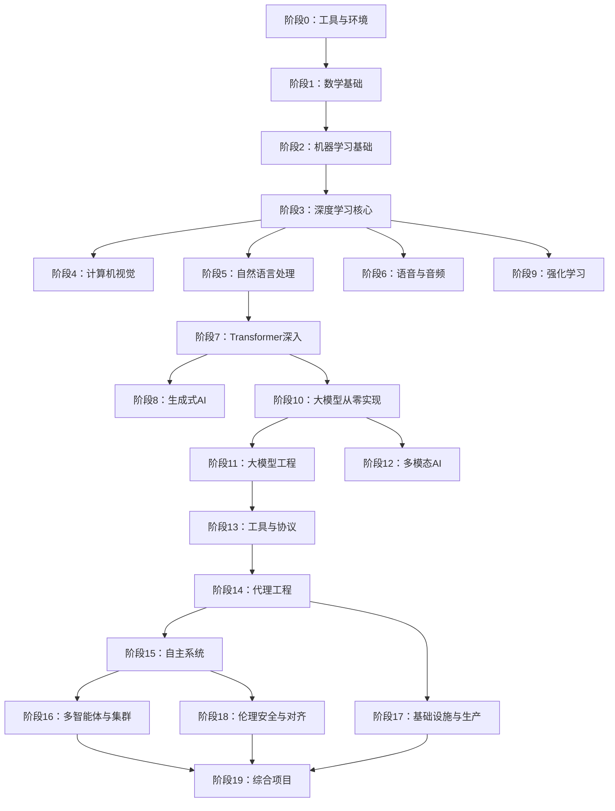
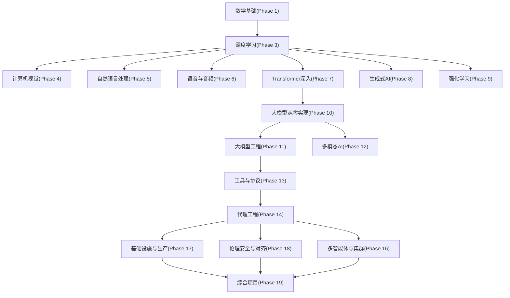

# 课程体系详解

<cite>
**本文档引用的文件**
- [README.md](file://README.md)
- [ROADMAP.md](file://ROADMAP.md)
- [LESSON_TEMPLATE.md](file://LESSON_TEMPLATE.md)
- [CONTRIBUTING.md](file://CONTRIBUTING.md)
- [study_progress.md](file://memory/study_progress.md)
- [dev-environment/docs/en.md](file://phases/00-setup-and-tooling/01-dev-environment/docs/en.md)
- [linear-algebra-intuition/docs/en.md](file://phases/01-math-foundations/01-linear-algebra-intuition/docs/en.md)
- [the-agent-loop/docs/en.md](file://phases/14-agent-engineering/01-the-agent-loop/docs/en.md)
- [terminal-native-coding-agent/docs/en.md](file://phases/19-capstone-projects/01-terminal-native-coding-agent/docs/en.md)
</cite>

## 目录
1. [引言](#引言)
2. [项目结构](#项目结构)
3. [核心组件](#核心组件)
4. [架构总览](#架构总览)
5. [详细组件分析](#详细组件分析)
6. [依赖分析](#依赖分析)
7. [性能考虑](#性能考虑)
8. [故障排除指南](#故障排除指南)
9. [结论](#结论)
10. [附录](#附录)

## 引言
本课程体系面向“AI工程从零开始”的完整学习路径，覆盖20个学习阶段（Phase 0–Phase 19），总计503门课程与项目，总时长约320小时。课程采用统一的“构建它/使用它”学习循环，强调从零实现到生产库使用的双重路径，确保学习者不仅“知道如何调用API”，更能“理解框架内部原理”。课程结构由code/docs/outputs三个子目录构成，每门课程产出可复用的工具（提示词、技能、代理、MCP服务器等），形成可交付的知识资产。

## 项目结构
课程以“阶段-课程”两级目录组织，每个课程遵循统一模板，包含以下标准结构：
- code/：可运行的实现（支持Python、TypeScript、Rust、Julia）
- docs/：课程文档（英文为主，部分课程提供多语言版本）
- outputs/：课程产出物（提示词、技能、代理、MCP服务器等）

课程类型分为两类：
- Learn：侧重概念讲解与理论推导
- Build：强调从零实现与动手实践

课程语言使用情况：
- Phase 0：Python、Node.js、Rust（环境搭建）
- Phase 1：Python、Julia（数学基础）
- Phase 2–Phase 12：Python为主
- Phase 13–Phase 17：TypeScript为主（工具协议、代理工程、基础设施）
- Phase 12、Phase 15–Phase 17：Rust（高性能系统）
- 其他阶段：根据主题选择最合适的语言

章节来源
- [README.md:87-112](file://README.md#L87-L112)
- [LESSON_TEMPLATE.md:5-21](file://LESSON_TEMPLATE.md#L5-L21)
- [CONTRIBUTING.md:29-38](file://CONTRIBUTING.md#L29-L38)

## 核心组件
- 课程标准结构
  - code/：包含主实现文件（如main.py/ts/rs/jl），必要时提供notebook/实验笔记本
  - docs/en.md：课程文档，包含问题背景、概念解释、从零实现、框架对比、产出物、练习与术语表
  - outputs/：课程产物（提示词、技能等），按固定格式命名与标注
- “构建它/使用它”学习循环
  - 构建它：从数学/算法出发，不依赖框架，手写实现
  - 使用它：用现有库或框架重做一遍，验证一致性并引入工程化工具
- 课程导航与进度跟踪
  - 通过README中的“Contents”快速定位阶段与课程
  - 通过ROADMAP.md查看各阶段与课程的状态与预估时长
  - 通过memory/study_progress.md进行跨终端、跨会话的进度同步

章节来源
- [README.md:87-112](file://README.md#L87-L112)
- [LESSON_TEMPLATE.md:23-94](file://LESSON_TEMPLATE.md#L23-L94)
- [ROADMAP.md:7-10](file://ROADMAP.md#L7-L10)
- [study_progress.md:1-10](file://memory/study_progress.md#L1-L10)

## 架构总览
课程体系采用线性递进的阶段化设计，从“工具与环境”起步，逐步深入数学基础、机器学习、深度学习、计算机视觉、自然语言处理、语音音频、强化学习、生成式AI、大模型从零实现、大模型工程、多模态、工具与协议、代理工程、自主系统、多智能体与集群、基础设施与生产、伦理安全与对齐，最终以“综合项目”收束。

图表来源
- [README.md:57-81](file://README.md#L57-L81)

章节来源
- [README.md:51-81](file://README.md#L51-L81)

## 详细组件分析

### 阶段0：工具与环境（12课）
- 学习目标：搭建Python/Node.js/Rust/Julia工具链，配置虚拟环境与包管理器，验证GPU/CPU可用性，理解四层技术栈（系统→包管理→语言运行时→AI库）。
- 关键课程：开发环境搭建、Git协作、GPU与云服务、API密钥、Jupyter笔记本、Python环境、Docker、编辑器、数据管理、终端与Shell、Linux、调试与性能分析。
- 产出：环境验证脚本、诊断提示词。

章节来源
- [README.md:247-265](file://README.md#L247-L265)
- [dev-environment/docs/en.md:10-16](file://phases/00-setup-and-tooling/01-dev-environment/docs/en.md#L10-L16)

### 阶段1：数学基础（22课）
- 学习目标：掌握线性代数、微积分、概率统计、优化、信息论、降维、张量、数值稳定性、范数距离、采样、线性系统、凸优化、复数、傅里叶变换、图论、随机过程等。
- 特色：以几何直觉解释向量、矩阵、投影、正交基与QR分解，连接AI应用（嵌入、注意力、LoRA）。
- 产出：线性代数教学提示词、几何直观演示。

章节来源
- [README.md:266-294](file://README.md#L266-L294)
- [linear-algebra-intuition/docs/en.md:10-16](file://phases/01-math-foundations/01-linear-algebra-intuition/docs/en.md#L10-L16)

### 阶段2：机器学习基础（18课）
- 学习目标：回归、分类、决策树、SVM、KNN、无监督学习、特征工程、模型评估、偏差-方差权衡、集成方法、超参数调优、ML流水线、朴素贝叶斯、时间序列、异常检测、不平衡数据、特征选择。
- 产出：可复用的提示词与技能，贯穿LLM工程与生产应用。

章节来源
- [README.md:297-322](file://README.md#L297-L322)

### 阶段3：深度学习核心（13课）
- 学习目标：感知机、多层网络、反向传播、激活函数、损失函数、优化器、正则化、权重初始化、学习率调度、自研小框架、PyTorch入门、JAX入门、神经网络调试。
- 产出：最小框架、训练与推理脚本、调试技巧。

章节来源
- [README.md:324-344](file://README.md#L324-L344)

### 阶段4：计算机视觉（28课）
- 学习目标：像素与通道、卷积、CNN发展、图像分类、迁移学习、YOLO、语义分割、实例分割、GAN、扩散模型、Stable Diffusion、视频理解、3D视觉、ViT、边缘部署、完整管线、自监督、开放词汇、OCR、检索、姿态估计、高斯点云、扩散Transformer、SAM3、视觉语言模型、单目深度、多目标跟踪、世界模型。
- 产出：视觉任务提示词、技能与MCP服务器。

章节来源
- [README.md:346-381](file://README.md#L346-L381)

### 阶段5：自然语言处理（29课）
- 学习目标：文本预处理、词袋与TF-IDF、词嵌入、情感分析、命名实体识别、句法解析、CNN/RNN文本分类、序列到序列、注意力机制、机器翻译、摘要、问答、信息检索、主题建模、预Transformer文本生成、聊天机器人、多语言、子词分词、结构化输出与约束解码、NLI、嵌入模型深潜、RAG分块策略、共指消解、实体链接、关系抽取、LLM评估框架、长上下文评估、对话状态跟踪。
- 产出：RAG提示词、结构化输出模板、评估脚本。

章节来源
- [README.md:383-418](file://README.md#L383-L418)

### 阶段6：语音与音频（17课）
- 学习目标：波形与采样、梅尔频谱、音频分类、ASR、Whisper架构与微调、说话人识别与验证、TTS、声音克隆与转换、音乐生成、音语模型、实时音频处理、语音助手流水线、神经音频编解码、语音活动检测与轮流、流式语音到语音、反欺骗与水印、音频评估指标。
- 产出：语音助手技能、音频评估提示词。

章节来源
- [README.md:421-444](file://README.md#L421-L444)

### 阶段7：Transformer深入（14课）
- 学习目标：RNN局限、自注意力、多头注意力、位置编码、全Transformer、BERT掩码语言建模、GPT因果语言建模、Encoder-Decoder（T5/BART）、ViT、音频Transformer（Whisper）、MoE、KV缓存与Flash Attention、缩放定律、Transformer从零实现、注意力变体、推测式解码。
- 产出：注意力可视化、推理优化提示词。

章节来源
- [README.md:447-470](file://README.md#L447-L470)

### 阶段8：生成式AI（14课）
- 学习目标：生成模型分类与历史、自编码器与VAE、GAN、条件GAN与Pix2Pix、StyleGAN、DDPM从零扩散、潜在扩散与Stable Diffusion、控制与微调、修复与编辑、视频生成、音频生成、3D生成、流匹配与修正流、评估指标（FID、CLIP Score）、视觉自回归VAR。
- 产出：生成提示词、评估脚本。

章节来源
- [README.md:472-494](file://README.md#L472-L494)

### 阶段9：强化学习（12课）
- 学习目标：MDP、动态规划、蒙特卡洛、Q学习与SARSA、DQN、REINFORCE、A2C/A3C、PPO、奖励建模与RLHF、多智能体RL、仿真到现实迁移、游戏RL。
- 产出：RL训练与评估脚本。

章节来源
- [README.md:496-515](file://README.md#L496-L515)

### 阶段10：大模型从零实现（22课）
- 学习目标：分词器（BPE/WordPiece/SentencePiece）、从零构建分词器、预训练数据流水线、Mini GPT（124M）预训练、分布式训练（FSDP/DeepSpeed）、指令微调（SFT）、RLHF（奖励模型+PPO）、DPO、宪法AI与自我改进、评估（基准与评测）、量化（INT8/GPTQ/AWQ/GGUF）、推理优化、完整LLM流水线、开源模型架构解读、推测式解码（EAGLE-3/EAGLE）、差分注意力、原生稀疏注意力、多令牌预测、双管道并行、DeepSeek-V3、Jamba混合SSM-Transformer、异步与Hogwild推理、梯度检查点。
- 产出：分词器、训练/评估脚本、量化与推理优化工具。

章节来源
- [README.md:517-548](file://README.md#L517-L548)

### 阶段11：大模型工程（17课）
- 学习目标：提示词工程、少样本与思维链、结构化输出、嵌入与向量表示、上下文工程、RAG（检索增强生成）、高级RAG（分块与重排序）、LoRA/QLoRA微调、函数调用与工具使用、评估与测试、缓存与成本控制、安全护栏、生产级LLM应用、模型上下文协议（MCP）、提示与上下文缓存、LangGraph状态机、代理框架取舍。
- 产出：RAG系统、MCP服务器、安全护栏脚本。

章节来源
- [README.md:550-574](file://README.md#L550-L574)

### 阶段12：多模态AI（25课）
- 学习目标：ViT与Patch-token、CLIP对比学习、BLIP-2 Q-Former桥接、Flamingo交叉注意力、LLaVA视觉指令微调、任意分辨率（Patch-n'-Pack/Naflex）、开放权重配方、LLaVA-OneVision（单/多/视频）、Qwen-VL家族与动态FPS、InternVL3原生多模态预训练、Chameleon早期融合、Emu3生成、Transfusion自回归+扩散、Show-o离散扩散统一、Janus-Pro解耦编码器、MIO任意到任意流式、视频-语言时空定位、百万Token长视频、音频-语言模型（Whisper到AF3）、全模态（Thinker-Talker）、具身VLA（RT-2/OpenVLA/π0/GR00T）、文档与图表理解、ColPali视觉原生RAG、跨模态检索与多模态RAG、多模态代理与电脑操作（结业项目）。
- 产出：多模态RAG系统、视觉语言模型评估脚本、代理工作台。

章节来源
- [README.md:576-608](file://README.md#L576-L608)

### 阶段13：工具与协议（23课）
- 学习目标：工具接口、函数调用深度、并行与流式工具调用、结构化输出、工具Schema设计、MCP基础、构建MCP服务器、构建MCP客户端、MCP传输、资源与提示、采样、根与启发、异步任务、MCP应用、MCP安全（工具污染、OAuth 2.1）、网关与注册表、MCP生产认证、A2A协议、OpenTelemetry GenAI、LLM路由层、技能与代理SDK、工具生态结业项目。
- 产出：MCP服务器/客户端、安全护栏、可观测性脚本。

章节来源
- [README.md:610-640](file://README.md#L610-L640)

### 阶段14：代理工程（42课）
- 学习目标：ReAct循环、计划与执行（ReWOO）、反思与强化学习（Reflexion）、思维树与LATS、自我精炼与CRITIC、工具使用与函数调用、记忆（MemGPT/虚拟上下文、内存块/睡眠计算、Mem0混合记忆）、技能库与终身学习（Voyager）、HTN与进化规划、Anthropic工作流模式、LangGraph状态图与持久执行、AutoGen演员模型、CrewAI角色团队、OpenAI/Anthropic代理SDK、生产运行时（Agno/Mastra）、基准（SWE-bench/GAIA/AgentBench/WebArena/OSWorld）、电脑操作（Claude/OpenAI CUA/Gemini）、语音代理（Pipecat/LiveKit）、OpenTelemetry GenAI语义规范、代理可观测性（Langfuse/Phoenix/Opik）、多智能体辩论与协作、失败模式、提示注入防御、编排模式、生产运行时（队列/事件/定时）、以评估驱动的代理开发、代理工作台（Why能力强模型仍会失败）、最小代理工作台、将代理指令作为可执行约束、仓库记忆与持久状态、初始化脚本、范围契约、运行时反馈回路、验证闸门、评审代理、多会话交接、真实仓库上的工作台、结业项目（可复用代理工作台包）。
- 产出：代理循环、工作台、安全护栏、可观测性脚本。

章节来源
- [README.md:642-693](file://README.md#L642-L693)
- [the-agent-loop/docs/en.md:10-16](file://phases/14-agent-engineering/01-the-agent-loop/docs/en.md#L10-L16)

### 阶段15：自主系统（22课）
- 学历目标：从聊天机器人到长期代理（METR）、STaR/V-STaR/Quiet-STaR自教式推理、AlphaEvolve进化式编码代理、Darwin哥德尔机器自修改、AI科学家v2研讨会级研究、自动化对齐研究（AAR）、递归自我改进、有界自我改进设计、自主编码代理景观（SWE-bench/CodeAct）、Claude代码权限模式与自动模式、浏览器代理与间接提示注入、长期代理的持久执行、行动预算、迭代上限、成本治理、紧急开关、电路断路器、金丝雀令牌、提议-承诺、检查点与回滚、宪法AI与规则覆盖、Llama Guard输入/输出分类、Anthropic负责任扩展政策v3.0、OpenAI准备框架与DeepMind FSF、METR时间尺度与外部评估、CAIS/CAISI与社会层面风险。
- 产出：安全治理脚本、成本控制工具。

章节来源
- [README.md:695-724](file://README.md#L695-L724)

### 阶段16：多智能体与集群（25课）
- 学习目标：为什么多智能体、FIPA-ACL传承与言语行为、通信协议、多智能体原语模型、监督者/编排者-工作者模式、分层架构与分解漂移、心智社会与多智能体辩论、角色专业化（规划师/批评家/执行者/验证者）、并行蜂群与网络化架构、小组讨论与发言选择、交接与例行程序（无状态编排）、A2A协议、共享内存与黑板模式、共识与拜占庭容错、投票、自一致与辩论拓扑、谈判与讨价还价、生成式代理与涌现仿真、心智理论与协同、蜂群优化（PSO/ACO）、多智能体RL（MADDPG/QMIX/MAPPO）、代理经济、令牌激励与声誉、生产规模化（队列、检查点、持久性）、失败模式（MAST、群体思维、单一化、级联）、协调与编排基准、案例研究与2026前沿。
- 产出：编排协议、共识算法、安全护栏。

章节来源
- [README.md:726-758](file://README.md#L726-L758)

### 阶段17：基础设施与生产（28课）
- 学习目标：托管LLM平台（Bedrock/Azure OpenAI/Vertex AI）、推理平台经济学（Fireworks/Together/Baseten/Modal）、Kubernetes GPU自动伸缩（Karpenter/KAI调度器）、vLLM服务内部（PagedAttention、持续批处理、分块预填充）、EAGLE-3推测式解码生产化、SGLang与前缀重型工作负载的RadixAttention、Blackwell上的TensorRT-LLM（FP8/NVFP4）、推理指标（TTFT/TPOT/ITL、良品率P99）、生产量化（AWQ/GPTQ/GGUF/FP8/NVFP4）、冷启动缓解、多区域LLM服务与KV缓存局部性、边缘推理（ANE/Hexagon/WebGPU/Jetson）、LLM可观测性栈选择、提示缓存与语义缓存经济学、批量API（行业标准50%折扣）、模型路由作为成本削减原语、解耦预填充/解码（NVIDIA Dynamo/llm-d）、vLLM生产栈与LMCache KV卸载、AI网关（LiteLLM/Portkey/Kong/Bifrost）、影子、金丝雀与渐进式部署、LLM功能A/B测试（GrowthBook/Statsig）、LLM API负载测试（k6/LLMPerf/GenAI-Perf）、AI SRE（多智能体应急响应）、LLM生产的混沌工程、安全（密钥、PII清洗、审计日志）、合规（SOC 2/HIPAA/GDPR/EU AI Act/ISO 42001）、LLM FinOps（单位经济效益与多租户归因）、自托管服务选择（llama.cpp/Ollama/TGI/vLLM/SGLang）。
- 产出：可观测性仪表盘、成本控制脚本、安全护栏。

章节来源
- [README.md:760-795](file://README.md#L760-L795)

### 阶段18：伦理、安全与对齐（30课）
- 学习目标：指令跟随作为对齐信号、奖励黑客与Goodhart定律、直接偏好优化家族、顺从性作为RLHF放大、宪法AI与RLAIF、次优化与欺骗性对齐、沉睡代理—持久欺骗、前沿模型中的上下文策划、对齐伪装、AI控制—安全但能抵御颠覆、可扩展监督—弱到强泛化、红队—PAIR与自动化攻击、多投喂越狱、ASCII艺术与视觉越狱、间接提示注入、红队工具（Garak/Llama Guard/PyRIT）、WMDP与双重用途能力评估、前沿安全框架（RSP/PF/FSF）、模型福利研究、偏见与表征伤害、公平性准则（群体/个体/反事实）、LLMs的差分隐私、水印（SynthID/Stable Signature/C2PA）、监管框架（EU/US/UK/韩国）、EchoLeak与AI CVE、模型/系统与数据集卡片、数据溯源与训练数据治理、对齐研究生态系统（MATS/Redwood/Apollo/METR）、审查系统（OpenAI/Perspective/Llama Guard）、双重用途风险（网络/生物/化学/核）。
- 产出：安全护栏、合规脚本、评估框架。

章节来源
- [README.md:797-820](file://README.md#L797-L820)

### 阶段19：综合项目（503课）
- 学习目标：涵盖从零到生产的所有工程场景，包括终端原生编码代理、代码库RAG、实时语音助手、多模态文档问答、自主研究代理、DevOps故障排查代理、端到端微调流水线、生产RAG聊天机器人、代码迁移代理、多智能体软件工程团队、LLM可观测性与评估仪表盘、视频理解流水线、MCP服务器与注册表、推测式解码推理服务器、宪法安全护栏与红队范围、GitHub Issue到PR自主代理、个人AI导师（自适应、多模态）、代理工作台循环合约、工具注册表与Schema校验、JSON-RPC 2.0 newline-delimited stdio传输、函数调用分发器、计划-执行控制流、验证闸门与观测预算、沙箱运行器与禁止列表、评估流水线与夹具任务、基于OTel GenAI跨度与Prometheus指标的可观测性、在工作台上端到端编码代理演示、BPE分词器从零实现、带滑动窗口的标记化数据集、标记与位置嵌入、多头自注意力、Transformer块、GPT模型组装、训练循环与评估、加载预训练权重、分类器微调、指令微调、从零开始的直接偏好优化、完整评估流水线、大型语料下载器、HDF5标记化语料、余弦学习率与线性热身、梯度裁剪与混合精度、梯度累积、检查点保存与恢复、分布式数据并行与FSDP、语言模型评估流水线、假设生成器、文献检索、实验运行器、结果评估器、论文撰写器、批评循环、迭代调度器、端到端研究演示、视觉编码器补丁、视觉Transformer编码器、用于模态对齐的投影层、交叉注意力融合、视觉-语言预训练、多模态评估、分块策略对比、BM25与稠密嵌入的混合检索、交叉编码器重排序、查询重写（HyDE/多查询/分解）、RAG评估（精确率、召回率、MRR、nDCG、可信度、答案相关性）、端到端RAG系统、任务规范格式、经典指标、代码执行指标、困惑度与校准、排行榜聚合、端到端评估运行器、从零实现集合运算、数据并行DDP、ZeRO优化器状态切片、流水线并行与气泡分析、分片检查点与原子恢复、端到端分布式训练、越狱分类法、提示注入检测器、拒绝评估、内容分类器集成、宪法规则引擎、端到端安全闸门。
- 产出：端到端流水线、评估框架、安全护栏、可观测性仪表盘。

章节来源
- [README.md:821-1194](file://README.md#L821-L1194)
- [terminal-native-coding-agent/docs/en.md:10-16](file://phases/19-capstone-projects/01-terminal-native-coding-agent/docs/en.md#L10-L16)

## 依赖分析
- 阶段内依赖
  - 数学基础（Phase 1）是所有后续阶段的基石，尤其深度学习（Phase 3）与大模型（Phase 10）高度依赖线性代数与优化理论。
  - 代理工程（Phase 14）依赖LLM工程（Phase 11）与工具协议（Phase 13），并在生产（Phase 17）与伦理安全（Phase 18）中得到验证。
- 阶段间依赖
  - Phase 3（DL Core）为Phase 4/5/6/7/8/10/12打下基础
  - Phase 10（LLMs from Scratch）为Phase 11（LLM Engineering）与Phase 12（Multimodal）提供底层理解
  - Phase 13（Tools & Protocols）为Phase 14/15/16/17提供接口与安全护栏
- 外部依赖
  - 语言与工具链：Python（科学计算）、TypeScript（代理与协议）、Rust（高性能系统）、Julia（数学）
  - 生产依赖：容器化（Docker）、编排（Kubernetes）、推理服务（vLLM/SGLang/TensorRT-LLM）、可观测性（OpenTelemetry/Langfuse）

图表来源
- [README.md:57-81](file://README.md#L57-L81)

章节来源
- [README.md:51-81](file://README.md#L51-L81)

## 性能考虑
- 训练与推理优化
  - 分布式训练（FSDP/DDP/ZeRO）、流水线并行、梯度检查点、混合精度、梯度累积
  - 推理优化（KV缓存、Flash Attention、推测式解码、量化、边缘部署）
- 成本控制
  - 提示缓存与语义缓存、模型路由、批量API、成本预算与回滚
- 可观测性
  - OpenTelemetry GenAI语义规范、Langfuse、Prometheus指标、影子/金丝雀部署

## 故障排除指南
- 环境问题
  - 使用阶段0的环境验证脚本，确保Python/Node.js/Rust/Julia安装正确，GPU驱动与CUDA/MPS可用
- 课程进度
  - 使用memory/study_progress.md记录当前学习阶段与课程，确保跨终端进度一致
- 代码运行
  - 按LESSON_TEMPLATE.md要求编写可运行代码，避免注释干扰，优先使用最合适的语言
- 产出物质量
  - 输出物遵循outputs/命名规范，确保提示词与技能具备phase/lesson元数据

章节来源
- [dev-environment/docs/en.md:154-165](file://phases/00-setup-and-tooling/01-dev-environment/docs/en.md#L154-L165)
- [study_progress.md:54-58](file://memory/study_progress.md#L54-L58)
- [LESSON_TEMPLATE.md:96-134](file://LESSON_TEMPLATE.md#L96-L134)

## 结论
本课程体系以“构建它/使用它”的双重路径贯穿始终，既强调从零实现的工程思维，又注重生产库与工程化的落地能力。通过code/docs/outputs的标准化结构，每门课程都能产出可复用的工具与资产，帮助学习者在实践中掌握AI工程的核心能力，并最终完成从理论到生产的完整闭环。

## 附录

### 课程导航指南
- 快速定位
  - 在README的“Contents”中展开任一阶段，点击课程直达
  - 使用ROADMAP.md查看阶段与课程状态与预估时长
- 学习路径建议
  - 建议按阶段顺序推进，跳过已掌握的内容，但不要跨越基础阶段
  - 对于特定方向（如代理工程、多模态、生产），可在相应阶段集中学习

章节来源
- [README.md:241-246](file://README.md#L241-L246)
- [ROADMAP.md:7-10](file://ROADMAP.md#L7-L10)

### 学习进度跟踪方法
- 跨终端同步
  - 使用memory/study_progress.md记录当前学习阶段、课程与最后更新时间
- 课程实验台
  - Phase 11与Phase 14的部分课程提供playground模块，便于实验与验证

章节来源
- [study_progress.md:1-10](file://memory/study_progress.md#L1-L10)

### 课程质量保证与评估标准
- 质量标准
  - 代码必须可运行，无注释干扰，使用最佳语言
  - 先从零实现，再展示框架版本，证明理解深度
  - 文档结构清晰，术语表与进一步阅读完善
- 评估标准（以阶段14为例）
  - 代理循环实现与测试（Trace完整性、停止条件、观察格式）
  - 安全护栏与失败模式处理
  - 可观测性与成本控制
  - 与框架（LangGraph/AutoGen/CrewAI/OpenAI/Anthropic SDK）的对比与映射

章节来源
- [CONTRIBUTING.md:136-164](file://CONTRIBUTING.md#L136-L164)
- [the-agent-loop/docs/en.md:104-128](file://phases/14-agent-engineering/01-the-agent-loop/docs/en.md#L104-L128)