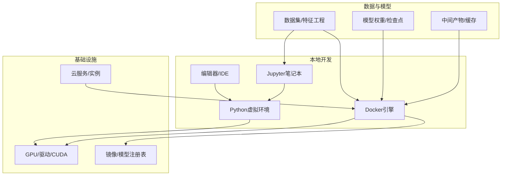
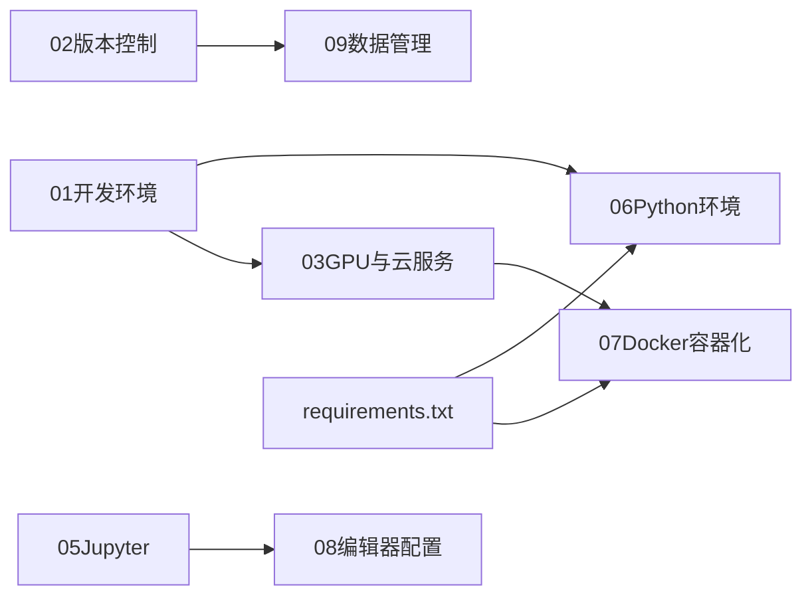

# 阶段0：环境搭建与工具

<cite>
**本文引用的文件**
- [phases/00-setup-and-tooling/README.md](file://phases/00-setup-and-tooling/README.md)
- [phases/00-setup-and-tooling/01-dev-environment/quiz.json](file://phases/00-setup-and-tooling/01-dev-environment/quiz.json)
- [phases/00-setup-and-tooling/02-git-and-collaboration/quiz.json](file://phases/00-setup-and-tooling/02-git-and-collaboration/quiz.json)
- [phases/00-setup-and-tooling/03-gpu-setup-and-cloud/quiz.json](file://phases/00-setup-and-tooling/03-gpu-setup-and-cloud/quiz.json)
- [phases/00-setup-and-tooling/04-apis-and-keys/quiz.json](file://phases/00-setup-and-tooling/04-apis-and-keys/quiz.json)
- [phases/00-setup-and-tooling/05-jupyter-notebooks/quiz.json](file://phases/00-setup-and-tooling/05-jupyter-notebooks/quiz.json)
- [phases/00-setup-and-tooling/06-python-environments/quiz.json](file://phases/00-setup-and-tooling/06-python-environments/quiz.json)
- [phases/00-setup-and-tooling/07-docker-for-ai/quiz.json](file://phases/00-setup-and-tooling/07-docker-for-ai/quiz.json)
- [phases/00-setup-and-tooling/08-editor-setup/quiz.json](file://phases/00-setup-and-tooling/08-editor-setup/quiz.json)
- [phases/00-setup-and-tooling/09-data-management/quiz.json](file://phases/00-setup-and-tooling/09-data-management/quiz.json)
- [phases/00-setup-and-tooling/10-terminal-and-shell/quiz.json](file://phases/00-setup-and-tooling/10-terminal-and-shell/quiz.json)
- [phases/00-setup-and-tooling/11-linux-for-ai/quiz.json](file://phases/00-setup-and-tooling/11-linux-for-ai/quiz.json)
- [phases/00-setup-and-tooling/12-debugging-and-profiling/quiz.json](file://phases/00-setup-and-tooling/12-debugging-and-profiling/quiz.json)
- [requirements.txt](file://requirements.txt)
</cite>

## 目录
1. [引言](#引言)
2. [项目结构](#项目结构)
3. [核心组件](#核心组件)
4. [架构总览](#架构总览)
5. [详细组件分析](#详细组件分析)
6. [依赖分析](#依赖分析)
7. [性能考虑](#性能考虑)
8. [故障排除指南](#故障排除指南)
9. [结论](#结论)
10. [附录](#附录)

## 引言
本阶段面向“从零开始搭建AI工程环境”的完整路径，覆盖开发环境、版本控制协作、GPU与云服务、API密钥管理、Jupyter笔记本、Python环境、Docker容器化、编辑器配置、数据管理、终端与Shell、Linux系统、调试与性能剖析等12门核心课程。文档以学习目标、前置要求、实践步骤为主线，辅以可视化图示、常见问题排查与最佳实践，帮助你在最短时间内建立稳定、可复现且可扩展的AI工程基础。

## 项目结构
该阶段位于 phases/00-setup-and-tooling 下，每门课程包含独立的 quiz.json（用于自测与复习）、配套文档与输出目录。顶层 README 指向完整路线图，便于按计划推进。

```mermaid
graph TB
A["阶段总览<br/>phases/00-setup-and-tooling/README.md"] --> B["课程01：开发环境<br/>01-dev-environment/quiz.json"]
A --> C["课程02：版本控制与协作<br/>02-git-and-collaboration/quiz.json"]
A --> D["课程03：GPU与云服务<br/>03-gpu-setup-and-cloud/quiz.json"]
A --> E["课程04：API与密钥<br/>04-apis-and-keys/quiz.json"]
A --> F["课程05：Jupyter笔记本<br/>05-jupyter-notebooks/quiz.json"]
A --> G["课程06：Python环境<br/>06-python-environments/quiz.json"]
A --> H["课程07：Docker容器化<br/>07-docker-for-ai/quiz.json"]
A --> I["课程08：编辑器配置<br/>08-editor-setup/quiz.json"]
A --> J["课程09：数据管理<br/>09-data-management/quiz.json"]
A --> K["课程10：终端与Shell<br/>10-terminal-and-shell/quiz.json"]
A --> L["课程11：Linux系统<br/>11-linux-for-ai/quiz.json"]
A --> M["课程12：调试与性能剖析<br/>12-debugging-and-profiling/quiz.json"]
```

图表来源
- [phases/00-setup-and-tooling/README.md](file://phases/00-setup-and-tooling/README.md)
- [phases/00-setup-and-tooling/01-dev-environment/quiz.json](file://phases/00-setup-and-tooling/01-dev-environment/quiz.json)
- [phases/00-setup-and-tooling/02-git-and-collaboration/quiz.json](file://phases/00-setup-and-tooling/02-git-and-collaboration/quiz.json)
- [phases/00-setup-and-tooling/03-gpu-setup-and-cloud/quiz.json](file://phases/00-setup-and-tooling/03-gpu-setup-and-cloud/quiz.json)
- [phases/00-setup-and-tooling/04-apis-and-keys/quiz.json](file://phases/00-setup-and-tooling/04-apis-and-keys/quiz.json)
- [phases/00-setup-and-tooling/05-jupyter-notebooks/quiz.json](file://phases/00-setup-and-tooling/05-jupyter-notebooks/quiz.json)
- [phases/00-setup-and-tooling/06-python-environments/quiz.json](file://phases/00-setup-and-tooling/06-python-environments/quiz.json)
- [phases/00-setup-and-tooling/07-docker-for-ai/quiz.json](file://phases/00-setup-and-tooling/07-docker-for-ai/quiz.json)
- [phases/00-setup-and-tooling/08-editor-setup/quiz.json](file://phases/00-setup-and-tooling/08-editor-setup/quiz.json)
- [phases/00-setup-and-tooling/09-data-management/quiz.json](file://phases/00-setup-and-tooling/09-data-management/quiz.json)
- [phases/00-setup-and-tooling/10-terminal-and-shell/quiz.json](file://phases/00-setup-and-tooling/10-terminal-and-shell/quiz.json)
- [phases/00-setup-and-tooling/11-linux-for-ai/quiz.json](file://phases/00-setup-and-tooling/11-linux-for-ai/quiz.json)
- [phases/00-setup-and-tooling/12-debugging-and-profiling/quiz.json](file://phases/00-setup-and-tooling/12-debugging-and-profiling/quiz.json)

章节来源
- [phases/00-setup-and-tooling/README.md](file://phases/00-setup-and-tooling/README.md)

## 核心组件
- 开发环境与四层栈：操作系统/驱动 → 包管理器 → 语言运行时 → AI/ML库，安装顺序逐层向上依赖。
- 版本控制与协作：理解仓库、分支、提交、推送的正确流程；模型权重与大文件的忽略策略。
- GPU与云服务：理解并行计算原理、显存限制、基准测试方法与推理优化。
- API与密钥：安全存储与传输、HTTP头部规范、速率限制处理。
- Jupyter笔记本：内核状态、魔法命令、线性执行验证与脚本迁移原则。
- Python环境：虚拟环境隔离、锁文件与可复现安装、pip/conda混用风险。
- Docker容器化：镜像构建、卷挂载、GPU暴露、服务间网络通信。
- 编辑器配置：LSP、格式化、远程开发、类型检查与输出滚动。
- 数据管理：训练/验证/测试划分、Parquet格式、流式加载、DVC版本化数据。
- 终端与Shell：管道、会话复用、端口转发、日志重定向。
- Linux系统：权限、磁盘空间排查、跨平台命令差异。
- 调试与性能剖析：AI特有陷阱、时间与内存剖析、NaN定位与修复。

章节来源
- [phases/00-setup-and-tooling/01-dev-environment/quiz.json](file://phases/00-setup-and-tooling/01-dev-environment/quiz.json)
- [phases/00-setup-and-tooling/02-git-and-collaboration/quiz.json](file://phases/00-setup-and-tooling/02-git-and-collaboration/quiz.json)
- [phases/00-setup-and-tooling/03-gpu-setup-and-cloud/quiz.json](file://phases/00-setup-and-tooling/03-gpu-setup-and-cloud/quiz.json)
- [phases/00-setup-and-tooling/04-apis-and-keys/quiz.json](file://phases/00-setup-and-tooling/04-apis-and-keys/quiz.json)
- [phases/00-setup-and-tooling/05-jupyter-notebooks/quiz.json](file://phases/00-setup-and-tooling/05-jupyter-notebooks/quiz.json)
- [phases/00-setup-and-tooling/06-python-environments/quiz.json](file://phases/00-setup-and-tooling/06-python-environments/quiz.json)
- [phases/00-setup-and-tooling/07-docker-for-ai/quiz.json](file://phases/00-setup-and-tooling/07-docker-for-ai/quiz.json)
- [phases/00-setup-and-tooling/08-editor-setup/quiz.json](file://phases/00-setup-and-tooling/08-editor-setup/quiz.json)
- [phases/00-setup-and-tooling/09-data-management/quiz.json](file://phases/00-setup-and-tooling/09-data-management/quiz.json)
- [phases/00-setup-and-tooling/10-terminal-and-shell/quiz.json](file://phases/00-setup-and-tooling/10-terminal-and-shell/quiz.json)
- [phases/00-setup-and-tooling/11-linux-for-ai/quiz.json](file://phases/00-setup-and-tooling/11-linux-for-ai/quiz.json)
- [phases/00-setup-and-tooling/12-debugging-and-profiling/quiz.json](file://phases/00-setup-and-tooling/12-debugging-and-profiling/quiz.json)

## 架构总览
下图展示从“本地开发”到“云端推理/训练”的典型工具链与数据流，强调隔离、可复现与可观测性。

图表来源
- [phases/00-setup-and-tooling/06-python-environments/quiz.json](file://phases/00-setup-and-tooling/06-python-environments/quiz.json)
- [phases/00-setup-and-tooling/07-docker-for-ai/quiz.json](file://phases/00-setup-and-tooling/07-docker-for-ai/quiz.json)
- [phases/00-setup-and-tooling/03-gpu-setup-and-cloud/quiz.json](file://phases/00-setup-and-tooling/03-gpu-setup-and-cloud/quiz.json)

## 详细组件分析

### 课程01：开发环境与四层栈
- 学习目标
  - 理解四层环境栈的安装顺序与依赖关系。
  - 掌握CUDA并行计算对神经网络训练的意义。
  - 使用uv等高性能包管理工具提升安装效率。
- 前置要求
  - 可访问系统管理权限（安装驱动/内核模块）。
  - 熟悉命令行与包管理器的基本操作。
- 实践步骤
  - 安装系统与驱动（含GPU驱动）。
  - 安装包管理器（如uv）。
  - 安装语言运行时（如Python）。
  - 安装AI/ML库（PyTorch/TensorFlow等）。
  - 验证GPU可用性（torch.cuda.is_available 或 MPS）。
- 关键要点
  - 底层决定上层能力；错误的顺序会导致后续安装失败。
  - CUDA版本需与驱动匹配，否则PyTorch无法识别GPU。

章节来源
- [phases/00-setup-and-tooling/01-dev-environment/quiz.json](file://phases/00-setup-and-tooling/01-dev-environment/quiz.json)

### 课程02：版本控制与协作
- 学习目标
  - 理解版本控制的核心价值与仓库概念。
  - 掌握日常协作工作流：add → commit → push。
  - 正确忽略大文件与二进制权重。
- 前置要求
  - 安装并配置Git客户端。
  - 了解远程仓库（如GitHub/GitLab）的基本使用。
- 实践步骤
  - 初始化本地仓库，配置用户信息。
  - 日常工作流：修改 → git add → git commit → git push。
  - 在.gitignore中加入.pt/.pth/.safetensors等大文件后缀。
- 关键要点
  - 大文件不适合进入版本库；应通过外部存储或DVC管理。

章节来源
- [phases/00-setup-and-tooling/02-git-and-collaboration/quiz.json](file://phases/00-setup-and-tooling/02-git-and-collaboration/quiz.json)

### 课程03：GPU与云服务
- 学习目标
  - 理解GPU并行计算优势与显存限制。
  - 掌握GPU状态检查与基准测试方法。
  - 估算参数规模与显存占用的关系。
- 前置要求
  - 已完成CUDA驱动与运行时安装。
  - 熟悉命令行与Python环境。
- 实践步骤
  - 使用nvidia-smi检查GPU状态。
  - 进行矩阵乘法基准测试，并在测量前同步GPU。
  - 基于fp16规则估算显存可容纳参数量。
- 关键要点
  - GPU异步执行需要同步后再计时。
  - 显存是限制模型规模与批大小的关键因素。

章节来源
- [phases/00-setup-and-tooling/03-gpu-setup-and-cloud/quiz.json](file://phases/00-setup-and-tooling/03-gpu-setup-and-cloud/quiz.json)

### 课程04：API与密钥
- 学习目标
  - 理解API密钥的作用与安全风险。
  - 掌握安全存储与传输方式。
  - 理解HTTP头部规范与速率限制。
- 前置要求
  - 具备基本的HTTP与网络知识。
- 实践步骤
  - 将密钥保存在本地.env文件中并加入.gitignore。
  - 在调用特定服务时设置正确的请求头。
  - 遇到429时采用指数退避重试。
- 关键要点
  - 不要在源码中硬编码密钥。
  - 不同服务商可能使用不同的认证头。

章节来源
- [phases/00-setup-and-tooling/04-apis-and-keys/quiz.json](file://phases/00-setup-and-tooling/04-apis-and-keys/quiz.json)

### 课程05：Jupyter笔记本
- 学习目标
  - 理解笔记本内核与单元格执行机制。
  - 掌握常用魔法命令与线性执行验证。
  - 明确从笔记本迁移到脚本的时机。
- 前置要求
  - 已安装Jupyter与Python内核。
- 实践步骤
  - 使用Kernel > Restart & Run All验证线性执行。
  - 利用%timeit与%%time进行微基准与整体耗时统计。
  - 将可复用逻辑迁出为.py脚本。
- 关键要点
  - 笔记本适合探索，脚本适合交付。

章节来源
- [phases/00-setup-and-tooling/05-jupyter-notebooks/quiz.json](file://phases/00-setup-and-tooling/05-jupyter-notebooks/quiz.json)

### 课程06：Python环境与可复现安装
- 学习目标
  - 理解虚拟环境隔离的重要性。
  - 掌握锁文件与可复现安装。
  - 避免pip与conda混用导致的冲突。
- 前置要求
  - 已安装Python与包管理器。
- 实践步骤
  - 创建并激活虚拟环境。
  - 使用锁文件确保依赖一致。
  - 避免在同一环境中混用pip与conda。
- 关键要点
  - “探索在笔记本，交付在脚本”，可复现性优先。

章节来源
- [phases/00-setup-and-tooling/06-python-environments/quiz.json](file://phases/00-setup-and-tooling/06-python-environments/quiz.json)

### 课程07：Docker容器化
- 学习目标
  - 理解容器与虚拟机的区别。
  - 掌握Dockerfile与镜像构建。
  - 使用卷挂载持久化数据，使用NVIDIA Container Toolkit暴露GPU。
- 前置要求
  - 已安装Docker与NVIDIA Container Toolkit。
- 实践步骤
  - 编写Dockerfile，分层构建镜像。
  - 使用卷挂载映射代码、数据与模型目录。
  - 通过--gpus标志启用GPU支持。
- 关键要点
  - 卷挂载是AI项目持续迭代的关键。

章节来源
- [phases/00-setup-and-tooling/07-docker-for-ai/quiz.json](file://phases/00-setup-and-tooling/07-docker-for-ai/quiz.json)

### 课程08：编辑器配置（VS Code）
- 学习目标
  - 理解LSP、格式化与类型检查的价值。
  - 掌握远程开发与输出滚动设置。
  - 启用基础类型检查以尽早发现错误。
- 前置要求
  - 已安装VS Code与Python扩展。
- 实践步骤
  - 启用format-on-save与统一格式化工具。
  - 使用Remote SSH在远端GPU机器上开发。
  - 打开notebook.output.scrolling防止输出爆炸。
  - 设置python.analysis.typeCheckingMode为basic。
- 关键要点
  - 类型检查能显著降低运行时成本。

章节来源
- [phases/00-setup-and-tooling/08-editor-setup/quiz.json](file://phases/00-setup-and-tooling/08-editor-setup/quiz.json)

### 课程09：数据管理
- 学习目标
  - 理解训练/验证/测试划分的目的。
  - 掌握Parquet格式与流式加载的优势。
  - 使用DVC进行数据版本化与可复现实验。
- 前置要求
  - 了解数据集与特征工程的基本流程。
- 实践步骤
  - 划分三集并避免信息泄漏。
  - 将数据转存为Parquet以提升读取效率。
  - 对超大数据集使用streaming加载。
  - 使用DVC跟踪数据指针文件。
- 关键要点
  - 可复现的实验必须可复现的数据。

章节来源
- [phases/00-setup-and-tooling/09-data-management/quiz.json](file://phases/00-setup-and-tooling/09-data-management/quiz.json)

### 课程10：终端与Shell
- 学习目标
  - 理解管道、后台与会话复用。
  - 掌握tmux与端口转发在远程训练中的应用。
  - 学会重定向标准输出与错误。
- 前置要求
  - 熟练使用命令行与SSH。
- 实践步骤
  - 使用管道组合命令进行日志过滤。
  - 使用tmux分离/重连长任务。
  - 使用ssh -L进行本地端口转发访问远程Jupyter。
  - 使用重定向捕获训练输出。
- 关键要点
  - 关闭终端通常会发送SIGHUP导致进程终止。

章节来源
- [phases/00-setup-and-tooling/10-terminal-and-shell/quiz.json](file://phases/00-setup-and-tooling/10-terminal-and-shell/quiz.json)

### 课程11：Linux系统
- 学习目标
  - 熟悉常用路径与权限命令。
  - 掌握磁盘空间排查与跨平台命令差异。
- 前置要求
  - 具备基本的Linux文件系统认知。
- 实践步骤
  - 使用~快速回到家目录。
  - 使用sudo执行需要管理员权限的操作。
  - 使用chmod +x赋予脚本执行权限。
  - 使用du/sort定位占用空间最大的目录。
- 关键要点
  - macOS与Linux的sed -i语法存在差异。

章节来源
- [phases/00-setup-and-tooling/11-linux-for-ai/quiz.json](file://phases/00-setup-and-tooling/11-linux-for-ai/quiz.json)

### 课程12：调试与性能剖析
- 学习目标
  - 认识AI调试的特殊性与常见陷阱。
  - 掌握剖析工具定位瓶颈。
  - 学会定位与修复NaN等隐性错误。
- 前置要求
  - 熟悉训练循环与损失函数。
- 实践步骤
  - 当出现异常高准确率时，怀疑数据泄漏。
  - 分析训练时间分布，优先优化数据加载。
  - 使用detect_nan与条件断点定位NaN来源。
- 关键要点
  - AI代码往往不崩溃但结果无效，更需系统化排查。

章节来源
- [phases/00-setup-and-tooling/12-debugging-and-profiling/quiz.json](file://phases/00-setup-and-tooling/12-debugging-and-profiling/quiz.json)

## 依赖分析
- 课程间依赖
  - 01 → 06（先系统/驱动，再虚拟环境与包管理）。
  - 03 → 07（GPU可用性是容器化与云服务的前提）。
  - 02 → 09（版本控制与数据管理共同保障可复现）。
  - 05 → 08（笔记本与编辑器协同提高开发效率）。
- 工具链依赖
  - Python生态：requirements.txt定义了AI项目常用库范围，涵盖深度学习、数据处理、接口SDK等。

图表来源
- [requirements.txt](file://requirements.txt)
- [phases/00-setup-and-tooling/01-dev-environment/quiz.json](file://phases/00-setup-and-tooling/01-dev-environment/quiz.json)
- [phases/00-setup-and-tooling/06-python-environments/quiz.json](file://phases/00-setup-and-tooling/06-python-environments/quiz.json)
- [phases/00-setup-and-tooling/03-gpu-setup-and-cloud/quiz.json](file://phases/00-setup-and-tooling/03-gpu-setup-and-cloud/quiz.json)
- [phases/00-setup-and-tooling/07-docker-for-ai/quiz.json](file://phases/00-setup-and-tooling/07-docker-for-ai/quiz.json)
- [phases/00-setup-and-tooling/02-git-and-collaboration/quiz.json](file://phases/00-setup-and-tooling/02-git-and-collaboration/quiz.json)
- [phases/00-setup-and-tooling/09-data-management/quiz.json](file://phases/00-setup-and-tooling/09-data-management/quiz.json)
- [phases/00-setup-and-tooling/05-jupyter-notebooks/quiz.json](file://phases/00-setup-and-tooling/05-jupyter-notebooks/quiz.json)
- [phases/00-setup-and-tooling/08-editor-setup/quiz.json](file://phases/00-setup-and-tooling/08-editor-setup/quiz.json)

章节来源
- [requirements.txt](file://requirements.txt)

## 性能考虑
- 安装与环境
  - 使用uv替代pip可显著缩短依赖解析与安装时间。
  - 锁文件确保不同环境的一致性，减少反复调试。
- 训练与推理
  - 数据加载往往是瓶颈，优先开启多进程与合适的batch size。
  - 使用同步API测量GPU耗时，避免误判。
- 容器化
  - 卷挂载避免重复下载大文件，提升迭代速度。
  - GPU容器需正确配置NVIDIA Container Toolkit。

## 故障排除指南
- CUDA不可用
  - 检查驱动与PyTorch CUDA版本是否匹配。
  - 使用nvidia-smi确认设备状态。
- 权限问题
  - 使用chmod +x赋予脚本执行权限。
  - 使用sudo执行需要管理员权限的操作。
- 端口转发
  - 使用ssh -L将远程Jupyter端口映射到本地。
- 输出爆炸
  - 在VS Code中启用notebook.output.scrolling。
- 数据过大
  - 使用Parquet与streaming加载，或引入DVC进行版本化管理。
- 会话中断
  - 使用tmux分离/重连，避免关闭终端导致SIGHUP。

章节来源
- [phases/00-setup-and-tooling/03-gpu-setup-and-cloud/quiz.json](file://phases/00-setup-and-tooling/03-gpu-setup-and-cloud/quiz.json)
- [phases/00-setup-and-tooling/11-linux-for-ai/quiz.json](file://phases/00-setup-and-tooling/11-linux-for-ai/quiz.json)
- [phases/00-setup-and-tooling/10-terminal-and-shell/quiz.json](file://phases/00-setup-and-tooling/10-terminal-and-shell/quiz.json)
- [phases/00-setup-and-tooling/08-editor-setup/quiz.json](file://phases/00-setup-and-tooling/08-editor-setup/quiz.json)
- [phases/00-setup-and-tooling/09-data-management/quiz.json](file://phases/00-setup-and-tooling/09-data-management/quiz.json)

## 结论
本阶段通过12门课程系统性地建立了AI工程的“地基”。遵循四层栈安装顺序、坚持可复现的环境与数据管理、掌握容器化与远程开发、以及建立完善的调试与性能剖析习惯，将极大提升你的工程效率与稳定性。建议以课程为单位逐步完成实践，并在团队协作中推广一致的工作流与规范。

## 附录
- 快速检查清单
  - 系统与驱动：已安装并可被PyTorch/MPS识别。
  - 包管理：uv或pip已就绪，锁文件已生成。
  - 版本控制：仓库初始化、分支策略明确、大文件忽略。
  - 数据：划分三集、Parquet存储、必要时启用streaming/DVC。
  - 容器：Dockerfile、卷挂载、--gpus、服务间网络。
  - 编辑器：LSP、格式化、类型检查、远程开发。
  - 终端：tmux、端口转发、日志重定向。
  - 调试：剖析工具、NaN定位、数据泄漏排查。