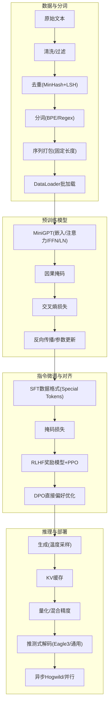
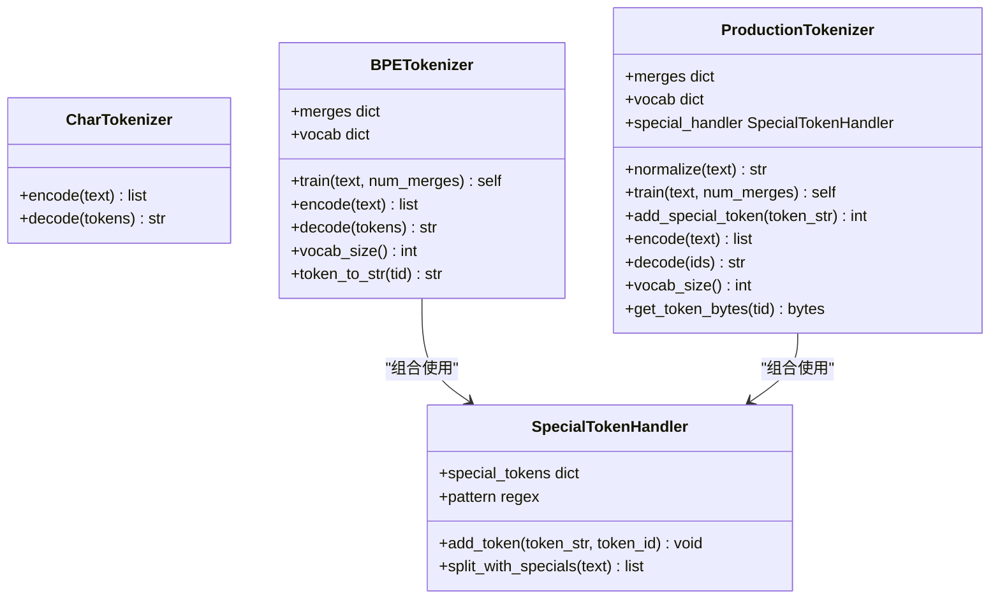
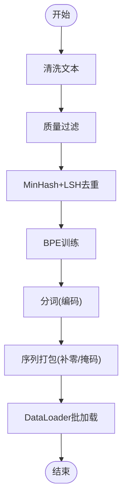
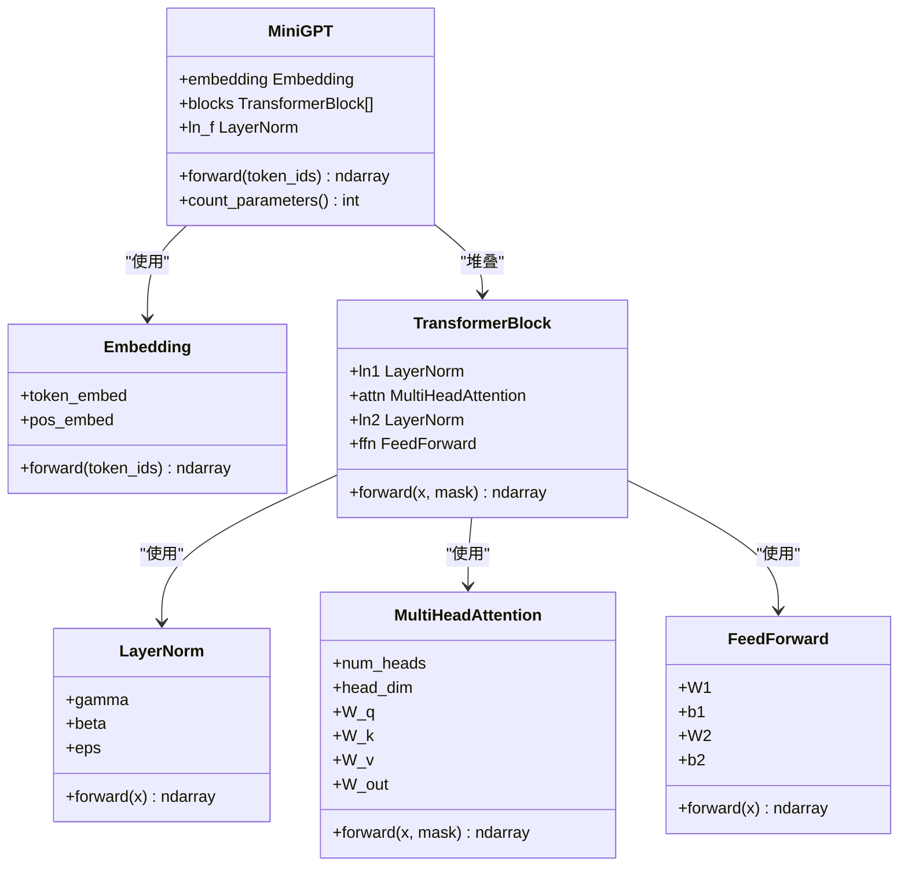
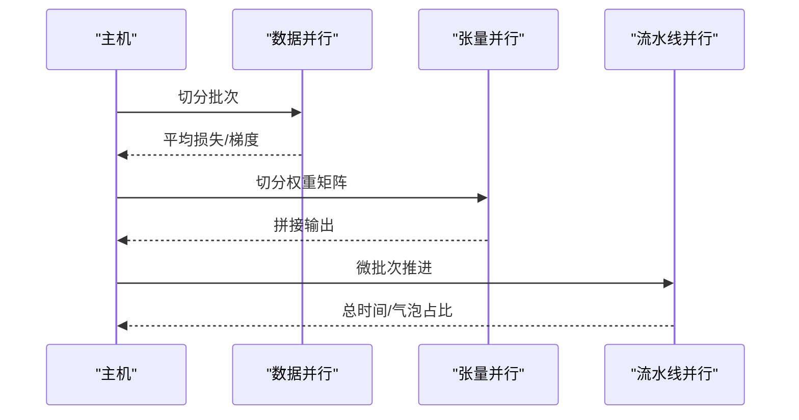
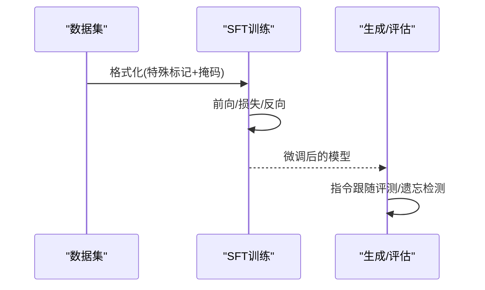
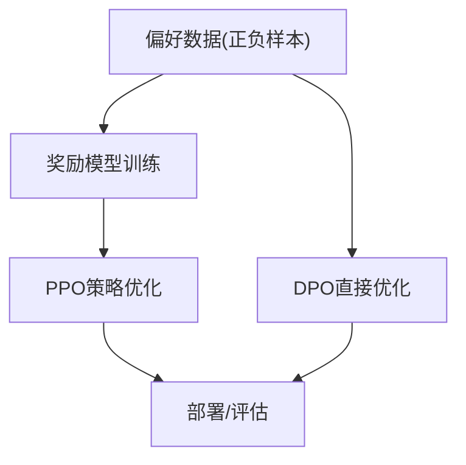
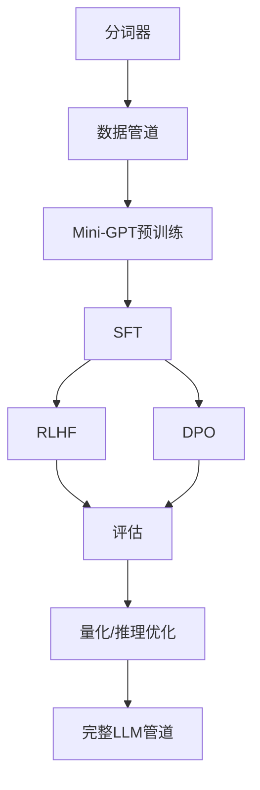

# 阶段10：大语言模型从零实现

<cite>
**本文档引用的文件**
- [ROADMAP.md](file://ROADMAP.md)
- [phases/10-llms-from-scratch/README.md](file://phases/10-llms-from-scratch/README.md)
- [phases/10-llms-from-scratch/01-tokenizers/code/main.py](file://phases/10-llms-from-scratch/01-tokenizers/code/main.py)
- [phases/10-llms-from-scratch/02-building-a-tokenizer/code/main.py](file://phases/10-llms-from-scratch/02-building-a-tokenizer/code/main.py)
- [phases/10-llms-from-scratch/03-data-pipelines/code/main.py](file://phases/10-llms-from-scratch/03-data-pipelines/code/main.py)
- [phases/10-llms-from-scratch/04-pre-training-mini-gpt/code/main.py](file://phases/10-llms-from-scratch/04-pre-training-mini-gpt/code/main.py)
- [phases/10-llms-from-scratch/05-scaling-distributed/code/main.py](file://phases/10-llms-from-scratch/05-scaling-distributed/code/main.py)
- [phases/10-llms-from-scratch/06-instruction-tuning-sft/code/main.py](file://phases/10-llms-from-scratch/06-instruction-tuning-sft/code/main.py)
- [phases/10-llms-from-scratch/07-rlhf/code/main.py](file://phases/10-llms-from-scratch/07-rlhf/code/main.py)
- [phases/10-llms-from-scratch/08-dpo/code/main.py](file://phases/10-llms-from-scratch/08-dpo/code/main.py)
- [phases/10-llms-from-scratch/09-constitutional-ai-self-improvement/code/main.py](file://phases/10-llms-from-scratch/09-constitutional-ai-self-improvement/code/main.py)
- [phases/10-llms-from-scratch/10-evaluation/code/main.py](file://phases/10-llms-from-scratch/10-evaluation/code/main.py)
- [phases/10-llms-from-scratch/11-quantization/code/main.py](file://phases/10-llms-from-scratch/11-quantization/code/main.py)
- [phases/10-llms-from-scratch/12-inference-optimization/code/main.py](file://phases/10-llms-from-scratch/12-inference-optimization/code/main.py)
- [phases/10-llms-from-scratch/13-building-complete-llm-pipeline/code/main.py](file://phases/10-llms-from-scratch/13-building-complete-llm-pipeline/code/main.py)
- [phases/10-llms-from-scratch/14-open-models-architecture-walkthroughs/code/main.py](file://phases/10-llms-from-scratch/14-open-models-architecture-walkthroughs/code/main.py)
- [phases/10-llms-from-scratch/15-speculative-decoding-eagle3/code/main.py](file://phases/10-llms-from-scratch/15-speculative-decoding-eagle3/code/main.py)
- [phases/10-llms-from-scratch/16-differential-attention-v2/code/main.py](file://phases/10-llms-from-scratch/16-differential-attention-v2/code/main.py)
- [phases/10-llms-from-scratch/17-native-sparse-attention/code/main.py](file://phases/10-llms-from-scratch/17-native-sparse-attention/code/main.py)
- [phases/10-llms-from-scratch/18-multi-token-prediction/code/main.py](file://phases/10-llms-from-scratch/18-multi-token-prediction/code/main.py)
- [phases/10-llms-from-scratch/19-dualpipe-parallelism/code/main.py](file://phases/10-llms-from-scratch/19-dualpipe-parallelism/code/main.py)
- [phases/10-llms-from-scratch/20-deepseek-v3-walkthrough/code/main.py](file://phases/10-llms-from-scratch/20-deepseek-v3-walkthrough/code/main.py)
- [phases/10-llms-from-scratch/21-jamba-hybrid-ssm-transformer/code/main.py](file://phases/10-llms-from-scratch/21-jamba-hybrid-ssm-transformer/code/main.py)
- [phases/10-llms-from-scratch/22-async-hogwild-inference/code/main.py](file://phases/10-llms-from-scratch/22-async-hogwild-inference/code/main.py)
- [phases/10-llms-from-scratch/25-speculative-decoding/code/main.py](file://phases/10-llms-from-scratch/25-speculative-decoding/code/main.py)
- [phases/10-llms-from-scratch/34-gradient-checkpointing/code/main.py](file://phases/10-llms-from-scratch/34-gradient-checkpointing/code/main.py)
</cite>

## 目录
1. [引言](#引言)
2. [项目结构](#项目结构)
3. [核心组件](#核心组件)
4. [架构总览](#架构总览)
5. [详细组件分析](#详细组件分析)
6. [依赖关系分析](#依赖关系分析)
7. [性能考虑](#性能考虑)
8. [故障排除指南](#故障排除指南)
9. [结论](#结论)
10. [附录](#附录)

## 引言
本阶段围绕“大语言模型从零实现”展开，系统性覆盖从分词器、数据管道、Mini-GPT 预训练，到分布式训练、指令微调（SFT）、RLHF、DPO、宪法AI自我改进、模型评估、量化与推理优化、完整LLM管道构建，以及前沿架构如Eagle3推测式解码、差异注意力V2、原生稀疏注意力、多令牌预测、DualPipe并行、DeepSeek V3、Jamba混合SSM-Transformer、异步Hogwild推理、推测式解码与梯度检查点等22门核心课程。目标是帮助读者建立从理论到实践的完整知识体系与工程能力。

## 项目结构
该阶段位于 phases/10-llms-from-scratch，包含22个独立课程模块，每个模块提供中文文档、可运行代码与练习题。课程内容与总路线图由 ROADMAP.md 统一规划，确保学习路径与时间估算一致。

```mermaid
graph TB
A["阶段10：LLMs从零实现<br/>22门核心课程"] --> B["分词器实现"]
A --> C["数据管道构建"]
A --> D["Mini-GPT预训练"]
A --> E["分布式训练"]
A --> F["指令微调SFT"]
A --> G["RLHF"]
A --> H["DPO"]
A --> I["宪法AI自我改进"]
A --> J["评估"]
A --> K["量化"]
A --> L["推理优化"]
A --> M["完整LLM管道"]
A --> N["开源模型架构解析"]
A --> O["推测式解码/EAGLE-3"]
A --> P["差异注意力V2"]
A --> Q["原生稀疏注意力"]
A --> R["多令牌预测"]
A --> S["DualPipe并行"]
A --> T["DeepSeek V3架构"]
A --> U["Jamba混合SSM-Transformer"]
A --> V["异步Hogwild推理"]
A --> W["推测式解码"]
A --> X["梯度检查点"]
```

图表来源
- [ROADMAP.md](file://ROADMAP.md)
- [phases/10-llms-from-scratch/README.md](file://phases/10-llms-from-scratch/README.md)

章节来源
- [ROADMAP.md](file://ROADMAP.md)
- [phases/10-llms-from-scratch/README.md](file://phases/10-llms-from-scratch/README.md)

## 核心组件
- 分词器：字符级与BPE子词分词，支持训练、编码、解码与词汇统计。
- 数据管道：文本清洗、质量过滤、去重（MinHash+LSH）、分词、序列打包与批加载。
- Mini-GPT：嵌入层、多头注意力、前馈网络、残差与层归一化，支持训练与生成。
- 分布式训练：数据并行、张量并行、流水线并行模拟，内存与通信开销估算。
- 指令微调（SFT）：特殊标记格式、掩码损失、指令跟随评估与遗忘检测。
- 评估：困惑度、校准、基准测试与可视化。
- 量化与推理优化：INT8/GPTQ/AWQ/FP8/FP4等策略与KV缓存优化。
- 完整LLM管道：端到端训练、评估、服务与监控。
- 架构解析：Eagle3、差异注意力V2、原生稀疏注意力、多令牌预测、DualPipe并行、DeepSeek V3、Jamba混合SSM-Transformer、异步Hogwild推理、推测式解码、梯度检查点。

章节来源
- [phases/10-llms-from-scratch/01-tokenizers/code/main.py](file://phases/10-llms-from-scratch/01-tokenizers/code/main.py)
- [phases/10-llms-from-scratch/02-building-a-tokenizer/code/main.py](file://phases/10-llms-from-scratch/02-building-a-tokenizer/code/main.py)
- [phases/10-llms-from-scratch/03-data-pipelines/code/main.py](file://phases/10-llms-from-scratch/03-data-pipelines/code/main.py)
- [phases/10-llms-from-scratch/04-pre-training-mini-gpt/code/main.py](file://phases/10-llms-from-scratch/04-pre-training-mini-gpt/code/main.py)
- [phases/10-llms-from-scratch/05-scaling-distributed/code/main.py](file://phases/10-llms-from-scratch/05-scaling-distributed/code/main.py)
- [phases/10-llms-from-scratch/06-instruction-tuning-sft/code/main.py](file://phases/10-llms-from-scratch/06-instruction-tuning-sft/code/main.py)
- [phases/10-llms-from-scratch/10-evaluation/code/main.py](file://phases/10-llms-from-scratch/10-evaluation/code/main.py)
- [phases/10-llms-from-scratch/11-quantization/code/main.py](file://phases/10-llms-from-scratch/11-quantization/code/main.py)
- [phases/10-llms-from-scratch/12-inference-optimization/code/main.py](file://phases/10-llms-from-scratch/12-inference-optimization/code/main.py)
- [phases/10-llms-from-scratch/13-building-complete-llm-pipeline/code/main.py](file://phases/10-llms-from-scratch/13-building-complete-llm-pipeline/code/main.py)
- [phases/10-llms-from-scratch/14-open-models-architecture-walkthroughs/code/main.py](file://phases/10-llms-from-scratch/14-open-models-architecture-walkthroughs/code/main.py)
- [phases/10-llms-from-scratch/15-speculative-decoding-eagle3/code/main.py](file://phases/10-llms-from-scratch/15-speculative-decoding-eagle3/code/main.py)
- [phases/10-llms-from-scratch/16-differential-attention-v2/code/main.py](file://phases/10-llms-from-scratch/16-differential-attention-v2/code/main.py)
- [phases/10-llms-from-scratch/17-native-sparse-attention/code/main.py](file://phases/10-llms-from-scratch/17-native-sparse-attention/code/main.py)
- [phases/10-llms-from-scratch/18-multi-token-prediction/code/main.py](file://phases/10-llms-from-scratch/18-multi-token-prediction/code/main.py)
- [phases/10-llms-from-scratch/19-dualpipe-parallelism/code/main.py](file://phases/10-llms-from-scratch/19-dualpipe-parallelism/code/main.py)
- [phases/10-llms-from-scratch/20-deepseek-v3-walkthrough/code/main.py](file://phases/10-llms-from-scratch/20-deepseek-v3-walkthrough/code/main.py)
- [phases/10-llms-from-scratch/21-jamba-hybrid-ssm-transformer/code/main.py](file://phases/10-llms-from-scratch/21-jamba-hybrid-ssm-transformer/code/main.py)
- [phases/10-llms-from-scratch/22-async-hogwild-inference/code/main.py](file://phases/10-llms-from-scratch/22-async-hogwild-inference/code/main.py)
- [phases/10-llms-from-scratch/25-speculative-decoding/code/main.py](file://phases/10-llms-from-scratch/25-speculative-decoding/code/main.py)
- [phases/10-llms-from-scratch/34-gradient-checkpointing/code/main.py](file://phases/10-llms-from-scratch/34-gradient-checkpointing/code/main.py)

## 架构总览
下图展示从数据到模型再到推理的关键路径，涵盖分词、数据准备、训练、对齐、评估与部署优化。

图表来源
- [phases/10-llms-from-scratch/03-data-pipelines/code/main.py](file://phases/10-llms-from-scratch/03-data-pipelines/code/main.py)
- [phases/10-llms-from-scratch/04-pre-training-mini-gpt/code/main.py](file://phases/10-llms-from-scratch/04-pre-training-mini-gpt/code/main.py)
- [phases/10-llms-from-scratch/06-instruction-tuning-sft/code/main.py](file://phases/10-llms-from-scratch/06-instruction-tuning-sft/code/main.py)
- [phases/10-llms-from-scratch/12-inference-optimization/code/main.py](file://phases/10-llms-from-scratch/12-inference-optimization/code/main.py)
- [phases/10-llms-from-scratch/15-speculative-decoding-eagle3/code/main.py](file://phases/10-llms-from-scratch/15-speculative-decoding-eagle3/code/main.py)
- [phases/10-llms-from-scratch/22-async-hogwild-inference/code/main.py](file://phases/10-llms-from-scratch/22-async-hogwild-inference/code/main.py)

## 详细组件分析

### 分词器实现（字符级与BPE）
- 字符级分词器：逐字符编码/解码，保证往返一致性。
- BPE分词器：基于字符对合并的无监督子词学习，支持训练、编码、解码与统计分析。
- 生产级分词器：正则预分词、规范化、特殊标记处理、与外部库对比。

图表来源
- [phases/10-llms-from-scratch/01-tokenizers/code/main.py](file://phases/10-llms-from-scratch/01-tokenizers/code/main.py)
- [phases/10-llms-from-scratch/02-building-a-tokenizer/code/main.py](file://phases/10-llms-from-scratch/02-building-a-tokenizer/code/main.py)

章节来源
- [phases/10-llms-from-scratch/01-tokenizers/code/main.py](file://phases/10-llms-from-scratch/01-tokenizers/code/main.py)
- [phases/10-llms-from-scratch/02-building-a-tokenizer/code/main.py](file://phases/10-llms-from-scratch/02-building-a-tokenizer/code/main.py)

### 数据管道构建
- 文本清洗：去除HTML标签、URL、控制字符，规范换行与空格。
- 质量过滤：最小词数、大写比例、特殊字符比例阈值。
- 去重：MinHash签名+LSH桶，Jaccard相似度阈值。
- 分词与打包：BPE训练、序列拼接EOS、固定长度打包与注意力掩码。
- 批加载：随机打乱、批量迭代器。

图表来源
- [phases/10-llms-from-scratch/03-data-pipelines/code/main.py](file://phases/10-llms-from-scratch/03-data-pipelines/code/main.py)

章节来源
- [phases/10-llms-from-scratch/03-data-pipelines/code/main.py](file://phases/10-llms-from-scratch/03-data-pipelines/code/main.py)

### Mini-GPT 预训练
- 模型组件：嵌入（词+位置）、多头注意力、前馈网络、残差连接、层归一化。
- 训练流程：滑动窗口批次、因果掩码、交叉熵损失、反向传播与参数更新。
- 生成：温度采样，上下文截断至最大长度。

图表来源
- [phases/10-llms-from-scratch/04-pre-training-mini-gpt/code/main.py](file://phases/10-llms-from-scratch/04-pre-training-mini-gpt/code/main.py)

章节来源
- [phases/10-llms-from-scratch/04-pre-training-mini-gpt/code/main.py](file://phases/10-llms-from-scratch/04-pre-training-mini-gpt/code/main.py)

### 分布式训练
- 数据并行：按GPU切分批次，平均损失与梯度。
- 张量并行：按输出维度切分权重矩阵，拼接结果验证数值误差。
- 流水线并行：微批次时钟周期模拟，计算时间与气泡占比。
- 内存估算：权重/优化器/梯度/激活内存，不同分片策略（FSDP/ZeRO）。
- 混合精度：FP32/FP16/混合BF16节省显存与算力。
- 通信体积：Ring AllReduce、AllGather+ReduceScatter、层间AllReduce。
- 成本估算：FLOPs需求、GPU利用率、成本与耗时。

图表来源
- [phases/10-llms-from-scratch/05-scaling-distributed/code/main.py](file://phases/10-llms-from-scratch/05-scaling-distributed/code/main.py)

章节来源
- [phases/10-llms-from-scratch/05-scaling-distributed/code/main.py](file://phases/10-llms-from-scratch/05-scaling-distributed/code/main.py)

### 指令微调（SFT）
- 数据格式：特殊标记包裹指令与响应，掩码仅对响应部分生效。
- 掩码交叉熵：仅在响应位置计算损失，避免指令部分污染。
- 评估：指令跟随评测、生成质量、遗忘检测（预训练后困惑度变化）。

图表来源
- [phases/10-llms-from-scratch/06-instruction-tuning-sft/code/main.py](file://phases/10-llms-from-scratch/06-instruction-tuning-sft/code/main.py)

章节来源
- [phases/10-llms-from-scratch/06-instruction-tuning-sft/code/main.py](file://phases/10-llms-from-scratch/06-instruction-tuning-sft/code/main.py)

### RLHF 与 DPO
- RLHF：奖励模型训练 + PPO策略优化（概念性说明与流程示意）。
- DPO：直接偏好优化，无需奖励模型，简化对齐流程。

图表来源
- [phases/10-llms-from-scratch/07-rlhf/code/main.py](file://phases/10-llms-from-scratch/07-rlhf/code/main.py)
- [phases/10-llms-from-scratch/08-dpo/code/main.py](file://phases/10-llms-from-scratch/08-dpo/code/main.py)

章节来源
- [phases/10-llms-from-scratch/07-rlhf/code/main.py](file://phases/10-llms-from-scratch/07-rlhf/code/main.py)
- [phases/10-llms-from-scratch/08-dpo/code/main.py](file://phases/10-llms-from-scratch/08-dpo/code/main.py)

### 宪法AI自我改进
- 自主迭代：规则引擎、安全门禁、红队对抗与反馈闭环。
- 可视化与审计：改进记录、效果追踪与风险评估。

章节来源
- [phases/10-llms-from-scratch/09-constitutional-ai-self-improvement/code/main.py](file://phases/10-llms-from-scratch/09-constitutional-ai-self-improvement/code/main.py)

### 模型评估
- 基准测试：困惑度、校准、下游任务指标。
- 可视化：损失曲线、生成质量、覆盖率与偏差分析。

章节来源
- [phases/10-llms-from-scratch/10-evaluation/code/main.py](file://phases/10-llms-from-scratch/10-evaluation/code/main.py)

### 量化与推理优化
- 量化策略：INT8、GPTQ、AWQ、GGUF、FP8/NVFP4。
- 推理优化：KV缓存、连续批、前缀重用、混合精度、内存带宽优化。

章节来源
- [phases/10-llms-from-scratch/11-quantization/code/main.py](file://phases/10-llms-from-scratch/11-quantization/code/main.py)
- [phases/10-llms-from-scratch/12-inference-optimization/code/main.py](file://phases/10-llms-from-scratch/12-inference-optimization/code/main.py)

### 完整LLM管道构建
- 端到端：数据->预训练->指令微调->对齐->评估->量化->服务。
- 工程化：日志、指标、版本管理、A/B测试与灰度发布。

章节来源
- [phases/10-llms-from-scratch/13-building-complete-llm-pipeline/code/main.py](file://phases/10-llms-from-scratch/13-building-complete-llm-pipeline/code/main.py)

### 开源模型架构解析
- GPT系列家族参数规模与组件构成，便于对照实现与扩展。

章节来源
- [phases/10-llms-from-scratch/14-open-models-architecture-walkthroughs/code/main.py](file://phases/10-llms-from-scratch/14-open-models-architecture-walkthroughs/code/main.py)

### 推测式解码与 Eagle3
- Draft-Verify-Repeat：草稿模型预测多个候选，主模型验证，提升吞吐。
- Eagle3：生产级推测解码框架与缓存策略。

章节来源
- [phases/10-llms-from-scratch/15-speculative-decoding-eagle3/code/main.py](file://phases/10-llms-from-scratch/15-spec speculative-decoding-eagle3/code/main.py)
- [phases/10-llms-from-scratch/25-speculative-decoding/code/main.py](file://phases/10-llms-from-scratch/25-speculative-decoding/code/main.py)

### 差异注意力V2
- 通过差分机制增强长程依赖建模与计算效率。

章节来源
- [phases/10-llms-from-scratch/16-differential-attention-v2/code/main.py](file://phases/10-llms-from-scratch/16-differential-attention-v2/code/main.py)

### 原生稀疏注意力（DeepSeek NSA）
- 在长上下文场景中降低注意力复杂度，保持性能。

章节来源
- [phases/10-llms-from-scratch/17-native-sparse-attention/code/main.py](file://phases/10-llms-from-scratch/17-native-sparse-attention/code/main.py)

### 多令牌预测（MTP）
- 同步预测多个未来token，减少解码循环次数。

章节来源
- [phases/10-llms-from-scratch/18-multi-token-prediction/code/main.py](file://phases/10-llms-from-scratch/18-multi-token-prediction/code/main.py)

### DualPipe并行
- 将前向与反向计算交错并行，提高设备利用率。

章节来源
- [phases/10-llms-from-scratch/19-dualpipe-parallelism/code/main.py](file://phases/10-llms-from-scratch/19-dualpipe-parallelism/code/main.py)

### DeepSeek V3 架构
- 深入解析其模块设计、并行策略与性能权衡。

章节来源
- [phases/10-llms-from-scratch/20-deepseek-v3-walkthrough/code/main.py](file://phases/10-llms-from-scratch/20-deepseek-v3-walkthrough/code/main.py)

### Jamba 混合SSM-Transformer
- 结合状态空间模型与Transformer的优势，提升长程建模能力。

章节来源
- [phases/10-llms-from-scratch/21-jamba-hybrid-ssm-transformer/code/main.py](file://phases/10-llms-from-scratch/21-jamba-hybrid-ssm-transformer/code/main.py)

### 异步Hogwild推理
- 无锁并行解码，利用多核CPU提升吞吐。

章节来源
- [phases/10-llms-from-scratch/22-async-hogwild-inference/code/main.py](file://phases/10-llms-from-scratch/22-async-hogwild-inference/code/main.py)

### 梯度检查点
- 通过激活重计算降低显存占用，适合大模型训练。

章节来源
- [phases/10-llms-from-scratch/34-gradient-checkpointing/code/main.py](file://phases/10-llms-from-scratch/34-gradient-checkpointing/code/main.py)

## 依赖关系分析
- 课程依赖：SFT依赖Mini-GPT；RLHF/DPO依赖SFT；评估贯穿全流程；推理优化服务于部署。
- 模块内聚：各课程自包含数据、逻辑与演示，便于独立学习与复现。
- 外部依赖：部分示例使用tiktoken进行对比，建议安装以获得一致结果。

图表来源
- [phases/10-llms-from-scratch/01-tokenizers/code/main.py](file://phases/10-llms-from-scratch/01-tokenizers/code/main.py)
- [phases/10-llms-from-scratch/03-data-pipelines/code/main.py](file://phases/10-llms-from-scratch/03-data-pipelines/code/main.py)
- [phases/10-llms-from-scratch/04-pre-training-mini-gpt/code/main.py](file://phases/10-llms-from-scratch/04-pre-training-mini-gpt/code/main.py)
- [phases/10-llms-from-scratch/06-instruction-tuning-sft/code/main.py](file://phases/10-llms-from-scratch/06-instruction-tuning-sft/code/main.py)
- [phases/10-llms-from-scratch/10-evaluation/code/main.py](file://phases/10-llms-from-scratch/10-evaluation/code/main.py)
- [phases/10-llms-from-scratch/12-inference-optimization/code/main.py](file://phases/10-llms-from-scratch/12-inference-optimization/code/main.py)
- [phases/10-llms-from-scratch/13-building-complete-llm-pipeline/code/main.py](file://phases/10-llms-from-scratch/13-building-complete-llm-pipeline/code/main.py)

## 性能考虑
- 计算与内存：混合精度、ZeRO/FSDP分片、梯度检查点、流水线并行。
- 通信：AllReduce、AllGather+ReduceScatter、层间通信优化。
- 推理：KV缓存、连续批、前缀重用、推测式解码、异步并行。
- 评估：困惑度、校准、长上下文评测工具链。

## 故障排除指南
- 分词不一致：确认规范化步骤、特殊标记顺序与字节边界。
- 训练不稳定：检查学习率、梯度裁剪、初始化与掩码设置。
- 显存不足：启用ZeRO/FSDP、梯度检查点、混合精度与更小批次。
- 推理延迟高：启用KV缓存、推测式解码、张量并行与优化算子。
- 对齐失败：检查偏好数据质量、奖励模型稳定性与PPO超参。

## 结论
本阶段通过22门核心课程，系统构建了从分词、数据、预训练到分布式训练、指令微调、对齐、评估与部署优化的完整技术栈。读者可在掌握理论的同时，复现实战中的关键算法与工程实践，为后续高级研究与工业落地打下坚实基础。

## 附录
- 学习计划与时间估算：参考 ROADMAP.md 的阶段与课程进度。
- 术语与概念：结合 glossary 与各课件文档加深理解。