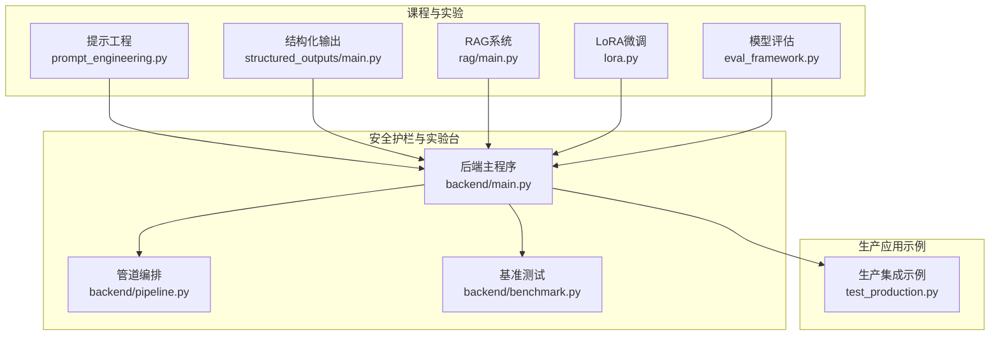
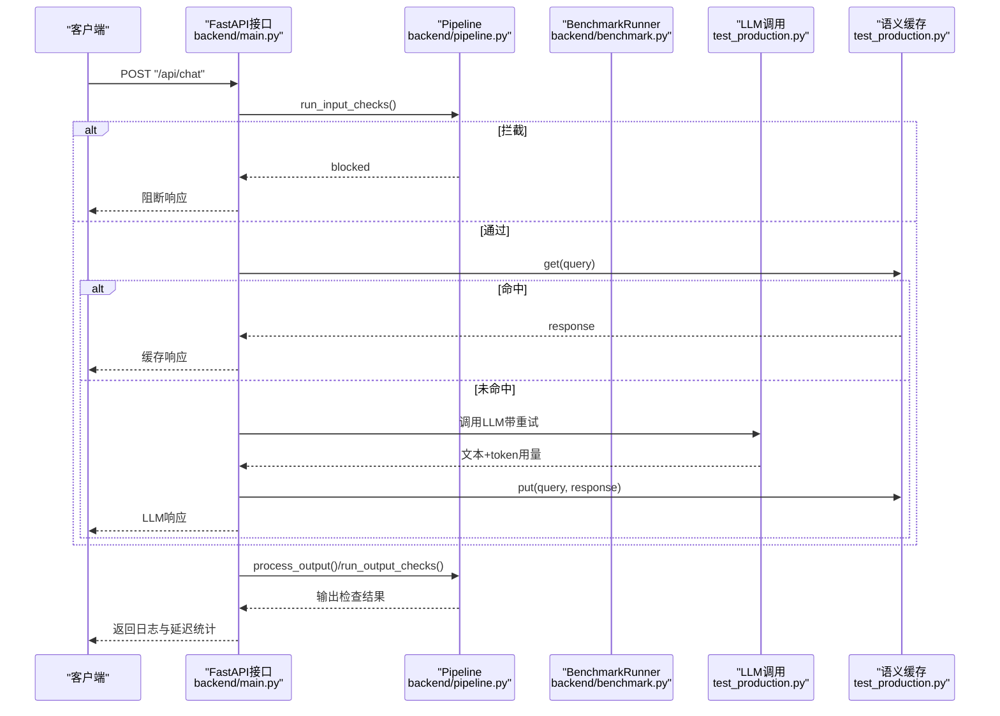
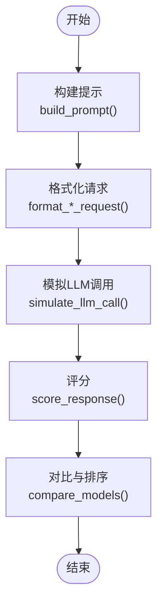
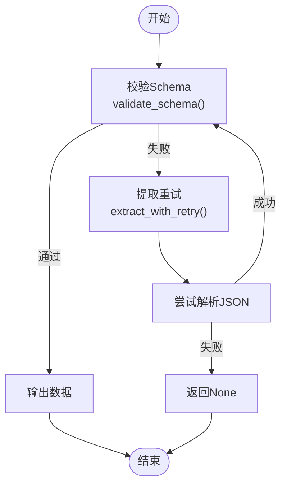
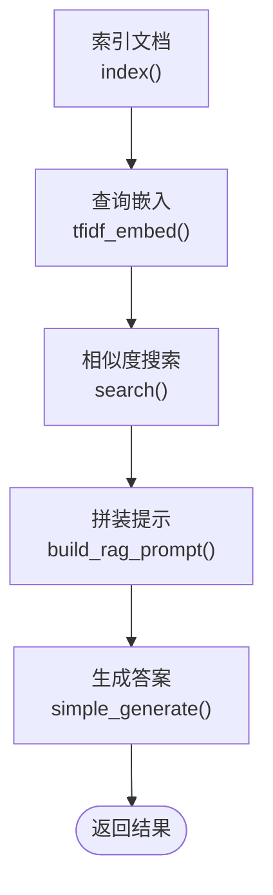
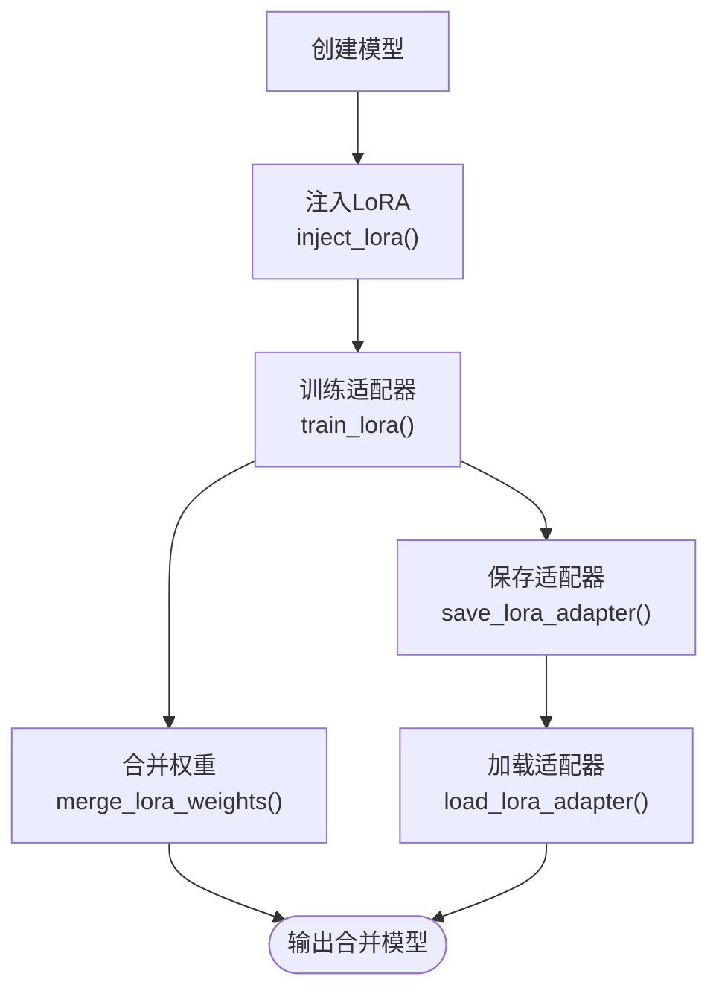
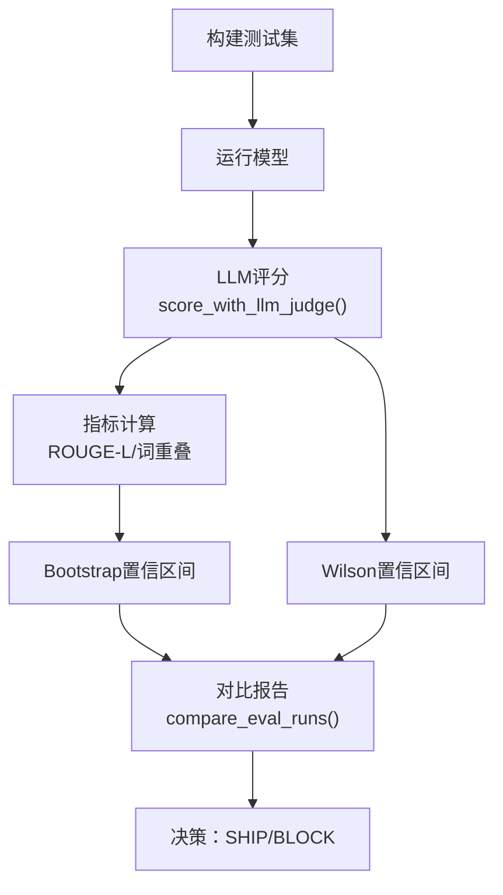
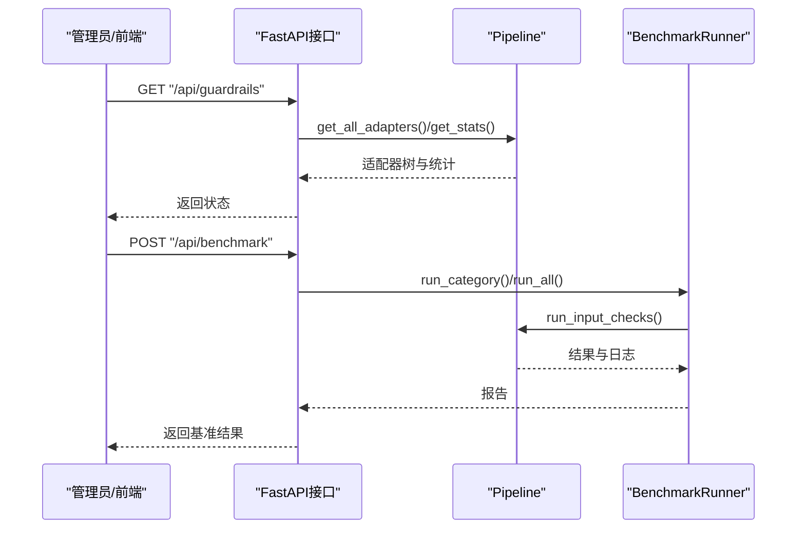
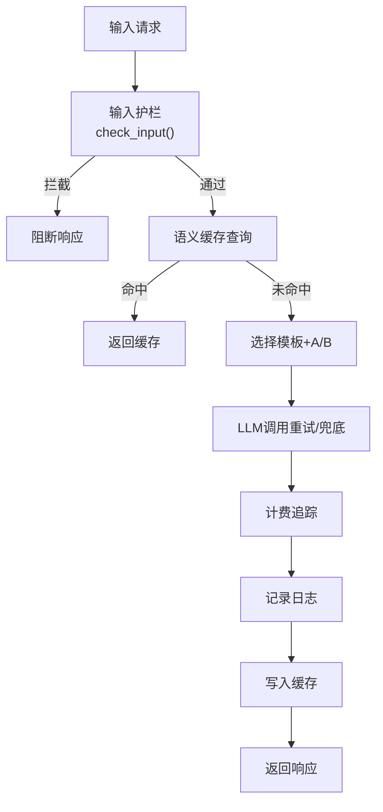
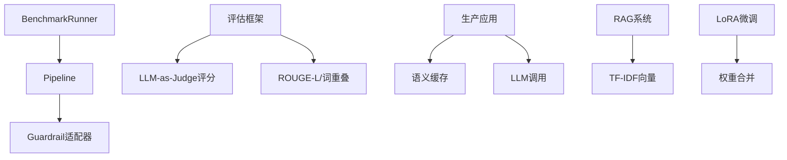

# 阶段11：LLM工程实践

<cite>
**本文档引用的文件**
- [phases/11-llm-engineering/README.md](file://phases/11-llm-engineering/README.md)
- [guardrails-sandbox/backend/main.py](file://guardrails-sandbox/backend/main.py)
- [guardrails-sandbox/backend/pipeline.py](file://guardrails-sandbox/backend/pipeline.py)
- [guardrails-sandbox/backend/benchmark.py](file://guardrails-sandbox/backend/benchmark.py)
- [test_production.py](file://test_production.py)
- [phases/11-llm-engineering/01-prompt-engineering/code/prompt_engineering.py](file://phases/11-llm-engineering/01-prompt-engineering/code/prompt_engineering.py)
- [phases/11-llm-engineering/03-structured-outputs/code/main.py](file://phases/11-llm-engineering/03-structured-outputs/code/main.py)
- [phases/11-llm-engineering/06-rag/code/main.py](file://phases/11-llm-engineering/06-rag/code/main.py)
- [phases/11-llm-engineering/08-fine-tuning-lora/code/lora.py](file://phases/11-llm-engineering/08-fine-tuning-lora/code/lora.py)
- [phases/11-llm-engineering/10-evaluation/code/eval_framework.py](file://phases/11-llm-engineering/10-evaluation/code/eval_framework.py)
</cite>

## 目录
1. [引言](#引言)
2. [项目结构](#项目结构)
3. [核心组件](#核心组件)
4. [架构总览](#架构总览)
5. [详细组件分析](#详细组件分析)
6. [依赖分析](#依赖分析)
7. [性能考虑](#性能考虑)
8. [故障排查指南](#故障排查指南)
9. [结论](#结论)
10. [附录](#附录)

## 引言
本阶段聚焦于LLM工程实践，围绕17门核心课程展开：提示工程、少样本思维链、结构化输出、嵌入技术、上下文工程、RAG系统、高级RAG、LoRA微调、函数调用、模型评估、缓存成本优化、安全防护、生产应用、MCP协议、提示缓存、LangGraph状态机、智能体框架权衡。目标是将理论转化为可落地的工程能力，涵盖从算法设计、系统架构到生产部署与运维的全流程。

## 项目结构
本阶段的学习内容以“课程+实验台”的形式组织，配套有可直接运行的代码示例与沙箱系统，便于快速验证与迭代。核心目录如下：
- phases/11-llm-engineering：17门课程的代码、文档与练习
- guardrails-sandbox：安全护栏与实验台的后端服务，提供API与可视化界面
- test_production.py：生产级应用整合示例，串联提示模板、语义缓存、安全护栏、重试与计费

**图表来源**
- [phases/11-llm-engineering/01-prompt-engineering/code/prompt_engineering.py:1-573](file://phases/11-llm-engineering/01-prompt-engineering/code/prompt_engineering.py#L1-L573)
- [phases/11-llm-engineering/03-structured-outputs/code/main.py:1-383](file://phases/11-llm-engineering/03-structured-outputs/code/main.py#L1-L383)
- [phases/11-llm-engineering/06-rag/code/main.py:1-344](file://phases/11-llm-engineering/06-rag/code/main.py#L1-L344)
- [phases/11-llm-engineering/08-fine-tuning-lora/code/lora.py:1-381](file://phases/11-llm-engineering/08-fine-tuning-lora/code/lora.py#L1-L381)
- [phases/11-llm-engineering/10-evaluation/code/eval_framework.py:1-476](file://phases/11-llm-engineering/10-evaluation/code/eval_framework.py#L1-L476)
- [guardrails-sandbox/backend/main.py:1-421](file://guardrails-sandbox/backend/main.py#L1-L421)
- [guardrails-sandbox/backend/pipeline.py:1-285](file://guardrails-sandbox/backend/pipeline.py#L1-L285)
- [guardrails-sandbox/backend/benchmark.py:1-169](file://guardrails-sandbox/backend/benchmark.py#L1-L169)
- [test_production.py:1-521](file://test_production.py#L1-L521)

**章节来源**
- [phases/11-llm-engineering/README.md:1-6](file://phases/11-llm-engineering/README.md#L1-L6)

## 核心组件
- 提示工程与模式库：定义多种提示模式（角色扮演、少样本、思维链、模板填充、批判性思考、域约束、元提示、分解、受众适配、边界），并提供跨模型格式化与评分比较工具。
- 结构化输出与约束解码：基于JSON Schema进行严格校验，支持从LLM输出中提取结构化数据；提供“有效下一token”预测辅助约束解码。
- RAG系统：实现文档分块、TF-IDF词向量化、余弦相似度检索与提示拼装，演示从索引到生成的完整流程。
- LoRA微调：冻结基础权重，训练低秩矩阵A、B，支持合并权重与适配器持久化，模拟QLoRA（4-bit量化+LoRA）。
- 模型评估：提供LLM-as-Judge评分体系、ROUGE-L、词重叠、Bootstrap/Wilson置信区间等指标，支持对比实验与回归检测。
- 安全护栏与实验台：Pipeline编排多层Guardrail（输入/输出），支持开关切换、统计与拦截历史；BenchmarkRunner用于自动化评测。
- 生产应用整合：提示模板管理、语义缓存、安全护栏、重试与指数退避、计费追踪、健康检查与日志记录。

**章节来源**
- [phases/11-llm-engineering/01-prompt-engineering/code/prompt_engineering.py:1-573](file://phases/11-llm-engineering/01-prompt-engineering/code/prompt_engineering.py#L1-L573)
- [phases/11-llm-engineering/03-structured-outputs/code/main.py:1-383](file://phases/11-llm-engineering/03-structured-outputs/code/main.py#L1-L383)
- [phases/11-llm-engineering/06-rag/code/main.py:1-344](file://phases/11-llm-engineering/06-rag/code/main.py#L1-L344)
- [phases/11-llm-engineering/08-fine-tuning-lora/code/lora.py:1-381](file://phases/11-llm-engineering/08-fine-tuning-lora/code/lora.py#L1-L381)
- [phases/11-llm-engineering/10-evaluation/code/eval_framework.py:1-476](file://phases/11-llm-engineering/10-evaluation/code/eval_framework.py#L1-L476)
- [guardrails-sandbox/backend/pipeline.py:1-285](file://guardrails-sandbox/backend/pipeline.py#L1-L285)
- [guardrails-sandbox/backend/benchmark.py:1-169](file://guardrails-sandbox/backend/benchmark.py#L1-L169)
- [test_production.py:1-521](file://test_production.py#L1-L521)

## 架构总览
下图展示从客户端请求到最终响应的关键路径，以及安全护栏、语义缓存、LLM调用与计费追踪的协作关系。

**图表来源**
- [guardrails-sandbox/backend/main.py:155-220](file://guardrails-sandbox/backend/main.py#L155-L220)
- [guardrails-sandbox/backend/pipeline.py:31-160](file://guardrails-sandbox/backend/pipeline.py#L31-L160)
- [test_production.py:329-389](file://test_production.py#L329-L389)

## 详细组件分析

### 组件A：提示工程与模式库
- 功能要点
  - 多种提示模式（Persona、Few-Shot、Chain-of-Thought、Template Fill、Critique、Guardrail、Meta-Prompt、Decomposition、Audience Adapt、Boundary）
  - 跨模型格式化（OpenAI、Anthropic、Google）
  - 模型测试与评分（长度、关键词覆盖率、禁止词、格式有效性）
  - 测试套件与排行榜
- 关键流程
  - 构建提示 → 格式化请求 → 模拟LLM调用 → 评分与排序

**图表来源**
- [phases/11-llm-engineering/01-prompt-engineering/code/prompt_engineering.py:170-318](file://phases/11-llm-engineering/01-prompt-engineering/code/prompt_engineering.py#L170-L318)

**章节来源**
- [phases/11-llm-engineering/01-prompt-engineering/code/prompt_engineering.py:1-573](file://phases/11-llm-engineering/01-prompt-engineering/code/prompt_engineering.py#L1-L573)

### 组件B：结构化输出与约束解码
- 功能要点
  - JSON Schema校验（对象、数组、字符串、数字、布尔、整数）
  - 模式生成（从Python字段定义到Schema）
  - 约束解码（基于部分JSON推导有效下一token集合）
  - 提取重试（解析失败或Schema不合法时自动重试）
- 关键流程
  - 校验Schema → 生成模式 → 约束解码 → 提取重试 → 输出结果

**图表来源**
- [phases/11-llm-engineering/03-structured-outputs/code/main.py:4-210](file://phases/11-llm-engineering/03-structured-outputs/code/main.py#L4-L210)

**章节来源**
- [phases/11-llm-engineering/03-structured-outputs/code/main.py:1-383](file://phases/11-llm-engineering/03-structured-outputs/code/main.py#L1-L383)

### 组件C：RAG系统
- 功能要点
  - 文档分块（固定长度+重叠）
  - TF-IDF词表构建与IDF计算
  - 查询向量化与余弦相似度检索
  - 上下文拼装与简单生成
- 关键流程
  - 索引文档 → 查询嵌入 → 搜索Top-K → 拼装提示 → 生成答案

**图表来源**
- [phases/11-llm-engineering/06-rag/code/main.py:105-158](file://phases/11-llm-engineering/06-rag/code/main.py#L105-L158)

**章节来源**
- [phases/11-llm-engineering/06-rag/code/main.py:1-344](file://phases/11-llm-engineering/06-rag/code/main.py#L1-L344)

### 组件D：LoRA微调与QLoRA
- 功能要点
  - 冻结基础权重，注入低秩适配器（A、B矩阵）
  - 训练仅更新适配器参数，显著降低参数量
  - 权重合并与适配器保存/加载
  - 模拟QLoRA：量化基础权重，适配器保持高精度
- 关键流程
  - 创建模型 → 注入LoRA → 训练适配器 → 合并权重/保存适配器 → 多适配器推理

**图表来源**
- [phases/11-llm-engineering/08-fine-tuning-lora/code/lora.py:35-81](file://phases/11-llm-engineering/08-fine-tuning-lora/code/lora.py#L35-L81)
- [phases/11-llm-engineering/08-fine-tuning-lora/code/lora.py:122-152](file://phases/11-llm-engineering/08-fine-tuning-lora/code/lora.py#L122-L152)
- [phases/11-llm-engineering/08-fine-tuning-lora/code/lora.py:155-176](file://phases/11-llm-engineering/08-fine-tuning-lora/code/lora.py#L155-L176)

**章节来源**
- [phases/11-llm-engineering/08-fine-tuning-lora/code/lora.py:1-381](file://phases/11-llm-engineering/08-fine-tuning-lora/code/lora.py#L1-L381)

### 组件E：模型评估框架
- 功能要点
  - LLM-as-Judge评分（相关性、正确性、有用性、安全性）
  - 自动化指标（ROUGE-L、词重叠）
  - 统计方法（Bootstrap置信区间、Wilson置信区间）
  - 对比实验与回归检测
- 关键流程
  - 构建测试集 → 运行模型 → LLM评分 → 指标计算 → 对比报告

**图表来源**
- [phases/11-llm-engineering/10-evaluation/code/eval_framework.py:284-368](file://phases/11-llm-engineering/10-evaluation/code/eval_framework.py#L284-L368)

**章节来源**
- [phases/11-llm-engineering/10-evaluation/code/eval_framework.py:1-476](file://phases/11-llm-engineering/10-evaluation/code/eval_framework.py#L1-L476)

### 组件F：安全护栏与实验台
- 功能要点
  - Pipeline编排：按组/类目/顺序注册Guardrail适配器，支持启用/禁用与统计
  - 输入/输出检查：短路拦截、脱敏与日志记录
  - BenchmarkRunner：对用例运行输入检查，计算TPR/FPR/准确率等
  - FastAPI接口：提供Guardrails状态、对比模式、MCP工具调用等
- 关键流程
  - 注册适配器 → 输入检查 → LLM调用 → 输出检查 → 统计与历史

**图表来源**
- [guardrails-sandbox/backend/main.py:121-153](file://guardrails-sandbox/backend/main.py#L121-L153)
- [guardrails-sandbox/backend/main.py:272-280](file://guardrails-sandbox/backend/main.py#L272-L280)
- [guardrails-sandbox/backend/pipeline.py:174-235](file://guardrails-sandbox/backend/pipeline.py#L174-L235)
- [guardrails-sandbox/backend/benchmark.py:14-80](file://guardrails-sandbox/backend/benchmark.py#L14-L80)

**章节来源**
- [guardrails-sandbox/backend/main.py:1-421](file://guardrails-sandbox/backend/main.py#L1-L421)
- [guardrails-sandbox/backend/pipeline.py:1-285](file://guardrails-sandbox/backend/pipeline.py#L1-L285)
- [guardrails-sandbox/backend/benchmark.py:1-169](file://guardrails-sandbox/backend/benchmark.py#L1-L169)

### 组件G：生产应用整合
- 功能要点
  - 提示模板管理与A/B测试
  - 语义缓存（向量相似度匹配）
  - 输入安全护栏（注入与PII检测）
  - LLM调用（重试+指数退避、兜底）
  - 计费追踪（token估算与成本计算）
  - 健康检查与日志记录
- 关键流程
  - 输入护栏 → 语义缓存 → 选择模板 → LLM调用（重试/兜底） → 计费与日志 → 缓存写入

**图表来源**
- [test_production.py:329-389](file://test_production.py#L329-L389)

**章节来源**
- [test_production.py:1-521](file://test_production.py#L1-L521)

## 依赖分析
- 组件耦合
  - Pipeline与各Guardrail适配器松耦合，通过统一接口注册与排序
  - 评估框架与测试套件解耦，便于扩展新指标与测试用例
  - 生产应用示例与LLM服务封装，便于替换不同模型与平台
- 外部依赖
  - 模型侧：OpenAI、Anthropic、Google Generative Language等
  - 向量与嵌入：sentence-transformers（语义缓存）、TF-IDF（RAG）
  - 工具库：Pydantic（数据校验）、FastAPI（服务）、NumPy/统计库（评估）

**图表来源**
- [guardrails-sandbox/backend/pipeline.py:18-23](file://guardrails-sandbox/backend/pipeline.py#L18-L23)
- [guardrails-sandbox/backend/benchmark.py:14-27](file://guardrails-sandbox/backend/benchmark.py#L14-L27)
- [phases/11-llm-engineering/10-evaluation/code/eval_framework.py:82-95](file://phases/11-llm-engineering/10-evaluation/code/eval_framework.py#L82-L95)
- [test_production.py:82-142](file://test_production.py#L82-L142)
- [phases/11-llm-engineering/06-rag/code/main.py:105-133](file://phases/11-llm-engineering/06-rag/code/main.py#L105-L133)
- [phases/11-llm-engineering/08-fine-tuning-lora/code/lora.py:67-81](file://phases/11-llm-engineering/08-fine-tuning-lora/code/lora.py#L67-L81)

**章节来源**
- [guardrails-sandbox/backend/pipeline.py:1-285](file://guardrails-sandbox/backend/pipeline.py#L1-L285)
- [guardrails-sandbox/backend/benchmark.py:1-169](file://guardrails-sandbox/backend/benchmark.py#L1-L169)
- [phases/11-llm-engineering/10-evaluation/code/eval_framework.py:1-476](file://phases/11-llm-engineering/10-evaluation/code/eval_framework.py#L1-L476)
- [test_production.py:1-521](file://test_production.py#L1-L521)
- [phases/11-llm-engineering/06-rag/code/main.py:1-344](file://phases/11-llm-engineering/06-rag/code/main.py#L1-L344)
- [phases/11-llm-engineering/08-fine-tuning-lora/code/lora.py:1-381](file://phases/11-llm-engineering/08-fine-tuning-lora/code/lora.py#L1-L381)

## 性能考虑
- 提示工程
  - 使用少样本与思维链减少幻觉，提高稳定性
  - 控制温度与最大token，平衡创造性与可控性
- 结构化输出
  - 采用JSON Schema与约束解码，减少后处理开销
- RAG系统
  - TF-IDF适合教学演示；生产建议使用神经嵌入（如text-embedding-3-small）与更优检索器
  - 合理的分块大小与重叠，提升召回质量
- LoRA微调
  - 仅训练适配器参数，显著降低训练与推理成本
  - QLoRA进一步压缩基础权重，适合资源受限场景
- 评估与A/B测试
  - 使用Bootstrap/Wilson置信区间避免小样本偏差
  - 对关键指标设定阈值，确保回归检测的稳健性
- 生产应用
  - 语义缓存命中率直接影响延迟与成本
  - 指数退避与兜底策略提升可用性
  - 计费追踪与健康检查保障可观测性

## 故障排查指南
- 安全护栏
  - 检查拦截历史与各适配器统计，定位阻断来源
  - 通过对比模式（有/无护栏）快速验证护栏效果
- 评估回归
  - 对比基线与新版本的平均分与置信区间，识别显著下降
  - 按类别细分，定位薄弱环节
- 生产问题
  - 检查缓存命中率与延迟，确认语义缓存是否生效
  - 核对计费追踪与日志，定位异常请求与错误模型

**章节来源**
- [guardrails-sandbox/backend/main.py:136-153](file://guardrails-sandbox/backend/main.py#L136-L153)
- [guardrails-sandbox/backend/main.py:223-256](file://guardrails-sandbox/backend/main.py#L223-L256)
- [guardrails-sandbox/backend/pipeline.py:247-285](file://guardrails-sandbox/backend/pipeline.py#L247-L285)
- [phases/11-llm-engineering/10-evaluation/code/eval_framework.py:300-368](file://phases/11-llm-engineering/10-evaluation/code/eval_framework.py#L300-L368)
- [test_production.py:407-418](file://test_production.py#L407-L418)

## 结论
本阶段通过17门核心课程与配套实验台，系统性地覆盖了LLM工程的关键能力：从提示设计、结构化输出、RAG检索到LoRA微调与模型评估，并在安全护栏与生产应用层面提供了可操作的工程化方案。结合Pipeline编排与BenchmarkRunner，能够高效验证与迭代系统性能，为生产部署打下坚实基础。

## 附录
- 快速上手建议
  - 先完成提示工程与结构化输出的基础实验，掌握模式与约束解码
  - 实践RAG系统，理解分块与检索对下游生成的影响
  - 尝试LoRA微调与QLoRA，体验参数效率与推理成本的权衡
  - 使用评估框架进行对比实验，建立数据驱动的改进闭环
  - 在安全护栏实验台中演练拦截策略与基准测试
  - 参考生产应用示例，整合模板、缓存、护栏与计费