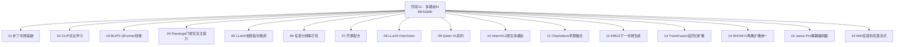
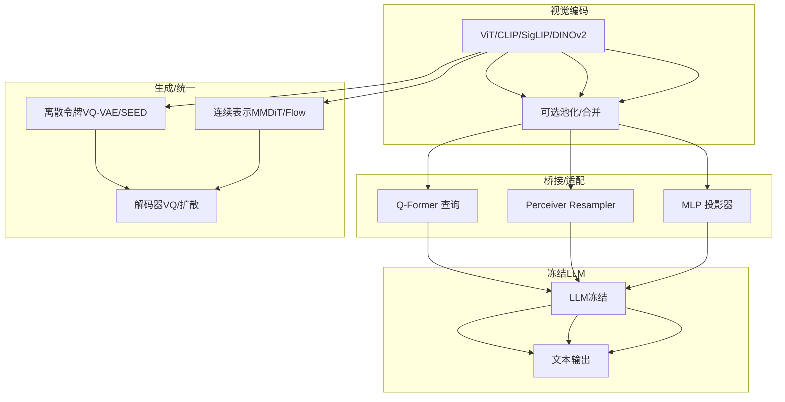
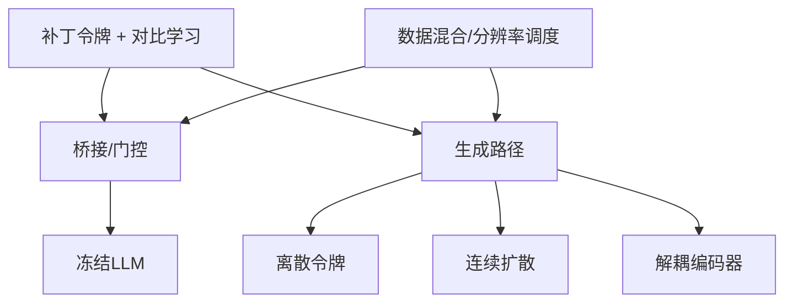

# 阶段12：多模态AI

<cite>
**本文引用的文件**
- [阶段12：多模态AI（总览）](file://phases/12-multimodal-ai/README.md)
- [视觉Transformer与补丁令牌基础](file://phases/12-multimodal-ai/01-vision-transformer-patch-tokens/docs/en.md)
- [CLIP对比学习预训练](file://phases/12-multimodal-ai/02-clip-contrastive-pretraining/docs/en.md)
- [BLIP2-QFormer桥接](file://phases/12-multimodal-ai/03-blip2-qformer-bridge/docs/en.md)
- [Flamingo门控交叉注意力](file://phases/12-multimodal-ai/04-flamingo-gated-cross-attention/docs/en.md)
- [LLaVA视觉指令微调](file://phases/12-multimodal-ai/05-llava-visual-instruction-tuning/docs/en.md)
- [任意分辨率补丁打包](file://phases/12-multimodal-ai/06-any-resolution-patch-n-pack/docs/en.md)
- [开源权重VLM配方](file://phases/12-multimodal-ai/07-open-weight-vlm-recipes/docs/en.md)
- [LLaVA OneVision单多视频](file://phases/12-multimodal-ai/08-llava-onevision-single-multi-video/docs/en.md)
- [Qwen VL系列动态FPS](file://phases/12-multimodal-ai/09-qwen-vl-family-dynamic-fps/docs/en.md)
- [InternVL3原生多模态](file://phases/12-multimodal-ai/10-internvl3-native-multimodal/docs/en.md)
- [Chameleon早期融合](file://phases/12-multimodal-ai/11-chameleon-early-fusion-tokens/docs/en.md)
- [EMU3下一令牌生成](file://phases/12-multimodal-ai/12-emu3-next-token-for-generation/docs/en.md)
- [TransFusion自回归扩散](file://phases/12-multimodal-ai/13-transfusion-autoregressive-diffusion/docs/en.md)
- [SHOW-O离散扩散统一](file://phases/12-multimodal-ai/14-show-o-discrete-diffusion-unified/docs/en.md)
- [Janus Pro解耦编码器](file://phases/12-multimodal-ai/15-janus-pro-decoupled-encoders/docs/en.md)
- [MIO任意到任意流式](file://phases/12-multimodal-ai/16-mio-any-to-any-streaming/docs/en.md)
</cite>

## 目录
1. [引言](#引言)
2. [项目结构](#项目结构)
3. [核心组件](#核心组件)
4. [架构总览](#架构总览)
5. [详细组件分析](#详细组件分析)
6. [依赖关系分析](#依赖关系分析)
7. [性能考量](#性能考量)
8. [故障排查指南](#故障排查指南)
9. [结论](#结论)
10. [附录](#附录)

## 引言
本阶段系统性梳理2024—2026年多模态前沿进展，围绕“视觉补丁令牌”“对比学习预训练”“桥接模块”“门控交叉注意力”“视觉指令微调”“任意分辨率打包”“开源配方”“统一场景（单图/多图/视频）”“动态FPS视频”“原生多模态预训练”“早期融合令牌化”“自回归扩散统一”“离散扩散统一”“解耦编码器”“任意到任意流式”等25门核心主题，解释技术演进脉络、关键权衡与工程实践，帮助读者在有限时间内掌握多模态工程的关键路径。

## 项目结构
阶段12由16个子课程构成，覆盖从基础补丁令牌到前沿统一模型的完整知识谱系。每个课程包含英文讲义、Python实现与技能输出物，形成“学—做—用”的闭环。

图示来源
- [阶段12：多模态AI（总览）](file://phases/12-multimodal-ai/README.md)

章节来源
- [阶段12：多模态AI（总览）](file://phases/12-multimodal-ai/README.md)

## 核心组件
- 视觉编码器与补丁令牌：将图像切分为固定大小的非重叠块，线性投影至隐藏维，结合位置编码（RoPE/2D-RoPE）形成序列。
- 对比学习预训练（CLIP/SigLIP）：双塔结构对齐图像与文本嵌入空间，InfoNCE或Sigmoid损失实现大规模无标注对齐。
- 桥接模块：Q-Former（可学习查询+交叉注意力）、Perceiver Resampler、MLP投影器；用于将视觉特征映射到LLM词表空间。
- 门控交叉注意力：在冻结LLM层间插入带门控的交叉注意力，实现少样本内向学习与交错输入。
- 视觉指令微调（LLaVA）：以2层MLP将补丁映射至LLM维度，端到端指令数据驱动的微调。
- 任意分辨率与打包：NaViT式拼接、AnyRes网格切片、M-RoPE动态分辨率、NaFlex灵活预算。
- 开源配方：五轴设计空间（编码器、桥接、LLM、数据混合、分辨率调度），实证指导最佳实践。
- 统一场景（OneVision）：单图/多图/视频共享视觉预算与三阶段课程，实现跨场景迁移。
- 动态FPS视频：绝对时间戳、动态采样率、窗口注意力、结构化工具调用输出。
- 原生多模态预训练（InternVL3）：从头训练文本/交错/配对/视频混合语料，消除对齐债务。
- 早期融合令牌化（Chameleon）：VQ-VAE将图像转为离散令牌，共享词表，支持混合模态生成。
- 自回归扩散统一（TransFusion）：连续图像+扩散损失与文本NTP共享权重，MMDiT变体。
- 离散扩散统一（SHOW-O）：离散令牌+掩码预测，平行解码，统一VQA/T2I/修复。
- 解耦编码器（Janus-Pro）：理解用SigLIP，生成用VQ，共享Transformer主体。
- 任意到任意流式（MIO）：文本/图像/语音/音乐四路离散令牌，流水线推理与延迟预算。

章节来源
- [视觉Transformer与补丁令牌基础](file://phases/12-multimodal-ai/01-vision-transformer-patch-tokens/docs/en.md)
- [CLIP对比学习预训练](file://phases/12-multimodal-ai/02-clip-contrastive-pretraining/docs/en.md)
- [BLIP2-QFormer桥接](file://phases/12-multimodal-ai/03-blip2-qformer-bridge/docs/en.md)
- [Flamingo门控交叉注意力](file://phases/12-multimodal-ai/04-flamingo-gated-cross-attention/docs/en.md)
- [LLaVA视觉指令微调](file://phases/12-multimodal-ai/05-llava-visual-instruction-tuning/docs/en.md)
- [任意分辨率补丁打包](file://phases/12-multimodal-ai/06-any-resolution-patch-n-pack/docs/en.md)
- [开源权重VLM配方](file://phases/12-multimodal-ai/07-open-weight-vlm-recipes/docs/en.md)
- [LLaVA OneVision单多视频](file://phases/12-multimodal-ai/08-llava-onevision-single-multi-video/docs/en.md)
- [Qwen VL系列动态FPS](file://phases/12-multimodal-ai/09-qwen-vl-family-dynamic-fps/docs/en.md)
- [InternVL3原生多模态](file://phases/12-multimodal-ai/10-internvl3-native-multimodal/docs/en.md)
- [Chameleon早期融合令牌化](file://phases/12-multimodal-ai/11-chameleon-early-fusion-tokens/docs/en.md)
- [EMU3下一令牌生成](file://phases/12-multimodal-ai/12-emu3-next-token-for-generation/docs/en.md)
- [TransFusion自回归扩散](file://phases/12-multimodal-ai/13-transfusion-autoregressive-diffusion/docs/en.md)
- [SHOW-O离散扩散统一](file://phases/12-multimodal-ai/14-show-o-discrete-diffusion-unified/docs/en.md)
- [Janus Pro解耦编码器](file://phases/12-multimodal-ai/15-janus-pro-decoupled-encoders/docs/en.md)
- [MIO任意到任意流式](file://phases/12-multimodal-ai/16-mio-any-to-any-streaming/docs/en.md)

## 架构总览
下图展示从“视觉编码”到“桥接/门控”再到“LLM/统一模型”的典型流水线，以及若干替代方案（离散令牌、连续扩散、解耦编码器）。

图示来源
- [视觉Transformer与补丁令牌基础](file://phases/12-multimodal-ai/01-vision-transformer-patch-tokens/docs/en.md)
- [BLIP2-QFormer桥接](file://phases/12-multimodal-ai/03-blip2-qformer-bridge/docs/en.md)
- [Flamingo门控交叉注意力](file://phases/12-multimodal-ai/04-flamingo-gated-cross-attention/docs/en.md)
- [LLaVA视觉指令微调](file://phases/12-multimodal-ai/05-llava-visual-instruction-tuning/docs/en.md)
- [Chameleon早期融合令牌化](file://phases/12-multimodal-ai/11-chameleon-early-fusion-tokens/docs/en.md)
- [TransFusion自回归扩散](file://phases/12-multimodal-ai/13-transfusion-autoregressive-diffusion/docs/en.md)
- [SHOW-O离散扩散统一](file://phases/12-multimodal-ai/14-show-o-discrete-diffusion-unified/docs/en.md)
- [Janus Pro解耦编码器](file://phases/12-multimodal-ai/15-janus-pro-decoupled-encoders/docs/en.md)

## 详细组件分析

### 视觉Transformer与补丁令牌
- 关键点：补丁切分、线性投影、2D-RoPE、CLS/均值/注册令牌、预训练范式（CLIP/MAE/DINOv2/SigLIP）。
- 工程要点：参数量估算、FLOPs计算、网格尺寸与分辨率权衡、原生分辨率打包（NaFlex）。
- 实践建议：根据下游任务选择池化策略；在高分辨率OCR/图表场景优先更多令牌。

章节来源
- [视觉Transformer与补丁令牌基础](file://phases/12-multimodal-ai/01-vision-transformer-patch-tokens/docs/en.md)

### CLIP对比学习预训练
- 关键点：双塔结构、InfoNCE损失、温度参数、Sigmoid成对损失（SigLIP）优势、零样本分类。
- 工程要点：分布式训练中的通信成本、提示模板设计、线性探测与微调权衡。
- 实践建议：优先SigLIP 2的NaFlex与多语言能力；在中文/多语言场景优先考虑。

章节来源
- [CLIP对比学习预训练](file://phases/12-multimodal-ai/02-clip-contrastive-pretraining/docs/en.md)

### BLIP2-QFormer桥接
- 关键点：32个可学习查询通过交叉注意力聚合视觉信息，两阶段训练（表示+生成）。
- 工程要点：参数经济性、与Perceiver Resampler/MLP投影器的权衡、InstructBLIP扩展。
- 实践建议：长视频/多图场景优先Q-Former；追求高质量-per-token时可用MLP。

章节来源
- [BLIP2-QFormer桥接](file://phases/12-multimodal-ai/03-blip2-qformer-bridge/docs/en.md)

### Flamingo门控交叉注意力
- 关键点：在冻结LLM层间插入门控交叉注意力，tanh门初始化为0，交错输入掩码，少样本内向学习。
- 工程要点：Perceiver Resampler固定潜变量数，跨图像注意力掩码，训练数据规模。
- 实践建议：需要交错输入与少样本泛化时采用；否则LLaVA家族更简单高效。

章节来源
- [Flamingo门控交叉注意力](file://phases/12-multimodal-ai/04-flamingo-gated-cross-attention/docs/en.md)

### LLaVA视觉指令微调
- 关键点：2层MLP直接将补丁映射至LLM维度，两阶段：投影器对齐+视觉指令微调；GPT-4合成指令数据。
- 工程要点：训练成本低、LLM可替换、AnyRes多裁剪提升OCR；Token预算与上下文限制。
- 实践建议：通用VQA/对话首选；需要强视觉细节时结合AnyRes。

章节来源
- [LLaVA视觉指令微调](file://phases/12-multimodal-ai/05-llava-visual-instruction-tuning/docs/en.md)

### 任意分辨率补丁打包
- 关键点：NaViT拼接、AnyRes网格切片、M-RoPE动态分辨率、NaFlex灵活预算。
- 工程要点：块对角注意力掩码、FlashAttention变长路径、任务导向的令牌预算。
- 实践建议：按任务选择策略（OCR用高令牌，照片用低令牌），避免方形缩放导致的失真与浪费。

章节来源
- [任意分辨率补丁打包](file://phases/12-multimodal-ai/06-any-resolution-patch-n-pack/docs/en.md)

### 开源权重VLM配方
- 关键点：五轴设计空间（编码器、桥接、LLM、数据混合、分辨率调度）；实证结论：编码器与数据混合更重要。
- 工程要点：PixMo/ShareGPT4V/ Cauldron数据组合；分辨率阶梯式提升；Prismatic控制变量实验。
- 实践建议：默认SigLIP 2 + MLP + 7B/70B LLM + 动态分辨率 + 人类密集描述。

章节来源
- [开源权重VLM配方](file://phases/12-multimodal-ai/07-open-weight-vlm-recipes/docs/en.md)

### LLaVA OneVision单多视频
- 关键点：统一视觉预算（约3000-4000令牌/样本），三阶段课程（单图→多图→视频），跨场景迁移。
- 工程要点：不同场景的分辨率/池化/帧数分配；课程顺序影响性能。
- 实践建议：先单图再视频，避免灾难性遗忘；移动端UI代理可受益于iPhone截图代理等涌现能力。

章节来源
- [LLaVA OneVision单多视频](file://phases/12-multimodal-ai/08-llava-onevision-single-multi-video/docs/en.md)

### Qwen VL系列动态FPS
- 关键点：M-RoPE三轴旋转（时/高/宽）、动态FPS采样、窗口注意力、结构化工具调用输出。
- 工程要点：绝对时间戳、动态FPS与事件检测精度权衡、JSON解析稳定性。
- 实践建议：监控/Agent/动作识别场景优先动态FPS；GUI/屏幕理解强调结构化输出。

章节来源
- [Qwen VL系列动态FPS](file://phases/12-multimodal-ai/09-qwen-vl-family-dynamic-fps/docs/en.md)

### InternVL3原生多模态预训练
- 关键点：从头训练文本/交错/配对/视频混合语料，消除对齐债务；V2PE可变视觉位置编码；ViR路由与DvD解耦部署。
- 工程要点：单阶段vs多阶段质量差异；数据稀缺性与计算成本。
- 实践建议：追求通用性与一致性时倾向原生预训练；复用现有LLM时可选后加式。

章节来源
- [InternVL3原生多模态](file://phases/12-multimodal-ai/10-internvl3-native-multimodal/docs/en.md)

### Chameleon早期融合令牌化
- 关键点：VQ-VAE将图像转为离散令牌，共享词表，混合模态生成；QK-Norm/Dropout/LayerNorm顺序稳定技巧。
- 工程要点：重建上限（PSNR）与生成质量权衡；推理开销（每张图需解码器）。
- 实践建议：需要图像生成/混合模态输出时采用；仅理解场景优先adapter-VLM。

章节来源
- [Chameleon早期融合令牌化](file://phases/12-multimodal-ai/11-chameleon-early-fusion-tokens/docs/en.md)

### EMU3下一令牌生成
- 关键点：IBQ类高质量VQ、3D视频量化、单损失NTP、CFG提升质量、三角色一体（生成/感知/视频）。
- 工程要点：训练/推理成本对比、采样速度与质量权衡。
- 实践建议：追求与感知一致的统一生成时采用；扩散管线成熟时可并行参考。

章节来源
- [EMU3下一令牌生成](file://phases/12-multimodal-ai/12-emu3-next-token-for-generation/docs/en.md)

### TransFusion自回归扩散
- 关键点：连续图像+扩散损失与文本NTP共享权重，因果文本+图像块双向掩码，MMDiT变体。
- 工程要点：两损失权重平衡、训练动态复杂度、推理步数与并行化。
- 实践建议：对图像质量要求极高且能接受复杂训练时采用；否则可选离散并行方案。

章节来源
- [TransFusion自回归扩散](file://phases/12-multimodal-ai/13-transfusion-autoregressive-diffusion/docs/en.md)

### SHOW-O离散扩散统一
- 关键点：离散令牌+掩码预测（MaskGIT风格），并行采样，统一VQA/T2I/修复。
- 工程要点：掩码调度（余弦/线性/截断）、commit速率、压缩比与质量权衡。
- 实践建议：需要T2I/修复/多任务统一时采用；推理速度优于自回归但略逊于纯扩散。

章节来源
- [SHOW-O离散扩散统一](file://phases/12-multimodal-ai/14-show-o-discrete-diffusion-unified/docs/en.md)

### Janus Pro解耦编码器
- 关键点：理解用SigLIP，生成用VQ，共享Transformer主体；数据规模扩大带来质量跃迁。
- 工程要点：路由标签/隐式任务切换、阶段化数据混合、初始化来源（LLM MoE）。
- 实践建议：既需要强理解又需要强生成时采用；仅理解/仅生成场景可简化。

章节来源
- [Janus Pro解耦编码器](file://phases/12-multimodal-ai/15-janus-pro-decoupled-encoders/docs/en.md)

### MIO任意到任意流式
- 关键点：文本/图像/语音/音乐四路离散令牌，共享词表，流水线推理，链式视觉思维。
- 工程要点：残差VQ并行解码、延迟预算（麦克风→首字节音频），四阶段课程。
- 实践建议：实时语音助手/多模态Agent优先；仍落后闭源产品在语音自然度与跨模态推理上。

章节来源
- [MIO任意到任意流式](file://phases/12-multimodal-ai/16-mio-any-to-any-streaming/docs/en.md)

## 依赖关系分析
- 共同基础：所有方法均依赖“视觉补丁令牌”与“对比学习预训练”作为编码器基础。
- 桥接/门控：Q-Former/Perceiver Resampler/MLP投影器/门控交叉注意力提供视觉→LLM映射。
- 生成路径分歧：离散令牌（Chameleon/EMU3/SHOW-O）、连续扩散（TransFusion/MMDiT）、解耦编码器（Janus-Pro/InternVL-U）。
- 数据与分辨率：数据混合（人类密集描述/合成指令）与动态分辨率是决定性因素。

图示来源
- [视觉Transformer与补丁令牌基础](file://phases/12-multimodal-ai/01-vision-transformer-patch-tokens/docs/en.md)
- [开源权重VLM配方](file://phases/12-multimodal-ai/07-open-weight-vlm-recipes/docs/en.md)
- [BLIP2-QFormer桥接](file://phases/12-multimodal-ai/03-blip2-qformer-bridge/docs/en.md)
- [Flamingo门控交叉注意力](file://phases/12-multimodal-ai/04-flamingo-gated-cross-attention/docs/en.md)
- [Chameleon早期融合令牌化](file://phases/12-multimodal-ai/11-chameleon-early-fusion-tokens/docs/en.md)
- [TransFusion自回归扩散](file://phases/12-multimodal-ai/13-transfusion-autoregressive-diffusion/docs/en.md)
- [Janus Pro解耦编码器](file://phases/12-multimodal-ai/15-janus-pro-decoupled-encoders/docs/en.md)

## 性能考量
- 训练成本：原生多模态预训练与两阶段生成路径显著增加算力需求；adapter方案复用现有LLM权重，成本更低。
- 推理延迟：MIO/AnyGPT/Chameleon等流水线推理需关注端到端延迟预算；Janus-Pro/TransFusion等生成路径推理步数较多。
- 令牌预算：OCR/图表场景需要更高令牌密度；照片场景可降低令牌密度以节省上下文。
- 质量天花板：离散令牌受量化器质量限制；连续扩散在图像质量上仍有优势；解耦编码器在理解与生成两端分别优化。

## 故障排查指南
- 令牌爆炸：检查分辨率/池化/AnyRes设置，确保统一视觉预算；必要时启用NaFlex/动态分辨率。
- 文本能力退化：若采用后加式VLM，注意对齐债务症状（灾难性遗忘/答案漂移/视觉-文本不一致）；可考虑原生多模态预训练。
- 生成质量不足：评估tokenizer质量（PSNR/重建）与CFG强度；调整损失权重（两损失训练）。
- 流式延迟过高：优化并行解码（残差VQ/窗口注意力）、路由策略（ViR）与部署拓扑（DvD）。

## 结论
阶段12展示了多模态从“后加式适配”走向“原生统一”的关键跃迁：以对比学习预训练为基础，通过桥接/门控/解耦编码器等手段连接视觉与语言，再以离散/连续/统一的生成路径满足多样化任务需求。工程上，数据混合与分辨率调度往往比架构微调更具影响力；在实际产品中，应基于任务目标与资源约束选择合适的配方与部署策略。

## 附录
- 术语速查：补丁/位置嵌入/CLS/注册令牌、InfoNCE/Sigmoid损失、Dual Encoder、Q-Former/Perceiver Resampler、门控交叉注意力、AnyRes/NaFlex/M-RoPE、原生多模态预训练、早期融合/解耦编码器、离散扩散/连续扩散、任意到任意流式。
- 进一步阅读：各课程末尾列出的论文与报告，涵盖方法细节、消融实验与基准结果。