# 阶段13：工具与协议

<cite>
**本文档引用的文件**
- [README.md](file://phases/13-tools-and-protocols/README.md)
- [01-工具接口.md](file://phases/13-tools-and-protocols/01-the-tool-interface/docs/en.md)
- [02-函数调用深度解析.md](file://phases/13-tools-and-protocols/02-function-calling-deep-dive/docs/en.md)
- [03-并行与流式工具调用.md](file://phases/13-tools-and-protocols/03-parallel-and-streaming-tool-calls/docs/en.md)
- [04-结构化输出.md](file://phases/13-tools-and-protocols/04-structured-output/docs/en.md)
- [05-工具模式设计.md](file://phases/13-tools-and-protocols/05-tool-schema-design/docs/en.md)
- [06-MCP基础.md](file://phases/13-tools-and-protocols/06-mcp-fundamentals/docs/en.md)
- [07-构建MCP服务器.md](file://phases/13-tools-and-protocols/07-building-an-mcp-server/docs/en.md)
- [08-构建MCP客户端.md](file://phases/13-tools-and-protocols/08-building-an-mcp-client/docs/en.md)
- [09-MCP传输.md](file://phases/13-tools-and-protocols/09-mcp-transports/docs/en.md)
- [10-MCP资源与提示.md](file://phases/13-tools-and-protocols/10-mcp-resources-and-prompts/docs/en.md)
- [11-MCP采样.md](file://phases/13-tools-and-protocols/11-mcp-sampling/docs/en.md)
- [12-MCP根与启发.md](file://phases/13-tools-and-protocols/12-mcp-roots-and-elicitation/docs/en.md)
- [13-MCP异步任务.md](file://phases/13-tools-and-protocols/13-mcp-async-tasks/docs/en.md)
- [14-MCP应用.md](file://phases/13-tools-and-protocols/14-mcp-apps/docs/en.md)
- [15-MCP安全-工具投毒.md](file://phases/13-tools-and-protocols/15-mcp-security-tool-poisoning/docs/en.md)
- [16-MCP安全-OAuth 2.1.md](file://phases/13-tools-and-protocols/16-mcp-security-oauth-2-1/docs/en.md)
- [17-MCP网关与注册表.md](file://phases/13-tools-and-protocols/17-mcp-gateways-and-registries/docs/en.md)
- [18-MCP认证生产.md](file://phases/13-tools-and-protocols/18-mcp-auth-production/docs/en.md)
- [19-A2A协议.md](file://phases/13-tools-and-protocols/19-a2a-protocol/docs/en.md)
- [20-OpenTelemetry GenAI.md](file://phases/13-tools-and-protocols/20-opentelemetry-genai/docs/en.md)
- [21-LLM路由层.md](file://phases/13-tools-and-protocols/21-llm-routing-layer/docs/en.md)
- [22-Skills与智能体SDK.md](file://phases/13-tools-and-protocols/22-skills-and-agent-sdks/docs/en.md)
- [23-工具生态系统综合项目.md](file://phases/13-tools-and-protocols/23-capstone-tool-ecosystem/docs/en.md)
</cite>

## 目录
1. [引言](#引言)
2. [项目结构](#项目结构)
3. [核心组件](#核心组件)
4. [架构总览](#架构总览)
5. [详细组件分析](#详细组件分析)
6. [依赖关系分析](#依赖关系分析)
7. [性能考量](#性能考量)
8. [故障排查指南](#故障排查指南)
9. [结论](#结论)
10. [附录](#附录)

## 引言
本阶段聚焦“AI工具生态系统与通信协议”，系统性讲解从通用工具接口到跨模型、跨客户端的标准化协议（MCP），再到代理间协作（A2A）、可观测性（OpenTelemetry GenAI）、路由与网关、以及Skills与Agent SDK的完整体系。通过23门核心课程，学习者将掌握：
- 工具接口设计与函数调用的Provider差异与统一
- 并行与流式工具调用的实现策略
- 结构化输出与严格模式约束解码
- MCP六大原语（工具/资源/提示）与生命周期
- MCP服务器与客户端的端到端实现
- 远程传输（Streamable HTTP）与本地传输（stdio）
- 资源与提示的上下文暴露策略
- 采样回调与服务器托管代理循环
- 根作用域与用户输入（启发）机制
- 异步任务、MCP应用、安全与认证
- A2A代理间协议与Agent Card
- OpenTelemetry GenAI观测与指标
- LLM路由层与网关
- Skills与Agent SDK的可移植工作流

这些能力共同构成AI工具集成与协议标准化的关键基石，支撑从单机到多服务、从本地到云端、从工具到代理的规模化部署。

## 项目结构
该阶段位于 `phases/13-tools-and-protocols`，包含23个子课程，每个课程提供英文教学文档、代码示例与产出物说明。整体结构按“从通用接口到标准化协议，再扩展到代理协作与可观测”的递进路径组织。

```mermaid
graph TB
subgraph "工具与协议阶段"
A["01-工具接口<br/>四步循环与描述/决策/执行/观察"]
B["02-函数调用深度解析<br/>OpenAI/Anthropic/Gemini差异"]
C["03-并行与流式工具调用<br/>并发与增量响应"]
D["04-结构化输出<br/>严格模式与约束解码"]
E["05-工具模式设计<br/>JSON Schema与端到端验证"]
F["06-MCP基础<br/>六原语/生命周期/JSON-RPC"]
G["07-构建MCP服务器<br/>stdio + 三原语 + 错误处理"]
H["08-构建MCP客户端<br/>多服务器合并命名空间"]
I["09-MCP传输<br/>stdio vs Streamable HTTP"]
J["10-MCP资源与提示<br/>数据暴露与模板化工作流"]
K["11-MCP采样<br/>服务器请求客户端推理"]
L["12-MCP根与启发<br/>作用域与用户输入"]
M["13-MCP异步任务<br/>长时任务与会话恢复"]
N["14-MCP应用<br/>UI资源与交互"]
O["15-MCP安全-工具投毒<br/>对抗与防护"]
P["16-MCP安全-OAuth 2.1<br/>认证与授权"]
Q["17-MCP网关与注册表<br/>多源聚合与治理"]
R["18-MCP认证生产<br/>生产级鉴权与审计"]
S["19-A2A协议<br/>代理间协作与Agent Card"]
T["20-OpenTelemetry GenAI<br/>端到端追踪与指标"]
U["21-LLM路由层<br/>成本/延迟/合规路由"]
V["22-Skills与Agent SDK<br/>可移植工作流与跨Agent分发"]
W["23-工具生态系统综合项目<br/>端到端实践"]
end
A --> B --> C --> D --> E --> F --> G --> H --> I --> J --> K --> L --> M --> N --> O --> P --> Q --> R --> S --> T --> U --> V --> W
```

图示来源
- [01-工具接口.md:1-153](file://phases/13-tools-and-protocols/01-the-tool-interface/docs/en.md#L1-L153)
- [02-函数调用深度解析.md:1-165](file://phases/13-tools-and-protocols/02-function-calling-deep-dive/docs/en.md#L1-L165)
- [06-MCP基础.md:1-167](file://phases/13-tools-and-protocols/06-mcp-fundamentals/docs/en.md#L1-L167)
- [07-构建MCP服务器.md:1-175](file://phases/13-tools-and-protocols/07-building-an-mcp-server/docs/en.md#L1-L175)
- [08-构建MCP客户端.md:1-144](file://phases/13-tools-and-protocols/08-building-an-mcp-client/docs/en.md#L1-L144)
- [09-MCP传输.md:1-145](file://phases/13-tools-and-protocols/09-mcp-transports/docs/en.md#L1-L145)
- [10-MCP资源与提示.md:1-149](file://phases/13-tools-and-protocols/10-mcp-resources-and-prompts/docs/en.md#L1-L149)
- [11-MCP采样.md:1-179](file://phases/13-tools-and-protocols/11-mcp-sampling/docs/en.md#L1-L179)
- [12-MCP根与启发.md:1-174](file://phases/13-tools-and-protocols/12-mcp-roots-and-elicitation/docs/en.md#L1-L174)
- [19-A2A协议.md:1-189](file://phases/13-tools-and-protocols/19-a2a-protocol/docs/en.md#L1-L189)
- [20-OpenTelemetry GenAI.md:1-161](file://phases/13-tools-and-protocols/20-opentelemetry-genai/docs/en.md#L1-L161)
- [21-LLM路由层.md:1-151](file://phases/13-tools-and-protocols/21-llm-routing-layer/docs/en.md#L1-L151)
- [22-Skills与智能体SDK.md:1-183](file://phases/13-tools-and-protocols/22-skills-and-agent-sdks/docs/en.md#L1-L183)

章节来源
- [README.md:1-6](file://phases/13-tools-and-protocols/README.md#L1-L6)

## 核心组件
- 工具接口与四步循环：描述（声明工具）、决策（模型选择）、执行（宿主运行）、观察（结果回传）。贯穿所有Provider与MCP。
- 函数调用Provider差异：OpenAI/Anthropic/Gemini在声明、调用、结果注入、并行与流式上的字段差异与限制。
- 结构化输出与严格模式：通过JSON Schema 2020-12与约束解码，保证输出可解析且符合模式。
- MCP六大原语：服务器侧工具/资源/提示；客户端侧根/采样/启发；JSON-RPC 2.0消息格式与三阶段生命周期。
- MCP传输：stdio用于本地，Streamable HTTP用于远程；Origin校验与会话ID管理。
- 资源与提示：区分只读数据暴露（资源）与模板化工作流（提示）；支持订阅与动态资源。
- 采样回调：服务器向客户端请求推理，支持工具内采样与人类确认。
- 根作用域与启发：客户端声明作用域边界，服务器受控访问；启发用于结构化用户输入。
- A2A协议：代理对代理协作，Agent Card发布与Task生命周期。
- 观测与指标：OpenTelemetry GenAI语义约定，端到端追踪与指标采集。
- 路由与网关：成本/延迟/合规路由，降级与计费跟踪。
- Skills与Agent SDK：可移植工作流与跨Agent分发。

章节来源
- [01-工具接口.md:10-104](file://phases/13-tools-and-protocols/01-the-tool-interface/docs/en.md#L10-L104)
- [02-函数调用深度解析.md:33-90](file://phases/13-tools-and-protocols/02-function-calling-deep-dive/docs/en.md#L33-L90)
- [04-结构化输出.md:17-36](file://phases/13-tools-and-protocols/04-structured-output/docs/en.md#L17-L36)
- [06-MCP基础.md:27-117](file://phases/13-tools-and-protocols/06-mcp-fundamentals/docs/en.md#L27-L117)
- [09-MCP传输.md:25-96](file://phases/13-tools-and-protocols/09-mcp-transports/docs/en.md#L25-L96)
- [10-MCP资源与提示.md:17-38](file://phases/13-tools-and-protocols/10-mcp-resources-and-prompts/docs/en.md#L17-L38)
- [11-MCP采样.md:17-28](file://phases/13-tools-and-protocols/11-mcp-sampling/docs/en.md#L17-L28)
- [12-MCP根与启发.md:17-26](file://phases/13-tools-and-protocols/12-mcp-roots-and-elicitation/docs/en.md#L17-L26)
- [19-A2A协议.md:17-28](file://phases/13-tools-and-protocols/19-a2a-protocol/docs/en.md#L17-L28)
- [20-OpenTelemetry GenAI.md:17-24](file://phases/13-tools-and-protocols/20-opentelemetry-genai/docs/en.md#L17-L24)
- [21-LLM路由层.md:17-32](file://phases/13-tools-and-protocols/21-llm-routing-layer/docs/en.md#L17-L32)
- [22-Skills与智能体SDK.md:17-30](file://phases/13-tools-and-protocols/22-skills-and-agent-sdks/docs/en.md#L17-L30)

## 架构总览
下图展示从通用工具接口到标准化协议、再到代理协作与可观测的整体架构：

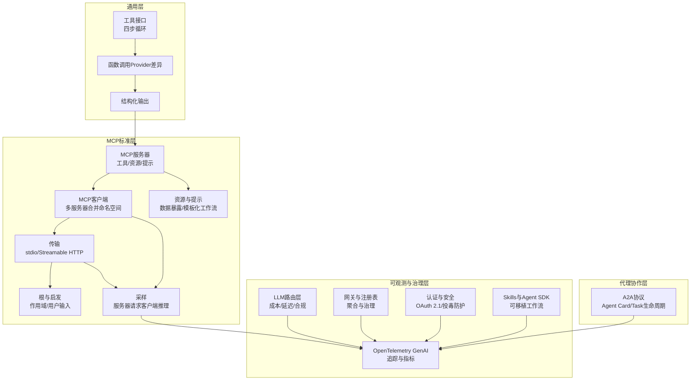

图示来源
- [01-工具接口.md:27-78](file://phases/13-tools-and-protocols/01-the-tool-interface/docs/en.md#L27-L78)
- [06-MCP基础.md:29-60](file://phases/13-tools-and-protocols/06-mcp-fundamentals/docs/en.md#L29-L60)
- [09-MCP传输.md:35-67](file://phases/13-tools-and-protocols/09-mcp-transports/docs/en.md#L35-L67)
- [11-MCP采样.md:107-118](file://phases/13-tools-and-protocols/11-mcp-sampling/docs/en.md#L107-L118)
- [19-A2A协议.md:29-66](file://phases/13-tools-and-protocols/19-a2a-protocol/docs/en.md#L29-L66)
- [20-OpenTelemetry GenAI.md:27-39](file://phases/13-tools-and-protocols/20-opentelemetry-genai/docs/en.md#L27-L39)
- [21-LLM路由层.md:35-53](file://phases/13-tools-and-protocols/21-llm-routing-layer/docs/en.md#L35-L53)
- [22-Skills与智能体SDK.md:33-51](file://phases/13-tools-and-protocols/22-skills-and-agent-sdks/docs/en.md#L33-L51)

## 详细组件分析

### 组件A：工具接口与四步循环
- 描述：工具三要素（名称、描述、JSON Schema输入）；纯工具与有副作用工具的安全划分。
- 决策：直接回答、工具调用（含并行）、拒绝（严格模式）。
- 执行：参数校验、执行器返回内容块（文本/图片/资源）。
- 观察：将工具结果以工具角色消息回传，继续迭代直至停止或达到上限。
- 安全信任分割：Meta“两因素规则”在单轮中最多组合两类风险（不可信输入、敏感数据、后果性动作）。

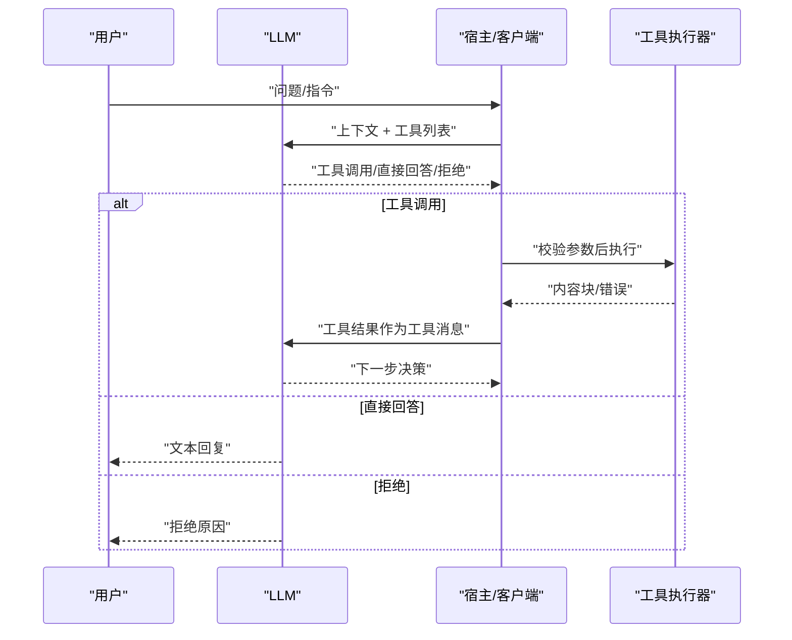

图示来源
- [01-工具接口.md:29-58](file://phases/13-tools-and-protocols/01-the-tool-interface/docs/en.md#L29-L58)

章节来源
- [01-工具接口.md:10-104](file://phases/13-tools-and-protocols/01-the-tool-interface/docs/en.md#L10-L104)

### 组件B：函数调用Provider差异与统一
- 三Provider在声明容器、Schema字段、响应容器、参数类型、ID格式、结果注入、强制/禁止工具、严格模式与并行/流式上的差异。
- 提供声明转换器，将同一工具定义映射到三个Provider形状，确保跨Provider一致性。
- 限制与错误：各Provider在工具数量、Schema深度、参数长度、错误签名上的不同。

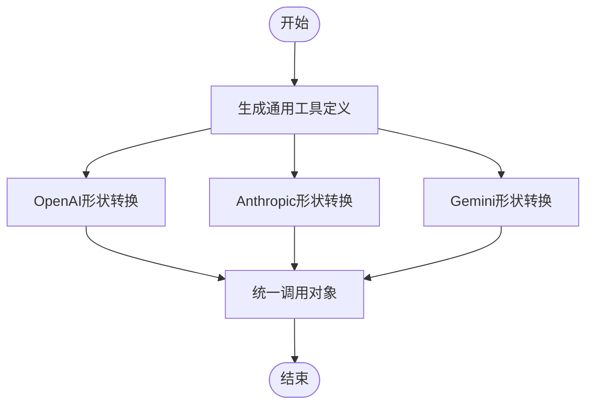

图示来源
- [02-函数调用深度解析.md:100-116](file://phases/13-tools-and-protocols/02-function-calling-deep-dive/docs/en.md#L100-L116)

章节来源
- [02-函数调用深度解析.md:17-90](file://phases/13-tools-and-protocols/02-function-calling-deep-dive/docs/en.md#L17-L90)

### 组件C：并行与流式工具调用
- 并行调用：OpenAI默认开启；Anthropic可通过开关启用；Gemini 3起提供稳定ID以支持乱序响应关联。
- 流式增量：OpenAI增量返回参数片段；Anthropic采用块事件；Gemini 3引入按ID交错的增量参数流。
- 实现要点：累积增量、去重、乱序重组、超时与取消。

章节来源
- [03-并行与流式工具调用.md:1-145](file://phases/13-tools-and-protocols/03-parallel-and-streaming-tool-calls/docs/en.md#L1-L145)

### 组件D：结构化输出与严格模式
- 严格模式通过约束解码在生成时屏蔽非法token，保证输出可解析且符合Schema。
- 失败模式：解析错误（严格模式下不发生）、模式违反（非严格模式常见）、拒绝（模型无法满足输入）。
- 小模型支持：约束解码在小模型上优于大模型原始生成。

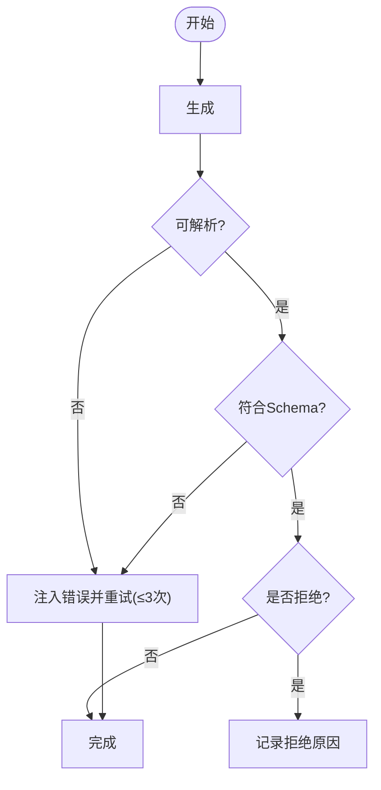

图示来源
- [04-结构化输出.md:84-99](file://phases/13-tools-and-protocols/04-structured-output/docs/en.md#L84-L99)

章节来源
- [04-结构化输出.md:17-103](file://phases/13-tools-and-protocols/04-structured-output/docs/en.md#L17-L103)

### 组件E：工具模式设计与Schema
- 使用JSON Schema 2020-12（类型、必填、枚举、范围、数组项、额外属性等）。
- 严格模式要求：所有属性必须在必填中列出、禁止额外属性、无未解析引用。
- 与Pydantic/Zod绑定：自动生成Schema并反向翻译至Provider。

章节来源
- [05-工具模式设计.md:1-145](file://phases/13-tools-and-protocols/05-tool-schema-design/docs/en.md#L1-L145)

### 组件F：MCP基础与生命周期
- 六原语：服务器侧工具/资源/提示；客户端侧根/采样/启发。
- 生命周期：初始化（能力协商）→操作（双向请求）→关闭。
- JSON-RPC 2.0：请求/响应/通知三类消息；错误码与内容块类型。

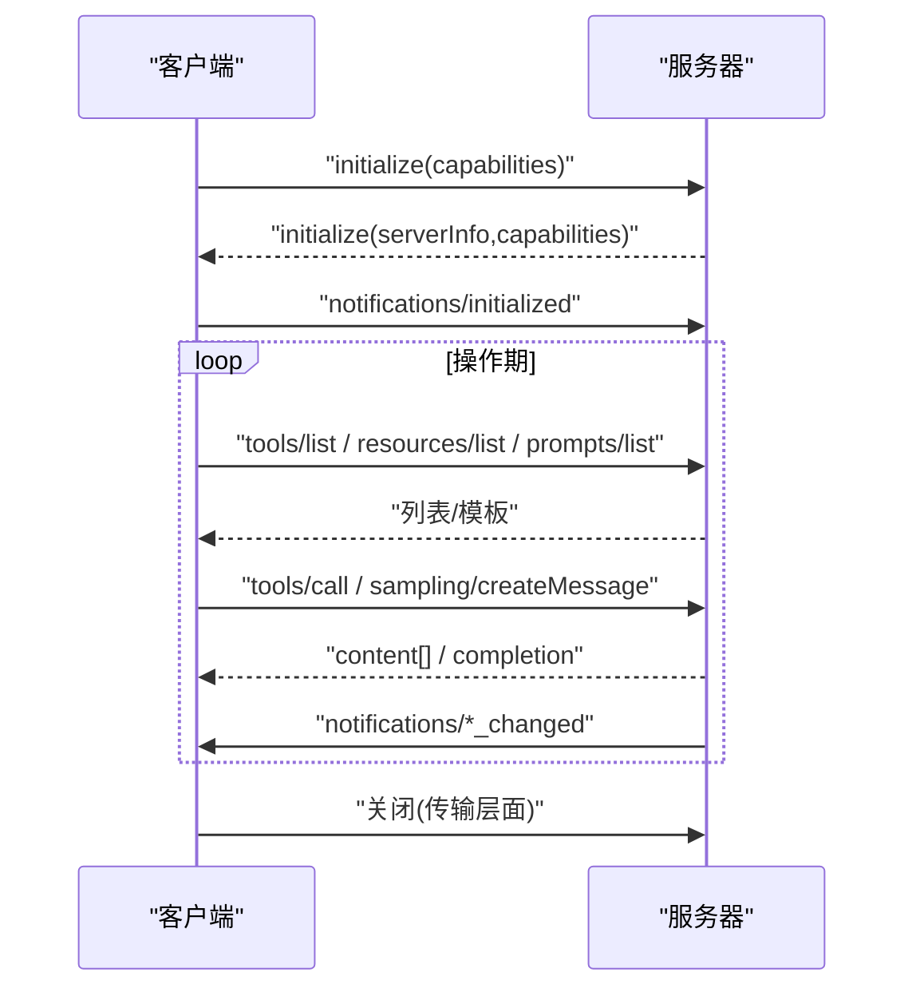

图示来源
- [06-MCP基础.md:60-73](file://phases/13-tools-and-protocols/06-mcp-fundamentals/docs/en.md#L60-L73)

章节来源
- [06-MCP基础.md:17-117](file://phases/13-tools-and-protocols/06-mcp-fundamentals/docs/en.md#L17-L117)

### 组件G：构建MCP服务器（Python/TypeScript）
- 实现：initialize、tools/list、tools/call、resources/*、prompts/*。
- 错误处理：JSON-RPC协议级错误与工具级错误（isError）。
- 注解：只读/破坏性/幂等/开放世界提示。
- 毕业路径：从stdlib到FastMCP/TypeScript SDK。

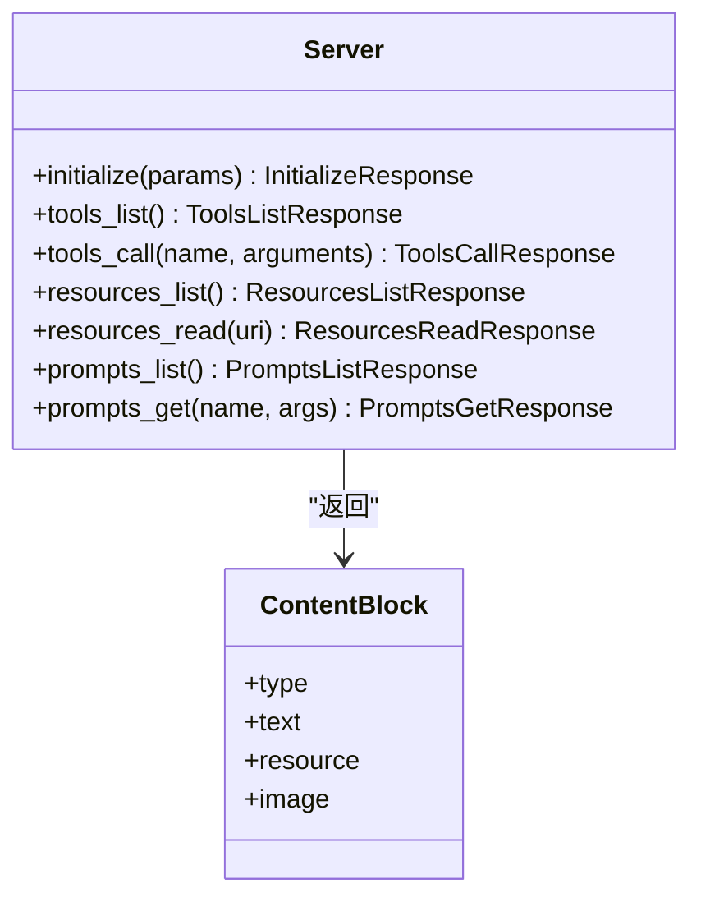

图示来源
- [07-构建MCP服务器.md:45-96](file://phases/13-tools-and-protocols/07-building-an-mcp-server/docs/en.md#L45-L96)

章节来源
- [07-构建MCP服务器.md:17-122](file://phases/13-tools-and-protocols/07-building-an-mcp-server/docs/en.md#L17-L122)

### 组件H：构建MCP客户端（多服务器合并）
- 子进程启动与握手；每服务器会话状态（能力、工具列表、待处理请求）。
- 合并命名空间与冲突处理（前缀/首胜/拒绝）。
- 通知处理与后台读取线程；重连策略；采样回调。

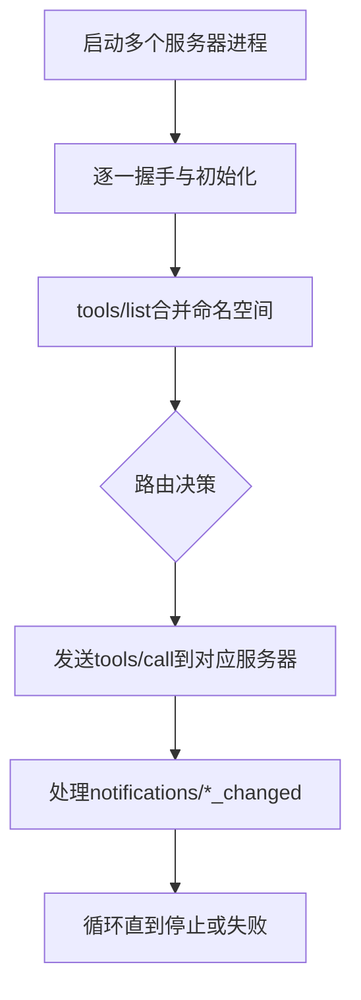

图示来源
- [08-构建MCP客户端.md:32-76](file://phases/13-tools-and-protocols/08-building-an-mcp-client/docs/en.md#L32-L76)

章节来源
- [08-构建MCP客户端.md:17-98](file://phases/13-tools-and-protocols/08-building-an-mcp-client/docs/en.md#L17-L98)

### 组件I：MCP传输（stdio vs Streamable HTTP）
- stdio：本地子进程，逐行JSON，无会话ID，无需认证。
- Streamable HTTP：单端点POST/GET/DELETE，Mcp-Session-Id头，Origin校验，SSE断线重连与事件重放。
- 迁移：从HTTP+SSE迁移到Streamable HTTP，兼容探测。

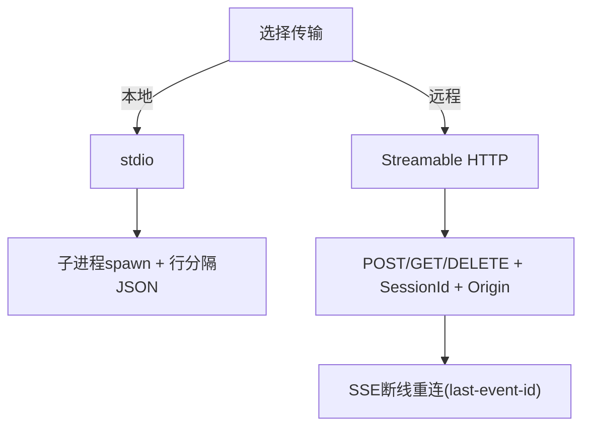

图示来源
- [09-MCP传输.md:27-67](file://phases/13-tools-and-protocols/09-mcp-transports/docs/en.md#L27-L67)

章节来源
- [09-MCP传输.md:17-96](file://phases/13-tools-and-protocols/09-mcp-transports/docs/en.md#L17-L96)

### 组件J：MCP资源与提示
- 资源：URI可寻址数据（文件/数据库/自定义方案），支持二进制与订阅更新。
- 提示：模板化消息序列，Slash命令形式由客户端触发。
- 列表变更通知：资源/提示集合变化时推送。

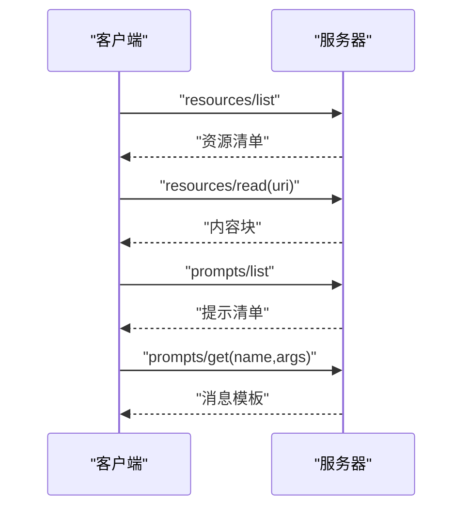

图示来源
- [10-MCP资源与提示.md:39-67](file://phases/13-tools-and-protocols/10-mcp-resources-and-prompts/docs/en.md#L39-L67)

章节来源
- [10-MCP资源与提示.md:17-99](file://phases/13-tools-and-protocols/10-mcp-resources-and-prompts/docs/en.md#L17-L99)

### 组件K：MCP采样（服务器请求客户端推理）
- 服务器通过sampling/createMessage请求客户端模型完成多轮对话。
- modelPreferences权重与模型提示；includeContext软弃用。
- 安全：人类在环确认、速率限制、防止循环炸弹与资源窃取。

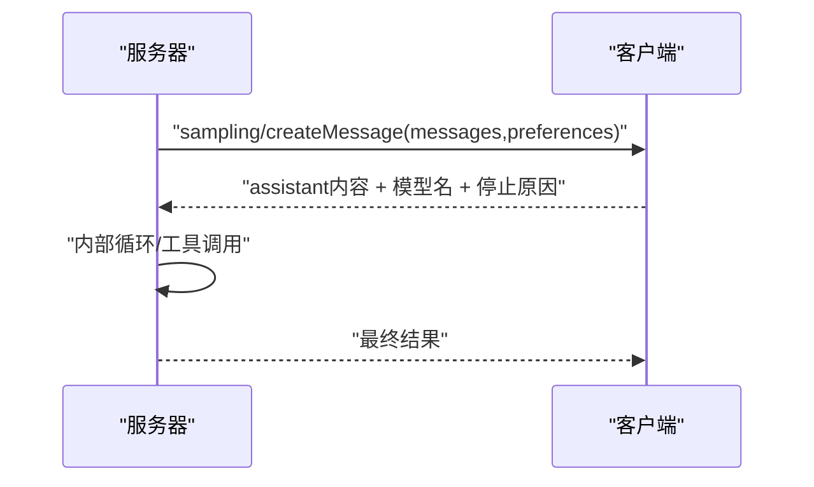

图示来源
- [11-MCP采样.md:31-64](file://phases/13-tools-and-protocols/11-mcp-sampling/docs/en.md#L31-L64)

章节来源
- [11-MCP采样.md:17-118](file://phases/13-tools-and-protocols/11-mcp-sampling/docs/en.md#L17-L118)

### 组件L：MCP根与启发
- 根作用域：客户端声明允许服务器访问的URI集合；服务器必须遵守。
- 启发：服务器在工具调用中暂停，请求用户结构化输入（表单或URL）。
- 使用场景：破坏性动作确认、歧义消解、首次设置、OAuth流程。

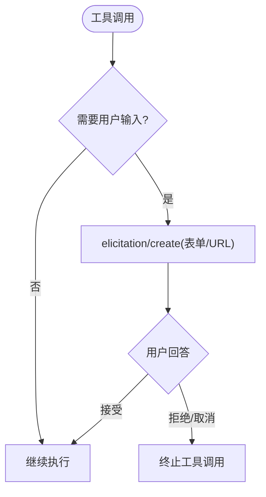

图示来源
- [12-MCP根与启发.md:53-87](file://phases/13-tools-and-protocols/12-mcp-roots-and-elicitation/docs/en.md#L53-L87)

章节来源
- [12-MCP根与启发.md:17-124](file://phases/13-tools-and-protocols/12-mcp-roots-and-elicitation/docs/en.md#L17-L124)

### 组件M：MCP异步任务
- 长时间运行的任务在会话中断后仍可恢复；结合会话ID与事件重放。
- 与采样配合实现持久化的中间态与人类确认。

章节来源
- [13-MCP异步任务.md:1-145](file://phases/13-tools-and-protocols/13-mcp-async-tasks/docs/en.md#L1-L145)

### 组件N：MCP应用（UI资源）
- ui://资源类型用于嵌入交互式UI；与提示模板结合形成富界面工作流。

章节来源
- [14-MCP应用.md:1-145](file://phases/13-tools-and-protocols/14-mcp-apps/docs/en.md#L1-L145)

### 组件O：MCP安全-工具投毒
- 攻击向量：恶意工具伪装、参数投毒、越权调用。
- 防护：输入校验、最小权限、沙箱、签名与白名单、速率限制与监控。

章节来源
- [15-MCP安全-工具投毒.md:1-145](file://phases/13-tools-and-protocols/15-mcp-security-tool-poisoning/docs/en.md#L1-L145)

### 组件P：MCP安全-OAuth 2.1
- 资源指示符语义与OAuth 2.1集成；令牌刷新与作用域最小化。
- 客户端与服务器的授权边界与审计日志。

章节来源
- [16-MCP安全-OAuth 2.1.md:1-145](file://phases/13-tools-and-protocols/16-mcp-security-oauth-2-1/docs/en.md#L1-L145)

### 组件Q：MCP网关与注册表
- 多源聚合：统一入口、能力协商、命名空间合并、路由与限流。
- 注册表：工具/资源/提示的发现与版本管理。

章节来源
- [17-MCP网关与注册表.md:1-145](file://phases/13-tools-and-protocols/17-mcp-gateways-and-registries/docs/en.md#L1-L145)

### 组件R：MCP认证生产
- 生产级鉴权：密钥轮换、审计、异常检测、合规导出。
- 与安全模块联动：OAuth 2.1、投毒防护、速率限制。

章节来源
- [18-MCP认证生产.md:1-145](file://phases/13-tools-and-protocols/18-mcp-auth-production/docs/en.md#L1-L145)

### 组件S：A2A协议（代理间协作）
- Agent Card发布与技能枚举；Task生命周期（提交/工作中/输入所需/完成/失败/取消/拒绝）。
- 消息与部件（文本/文件/数据）；产物（Artifact）。
- 两种传输绑定：JSON-RPC over HTTP与gRPC。

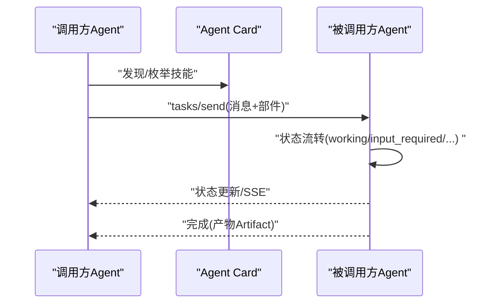

图示来源
- [19-A2A协议.md:61-69](file://phases/13-tools-and-protocols/19-a2a-protocol/docs/en.md#L61-L69)

章节来源
- [19-A2A协议.md:17-138](file://phases/13-tools-and-protocols/19-a2a-protocol/docs/en.md#L17-L138)

### 组件T：OpenTelemetry GenAI
- 语义约定：gen_ai.*属性、Span种类、事件（prompt/completion/tool_call）。
- 跨边界传播：traceparent头或JSON-RPC_meta字段；指标（token使用/操作耗时/工具执行耗时）。
- 导出器：Jaeger/Datadog/Langfuse/Arize Phoenix/Honeycomb。

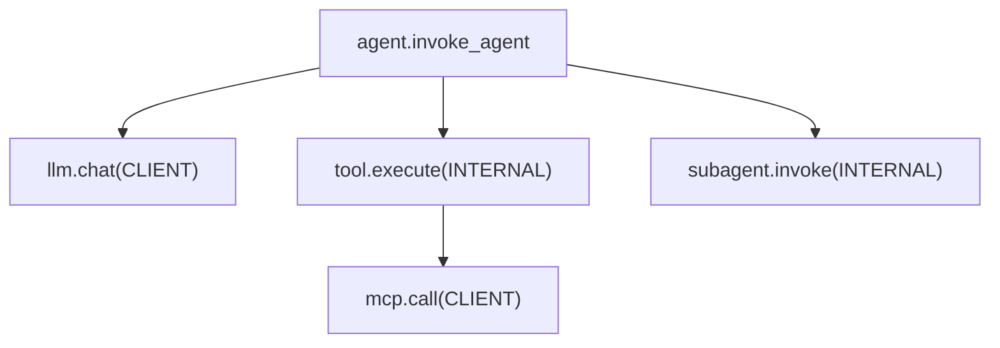

图示来源
- [20-OpenTelemetry GenAI.md:27-39](file://phases/13-tools-and-protocols/20-opentelemetry-genai/docs/en.md#L27-L39)

章节来源
- [20-OpenTelemetry GenAI.md:17-91](file://phases/13-tools-and-protocols/20-opentelemetry-genai/docs/en.md#L17-L91)

### 组件U：LLM路由层
- 三种形态：LiteLLM（自托管）、OpenRouter（托管SaaS）、Portkey（生产级+开源）。
- 策略：静态优先级、负载均衡、成本感知、延迟感知、任务感知。
- 功能：别名映射、降级链、语义缓存、守卫（PII/政策/输出过滤）、按键配额。

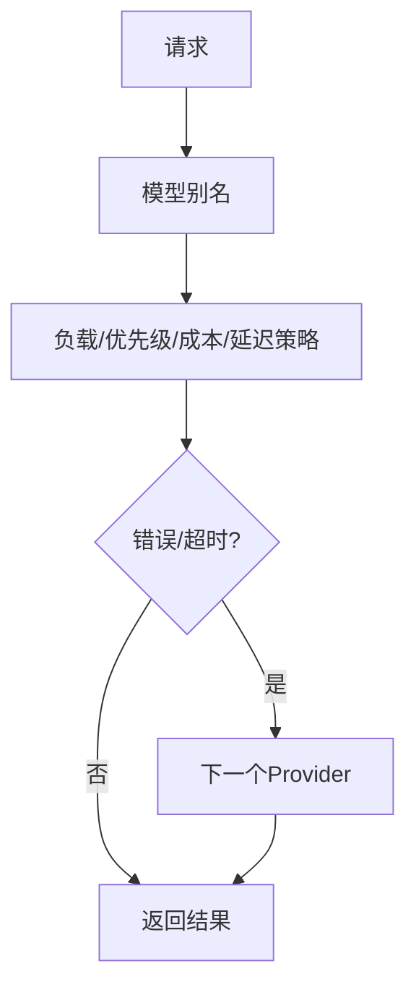

图示来源
- [21-LLM路由层.md:93-100](file://phases/13-tools-and-protocols/21-llm-routing-layer/docs/en.md#L93-L100)

章节来源
- [21-LLM路由层.md:17-84](file://phases/13-tools-and-protocols/21-llm-routing-layer/docs/en.md#L17-L84)

### 组件V：Skills与Agent SDK
- 三层：AGENTS.md（项目级上下文）、SKILL.md（可移植工作流）、MCP（工具）。
- Progressive Disclosure：按需加载子资源；文件系统发现与前端元数据。
- 跨Agent分发：SkillKit等工具将单一SKILL.md翻译为32+ Agent的原生格式。

图示来源
- [22-Skills与智能体SDK.md:125-134](file://phases/13-tools-and-protocols/22-skills-and-agent-sdks/docs/en.md#L125-L134)

章节来源
- [22-Skills与智能体SDK.md:17-134](file://phases/13-tools-and-protocols/22-skills-and-agent-sdks/docs/en.md#L17-L134)

### 组件W：工具生态系统综合项目
- 整合前述所有组件：工具接口、Provider统一、MCP服务器/客户端、传输、资源/提示、采样、根/启发、A2A、OTel GenAI、路由与网关、Skills/SDK。
- 交付：端到端可运行的工具生态原型。

章节来源
- [23-工具生态系统综合项目.md:1-145](file://phases/13-tools-and-protocols/23-capstone-tool-ecosystem/docs/en.md#L1-L145)

## 依赖关系分析
- 低耦合高内聚：工具接口与Provider差异独立于MCP；MCP服务器/客户端独立于传输；A2A独立于MCP但可复用其原语。
- 关键依赖链：
  - 工具接口 → 函数调用Provider → 结构化输出 → MCP工具原语
  - MCP服务器 → 传输（stdio/HTTP）→ MCP客户端 → 采样/根/启发
  - 资源/提示 → 客户端UI（Slash命令/附件面板）
  - A2A → Agent Card → Task生命周期 → Artifact
  - 观测 → OTel GenAI → 导出器
  - 路由 → 网关 → 计费/守卫 → MCP/LLM

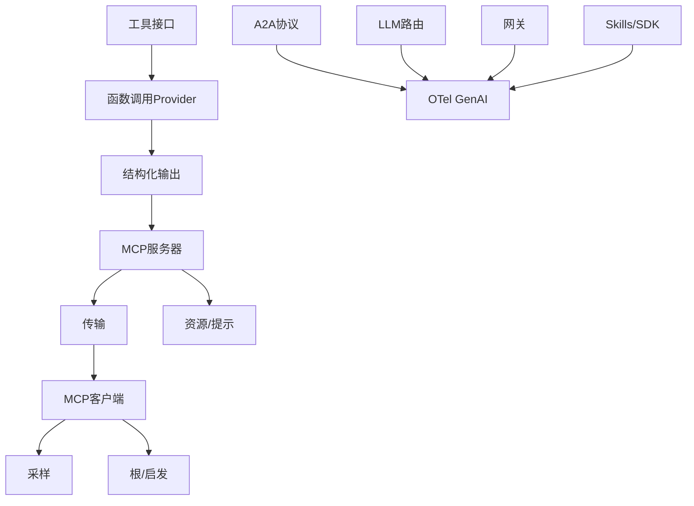

图示来源
- [01-工具接口.md:27-78](file://phases/13-tools-and-protocols/01-the-tool-interface/docs/en.md#L27-L78)
- [06-MCP基础.md:29-42](file://phases/13-tools-and-protocols/06-mcp-fundamentals/docs/en.md#L29-L42)
- [19-A2A协议.md:126-137](file://phases/13-tools-and-protocols/19-a2a-protocol/docs/en.md#L126-L137)
- [20-OpenTelemetry GenAI.md:80-91](file://phases/13-tools-and-protocols/20-opentelemetry-genai/docs/en.md#L80-L91)
- [21-LLM路由层.md:72-84](file://phases/13-tools-and-protocols/21-llm-routing-layer/docs/en.md#L72-L84)
- [22-Skills与智能体SDK.md:125-134](file://phases/13-tools-and-protocols/22-skills-and-agent-sdks/docs/en.md#L125-L134)

## 性能考量
- 严格模式与约束解码显著降低重试成本，尤其在小模型上提升明显。
- 并行与流式减少往返次数与首token延迟，但需注意乱序重组与内存占用。
- 资源订阅替代轮询，降低带宽与CPU开销。
- 采样回调与人类在环确认可能增加延迟，应配置速率限制与缓存。
- 路由层的成本/延迟/合规策略需结合SLA与预算控制。
- 观测与指标采集应按需开启内容捕获，避免PII与大payload带来的传输与存储压力。

## 故障排查指南
- 工具调用失败
  - 参数校验失败：检查Schema与必填字段；严格模式下禁止额外属性与未解析引用。
  - 并行/流式错序：确认ID关联与乱序重组逻辑。
  - 模型拒绝：记录拒绝原因，调整提示或Schema。
- MCP连接问题
  - stdio SIGPIPE：检测EOF并清理会话。
  - HTTP 502/504：指数退避重试。
  - SSE断线：使用last-event-id重放事件。
  - Origin校验失败：检查客户端来源白名单。
- 安全与合规
  - 投毒防护：输入校验、最小权限、沙箱、审计。
  - OAuth 2.1：令牌刷新、作用域最小化、资源指示符。
- 观测与诊断
  - OTel GenAI：确保traceparent传播与必要属性填充；内容捕获需谨慎启用。
  - 路由与网关：检查降级链、配额与守卫策略。

章节来源
- [04-结构化输出.md:84-99](file://phases/13-tools-and-protocols/04-structured-output/docs/en.md#L84-L99)
- [09-MCP传输.md:85-92](file://phases/13-tools-and-protocols/09-mcp-transports/docs/en.md#L85-L92)
- [11-MCP采样.md:119-124](file://phases/13-tools-and-protocols/11-mcp-sampling/docs/en.md#L119-L124)
- [20-OpenTelemetry GenAI.md:92-97](file://phases/13-tools-and-protocols/20-opentelemetry-genai/docs/en.md#L92-L97)

## 结论
本阶段通过“工具接口—Provider差异—结构化输出—MCP标准化—传输与安全—代理协作—可观测—路由与网关—Skills/SDK”的完整链条，构建了可扩展、可移植、可治理的AI工具生态系统。标准化协议（MCP）与代理协作（A2A）使工具与工作流在多Agent、多Provider之间无缝迁移；严格模式与约束解码提升了可靠性；路由与网关保障成本与合规；可观测性与安全模块确保生产可用。这为从实验到生产的规模化落地提供了坚实基础。

## 附录
- 参考实现与SDK
  - MCP Python/TypeScript SDK与官方Quickstart
  - A2A规范与参考实现
  - OTel GenAI语义约定与导出器
  - 路由网关（LiteLLM/OpenRouter/Portkey）文档
- 最佳实践清单
  - 工具接口：明确纯/副作用分类，严格Schema与最小权限。
  - Provider统一：声明转换器与限制清单。
  - MCP：能力协商、命名空间合并、通知处理、采样与启发。
  - 传输：Origin校验、Session ID、SSE重连。
  - A2A：Agent Card签名、Task生命周期、Artifact流式。
  - 观测：span层次、必要属性、traceparent传播。
  - 路由：策略选择、降级链、守卫与配额。
  - Skills/SDK：可移植工作流、渐进披露、跨Agent分发。