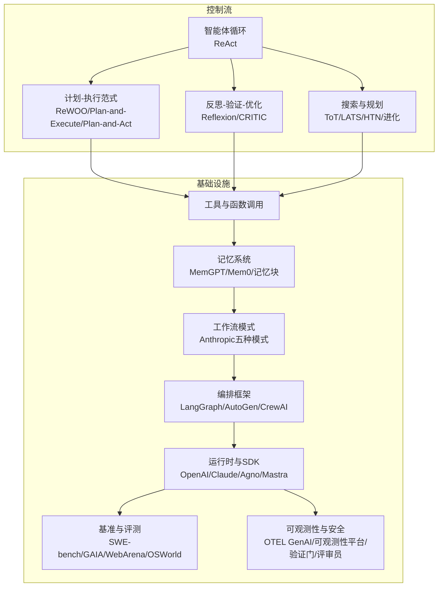
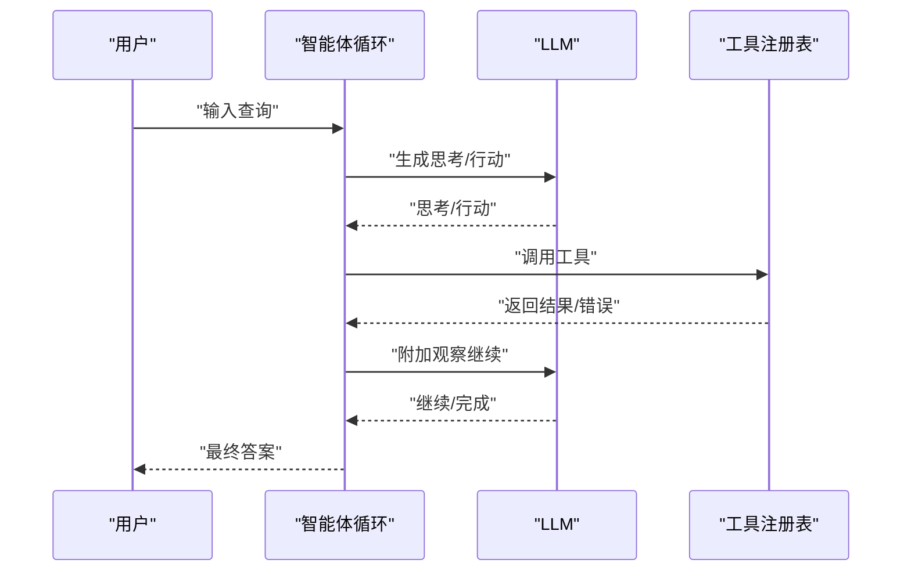
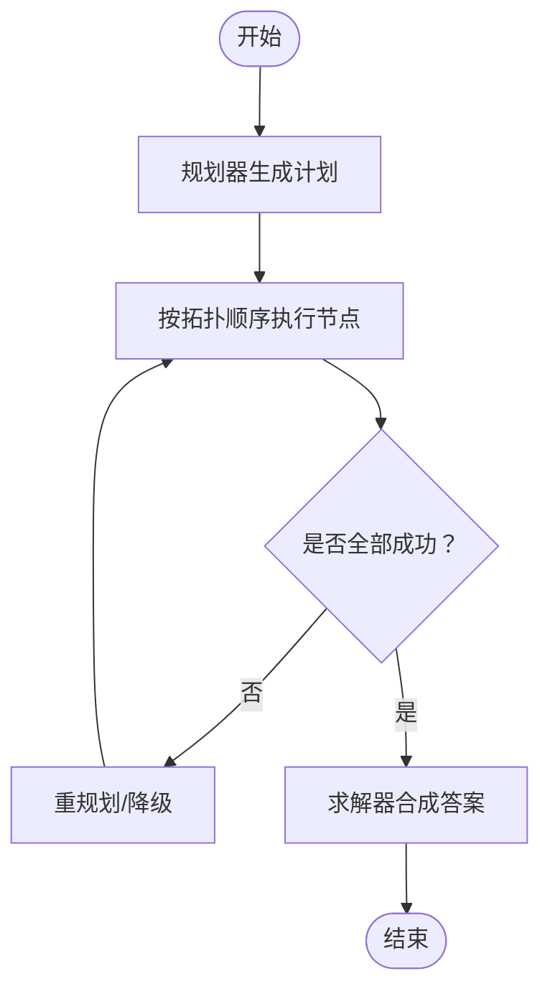
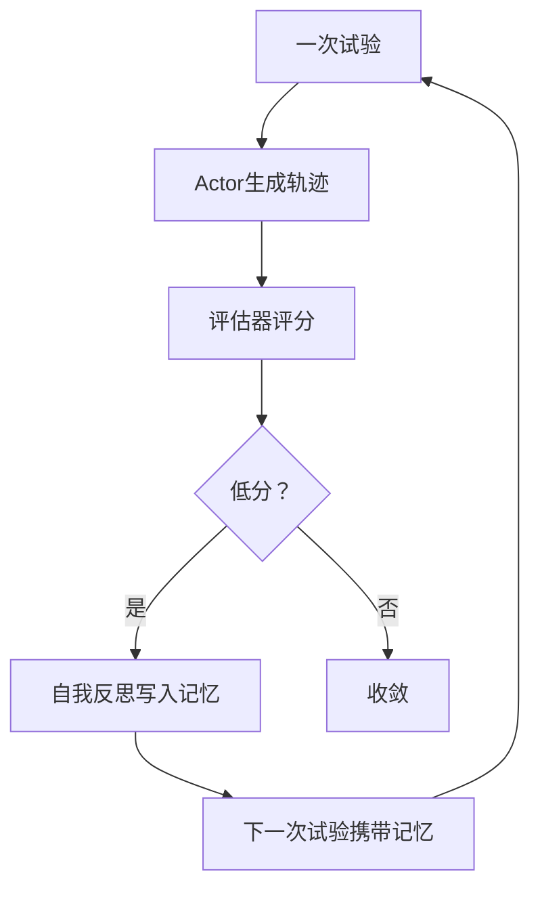
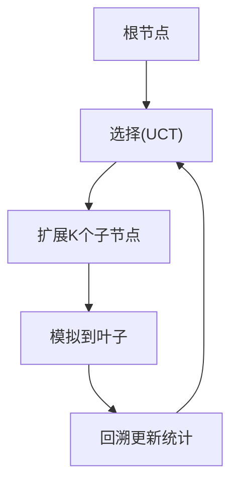
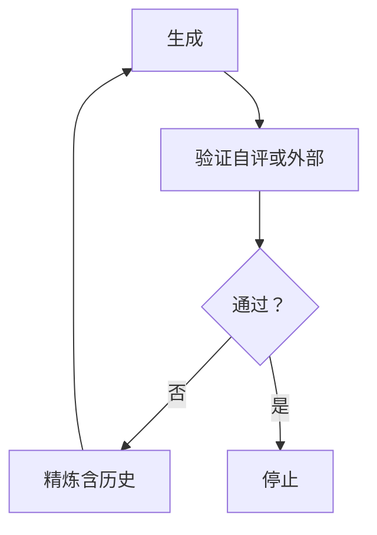
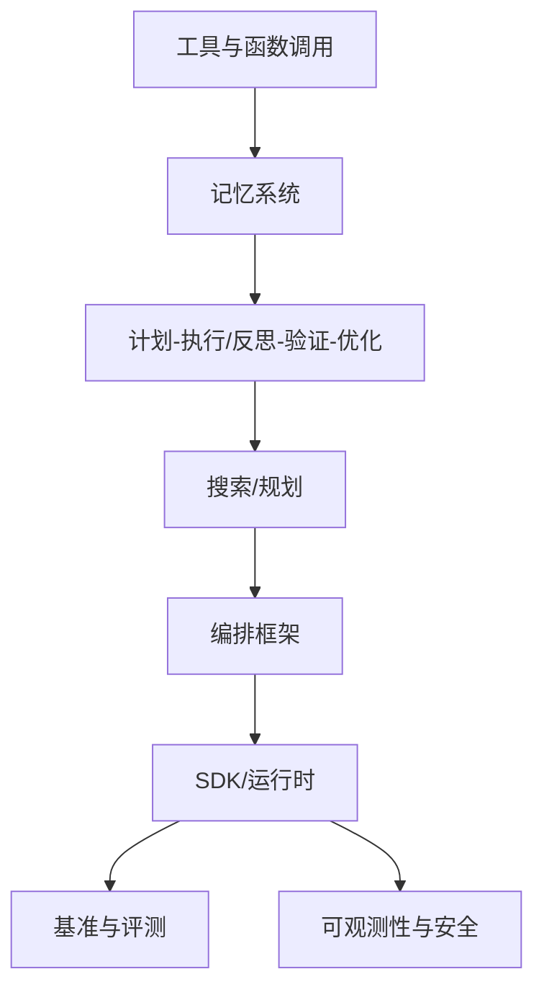

# 阶段14：智能体工程

<cite>
**本文档引用的文件**
- [README.md](file://README.md)
- [ROADMAP.md](file://ROADMAP.md)
- [AGENTS.md](file://AGENTS.md)
- [01-智能体循环](file://phases/14-agent-engineering/01-the-agent-loop/docs/en.md)
- [02-ReWOO与计划执行](file://phases/14-agent-engineering/02-rewoo-plan-and-execute/docs/en.md)
- [03-反思言语强化学习](file://phases/14-agent-engineering/03-reflexion-verbal-rl/docs/en.md)
- [04-思维树与LATS](file://phases/14-agent-engineering/04-tree-of-thoughts-lats/docs/en.md)
- [05-自精炼与CRITIC](file://phases/14-agent-engineering/05-self-refine-and-critic/docs/en.md)
- [06-工具使用与函数调用](file://phases/14-agent-engineering/06-tool-use-and-function-calling/docs/en.md)
- [07-记忆系统与MemGPT虚拟上下文](file://phases/14-agent-engineering/07-memory-virtual-context-memgpt/docs/en.md)
- [08-记忆块与睡眠时间计算](file://phases/14-agent-engineering/08-memory-blocks-sleep-time-compute/docs/en.md)
- [09-混合记忆Mem0](file://phases/14-agent-engineering/09-hybrid-memory-mem0/docs/en.md)
- [10-技能库与Voyager](file://phases/14-agent-engineering/10-skill-libraries-voyager/docs/en.md)
- [11-HTN规划与进化搜索](file://phases/14-agent-engineering/11-planning-htn-and-evolutionary/docs/en.md)
- [12-Anthropic工作流模式](file://phases/14-agent-engineering/12-anthropic-workflow-patterns/docs/en.md)
- [13-LangGraph有状态图](file://phases/14-agent-engineering/13-langgraph-stateful-graphs/docs/en.md)
- [14-AutoGen演员模型](file://phases/14-agent-engineering/14-autogen-actor-model/docs/en.md)
- [15-CrewAI角色团队](file://phases/14-agent-engineering/15-crewai-role-based-crews/docs/en.md)
- [16-OpenAI智能体SDK](file://phases/14-agent-engineering/16-openai-agents-sdk/docs/en.md)
- [17-Claude智能体SDK](file://phases/14-agent-engineering/17-claude-agent-sdk/docs/en.md)
- [18-Agno与Mastra运行时](file://phases/14-agent-engineering/18-agno-and-mastra-runtimes/docs/en.md)
- [19-基准测试SWE-bench与GAIA](file://phases/14-agent-engineering/19-benchmarks-swebench-gaia/docs/en.md)
- [20-基准测试WebArena与OSWorld](file://phases/14-agent-engineering/20-benchmarks-webarena-osworld/docs/en.md)
- [21-计算机使用智能体](file://phases/14-agent-engineering/21-computer-use-agents/docs/en.md)
- [22-语音智能体Pipecat与LiveKit](file://phases/14-agent-engineering/22-voice-agents-pipecat-livekit/docs/en.md)
- [23-OTEL GenAI约定](file://phases/14-agent-engineering/23-otel-genai-conventions/docs/en.md)
- [24-智能体可观测性平台](file://phases/14-agent-engineering/24-agent-observability-platforms/docs/en.md)
- [25-多智能体辩论](file://phases/14-agent-engineering/25-multi-agent-debate/docs/en.md)
- [26-智能体失败模式](file://phases/14-agent-engineering/26-failure-modes-agentic/docs/en.md)
- [27-提示注入防御](file://phases/14-agent-engineering/27-prompt-injection-defense/docs/en.md)
- [28-编排模式](file://phases/14-agent-engineering/28-orchestration-patterns/docs/en.md)
- [29-生产运行时](file://phases/14-agent-engineering/29-production-runtimes/docs/en.md)
- [30-评估驱动的智能体开发](file://phases/14-agent-engineering/30-eval-driven-agent-development/docs/en.md)
- [31-智能体工作台：为何模型会失败](file://phases/14-agent-engineering/31-agent-workbench-why-models-fail/docs/en.md)
- [32-最小智能体工作台](file://phases/14-agent-engineering/32-minimal-agent-workbench/docs/en.md)
- [33-将指令作为可执行约束](file://phases/14-agent-engineering/33-instructions-as-executable-constraints/docs/en.md)
- [34-仓库记忆与持久状态](file://phases/14-agent-engineering/34-repo-memory-and-state/docs/en.md)
- [35-初始化脚本](file://phases/14-agent-engineering/35-initialization-scripts/docs/en.md)
- [36-范围合同](file://phases/14-agent-engineering/36-scope-contracts/docs/en.md)
- [37-运行时反馈回路](file://phases/14-agent-engineering/37-runtime-feedback-loops/docs/en.md)
- [38-验证门](file://phases/14-agent-engineering/38-verification-gates/docs/en.md)
- [39-评审员智能体](file://phases/14-agent-engineering/39-reviewer-agent/docs/en.md)
- [40-多会话交接](file://phases/14-agent-engineering/40-multi-session-handoff/docs/en.md)
- [41-真实仓库工作台](file://phases/14-agent-engineering/41-workbench-for-real-repos/docs/en.md)
- [42-智能体工作台综合项目](file://phases/14-agent-engineering/42-agent-workbench-capstone/docs/en.md)
</cite>

## 目录
1. [引言](#引言)
2. [项目结构](#项目结构)
3. [核心组件](#核心组件)
4. [架构总览](#架构总览)
5. [详细组件分析](#详细组件分析)
6. [依赖关系分析](#依赖关系分析)
7. [性能考量](#性能考量)
8. [故障排查指南](#故障排查指南)
9. [结论](#结论)
10. [附录](#附录)

## 引言
本阶段围绕“智能体工程”的完整生命周期展开，涵盖从基础的智能体循环到高级的多智能体协作、生产化运行时与可观测性体系。课程体系以“构建-使用-交付”为主线，先用纯语言实现核心算法，再映射到主流框架（如LangGraph、AutoGen、CrewAI、OpenAI/Claude智能体SDK），最终形成可复用的技能包与工作台。

## 项目结构
- 智能体工程阶段包含42个课程，每个课程提供：
  - docs/en.md：教学文档（目标、概念、练习）
  - code/：可运行实现（纯标准库或少量依赖）
  - outputs/：可复用技能/提示/代理/MCP服务器
  - quiz.json：阶段性测验
- 该阶段位于第11-13阶段之后，是面向生产的“工程化”落地阶段。

```mermaid
graph TB
subgraph "阶段14：智能体工程"
L1["01 智能体循环"]
L2["02 ReWOO与计划执行"]
L3["03 反思言语强化学习"]
L4["04 思维树与LATS"]
L5["05 自精炼与CRITIC"]
L6["06 工具使用与函数调用"]
L7["07 记忆系统与MemGPT虚拟上下文"]
L8["08 记忆块与睡眠时间计算"]
L9["09 混合记忆Mem0"]
L10["10 技能库与Voyager"]
L11["11 HTN规划与进化搜索"]
L12["12 Anthropic工作流模式"]
L13["13 LangGraph有状态图"]
L14["14 AutoGen演员模型"]
L15["15 CrewAI角色团队"]
L16["16 OpenAI智能体SDK"]
L17["17 Claude智能体SDK"]
L18["18 Agno与Mastra运行时"]
L19["19 基准测试SWE-bench与GAIA"]
L20["20 基准测试WebArena与OSWorld"]
L21["21 计算机使用智能体"]
L22["22 语音智能体Pipecat与LiveKit"]
L23["23 OTEL GenAI约定"]
L24["24 智能体可观测性平台"]
L25["25 多智能体辩论"]
L26["26 智能体失败模式"]
L27["27 提示注入防御"]
L28["28 编排模式"]
L29["29 生产运行时"]
L30["30 评估驱动的智能体开发"]
L31["31 智能体工作台：为何模型会失败"]
L32["32 最小智能体工作台"]
L33["33 将指令作为可执行约束"]
L34["34 仓库记忆与持久状态"]
L35["35 初始化脚本"]
L36["36 范围合同"]
L37["37 运行时反馈回路"]
L38["38 验证门"]
L39["39 评审员智能体"]
L40["40 多会话交接"]
L41["41 真实仓库工作台"]
L42["42 智能体工作台综合项目"]
end
```

图表来源
- [README.md](file://README.md)
- [ROADMAP.md](file://ROADMAP.md)

章节来源
- [README.md](file://README.md)
- [ROADMAP.md](file://ROADMAP.md)

## 核心组件
- 智能体循环（ReAct）：观察-思考-行动-观察-停止，是所有框架的内核。
- 计划-执行范式（ReWOO/Plan-and-Execute/Plan-and-Act）：分离规划与执行，降低token开销并提升鲁棒性。
- 反思言语强化（Reflexion）：通过自然语言反思与外显记忆，实现无需梯度的学习闭环。
- 思维树与LATS：在复杂任务中引入搜索策略，结合MCTS进行系统探索。
- 自精炼与CRITIC：生成-验证-优化的迭代改进流程，强调外部工具验证。
- 工具使用与函数调用：标准化工具接口、Schema设计与并行/流式调用。
- 记忆系统：虚拟上下文（MemGPT）、记忆块（Letta睡眠时间计算）、混合记忆（Mem0向量/图/KV）。
- 规划与技能：HTN、进化搜索（AlphaEvolve）、Voyager技能库。
- 工作流与编排：Anthropic五种工作流模式、LangGraph有状态图、AutoGen演员模型、CrewAI角色团队。
- SDK与运行时：OpenAI/Claude智能体SDK、Agno/Mastra运行时。
- 基准与评测：SWE-bench、GAIA、WebArena、OSWorld；计算机使用与语音智能体评测。
- 可观测性与安全：OTEL GenAI约定、可观测性平台、提示注入防御、验证门与评审员智能体。
- 工作台与工程化：最小工作台、指令约束、仓库记忆、初始化脚本、范围合同、运行时反馈回路、多会话交接、综合项目。

章节来源
- [01-智能体循环](file://phases/14-agent-engineering/01-the-agent-loop/docs/en.md)
- [02-ReWOO与计划执行](file://phases/14-agent-engineering/02-rewoo-plan-and-execute/docs/en.md)
- [03-反思言语强化学习](file://phases/14-agent-engineering/03-reflexion-verbal-rl/docs/en.md)
- [04-思维树与LATS](file://phases/14-agent-engineering/04-tree-of-thoughts-lats/docs/en.md)
- [05-自精炼与CRITIC](file://phases/14-agent-engineering/05-self-refine-and-critic/docs/en.md)
- [06-工具使用与函数调用](file://phases/14-agent-engineering/06-tool-use-and-function-calling/docs/en.md)
- [07-记忆系统与MemGPT虚拟上下文](file://phases/14-agent-engineering/07-memory-virtual-context-memgpt/docs/en.md)
- [08-记忆块与睡眠时间计算](file://phases/14-agent-engineering/08-memory-blocks-sleep-time-compute/docs/en.md)
- [09-混合记忆Mem0](file://phases/14-agent-engineering/09-hybrid-memory-mem0/docs/en.md)
- [10-技能库与Voyager](file://phases/14-agent-engineering/10-skill-libraries-voyager/docs/en.md)
- [11-HTN规划与进化搜索](file://phases/14-agent-engineering/11-planning-htn-and-evolutionary/docs/en.md)
- [12-Anthropic工作流模式](file://phases/14-agent-engineering/12-anthropic-workflow-patterns/docs/en.md)
- [13-LangGraph有状态图](file://phases/14-agent-engineering/13-langgraph-stateful-graphs/docs/en.md)
- [14-AutoGen演员模型](file://phases/14-agent-engineering/14-autogen-actor-model/docs/en.md)
- [15-CrewAI角色团队](file://phases/14-agent-engineering/15-crewai-role-based-crews/docs/en.md)
- [16-OpenAI智能体SDK](file://phases/14-agent-engineering/16-openai-agents-sdk/docs/en.md)
- [17-Claude智能体SDK](file://phases/14-agent-engineering/17-claude-agent-sdk/docs/en.md)
- [18-Agno与Mastra运行时](file://phases/14-agent-engineering/18-agno-and-mastra-runtimes/docs/en.md)
- [19-基准测试SWE-bench与GAIA](file://phases/14-agent-engineering/19-benchmarks-swebench-gaia/docs/en.md)
- [20-基准测试WebArena与OSWorld](file://phases/14-agent-engineering/20-benchmarks-webarena-osworld/docs/en.md)
- [21-计算机使用智能体](file://phases/14-agent-engineering/21-computer-use-agents/docs/en.md)
- [22-语音智能体Pipecat与LiveKit](file://phases/14-agent-engineering/22-voice-agents-pipecat-livekit/docs/en.md)
- [23-OTEL GenAI约定](file://phases/14-agent-engineering/23-otel-genai-conventions/docs/en.md)
- [24-智能体可观测性平台](file://phases/14-agent-engineering/24-agent-observability-platforms/docs/en.md)
- [25-多智能体辩论](file://phases/14-agent-engineering/25-multi-agent-debate/docs/en.md)
- [26-智能体失败模式](file://phases/14-agent-engineering/26-failure-modes-agentic/docs/en.md)
- [27-提示注入防御](file://phases/14-agent-engineering/27-prompt-injection-defense/docs/en.md)
- [28-编排模式](file://phases/14-agent-engineering/28-orchestration-patterns/docs/en.md)
- [29-生产运行时](file://phases/14-agent-engineering/29-production-runtimes/docs/en.md)
- [30-评估驱动的智能体开发](file://phases/14-agent-engineering/30-eval-driven-agent-development/docs/en.md)
- [31-智能体工作台：为何模型会失败](file://phases/14-agent-engineering/31-agent-workbench-why-models-fail/docs/en.md)
- [32-最小智能体工作台](file://phases/14-agent-engineering/32-minimal-agent-workbench/docs/en.md)
- [33-将指令作为可执行约束](file://phases/14-agent-engineering/33-instructions-as-executable-constraints/docs/en.md)
- [34-仓库记忆与持久状态](file://phases/14-agent-engineering/34-repo-memory-and-state/docs/en.md)
- [35-初始化脚本](file://phases/14-agent-engineering/35-initialization-scripts/docs/en.md)
- [36-范围合同](file://phases/14-agent-engineering/36-scope-contracts/docs/en.md)
- [37-运行时反馈回路](file://phases/14-agent-engineering/37-runtime-feedback-loops/docs/en.md)
- [38-验证门](file://phases/14-agent-engineering/38-verification-gates/docs/en.md)
- [39-评审员智能体](file://phases/14-agent-engineering/39-reviewer-agent/docs/en.md)
- [40-多会话交接](file://phases/14-agent-engineering/40-multi-session-handoff/docs/en.md)
- [41-真实仓库工作台](file://phases/14-agent-engineering/41-workbench-for-real-repos/docs/en.md)
- [42-智能体工作台综合项目](file://phases/14-agent-engineering/42-agent-workbench-capstone/docs/en.md)

## 架构总览
下图展示了智能体工程阶段的核心架构：以“智能体循环”为核心，向上叠加“计划-执行范式”“反思-验证-优化”“搜索与规划”，向下对接“工具与函数调用”“记忆系统”，并通过“工作流模式”“编排框架”“运行时与SDK”实现工程化落地，并以“可观测性与安全”贯穿始终。

图表来源
- [01-智能体循环](file://phases/14-agent-engineering/01-the-agent-loop/docs/en.md)
- [02-ReWOO与计划执行](file://phases/14-agent-engineering/02-rewoo-plan-and-execute/docs/en.md)
- [03-反思言语强化学习](file://phases/14-agent-engineering/03-reflexion-verbal-rl/docs/en.md)
- [04-思维树与LATS](file://phases/14-agent-engineering/04-tree-of-thoughts-lats/docs/en.md)
- [05-自精炼与CRITIC](file://phases/14-agent-engineering/05-self-refine-and-critic/docs/en.md)
- [06-工具使用与函数调用](file://phases/14-agent-engineering/06-tool-use-and-function-calling/docs/en.md)
- [07-记忆系统与MemGPT虚拟上下文](file://phases/14-agent-engineering/07-memory-virtual-context-memgpt/docs/en.md)
- [08-记忆块与睡眠时间计算](file://phases/14-agent-engineering/08-memory-blocks-sleep-time-compute/docs/en.md)
- [09-混合记忆Mem0](file://phases/14-agent-engineering/09-hybrid-memory-mem0/docs/en.md)
- [10-技能库与Voyager](file://phases/14-agent-engineering/10-skill-libraries-voyager/docs/en.md)
- [11-HTN规划与进化搜索](file://phases/14-agent-engineering/11-planning-htn-and-evolutionary/docs/en.md)
- [12-Anthropic工作流模式](file://phases/14-agent-engineering/12-anthropic-workflow-patterns/docs/en.md)
- [13-LangGraph有状态图](file://phases/14-agent-engineering/13-langgraph-stateful-graphs/docs/en.md)
- [14-AutoGen演员模型](file://phases/14-agent-engineering/14-autogen-actor-model/docs/en.md)
- [15-CrewAI角色团队](file://phases/14-agent-engineering/15-crewai-role-based-crews/docs/en.md)
- [16-OpenAI智能体SDK](file://phases/14-agent-engineering/16-openai-agents-sdk/docs/en.md)
- [17-Claude智能体SDK](file://phases/14-agent-engineering/17-claude-agent-sdk/docs/en.md)
- [18-Agno与Mastra运行时](file://phases/14-agent-engineering/18-agno-and-mastra-runtimes/docs/en.md)
- [19-基准测试SWE-bench与GAIA](file://phases/14-agent-engineering/19-benchmarks-swebench-gaia/docs/en.md)
- [20-基准测试WebArena与OSWorld](file://phases/14-agent-engineering/20-benchmarks-webarena-osworld/docs/en.md)
- [21-计算机使用智能体](file://phases/14-agent-engineering/21-computer-use-agents/docs/en.md)
- [22-语音智能体Pipecat与LiveKit](file://phases/14-agent-engineering/22-voice-agents-pipecat-livekit/docs/en.md)
- [23-OTEL GenAI约定](file://phases/14-agent-engineering/23-otel-genai-conventions/docs/en.md)
- [24-智能体可观测性平台](file://phases/14-agent-engineering/24-agent-observability-platforms/docs/en.md)
- [25-多智能体辩论](file://phases/14-agent-engineering/25-multi-agent-debate/docs/en.md)
- [26-智能体失败模式](file://phases/14-agent-engineering/26-failure-modes-agentic/docs/en.md)
- [27-提示注入防御](file://phases/14-agent-engineering/27-prompt-injection-defense/docs/en.md)
- [28-编排模式](file://phases/14-agent-engineering/28-orchestration-patterns/docs/en.md)
- [29-生产运行时](file://phases/14-agent-engineering/29-production-runtimes/docs/en.md)
- [30-评估驱动的智能体开发](file://phases/14-agent-engineering/30-eval-driven-agent-development/docs/en.md)
- [31-智能体工作台：为何模型会失败](file://phases/14-agent-engineering/31-agent-workbench-why-models-fail/docs/en.md)
- [32-最小智能体工作台](file://phases/14-agent-engineering/32-minimal-agent-workbench/docs/en.md)
- [33-将指令作为可执行约束](file://phases/14-agent-engineering/33-instructions-as-executable-constraints/docs/en.md)
- [34-仓库记忆与持久状态](file://phases/14-agent-engineering/34-repo-memory-and-state/docs/en.md)
- [35-初始化脚本](file://phases/14-agent-engineering/35-initialization-scripts/docs/en.md)
- [36-范围合同](file://phases/14-agent-engineering/36-scope-contracts/docs/en.md)
- [37-运行时反馈回路](file://phases/14-agent-engineering/37-runtime-feedback-loops/docs/en.md)
- [38-验证门](file://phases/14-agent-engineering/38-verification-gates/docs/en.md)
- [39-评审员智能体](file://phases/14-agent-engineering/39-reviewer-agent/docs/en.md)
- [40-多会话交接](file://phases/14-agent-engineering/40-multi-session-handoff/docs/en.md)
- [41-真实仓库工作台](file://phases/14-agent-engineering/41-workbench-for-real-repos/docs/en.md)
- [42-智能体工作台综合项目](file://phases/14-agent-engineering/42-agent-workbench-capstone/docs/en.md)

## 详细组件分析

### 组件A：智能体循环（ReAct）
- 核心思想：观察→思考→行动→观察→停止。三要素：消息缓冲、工具注册表、停止条件。
- 关键点：原生推理通道替代显式“Thought:”标记；框架差异在于环外状态管理（LangGraph检查点）、消息传递（AutoGen演员模型）、角色模板（CrewAI）。
- 实现要点：工具输出必须格式化为可读字符串；防止“信任边界坍塌”；避免级联失败；控制步数上限。

图表来源
- [01-智能体循环](file://phases/14-agent-engineering/01-the-agent-loop/docs/en.md)

章节来源
- [01-智能体循环](file://phases/14-agent-engineering/01-the-agent-loop/docs/en.md)

### 组件B：ReWOO与计划-执行范式
- 核心思想：先规划（DAG/序列），再并行获取证据，最后求解。相比ReAct显著节省token并提升鲁棒性。
- 关键点：证据引用（#E1）替换；可选重规划节点；小模型规划、大模型执行的蒸馏思路。
- 应用：LangGraph Recipe、CrewAI Flows；Plan-and-Act用于长程Web/移动任务。

图表来源
- [02-ReWOO与计划执行](file://phases/14-agent-engineering/02-rewoo-plan-and-execute/docs/en.md)

章节来源
- [02-ReWOO与计划执行](file://phases/14-agent-engineering/02-rewoo-plan-and-execute/docs/en.md)

### 组件C：反思言语强化学习（Reflexion）
- 核心思想：Actor-评估器-自我反思三元组，配合外显记忆（episodic memory）实现“无梯度学习”。
- 关键点：三种评估器（标量/启发式/自评估）；避免记忆腐坏（TTL/压缩）；异步“睡眠时间”反思。
- 应用：Letta睡眠时间计算、Claude Code记忆、LangGraph反射节点。

图表来源
- [03-反思言语强化学习](file://phases/14-agent-engineering/03-reflexion-verbal-rl/docs/en.md)

章节来源
- [03-反思言语强化学习](file://phases/14-agent-engineering/03-reflexion-verbal-rl/docs/en.md)

### 组件D：思维树与LATS
- 核心思想：将链式思维扩展为树搜索（ToT），并在MCTS框架下统一ReAct/Reflexion/ToT。
- 关键点：选择（Select）-扩展（Expand）-模拟（Simulate）-回溯（Backpropagate）；UCT公式平衡探索与利用。
- 应用：LangGraph子图模式；LlamaIndex TreeOfThoughts；AlphaEvolve进化搜索。

图表来源
- [04-思维树与LATS](file://phases/14-agent-engineering/04-tree-of-thoughts-lats/docs/en.md)

章节来源
- [04-思维树与LATS](file://phases/14-agent-engineering/04-tree-of-thoughts-lats/docs/en.md)

### 组件E：自精炼与CRITIC
- 核心思想：生成→反馈→精炼的迭代闭环；CRITIC用外部工具（搜索/计算器/测试）增强验证。
- 关键点：停止条件（验证通过/模型认可且迭代≥2/达到最大迭代）；避免“橡皮图章”循环；根据任务选择是否启用外部验证。
- 应用：Anthropic评估器-优化器；OpenAI输出守卫；Google Gemini 2.5计算机使用中的每步安全评估。

图表来源
- [05-自精炼与CRITIC](file://phases/14-agent-engineering/05-self-refine-and-critic/docs/en.md)

章节来源
- [05-自精炼与CRITIC](file://phases/14-agent-engineering/05-self-refine-and-critic/docs/en.md)

### 组件F：工具使用与函数调用
- 核心思想：标准化工具接口、Schema设计、并行与流式调用；支持OAuth 2.1与安全网关。
- 关键点：工具Schema校验、资源与提示管理、异步任务、传输层抽象（JSON-RPC/stdio/WS）。
- 应用：MCP生态（服务器/客户端/网关/注册表）；LangGraph状态机；AutoGen演员模型。

章节来源
- [06-工具使用与函数调用](file://phases/14-agent-engineering/06-tool-use-and-function-calling/docs/en.md)

### 组件G：记忆系统
- MemGPT虚拟上下文：基于对话历史的持续上下文管理。
- Letta记忆块与睡眠时间计算：离线反思与知识块管理，减少在线延迟。
- Mem0混合记忆：向量/图/KV融合，支持检索与推理的多模态记忆。
- 应用：LangGraph状态持久化；CrewAI角色记忆；OpenAI/Claude会话存储。

章节来源
- [07-记忆系统与MemGPT虚拟上下文](file://phases/14-agent-engineering/07-memory-virtual-context-memgpt/docs/en.md)
- [08-记忆块与睡眠时间计算](file://phases/14-agent-engineering/08-memory-blocks-sleep-time-compute/docs/en.md)
- [09-混合记忆Mem0](file://phases/14-agent-engineering/09-hybrid-memory-mem0/docs/en.md)

### 组件H：规划与技能
- HTN（层次化任务网络）：结构化分解复杂任务。
- 进化搜索（AlphaEvolve）：以程序可判定适应度的演化方法，实现前沿改进。
- Voyager技能库：长期学习与跨任务迁移能力。
- 应用：LangGraph子图内的规划；CrewAI Flows的任务编排。

章节来源
- [11-HTN规划与进化搜索](file://phases/14-agent-engineering/11-planning-htn-and-evolutionary/docs/en.md)
- [10-技能库与Voyager](file://phases/14-agent-engineering/10-skill-libraries-voyager/docs/en.md)

### 组件I：工作流与编排
- Anthropic五种工作流模式：从最简到复杂场景的选择指南。
- LangGraph：有状态图、检查点、子图模式。
- AutoGen：演员模型的消息传递与异步编排。
- CrewAI：角色+目标+背景板模板，支持Crews与Flows。
- 应用：不同场景下的控制流与状态管理。

章节来源
- [12-Anthropic工作流模式](file://phases/14-agent-engineering/12-anthropic-workflow-patterns/docs/en.md)
- [13-LangGraph有状态图](file://phases/14-agent-engineering/13-langgraph-stateful-graphs/docs/en.md)
- [14-AutoGen演员模型](file://phases/14-agent-engineering/14-autogen-actor-model/docs/en.md)
- [15-CrewAI角色团队](file://phases/14-agent-engineering/15-crewai-role-based-crews/docs/en.md)

### 组件J：SDK与运行时
- OpenAI智能体SDK：手交接、守卫、会话、追踪。
- Claude智能体SDK：子智能体、会话存储。
- Agno/Mastra：生产运行时与编排。
- 应用：快速集成到现有应用与服务。

章节来源
- [16-OpenAI智能体SDK](file://phases/14-agent-engineering/16-openai-agents-sdk/docs/en.md)
- [17-Claude智能体SDK](file://phases/14-agent-engineering/17-claude-agent-sdk/docs/en.md)
- [18-Agno与Mastra运行时](file://phases/14-agent-engineering/18-agno-and-mastra-runtimes/docs/en.md)

### 组件K：基准与评测
- SWE-bench/GAIA：代码修复与导航任务。
- WebArena/OSWorld：复杂交互环境评测。
- 计算机使用智能体：浏览器/桌面自动化。
- 语音智能体：Pipecat/LiveKit端到端语音链路。
- 应用：评估与回归测试。

章节来源
- [19-基准测试SWE-bench与GAIA](file://phases/14-agent-engineering/19-benchmarks-swebench-gaia/docs/en.md)
- [20-基准测试WebArena与OSWorld](file://phases/14-agent-engineering/20-benchmarks-webarena-osworld/docs/en.md)
- [21-计算机使用智能体](file://phases/14-agent-engineering/21-computer-use-agents/docs/en.md)
- [22-语音智能体Pipecat与LiveKit](file://phases/14-agent-engineering/22-voice-agents-pipecat-livekit/docs/en.md)

### 组件L：可观测性与安全
- OTEL GenAI约定：语义化指标与跨度。
- 智能体可观测性平台：Langfuse/Phoenix/Opik。
- 提示注入防御：PVE（提示向量扩展）防御。
- 验证门与评审员智能体：输出质量与合规性保障。
- 应用：生产监控、审计与安全加固。

章节来源
- [23-OTEL GenAI约定](file://phases/14-agent-engineering/23-otel-genai-conventions/docs/en.md)
- [24-智能体可观测性平台](file://phases/14-agent-engineering/24-agent-observability-platforms/docs/en.md)
- [27-提示注入防御](file://phases/14-agent-engineering/27-prompt-injection-defense/docs/en.md)
- [38-验证门](file://phases/14-agent-engineering/38-verification-gates/docs/en.md)
- [39-评审员智能体](file://phases/14-agent-engineering/39-reviewer-agent/docs/en.md)

### 组件M：工作台与工程化
- 最小工作台：快速原型与最小可行产品。
- 指令作为可执行约束：将任务规范转化为运行时断言。
- 仓库记忆与状态：持久化与跨会话恢复。
- 初始化脚本与范围合同：启动参数与任务边界。
- 运行时反馈回路：持续改进与A/B测试。
- 多会话交接：状态迁移与上下文继承。
- 综合项目：端到端交付可复用工作台包。

章节来源
- [31-智能体工作台：为何模型会失败](file://phases/14-agent-engineering/31-agent-workbench-why-models-fail/docs/en.md)
- [32-最小智能体工作台](file://phases/14-agent-engineering/32-minimal-agent-workbench/docs/en.md)
- [33-将指令作为可执行约束](file://phases/14-agent-engineering/33-instructions-as-executable-constraints/docs/en.md)
- [34-仓库记忆与持久状态](file://phases/14-agent-engineering/34-repo-memory-and-state/docs/en.md)
- [35-初始化脚本](file://phases/14-agent-engineering/35-initialization-scripts/docs/en.md)
- [36-范围合同](file://phases/14-agent-engineering/36-scope-contracts/docs/en.md)
- [37-运行时反馈回路](file://phases/14-agent-engineering/37-runtime-feedback-loops/docs/en.md)
- [40-多会话交接](file://phases/14-agent-engineering/40-multi-session-handoff/docs/en.md)
- [41-真实仓库工作台](file://phases/14-agent-engineering/41-workbench-for-real-repos/docs/en.md)
- [42-智能体工作台综合项目](file://phases/14-agent-engineering/42-agent-workbench-capstone/docs/en.md)

## 依赖关系分析
- 依赖链：工具调用 → 记忆系统 → 计划-执行/反思-验证-优化 → 搜索/规划 → 编排框架 → SDK/运行时 → 基准评测 → 可观测性与安全。
- 框架耦合：LangGraph（状态+检查点）、AutoGen（消息传递）、CrewAI（角色模板）、OpenAI/Claude SDK（会话/守卫）、Agno/Mastra（生产运行时）。
- 外部依赖：MCP生态（服务器/客户端/网关/注册表）、OTEL GenAI、Pipecat/LiveKit、基准数据集。

图表来源
- [06-工具使用与函数调用](file://phases/14-agent-engineering/06-tool-use-and-function-calling/docs/en.md)
- [07-记忆系统与MemGPT虚拟上下文](file://phases/14-agent-engineering/07-memory-virtual-context-memgpt/docs/en.md)
- [02-ReWOO与计划执行](file://phases/14-agent-engineering/02-rewoo-plan-and-execute/docs/en.md)
- [03-反思言语强化学习](file://phases/14-agent-engineering/03-reflexion-verbal-rl/docs/en.md)
- [04-思维树与LATS](file://phases/14-agent-engineering/04-tree-of-thoughts-lats/docs/en.md)
- [13-LangGraph有状态图](file://phases/14-agent-engineering/13-langgraph-stateful-graphs/docs/en.md)
- [14-AutoGen演员模型](file://phases/14-agent-engineering/14-autogen-actor-model/docs/en.md)
- [15-CrewAI角色团队](file://phases/14-agent-engineering/15-crewai-role-based-crews/docs/en.md)
- [16-OpenAI智能体SDK](file://phases/14-agent-engineering/16-openai-agents-sdk/docs/en.md)
- [17-Claude智能体SDK](file://phases/14-agent-engineering/17-claude-agent-sdk/docs/en.md)
- [18-Agno与Mastra运行时](file://phases/14-agent-engineering/18-agno-and-mastra-runtimes/docs/en.md)
- [19-基准测试SWE-bench与GAIA](file://phases/14-agent-engineering/19-benchmarks-swebench-gaia/docs/en.md)
- [20-基准测试WebArena与OSWorld](file://phases/14-agent-engineering/20-benchmarks-webarena-osworld/docs/en.md)
- [23-OTEL GenAI约定](file://phases/14-agent-engineering/23-otel-genai-conventions/docs/en.md)
- [24-智能体可观测性平台](file://phases/14-agent-engineering/24-agent-observability-platforms/docs/en.md)

章节来源
- [06-工具使用与函数调用](file://phases/14-agent-engineering/06-tool-use-and-function-calling/docs/en.md)
- [13-LangGraph有状态图](file://phases/14-agent-engineering/13-langgraph-stateful-graphs/docs/en.md)
- [14-AutoGen演员模型](file://phases/14-agent-engineering/14-autogen-actor-model/docs/en.md)
- [15-CrewAI角色团队](file://phases/14-agent-engineering/15-crewai-role-based-crews/docs/en.md)
- [16-OpenAI智能体SDK](file://phases/14-agent-engineering/16-openai-agents-sdk/docs/en.md)
- [17-Claude智能体SDK](file://phases/14-agent-engineering/17-claude-agent-sdk/docs/en.md)
- [18-Agno与Mastra运行时](file://phases/14-agent-engineering/18-agno-and-mastra-runtimes/docs/en.md)
- [19-基准测试SWE-bench与GAIA](file://phases/14-agent-engineering/19-benchmarks-swebench-gaia/docs/en.md)
- [20-基准测试WebArena与OSWorld](file://phases/14-agent-engineering/20-benchmarks-webarena-osworld/docs/en.md)
- [23-OTEL GenAI约定](file://phases/14-agent-engineering/23-otel-genai-conventions/docs/en.md)
- [24-智能体可观测性平台](file://phases/14-agent-engineering/24-agent-observability-platforms/docs/en.md)

## 性能考量
- Token成本：ToT/LATS/ReWOO对token消耗影响巨大，需按任务复杂度与预算权衡。
- 并行与批处理：工具调用与证据收集应尽可能并行；LangGraph DAG执行与AutoGen异步消息传递。
- 推理通道：原生推理通道替代显式“Thought:”标记，减少冗余token。
- 内存与状态：记忆块与检查点的粒度控制；Episodic Buffer TTL与压缩。
- 评测与回归：基准测试与A/B测试确保性能稳定。

## 故障排查指南
- 信任边界与级联失败：严格工具输出格式化与错误观察；避免将外部指令误认为用户授权。
- 循环爆炸：设置合理步数上限与观察预算；LangGraph检查点与CrewAI重试策略。
- 记忆腐坏：定期压缩与TTL清理；评审员智能体与验证门过滤无效记忆。
- 输出质量：CRITIC外部验证；OpenAI输出守卫；Anthropic评估器-优化器提示差异化。
- 安全与注入：PVE防御；MCP安全（OAuth 2.1、网关与注册表）；PIR工具链。

章节来源
- [26-智能体失败模式](file://phases/14-agent-engineering/26-failure-modes-agentic/docs/en.md)
- [27-提示注入防御](file://phases/14-agent-engineering/27-prompt-injection-defense/docs/en.md)
- [38-验证门](file://phases/14-agent-engineering/38-verification-gates/docs/en.md)
- [39-评审员智能体](file://phases/14-agent-engineering/39-reviewer-agent/docs/en.md)
- [06-工具使用与函数调用](file://phases/14-agent-engineering/06-tool-use-and-function-calling/docs/en.md)

## 结论
阶段14系统性地将智能体从“理论循环”落地为“工程化系统”。通过ReAct内核、ReWOO/ToT/LATS等范式、Reflexion/CRITIC的自学习闭环、MCP工具生态与LangGraph/AutoGen/CrewAI等编排框架，最终在OpenAI/Claude SDK与Agno/Mastra运行时上实现生产化交付。配合基准评测、可观测性与安全机制，形成完整的智能体工程生命周期。

## 附录
- 术语速查：智能体、ReAct、工具调用、观察、原生推理通道、停止条件、回合预算、轨迹、思维树、LATS、MCTS、UCC、评估器-优化器、输出守卫、验证门、评审员智能体、工作台、最小工作台、指令约束、仓库记忆、初始化脚本、范围合同、运行时反馈回路、多会话交接、综合项目。
- 参考资料：各课程文档末尾的进一步阅读链接，覆盖论文、官方文档与教程。